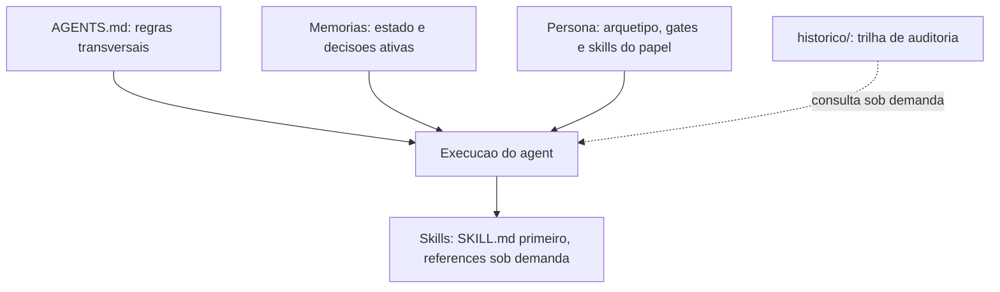

# Otimizacao de contexto dos agents e troca de modelo dos subagents utilitarios

Data: 2026-08-17

## Contexto da mudanca

O bootstrap obrigatorio (`AGENTS.md` -> `MEMORIA-COMPARTILHADA.md` -> `MEMORIA-PROJETO.md` -> persona) carregava cerca de 53,8 KB (~7.350 palavras) antes de qualquer leitura util do projeto-alvo. A medicao apontou tres fontes de desperdicio:

1. **Indice de historico na memoria geral**: 21 links de auditoria (~4,5 KB) carregados a cada execucao de cada agent, sem uso operacional e com crescimento ilimitado.
2. **Duplicacao entre camadas**: a memoria geral reescrevia em prosa regras ja normativas em `AGENTS.md` (DEC-STR-08, 09, 16, 23, 24, 25, 27), repetia a tabela de templates e repetia o diagrama de fluxo de colaboracao.
3. **Duplicacao nas personas**: 7 de 8 agents repetiam a regra de portugues do Brasil, 6 repetiam Context7, 5 repetiam `review-documentation` e 3 repetiam `protocolo-tdd`. Em `tech-lead.agent.md`, a mesma regra de "usar template X ou justificar desvio" aparecia em quatro secoes distintas.

Havia ainda risco de estouro de contexto na consulta a skills: `nestjs-best-practices`, `laravel-best-practices` e `vercel-react-best-practices` mantem arquivos internos de 94 KB a 163 KB, e o mapeamento stack -> skill apontava para o diretorio, nao para o `SKILL.md`.

Em paralelo, os dois subagents utilitarios estavam fixados em `GPT-5 mini (copilot)`.

## Decisao tomada

- Trocar o modelo de `documentation-writer.agent.md` e `commit-writer.agent.md` para `Claude Haiku 4.5 (copilot)`, atualizando as 13 referencias ao nome do modelo no pacote. As 6 personas permanecem sem `model:` fixado, herdando a selecao do editor.
- Estabelecer que cada regra e declarada **uma unica vez** na camada que a possui (`AGENTS.md` itens 36 e 37), com personas restritas a arquetipo, ownerships, gates, skills do papel e contrato de saida.
- Instituir carga lazy de skills (`AGENTS.md` item 35): ler o `SKILL.md` primeiro e nunca o diretorio inteiro.
- Mover o indice de historico da memoria geral para `historico/README.md`.
- Substituir, na memoria geral, a prosa das decisoes ja normativas por uma coluna `Regra` que aponta o item de `AGENTS.md` correspondente, preservando todos os IDs `DEC-STR-*`.
- Reduzir grants de ferramentas de `business-analyst` e `ux-expert`, removendo `execute` (papeis documentais/design sem regra que exija execucao de comando).
- `prompt-logger` permanece **obrigatorio em toda solicitacao**, sem alteracao de escopo (decisao explicita do solicitante).

## Impacto tecnico/negocio

| Arquivo | Antes | Depois | Reducao |
|---|---|---|---|
| `MEMORIA-COMPARTILHADA.md` | 18.570 B | 7.262 B | 61% |
| `tech-lead.agent.md` | 16.944 B | 10.501 B | 38% |
| `qa-expert.agent.md` | 16.320 B | 12.011 B | 26% |
| `business-analyst.agent.md` | 14.045 B | 9.826 B | 30% |
| `senior-developer.agent.md` | 13.949 B | 10.563 B | 24% |
| `ux-expert.agent.md` | 10.659 B | 8.365 B | 22% |
| `dba.agent.md` | 9.593 B | 7.185 B | 25% |
| `AGENTS.md` | 16.349 B | 17.309 B | +6% (3 regras novas) |

Bootstrap por execucao (pior caso, Tech Lead): **53.845 B -> 37.745 B (-29%)**, ja considerando as duas novas decisoes de projeto registradas nesta rodada. Nenhuma regra de governanca foi removida — apenas suas copias redundantes. `review-documentation` passa a valer exclusivamente por `AGENTS.md` item 15, que ja era obrigatorio para todos os agents.

## Proximos passos

- Auditar as skills contra `DEC-STR-32` ao portar o pacote para novos workspaces.
- Reavaliar `DEC-STR-33` em toda revisao de persona, para impedir reintroducao de duplicacao.
- Confirmar que `Claude Haiku 4.5 (copilot)` corresponde ao rotulo exato do seletor de modelos do Copilot no ambiente-alvo; rotulo desconhecido faz o Copilot cair silenciosamente no modelo padrao.

