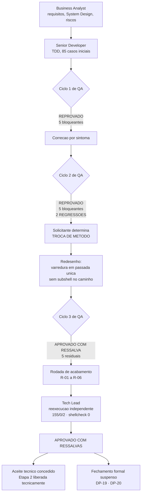

# Fechamento da Etapa 1 — camada de dominio: aceite tecnico concedido, fechamento formal suspenso

Data: 2026-08-18

## Contexto da mudanca

A Etapa 1 do projeto `dropbox_api` — camada de dominio composta por `lib/hash.sh`, `lib/errors.sh` e
`lib/path.sh`, mais o arcabouco de testes proprio — percorreu o ciclo completo do pacote: Business
Analyst produziu requisitos, System Design, riscos e funcionalidades candidatas; Senior Developer
implementou com `protocolo-tdd`; QA Expert reprovou duas vezes e aprovou na terceira com ressalva; uma
rodada de acabamento fechou os cinco achados residuais, com correcao documental do BA em paralelo.

O ciclo 2 de QA e o ponto de inflexao do processo: dos cinco bloqueantes, **dois eram regressoes das
proprias correcoes do ciclo 1** — a redacao de segredo evoluiu de vazamento para custo quadratico e
depois cubico, e o confinamento de caminho evoluiu de `$( )` publico para `$( )` na raiz e depois para
evasao por quebra de linha. O solicitante determinou entao **troca de metodo, nao correcao de
sintoma**, o que produziu `PRJ-DEC-19` e as invariantes que hoje sustentam a camada.

O Tech Lead foi acionado como ultimo gate para consolidar o fechamento.

## Verificacao independente do Tech Lead

| Verificacao | Resultado |
|---|---|
| `bash tests/run.sh` | 155 aprovados, 0 reprovados, 2 pulados — `APROVADA` (a suite comecou em 85 casos) |
| `shellcheck -x` em `lib/` e `tests/` | exit 0, 7 supressoes justificadas — `RNF-13` atendido |
| `git rev-parse --is-inside-work-tree` | `fatal: not a git repository` — confirma `DP-19` em aberto |
| Leitura de `LICENSE` | MIT com titular em espaco reservado — confirma `DP-20` e `DIV-E` em aberto |

## Decisao tomada

**Parecer: APROVADO COM RESSALVAS.** Aceite tecnico da camada de dominio concedido; fechamento formal
da entrega suspenso por bloqueios que nao pertencem a nenhum agent.

Decisoes do Tech Lead registradas nesta rodada:

- `TL-01` — **aceite concedido a faixa de codigos de saida 0..15** como contrato publico de RF-35.
  `PRJ-DEC-10` deixa de ser proposta e passa a Ativa. A condicao imposta pelo QA (coerencia entre
  classe de erro e politica de retentativa) foi corrigida em `PRJ-DEC-20` e verificada, e ha teste que
  reprova qualquer mudanca de valor.
- `TL-02` — **`DIV-17` reconciliada.** RF-35 na v0.4 registrava a faixa como aceita pelo solicitante,
  enquanto `PRJ-DEC-10` marcava o aceite do Tech Lead como pendente. Nao era contradicao de fato: eram
  dois gates distintos registrados como se fossem um. Ambos os registros passam a dizer a mesma coisa.
- `TL-03` — ampliacao de escopo do confinamento local ratificada (`PRJ-DEC-18`, `RNF-20` v0.4).
- `TL-04` — `C2-08` homologado sem ressalva: `stdin` transita por `$TMPDIR` em blocos de 4 MiB, com
  arquivos 0600 sob area 0700. Reverte a decisao de desenho D2 original. A dispensa de nota
  operacional determinada pelo solicitante foi respeitada.
- `TL-05` — TOCTOU aceito como risco residual documentado (`RSK-24`), a revisitar quando `DP-07` fechar.
- `TL-06` — desvio de Cypress homologado (item 13 do protocolo comum): sem interface web ou grafica.
- `TL-07` — desvio do template de validacao QA de frontend homologado (itens 17 e 19): sem frontend e
  sem Design System.
- `TL-08` — ausencia de artefatos `.md` do QA e de acionamento do `prompt-logger` pelo QA homologada
  **com compensacao obrigatoria**, por ter decorrido de instrucao do proprio Tech Lead. Produzido
  registro retroativo de validacao QA, explicitamente rotulado como reconstrucao e nao como parecer
  original. **Gate instituido: a partir da Etapa 2, nenhum ciclo de QA fecha sem artefato proprio e sem
  log de prompt.**
- `TL-09` — **gate de processo instituido a partir de `RSK-25`**: toda premissa de plataforma,
  ambiente, dependencia externa ou escopo que restrinja a implementacao deve ser levantada como pedido
  de decisao ao solicitante **antes** de ser implementada, e nao pode ser registrada como decisao do
  solicitante. Observacao de ambiente (`stack detectada`) nao e decisao de escopo.

Registro obrigatorio: as condicoes de consumo `R-01` (separador interno consumido do texto, permitindo
contornar a redacao por byte de controle na chave) e `R-02` (aspa escapada encerrando o mascaramento
cedo) constam como **condicao SATISFEITA**, verificada de forma independente, e nao como pendencia
herdada pela Etapa 2. `lib/http` esta liberado para alimentar `dbx_errors_redigir` com corpo real da
API. A condicao que permanece para a Etapa 2 e outra: `RNF-22`.

## Impacto tecnico/negocio

- O componente de maior risco tecnico do projeto — o `content_hash`, base de F-02 — esta implementado,
  conferido contra oraculo independente e contra o vetor oficial da Dropbox, e deixou de ser gargalo:
  ~320 MB/s com memoria plana em ~8 MiB (100 GiB em ~5,4 min, contra as ~2 h estimadas antes da
  medicao).
- Quatro invariantes arquiteturais nasceram dos ciclos de QA e valem para todas as etapas seguintes:
  `PRJ-DEC-12` (resultado por variavel, nao por substituicao de comando), `PRJ-DEC-13` (sem cano no
  caminho de calculo), `PRJ-DEC-14` (agregado da suite por canal proprio, sem `eval`) e `PRJ-DEC-19`
  (sem `$( )` no componente de caminho).
- O risco dominante do projeto **deixou de ser tecnico e passou a ser de governanca**: sete entregas
  acumuladas sem versionamento e um arquivo de licenca sem titular, ambos resolviveis apenas pelo
  solicitante e ambos ficando mais caros a cada entrega acumulada.
- Consequencias verificadas de `DP-19`: a skill `review-documentation` exige commit que nao pode
  existir; o Gitflow do item 25 do protocolo esta suspenso; o encaminhamento por Pull Request com label
  de review e review request nativo e inexecutavel; nao ha ponto de restauracao nem historico de
  autoria.
- Pendencia de formalidade identificada nesta revisao: o item 12 do protocolo comum (`DEC-STR-07`)
  exige aprovacao explicita do solicitante sobre os testes do QA, com template proprio, e **nao ha
  registro com esse template**. A aprovacao substantiva existe nas decisoes que o solicitante tomou
  durante os ciclos; a formal, nao.

## Sinalizacao de decisao transversal

`TL-09` e candidata a decisao transversal do pacote, por tratar de gate de processo aplicavel a
qualquer projeto que use estes agents. **`MEMORIA-COMPARTILHADA.md` nao foi alterada**, por ser
compartilhada com outros projetos e por determinacao expressa do solicitante. A promocao para
`DEC-STR-*` depende de autorizacao dele.

## Proximos passos

Exclusivos do solicitante, em ordem de precedencia:

1. `DP-20` / `DIV-E` — informar o titular do copyright a constar no `LICENSE`. Precede o primeiro
   commit: definir depois obriga a concordancia de todos os autores que ja tiverem contribuido.
2. `DP-19` — autorizar `git init`, definir convencao de branches e origem remota.
3. `DP-07` — plataformas e shells, urgencia elevada. Informacao material ja apurada: o piso real e
   **bash 4.4**, nao "bash 4", o que deixa RHEL 6 (4.1) fora.
4. `DP-08`, `DP-11` e `DP-05` — bloqueiam `lib/json`, `lib/config` e o inicio pleno da Etapa 2.
5. Decisao de desenho sobre `DIV-16b` (formato de linha de RF-28/RF-35 x nome com quebra de linha),
   necessaria antes de `lib/output`.
6. Registrar a aprovacao formal sobre os testes do QA com o template previsto em `DEC-STR-07`.

