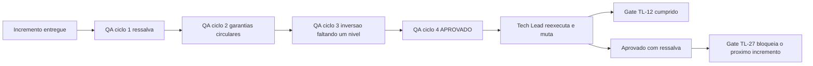

# 2026-08-18 — Fechamento do incremento 1 da Etapa 3 (`lib/preflight` + `lib/config`)

Registro de historico da memoria de projeto. Detalhamento completo em
`docs/registros/2026-08-18_revisao-consolidada-etapa-3-incremento-1.md` e
`docs/registros/2026-08-18_aprovacao-final-etapa-3-incremento-1.md`.

## Decisao

**APROVADO COM RESSALVA** (`PRJ-DEC-55`, `TL-21`). Um gate bloqueia o proximo incremento: `PRJ-DEC-60` / `TL-27`.

## Ciclos de QA — quatro, nenhuma reprovacao

| Ciclo | Decisao | Natureza dos achados |
|---|---|---|
| 1 | APROVADO COM RESSALVA | `P3-01` a `P3-05`; dois bloqueantes de comportamento |
| 2 | APROVADO COM RESSALVA | `R2-01` a `R2-04`; **nenhum defeito novo de comportamento** — as ressalvas recairam sobre a forca das garantias declaradas |
| 3 | APROVADO COM RESSALVA | `R3-01`, `R3-02`; a mesma inversao faltando um nivel abaixo |
| 4 | **APROVADO** | sem ressalva |

## Verificacao independente do Tech Lead

| Verificacao | Resultado |
|---|---|
| Suite | 305/0/2 sobre 9 arquivos; 307/0/0 com rede |
| `shellcheck` | exit 0 nos **dois** modos de invocacao |
| Permissoes de arquivo | 10 modos: 600/400/500/700 aceitos; 640/644/604/660/606/666 recusados |
| Permissoes de diretorio | 7 modos: 700/500/300/100 aceitos; 777/750/701 recusados |
| Arquivo corrompido | status 3, motivo `malformado`, **zero ocorrencias do segredo** |
| Orfaos | morto removido; vivo recente preservado; vivo antigo removido; credencial intacta |
| Ida e volta com aspas, barra invertida e quebra de linha | **exata, byte a byte** |
| `RNF-02` | 13 utilitarios removidos um a um; todos nomeados no diagnostico |
| `DP-11` | 8 variaveis de ambiente exportadas; **todas ignoradas** |
| Sonda propria: `XDG_CONFIG_HOME` com quebra de linha | caminho sobrevive; segredo intacto |

### Gate `TL-12` da Etapa 2 — CUMPRIDO

Reexecutada a **mesma mutacao M3** que definiu o gate. Antes passava 237/0/2 com `shellcheck` exit 0.
**Agora reprova: 304/1/2.** A implementacao excede o exigido: prova que discrimina antes de varrer, e o
padrao e declarado uma unica vez, usado na autovalidacao e na varredura.

### Auditoria de posicao de comando — 21 mutacoes

**17 detectadas.** **4 escaparam:** `if <comando>`, `while <comando>`, `until <comando>`, `time <comando>`.

Nao sao quatro casos avulsos: sao **uma classe** — palavra-chave cujo argumento e ele proprio um comando.
`elif` e `!` sao detectados por acidente de ja constarem da lista de separadores. `if` nunca entrou porque a
amostra do autor usa `if [[ ... ]]; then <comando>`, que e condicao de **teste**, nao de comando.
**Sem violacao viva.** Risco prospectivo e imediato: `lib/http` e onde `if curl ...; then` e a forma natural.

### Auditoria de gemeos — mutada nos dois sentidos

Guarda `%Y` acrescentada so no preflight: detectada. So no config: detectada.

## Decisoes registradas

`PRJ-DEC-55` a `PRJ-DEC-64`, correspondendo aos gates `TL-21` a `TL-33`.

Destaques:

- `TL-22` — gate `TL-12` cumprido e encerrado, verificado pela mesma mutacao que o abriu.
- `TL-23` — `DP-11` alcanca o **segredo**, nao a **localizacao**; desvio de XDG degrada para negacao de servico.
- `TL-24` — fronteira de confianca e o **usuario do sistema**; a redacao nao promete mais do que entrega.
- `TL-26` — formato JSON homologado, com a ida e volta exata sustentando a razao declarada.
- `TL-27` — **gate bloqueante do proximo incremento**: normalizador de posicao de comando.
- `TL-28` — tese elevada a gate, com formulacao afiada: derivar da **gramatica**, nao do **idioma observado**.
- `TL-29` — `RSK-28` passa a registrar **serie**, nao episodio.
- `TL-31` — a colisao de identificadores **reincidiu**; a correcao anterior foi limpeza, nao mecanismo.
- `TL-32` — registro positivo: QA corrigiu observacao propria; dev pos ressalva em dado que o favorecia.

## Correcao estrutural aplicada a esta memoria (segunda ocorrencia)

`PRJ-DEC-33` a `PRJ-DEC-41` chegaram a designar **ate quatro conjuntos distintos** de decisoes, com blocos
literalmente repetidos tres vezes. Corrigido: renumeracao das decisoes de implementacao para `PRJ-DEC-46` a
`PRJ-DEC-54`, preservando as referencias ja publicadas de 33 a 45, e remocao das duplicatas.

Estado apos a correcao: **64 decisoes, identificadores unicos e contiguos de `PRJ-DEC-01` a `PRJ-DEC-64`**.

> A correcao de `TL-19` nao sobreviveu a um unico incremento porque foi limpeza e nao mecanismo.
> Coerente com `TL-28`: enquanto a unicidade depender de alguem lembrar, ela falha.

## Bloqueios que dependem exclusivamente do solicitante

| Item | Estado |
|---|---|
| `DEC-STR-07` | 🔴 **ABERTO** — unica pendencia de formalidade, desde a Etapa 1 |
| `DP-19`, `DP-20` | ✅ **ENCERRADAS** — `LICENSE` com `Copyright (c) 2026 Adriano Sales Santos` em `master` e `develop`. Encerra `DIV-E` |
| `DP-06`, `DP-10`, `DP-12` | Abertas, de Etapa 4, sem bloquear nada |

