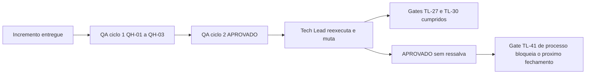

# 2026-08-18 — Fechamento do incremento 2 da Etapa 3 (`lib/http` + `lib/auth`)

Registro de historico. Detalhamento em
`docs/registros/2026-08-18_revisao-consolidada-etapa-3-incremento-2.md` e
`docs/registros/2026-08-18_aprovacao-final-etapa-3-incremento-2.md`.

## Decisao

**APROVADO, sem ressalva** (`PRJ-DEC-67`, `TL-34`). **Primeiro fechamento do projeto sem ressalva aberta.**

## Ciclos de QA — dois, zero reprovacoes

| Ciclo | Decisao | Achados |
|---|---|---|
| 1 | APROVADO COM RESSALVA | `QH-01` a `QH-03` |
| 2 | **APROVADO** | sem ressalva |

## Verificacao independente do Tech Lead

| Verificacao | Resultado |
|---|---|
| Suite | **382/0/2** sobre 12 arquivos; 384 com rede |
| `shellcheck` | exit 0 nos **dois** modos |
| Guarda de remocao de casos | exit 0 |
| Residuo em `TMPDIR` | **0 arquivos** |
| Segredo em `argv` / entrada padrao | **0 / 1** para os tres valores |
| Canais apos renovar, inclusive com o servico ecoando a requisicao | todos vazios |
| Assercoes do arcabouco neutralizadas uma a uma | **as oito reprovam** |
| Tabela do `-w` reproduzida em `curl 8.18.0` | **seis pares conferem** |

### Gates anteriores cumpridos

- **`TL-27`** — as quatro formas (`if`, `while`, `until`, `time`) agora reprovam. **Respondido acima da especificacao:** o dev derivou o conjunto de `compgen -k` em vez de acrescentar as quatro palavras pedidas, e por isso `coproc` — que **ninguem enumerou** — tambem e apanhado.
- **`TL-30`** — os sete `lib/*.sh` usam `${BASH_SOURCE[0]%/*}`. Sem `dirname`, a biblioteca carrega integra e devolve o codigo classificado 3, contra 2 antes.

### Guarda de remocao — cinco direcoes e a limitacao

Arquivo apagado (44 -> 0), remocao em arquivo da base (60 -> 57), remocao em arquivo nascido
na branch (30 -> 28), declaracao valida por trailer aceita, declaracao insuficiente recusada.
**Limitacao confirmada:** esvaziei tres casos mantendo a contagem e a suite seguiu verde em 382.

## Decisoes registradas

`PRJ-DEC-67` a `PRJ-DEC-75`, gates `TL-34` a `TL-42`.

- `TL-36` — a Dropbox **nao rotaciona** o refresh token: renovacao concorrente idempotente, sem trava, sem estado novo. E a afirmacao sobre sobrevivencia do cursor **foi retirada pelo proprio autor**, que foi a fonte, encontrou silencio e **recusou uma inferencia que o favorecia**.
- `TL-38` — regra elevada a gate: *toda regra de disciplina escrita em comentario nasce com a pergunta "qual e o conjunto de lugares onde isto incide, e quem o enumera?"*.
- `TL-39` — serie de `RSK-28`: tres ocorrencias novas apanhadas **por instrumento** contra uma por leitura. **Instancia propria do Tech Lead** incluida.
- `TL-41` — **gate bloqueante:** unicidade mecanica dos identificadores desta memoria, apos **tres** reincidencias.
- `TL-42` — registro tecnico pelo proprio autor quando o custo de revisao superar o de redacao.

## O achado que sustenta `TL-38`

A auditoria de canais encontrou **tres ocorrencias reais alem da que a motivou**, duas em
`lib/config` — componente aprovado formalmente ha varios ciclos. E o comentario que justifica
descartar a arvore do analisador **ja estava escrito no arquivo**, aplicado a um dos dois lugares:
o conhecimento estava na mesma tela, a poucas linhas.

> *"As auditorias funcionam por enumerar, nao por saber mais — a de canais nao contem nenhum
> conhecimento que os comentarios ja nao tivessem; contem a lista completa dos lugares."* — QA

Sexta e setima ocorrencias da familia de gemeos, terceira e quarta **entre arquivos**.

## Duas falhas do proprio Tech Lead nesta rodada

1. **Instrumento com falha aberta.** Minha bateria de mutacoes reportou que `$(curl ...)` escapava ao reconhecedor de captura. Era falso: a mutacao fazia chamada real de rede, estourava o tempo limite, e meu codigo convertia **ausencia de dado em zero reprovacoes**. Reexecutado, `$(curl ...)` e detectado com 4 reprovacoes. E a licao que o QA formulou no incremento anterior — desconfiar de silencio — violada pelo papel que a cobra.
2. **Terceira colisao de identificadores.** `PRJ-DEC-42` e `PRJ-DEC-43` voltaram a designar dois pares distintos. Renumerados para `PRJ-DEC-65` e `PRJ-DEC-66`. Duas limpezas manuais e dois avisos nao bastaram: e ausencia de instrumento, nao desatencao.

## Delegacao documental: quatro em quatro

As quatro delegacoes ao `documentation-writer` produziram, nas quatro, fabricacao de fato
verificavel. Nesta rodada foram **cinco itens de uma vez**: dois nomes de contexto inexistentes
e as tres definicoes de `DP-06`, `DP-10` e `DP-12` trocadas por invencoes. Todas corrigidas na
revisao. Sustenta `TL-42` e a decisao do dev de escrever os proprios registros.

## Bloqueios que dependem do solicitante

| Item | Estado |
|---|---|
| `DEC-STR-07` | 🔴 **ABERTO** — unica pendencia de formalidade, desde a Etapa 1 |
| `DP-06`, `DP-10`, `DP-12` | Abertas, de Etapa 4, sem bloquear nada |

