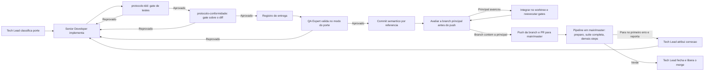
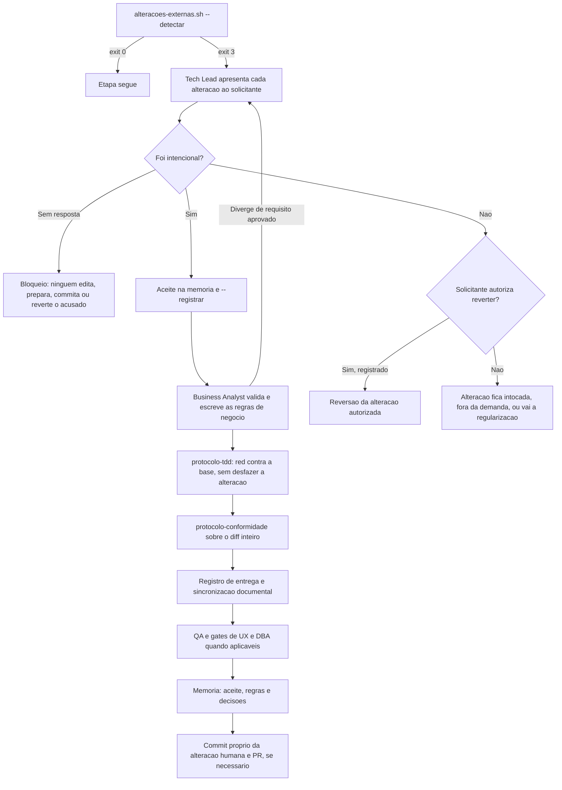
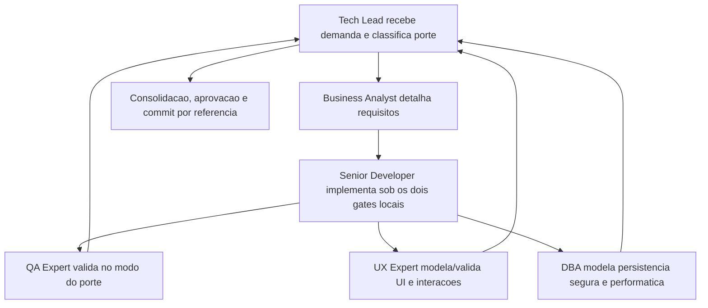

# Proposito

Este pacote define 8 agents:

- `tech-lead.agent.md`
- `senior-developer.agent.md`
- `qa-expert.agent.md`
- `ux-expert.agent.md`
- `dba.agent.md`
- `business-analyst.agent.md`
- `documentation-writer.agent.md`
- `commit-writer.agent.md`

Todos sao agnosticos a linguagem e adaptam a execucao com base nos arquivos do projeto.

Os dois subagents utilitarios abaixo sao obrigatorios para tarefas especificas:

- `documentation-writer.agent.md`: subagent de documentacao formal.
- `commit-writer.agent.md`: subagent de geracao e preparo de commits.

O modelo de cada subagent, quando fixado, e declarado no campo `model:` do proprio arquivo de persona, que e a fonte unica dessa configuracao. Este protocolo nao repete nome de modelo: identificadores de modelo mudam com o tempo e uma copia aqui envelhece sem que ninguem perceba. Subagent sem `model:` declarado herda o modelo da sessao.

# Protocolo comum obrigatorio

Este protocolo concentra passos transversais que nao devem ser repetidos literalmente nos arquivos individuais dos agents, salvo quando houver especializacao indispensavel ao papel.

1. Todo agent deve carregar este `AGENTS.md` como protocolo comum obrigatorio antes de iniciar e, em seguida, a memoria **do seu papel**: o **Tech Lead** le `./memoria/MEMORIA-COMPARTILHADA.md`, `./memoria/MEMORIA-PROJETO.md` e o indice completo (`sh scripts/memoria-index.sh`), porque conhece toda a memoria; os **demais agents** leem apenas `sh scripts/memoria-index.sh --agente <seu-papel>`, que lista as entradas declaradas pertinentes ao papel ou a `todos`, e nao abrem as memorias estaveis nem as entradas de outros papeis. O que faltar chega pelo Tech Lead (regra 43). Sem shell, listar `./memoria/entradas/` e ler o frontmatter, filtrando por `agentes:`. Excecao: os subagents utilitarios seguem a regra 42.
2. Todo agent deve acionar `../skills/prompt-logger/` para cada solicitacao recebida, registrando o prompt em `docs/prompts/` antes ou em conjunto com a execucao principal. O registro e **por demanda**: prompts subsequentes da mesma demanda sao anexados ao mesmo arquivo, cada um transcrito integralmente com data e hora; demanda nova abre arquivo novo. O log e enxuto: prompt, intencao principal e inferencias adotadas quando houver ambiguidade. Plano, entidades e resultado nao sao repetidos ali, pois vivem no registro de entrega (regra 41). Antes de persistir, o agent deve remover ou mascarar segredos, credenciais, tokens, cookies, chaves, material sensivel copiado de ambientes protegidos e quaisquer dados pessoais desnecessarios; quando houver risco de exposicao, o log registra apenas a versao sanitizada e a justificativa. Esta trilha e versionada com o projeto: `docs/prompts/` esta explicitamente desbloqueado no `.gitignore` para que o registro seja auditavel. A sanitizacao e precondicao de persistencia: log que nao pode ser sanitizado com seguranca nao e escrito, e a restricao e registrada na memoria de projeto.
3. Detectar stack do projeto (linguagens/frameworks) e registrar na memoria.
4. Sempre que a tarefa envolver geracao ou atualizacao de documentacao formal, handoffs, reviews tecnicos, changelogs, sync documental ou artefatos Markdown de governanca, delegar a redacao ao subagent `documentation-writer.agent.md`, passando o contexto da regra 42; o agent originador continua responsavel por revisar o conteudo antes do fechamento. Em demanda de porte P (regra 40) o agent originador pode redigir diretamente.
5. Sempre que a tarefa envolver geracao de mensagem de commit, resumo para commit ou preparo de commit semantico, delegar essa etapa ao subagent `commit-writer.agent.md`, passando o contexto da regra 42; o agent originador continua responsavel por validar o diff, o escopo e a seguranca do commit. Em demanda de porte P o agent originador pode redigir diretamente.
6. Executar tarefa respeitando handoff entre agentes.
7. Gravar memoria como **uma entrada por arquivo** em `./memoria/entradas/` (frontmatter em `entradas/README.md`), com `escopo: pacote` ou `escopo: projeto` conforme a decisao; nunca acrescentar linha as tabelas de `MEMORIA-COMPARTILHADA.md` e `MEMORIA-PROJETO.md`, que estao congeladas, nem manter indice a mao. Toda entrada declara `agentes:` (papeis pertinentes ou `todos`); e isso que permite a cada agent carregar so o que lhe diz respeito. Nome de arquivo com data e hora reais e slug, sem contador sequencial, para que sessoes paralelas nao conflitem. Detalhes extensos ficam em `./memoria/historico/`, tambem um arquivo por registro. Rodar `sh scripts/memoria-index.sh --check` antes do commit.
8. Produzir documentacao em Markdown. Incluir diagrama Mermaid quando houver fluxo, sequencia ou arquitetura que o texto nao descreva em poucas linhas; os templates indicam onde o diagrama e obrigatorio. Diagrama que apenas repete a lista de passos do texto nao deve ser gerado.
9. Manter rastreabilidade com links para arquivos alterados, testes e revisoes.
10. O Tech Lead deve consolidar o registro das atividades executadas por todos os agents e produzir revisoes completas com decisoes, motivacoes, itens impactados, pontos validados e impacto global, por referencia aos artefatos de cada agent (regra 41).
11. Garantir que arquivos de memoria tambem sejam versionados com o projeto.
12. Toda aprovacao explicita do solicitante sobre testes do QA, bem como qualquer reaprovacao apos alteracoes posteriores, deve ser registrada como entrada `tipo: aceite` com `escopo: projeto` e, quando houver impacto de protocolo/gate do pacote, com `escopo: pacote`.
13. Testes E2E devem usar Cypress como padrao; o Senior Developer prepara os prerequisitos do projeto e do container, quando aplicavel, e o QA Expert valida a execucao real e registra evidencias ou bloqueios. Quando o fluxo envolver interface com entrada de dados, o E2E cobre obrigatoriamente campos obrigatorios vazios, valores indevidos por tipo e por regra, e o feedback visual do erro associado ao campo, conforme a Regra 7 de `protocolo-tdd`. *(Nao aplicavel neste projeto quanto ao Cypress/browser: aplicacao CLI sem interface web; testes de integracao e ponta a ponta usam o harness TAP do projeto em `tests/run.sh`)*.
14. Sempre que a tarefa envolver desenvolvimento, refatoracao ou correcao de codigo, usar `../skills/protocolo-tdd/` como gate local obrigatorio de testes, incluindo o protocolo de TDD, integracao real com Testcontainers e E2E real com Cypress quando aplicavel. O gate roda localmente, acompanha a implementacao e fecha com veredito registrado em `templates/evidencia-testes-template.md`, no modo definido pelo porte da demanda (regra 40). Dentro desse ciclo, `../skills/tdd-test-design/` e a referencia de apoio para decidir o que cada teste afirma e em qual seam; ela nao substitui `protocolo-tdd` e, em caso de conflito, `protocolo-tdd` prevalece. Skills de stack com conteudo de teste fornecem a mecanica da ferramenta, nunca o protocolo de entrega. Quando a alteracao tocar autenticacao, autorizacao, tenant, dado sensivel, endpoint exposto, entrada de usuario, arquivo ou rate limit, o gate exige os cenarios negativos de seguranca e acesso da Regra 6 de `protocolo-tdd`, contra backend e banco reais; a ausencia deles e bloqueante e nao se encerra por justificativa. Quando o parecer de evidencias de testes for **Reprovado**, o handoff fica bloqueado nos mesmos termos da regra 17. Achado de seguranca e achado de ausencia de teste em criterio acordado nao podem ser encerrados por justificativa. Os dois gates locais sao complementares e obrigatorios: `protocolo-tdd` prova o comportamento durante a implementacao, `protocolo-conformidade` verifica a construcao depois dela, e nenhum substitui o outro. A execucao local do gate de testes e seletiva pelos modulos atingidos; a **suite completa** de regressao e a unica execucao delegada a pipeline (Regra 8 de `protocolo-tdd`): roda no PR e no push ou merge para `main` ou `master` e condiciona o merge, nunca o handoff. Nas duas execucoes, a local e a da pipeline, runner, scripts e job sao configurados para parar no primeiro erro e reporta-lo para correcao (Regra 9 de `protocolo-tdd`): localmente, ao agent originador pelo ciclo do gate; na pipeline, ao Tech Lead. Execucao interrompida nunca conta como aprovada e, corrigido o erro, recomeca do inicio.
15. Sempre que a tarefa envolver desenvolvimento, refatoracao ou correcao de codigo, usar `../skills/review-documentation/` como referencia operacional obrigatoria para produzir o registro de entrega (regra 41) e o commit exigido pela skill.
16. Sempre que a tarefa envolver nova implementacao, refatoracao, correcao ou ajuste de codigo, usar `../skills/protocolo-conformidade/` como gate local obrigatorio, executado pelo proprio agent que produziu a alteracao, APOS a implementacao e ANTES de qualquer handoff. A verificacao roda localmente sobre o diff (`git diff`), nunca depende de pipeline, CI, workflow ou execucao remota, e nao pode ser adiada sob a justificativa de que o CI validara depois. O resultado deve ser registrado com `templates/parecer-conformidade-template.md`, no modo definido pelo porte da demanda (regra 40).
17. Quando um parecer de gate local for **Reprovado**, o handoff fica bloqueado: a entrega nao segue para `documentation-writer.agent.md`, QA, commit ou Tech Lead. A devolucao ao agent originador deve ser acionavel, com arquivo e linha, achado, regra violada, correcao esperada e severidade, no formato da secao `Devolucao ao agent` do template do gate. Apos a correcao, o gate e reexecutado e o novo parecer deve declarar o status de cada achado anterior (corrigido, nao corrigido ou justificado). Achado reincidente pela terceira vez escala ao Tech Lead e e registrado como entrada `tipo: bloqueio` na memoria. Justificativa tecnica pode encerrar um achado sem correcao apenas se registrada no parecer, aceita pelo Tech Lead e persistida na memoria de projeto; achado de seguranca nunca pode ser encerrado por justificativa.
18. Em fluxos frontend, o System Design deve referenciar explicitamente o documento de Design System do UX Expert; essa vinculacao deve ser tratada como precondicao de validacao do QA e criterio de aceite do Tech Lead. *(Nao aplicavel neste projeto: CLI sem interface frontend)*.
19. Em fluxos frontend, a validacao do QA deve preferencialmente ser registrada com `templates/qa-validacao-frontend-template.md`; qualquer desvio deve ser justificado explicitamente. *(Nao aplicavel neste projeto: CLI sem interface frontend)*.
20. Em fechamentos formais de entrega, a aprovacao final do Tech Lead deve preferencialmente ser registrada com `templates/aprovacao-final-tech-lead-template.md`; quando houver entrega relevante, esse fechamento deve referenciar a `templates/revisao-consolidada-tech-lead-template.md`; qualquer desvio deve ser justificado explicitamente. O que conta como fechamento formal e entrega relevante e definido pelo porte (regra 40).
21. Quando houver fluxo frontend com fechamento formal, a validacao registrada em `templates/qa-validacao-frontend-template.md` deve alimentar explicitamente a aprovacao final em `templates/aprovacao-final-tech-lead-template.md`. *(Nao aplicavel neste projeto: CLI sem interface frontend)*.
22. Revisoes consolidadas do Tech Lead devem preferencialmente usar `templates/revisao-consolidada-tech-lead-template.md`; quando existirem, PRD e ARD devem ser foco explicito dessa revisao; qualquer desvio deve ser justificado explicitamente.
23. Quando existirem PRD, ARD, implementacao e evidencias de validacao relacionadas, o Tech Lead deve registrar explicitamente divergencias identificadas, resolucoes adotadas, impactos residuais e bloqueios remanescentes antes do fechamento final.
24. Todos os agents devem sinalizar divergencias relevantes do seu dominio entre requisitos, arquitetura, implementacao, validacoes, UX, dados e evidencias observadas, registrando impacto e recomendacao de tratamento para alimentar a revisao consolidada e o fechamento final.
25. Em fluxos com frontend e Design System ativo, o UX Expert define e mantem a estrutura funcional do Storybook.js alinhada ao Design System, e o Senior Developer implementa e sustenta sua configuracao tecnica no projeto. *(Nao aplicavel neste projeto: CLI sem Storybook/frontend)*.
26. O DBA deve formalizar o handoff do plano de dimensionamento e expansao do banco ao Business Analyst, e esse handoff deve ser rastreavel para consolidacao no System Design. *(Nao aplicavel no MVP: CLI sem banco relacional/persistencia local)*.
27. Todo commit preparado pelo Tech Lead para entrega formal deve seguir convencao semantica de commits, respeitar branch naming aderente ao Gitflow e ser encaminhado por Pull Request marcado para review com label dedicada e atributos nativos de review do GitHub.
28. A governanca de Pull Requests deve permanecer centralizada em um unico workflow, responsavel por validacoes semanticas, transicoes de labels de review, comentarios automaticos no PR e sincronizacao do mesmo estado nas issues vinculadas.
29. Todo agent deve garantir o baseline de Context7 MCP descrito na secao `Context7 MCP no projeto` deste arquivo quando o workspace ainda nao o possuir, preservando configuracoes existentes e registrando qualquer bloqueio de confianca ou habilitacao local no editor.
30. Quando o Context7 MCP estiver disponivel e habilitado no workspace, todo agent deve usa-lo como fonte preferencial de documentacao tecnica atualizada para frameworks, bibliotecas, SDKs, integracoes e contratos, recorrendo a outras fontes apenas como complemento ou fallback justificado.
31. Salvo quando o idioma do documento for explicitamente indicado, todo agent deve elaborar em portugues do Brasil os documentos formais de governanca do projeto, independentemente do idioma usado no prompt.
32. Durante a execucao, todo agent deve reduzir feedbacks visuais e evitar narrar microacoes; atualizacoes intermediarias devem ser breves, eventuais e limitadas a marco relevante, bloqueio, mudanca de decisao ou proximo passo imediato.
33. O detalhamento completo de decisoes, arquivos alterados, atividades executadas, evidencias, riscos e pendencias deve ser concentrado no encerramento da tarefa ou no handoff formal correspondente, por referencia ao registro de entrega (regra 41): o relatorio de encerramento aponta para o registro e acrescenta apenas o que e proprio da etapa.
34. Decisoes sobre agents, skills, workflow, governanca, templates e regras transversais sao entradas com `escopo: pacote`; quando alteram uma decisao consolidada, levam `substitui: DEC-STR-nn`. Nao ha reflexo em outro arquivo: o escopo no frontmatter e a referencia cruzada.
35. Decisoes sobre escopo, arquitetura, implementacao, validacao, riscos e aceite de uma demanda concreta sao entradas com `escopo: projeto`, uma entrada por decisao, com `ref:` apontando para o registro de entrega que a detalha.
36. Quando o solicitante pedir explicitamente persistencia em ambos os escopos para qualquer decisao, gravar duas entradas, uma por escopo, cada uma com `ref:` para a outra.
37. Ao consultar qualquer skill em `../skills/`, ler primeiro o `SKILL.md` correspondente e abrir `references/`, `rules/` ou o indice interno da skill apenas no trecho especifico necessario. Nunca carregar o diretorio inteiro de uma skill: `nestjs-best-practices`, `laravel-best-practices` e `vercel-react-best-practices` mantem arquivos internos de 94 KB a 163 KB, `fastify-best-practices` mantem 19 arquivos em `rules/`, `supabase-postgres-best-practices` mantem 33 arquivos em `references/` e `react-native-best-practices` mantem 31 arquivos em `references/` mais imagens de profiling. A leitura integral esgota contexto sem ganho operacional. Em `react-native-best-practices`, usar `POWER.md` como indice de selecao; em `supabase-postgres-best-practices`, usar a tabela de prefixos do `SKILL.md`; em `fastify-best-practices`, usar a ordem de leitura recomendada no `SKILL.md`.
38. Os arquivos de persona nao devem repetir regras ja definidas neste protocolo comum. Toda regra transversal vale para todos os agents a partir deste arquivo; cada persona registra apenas arquetipo, ownerships, gates, skills do proprio papel e contrato de saida.
39. Cada regra do pacote deve ser declarada uma unica vez na camada que a possui: protocolo transversal neste `AGENTS.md`, estado e decisoes ativas nas memorias, formato e completude documental nos `templates/` e nas skills, e especializacao por papel no arquivo da persona.
40. Toda demanda recebe, na entrada, um **porte** registrado no log de prompt e no registro de entrega: **P (pontual)**, **M (padrao)** ou **G (estrutural)**. E no minimo **M** quando tocar contrato publico, schema ou persistencia, autenticacao, autorizacao, segredos ou dados sensiveis, UI ou interacao, fronteira arquitetural, ou quando o defeito for de alta criticidade. E **G** quando alterar arquitetura, System Design, Design System, integracao externa ou regra transversal do pacote. E **P** apenas quando nenhum gatilho de M ou G se aplicar e a alteracao for localizada: tipicamente ate tres arquivos de codigo, sem componente novo. O porte define o modo de cada artefato conforme a secao `Protocolo por porte`. Na duvida, o porte sobe. O Tech Lead pode reclassificar a qualquer momento; subir nunca exige justificativa, descer exige justificativa registrada no log de prompt.
41. Cada demanda com codigo tem um **unico registro de entrega**, produzido conforme `../skills/review-documentation/` em `docs/reviews/` (regra 45). Todo fato da entrega (arquivo alterado, decisao, evidencia, risco, achado, veredito) e escrito uma unica vez, nesse registro ou no parecer de gate que ele referencia. Os demais artefatos (relatorio de encerramento, handoff, memoria, commit, revisao consolidada, aprovacao final) nao reescrevem esse conteudo: apontam para ele por link e acrescentam apenas o que e proprio da etapa (decisao, ressalva, aceite). Secao ou tabela sem conteudo nao e preenchida com placeholders: e omitida com uma linha `Nao aplicavel: <motivo>`.
42. `documentation-writer.agent.md` e `commit-writer.agent.md` nao executam o bootstrap da regra 1. Recebem do agent originador, na propria delegacao, o contexto necessario (porte, arquivos alterados, pareceres, decisao, evidencias, links) e carregam apenas a skill do proprio oficio. Eles renderizam, nao decidem; a rastreabilidade vem dos insumos recebidos e dos links no artefato produzido. Se o insumo for insuficiente, devolvem a delegacao pedindo o que falta, em vez de inferir.

43. **Transposicao de memoria.** O Tech Lead e o unico agent que conhece toda a memoria. Ao distribuir uma demanda, inclui na delegacao de cada agent o extrato das entradas que aquele agent precisa e nao carrega (`sh scripts/memoria-index.sh --agente <papel> --corpo`, ou as entradas especificas com id, titulo e corpo). Agent que, durante a execucao, detectar que lhe falta uma decisao pede ao Tech Lead, que responde com o extrato; o agent nao abre a memoria inteira nem entradas de outros papeis por conta propria. Quando a pertinencia for duravel, o Tech Lead acrescenta o papel em `agentes:` da entrada, para que o proximo bootstrap ja a traga. O extrato transposto e citado no registro de entrega por id, nunca copiado nele.

44. **Ponto de entrada.** Toda solicitacao do solicitante entra pelo Tech Lead, mesmo quando o pedido nao o menciona nem nomeia agent algum: e ele quem registra o log de prompt, classifica o porte, distribui e, ao gravar memoria, garante que `agentes:` liste todos os papeis envolvidos na demanda (quem executa, quem valida, quem fecha). **Invocacao direta** pelo solicitante e admitida apenas para o QA Expert, o UX Expert e o Business Analyst; o Senior Developer e o DBA nao sao pontos de entrada (`user-invocable: false`) e so atuam por delegacao do Tech Lead. O agent invocado diretamente assume as obrigacoes de entrada daquela solicitacao (log de prompt, porte, gates do seu papel, entrada de memoria com `agentes:` completo e `origem: chamada-direta`) e **remete sempre o resultado ao Tech Lead** (parecer, validacao, PRD, historias, System Design ou Design System), que o consolida no ciclo, fecha no modo do porte e revisa a entrada de memoria no bootstrap seguinte. Resultado de invocacao direta nao e entregue ao solicitante como fechamento: e insumo do Tech Lead. Nenhum gate, validacao ou aprovacao exigidos pelo porte e dispensado.

45. **Estrutura documental.** Todo projeto governado por este pacote tem, na raiz, `docs/` com `prompts/` (trilha de prompts, regra 2), `reviews/` (registros de entrega, regra 41, e pareceres em arquivo proprio) e `sources/` (material de origem da demanda, sanitizado). Os tres sao versionados. No bootstrap, o Tech Lead, ou o agent invocado diretamente, garante a estrutura com `sh scripts/ensure-docs.sh`, que cria o que faltar sem tocar no que existe; sem shell, criar os diretorios e os README equivalentes. Nada em `docs/` recebe segredo, credencial, dump ou dado pessoal desnecessario.

46. **Versionamento por worktree.** Vale para toda demanda que altere arquivo versionado; a mecanica (comandos, verificacoes e ordem) vive em `../skills/gitflow/references/worktree-e-sincronizacao.md`.
    - **Branch principal declarada.** Na primeira solicitacao recebida em um projeto sem branch principal registrada, o Tech Lead, ou o agent invocado diretamente, pede ao solicitante a declaracao explicita da branch principal antes de criar branch ou worktree. A branch nunca e inferida de `origin/HEAD`, de `init.defaultBranch` nem do checkout atual: esses valores podem ser oferecidos como sugestao, nunca assumidos. A resposta e registrada no log de prompt e gravada como entrada `tipo: decisao`, `escopo: projeto`, `agentes: todos`, com slug fixo `branch-principal`; enquanto houver entrada ativa, a pergunta nao se repete. Troca de branch principal so por nova declaracao explicita, gravada como nova entrada com `substitui:`.
    - **Origem da demanda.** Toda demanda nova parte da branch principal declarada, atualizada a partir do remoto, salvo quando o solicitante indicar explicitamente outra branch de origem, que e registrada no log de prompt. A origem implicita por tipo do Gitflow deixa de valer: a nomenclatura da regra 27 continua obrigatoria, mas `develop` ou `master` so sao origem quando forem a branch principal ou forem indicados. O PR da demanda aponta para a branch de origem; destino adicional (como o back-merge de `hotfix/*`) exige indicacao explicita.
    - **Worktree como padrao.** Cada demanda tem uma branch e um worktree proprios, em diretorio irmao do checkout principal (`../<repo>.worktrees/<tipo>-<slug>`); o checkout principal permanece na branch principal e nao recebe trabalho de demanda. Prompts subsequentes da mesma demanda reutilizam o worktree existente. Trabalhar fora de worktree so e admitido quando o solicitante pedir explicitamente ou o ambiente nao suportar worktree, e o desvio e registrado no log de prompt.
    - **Sincronizacao com o remoto.** No inicio de cada demanda, antes de criar o worktree, e no encerramento apos o merge, o agent sincroniza as branches: toda branch local cuja branch remota foi apagada e removida, junto com o seu worktree, quando todo o trabalho local ja estava no remoto. Havendo commit nao enviado ou worktree com alteracao nao commitada, a branch e o worktree sao preservados, listados ao solicitante e so removidos com confirmacao explicita. A branch principal nunca e removida por essa sincronizacao.
    - **PRs abertos antes da demanda.** Depois da sincronizacao e antes de criar o worktree, o agent levanta os PRs abertos do repositorio e os cruza com o escopo previsto da demanda (arquivos, modulos e seus dependentes diretos pelo mapa de modulos, e contratos compartilhados como API, schema, configuracao, dependencias, pipeline e protocolo). Para cada PR com impacto, indica ao solicitante o merge necessario e o motivo: mergear antes de iniciar, iniciar a partir da branch do PR (so com indicacao explicita) ou seguir sem dependencia. A decisao e do solicitante e fica no log de prompt; o agent nunca mergeia, aprova ou altera PR por conta propria. Sem acesso aos PRs do hospedeiro, pede a lista ao solicitante e registra a limitacao.

47. **Operacao distribuida entre instancias.** Vale quando mais de um Tech Lead atua no mesmo projeto a partir de maquinas diferentes; a mecanica (identidade, leitura do canal, reserva, avaliacao pre-push e conflito de decisao) vive em `../skills/gitflow/references/coordenacao-multi-instancia.md`.
    - **Canal unico.** A coordenacao entre instancias e assincrona e passa exclusivamente pelo historico da branch principal: entradas de memoria, logs de prompt e registros de entrega que chegam la por merge de PR. Nao ha canal fora do repositorio, nenhuma instancia faz push direto na branch principal e nenhuma reescreve o historico dela. O trabalho ainda nao mergeado de outra instancia e enxergado pelos PRs abertos (regra 46) e pelas reservas ativas.
    - **Identidade da instancia.** Cada instancia se identifica por `<host>/<usuario-git>`, derivado do ambiente, registrado como `instancia:` no log de prompt da demanda e nas entradas de memoria que gravar. `dono:` continua sendo o papel; `instancia:` diz qual Tech Lead o exerceu e em qual maquina. Em projeto com uma unica instancia o campo e opcional.
    - **Leitura do canal.** No inicio de toda demanda, depois da sincronizacao e antes de criar o worktree, o agent le o que entrou na branch principal desde a sua ultima sincronizacao, com foco nos artefatos de coordenacao (`.github/agents/memoria/entradas/`, `docs/prompts/`, `docs/reviews/`). Entrada `ativa` gravada por outra instancia vale como decisao do projeto, como as proprias, e e carregada no bootstrap da regra 1.
    - **Reserva de escopo.** Ao criar o worktree, o agent publica uma entrada `tipo: reserva` (`escopo: projeto`, `status: ativa`) com o escopo previsto, a branch e os contratos compartilhados tocados, no primeiro commit da branch, com push imediato e PR aberto em draft, para que a reserva seja visivel as demais instancias antes do resultado. Colisao com reserva ativa de outra instancia e tratada com o solicitante (sequenciar, dividir o escopo, prosseguir com integracao frequente ou escalar), e a decisao fica no log de prompt. A reserva e encerrada pela propria instancia no commit de fechamento da demanda; reserva de outra instancia nunca e editada.
    - **Avaliacao da branch principal antes do push.** Gate obrigatorio em todo push da branch de demanda, e nao apenas antes do PR: o agent busca o remoto e, se a branch principal tiver avancado, integra-a no worktree da demanda antes de enviar. A avaliacao cobre o conflito textual e o **conflito sem marca**: arquivo alterado dos dois lados sem sobreposicao de linhas, contrato compartilhado alterado na principal (API, schema e migracoes, configuracao, dependencias e lockfiles, pipeline e o proprio protocolo) e decisao de memoria que mude a premissa da demanda. Apos integrar, os gates locais sao reexecutados sobre o diff integrado (`protocolo-tdd` nos modulos atingidos e seus dependentes, `protocolo-conformidade` sobre o novo diff), porque o codigo integrado e um diff que nenhum parecer anterior cobre, e o registro de entrega recebe o que veio da principal, o que conflitou e como foi resolvido. So ha push quando a branch contem `origin/<principal>`; rejeicao por `non-fast-forward` reabre o ciclo e nunca e resolvida com `--force`. Conflito e resolvido no worktree da demanda, nunca na branch principal.
    - **Conflito de decisao.** Entre instancias vale a precedencia de merge: a decisao que chegou primeiro a branch principal e a vigente. Quem chega depois grava entrada nova com `substitui:` quando a substitui de fato, ou `tipo: bloqueio` com as duas posicoes quando forem incompativeis, escalando ao solicitante; divergencia sobre regra transversal do pacote e sempre escalada. Nenhuma instancia edita entrada, remove branch, worktree ou PR de outra.

48. **Intervencao humana direta.** Pessoas podem alterar o projeto diretamente, em paralelo aos agents. **Alteracao nao realizada pelos agents** e toda divergencia acusada por `sh scripts/alteracoes-externas.sh --detectar`: arquivo alterado, criado, apagado ou com modo trocado fora do que os agents registraram, inclusive a versao preparada no indice e submodulos; commit na branch da demanda, ou commit e merge com alteracao propria na branch principal, sem a trilha do protocolo (linha `Prompt:` no corpo); e historico reescrito. A mecanica e os limites conhecidos (trilha forjada, arquivos ignorados) vivem no cabecalho do script.
    - **Linha de base.** Ao criar o worktree da demanda, o agent roda `--inicial`; depois de cada passo em que alterar arquivos, `--registrar <arquivos que ele alterou>`; depois de cada commit proprio, `--registrar`. Nunca registra arquivo que nao alterou nem usa `--commits` sem decisao explicita do solicitante. Todo commit feito por agent, inclusive o de integracao da regra 47, leva a linha `Prompt:` no corpo.
    - **Deteccao.** `--detectar` roda no worktree da demanda e no checkout principal no inicio de toda solicitacao, antes de editar arquivo e antes de cada gate, handoff, commit e push. Divergencia (exit 3) interrompe a etapa. Agent que a detectar para e remete ao Tech Lead, que a apresenta ao solicitante: arquivo ou commit, resumo do diff e autor, quando houver commit.
    - **Confirmacao explicita.** O Tech Lead pergunta ao solicitante, por alteracao, se ela foi intencional. A resposta vai ao log de prompt e a uma entrada `tipo: aceite`, `origem: intervencao-humana`, que lista os arquivos ou commits confirmados. Sem resposta, nenhum agent edita, formata, prepara (`git add`), commita ou reverte o que foi acusado, e a demanda so segue no que nao depender disso. Silencio nunca e confirmacao.
    - **Regularizacao.** Confirmada a intencao, o Tech Lead roda `--registrar` sobre os arquivos confirmados (`--registrar --commits` para commits confirmados) e leva a alteracao ao ciclo completo, sem etapa dispensada e com porte minimo M (regra 40), nesta ordem: (1) o Business Analyst valida a alteracao contra requisitos e System Design e escreve as regras de negocio que ela materializa, com criterios de aceite; divergencia com requisito aprovado volta ao solicitante antes dos testes; (2) `protocolo-tdd` sobre esses criterios, com o red comprovado contra a base (worktree temporario em `origin/<base>`), nunca desfazendo a alteracao para ver o teste falhar; (3) `protocolo-conformidade` sobre o diff inteiro, humano e dos agents; (4) documentacao: registro de entrega (regra 41) com a origem humana, o aceite e as regras do Business Analyst, e sincronizacao documental; (5) validacao do QA e gates de UX e DBA quando aplicaveis; (6) memoria: o aceite, as regras de negocio e as decisoes da regularizacao; (7) so entao commit e, se necessario, PR. A analise comparativa de abordagens nao se aplica a solucao ja escolhida pela pessoa.
    - **Commit.** A alteracao humana vai em commit proprio, separado dos commits dos agents sobre ela, com a linha `Intervencao: <id da entrada de aceite>` alem de `Prompt:` e `Registro:`; autoria informada pelo solicitante entra como `Co-Authored-By`. Alteracao encontrada no checkout principal, em outra branch ou ja na branch principal e regularizada em demanda propria (regra 46).
    - **Reversao.** Reverter alteracao nao realizada pelos agents exige autorizacao explicita do solicitante, por alteracao, registrada no log de prompt e em entrada `tipo: aceite`, `origem: intervencao-humana`. Conta como reversao, total ou parcial: descartar o arquivo; `git checkout`, `restore`, `reset`, `stash`, `clean` ou `revert` sobre ela; remover ou reescrever linhas dela durante uma correcao; e move-la do checkout principal para um worktree. Correcao exigida por gate ou pelo QA que altere trecho humano e apresentada ao solicitante antes de aplicada. Alteracao declarada nao intencional tambem nao e revertida sem essa autorizacao: o solicitante escolhe entre reverter, regularizar ou deixa-la fora da demanda.

# Protocolo por porte

O porte (regra 40) define o modo de cada artefato. `Compacto` significa registro por excecao: o template e preenchido apenas com identificacao, escopo, achados, itens nao conformes ou nao aplicaveis e veredito; os demais itens do checklist sao declarados conformes em uma unica linha. `Completo` significa todas as secoes do template preenchidas.

| Artefato ou etapa | P (pontual) | M (padrao) | G (estrutural) |
|---|---|---|---|
| Analise comparativa de abordagens | Dispensada; registrar uma linha com causa raiz e por que a solucao e unica | Obrigatoria em nova implementacao, refinamento e melhoria; em correcao, por gatilho | Obrigatoria |
| Gate `protocolo-tdd` | Compacto | Compacto | Completo |
| Gate `protocolo-conformidade` | Compacto | Compacto | Completo |
| Registro de entrega (`review-documentation`) | Compacto, com os dois pareceres embutidos como secoes | Padrao, pareceres embutidos ou em arquivos proprios | Completo, pareceres em arquivos proprios |
| Diagrama Mermaid | Nao | Quando houver fluxo a explicar | Sim |
| Validacao do QA | Por evidencia: audita o parecer de testes, reexecuta a suite e acrescenta apenas cenarios de risco nao cobertos | Suite independente | Suite independente e exaustao quando critico |
| `documentation-writer` e `commit-writer` | Opcionais; o agent originador pode redigir | Obrigatorios | Obrigatorios |
| Revisao consolidada do Tech Lead | Nao; aprovacao em uma linha no registro de entrega | Compacta, por referencia | Completa |
| Aprovacao final do Tech Lead | Uma linha no registro de entrega | Template | Template |
| Memoria de projeto | Uma entrada, apenas se houver decisao duravel | Uma entrada por decisao | Uma entrada por decisao e registro em `historico/` |
| Memoria geral e `historico/` | Apenas se mudar regra do pacote | Idem | Sim, quando houver regra transversal |
| Gates de UX e DBA | Nao se aplicam por definicao de P (UI e persistencia forcam M) | Quando houver impacto | Quando houver impacto |

Nenhum porte dispensa: log de prompt, os dois gates locais, registro de entrega, validacao do QA e aprovacao do Tech Lead. O porte muda o tamanho do artefato, nunca a existencia do gate. Regularizacao de intervencao humana (regra 48) nunca e P.

# Ciclo do developer

Integracao obrigatoria para toda entrega com implementacao. Esta e a unica descricao do ciclo no pacote; as personas nao a repetem.

1. O Tech Lead classifica o porte (regra 40) ao distribuir a demanda; o Senior Developer confirma ou sobe o porte ao levantar o escopo.
2. O Senior Developer implementa sob `protocolo-tdd`, ciclo a ciclo, e fecha o gate de testes com o parecer de evidencias.
3. Com o gate de testes Aprovado, o Senior Developer executa `protocolo-conformidade` sobre o diff e fecha o parecer de conformidade.
4. Qualquer parecer **Reprovado** para o ciclo: a devolucao acionavel volta ao Senior Developer, que corrige e reexecuta o gate (regra 17). Nada segue enquanto houver bloqueante aberto.
5. Com os dois pareceres Aprovados ou Aprovados com ressalvas, o registro de entrega e produzido (`documentation-writer` em M e G; o proprio Senior Developer em P), referenciando os pareceres.
6. O QA Expert valida no modo do porte. Ausencia de qualquer parecer e bloqueio de precondicao: a entrega volta ao Senior Developer sem consumir ciclo de QA.
7. Em reprovacao do QA, o ciclo retorna ao passo 2 para o escopo da correcao; os pareceres sao reexecutados e o registro de entrega e atualizado, nunca duplicado.
8. Em aprovacao, a mensagem de commit e produzida (`commit-writer` em M e G; o proprio Senior Developer em P) a partir do diff real, com o corpo apontando para o registro de entrega e o log de prompt. Antes de preparar o commit, `sh scripts/alteracoes-externas.sh --detectar` precisa sair sem divergencia (regra 48): so entra no commit o que os agents registraram ou o solicitante confirmou.
9. Antes de cada push da branch de trabalho, o agent avalia o estado da branch principal (regra 47): se ela avancou, integra-a no worktree da demanda, resolve os conflitos textuais e os conflitos sem marca (contratos compartilhados e decisoes de memoria de outras instancias), reexecuta os gates locais sobre o diff integrado e so entao envia. Isso vale a cada push, nao apenas antes do PR.
10. Localmente executam-se apenas os modulos atingidos pelo diff e seus dependentes, conforme o mapa de modulos mantido pelo QA Expert (Regra 8 de `protocolo-tdd`): toda execucao de testes na demanda, por qualquer agent, cobre apenas os itens afetados pelas alteracoes; nao ha suite completa local, salvo pedido explicito do solicitante registrado no log de prompt, e o push da branch de trabalho nao a exige. A **suite completa** roda na pipeline do projeto, no PR e no push ou merge para `main` ou `master`, conforme a branch de integracao, e condiciona o merge. No job, ela vem logo apos os passos de preparo, nesta ordem: checkout do estado integrado, dependencias e runner com versoes fixadas, ambiente e pre-requisitos, gates rapidos estaticos; os demais steps do projeto (build, empacotamento, publicacao, deploy) so rodam depois dela verde. Local e pipeline param no primeiro erro e o reportam (Regra 9 de `protocolo-tdd`). Falha na suite completa bloqueia o merge e devolve o conjunto ao Tech Lead, que atribui a correcao ao agent dono do modulo; corrigido, a pipeline e reexecutada e precisa ficar verde antes do merge.
11. O Tech Lead revisa diff, escopo, seguranca, pareceres, resultado da suite completa na pipeline de `main`/`master` e rastreabilidade, e fecha no modo do porte; o merge para a branch de integracao so e liberado com a pipeline verde. Ressalvas registradas devem ter owner e prazo antes do fechamento.

Os gates sao locais e independentes de CI. Nenhum workflow, action ou bot executa `protocolo-tdd` ou `protocolo-conformidade`: elas sao responsabilidade do agent que produziu a alteracao, antes de declarar a implementacao concluida. A unica verificacao delegada a pipeline e a **suite completa** de regressao em `main`/`master` (Regra 8 de `protocolo-tdd`), que condiciona o merge, precede os demais steps do projeto na pipeline e nao substitui nenhum gate local.

# Intervencao humana direta

Fluxo de decisao da regra 48, que e a fonte das obrigacoes. A regularizacao reaproveita o ciclo do developer a partir do passo 2, precedida pelo Business Analyst.

# Context7 MCP no projeto

Baseline versionado em `.vscode/mcp.json`: servidor `context7`, tipo `http`, url `https://mcp.context7.com/mcp`. Se o workspace nao o tiver, criar o arquivo preservando servidores existentes. Nunca versionar `CONTEXT7_API_KEY`, `Authorization` ou qualquer segredo; autenticacao adicional e configurada localmente pelo operador. A habilitacao final depende do estado local do editor (`MCP: List Servers` ou fluxo equivalente). Se o ambiente nao suportar MCP de workspace, registrar a restricao em memoria e seguir sem tornar o Context7 precondicao bloqueante.

# Idioma dos documentos de governanca

- O idioma padrao dos documentos formais de governanca do projeto e portugues do Brasil, mesmo quando o prompt, a conversa ou o material de apoio estiverem em outro idioma.
- A excecao ocorre apenas quando o solicitante indicar explicitamente o idioma do documento ou quando o proprio artefato exigir formalmente outro idioma.
- Esta regra se aplica, no minimo, a System Design, Design System, PRD, user stories formais, validacoes QA, pareceres, aprovacoes finais, revisoes consolidadas, planos operacionais, registros tecnicos e artefatos equivalentes de governanca.
- Esta regra nao altera o idioma dos logs produzidos pela skill `prompt-logger`, que continuam seguindo o idioma do prompt conforme a propria skill.
- Comandos, nomes proprios, identificadores tecnicos, citacoes literais, schemas, payloads e trechos de codigo podem permanecer no idioma original quando isso for necessario para precisao tecnica.

# Templates operacionais

O catalogo de templates, com o uso de cada um, vive em `templates/README.md` e e consultado apenas quando o fluxo correspondente for acionado. Um template e obrigatorio quando uma regra deste protocolo, o porte da demanda ou a persona o exigir; desvio de template obrigatorio exige justificativa explicita no artefato.

# Deteccao de stack (baseline)

Verificar, no minimo:

- `package.json`, `pnpm-lock.yaml`, `yarn.lock`
- `pyproject.toml`, `requirements*.txt`
- `pom.xml`, `build.gradle*`
- `go.mod`
- `Cargo.toml`
- `composer.json`
- `Gemfile`
- `*.csproj`, `global.json`
- `supabase/config.toml`, `**/migrations/*.sql`, `prisma/schema.prisma`, `drizzle.config.*`
- `app.json` com `expo`, `metro.config.js`, `react-native.config.js`
- `*.sh`, `*.bats`, `.shellcheckrc` ou arquivo com shebang `sh`/`bash`

Registrar o resultado como entrada `tipo: stack`, unica por projeto: antes de gravar, rodar `sh scripts/memoria-index.sh --tipo stack`; se ja existir, nao gravar outra, apenas confirmar que os manifestos nao mudaram.

Apos detectar a stack, cada agent deve consultar a skill correspondente ao framework ou linguagem identificada, quando disponivel em `../skills/`. Exemplos:

| Stack detectada | Skill de referencia |
|---|---|
| Python / Django | `../skills/django-expert/`, `../skills/django-patterns/`, `../skills/django-tdd/` |
| Python / FastAPI | `../skills/fastapi-expert/`, `../skills/fastapi-templates/`, `../skills/fastapi-async-patterns/` |
| Python generico | `../skills/python-best-practices/` |
| Node.js / Fastify | `../skills/fastify-best-practices/` |
| Node.js / NestJS | `../skills/nestjs-best-practices/` |
| Node.js generico | `../skills/nodejs-best-practices/` |
| PHP / Laravel | `../skills/laravel-best-practices/` |
| PHP generico | `../skills/php-best-practices/` |
| .NET / C# | `../skills/dotnet-clean-architecture/` + `../skills/clean-architecture/` |
| React / Next.js | `../skills/vercel-react-best-practices/` |
| React generico | `../skills/frontend-react-best-practices/` |
| React Native / Expo | `../skills/react-native-best-practices/` |
| Cloudflare Workers | `../skills/workers-best-practices/` |
| Postgres / Supabase (qualquer stack) | `../skills/supabase-postgres-best-practices/` |
| Autenticacao (any) | `../skills/better-auth-best-practices/` |
| Better Auth / multi-tenancy, times, RBAC | `../skills/better-auth-organization/` |
| Better Auth / MFA, TOTP, 2FA | `../skills/better-auth-two-factor/` |
| Shell script (POSIX sh ou Bash) | `../skills/shellcheck-configuration/` + `../skills/bats-testing-patterns/` |
| Desenvolvimento, refatoracao ou correcao de codigo | `../skills/protocolo-tdd/` + `../skills/tdd-test-design/` |
| Verificacao de conformidade do codigo entregue (gate local, pre-handoff) | `../skills/protocolo-conformidade/` |

A escolha entre skills concorrentes do mesmo ecossistema segue `../skills/SKILL_HIERARCHY.md`, que e a fonte unica das regras de prioridade, combinacoes recomendadas e combinacoes a evitar.

# Fluxo de colaboracao

