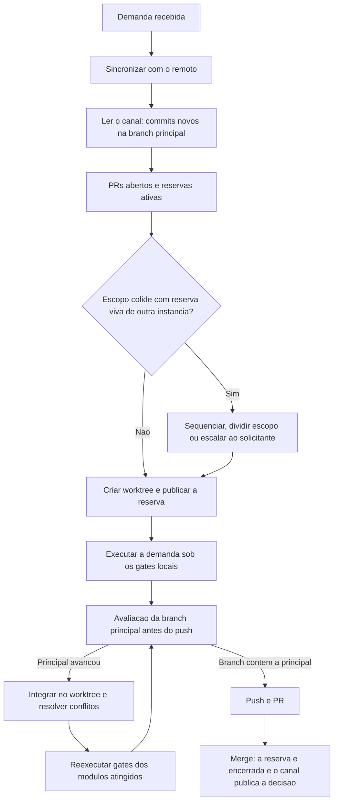

# Coordenacao entre instancias do Tech Lead

Mecanica da regra 47 do `../../../agents/AGENTS.md`, que e a fonte autoritativa. Este arquivo diz **como** executar; a regra diz **o que** e obrigatorio. Complementa `worktree-e-sincronizacao.md` (regra 46), que trata do inicio da demanda em uma unica instancia.

Vale quando mais de um Tech Lead atua no mesmo projeto a partir de maquinas diferentes. Cada maquina tem o seu clone, os seus worktrees e a sua sessao; nenhuma enxerga o disco da outra. O unico terreno comum e o repositorio remoto, e o unico canal de coordenacao e o historico da branch principal.



## 1. Identidade da instancia

Cada instancia se identifica para que uma decisao gravada em uma maquina tenha autor rastreavel nas outras. A identidade e derivada do ambiente, nunca inventada:

```sh
printf '%s/%s\n' "$(hostname -s)" "$(git config user.email)"
```

O valor entra como `instancia:` no frontmatter das entradas de memoria e do log de prompt da demanda. `dono:` continua sendo o papel (`Tech Lead`); `instancia:` diz qual Tech Lead, em qual maquina. Em projeto com uma unica instancia o campo e opcional e pode ser omitido.

## 2. O canal: commits da branch principal

A coordenacao e assincrona e passa pelo que ja e versionado. Nao ha canal fora do repositorio, e nenhuma instancia faz push direto na branch principal: ela avanca somente por merge de PR.

O que trafega no canal, por ordem de leitura:

| Artefato | O que comunica |
|---|---|
| `.github/agents/memoria/entradas/` | Decisoes ativas, reservas de escopo, bloqueios e aceites de todas as instancias |
| `docs/prompts/` | O que foi pedido a cada instancia e como foi entendido |
| `docs/reviews/` | O que cada demanda entregou, com pareceres e evidencias |
| Mensagem de commit | O `Prompt:` e o `Registro:` que ligam o commit aos dois anteriores |

**Leitura do canal.** No bootstrap de toda demanda, depois da sincronizacao (secao 2 de `worktree-e-sincronizacao.md`) e antes de criar o worktree, ler o que entrou na branch principal desde a ultima vez. Ajustar `principal` e, se quiser outra janela, `desde`.

```sh
(
remoto=origin
principal=main
desde="${1:-@{u}}"            # ou um SHA, ou uma data: --since=2026-09-20
git fetch --quiet "$remoto" "$principal" || exit 1
echo "== commits novos em $principal =="
git log --oneline "$desde".."$remoto/$principal"
echo "== artefatos de coordenacao alterados =="
git diff --name-only "$desde" "$remoto/$principal" -- \
  .github/agents/memoria/entradas/ docs/prompts/ docs/reviews/
)
```

- Toda entrada de memoria nova ou alterada que aparecer e lida antes de planejar a demanda: ela pode conter decisao de outra instancia que muda o plano.
- Entrada com `status: ativa` de outra instancia vale como decisao do projeto, exatamente como as proprias.
- O trabalho **ainda nao mergeado** de outra instancia nao esta no canal: ele aparece nos PRs abertos (secao 3 de `worktree-e-sincronizacao.md`) e nas reservas ativas (secao 3 deste arquivo).

## 3. Reserva de escopo

Sem reserva, duas instancias so descobrem que trabalharam no mesmo modulo no merge. A reserva publica a intencao antes do resultado.

**Publicar.** Junto com a criacao do worktree, gravar a entrada e envia-la como **primeiro commit** da branch, com push imediato e PR aberto em draft. E o draft que torna a reserva visivel as outras instancias pela verificacao de PRs abertos da regra 46, antes de qualquer merge.

```markdown
---
id: YYYY-MM-DD-HHMM-reserva-<slug-da-demanda>
tipo: reserva
escopo: projeto
titulo: Demanda <slug> reserva <modulos ou caminhos>
data: YYYY-MM-DD
dono: Tech Lead
instancia: <host>/<usuario-git>
agentes: todos
status: ativa
regra: AGENTS.md 47
ref: docs/prompts/<log-da-demanda>.md
---

Escopo previsto: `<caminhos e modulos>`. Branch `feature/<slug>`, PR #<n>. Contratos compartilhados tocados: `<API, schema, config, pipeline, protocolo ou "nenhum">`.
```

**Consultar.** Antes de criar o worktree, junto com a verificacao de PRs abertos:

```sh
sh scripts/memoria-index.sh --tipo reserva
```

**Colisao** e quando o escopo previsto da nova demanda intercepta o de uma reserva ativa de outra instancia, ou quando as duas tocam o mesmo contrato compartilhado. Tratamento, sempre com a decisao no log de prompt:

| Tratamento | Quando |
|---|---|
| **Sequenciar** | A colisao e nos mesmos arquivos e o conflito seria certo. A demanda espera o merge da reserva viva; depois disso, repete a leitura do canal e a sincronizacao. |
| **Dividir o escopo** | As duas demandas cabem sem se tocar apos um recorte explicito, registrado nas duas reservas. |
| **Prosseguir com integracao frequente** | A interseccao e marginal. A demanda segue, mas a avaliacao da secao 4 passa a ser feita tambem a cada marco, nao so antes do push. |
| **Escalar ao solicitante** | As duas demandas mudam a mesma decisao em direcoes diferentes, ou o recorte nao e obvio. Nenhuma instancia decide sozinha pela outra. |

**Encerrar.** No commit de fechamento da demanda, a propria instancia muda a reserva para `status: encerrada`. Reserva de outra instancia nunca e editada; reserva ativa cuja branch nao existe mais no remoto e apontada ao solicitante, que decide encerra-la.

## 4. Avaliacao da branch principal antes do push

Gate obrigatorio, em **todo** push da branch da demanda, nao apenas antes de abrir o PR. O objetivo e resolver no worktree, antes do merge, o que se tornaria conflito no merge.

```sh
(
remoto=origin
principal=main
git fetch --quiet "$remoto" "$principal" || { echo "ABORTADO: sem acesso a $remoto"; exit 1; }
if git merge-base --is-ancestor "$remoto/$principal" HEAD; then
  echo "OK: a branch ja contem $remoto/$principal; pode seguir para o push"
  exit 0
fi
base=$(git merge-base HEAD "$remoto/$principal") || exit 1
demanda=$(mktemp) && principal_diff=$(mktemp) || exit 1
trap 'rm -f "$demanda" "$principal_diff"' EXIT
echo "== $principal avancou; commits a integrar =="
git log --oneline HEAD.."$remoto/$principal"
git diff --name-only "$base" HEAD | sort > "$demanda"
git diff --name-only "$base" "$remoto/$principal" | sort > "$principal_diff"
echo "== arquivos alterados dos dois lados (conflito provavel) =="
comm -12 "$demanda" "$principal_diff"
echo "== contratos compartilhados alterados na principal (conflito sem marca) =="
grep -Ei 'openapi|schema|migrat|\.proto$|lock|package\.json|requirements|pyproject|\.github/(workflows|agents|skills)/' "$principal_diff" || echo "nenhum"
)
```

Ordem de execucao quando a principal avancou:

1. **Integrar no worktree da demanda**, nunca na principal: `git merge "$remoto/$principal"` na branch ja compartilhada (pushada), ou `git rebase "$remoto/$principal"` enquanto a branch nunca foi enviada. Branch ja consumida por outra instancia nunca e reescrita, e `--force` nao e usado nela; `--force-with-lease` so na propria branch ainda nao consumida.
2. **Resolver os conflitos textuais** no worktree, preservando a intencao dos dois lados. Resolucao que descarte mudanca de outra instancia exige a decisao registrada no registro de entrega e, quando altera decisao ativa, entrada de memoria com `substitui:`.
3. **Inspecionar o conflito sem marca**, que o git nao acusa: arquivo alterado dos dois lados sem sobreposicao de linhas, contrato compartilhado alterado na principal (API, schema e migracoes, configuracao, dependencias e lockfiles, pipeline, e o proprio protocolo em `.github/agents/` e `.github/skills/`), e decisao de memoria que mudou a premissa da demanda. E aqui que mora a maior parte do retrabalho de merge, e a lista de contratos do bloco acima existe para isso.
4. **Reexecutar os gates locais** sobre o diff integrado: `protocolo-tdd` nos modulos atingidos pela integracao e seus dependentes, e `protocolo-conformidade` sobre o novo diff. O codigo integrado e um diff que ninguem validou ainda; parecer anterior a integracao nao cobre o que veio da principal.
5. **Atualizar o registro de entrega** com a integracao: o que veio da principal, o que conflitou, como foi resolvido e o que foi reexecutado.
6. **Repetir do inicio** se a principal tiver avancado de novo durante a integracao. So ha push quando `git merge-base --is-ancestor "$remoto/$principal" HEAD` passa.

Push que falha por rejeicao (`non-fast-forward`) volta ao passo 1; nunca e resolvido com `--force`.

## 5. Conflito de decisao entre instancias

Arquivos de entrada de memoria nao conflitam entre si por construcao (um arquivo por entrada, nome com hora real). O que conflita sao as **decisoes**.

- **Precedencia de merge.** A decisao que chegou primeiro a branch principal e a vigente. Quem chega depois nao edita a entrada alheia: grava entrada nova com `substitui: <id da anterior>` quando a substitui de fato, e so entao marca a anterior como `substituida`.
- **Incompatibilidade.** Quando as duas decisoes nao podem coexistir e nenhuma instancia tem mandato para desfazer a outra, grava-se `tipo: bloqueio` com as duas posicoes e escala-se ao solicitante, que decide. O trabalho dependente para ate a decisao.
- **Divergencia de protocolo** (duas instancias alterando `AGENTS.md`, skills ou templates na mesma regra) e sempre escalada: e regra transversal, e uma resolucao silenciosa quebraria as demais instancias.
- **Territorio alheio.** Nenhuma instancia remove branch, worktree, reserva ou PR de outra, nem reescreve o historico da principal. A sincronizacao da secao 2 de `worktree-e-sincronizacao.md` opera apenas sobre branches locais da propria maquina.

## 6. Encerramento

Depois do merge do PR, a instancia dona da demanda:

1. roda a sincronizacao (secao 2 de `worktree-e-sincronizacao.md`), que remove o worktree e a branch local;
2. confirma no canal que a decisao chegou a principal (`git log --oneline -5 origin/<principal>`);
3. deixa a reserva `encerrada` no mesmo commit de fechamento da demanda.

As outras instancias recebem tudo isso na proxima leitura do canal, sem precisar de aviso fora do repositorio.
