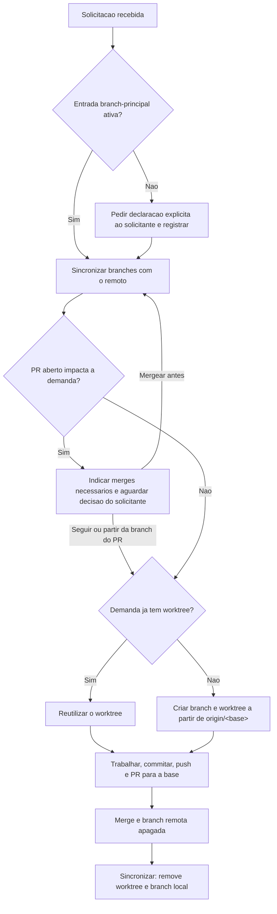

# Worktree e sincronizacao de branches

Mecanica da regra 46 do `../../../agents/AGENTS.md`, que e a fonte autoritativa. Este arquivo diz **como** executar; a regra diz **o que** e obrigatorio.

Ordem no inicio de toda demanda: (1) branch principal registrada, (2) sincronizacao com o remoto, (3) PRs abertos que impactam a demanda e merges necessarios, (4) worktree da demanda. No encerramento, apos o merge: (5) sincronizacao de novo.

Com mais de uma instancia do Tech Lead no mesmo projeto, a leitura do canal e a consulta as reservas ativas entram junto com o passo 3, a publicacao da reserva junto com o passo 4, e a avaliacao da branch principal antecede todo push: [coordenacao-multi-instancia.md](coordenacao-multi-instancia.md) (regra 47).



## 1. Branch principal

Consultar a memoria antes de qualquer operacao de branch:

```sh
grep -l '^status: ativa' .github/agents/memoria/entradas/????-??-??-????-branch-principal.md 2>/dev/null
```

- **Encontrou:** o `titulo` da entrada traz a branch principal. Nao perguntar de novo.
- **Nao encontrou:** perguntar ao solicitante qual e a branch principal, antes de criar branch ou worktree. O valor de `git symbolic-ref --short refs/remotes/origin/HEAD` pode ser oferecido como sugestao, nunca assumido sem resposta. Registrar a pergunta e a resposta no log de prompt e gravar a entrada no worktree da demanda (ela entra no commit da demanda):

```markdown
---
id: YYYY-MM-DD-HHMM-branch-principal
tipo: decisao
escopo: projeto
titulo: Branch principal do projeto e `<nome>`
data: YYYY-MM-DD
dono: Tech Lead
agentes: todos
status: ativa
regra: AGENTS.md 46
ref: docs/prompts/<log-da-demanda>.md
---

Declarada explicitamente pelo solicitante. Toda demanda nova parte de `origin/<nome>`, salvo indicacao explicita de outra branch de origem.
```

Troca da branch principal: so por nova declaracao explicita, gravada como nova entrada `branch-principal` com `substitui: <id anterior>`.

## 2. Sincronizacao com o remoto

Remove a branch local, e o seu worktree, quando a branch remota correspondente foi apagada e todo o trabalho local ja estava no remoto. Roda a partir de qualquer worktree do repositorio; o bloco se posiciona no checkout principal e roda em subshell, para que `exit` nao encerre o terminal. Ajustar `remoto` e `principal`.

```sh
(
remoto=origin
principal=main   # valor da entrada branch-principal
raiz=$(git worktree list --porcelain | sed -n '1s/^worktree //p')
cd "$raiz" || exit 1
git fetch --no-prune --quiet "$remoto" || exit 1
vivas=$(git ls-remote --heads "$remoto" | awk '{print $2}') || exit 1
[ -n "$vivas" ] || { echo "ABORTADO: nenhuma branch visivel em $remoto"; exit 1; }
git worktree prune
git for-each-ref --format='%(refname:short) %(upstream)' refs/heads |
while read -r branch upstream; do
  case "$upstream" in "refs/remotes/$remoto/"*) ;; *) continue ;; esac
  printf '%s\n' "$vivas" | grep -qxF "refs/heads/${upstream#"refs/remotes/$remoto/"}" && continue
  [ "$branch" = "$principal" ] && { echo "ATENCAO: branch principal $branch apagada no remoto"; continue; }
  wt=$(git worktree list --porcelain | awk -v b="branch refs/heads/$branch" '/^worktree /{p=substr($0,10)} $0==b{print p}')
  if [ -n "$wt" ] && [ -n "$(git -C "$wt" status --porcelain)" ]; then
    echo "PRESERVADA (worktree com alteracoes): $branch em $wt"; continue
  fi
  if git show-ref --verify --quiet "$upstream"; then
    git merge-base --is-ancestor "$branch" "$upstream" || { echo "PRESERVADA (commits nao enviados): $branch"; continue; }
  elif [ -n "$(git rev-list -1 "$branch" --not --remotes)" ]; then
    echo "PRESERVADA (ultimo estado remoto desconhecido; envio nao comprovado): $branch"; continue
  fi
  if [ -n "$wt" ]; then
    git worktree remove "$wt" || { echo "PRESERVADA (worktree nao removido): $branch em $wt"; continue; }
  fi
  git branch -D "$branch" >/dev/null && echo "REMOVIDA: $branch${wt:+ (worktree $wt)}"
done
git fetch --prune --quiet "$remoto"
)
```

Como o bloco decide:

- **Apagada no remoto** e a branch local cujo upstream aponta para `$remoto` e nao aparece em `git ls-remote`. Branch local sem upstream (nunca enviada) nao e tocada. Falha de rede ou remoto sem branches visiveis aborta antes de qualquer remocao.
- **Trabalho ja enviado** e comprovado pelo ultimo SHA conhecido da branch remota: o `fetch` inicial usa `--no-prune` para preservar esse SHA, e a branch local precisa estar contida nele. Isso cobre merge por squash e rebase, em que os commits da branch nao chegam a branch principal. Se a referencia remota ja tinha sido podada antes (por `fetch.prune` ou `git.pruneOnFetch` do editor), vale a alternativa: nenhum commit da branch fora de alguma referencia remota.
- **Remocao** usa `git branch -D` porque a verificacao acima ja provou que nada se perde; `-d` recusaria branches mergeadas por squash. O worktree sai com `git worktree remove`, sem `--force`: arquivos ignorados (`node_modules`, build) nao impedem a remocao; alteracoes rastreadas ou arquivos novos nao ignorados impedem.
- **PRESERVADA** nunca e removida pelo agent por conta propria. O agent lista essas linhas ao solicitante e, apenas com confirmacao explicita por branch, executa `git worktree remove --force <caminho>` e `git branch -D <branch>`. Sem confirmacao, a branch fica.
- **ATENCAO** (branch principal apagada no remoto) interrompe a demanda: o solicitante declara a nova branch principal (secao 1).

## 3. PRs abertos que impactam a demanda

Depois da sincronizacao e antes de criar o worktree, levantar os PRs abertos do repositorio e cruzar com o **escopo previsto** da demanda: arquivos e modulos que ela deve alterar, deduzidos do pedido e do levantamento inicial, mais os dependentes diretos pelo mapa de modulos de `protocolo-tdd` quando houver. Todos os PRs abertos entram, nao apenas os que apontam para a origem da demanda, porque os demais tambem podem chegar a ela. Ajustar `escopo` (caminhos ou prefixos separados por espaco).

```sh
(
escopo="src/pedidos/ docs/api/pedidos.yaml"   # caminhos e prefixos do escopo previsto
prs=$(gh pr list --state open --limit 200 --json number --jq '.[].number') || { echo "ABORTADO: sem acesso aos PRs; pedir a lista ao solicitante"; exit 1; }
[ -n "$prs" ] || { echo "Nenhum PR aberto."; exit 0; }
for n in $prs; do
  gh pr view "$n" --json number,title,baseRefName,headRefName,isDraft,url \
    --jq '"#\(.number) [\(.baseRefName) <- \(.headRefName)]\(if .isDraft then " (draft)" else "" end) \(.title)\n  \(.url)"'
  gh pr diff "$n" --name-only | while read -r arquivo; do
    marca=""
    for p in $escopo; do case "$arquivo" in "$p"*) marca="  <- ESCOPO" ;; esac; done
    echo "    $arquivo$marca"
  done
done
)
```

Um PR **impacta** a demanda quando:

- altera arquivo marcado `<- ESCOPO`, ou arquivo de um modulo do escopo previsto ou de dependente direto dele pelo mapa;
- altera contrato compartilhado de que a demanda depende, mesmo fora do escopo: API publica ou contrato entre modulos, schema e migracoes, configuracao compartilhada, dependencias e lockfiles, pipeline, ou o proprio protocolo (`.github/agents/`, `.github/skills/`) quando a demanda for de governanca;
- tem como base a branch de outro PR que impacta a demanda (PRs empilhados).

Na duvida, o PR e listado como impacto potencial. PR sem impacto nao precisa ser apresentado; basta registrar no log de prompt que foi verificado.

Para cada PR com impacto, **indicar ao solicitante** o merge necessario, com o motivo:

| Indicacao | Quando |
|---|---|
| **Mergear antes de iniciar** | A demanda depende do conteudo do PR, ou os dois alteram os mesmos trechos e o conflito seria certo. Apos o merge, repetir a sincronizacao (secao 2) e esta verificacao. |
| **Iniciar a partir da branch do PR** | A demanda precisa do PR e nao pode esperar o merge. So com indicacao explicita do solicitante (regra 46); o PR da demanda aponta para a branch do PR e so e mergeado depois dele. |
| **Seguir sem dependencia** | O impacto e apenas proximidade de arquivos, sem dependencia de conteudo. A demanda parte da origem normal; o agent atualiza a branch com a origem antes de cada push, conforme a regra 47. |

- A decisao e do solicitante e fica no log de prompt, com os PRs verificados e a indicacao de cada um.
- O agent **nao mergeia, nao aprova e nao altera** PR algum por conta propria: o merge segue a governanca de review (regra 27). Mergear por instrucao do solicitante e acao explicita dele, registrada no log.
- PR em draft, com checks vermelhos ou com review pendente tambem e listado, com o estado; indicar "mergear antes" nesse caso implica esperar a conclusao dele.
- Sem acesso a API do hospedeiro (`gh` ausente ou sem autenticacao, repositorio fora do GitHub sem CLI equivalente), pedir ao solicitante a lista de PRs abertos relevantes e registrar a limitacao no log de prompt.

## 4. Worktree da demanda

Criar a partir do checkout principal, depois da sincronizacao e da verificacao de PRs abertos. `base` e a branch principal ou a branch de origem indicada explicitamente pelo solicitante; `branch` segue a nomenclatura Gitflow ([branching-model.md](branching-model.md)).

```sh
(
remoto=origin
base=main                        # branch principal ou origem indicada
branch=feature/<slug>
raiz=$(git worktree list --porcelain | sed -n '1s/^worktree //p')
dir="$(dirname "$raiz")/$(basename "$raiz").worktrees/$(printf '%s' "$branch" | tr '/' '-')"
git -C "$raiz" ls-remote --exit-code --heads "$remoto" "$base" >/dev/null || { echo "Origem $base inexistente em $remoto"; exit 1; }
git -C "$raiz" fetch --quiet "$remoto" "$base"
git -C "$raiz" worktree add --no-track -b "$branch" "$dir" "$remoto/$base"
)
```

- **Linha de base de alteracoes externas** (regra 48): logo apos criar o worktree, rodar de dentro dele `sh scripts/alteracoes-externas.sh --inicial`. A linha de base fica em `.git/`, fora do versionamento, e e propria de cada worktree; a marca da branch principal e compartilhada entre eles. Sem ela, commits humanos na branch da demanda nao sao acusados.
- `--no-track` impede que a branch nova herde `origin/<base>` como upstream; o upstream certo nasce no primeiro push, feito de dentro do worktree: `git push -u origin "$branch"`.
- **Demanda em andamento:** `git worktree list` mostra o caminho; reutilizar. Se a branch existir sem worktree, `git -C "$raiz" worktree add "$dir" "$branch"`.
- **Origem inexistente** no remoto: parar e perguntar ao solicitante; nao criar a partir de branch local desatualizada.
- **Dentro do worktree:** todo o trabalho da demanda, inclusive log de prompt, entradas de memoria e registro de entrega, e feito e commitado ali. Dependencias nao sao compartilhadas entre worktrees: instalar no worktree. Arquivos locais nao versionados (como `.env`) podem ser copiados do checkout principal, e continuam fora do versionamento.
- **Editor:** o agent do VS Code so enxerga as pastas abertas no workspace. Abrir o worktree como pasta ou adiciona-lo com `File > Add Folder to Workspace` antes de delegar a um agent que dependa do editor.
- **PR:** apontar para a branch de origem da demanda (`gh pr create --base "$base"`). Destino adicional, como o back-merge de `hotfix/*` em `develop`, so com indicacao explicita.
- **Multi-instancia:** a reserva de escopo da demanda e gravada e enviada como primeiro commit da branch, com o PR aberto em draft, para que as outras instancias a enxerguem antes do resultado ([coordenacao-multi-instancia.md](coordenacao-multi-instancia.md), secao 3).

## 5. Encerramento

Com o PR mergeado, a reserva de escopo da demanda ja foi encerrada no commit de fechamento e a branch remota precisa ser apagada: habilitar **Automatically delete head branches** nas configuracoes do repositorio no GitHub ou, na falta dela, `git push origin --delete <branch>` apos o merge. Em seguida, rodar a sincronizacao da secao 2 a partir do checkout principal: ela remove o worktree e a branch local da demanda.
