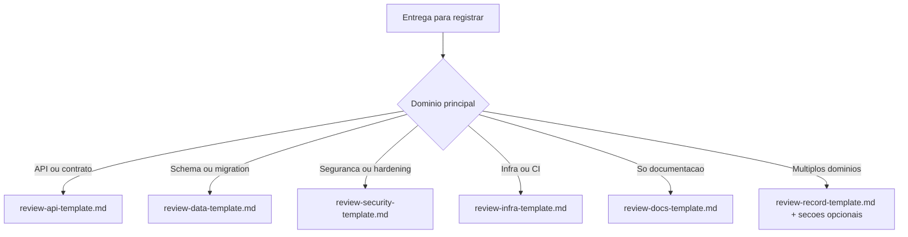

# Review Documentation

## Security Handoff

This skill does not replace security hardening.

- Never include secrets, tokens, credentials, connection strings, personal data, or private keys in the artifacts produced here. Sanitize any payload, log, or evidence copied from a real environment before persisting it.
- When the documented scope touches authentication, authorization, sensitive data, or API exposure, also apply `security-best-practices` and `api-security-best-practices`.

Skill que produz o **registro de entrega** de uma demanda: o unico artefato onde os fatos da entrega (arquivos, decisao, evidencia, risco) sao escritos, conforme a regra 41 do `AGENTS.md`. Todos os demais artefatos da demanda apontam para ele.

## Scope Boundary

- Os pareceres dos gates (`protocolo-tdd`, `protocolo-conformidade`) sao a fonte das evidencias de teste e de conformidade. Este registro os referencia (ou os embute como secoes, em porte P e M) e nunca os reescreve.
- O log de prompt (`prompt-logger`) e a fonte do que foi pedido. Este registro aponta para ele; nao repete intencao nem prompt.
- `documentation-sync` atualiza a documentacao viva afetada; este registro apenas lista o que foi sincronizado.
- Revisao consolidada e aprovacao final do Tech Lead consomem este registro por link e acrescentam apenas decisao, ressalva e aceite.

## Regra de acionamento obrigatorio

Esta skill deve ser acionada obrigatoriamente sempre que a tarefa envolver:
- desenvolvimento de codigo novo;
- refatoracao de codigo existente;
- correcao de defeitos, bugs ou regressões em codigo.

Essa obrigatoriedade vale mesmo quando a solicitacao principal estiver focada em implementacao, ajuste tecnico ou correção funcional, desde que haja alteracao de codigo no escopo da entrega.

## Regras obrigatorias

### 1. Registro obrigatorio por alteracao relevante
Toda alteracao relevante deve gerar um registro tecnico em `docs/reviews/`, diretorio exigido pela regra 45 do `AGENTS.md` e criado por `sh scripts/ensure-docs.sh` quando faltar. Projeto que ja mantenha changelog ou journal em outro local registra o desvio no proprio registro.

Para tarefas com desenvolvimento, refatoracao ou correcao de codigo, esse registro nao e opcional: ele faz parte do criterio de conclusao da entrega.

### 2. Cobertura retroativa
Se a mudanca ja foi feita e ainda nao tem registro, crie o review retroativo antes de considerar a tarefa concluida.

### 3. Padrao de nome do arquivo
Quando o projeto nao definir outro padrao, use preferencialmente:

```text
YYYY-MM-DD-HHMM-<slug-curto>.md
```

### 4. Conteudo minimo por porte

Porte **P** (registro compacto, um unico arquivo):
- porte e link para o log de prompt;
- contexto e objetivo em ate tres linhas;
- arquivos modificados;
- decisao em uma linha (causa raiz e por que a solucao e unica, conforme dispensa da analise comparativa);
- parecer de evidencias de testes e parecer de conformidade **embutidos como secoes**, em modo compacto;
- rollback: se `git revert` bastar, declarar isso em uma linha;
- aprovacao do QA e do Tech Lead como uma linha cada, com data.

Porte **M** acrescenta:
- ADR resumido com decisao, alternativas e trade-offs (quando a analise comparativa for exigida);
- riscos e impacto;
- proximos passos, quando existirem;
- diagrama `mermaid` apenas quando houver fluxo, sequencia ou arquitetura que o texto nao descreva em poucas linhas;
- pareceres embutidos ou em arquivos proprios referenciados por link.

Porte **G** acrescenta:
- pareceres em arquivos proprios, referenciados por link;
- diagrama `mermaid` obrigatorio;
- secoes opcionais por tipo de alteracao aplicaveis;
- referencia a revisao consolidada e a aprovacao final do Tech Lead.

Secao sem conteudo e omitida com `Nao aplicavel: <motivo>`.

### 5. Criterio de conclusao
Nenhuma tarefa de implementacao deve ser considerada plenamente fechada sem o registro tecnico correspondente, quando o projeto exigir esse tipo de artefato.

Quando a tarefa envolver desenvolvimento, refatoracao ou correcao de codigo, a execucao desta skill deve ser tratada como obrigatoria para o fechamento da demanda.

### 6. Commit obrigatorio ao acionar a skill
Sempre que esta skill for acionada, deve ser criado um commit relacionado exclusivamente aos arquivos afetados pela solicitacao atendida.

O corpo do commit **referencia, nao repete**: uma linha `Registro: <caminho do registro de entrega>` e uma linha `Prompt: <caminho do log de prompt>`. Intencao e resumo do prompt vivem nesses arquivos; o assunto do commit descreve a mudanca no codigo, conforme Conventional Commits e a skill `git-commit`. Quando o projeto nao versionar o registro no mesmo repositorio, o corpo traz o resumo da intencao em uma linha, no lugar do link.

## Padrao estrutural recomendado

1. Titulo objetivo da alteracao
2. `## Identificacao` (porte, log de prompt, agent, data)
3. `## Contexto e objetivo`
4. `## Escopo tecnico e arquivos modificados`
5. `## Decisao` (uma linha em P; ADR resumido em M e G)
6. `## Evidencias de validacao` (pareceres embutidos ou por link)
7. `## Riscos, impacto e rollback`
8. `## Proximos passos` (quando houver)
9. `## Diagrama (Mermaid)` (M quando houver fluxo; G sempre)
10. `## Aceites` (QA e Tech Lead, uma linha cada, ou link para os templates de fechamento em M e G)

## Regras editoriais

- Escreva de forma tecnica, direta e auditavel.
- Diferencie claramente o que foi executado do que apenas foi recomendado.
- Quando citar testes, inclua o comando executado e o resultado resumido.
- Quando nao houver execucao real, declare explicitamente que a validacao nao foi executada.
- Liste arquivos modificados em formato simples e objetivo.
- Evite texto promocional, justificativas vagas ou linguagem generica.

## Secoes opcionais por tipo de alteracao (porte M e G)

| Tipo | Documentar adicionalmente |
|---|---|
| Persistencia e dados | banco, modelos, eventos de dados, migracoes, trilha de auditoria, capacidade e rollback de persistencia |
| API, contratos e integracoes | contratos alterados, endpoints, compatibilidade retroativa, payloads, filas, eventos, webhooks |
| Relatorios e exportacoes | templates impactados, fluxo de geracao, nomes de arquivo, entrada, saida e validacao |
| Tempo real e assincrono | rotas, consumidores, payloads, autenticacao, reprocessamento, fallback e indisponibilidade |
| Testes e QA | suite afetada, cobertura adicionada, regressao evitada, impacto em CI |
| Somente documental | documento refinado, criterio de consistencia aplicado e impacto esperado |
| Intervencao humana (regra 48) | arquivos e commits de origem humana, id da entrada de aceite, regras de negocio escritas pelo Business Analyst, como o red foi comprovado contra a base, trechos humanos alterados com a autorizacao correspondente |

## Workflow recomendado

### Passo 1. Identificar o tipo de alteracao
Classifique a entrega por dominio principal:
- aplicacao ou API;
- dados e persistencia;
- testes e QA;
- integracoes externas;
- processamento assincrono ou eventos;
- infraestrutura e operacao;
- documentacao.

### Passo 2. Coletar evidencias
Levante:
- arquivos tocados;
- comandos executados;
- suites de teste afetadas;
- riscos, dependencias e bloqueios.

Colete tambem os insumos do commit final: lista consolidada dos arquivos afetados e os caminhos do registro de entrega e do log de prompt.

### Passo 2.1. Garantir diretorio de registro
Rodar `sh scripts/ensure-docs.sh` (ou criar `docs/reviews/` com README) antes de salvar o artefato.

### Passo 3. Selecionar o template adequado

Use o template especifico para o tipo de entrega identificado no Passo 1:

| Tipo de entrega | Template |
|---|---|
| Geral / multiplos dominios | [review-record-template.md](assets/template/review-record-template.md) |
| API / endpoints / contratos | [review-api-template.md](assets/template/review-api-template.md) |
| Schema / migration / persistencia | [review-data-template.md](assets/template/review-data-template.md) |
| Seguranca / hardening | [review-security-template.md](assets/template/review-security-template.md) |
| Infraestrutura / CI / pipeline | [review-infra-template.md](assets/template/review-infra-template.md) |
| Documentacao | [review-docs-template.md](assets/template/review-docs-template.md) |

Adapte as secoes opcionais conforme necessario. Para entregas que cruzam dominios, use o template geral e inclua as secoes opcionais dos dominios envolvidos. Em porte P, nao usar template de `assets/template/`: o registro compacto segue apenas o `Conteudo minimo por porte`.

### Passo 4. Validar conformidade
Antes de concluir, confirme:
- o arquivo foi salvo no local de review adotado pelo projeto;
- o nome segue o padrao cronologico, quando aplicavel;
- o diagrama `mermaid` existe quando o porte o exige;
- o registro distingue validacao executada de validacao pendente;
- rollback e proximos passos foram registrados.

### Passo 5. Criar o commit obrigatorio
Antes de encerrar a execucao da skill:
- agrupe no commit apenas os arquivos afetados pela solicitacao atual;
- use mensagem de commit aderente ao padrao do projeto;
- inclua no corpo as linhas `Registro:` e `Prompt:` com os caminhos correspondentes.

## Checklist rapido

- [ ] Pasta de registro existente (ou criada antes da escrita do review)
- [ ] Arquivo salvo no local de review adotado pelo projeto
- [ ] Nome no formato esperado pelo projeto
- [ ] Contexto e objetivo preenchidos
- [ ] Arquivos modificados listados
- [ ] ADR resumido preenchido
- [ ] Evidencias de validacao informadas
- [ ] Riscos, impacto e rollback descritos
- [ ] Proximos passos registrados
- [ ] Porte declarado e secoes coerentes com ele
- [ ] Diagrama `mermaid` incluido quando o porte exige
- [ ] Commit criado com os arquivos afetados pela solicitacao
- [ ] Corpo do commit referencia o registro de entrega e o log de prompt

## Referencias de apoio

Use estes materiais durante o preenchimento do review:

| Referencia | Uso |
|---|---|
| [checklist.md](references/checklist.md) | Conformidade pre-publicacao por tipo de entrega |
| [adr-patterns.md](references/adr-patterns.md) | Exemplos de ADR por cenario (refatoracao, schema, seguranca, infra, docs) |
| [rollback-guide.md](references/rollback-guide.md) | Padroes de plano de rollback por tipo de entrega |
| [validation-evidence.md](references/validation-evidence.md) | Padroes de evidencia de validacao com exemplos de comando e resultado |
| [anti-patterns.md](references/anti-patterns.md) | Anti-padroes recorrentes e como corrigi-los |

## Decision tree — qual template usar?



## Saida esperada

O resultado desta skill deve incluir:
- um arquivo Markdown pronto para auditoria tecnica, com rastreabilidade clara entre alteracao, decisao, validacao, risco e proximo passo;
- um commit relacionado aos arquivos afetados pela solicitacao, com corpo apontando para o registro e para o log de prompt.