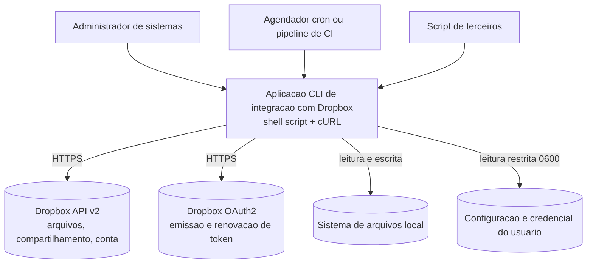
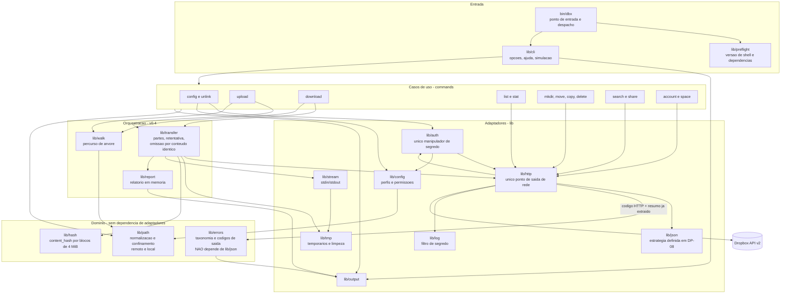
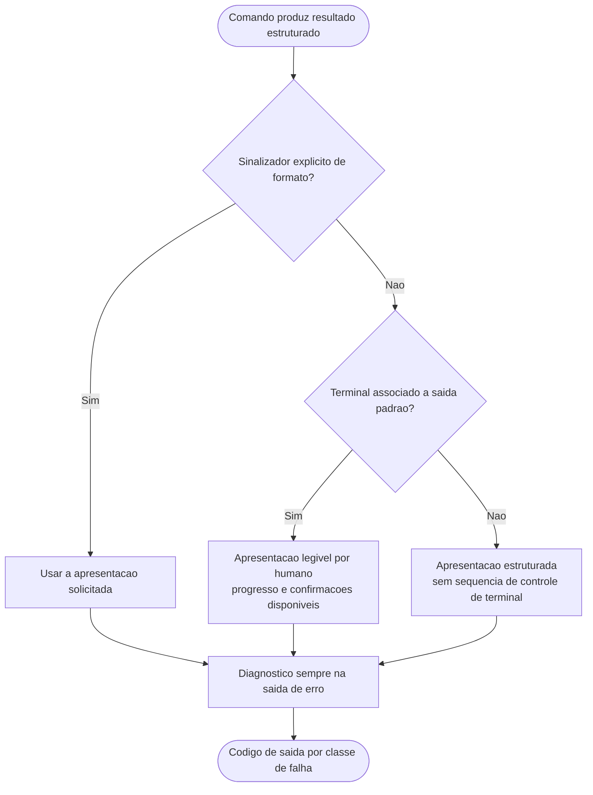
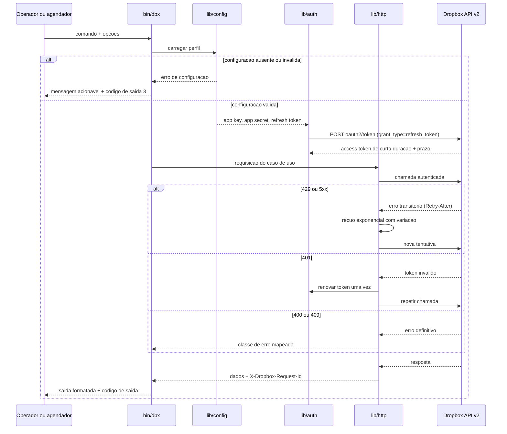
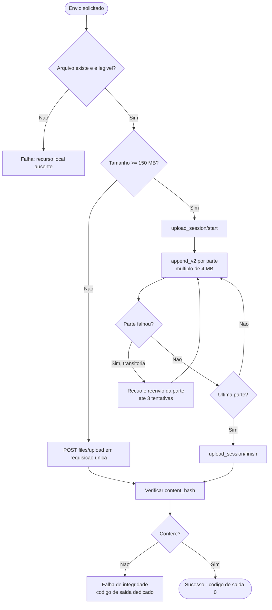
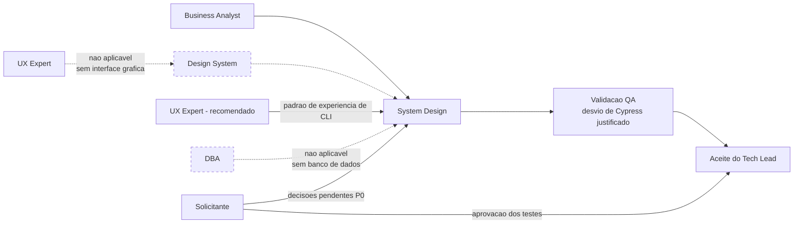

# System Design — Aplicacao Shell de Integracao com Dropbox

> Elaborado a partir de `.claude/agents-protocol/templates/system-design-template.md`.

## Identificacao

- Projeto ou produto: `dropbox_api` — aplicacao de linha de comando em shell script para integracao com a Dropbox API v2
- Responsavel Business Analyst: Business Analyst (pacote de agents)
- Responsavel tecnico principal: a definir pelo Tech Lead
- Data da versao: 2026-08-18 (**v1.0**)
- Status: **Todas as decisoes do `sync` fechadas.** Nove comandos definidos; `RSK-24` com mitigacao estrutural em vez de aceite. Nenhuma decisao do solicitante em aberto para o `sync`

Documentos relacionados: [Escopo e requisitos](../requisitos/escopo-requisitos-e-criterios-de-aceite.md) · [Decisoes pendentes](../requisitos/decisoes-pendentes.md) · [Funcionalidades candidatas](../requisitos/funcionalidades-candidatas.md) · [Riscos e licenciamento](../requisitos/riscos-restricoes-e-licenciamento.md)

### Registro de versao

| Versao | Mudanca |
|---|---|
| v0.1 | Proposta arquitetural inicial |
| v0.2 | Incorpora DP-01 (reimplementacao independente), DP-03 (uso interativo **e** automatizado, exigindo camada de saida com duas apresentacoes) e DP-04 (conta pessoal com acesso amplo, exigindo menor privilegio e confinamento de raiz). Contratos de integracao **revalidados via Context7** sobre `/websites/dropbox_developers_http`, corrigindo hosts, unidades, o requisito de multiplo de 4 MiB, a paginacao de busca e a restricao de concorrencia em listagem. Nota de nao verificacao do Context7 removida por erro factual |

| **v0.3** | **Escopo do MVP fechado (DP-02).** Componentes `lib/stream` e `lib/report` criados para F-01 e F-05; `lib/hash` **desbloqueado** pela confirmacao do algoritmo do `content_hash`; `lib/transfer` estendido para omissao por conteudo identico (F-02). Registro explicito de que **nenhum componente de estado local persistente entra nesta versao**, mantendo `DP-09` fechada e o handoff do DBA nao acionado. `RSK-20` encerrado, `RSK-21` rebaixado, `RSK-23` criado |

| **v0.4** | **Correcoes devolvidas pelo ciclo de QA da camada de dominio (aprovado com ressalva).** Camada de **Orquestracao** criada, corrigindo tres inconsistencias da tabela de camadas (DIV-A): `lib/errors` deixa de depender de `lib/json`, `lib/transfer` sai do dominio, `lib/hash` entra nele. `RNF-20` ampliado para nomear **os dois espacos de nomes**, remoto e local, com TOCTOU registrado como risco residual aceito (`RSK-24`) e raiz `/` exigindo opt-in explicito. `RNF-07` ajustado para a dimensao de idempotencia. Requisito de entrada de `lib/output` acrescentado (redacao de cabecalho sensivel consome a linha). Dados reais de dimensionamento incorporados. `DP-07` **permanece aberta**; a premissa que a dava por fechada foi refutada (DIV-B) |

| **v1.1** | **`DP-27` muda a semantica do `sync`: DIRECIONAL, com a origem como autoridade.** `--origem` e `--destino` obrigatorios, um lado local e outro remoto. A matriz de tres estados e as quatro classes de conflito **perdem objeto**, e com elas `DP-21`, `DP-22`, `RF-39a` e `RF-40a`. A linha de base sobrevive por `DP-27b`, **rebaixada a memoria de desempenho que nao arbitra nada** — o que inverte o tratamento de corrupcao (`RF-42`) de recusar para descartar e reconstruir. **Consequencia registrada em `RSK-35`:** a base tambem era limitador de exclusao, e essa funcao caiu sem substituto — `RF-40`, `RF-41`, `RF-47` e `RF-48` passam de camada redundante a defesa unica. `DP-28` fica aberta |
| **v1.0** | **`DP-26` e `DP-25` resolvidas.** `RSK-24` **deixa de ser risco aceito**: adotada **travessia por descida com nome relativo** (`RNF-28`), equivalente em shell de `openat`/`O_NOFOLLOW` por componente, verificada experimentalmente. **Correcao conceitual:** `RF-41(a)` **nao** compensa `RSK-24` — dispara em **erro** de travessia, e TOCTOU bem-sucedido nao gera erro; eixos ortogonais, arvore **incompleta** contra arvore **completa e errada**. Risco composto `RSK-34` registrado e `RF-50` fixa que a base **so grava o que a descida verificou**. `DP-25` inclui `config`, `unlink` e `space` — **nove comandos**; `RF-51` trata o estado local no `unlink` e `RF-52` vincula a base a **identidade da conta**, fechando um caminho de destruicao de dado por relink a conta diferente |
| **v0.9** | **Politica de conflito decidida: `DP-21` ultimo a escrever vence · `DP-22` honrar a exclusao · `DP-24` sem teto · `DP-23` base sob `$XDG_STATE_HOME`, corrompida recusa.** Decisoes tomadas contra a recomendacao do Business Analyst, com custo apresentado e aceito; recomendacao e razao registradas para revisao futura. **Desenho ajustado para minimizar o custo dentro da decisao:** incerteza **confinada a ordenacao** (`RF-39` proibe carimbo de tempo na deteccao); qualidade do sinal elevada (`RF-39a`, `RNF-27` — diferencas contra a base cancelam offset de relogio, `client_modified` substitui `server_modified`); desempate prefere o **lado recuperavel** (`RF-40a`); perda **nominal e visivel depois da acao** (`RF-47`); reconhecimento obrigatorio na primeira execucao (`RF-48`); concorrencia otimista por `rev` (`RF-49`). **`RF-41(a)` elevada a bloqueante** — unica protecao restante contra exclusao em massa. `RSK-33` criado (assimetria de recuperabilidade) |
| **v0.8** | **`DP-06` resolvida com `sync` bidirecional — maior mudanca de escopo do projeto.** `PRJ-DEC-07` **revogado no escopo do `sync`**; `DP-09` reaberta; **handoff do DBA acionado**. Componentes novos: **`lib/state`** (linha de base e cursor, unico autorizado a escrever estado alem de `lib/config`) e **`lib/sync`** (matriz de tres estados, conflitos, salvaguardas). Requisitos `RF-37` a `RF-46`, `RNF-25` e `RNF-26`. Riscos criticos novos: `RSK-29` a `RSK-32`; **`RSK-24` reescalado** de Medio/Baixa para Alto/Media, porque o percurso recursivo que seu aceite pressupunha inexistente agora existe e apaga. Cinco decisoes bloqueantes: `DP-21` a `DP-24` e `DP-26` |
| **v0.7** | **`RNF-24` criado (`E3-01`)**: contexto nomeado em `lib/json`, permitindo analisar corpo de erro sem destruir analise em curso — com o nome **sempre de origem interna**, restricao que preserva a injetividade que fechou `E2-01`. **Vocabulario do projeto ampliado**: secao "separar dado de canal" na visao geral, e classe *"instrumento de observacao interfere na propriedade observada"* registrada como `RSK-28`. `RSK-27` criado a partir de auditoria estatica furada. Ciclo 2 de QA aprovado com ressalva — 223 casos, `shellcheck -x` exit 0 |
| **v0.6** | **`DP-05` fecha o desenho de `lib/config`** — um arquivo, um caminho, sem multiplexacao; `RF-05` sai para o backlog como incremento aditivo. **`RNF-23` acopla `lib/http` a `lib/json`:** o teto de entrada de 256 KiB do analisador, fixado por medicao, torna obrigatorio o `limit`/`max_results` explicito em toda chamada de colecao. **`RSK-24` encerrado** com aceite reconfirmado sob `DP-07` ja resolvida |
| **v0.5** | **Correcao de registro e tres decisoes novas.** `DP-07` (Linux, `bash` 4.4) e `DP-08` (apenas `cURL`, JSON proprio) **ja estavam decididas** e foram enfim propagadas: `lib/preflight` e `lib/json` destravados, e a **camada de compatibilidade GNU/BSD eliminada do desenho**. `DP-11` fixa credencial `0600` sob XDG sem sobrescrita por ambiente, destravando `lib/config`. `DIV-16b` adota `--null` com terminador nulo, destravando `lib/output`. `RSK-24` **reaberto**: com Linux confirmado, `/proc/self/fd` deixa de ser inadmissivel por portabilidade. `DIV-15` retirada e `RSK-25` encerrado |

> **Condicao de validade.** Nao ha decisao bloqueante pendente. As pendencias remanescentes sao estruturantes (DP-07, DP-08, DP-11, DP-20) e afetam componentes especificos, nao a arquitetura geral — ver a secao "O que o Senior Developer precisa para comecar" em [decisoes-pendentes.md](../requisitos/decisoes-pendentes.md). As secoes de dimensionamento contem premissas provisorias explicitamente marcadas, a substituir pelos numeros reais quando DP-12 for respondida.

### 🔄 v0.8 — o invariante de ausencia de estado foi REVOGADO para o `sync`

> **Mudanca de escopo autorizada por `DP-06`.** O solicitante escolheu `sync` **bidirecional**, com **propagacao de exclusao sob opcao explicita** e **cursor persistente**. Isso promove `F-06` do Bloco 2 e **revoga `PRJ-DEC-07` no escopo do `sync`**.
>
> **O bloco abaixo e preservado, nao apagado.** Ele registra uma decisao que era correta para o escopo vigente a epoca, e a razao continua rastreavel. O que mudou foi o escopo, nao a qualidade da decisao.
>
> **Situacao atual:**
>
> | Escopo | Estado persistente |
> |---|---|
> | `upload`, `download`, `list`, `delete`, `info` | ❌ **Nenhum.** O invariante original continua valendo integralmente |
> | `sync` | ✅ **Autorizado e delimitado** por `RNF-26`: linha de base de sincronizacao e cursor de enumeracao, vinculados ao par de raizes. Nada alem disso |
>
> **Consequencias formais:** `DP-09` **reaberta** · **handoff do DBA acionado** · `RSK-23` reescrito de "nao criar estado" para "nao exceder o estado autorizado" · `RSK-24` reescalado, porque o percurso recursivo que seu aceite pressupunha inexistente agora existe e apaga.
>
> **⚠️ ATUALIZADO POR `DP-27` (v1.1).** O paragrafo abaixo era a justificativa de correcao para o estado persistente, e ela **caiu junto com a bidirecionalidade**. O `sync` direcional decide lendo origem e destino agora, **sem terceiro estado**. A linha de base permanece por escolha do solicitante (`DP-27b`), como memoria de desempenho: perdida ou corrompida, o `sync` decide igual e so trabalha mais. O texto original fica registrado porque o raciocinio continua valido para o escopo que o motivou.
>
> ~~**Por que o estado e requisito derivado, e nao otimizacao:** sincronizacao bidirecional com propagacao de exclusao exige linha de base **por construcao**. Com apenas dois estados observaveis, "o usuario apagou este arquivo" e "este arquivo nunca foi baixado" sao indistinguiveis, e as acoes corretas sao opostas. O cursor **nao torna o `sync` mais rapido — torna-o correto**. Detalhamento na secao 5.8.1 dos requisitos.~~

---

### ⚠️ Invariante da v0.3 — preservado como registro historico, valido fora do `sync`

> **O MVP nao possui estado local persistente.** A unica escrita persistente da aplicacao e o arquivo de configuracao com a credencial. Nao ha cursor, catalogo de arquivos, cache de resumos, indice nem arquivo de trava.
>
> Isso e consequencia direta da decisao de escopo: as quatro funcionalidades que exigiriam persistencia — F-03 (retomada), F-06 (espelhamento), F-12 (trava de concorrencia) e F-14 (deteccao por cursor) — ficaram todas fora do MVP.
>
> **Consequencias formais:** `DP-09` permanece fechada · o handoff do DBA **nao** e acionado · a secao "Plano de dimensionamento e expansao do banco" e nao aplicavel por ausencia de mecanismo, e nao por omissao.
>
> Introduzir qualquer forma de estado persistente constitui **mudanca de escopo** e exige nova decisao do solicitante. Risco associado: `RSK-23`.

---

## Objetivo do documento

- **Problema de negocio enderecado:** executar operacoes de transferencia e gestao de arquivos no Dropbox a partir de ambientes headless, containers e jobs agendados, onde o denominador comum disponivel e um shell e o `cURL`, sem exigir cliente grafico de sincronizacao nem runtime de aplicacao.
- **Escopo contemplado:** aplicacao CLI em shell script; autenticacao OAuth2 com refresh token; operacoes de arquivos e pastas; consulta de conta e espaco; tratamento de erro e retentativa; codigos de saida deterministicos; documentacao de uso e implantacao. **Funcionalidades novas aprovadas no MVP:** transferencia por fluxo `stdin`/`stdout` (RF-31, RF-32); omissao de transferencia por conteudo identico via `content_hash` (RF-33, RF-34); contrato de automacao com saida estruturada versionada, codigos de saida semanticos e simulacao (RF-15, RF-28, RF-29, RF-35); relatorio de execucao (RF-36); e o Bloco 0 de base endurecida.
- **Escopo fora:** interface grafica, web ou TUI; sincronizacao **bidirecional** com resolucao de conflito — o `sync` e direcional por `DP-27`; processo residente; servidor de callback OAuth local; outros provedores de armazenamento; criptografia de conteudo do lado do cliente; **Dropbox Business e Team em qualquer forma** — administracao de equipe, impersonacao de membro, espaco de equipe e manipulacao de namespace por `Dropbox-API-Path-Root`, agora definitivo por DP-04.
- **Premissas:** PRE-01 a PRE-07 do documento de requisitos. Destaque: existe aplicativo registrado no Dropbox App Console; `cURL` com TLS disponivel; sem banco de dados; sem interface grafica.
- **Restricoes:** RES-01 a RES-14 do documento de requisitos. Destaque: implementacao obrigatoria em shell; **proibicao de derivar codigo do modelo de referencia** (RES-02, decorrente de DP-01); limite de 150 MiB por requisicao de envio; endpoints ausentes da documentacao vigente proibidos; multiplo de 4.194.304 bytes obrigatorio apenas em sessao concorrente; proibicao de chamadas simultaneas de listagem para o mesmo usuario; acesso amplo (`Full Dropbox`) concedido ao aplicativo; ausencia de interpretador JSON nativo no shell.

---

## Visao geral da solucao

### Resumo executivo da arquitetura

Aplicacao monoprocesso, sem estado residente, invocada por comando e encerrada ao final de cada operacao. Um binario de entrada (`bin/dbx`) interpreta argumentos, seleciona um caso de uso em `commands/` e delega o acesso externo a uma camada de adaptadores em `lib/`. Toda a comunicacao com a Dropbox passa por um unico ponto (`lib/http`), o que concentra autenticacao, retentativa, mapeamento de erro e observabilidade em um lugar auditavel.

A decisao arquitetural central e a **decomposicao modular**, em contraste direto com o modelo de referencia, que concentra cerca de 35 funcoes em um unico arquivo de 1834 linhas. A separacao permite teste por unidade, substituicao do cliente HTTP por duplo de teste e verificacao independente de seguranca no ponto onde os segredos circulam.

### Estrutura recorrente do projeto: separar dado de canal

Registro incorporado ao vocabulario do projeto na v0.7, a partir de classe nomeada pelo QA. A maior parte dos defeitos graves deste projeto pertence a **uma unica familia**: dado transitando em banda com o canal que o transporta.

| Manifestacao | Dado | Canal | Tratamento |
|---|---|---|---|
| Segredo destruindo o identificador de correlacao | Diagnostico | Linha de texto | `RNF-22` — nao concatenar diagnostico a cabecalho sensivel |
| Nome com quebra de linha em saida orientada a linha | Nome de arquivo | Registro por linha | `DIV-16b` — terminador `\0` opcional |
| Colisao de chave composta | Identificador | Chave composta | `E2-01` — composicao injetiva |
| Nome de contexto de origem externa | Identificador | Espaco de nomes | **`RNF-24`** — nome sempre interno, `[a-z_]+` |
| `$( )` consumindo bytes de controle | Conteudo | Substituicao de comando | Eliminacao de `$( )` no componente de caminho |

**Corolario adotado como criterio de projeto:** a mesma familia aparece do lado de quem **observa**, e nao so de quem transporta — e a classe *"instrumento de observacao interfere na propriedade observada"* (`RSK-28`), com quatro instancias documentadas. Ao introduzir instrumento de verificacao, medicao ou transporte, perguntar o que ele **altera** no objeto observado; preferir **canal proprio a canal compartilhado**; e desconfiar de silencio, porque nas instancias mais custosas o instrumento nao errou o valor — **deixou de reportar**.

---

A v0.3 acrescenta a **ausencia deliberada de persistencia** como terceira caracteristica estrutural: a aplicacao nao guarda nada entre execucoes alem da credencial. Isso simplifica o desenho de forma relevante — nao ha consistencia de estado a recuperar apos interrupcao, nao ha migracao de formato de estado, nao ha crescimento a dimensionar — e e o que permite manter a secao de banco de dados formalmente nao aplicavel.

Duas decisoes da v0.2 alteram o desenho:

1. **Camada de saida com duas apresentacoes (DP-03).** Com uso confirmado tanto interativo quanto automatizado, `lib/output` deixa de ser um formatador e passa a manter **um modelo de resultado unico com duas renderizacoes**: legivel por humano e estruturada por maquina. A selecao ocorre por deteccao de terminal associado, sobreponivel por sinalizador explicito em ambos os sentidos. Consequencia de projeto: **nenhum comando pode emitir texto diretamente**; todos devolvem um resultado estruturado que a camada de saida renderiza. Sem essa disciplina, a segunda apresentacao nunca fica consistente.
2. **Menor privilegio sobre acesso amplo (DP-04).** O aplicativo opera com acesso a Dropbox inteira, o que remove qualquer confinamento imposto pela plataforma. O confinamento passa a ser responsabilidade da aplicacao: escopos OAuth minimos e uma raiz remota configuravel, validada em `lib/path` **antes** de qualquer chamada de rede.

Aplicacao pragmatica de Clean Architecture ao contexto de shell:

| Camada | Conteudo | Regra de dependencia |
|---|---|---|
| Entrada | `bin/dbx` | Depende de `lib/cli` e do despacho para `commands/` |
| Casos de uso | `commands/*` | Dependem de `lib/*`; nunca invocam `cURL` diretamente |
| **Orquestracao** | `lib/transfer`, `lib/walk`, `lib/report` | Coordenam dominio e adaptadores. **Podem** depender de adaptadores; nunca dependem de `commands/*` |
| Adaptadores | `lib/http`, `lib/auth`, `lib/json`, `lib/config`, `lib/output`, `lib/log`, `lib/stream`, `lib/tmp` | Dependem de utilitarios do sistema; nunca dependem de `commands/*` |
| Dominio | `lib/path`, `lib/errors`, `lib/hash` (regras de caminho e confinamento, taxonomia de erro, calculo de resumo) | **Sem dependencia de adaptadores nem de orquestracao.** Puramente logico e testavel isoladamente |

A dependencia e unidirecional, do topo para a base. Nenhuma funcao de `lib/` conhece o comando que a invocou.

> **Correcao da v0.4 (DIV-A).** A tabela de camadas da v0.3 continha tres inconsistencias com o restante do documento, todas devolvidas pelo ciclo de QA:
>
> 1. **`lib/errors` nao depende de `lib/json`.** A tabela de componentes atribuia essa dependencia, contradizendo a classificacao de dominio. A **implementacao resolveu corretamente pela inversao**: `lib/errors` recebe a classe e o resumo de erro ja extraidos, sem interpretar JSON. Ha teste que reprova se `lib/errors` referenciar `jq`, `lib/json` ou qualquer adaptador. A dependencia foi removida da tabela de componentes.
> 2. **`lib/transfer` nao e dominio.** Depende de `lib/http`, que e adaptador de rede — a classificacao anterior tornaria a violacao de camada estrutural, e nasceria junto com F-01 e F-02 na Etapa 2. Reclassificado para a camada de **Orquestracao**, criada nesta versao para nomear com honestidade o que `lib/transfer`, `lib/walk` e `lib/report` sempre fizeram: coordenar dominio e adaptadores. O diagrama de componentes ja o posicionava fora do dominio; a tabela e que estava errada.
> 3. **`lib/hash` estava ausente** da tabela de camadas, embora presente no subgrafo de dominio do diagrama. Acrescentado ao dominio, onde de fato pertence: calculo puro, sem dependencia externa.
>
> Nenhuma das tres exigiu mudanca de codigo. Eram defeitos **do documento**, e o diagrama de componentes ja refletia o desenho correto.

### Principais capacidades do sistema

1. Configuracao assistida e autenticacao OAuth2 com refresh token e access token de curta duracao.
2. Envio de arquivos com selecao automatica entre requisicao unica e sessao em partes conforme o limite de 150 MB.
3. Recebimento de arquivos e pastas com verificacao de integridade por `content_hash`.
4. Gestao de conteudo remoto: listagem paginada, metadados, criacao de pasta, mover, copiar, excluir, buscar e compartilhar.
5. Consulta de informacoes de conta e uso de espaco.
6. Operacao nao assistida: codigos de saida deterministicos, saida estruturada, ausencia de bloqueio interativo e diagnostico com identificador de requisicao.

### Principais riscos arquiteturais

| Risco | Consequencia arquitetural |
|---|---|
| **Interpretador JSON proprio (RES-08, DP-08)** | ⬆️ **Risco elevado na v0.5.** DP-08 escolheu dependencia zero, que e a opcao de maior risco de defeito silencioso — foi a origem do defeito `DIV-04` no modelo de referencia. Concentra-se inteiramente em `lib/json`, e a defesa e o conjunto de teste adversarial de RNF-11. Nao ha caminho alternativo com `jq` para servir de contraprova |
| Circulacao de segredos em processo cujo `argv` e legivel por outros usuarios do host | Concentrado em `lib/auth` e `lib/http`; exige contrato interno que proiba passagem de segredo por argumento |
| ~~Divergencia de utilitarios entre plataformas (GNU versus BSD)~~ | ✅ **Eliminado na v0.5.** DP-07 fixou Linux, entao `stat`, `sed`, `date` e `base64` podem assumir sintaxe GNU. **A camada de compatibilidade deixa de ser necessaria** — trabalho removido do plano |
| Acoplamento a contratos externos sujeitos a descontinuidade | Mitigado pela concentracao em `lib/http` e por uma tabela unica de endpoints |
| Operacoes de escrita longas passiveis de interrupcao | Exige politica de limpeza deterministica e de nao publicacao de estado parcial no destino |

---

## Componentes e responsabilidades

| Componente | Responsabilidade | Entradas | Saidas | Dependencias | Observacoes |
|---|---|---|---|---|---|
| `bin/dbx` | Ponto de entrada unico. Verificacao previa de ambiente, interpretacao de opcoes globais e despacho para o comando | Argumentos de linha de comando, variaveis de ambiente | Codigo de saida do processo | `lib/preflight`, `lib/cli` | Deve permanecer fino; sem regra de negocio |
| `lib/preflight` | Verificar versao minima de shell, presenca dos utilitarios obrigatorios e **a permissao do arquivo de credencial** | Ambiente de execucao | Sucesso ou falha nomeando o item ausente ou a permissao incorreta | Utilitarios do sistema | ✅ **Destravado na v0.5.** Piso `bash` **4.4** (DP-07); dependencia externa unica de `cURL` (DP-08); **recusa a execucao** se o arquivo de credencial nao estiver em `0600` (DP-11) — recusa, nao alerta. Atende RNF-01, RNF-02 e RNF-04 |
| `lib/cli` | Interpretacao de opcoes, validacao de aridade, ajuda de uso, modo de simulacao e deteccao de terminal interativo | Argumentos | Estrutura de invocacao normalizada | `lib/output` | Atende RF-15, RF-27 e RNF-19 |
| `lib/config` | Localizar, validar e carregar **a** credencial; aplicar e verificar permissoes restritas; carregar as raizes permitidas | Nenhum seletor | Credenciais em memoria, raizes permitidas | Sistema de arquivos | ✅ **Desenho INTEGRALMENTE fechado na v0.6: um arquivo, um caminho, sem multiplexacao.** Arquivo `0600` sob `$XDG_CONFIG_HOME` com recuo para `~/.config` (DP-11); **sem nocao de perfil e sem seletor** (DP-05); **credencial nao pode vir de variavel de ambiente**, e nenhum caminho de codigo a le do ambiente. Atende RF-03, RNF-04, RNF-20. Verificavel: nenhuma funcao do componente recebe identificador de conta ou de perfil |
| `lib/auth` | Trocar codigo de autorizacao por refresh token; obter e renovar access token; revogar token | Credenciais, codigo de autorizacao | Access token em memoria com prazo de validade | `lib/http`, `lib/config` | **Unico componente autorizado a manipular segredo.** Atende RF-01, RF-02, RF-04, RNF-03 |
| `lib/http` | Unico ponto de saida de rede. Montagem de requisicao, injecao de credencial fora do `argv`, retentativa com recuo, captura de codigo HTTP e do cabecalho de correlacao. **Enviar `limit`/`max_results` explicito em toda chamada de colecao e paginar por cursor** | Endpoint, cabecalhos, corpo, arquivo | Corpo de resposta, codigo HTTP, metadados de diagnostico | `cURL`, `lib/errors`, `lib/log` | Concentra RNF-03, RNF-06, RNF-07, RNF-08 e **RNF-23**. **Acoplamento novo na v0.6:** o teto de 256 KiB de `lib/json` e uma restricao **de projeto** sobre `lib/http`, nao um detalhe interno do analisador. Sem `limit` explicito, pasta grande falharia por recusa de analise — erro interno sem relacao aparente com o tamanho da pasta — em vez de paginar corretamente |
| `lib/errors` | Taxonomia de erro: traduzir codigo HTTP e resumo de erro **ja extraido** em classe de erro, mensagem acionavel e codigo de saida | Codigo HTTP, resumo de erro em texto, indicador de idempotencia da operacao | Classe de erro e codigo de saida | **Nenhuma.** Componente de dominio puro | Correspondencia por prefixo do resumo de erro, conforme orientacao da Dropbox. Atende RF-29 e RNF-08. **Corrigido na v0.4 (DIV-A.1):** a v0.3 atribuia dependencia de `lib/json`, contradizendo a classificacao de dominio. A extracao do campo e responsabilidade de quem chama; `lib/errors` recebe texto. Ha teste que reprova se o componente referenciar `jq`, `lib/json` ou qualquer adaptador |
| `lib/json` | Extrair campos de resposta de forma resistente a variacao de formatacao e a valores com delimitadores, **dentro de um teto de entrada de 256 KiB**, mantendo estado em **contextos nomeados** | Corpo de resposta ate 256 KiB, nome de contexto de origem interna | Valores de campo | Nenhuma dependencia externa | ✅ **Entregue.** DP-08 fixou **interpretador proprio em shell, sem `jq`**. Atende RNF-11, RNF-23 e **RNF-24**. **Teto de 256 KiB** fixado por medicao (4 MiB extrapolava para ~86 s): fronteira explicita em vez de degradacao aparecendo como travamento. **Contexto nomeado (v0.7, `E3-01`):** permite analisar corpo de erro **sem destruir uma analise em curso** — padrao previsto para a Etapa 3, quando `lib/http` interpretar erro no meio de listagem paginada. ~50 linhas, **sem mudanca de assinatura** das funcoes publicas. ⚠️ **O nome do contexto e escolhido pelo projeto e nunca deriva de dado externo**, restrito a `[a-z_]+`: a composicao de chave que fechou `E2-01` so e injetiva porque o espaco de nomes e controlado |
| `lib/transfer` | **Orquestracao** da transferencia: decidir entre requisicao unica e sessao em partes, dimensionar partes, coordenar retentativa por parte, verificar `content_hash` e **decidir a omissao quando origem e destino tiverem conteudo identico** | Caminho local ou fluxo, caminho remoto, politicas | Resultado da transferencia | `lib/http`, `lib/tmp`, `lib/hash`, `lib/stream` | Nucleo de RF-07 a RF-11, RF-33, RNF-09. A decisao de omissao compara `content_hash`, **nunca** nome, tamanho ou data. **Reclassificado na v0.4 (DIV-A.2):** a v0.3 o listava como dominio, o que era incompativel com a dependencia de `lib/http`. Pertence a camada de Orquestracao |
| `lib/stream` | Adaptar entrada e saida padrao a transferencia: consumir a entrada em partes sem materializar o conteudo integral em disco, e emitir o recebimento diretamente na saida padrao | Descritores de entrada e saida | Sequencia de partes ou fluxo de bytes | `lib/tmp` para o buffer de uma parte | **Novo na v0.3.** Atende RF-31 e RF-32. Como o tamanho total de um fluxo e desconhecido no inicio, **usa obrigatoriamente sessao em partes**, mesmo para conteudo pequeno. Mantem no maximo uma parte em memoria ou buffer temporario |
| `lib/state` | **Novo na v0.8.** Persistir e recuperar a **linha de base de sincronizacao** e o **cursor de enumeracao**, vinculados ao par de raizes **e a identidade da conta**; versionar o formato, verificar integridade e gravar de forma atomica | Par de raizes, identidade da conta, estado convergido **verificado pela descida** | Linha de base carregada ou recusa explicita | Sistema de arquivos | Atende RF-38, RF-42, RF-43, **RF-50**, **RF-52**, RNF-25, RNF-26. 🔴 **`RF-50` (v1.0):** grava **apenas** caminhos que a propria descida de `lib/walk` verificou — **nunca por re-resolucao de texto**. Sem essa regra, uma travessia que escapasse gravaria caminhos de fora da raiz, que na execucao seguinte virariam orfaos e seriam apagados **com o atacante ja ausente** (`RSK-34`): a janela de ataque e transitoria, a consequencia e persistente. 🔴 **`RF-52`:** base vinculada a **identidade da conta**; relink a conta diferente com base preservada faria caminhos ausentes no novo remoto casarem a linha "apagado no remoto" da matriz e **apagarem arquivos locais do usuario**. **Unico componente autorizado a escrever estado persistente** alem de `lib/config`. Escrita atomica por arquivo temporario e substituicao; permissao `0600`; **nao guarda credencial nem conteudo de arquivo**. ⚠️ **Separa estritamente linha de base e cursor de enumeracao** — a Dropbox invalida o segundo com `reset`, e aplicar isso ao primeiro apagaria a memoria do que foi sincronizado (`RSK-32`) |
| `lib/sync` | **Novo na v0.8. Orquestracao.** Aplicar a matriz de decisao de tres estados, classificar conflitos, ordenar vencedores, decidir propagacao de exclusao e aplicar as salvaguardas | Raizes, linha de base, opcoes | Plano de acoes e resultado | `lib/state`, `lib/transfer`, `lib/walk`, `lib/hash`, `lib/http`, `lib/report` | Atende RF-37, RF-39, RF-39a, RF-40, RF-40a, RF-41, RF-44, RF-46, RF-47, RF-48. **Separacao interna obrigatoria (v0.9):** a **deteccao** de conflito usa exclusivamente `content_hash` contra a linha de base — **nenhum carimbo de tempo**, com mutacao que reprova se vazar; carimbo participa **somente** da **ordenacao**, e essa e a unica etapa declaradamente sujeita a erro. **Nenhuma exclusao e emitida antes de `RF-41` ser avaliada**, e `RF-41(a)` e a unica protecao estrutural restante apos `DP-24` dispensar o teto. O plano de simulacao (RF-44) e **identico** ao conjunto de acoes da execucao real sobre o mesmo estado |
| `lib/report` | Acumular contagens e metricas da execucao e produzir o relatorio final | Eventos de resultado por item | Estrutura de relatorio | `lib/output` | **Novo na v0.3.** Atende RF-36. Acumula **em memoria durante a execucao**; nao persiste entre execucoes, preservando a invariante de ausencia de estado local |
| `lib/hash` | Calcular o `content_hash` da Dropbox para verificacao de integridade e para a decisao de omissao por conteudo identico | Arquivo local ou fluxo | Valor de resumo em 64 caracteres hexadecimais | Utilitario de resumo SHA-256 do sistema | ✅ **Algoritmo confirmado na v0.3, componente desbloqueado.** Procedimento oficial: dividir em blocos de 4 MiB (4.194.304 bytes) · aplicar SHA-256 a cada bloco · concatenar os resumos **em formato binario**, nao hexadecimal · aplicar SHA-256 a concatenacao · emitir em hexadecimal. Ha vetor de teste oficial, adotado como criterio de aceite em RF-34. Load-bearing para RF-07, RF-11, RF-33 e RF-34. **Ponto de atencao de implementacao:** a concatenacao e de bytes brutos; concatenar as representacoes hexadecimais produz resultado errado que so aparece na comparacao com a API |
| `lib/tmp` | Criar area temporaria imprevisivel e garantir limpeza deterministica, inclusive em interrupcao por sinal | Requisicao de espaco temporario | Caminho temporario | `mktemp`, `trap` | Atende RNF-05 |
| `lib/walk` | Percorrer arvore local ou remota aplicando padroes de inclusao e exclusao, **por descida um nivel por vez com nome relativo** | Caminho raiz, padroes | Sequencia de itens verificados pela propria descida | `lib/path` | Suporta RF-12, RF-13 e o percurso do `sync`. 🔴 **`RNF-28` (v1.0):** desce mantendo o diretorio aberto e opera sempre com **nome relativo**; em `bash`, `cd` referencia o **inode**, nao o texto — equivalente em shell de `openat` com `O_NOFOLLOW` por componente. **Nunca reconstroi caminho absoluto em texto para reabrir componente ja percorrido.** Verificado experimentalmente: com caminho absoluto reconstruido o ataque de troca por symlink alcanca alvo fora da raiz; com descida, na mesma janela, o alvo sobrevive. ⚠️ **Limite declarado:** protege os componentes **ja percorridos**, nao a troca imediatamente antes de descer — reducao de superficie, nao eliminacao |
| `lib/path` | Normalizar caminho, tratar raiz, separadores, codificacao e caracteres especiais; **recusar caminho fora da raiz permitida nos dois espacos de nomes** — remoto, antes de qualquer chamada de rede, e local, antes de qualquer acesso a disco | Caminho informado, raiz remota permitida, raiz local permitida, opt-in de raiz `/` | Caminho normalizado ou recusa | — | Componente de dominio puro. Atende RNF-10 e RNF-20. **Ampliado na v0.4, com aceite do solicitante:** o confinamento local usa **resolucao fisica de symlinks**, nao comparacao textual de prefixo; oito vetores de ataque foram exercitados e resistidos (symlink absoluto, relativo, para arquivo de sistema, ciclo, `..` acima da raiz, absoluto externo, raiz que e ela propria symlink, prefixo semelhante `/backups2` contra `/backups`); a raiz `/` exige **opt-in explicito** e, sem ele, **falha fechado**. Risco residual TOCTOU aceito e documentado em `RSK-24`. Medicao: profundidade 5.000 em 0,88 s |
| `lib/output` | Manter o modelo de resultado unico e renderiza-lo em **duas apresentacoes** — legivel por humano e estruturada por maquina — e em **dois terminadores de registro**: linha por padrao, byte nulo com `--null`. Selecionar a apresentacao por deteccao de terminal associado, sobreponivel por sinalizador. Separar saida padrao de saida de erro | Resultado estruturado do comando | Texto renderizado | `lib/cli` para o contexto de execucao | ✅ **Destravado na v0.5** por DIV-16b. Atende RF-28, RNF-19 e RNF-22. **Nenhum comando emite texto diretamente** — regra verificavel por analise estatica. ⚠️ **RNF-22 vale nos dois modos:** a redacao de cabecalho sensivel opera sobre **quebras de linha**, nao sobre terminadores de registro; em `--null` varios registros compartilham a mesma linha fisica, de modo que concatenar diagnostico a cabecalho sensivel pode destruir **mais** conteudo que no modo padrao. Caso de teste dedicado por modo |
| `lib/log` | Registro de diagnostico por nivel, com filtro obrigatorio de segredo | Eventos internos | Registro na saida de erro ou destino configurado | — | Atende RF-30. Politica de retencao depende de DP-10 |
| `commands/*` | Um caso de uso por comando: `config`, `upload`, `download`, `list`, `stat`, `mkdir`, `move`, `copy`, `delete`, `search`, `share`, `account`, `unlink` e condicionais `saveurl` e `monitor` | Invocacao normalizada | Resultado e codigo de saida | `lib/*` | Nao invocam `cURL` diretamente. Regra verificavel por analise estatica |
| `tests/` | Suite automatizada executavel sem credencial real, com duplo de teste do servico HTTP | — | Relatorio de execucao | Arcabouco a definir pelo Senior Developer | Atende RNF-14 |

---

## Integracoes e contratos

Endpoints vigentes da Dropbox API v2. **Endpoints retirados e depreciados sao proibidos por RNF-12.**

| Integracao | Tipo | Origem | Destino | Contrato ou protocolo | Risco principal |
|---|---|---|---|---|---|
| Autorizacao do usuario | Navegador externo (fora do processo) | Operador humano | `https://www.dropbox.com/oauth2/authorize` | Fluxo de codigo de autorizacao com `token_access_type=offline`, que e o que determina a emissao do refresh token de longa duracao. PKCE disponivel por `code_challenge` e `code_challenge_method`, dispensando o segredo do aplicativo na troca | Passo manual; codigo de autorizacao expira rapidamente. **Host distinto do de API** |
| Emissao e renovacao de token | HTTPS `POST` | `lib/auth` | `https://api.dropbox.com/oauth2/token` | `grant_type=authorization_code` e `grant_type=refresh_token`. Autenticacao do aplicativo por **HTTP Basic ou por parametros no corpo**, ambos suportados. Resposta traz `access_token`, `token_type`, `expires_in` (exemplo documentado: `14400`) e `scope` | Exposicao de segredo se enviado por `argv` (RSK-03). **Inconsistencia documental:** o bloco de referencia indica `api.dropboxapi.com`; todos os exemplos executaveis usam `api.dropbox.com`. Ver DIV-11 |
| Revogacao de token | HTTPS `POST` | `lib/auth` | `https://api.dropboxapi.com/2/auth/token/revoke` | Sem corpo; autenticado por token | **Efeito em cascata:** invalida tambem o refresh token e todos os access tokens dele derivados (RES-12). Exige advertencia e confirmacao (RF-06a) |
| Metadados e operacoes de arquivos | HTTPS `POST` JSON | `lib/http` | `https://api.dropboxapi.com/2/files/*` | `get_metadata`, `list_folder`, `list_folder/continue`, `create_folder_v2`, `move_v2`, `copy_v2`, `delete_v2`. As variantes `_v2` retornam envelope com campo `metadata` | Uso inadvertido de variante ausente da documentacao vigente (RSK-04). **Chamadas simultaneas de listagem para o mesmo usuario produzem erro de limite de taxa** (RES-11, RSK-22) |
| Busca | HTTPS `POST` JSON | `commands/search` | `https://api.dropboxapi.com/2/files/search_v2` e `search/continue_v2` | Corpo com `query`, `options` (`path`, `max_results`, `file_status`, `filename_only`) e `match_field_options`. Paginacao por `cursor`, com `has_more` | Teto de **10.000 correspondencias**; resultados podem vir duplicados entre paginas ou ser omitidos por atraso de indexacao — deduplicacao e responsabilidade do cliente (RES-14, DIV-12) |
| Conteudo de arquivos | HTTPS `POST` binario | `lib/transfer` | `https://content.dropboxapi.com/2/files/*` | `upload`, `upload_session/start`, `upload_session/append_v2`, `upload_session/finish`, `download`. Parametros no cabecalho `Dropbox-API-Arg` com `Content-Type: application/octet-stream`. `start` aceita `session_type` (sequencial ou concorrente) e `close`; `finish` recebe `cursor` (`session_id` e `offset`) e `commit` | **150 MiB** por requisicao, inclusive nas de sessao; maximo de 2^41 − 2^22 bytes por sessao; corrupcao em interrupcao |
| Compartilhamento | HTTPS `POST` JSON | `lib/http` | `https://api.dropboxapi.com/2/sharing/*` | `create_shared_link_with_settings`, `list_shared_links`. **Nao usar** `create_shared_link` nem `get_shared_links`, explicitamente marcados como depreciados na documentacao | Conflito quando o link ja existe; recursos avancados dependem do plano contratado (DP-18) |
| Conta e espaco | HTTPS `POST` JSON | `lib/http` | `https://api.dropboxapi.com/2/users/*` | `get_current_account`, `get_space_usage` | Baixo |
| Monitoramento por espera longa | HTTPS `POST` JSON | `commands/monitor` | `https://notify.dropboxapi.com/2/files/list_folder/longpoll` | Requisicao nao autenticada com cursor; tempo limite configuravel | Condicional a DP-16; consumo de conexao prolongada |
| Importacao por URL | HTTPS `POST` JSON | `commands/saveurl` | `https://api.dropboxapi.com/2/files/save_url` e `save_url/check_job_status` | Job assincrono com consulta de estado | Condicional a DP-06 |

### Escopos OAuth

Com acesso amplo concedido ao aplicativo (DP-04), o unico controle de granularidade restante e o conjunto de escopos. **Solicitar apenas o necessario** (RNF-20).

| Capacidade | Escopo | Verificacao |
|---|---|---|
| Recebimento de conteudo | `files.content.read` | Confirmado na documentacao |
| Envio de conteudo | `files.content.write` | Confirmado na documentacao |
| Metadados e listagem | `files.metadata.read` | Confirmado na documentacao |
| Compartilhamento — leitura | `sharing.read` | Confirmado para endpoints de sharing |
| Compartilhamento — escrita | `sharing.write` | Confirmado para endpoints de sharing |
| Informacoes de conta | `account_info.read` | Confirmado na documentacao |

> **Nao confirmado (DIV-14).** Os escopos especificos de `files/search_v2`, `sharing/create_shared_link_with_settings`, `users/get_current_account` e `users/get_space_usage` nao foram localizados na documentacao indexada. Devem ser confirmados diretamente em `developers.dropbox.com` antes de fixar o procedimento de configuracao, e nao presumidos por analogia.

### Semantica de erro adotada

| Codigo HTTP | Significado na Dropbox | Comportamento da aplicacao |
|---|---|---|
| `400` | Requisicao malformada ou endpoint indisponivel para o tipo de aplicativo | Falha imediata, **sem retentativa** |
| `401` | Token invalido, expirado ou sem escopo | Uma renovacao de token e uma repeticao; nova falha encerra com codigo de autenticacao |
| `403` | Acesso negado por plano, limite de conta ou politica | Falha; retentativa apenas com recuo exponencial se explicitamente habilitada |
| `409` | Erro especifico do endpoint (por exemplo `path_not_found`, `conflict`) | Mapeado por prefixo do `error_summary` para mensagem e codigo de saida especificos; sem retentativa |
| `429` | Limite de taxa por excesso de requisicoes ou por escritas simultaneas demais | Retentativa respeitando `Retry-After`, com recuo exponencial e variacao aleatoria. **Quando a causa for concorrencia de listagem para o mesmo usuario, retentativa cega agrava o problema**: a orientacao documentada e aguardar as requisicoes pendentes concluirem (RES-11) |
| `5xx` | Falha do lado da Dropbox | Retentativa com recuo exponencial, ate o limite configurado |

O corpo de erro segue o formato `{"error":{".tag":"<tag>"},"error_summary":"<tag>/..."}`. O mapeamento em `lib/errors` deve usar **correspondencia por prefixo** do `error_summary`, nunca igualdade exata, conforme orientacao da propria Dropbox. Exemplos de tags relevantes: `rate_limit`, `transient_error`, `content_hash_mismatch`, `no_permission`, `reset`.

> **Nota de verificacao (v0.2).** Os contratos desta secao foram revalidados via **Context7 MCP**, fonte preferencial definida no item 28 do protocolo comum, sobre a biblioteca `/websites/dropbox_developers_http`. A nota da v0.1 que registrava indisponibilidade do Context7 estava incorreta e foi removida junto com DIV-10 e RSK-17.
>
> **Permanecem nao confirmados por esta fonte (DIV-14):** o algoritmo de calculo do `content_hash`, a existencia do cabecalho `X-Dropbox-Request-Id` e os escopos de quatro endpoints. Devem ser verificados diretamente em `developers.dropbox.com` antes da implementacao.

---

## Arquitetura de desenvolvimento

- **Ambientes necessarios:** estacao de desenvolvimento **Linux** com `bash` 4.4 ou superior, `cURL` e coreutils; container de referencia reproduzindo a distribuicao minima suportada; aplicativo Dropbox dedicado a testes, separado do de producao, preferencialmente com acesso restrito a pasta do aplicativo.
- **Dependencias locais:** `cURL` **como unica dependencia de execucao**; analisador estatico de shell (`shellcheck`); arcabouco de teste de shell. **`jq` nao e dependencia** (DP-08) e nao deve ser introduzido nem como conveniencia de desenvolvimento em codigo de producao.
- **Versionamento:** repositorio publicado em `github.com:salesadriano/dropbox_sync`. Gitflow ativo — `develop` derivado de `master`, trabalho em `feature/*`, Conventional Commits a partir deste ponto. O commit inicial e anterior a adocao da convencao e **nao sera reescrito**.
- **Servicos de apoio:** servidor HTTP local usado como duplo de teste do servico Dropbox, permitindo a suite executar sem rede e sem credencial real; conta Dropbox de teste apenas para verificacao de contrato ponta a ponta, executada fora do fluxo padrao.
- **Observacoes de setup:**
  - O diretorio alvo **ainda nao e repositorio git** e nao possui stack instalada. A inicializacao do versionamento e o fluxo Gitflow dependem de DP-19.
  - Testes E2E com Cypress, previstos como padrao no item 13 do protocolo comum, **nao sao aplicaveis**: nao ha interface web ou grafica. A validacao ponta a ponta equivalente e a execucao dos comandos contra o duplo de teste HTTP e, quando autorizado, contra a conta de teste real. Este desvio deve ser registrado pelo QA Expert.
  - Nenhuma credencial real pode ser versionada nem exigida pela suite padrao.

---

## Arquitetura de producao

- **Topologia:** nao ha servidor nem servico exposto. A aplicacao e um artefato de script instalado no host que precisa da integracao, executado sob demanda pelo operador ou por agendador. Nao ha componente compartilhado entre hosts alem do proprio aplicativo registrado no Dropbox App Console, cuja cota de chamadas e comum a todas as instalacoes que o utilizam.
- **Componentes implantados:** artefato executavel instalado em diretorio de binarios do sistema; bibliotecas em diretorio de suporte; arquivo de configuracao por usuario com permissao restrita; unidade de agendamento (`cron` ou `systemd timer`) quando houver rotina nao assistida.
- **Observabilidade:** saida de diagnostico por nivel na saida de erro; registro do `X-Dropbox-Request-Id` em falhas de API para suporte junto a Dropbox; codigo de saida como sinal primario para o orquestrador. Integracao com `syslog`, `journald` ou coletor centralizado depende de DP-10. Nao ha metricas nem rastreamento distribuido no escopo.
- **Alta disponibilidade e resiliencia:** nao aplicavel no sentido de servico, por ausencia de processo residente. A resiliencia relevante e a da execucao individual: retentativa com recuo, sessao de envio em partes com retentativa por parte, ausencia de estado parcial publicado no destino e limpeza deterministica de temporarios. A indisponibilidade da Dropbox e absorvida pela politica de retentativa e, esgotada, reportada por codigo de saida ao orquestrador.
- **Politica de rollback:** substituicao do artefato pela versao anterior, que e uma operacao de arquivo. O formato do arquivo de configuracao deve ser versionado e retrocompativel dentro de uma mesma linha principal; mudanca incompativel exige migracao explicita e aviso na atualizacao. Operacoes ja executadas contra a Dropbox **nao sao revertidas pelo rollback do artefato**; reversao de conteudo, quando necessaria, depende do historico de versoes da propria Dropbox.

---

## Implantacao

### Desenvolvimento

1. **Preparar o repositorio:** inicializar o versionamento conforme DP-19, publicar o arquivo de licenca decidido em DP-01 antes do primeiro commit de codigo, e registrar os cabecalhos de copyright.
2. **Preparar o ambiente:** instalar `cURL`, analisador estatico, arcabouco de teste e o interpretador JSON aprovado em DP-08; validar a versao minima de shell definida em DP-07.
3. **Registrar aplicativo de teste:** criar aplicativo dedicado no Dropbox App Console com `Scoped Access`, tipo de acesso conforme DP-04, e conceder somente os escopos exigidos pelos comandos do MVP.
4. **Configurar credencial local:** executar o comando de configuracao apontando para um arquivo de perfil de teste, fora da arvore versionada.
5. **Validacoes apos implantacao:** analisador estatico sem alertas nao suprimidos; suite automatizada integralmente aprovada sem rede e sem credencial real; auditoria estatica confirmando ausencia de endpoint retirado ou depreciado; verificacao de que nenhum segredo aparece na tabela de processos durante a execucao de um comando autenticado.

### Producao

1. **Registrar aplicativo de producao:** aplicativo proprio, distinto do de teste, com acesso a Dropbox inteira conforme DP-04 e com o **menor conjunto de escopos** suficiente para os comandos habilitados (RNF-20). Registrar o conjunto concedido na documentacao operacional. Avaliar a recomendacao de manter um aplicativo separado, com acesso restrito a pasta do aplicativo, para as rotinas nao assistidas que nao precisem alcancar toda a conta (RSK-19).
2. **Instalar o artefato:** copiar executavel e bibliotecas para os diretorios de destino com permissao de leitura e execucao, e sem permissao de escrita para usuarios comuns.
3. **Provisionar a credencial:** executar o comando de configuracao com o usuario que efetivamente executara a rotina; confirmar permissao `0600` no arquivo resultante; definir a **raiz remota permitida** para a rotina, limitando o alcance mesmo com acesso amplo concedido (RNF-20). Para execucao agendada, a configuracao deve pertencer ao mesmo usuario do agendamento e o caminho do arquivo deve ser informado explicitamente, pois o diretorio pessoal nem sempre e resolvido corretamente no ambiente do agendador.
4. **Configurar a rotina:** criar a unidade de agendamento com caminho absoluto do executavel, caminho absoluto da configuracao, modo silencioso e tratamento do codigo de saida pelo orquestrador.
5. **Validacoes apos implantacao:** executar comando de leitura de conta e confirmar codigo de saida `0`; executar um ciclo completo de envio e recebimento com verificacao de `content_hash` em area de teste remota; executar uma operacao em modo de simulacao e confirmar ausencia de escrita; confirmar que o registro de diagnostico nao contem segredo; confirmar que uma execucao sem terminal associado nao bloqueia aguardando entrada.

---

## Dimensionamento da aplicacao

> **Premissas provisorias.** Os numeros abaixo sao estimativas de trabalho ate a resposta de DP-12. Devem ser substituidos pelos valores reais informados pelo solicitante e revisados com o retorno dos testes de exaustao do QA Expert.

- **Premissas de carga:** execucao por invocacao, sem processo residente; concorrencia padrao de uma transferencia por vez; um aplicativo Dropbox registrado compartilhado por todos os hosts; rotina agendada com periodicidade diaria ou horaria.
- **Volume esperado:** a confirmar em DP-12. Faixa de trabalho adotada provisoriamente: arquivos individuais de alguns megabytes a alguns gigabytes; dezenas a poucas centenas de arquivos por execucao; ate poucas dezenas de hosts consumidores do mesmo aplicativo registrado.

### Medicoes reais da camada de dominio (v0.4)

Obtidas pelo QA e pelo Tech Lead apos a correcao do defeito de complexidade quadratica. Substituem estimativa por dado e **calibram DP-12**, que segue aberta apenas quanto aos volumes de negocio.

| Grandeza | Medido | Leitura arquitetural |
|---|---|---|
| Vazao do `content_hash` | ~320 MB/s estavel | 100 GiB em ~5,4 min, contra ~2 h antes da correcao. **Remove o `content_hash` da lista de gargalos**: deixa de ser fator limitante mesmo em arquivos muito grandes, e viabiliza RF-33 sem penalidade proibitiva |
| Memoria do `content_hash` | Plana em ~8.000 KiB, **independente do tamanho do arquivo** | Confirma que o resumo opera em fluxo, bloco a bloco. Nao ha limite superior de tamanho imposto por memoria, o que era um risco em aberto para F-01 e F-02 |
| `lib/path` | Profundidade 5.000 em 0,88 s | Confinamento com resolucao fisica de symlinks nao e gargalo em arvores realistas |
| Redacao de erro | ~n^1.5 — 4 KiB em 0,02 s; 256 KiB em 4,56 s | Aceitavel para mensagens de erro reais, que sao pequenas; degrada em corpo de erro anomalo. Teto de entrada reduzido para 16 KiB no acabamento do ciclo, com pior caso de 0,10 s |
| Analise de JSON (`lib/json`) | Teto de entrada fixado em **256 KiB**; 4 MiB extrapolava para ~86 s | **Restricao de projeto, nao limitacao acidental.** Gera `RNF-23`: toda chamada de colecao envia `limit`/`max_results` explicito e pagina por cursor. Sem isso, pasta grande falharia por recusa de analise em vez de erro de servico ou paginacao — modo de falha confuso e diagnostico enganoso |

> **Consequencia para o plano de expansao:** o gargalo dominante permanece **externo** — limite de taxa da Dropbox e banda de rede —, nao interno a aplicacao. A lista de gargalos conhecidos abaixo permanece valida, com o `content_hash` rebaixado de gargalo a custo administravel.
- **Estrategia de escala:**

| Dimensao | Estrategia |
|---|---|
| Tamanho de arquivo | Selecao automatica entre requisicao unica (ate 150 MiB) e sessao em partes. Tamanho de parte configuravel, com teto de 150 MiB por requisicao; valor inicial sugerido entre 8 MiB e 32 MiB, ajustavel por medicao. **Correcao da v0.2 (RES-10, DIV-13):** o multiplo de 4.194.304 bytes e **obrigatorio apenas em sessao concorrente**, nao uma recomendacao geral de desempenho. Em sessao sequencial nao ha essa restricao |
| Quantidade de arquivos | Percurso incremental com listagem paginada por cursor, evitando materializar a arvore inteira em memoria |
| Volume agregado | Distribuicao temporal das rotinas entre hosts para nao concentrar chamadas na mesma janela; a cota da Dropbox e por aplicativo e por usuario |
| Concorrencia | **Padrao sequencial, valor `1`.** A documentacao registra que chamadas simultaneas de `list_folder` ou `list_folder/continue` para o mesmo usuario pelo mesmo aplicativo produzem erro de limite de taxa por construcao, e que a orientacao e aguardar as pendentes concluirem (RES-11). Portanto o paralelismo, se habilitado, deve ser limitado, configuravel e nunca aplicado a listagem do mesmo usuario (RNF-21, RSK-22) |
| Falha transitoria | Recuo exponencial com variacao aleatoria, respeitando `Retry-After`, com numero maximo de tentativas configuravel |

- **Gargalos conhecidos:**

| Gargalo | Natureza | Consequencia |
|---|---|---|
| Limite de taxa da Dropbox por aplicativo e por usuario | Externo, nao contornavel | Respostas `429`; e o teto real de escala do sistema. Agravado por concorrencia de listagem para o mesmo usuario (RES-11) |
| Banda de rede do host | Infraestrutura | Determina o tempo de janela das rotinas |
| Espaco livre na area temporaria | Infraestrutura | Limita o tamanho de parte utilizavel na sessao de envio |
| Custo de processo por operacao em shell | Arquitetural | Cada invocacao de utilitario externo cria um processo; percursos com muitos arquivos pequenos degradam de forma perceptivel |
| ~~Calculo de `content_hash`~~ | Processamento | ✅ **Rebaixado na v0.4 por medicao.** ~320 MB/s com memoria plana em ~8 MiB: 100 GiB em ~5,4 min. Deixa de ser gargalo e passa a custo administravel |
| Redacao de conteudo sensivel em mensagens grandes | Processamento | Complexidade ~n^1.5: 4 KiB em 0,02 s, 256 KiB em 4,56 s. Irrelevante em mensagens de erro reais; vigiar se corpos de erro grandes passarem a ser submetidos a redacao |
| Ausencia de interpretador JSON nativo | Arquitetural | Custo por resposta processada; agravado se a estrategia escolhida em DP-08 for propria em shell |

- **Plano de expansao:**

| Estagio | Gatilho observavel | Acao |
|---|---|---|
| Inicial | Operacao dentro do previsto | Execucao sequencial, tamanho de parte padrao, retentativa padrao |
| Ajuste fino | Janela de rotina se aproximando do limite aceitavel | Elevar o tamanho de parte conforme espaco temporario disponivel; medir ganho real antes de fixar |
| Distribuicao temporal | Incidencia recorrente de `429` | Escalonar horarios de execucao entre hosts e reduzir concorrencia |
| Segmentacao de aplicativo | `429` persistente mesmo com distribuicao temporal | Avaliar registro de aplicativos Dropbox distintos por dominio de uso, respeitando os termos da Dropbox |
| Revisao arquitetural | Volume incompativel com processo por invocacao em shell | Reavaliar a restricao RES-01 com o solicitante; e o limite estrutural da solucao |

> **Pendencia obrigatoria.** Esta secao deve ser reaberta apos os testes de exaustao do QA Expert, com os limites reais observados de tamanho de parte, taxa de `429`, tempo de rotina e consumo de area temporaria, conforme a responsabilidade do Business Analyst prevista no protocolo.

---

## Plano de dimensionamento e expansao do banco

> 🔴 **HANDOFF DO DBA ACIONADO NA v0.8.** O gatilho registrado nas versoes anteriores era exatamente este: promover `F-03`, `F-06`, `F-12` ou `F-14` reintroduz estado persistente. **`F-06` entrou por `DP-06`.** Esta secao deixa de ser nao aplicavel e passa a exigir o handoff formal previsto no item 24 do protocolo comum, usando `.claude/agents-protocol/templates/plano-dimensionamento-expansao-banco-template.md` — ainda que o mecanismo seja armazenamento em arquivo, e nao banco relacional.

- **Fonte do handoff do DBA:** ⏳ **acionado, aguardando elaboracao.** O Business Analyst incorporara o plano a esta secao quando recebido.
- **Natureza do dado a dimensionar:** **linha de base de sincronizacao** — um registro por caminho rastreado, contendo ao menos `content_hash` (64 caracteres) e identificador de revisao remota, mais o caminho. Ordem de grandeza estimada: **algumas centenas de bytes por caminho**. Para 100 mil arquivos, dezenas de megabytes. Cresce **linearmente com a quantidade de caminhos sincronizados**, nao com o volume de dados transferidos.
- **Questoes que o plano do DBA precisa responder:** politica de crescimento e eventual compactacao; comportamento com centenas de milhares de caminhos em um interpretador em shell sem indice; custo de leitura integral a cada execucao contra leitura incremental; recuperacao de consistencia apos interrupcao, ja parcialmente coberta pela escrita atomica de `RNF-25`; e se o formato deve ser textual delimitado — coerente com a ausencia de dependencias de `DP-08` — ou outro.
- **Premissas de crescimento fora do `sync`:** para `upload`, `download`, `list`, `delete` e `info` a situacao anterior permanece — a persistencia se limita ao arquivo de configuracao (centenas de bytes, sem crescimento), cache de token **em memoria**, acumulador de relatorio **em memoria**, e area temporaria transitoria removida ao final.
- **Estrategia de capacidade:** nao aplicavel. O crescimento de dados relevante ocorre no lado da Dropbox, cuja capacidade e governada pelo plano contratado e nao pela aplicacao.
- **Riscos de persistencia:** limitados a permissao indevida no arquivo de credencial (RNF-04), residuo de arquivo temporario em interrupcao (RNF-05) e esgotamento de espaco na area temporaria durante envio em partes.
- **Acoes recomendadas:**
  1. **Acionar o DBA** para o plano de dimensionamento e expansao da linha de base, respondendo as questoes listadas acima.
  2. **Criterio de aceite arquitetural, atualizado:** a implementacao nao deve produzir escrita persistente **alem do delimitado em `RNF-26`** — linha de base e cursor de enumeracao, sob `lib/state`. Verificavel por auditoria dos caminhos de escrita. Para os demais comandos, o criterio anterior de ausencia total de residuo permanece.
  3. **Fechar `DP-23`** antes de implementar `lib/state`: localizacao da base (recomendacao: `$XDG_STATE_HOME` com recuo para `~/.local/state`, por ser **estado** e nao configuracao) e comportamento diante de base corrompida.

---

## Secao obrigatoria - Referencia ao Design System

- **Existe frontend ou interface relevante?:** **Nao.** A aplicacao e uma interface de linha de comando, sem componentes visuais, sem renderizacao web e sem interface grafica.
- **Documento de Design System referenciado:** nao aplicavel nesta versao. Nao existe Design System no projeto e nao ha handoff do UX Expert.
- **Responsavel UX:** nao designado.
- **Link ou referencia de Figma:** nao aplicavel.
- **Link ou referencia de Storybook.js:** nao aplicavel. Storybook.js pressupoe componentes de interface, inexistentes neste escopo.
- **Evidencias visuais disponiveis:** nao aplicavel.
- **Divergencias conhecidas entre System Design e Design System:** nenhuma, por inexistencia de Design System.
- **Plano de tratamento das divergencias:**
  1. Registrar formalmente a nao aplicabilidade, conforme exigencia de justificativa explicita de desvio do item 16 do protocolo comum.
  2. **Recomendacao do Business Analyst, com peso elevado na v0.2.** DP-03 confirmou que ha uso interativo por operador humano, e nao apenas automacao. Alem disso, RF-28 passou a exigir **duas apresentacoes de saida sobre o mesmo modelo de resultado**, o que e uma decisao de experiencia, nao apenas de formato. Recomenda-se acionar o UX Expert para definir um padrao de experiencia de linha de comando cobrindo: estrutura e tom do texto de ajuda; gramatica de comandos e opcoes; **especificacao das duas apresentacoes exigidas por RF-28 e do criterio de selecao entre elas**; redacao das mensagens de erro com acao corretiva; indicacao de progresso em operacoes longas, apenas quando houver terminal associado; e roteiro do assistente de configuracao, que agora precisa orientar tambem a concessao de escopos minimos (RNF-20). Esse padrao ocuparia, no ciclo de governanca, o lugar funcional que o Design System ocupa em fluxos com interface.
  3. Reabrir esta secao integralmente se DP-13 aprovar o shell interativo, que introduz estado de sessao, navegacao e afordancias proprias. Com uso interativo agora confirmado, DP-13 deixou de ser hipotetica.
  4. Enquanto esta secao permanecer como nao aplicavel, a validacao de frontend por `.claude/agents-protocol/templates/qa-validacao-frontend-template.md` tambem nao se aplica, e esse desvio deve ser justificado pelo QA Expert no registro de validacao.

---

## Criterios de aceite e rastreabilidade

- **Requisitos cobertos:** RF-01 a RF-30 e RNF-01 a RNF-19, especificados em [escopo-requisitos-e-criterios-de-aceite.md](../requisitos/escopo-requisitos-e-criterios-de-aceite.md). Requisitos marcados como condicionais (RF-05, RF-06, RF-14, RF-24) permanecem fora do aceite ate a resposta das decisoes pendentes correspondentes.
- **Criterios de aceite por capacidade:**

| Capacidade | Criterio de aceite arquitetural |
|---|---|
| Autenticacao | Toda emissao, renovacao e revogacao de token ocorre exclusivamente em `lib/auth`; nenhum outro componente le ou escreve segredo; nenhum segredo aparece em `argv`, log ou variavel exportada |
| Acesso a rede | Nenhum componente fora de `lib/http` invoca o cliente HTTP; verificavel por analise estatica do repositorio |
| Contratos externos | Nenhuma referencia a `/2/files/search`, `/2/files/copy`, `/2/files/move`, `/2/files/delete` ou `/2/files/create_folder` sem sufixo `_v2` |
| Transferencia | Arquivo acima de 150 MB usa obrigatoriamente sessao em partes; toda transferencia concluida tem `content_hash` verificado; interrupcao nao deixa arquivo truncado no destino nem residuo temporario |
| Tratamento de erro | Cada classe HTTP mapeada possui verificacao dedicada, com mensagem e codigo de saida estaveis; `400` nunca sofre retentativa; `429` respeita `Retry-After` |
| Modularidade | Dependencia unidirecional das camadas; nenhum comando depende de outro comando; nenhuma unidade de `lib/` depende de `commands/` |
| Automacao | Execucao sem terminal associado nao bloqueia, nao emite sequencia de controle de terminal e assume saida estruturada parseavel; codigos de saida deterministicos entre execucoes |
| Duplo modo de uso | Nenhum comando emite texto diretamente; toda saida passa por `lib/output`. Ambas as apresentacoes sao exercitadas na suite por sobreposicao explicita do sinalizador |
| Menor privilegio | O conjunto de escopos OAuth solicitado esta documentado e limitado aos comandos habilitados; caminho remoto fora da raiz configurada e recusado antes de qualquer chamada de rede |
| Nao derivacao | Declaracao formal de que nenhum trecho de codigo, estrutura de funcoes, nome interno ou mensagem literal do `Dropbox-Uploader` foi incorporado (RES-02) |
| **Ausencia de estado local** | Nenhuma escrita persistente fora do arquivo de configuracao. Verificado por inspecao dos caminhos de escrita e por teste de ausencia de residuo apos execucao completa e apos interrupcao por sinal (RSK-23) |
| **Transferencia por fluxo** | Envio a partir da entrada padrao nao materializa o conteudo integral em disco, mantendo no maximo uma parte em buffer; recebimento para a saida padrao nao emite diagnostico na saida padrao (RF-31, RF-32) |
| **Integridade e omissao** | O `content_hash` calculado localmente coincide com o vetor de teste oficial e com o retornado pela API em arquivos de tamanhos limitrofes; a omissao por conteudo identico nunca se baseia em nome, tamanho ou data (RF-33, RF-34) |
| Qualidade | Analise estatica sem alerta nao suprimido; suite automatizada aprovada sem rede e sem credencial real |
| Conformidade legal | Arquivo de licenca presente e coerente com a decisao registrada em DP-01 |

- **Evidencias de validacao esperadas:** relatorio de analise estatica; relatorio de execucao da suite automatizada; evidencia de auditoria de endpoints; evidencia de inspecao da tabela de processos durante comando autenticado; evidencia de verificacao de `content_hash` em envio e recebimento; matriz de codigos de saida verificada por classe de erro; relatorio de teste de exaustao com os limites observados de tamanho de parte, taxa de `429` e duracao de rotina.
- **Dependencias de QA, UX e DBA:**

| Papel | Dependencia | Situacao |
|---|---|---|
| QA Expert | Validacao independente da implementacao; testes de exaustao alimentando a secao de dimensionamento; justificativa formal do desvio de Cypress e do desvio do template de validacao de frontend | Aplicavel |
| UX Expert | Design System no formato padrao | **Nao aplicavel.** Recomendado, com peso elevado apos DP-03, um padrao de experiencia de linha de comando que especifique as duas apresentacoes exigidas por RF-28 |
| DBA | Plano de dimensionamento e expansao do banco | **Nao aplicavel por ora.** Torna-se obrigatorio se DP-02 confirmar F-03, F-06, F-12 ou F-14 |
| Senior Developer | Confirmacao dos contratos nao verificados em DIV-14 antes da implementacao | **Aplicavel** |
| Tech Lead | Aprovacao final por `.claude/agents-protocol/templates/aprovacao-final-tech-lead-template.md`, incluindo a declaracao de nao derivacao; decisao sobre a contaminacao da memoria de projeto (DIV-09) | Aplicavel |
| Solicitante | Resposta a DP-02 (quais funcionalidades novas); aprovacao explicita dos testes de QA | **Bloqueante** |

---

## Decisoes e trade-offs

| Decisao | Alternativas consideradas | Justificativa | Impacto |
|---|---|---|---|
| Arquitetura modular com camadas e dependencia unidirecional | (a) Arquivo unico monolitico, como o modelo de referencia; (b) modular | O monolito de 1834 linhas do modelo impede teste por unidade, dificulta auditoria de seguranca no ponto onde os segredos circulam e concentra risco de regressao. A modularizacao e a condicao para satisfazer RNF-13, RNF-14 e RNF-16 | Mais arquivos e um mecanismo de carregamento; empacotamento em arquivo unico, se exigido por DP-14, passa a demandar uma etapa de composicao |
| Ponto unico de saida de rede em `lib/http` | (a) Cada comando invoca o cliente HTTP; (b) ponto unico | Concentra autenticacao, retentativa, mapeamento de erro e filtro de segredo em um lugar auditavel; permite substituir a rede por duplo de teste sem alterar comandos | Todos os comandos dependem de um componente critico; exige cobertura de teste rigorosa nesse ponto |
| Segredo nunca em `argv` | (a) Padrao do modelo, credencial como argumento do cliente HTTP; (b) entrada por `stdin` ou arquivo de configuracao do cliente | O padrao do modelo expoe app secret e refresh token a qualquer usuario local do host (DIV-03, RSK-03); inaceitavel em servidor multiusuario | Codigo de transporte mais elaborado; ganho direto de seguranca verificavel por teste |
| Uso exclusivo de endpoints vigentes | (a) Paridade com o modelo; (b) apenas endpoints vigentes | O modelo referencia endpoint ja retirado, cujo comando correspondente esta quebrado, e quatro endpoints depreciados (DIV-01, DIV-02) | Ligeira divergencia de formato de resposta em relacao ao modelo; elimina defeito herdado |
| Verificacao de integridade por `content_hash` | (a) Confiar no codigo HTTP de sucesso; (b) comparar tamanho; (c) verificar `content_hash` | Unica forma de detectar corrupcao ponta a ponta e de habilitar deduplicacao futura sem reenvio | Custo de leitura integral e de resumo por blocos; relevante em arquivos muito grandes |
| Estrategia de interpretacao de JSON | (a) Expressao regular, como o modelo; (b) exigir `jq`; (c) `jq` com recuo para implementacao propria | **Decisao adiada para DP-08.** A opcao do modelo e demonstradamente fragil (DIV-04); a escolha entre as demais depende da politica de dependencias do solicitante | Bloqueia o desenho final de `lib/json`; nao bloqueia as demais camadas, pois o contrato interno do componente ja esta definido |
| Escopo do MVP | (a) Paridade completa com o modelo; (b) subconjunto essencial | **Decisao adiada para DP-06.** Paridade sem necessidade declarada infla escopo (RSK-15) | Determina o volume da primeira entrega |
| **Camada de saida com duas apresentacoes** *(v0.2)* | (a) Uma saida so, para humano; (b) uma saida so, estruturada; (c) duas apresentacoes sobre um modelo de resultado unico | DP-03 confirmou uso interativo **e** automatizado. Uma saida unica penaliza um dos dois publicos: texto decorativo quebra scripts, e saida estruturada pura degrada o uso interativo. A alternativa de manter dois caminhos de impressao independentes diverge com o tempo | Todos os comandos passam a devolver resultado estruturado em vez de imprimir. Custo de disciplina no inicio, verificavel por analise estatica; sem isso, a segunda apresentacao nunca fica consistente |
| **Confinamento de raiz remota na aplicacao** *(v0.2)* | (a) Confiar no confinamento da plataforma; (b) validar a raiz permitida na aplicacao | DP-04 fixou acesso amplo, o que **remove** o confinamento que a opcao de pasta do aplicativo daria. Sem controle proprio, uma rotina automatizada com caminho mal formado alcanca qualquer area da conta (RSK-19) | `lib/path` ganha responsabilidade de dominio: recusar caminho fora da raiz **antes** de qualquer chamada de rede. Custo baixo, reducao direta do raio de dano |
| **Ordem de precedencia entre deteccao de contexto e sinalizador explicito** *(v0.2)* | (a) Deteccao de terminal sempre decide; (b) sinalizador explicito sempre prevalece | Sem a sobreposicao explicita, o caminho de saida para humano fica impossivel de exercitar em teste automatizado, que roda sem terminal associado — e justamente o caminho menos testado seria o mais visivel ao usuario | O sinalizador prevalece nos dois sentidos. Permite cobrir ambas as apresentacoes na suite (RNF-19) |
| **Sessao em partes obrigatoria para transferencia por fluxo** *(v0.3)* | (a) Bufferizar o fluxo inteiro em disco e decidir depois entre requisicao unica e sessao; (b) usar sessao sempre | Bufferizar o fluxo inteiro anula o proposito de F-01, que existe justamente para nao exigir espaco em disco equivalente ao conteudo. A sessao aceita conteudo de tamanho desconhecido e admite conteudo pequeno sem prejuizo | Toda transferencia por fluxo emite ao menos `start` e `finish`, mesmo para poucos bytes — custo de duas chamadas extras em troca da remocao de uma restricao dura de infraestrutura |
| **Ausencia deliberada de estado local persistente** *(v0.3)* | (a) Introduzir cache de resumos e cursores desde o inicio, antecipando funcionalidades futuras; (b) nao persistir nada alem da credencial | O escopo aprovado nao exige persistencia. Antecipa-la introduziria consistencia a recuperar apos interrupcao, migracao de formato e crescimento a dimensionar — custo real, em troca de beneficio hipotetico. A decisao mantem a secao de banco formalmente nao aplicavel | Cada execucao consulta os metadados remotos de que precisa. Custo: chamadas repetidas entre execucoes que um cache evitaria. Aceito conscientemente; e o gatilho de reabertura se DP-12 revelar volumes que tornem esse custo relevante |
| **Omissao por conteudo, nao por metadados** *(v0.3)* | (a) Comparar nome, tamanho e data, como o modelo; (b) comparar `content_hash` | Comparacao por metadados erra nos dois sentidos: ignora arquivo alterado que manteve tamanho e data (perda de dado) e retransmite arquivo identico cuja data mudou (desperdicio). A comparacao por conteudo e exata | Exige leitura integral e resumo do arquivo local. Custo de processamento em troca de correcao e de reducao de banda. Relevante em arquivos muito grandes, onde o resumo local pode custar mais que o envio em rede rapida — mitigado pelo sinalizador de forcar transferencia |
| Ausencia de processo residente | (a) Daemon com estado; (b) execucao por invocacao | Execucao por invocacao e compativel com agendadores, containers efemeros e ambientes headless, e elimina a superficie de um servico em execucao continua | Sem deteccao de mudanca em tempo real, exceto pelo comando de monitoramento condicional |

---

## Riscos e mitigacoes

Detalhamento completo em [riscos-restricoes-e-licenciamento.md](../requisitos/riscos-restricoes-e-licenciamento.md). Sintese dos riscos com impacto arquitetural:

| Risco | Impacto | Probabilidade | Mitigacao | Owner |
|---|---|---|---|---|
| ✅ Obrigacao copyleft GPLv3 por derivacao de codigo (RSK-01) | Alto | **Baixa** — mitigado por DP-01 | Reimplementacao independente. Risco residual de disciplina, endereçado por RES-02 e pela declaracao formal de nao derivacao no fechamento | Senior Developer, verificado pelo Tech Lead |
| **Escopo funcional indefinido apesar da premissa de valor resolvida (RSK-20)** | Alto | Alta ate DP-02 ser fechada | Proposta de 22 candidatas com valor, esforco e dependencias, em folha de resposta. Recomendacao de fixar de quatro a seis no primeiro ciclo | Solicitante |
| **Raio de exposicao ampliado pelo acesso a Dropbox inteira (RSK-19)** | Alto | Media | RNF-20: escopos minimos, confinamento de raiz em `lib/path` e confirmacao obrigatoria em operacao destrutiva. DP-11 ganha peso: o refresh token e o unico controle entre um usuario local e a conta inteira | Solicitante e Senior Developer |
| **Contrato nao confirmado tratado como certo (RSK-21)** | Medio | Media | DIV-14: confirmar `content_hash`, cabecalho de correlacao e escopos de quatro endpoints em `developers.dropbox.com` antes de implementar. `lib/hash` e load-bearing | Senior Developer |
| **Paralelismo elevando incidencia de limite de taxa (RSK-22)** | Medio | Alta se F-09 for confirmada sem cuidado | RNF-21: padrao sequencial, sem chamadas simultaneas de listagem para o mesmo usuario (RES-11). Retentativa cega agrava | Senior Developer |
| Vazamento de credencial pela tabela de processos (RSK-03) | Alto | Alta se o padrao do modelo for replicado | `lib/auth` e `lib/http` como unicos manipuladores de segredo; proibicao de segredo em `argv`; teste de inspecao de processo | Senior Developer |
| Uso de endpoint retirado ou depreciado (RSK-04) | Alto | Alta se o modelo for copiado | Tabela unica de endpoints em `lib/http`; auditoria estatica como criterio de aceite | Senior Developer |
| Defeito silencioso de interpretacao de resposta (RSK-05) | Alto | Media | Decisao em DP-08; contrato de `lib/json` com testes de JSON adversarial | Senior Developer |
| Corrupcao de arquivo em envio interrompido (RSK-06) | Alto | Media | Sessao em partes com retentativa por parte, verificacao de `content_hash` e limpeza por `trap` | Senior Developer |
| Bloqueio por limite de taxa (RSK-07) | Medio | Media | Recuo exponencial com `Retry-After`; distribuicao temporal entre hosts; plano de expansao | Senior Developer |
| Divergencia entre utilitarios GNU e BSD (RSK-09) | Medio | Media se macOS/BSD entrarem no escopo | DP-07; camada de compatibilidade isolando chamadas de sistema; matriz de teste por plataforma | Senior Developer |
| Corrupcao de nomes com caracteres especiais (RSK-10) | Medio | Media | `lib/path` como componente de dominio testavel; conjunto de nomes adversariais na suite | Senior Developer |
| Manutencao de codigo shell extenso (RSK-14) | Medio | Alta sem modularizacao | RNF-13, RNF-14 e RNF-16 como criterio de aceite arquitetural | Tech Lead |

---

## Diagramas Mermaid

### Contexto (C4 nivel 1)

### Containers e componentes (C4 niveis 2 e 3)

> **Leitura do diagrama.**
> **(1)** Todos os casos de uso convergem para `lib/output`, unico emissor de saida, que mantem as duas apresentacoes exigidas por RF-28 *(v0.2)*.
> **(2)** `lib/config` alimenta `lib/path` com a raiz permitida, e todo caso de uso normaliza o caminho por `lib/path` antes de qualquer chamada de rede ou acesso a disco, implementando o confinamento de RNF-20 *(v0.2, ampliado na v0.4)*.
> **(3)** A camada de **Orquestracao** torna explicito o que a tabela da v0.3 escondia: `lib/transfer`, `lib/walk` e `lib/report` coordenam dominio e adaptadores, e por isso **podem** depender de `lib/http`. Nao sao dominio *(v0.4, DIV-A.2)*.
> **(4)** A seta de `lib/http` para `lib/errors` carrega **codigo HTTP e resumo de erro ja extraido em texto**, nunca o corpo JSON bruto. E o que preserva `lib/errors` como dominio puro e o que a inversao implementada garante *(v0.4, DIV-A.1)*.

### Selecao da apresentacao de saida

### Fluxo de autenticacao e execucao de comando

### Decisao de estrategia de envio

### Implantacao e vinculacao com Design System

---

## Proximos passos

1. ⚠️ **Fechar `DP-20` — titular do copyright.** O `LICENSE` ja foi publicado com o titular em espaco reservado, e o placeholder esta no historico publico. E a **unica pendencia do projeto com custo crescente**: formalizar encarece a cada commit e a cada contribuidor.
2. **Executar a Etapa 2**, agora quase integralmente destravada: `lib/output` (DIV-16b), `lib/json` (DP-08), `lib/preflight` (DP-07 e DP-11), `lib/config` (DP-11), alem de `lib/http`, `lib/auth` e `lib/tmp`. Sequencia completa em [decisoes-pendentes.md](../requisitos/decisoes-pendentes.md).
3. ✅ **`RSK-24` encerrado.** A reavaliacao ocorreu **com `DP-07` ja resolvida**, e o solicitante reconfirmou o aceite com base apenas nos dois argumentos tecnicos validos. O argumento de portabilidade nao integra mais a fundamentacao.
4. ✅ **`DP-05` resolvida.** Uma conta so, sem perfis. `lib/config` tem desenho fechado.
5. **Ao implementar `lib/http`, tratar `RNF-23` como restricao de projeto**, e nao como detalhe do analisador: `limit`/`max_results` explicito em toda chamada de colecao, dimensionado ao teto de 256 KiB.
5. Confirmar a pendencia residual de DIV-14 — escopo OAuth exigido por `files/search_v2`, `sharing/create_shared_link_with_settings`, `users/get_current_account` e `users/get_space_usage` — durante a implementacao. Baixo risco: ausencia produz `401` explicito.
6. Substituir as premissas provisorias da secao de dimensionamento pelos valores reais de DP-12.
7. Reabrir a secao de dimensionamento com os limites observados nos testes de exaustao do QA Expert.
8. Acionar o UX Expert para o padrao de experiencia de linha de comando, incluindo a especificacao das duas apresentacoes exigidas por RF-28, e reabrir integralmente a secao de Design System caso DP-13 aprove o shell interativo.
9. **Vigiar a invariante de ausencia de estado local durante a implementacao** (RSK-23). O DBA so e acionado se uma funcionalidade do backlog que exija persistencia for promovida.
10. Atualizar este documento a cada mudanca de arquitetura, implantacao, capacidade ou integracao.
