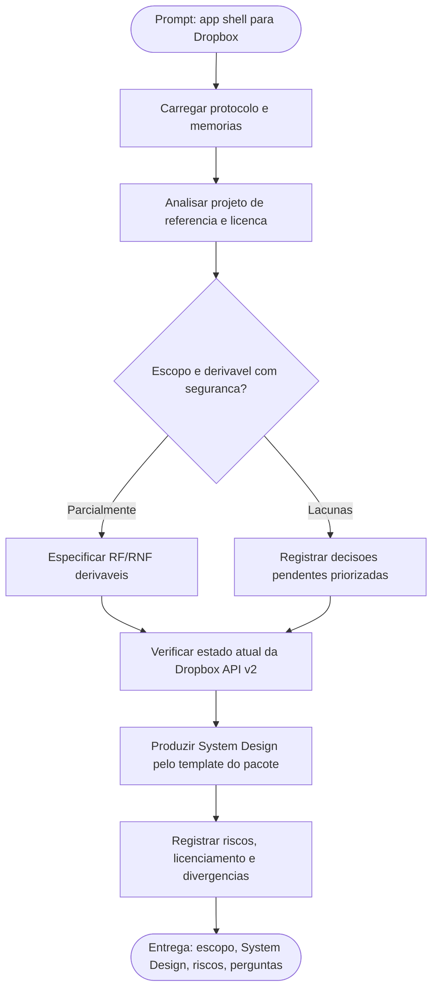

# Log de Prompt — analise-requisitos-integracao-dropbox-shell

## Prompt Original

> desejo desenvolver uma aplicação em shell script pra integração com o dropbox, use como modelo ../Dropbox-Uploader

Complemento recebido do Tech Lead (acionamento do Business Analyst): produzir analise de requisitos e System Design inicial, sem implementar codigo, tratando explicitamente licenciamento GPLv3 do modelo, ambiguidade de escopo, estado atual da Dropbox API v2 e contaminacao da memoria de projeto herdada do pacote de origem.

Nenhum segredo, credencial, token ou dado pessoal foi identificado no prompt. Nao houve necessidade de sanitizacao.

---

## Interpretação

### Intenção Principal

O solicitante quer uma aplicacao CLI escrita em shell script que integre com o Dropbox, usando o projeto `Dropbox-Uploader` como referencia de modelo. O objetivo declarado e a capacidade de integracao; o diferencial em relacao ao projeto de referencia nao foi declarado e permanece como a maior lacuna de escopo.

### Entidades Identificadas

| Entidade | Tipo | Relevância |
|---|---|---|
| `/home/sales/dropbox_api` | Projeto alvo (vazio) | Repositorio onde a solucao sera construida; nao possui codigo nem git inicializado |
| `/home/sales/Dropbox-Uploader` | Projeto de referencia | Modelo funcional e arquitetural citado explicitamente pelo solicitante |
| `dropbox_uploader.sh` | Arquivo (1834 linhas) | Script monolitico que concentra ~35 funcoes e todos os comandos |
| `dropShell.sh` | Arquivo (422 linhas) | Shell interativo derivado do script principal |
| `testUnit.sh` | Arquivo (106 linhas) | Suite de testes do projeto de referencia |
| `LICENSE` (GNU GPL v3) | Restricao legal | Define o regime de licenciamento de qualquer obra derivada |
| Dropbox API v2 | Integracao externa | Contrato de dominio: OAuth2, `api.dropboxapi.com`, `content.dropboxapi.com`, `notify.dropboxapi.com` |
| OAuth2 refresh token | Conceito / seguranca | Modelo de autenticacao vigente da Dropbox desde 2021-09-30 |
| cURL | Dependencia tecnica | Unica dependencia externa do modelo de referencia |
| Context7 MCP | Ferramenta | Fonte preferencial de documentacao tecnica prevista pelo protocolo |

### Intenções Secundárias

- Reaproveitar decisoes de arquitetura ja validadas pelo projeto de referencia (dependencia minima, portabilidade, wizard de configuracao).
- Obter um artefato acionavel de escopo antes de qualquer linha de codigo.
- Evitar retrabalho por ambiguidade: o prompt nao define o delta funcional em relacao ao modelo.
- Endereçar conformidade legal antes do inicio da implementacao.

### Restrições

- Linguagem imposta pelo solicitante: shell script.
- Modelo de referencia licenciado sob GNU GPL v3, com efeito copyleft sobre obras derivadas.
- Projeto alvo sem stack detectavel (nenhum manifesto de dependencia encontrado no baseline do protocolo).
- Instrucao explicita de nao implementar codigo nesta etapa.
- Context7 MCP declarado como habilitado no workspace, porem nao exposto como ferramenta nesta sessao; foi usada a documentacao oficial da Dropbox como fonte primaria e a verificacao deve ser refeita quando o Context7 estiver acessivel.

### Ambiguidades e Inferências

| Ambiguidade | Inferência Adotada | Confiança |
|---|---|---|
| "use como modelo" — copiar codigo ou usar como referencia conceitual? | Nao inferido. Elevado a decisao pendente bloqueante (`DP-01`) por consequencia juridica direta. | Baixa |
| Qual o diferencial esperado em relacao ao `Dropbox-Uploader`? | Nao inferido. Elevado a decisao pendente bloqueante (`DP-02`). Requisitos derivaveis com seguranca foram especificados; o delta ficou em aberto. | Baixa |
| Uso interativo por humano ou automacao nao assistida (cron/CI)? | Nao inferido. Elevado a `DP-03`. Requisitos de codigo de saida e modo silencioso foram especificados por serem necessarios em ambos os cenarios. | Baixa |
| Conta Dropbox pessoal ou Business/Team? | Nao inferido. Elevado a `DP-04`. Afeta escopos OAuth, headers de namespace e impersonacao administrativa. | Baixa |
| "aplicacao" implica shell interativo como o `dropShell.sh`? | Inferido que o nucleo e uma CLI nao interativa; shell interativo tratado como escopo condicional (`DP-13`). | Média |
| Plataformas alvo | Inferido Linux como minimo; portabilidade macOS/BSD tratada como decisao pendente (`DP-07`) por impacto em compatibilidade com bash 3.2. | Média |
| Necessidade de persistencia estruturada | Inferido que nao ha banco de dados; estado local e arquivo de configuracao e cache de token. Handoff de DBA nao aplicavel no escopo atual. | Alta |
| Existencia de frontend | Inferido que nao ha interface grafica. Secao obrigatoria de Design System do System Design foi preenchida como nao aplicavel com justificativa. | Alta |

---

## Plano de Ação

### Passos Planejados

1. **Bootstrap de protocolo**: carregar `.claude/agents-protocol/AGENTS.md`, `MEMORIA-COMPARTILHADA.md` e `MEMORIA-PROJETO.md`, identificando que a memoria de projeto ainda descreve o pacote de origem.
2. **Analise do modelo**: ler `README.md`, `dropbox_uploader.sh` e `LICENSE` do projeto de referencia para extrair capacidades, contratos de API, decisoes arquiteturais e fragilidades observaveis.
3. **Verificacao da API**: confirmar o estado vigente do OAuth2 da Dropbox, endpoints depreciados, limites de upload e semantica de erro, usando documentacao oficial (Context7 indisponivel como ferramenta nesta sessao).
4. **Especificacao de requisitos**: produzir RF e RNF verificaveis com criterios de aceite e matriz de rastreabilidade, marcando os condicionais as decisoes pendentes.
5. **System Design**: preencher `.claude/agents-protocol/templates/system-design-template.md` com componentes, arquitetura, implantacao, dimensionamento e diagramas Mermaid.
6. **Riscos e decisoes pendentes**: consolidar risco de licenciamento, riscos tecnicos e a lista priorizada de perguntas que somente o solicitante pode responder.

---

## Contexto do Projeto Aplicado

> Protocolo comum `.claude/agents-protocol/AGENTS.md` itens 1, 2, 3, 8, 16, 22, 28, 29 e 35. Persona Business Analyst: ownership do System Design e obrigatoriedade de criterio de aceite por requisito. Skills acionadas: `prompt-logger` (este log), `prd-generator` e `user-story-writing` (estrutura de requisitos e criterios de aceite), `clean-architecture` (fronteiras e separacao de responsabilidades da arquitetura proposta), `mermaid-generator` (diagramas). A skill `use-case-specification` foi consultada e considerada nao aplicavel: seu escopo declarado e customizacao de modelo de linguagem com avaliacao por LLM-as-a-Judge, o que nao corresponde a esta demanda; o conteudo equivalente (problema de negocio, usuarios primarios, criterios de sucesso mensuraveis) foi incorporado ao documento de requisitos.

---

## Resultado Esperado

Conjunto de artefatos em `docs/`, sem implementacao de codigo:

- `docs/requisitos/escopo-requisitos-e-criterios-de-aceite.md`
- `docs/requisitos/decisoes-pendentes.md`
- `docs/requisitos/riscos-restricoes-e-licenciamento.md`
- `docs/arquitetura/system-design.md`
- Este log de prompt.
