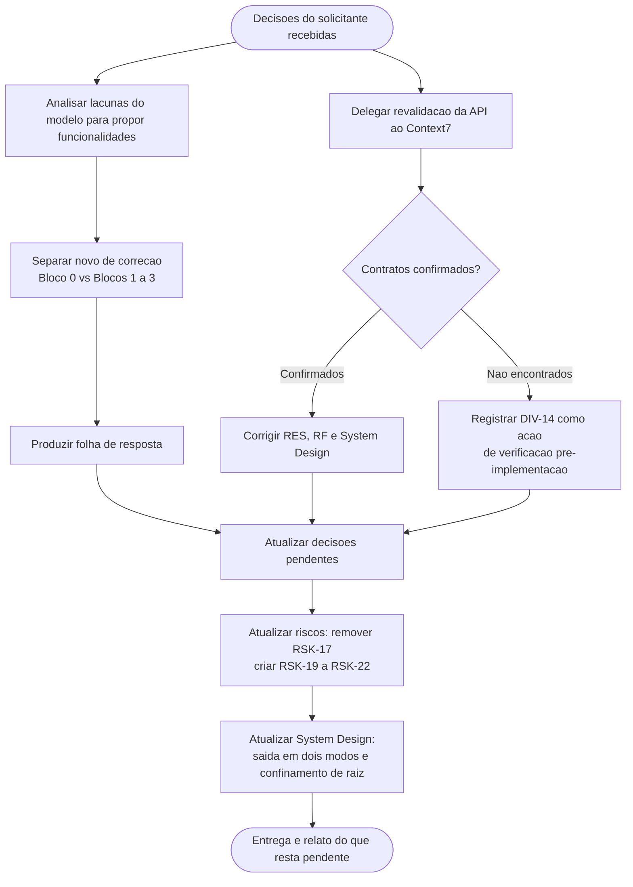

# Log de Prompt — atualizar-artefatos-apos-decisoes-solicitante

## Prompt Original

> O solicitante respondeu as decisoes bloqueantes. Atualize os artefatos.
>
> **Decisoes tomadas pelo solicitante**
> - **DP-01 (licenciamento): RESOLVIDA — reimplementacao independente.** O `Dropbox-Uploader` e referencia conceitual apenas; nao copiar codigo GPLv3. O projeto fica livre para escolher licenca (a escolha especifica da licenca vira pendencia P1, nao P0).
> - **DP-02 (motivacao): PARCIALMENTE RESOLVIDA — "funcionalidade nova".** O solicitante indicou que a demanda se justifica por funcionalidades que o modelo nao tem. NAO especificou quais.
> - **DP-03 (modo de uso): RESOLVIDA — ambos.** Interativo e automatizado (cron/CI). Exige deteccao de TTY, saida parseavel em modo nao-interativo, exit codes confiaveis, ausencia de prompts bloqueantes quando nao houver TTY.
> - **DP-04 (conta/escopo): RESOLVIDA — conta pessoal, acesso a Dropbox inteira** (nao restrito a pasta do aplicativo). Registre o risco associado ao escopo amplo.
>
> **Tarefas**
> 1. Prioridade maxima — propor o conjunto de funcionalidades novas, concreto e priorizado, com valor, esforco relativo e o que desbloqueia, distinguindo "novo" de "correcao do que o modelo faz mal".
> 2. Atualizar `docs/requisitos/decisoes-pendentes.md`.
> 3. Destravar os RF condicionais que ficaram derivaveis; ajustar RNF afetados pelo modo duplo e pelo escopo amplo.
> 4. Correcao factual — remover DIV-10 e RSK-17. O Context7 MCP esta ativo; as ferramentas MCP sao *deferred* e exigem chamada previa a `ToolSearch`. Biblioteca validada: `/websites/dropbox_developers_http`.
> 5. Atualizar o System Design.

Nenhum segredo, credencial, token ou dado pessoal foi identificado. Nao houve necessidade de sanitizacao.

---

## Interpretação

### Intenção Principal

Incorporar aos artefatos de requisitos e arquitetura as quatro decisoes tomadas pelo solicitante, corrigir um erro factual do proprio Business Analyst sobre a disponibilidade do Context7 MCP, revalidar os contratos da Dropbox API pela fonte preferencial do protocolo, e converter a resposta vaga de DP-02 ("funcionalidade nova") em uma proposta concreta e priorizada que o solicitante possa confirmar, cortar ou acrescentar.

### Entidades Identificadas

| Entidade | Tipo | Relevância |
|---|---|---|
| `docs/requisitos/escopo-requisitos-e-criterios-de-aceite.md` | Artefato | Requisitos, restricoes e divergencias a atualizar |
| `docs/requisitos/decisoes-pendentes.md` | Artefato | Reescrito para refletir o novo estado das decisoes |
| `docs/requisitos/riscos-restricoes-e-licenciamento.md` | Artefato | Matriz de riscos a atualizar; risco de escopo amplo a criar |
| `docs/arquitetura/system-design.md` | Artefato | Arquitetura afetada por saida em dois modos e por confinamento de raiz |
| `docs/requisitos/funcionalidades-candidatas.md` | Artefato novo | Proposta de 22 candidatas com folha de resposta |
| Context7 MCP · `/websites/dropbox_developers_http` | Fonte de documentacao | Fonte preferencial pelo item 28 do protocolo comum |
| DIV-10, RSK-17 | Registros | Removidos por erro factual |
| `ToolSearch` | Ferramenta | Mecanismo de descoberta exigido pelas ferramentas MCP de carregamento diferido |

### Intenções Secundárias

- Reduzir o esforco cognitivo do solicitante: entregar lista para marcar em vez de pergunta aberta.
- Preservar a honestidade do registro ao documentar o proprio erro em vez de apaga-lo silenciosamente.
- Evitar criar escopo nao aprovado: nao especificar RF para funcionalidades ainda nao confirmadas.
- Manter a rastreabilidade entre decisao, requisito, risco e componente arquitetural.

### Restrições

- Nao implementar codigo.
- Portugues do Brasil nos artefatos de governanca.
- `ToolSearch` **nao esta exposto** no conjunto de ferramentas desta sessao do Business Analyst; a consulta ao Context7 foi delegada a um subagente com acesso, que retornou os achados como texto.
- Nao antecipar requisitos de funcionalidades ainda pendentes de confirmacao.

### Ambiguidades e Inferências

| Ambiguidade | Inferência Adotada | Confiança |
|---|---|---|
| "Destrave os RF que estavam marcados como Condicional" — quais efetivamente destravaram? | Apenas RF-06 mudou de estado, e para **fora de escopo**, nao para derivavel: DP-04 fixou conta pessoal, eliminando Business/Team. RF-05, RF-14 e RF-24 continuam condicionais porque dependem de DP-05, DP-06 e DP-16, ainda abertas | Alta |
| Quantas funcionalidades propor? | Proposta ampla (22) organizada em tres blocos por prioridade, com recomendacao explicita de fixar de quatro a seis no primeiro ciclo. Lista curta demais induziria o solicitante a aceitar sem considerar alternativas | Média |
| DP-05 continua P0? | Rebaixada para P1: com conta pessoal unica definida em DP-04, deixou de bloquear o inicio, embora continue definindo o formato de configuracao | Média |
| A afirmacao da v0.1 de que `/2/files/search` foi "retirado em 28/02/2021" se sustenta? | **Nao pela documentacao oficial.** O Context7 confirma que o endpoint nao consta mais da documentacao, mas nao ha marcacao de retirada — enquanto outros endpoints (`sharing/create_shared_link`) **sim** trazem aviso explicito de depreciacao. Texto corrigido para "nao consta mais da documentacao vigente"; conclusao operacional inalterada | Alta |
| O multiplo de 4 MiB e recomendacao geral? | **Nao.** E obrigatorio apenas em sessao concorrente. Erro da v0.1 corrigido em RES-10, RF-08, dimensionamento e DIV-13 | Alta |

---

## Plano de Ação

### Passos Planejados

1. **Revalidacao de contratos**: delegar a consulta ao Context7 sobre `/websites/dropbox_developers_http`, cobrindo busca, variantes `_v2`, fluxo OAuth, escopos, upload, `content_hash`, tratamento de erro e acesso amplo.
2. **Proposta de funcionalidades**: derivar candidatas da analise de lacunas ja feita, separando explicitamente correcao de defeito (Bloco 0) de funcionalidade nova (Blocos 1 a 3), com valor, esforco, dependencia de estado local e folha de resposta.
3. **Decisoes pendentes**: marcar DP-01, DP-03 e DP-04 como resolvidas com as consequencias registradas; reescrever DP-02 como pergunta especifica; criar DP-20; rebaixar DP-05.
4. **Requisitos**: mover RF-06 para fora de escopo, criar RF-06a, promover RF-15 e RF-28 a P0, reescrever RF-22 e RF-30, criar RNF-20 e RNF-21, corrigir RES-04 a RES-14.
5. **Riscos**: remover RSK-17, atualizar RSK-01, RSK-02 e RSK-12, criar RSK-19 a RSK-22.
6. **System Design**: incorporar a camada de saida com duas apresentacoes, o confinamento de raiz em `lib/path`, os contratos revalidados e as novas decisoes de trade-off.

---

## Contexto do Projeto Aplicado

> Protocolo comum `.claude/agents-protocol/AGENTS.md` itens 2 (prompt-logger), 8 (Markdown com Mermaid), 22 (sinalizacao de divergencias), 28 (Context7 como fonte preferencial) e 29 (idioma). Persona Business Analyst: ownership do System Design e obrigatoriedade de criterio de aceite verificavel por requisito. Skills aplicadas: `prompt-logger` (este log), `prd-generator` e `user-story-writing` (estrutura da proposta de funcionalidades e criterios de aceite), `clean-architecture` (a decisao de saida em dois modos e uma questao de fronteira: comandos devolvem resultado, nao imprimem), `mermaid-generator` (diagramas), `documentation-sync` (analise de impacto documental das decisoes sobre os quatro artefatos existentes).
>
> Correcao de rumo registrada: a v0.1 concluiu que o Context7 MCP estava indisponivel. A conclusao era incorreta — as ferramentas MCP sao de carregamento diferido e exigem descoberta previa. Nesta sessao o mecanismo de descoberta tambem nao estava exposto ao Business Analyst, e a consulta foi delegada a um subagente com acesso.

---

## Resultado Esperado

- Artefato novo: `docs/requisitos/funcionalidades-candidatas.md`.
- Atualizacao de `docs/requisitos/decisoes-pendentes.md`, `docs/requisitos/escopo-requisitos-e-criterios-de-aceite.md`, `docs/requisitos/riscos-restricoes-e-licenciamento.md` e `docs/arquitetura/system-design.md`.
- Este log.
- Relato objetivo com o que mudou por arquivo, o conjunto de funcionalidades proposto e o que resta pendente.
