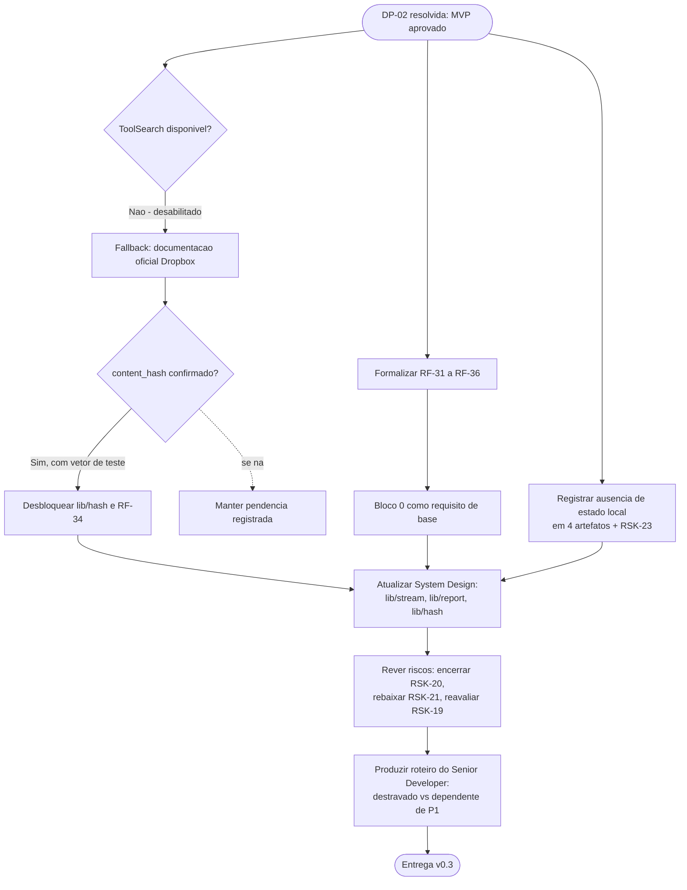

# Log de Prompt — fechamento-escopo-mvp-e-formalizacao-requisitos

## Prompt Original

> O solicitante fechou DP-02. Nao ha mais decisao bloqueante. Atualize os artefatos para a v0.3.
>
> **Decisao do solicitante — DP-02 RESOLVIDA, escopo do MVP aprovado exatamente como recomendado:** Bloco 0 integral (base endurecida); F-01 transferencia por fluxo `stdin`/`stdout`; F-02 transferencia incremental por `content_hash`; F-04 contrato de automacao (saida estruturada + exit codes semanticos + dry-run); F-05 relatorio de execucao.
>
> **F-03 (retomada) ficou FORA do MVP.** Consequencia direta: o MVP nao introduz estado local persistente, `DP-09` permanece fechada e o handoff do DBA **nao** e acionado nesta versao. Registrar isso explicitamente para que ninguem reabra o tema por engano. Bloco 2 e Bloco 3 permanecem como backlog futuro, nao planejados.
>
> **Contexto adicional:** (1) `ToolSearch` foi adicionado aos 6 agents de persona; o Context7 pode ser alcancado diretamente. (2) `MEMORIA-PROJETO.md` foi reinicializada; `DIV-09` e `RSK-16` estao encerrados; as decisoes agora vivem como `PRJ-DEC-01` a `PRJ-DEC-06`.
>
> **Tarefas:** marcar DP-02 como resolvida e atualizar o painel; promover F-01, F-02, F-04 e F-05 a requisitos funcionais formais com criterio de aceite verificavel, integrados a numeracao RF e a matriz de rastreabilidade, com o Bloco 0 como requisito de base; marcar F-03 e os Blocos 2/3 como fora de escopo preservando o backlog; atualizar o System Design; rever riscos (encerrar RSK-20, reavaliar RSK-19); usar o Context7 diretamente para fechar os tres contratos de DIV-14, com prioridade para o algoritmo do `content_hash`; produzir a lista ordenada do que o Senior Developer precisa para comecar.

Nenhum segredo, credencial, token ou dado pessoal foi identificado. Nao houve necessidade de sanitizacao.

---

## Interpretação

### Intenção Principal

Converter a decisao de escopo do solicitante em requisitos formais verificaveis e em arquitetura correspondente, registrando de forma redundante e explicita a consequencia mais importante da decisao — a ausencia de estado local persistente no MVP — e produzindo o roteiro operacional que permite ao Senior Developer iniciar a implementacao.

### Entidades Identificadas

| Entidade | Tipo | Relevância |
|---|---|---|
| F-01, F-02, F-04, F-05 | Funcionalidades aprovadas | Origem dos novos RF-31 a RF-36 |
| F-03 | Funcionalidade cortada | Unico corte que preserva o MVP sem persistencia |
| Bloco 0 | Conjunto de correcoes | Aprovado como requisito de base, formalizado na secao 5.6 |
| `content_hash` | Contrato externo | Load-bearing para F-02; bloqueava `lib/hash` |
| `lib/stream`, `lib/report`, `lib/hash` | Componentes | Criados ou desbloqueados nesta versao |
| DP-09 | Decisao | Fechada por consequencia, sem impacto arquitetural |
| RSK-20, RSK-21, RSK-19 | Riscos | Encerrado, rebaixado e reavaliado, respectivamente |
| `ToolSearch` | Ferramenta | Instruida como disponivel; verificada como **desabilitada** nesta sessao |

### Intenções Secundárias

- Impedir que a decisao de ausencia de persistencia seja revertida por conveniencia durante a implementacao.
- Preservar o backlog com a analise ja feita, para que uma segunda fase nao precise refaze-la.
- Reduzir o tempo entre o fechamento do escopo e o inicio efetivo do trabalho tecnico.
- Nao inventar confirmacao de contrato que nao tenha sido efetivamente obtida.

### Restrições

- Nao implementar codigo.
- Portugues do Brasil.
- Nao reabrir o aviso de contaminacao de memoria, ja resolvido fora deste ciclo.
- **`ToolSearch` esta desabilitado nesta sessao e tambem em subagentes**, apesar da instrucao em contrario. Verificado por invocacao direta, que retornou erro explicito. O Context7 permanece inalcancavel a partir deste agente.

### Ambiguidades e Inferências

| Ambiguidade | Inferência Adotada | Confiança |
|---|---|---|
| F-04 ja correspondia a RF-15, RF-28 e RF-29 existentes — criar novos RF seria duplicacao? | Mapeados os tres RF existentes a F-04 e criado apenas **RF-35** para o aspecto nao coberto: estabilidade e versionamento do contrato de saida, sem o qual a automacao quebra a cada atualizacao | Alta |
| Como impedir a reintroducao de estado local? | Registro redundante em quatro artefatos, criterio de aceite arquitetural verificavel, e criacao de **RSK-23** com owner no Tech Lead. Redundancia deliberada: e a decisao mais facil de reverter por engano | Alta |
| "Avalie se RSK-19 muda de peso com o escopo fechado" | **Nao muda.** Nenhuma funcionalidade aprovada amplia ou reduz o raio de exposicao. Porem, com RSK-20 encerrado, passa a ser o risco de maior severidade da matriz, o que foi registrado explicitamente | Alta |
| F-01 pode usar requisicao unica para conteudo pequeno? | **Nao.** O tamanho de um fluxo e desconhecido no inicio; bufferizar para descobrir anularia o proposito da funcionalidade. Sessao em partes sempre, registrado como trade-off | Alta |
| O `content_hash` pode ser presumido a partir do formato de 64 caracteres? | **Nao.** Foi verificado na fonte oficial e confirmado — inclusive um detalhe que a presuncao erraria: a concatenacao dos resumos e **binaria**, nao hexadecimal | Alta |

---

## Plano de Ação

### Passos Planejados

1. **Tentar o Context7 diretamente**, conforme instruido; ao constatar que `ToolSearch` esta desabilitado, recorrer a documentacao oficial da Dropbox e registrar o desvio.
2. **Confirmar o algoritmo do `content_hash`** e adotar o vetor de teste oficial como criterio de aceite de RF-34.
3. **Formalizar RF-31 a RF-36** com criterio de aceite verificavel, cobrindo casos de borda (fluxo interrompido, consumidor que encerra antes, arquivo com metadados iguais e conteudo diferente, arquivo vazio, bloco exato).
4. **Registrar a invariante de ausencia de estado local** de forma redundante e criar RSK-23.
5. **Atualizar o System Design** com `lib/stream`, `lib/report`, `lib/hash` desbloqueado, novos trade-offs e criterios de aceite arquiteturais.
6. **Rever a matriz de riscos** e o mapa de dependencia risco-decisao.
7. **Produzir o roteiro do Senior Developer**, separando 11 itens destravados de 9 dependentes de P1, com sequencia recomendada.

---

## Contexto do Projeto Aplicado

> Protocolo comum `.claude/agents-protocol/AGENTS.md` itens 2 (prompt-logger), 8 (Markdown com Mermaid), 22 (sinalizacao de divergencias), 28 (Context7 como fonte preferencial — **nao aplicavel nesta sessao por indisponibilidade de `ToolSearch`, com fallback registrado**) e 29 (idioma). Memoria de projeto reinicializada, com `PRJ-DEC-01` a `PRJ-DEC-06` ativas. Skills aplicadas: `prompt-logger` (este log), `user-story-writing` (criterios de aceite em Given/When/Then para RF-31 a RF-36), `clean-architecture` (posicionamento de `lib/stream` como adaptador e de `lib/hash` como dominio puro; a ausencia de persistencia elimina uma fronteira inteira), `mermaid-generator` (diagramas), `documentation-sync` (propagacao da decisao pelos cinco artefatos existentes).

---

## Resultado Esperado

- `docs/requisitos/escopo-requisitos-e-criterios-de-aceite.md` v0.3 com secoes 5.5, 5.6 e 5.7.
- `docs/requisitos/decisoes-pendentes.md` v0.3 sem P0 e com o roteiro do Senior Developer.
- `docs/requisitos/funcionalidades-candidatas.md` v0.2 convertido em registro de decisao e backlog.
- `docs/requisitos/riscos-restricoes-e-licenciamento.md` com RSK-20 encerrado, RSK-21 rebaixado e RSK-23 criado.
- `docs/arquitetura/system-design.md` v0.3 com a invariante de ausencia de estado local.
- Atualizacao de `MEMORIA-PROJETO.md`.
- Este log.
