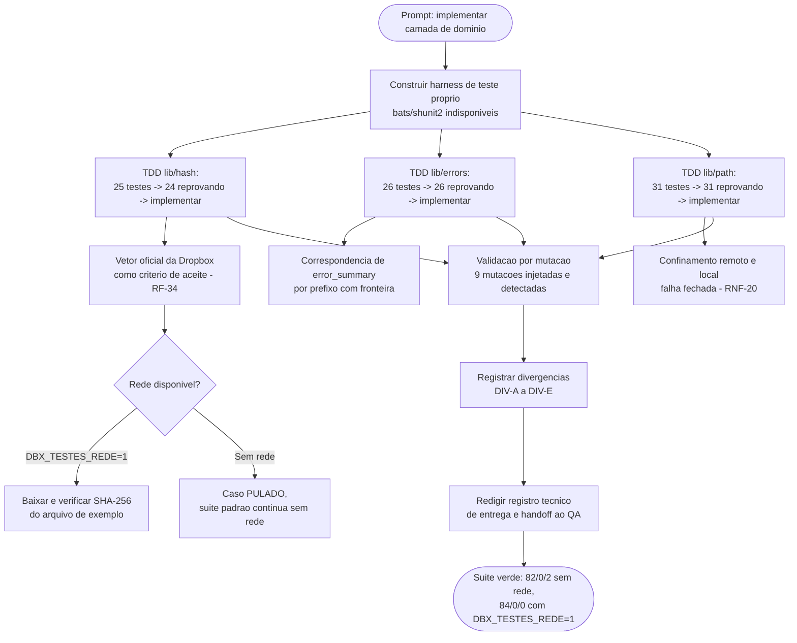

# Log de Prompt — implementacao-camada-dominio

## Prompt Original

> Implemente a camada de dominio da aplicacao: `lib/hash`, `lib/errors` e `lib/path`. **TDD obrigatorio** — os testes de cada componente devem existir e ser executados, com estado vermelho registrado, antes da implementacao correspondente.
>
> Requisitos a atender: confinamento de raiz conforme RNF-20 (recusar caminho fora da raiz permitida antes de qualquer chamada de rede, com falha fechada quando a raiz for ausente ou malformada); codigos de saida deterministicos conforme RF-29 (uma classe de erro, um codigo, estavel entre execucoes); contrato do `content_hash` conforme RF-34, com **concatenacao binaria** dos resumos de bloco, nunca hexadecimal.
>
> Restricoes obrigatorias: **proibido derivar codigo do `Dropbox-Uploader`** (GPLv3) — nenhum trecho de codigo, estrutura de funcoes, nome interno ou mensagem literal pode ser incorporado (RES-02); **proibido introduzir estado local persistente** (`PRJ-DEC-07`) — a camada de dominio nao pode escrever nada fora de diretorios temporarios da propria execucao; **proibido executar `git init` ou qualquer commit** — o diretorio permanece deliberadamente fora de controle de versao nesta fase (`DP-19` em aberto).

Nenhum segredo, credencial, token ou dado pessoal foi identificado no prompt recebido. **Nao houve necessidade de sanitizacao.**

---

## Interpretação

### Intenção Principal

Entregar a camada de dominio (`lib/hash`, `lib/errors`, `lib/path`) implementada e testada, com rastreabilidade explicita entre cada linha de comportamento e o requisito que a motiva, produzida por um ciclo de TDD verificavel — e nao apenas declarado.

### Entidades Identificadas

| Entidade | Tipo | Relevância |
|---|---|---|
| `lib/hash.sh` | Componente de dominio | Implementa RF-34; sustenta RF-07, RF-11, RF-31, RF-32, RF-33 |
| `lib/errors.sh` | Componente de dominio | Implementa RF-29, RF-35; sustenta RNF-08 |
| `lib/path.sh` | Componente de dominio | Implementa RNF-10, RNF-20 |
| RNF-20 | Requisito | Confinamento de raiz, falha fechada |
| RF-29, RF-35 | Requisitos | Codigos de saida deterministicos e contrato congelado |
| RF-34 | Requisito | `content_hash` com concatenacao binaria dos resumos de bloco |
| RES-02 | Restricao | Proibicao de derivar codigo do `Dropbox-Uploader` (GPLv3) |
| `PRJ-DEC-07` | Decisao de projeto | Ausencia de estado local persistente no MVP |
| `DP-19` | Decisao pendente | Inicializacao de versionamento — nao resolvida; proibe `git init` e commit nesta fase |
| `tests/` | Arcabouco | TDD obrigatorio; suite executavel sem rede e sem credencial (RNF-14) |

### Intenções Secundárias

- Preservar a invariante de ausencia de estado local durante toda a implementacao, e nao apenas no resultado final.
- **Nao fabricar o vetor oficial** do `content_hash`: usar o valor publicado pela Dropbox como criterio de aceite, sem inventar nem aproximar, e tratar sua ausencia (por falta de rede) como caso pulado, nunca como aprovacao silenciosa.
- Reportar divergencias entre o System Design/requisitos e as decisoes tecnicas efetivamente tomadas na implementacao, em vez de resolve-las silenciosamente por conta propria.

### Restrições

- Nao derivar codigo, estrutura de funcoes, nomes internos ou mensagens literais do `Dropbox-Uploader` (RES-02).
- Nao introduzir estado local persistente (`PRJ-DEC-07`) — nenhuma escrita fora de diretorio temporario da execucao.
- Nao executar `git init` nem qualquer commit (`DP-19` em aberto).
- TDD obrigatorio: testes antes da implementacao, com estado vermelho registrado como evidencia.
- Portugues do Brasil.

### Ambiguidades e Inferências

| Ambiguidade | Inferência Adotada | Confiança |
|---|---|---|
| O prompt nao especifica arcabouco de teste | `bats` e `shunit2` nao estao instalados e instalar exige sinalizacao previa; construido um harness proprio com saida em TAP 13, para nao comprometer uma troca futura por `bats` (ver D1 no registro de entrega) | Alta |
| O System Design lista `lib/json` como dependencia de `lib/errors`, mas `lib/json` nao existe e `lib/errors` deveria ser dominio puro | A dependencia foi invertida: `lib/errors` recebe strings ja extraidas (codigo HTTP, `error_summary`) do chamador, preservando "dominio sem dependencia externa". Divergencia registrada formalmente (DIV-A) para correcao do System Design, e nao corrigida por conta propria no documento arquitetural | Alta |
| RNF-20 fala apenas em raiz remota; o percurso de arvore e o destino de recebimento tambem podem evadir uma raiz local | Ampliado o confinamento para tambem cobrir o espaco local, com resolucao fisica de links simbolicos, como extensao deliberada e nao solicitada — registrada como divergencia a aceitar (DIV-D), nao como fato consumado | Media — decisao de escopo, nao apenas tecnica; carece de aceite explicito |
| O caso do arquivo vazio no `content_hash` nao consta da especificacao publicada pela Dropbox | Seguido o algoritmo ao pe da letra (zero blocos, SHA-256 da entrada vazia), sem inventar confirmacao contra a API que nao foi executada. Registrado como pendencia de validacao, nao como certeza | Alta |
| RNF-01 exige `bash` 3.2 e 5.x; a plataforma fixada pelo solicitante e Linux com `bash` 4+ | Usados recursos de `bash` 4 (arrays associativos, `${var,,}`), por serem necessarios para a taxonomia de erro e a comparacao de confinamento sem diferenciar caixa. Divergencia registrada (DIV-B) em vez de reescrever o requisito por conta propria | Alta |

---

## Plano de Ação

### Passos Planejados

1. Levantar o arcabouco de teste disponivel no ambiente; ao constatar ausencia de `bats`/`shunit2`, construir um harness proprio minimo (`tests/support/harness.sh`) com saida em TAP 13.
2. Para cada componente (`lib/hash`, `lib/errors`, `lib/path`), escrever a suite de testes primeiro, executar e registrar o estado vermelho, so entao implementar.
3. Fixar o algoritmo do `content_hash` (RF-34) com o vetor oficial da Dropbox como criterio de aceite, sem fabricar o arquivo de terceiro no repositorio — tratado como caso condicional a rede, com salvaguarda de verificacao de insumo.
4. Derivar vetores de teste adicionais de forma independente (oraculo em Python, escrito antes da implementacao em shell) para cobrir as fronteiras do algoritmo nao cobertas pelo vetor oficial.
5. Implementar `lib/errors` com correspondencia de `error_summary` por prefixo com fronteira de componente, evitando o defeito documentado como DIV-04 do projeto de referencia.
6. Implementar `lib/path` com dois espacos de nomes (remoto e local) e confinamento de raiz falho-fechado, cobrindo a lacuna de evasao por link simbolico no espaco local como ampliacao deliberada de RNF-20.
7. Injetar mutacoes deliberadas nos tres componentes para validar que a suite realmente detecta os defeitos que se propos a prevenir.
8. Registrar formalmente as divergencias encontradas entre a implementacao e o System Design/requisitos, sem corrigi-las silenciosamente nos documentos arquiteturais.
9. Redigir o registro tecnico de entrega e o handoff formal ao QA Expert, com evidencias reais de execucao (nao estimadas).
10. Nao executar `git init` nem commit, em conformidade com `DP-19`.

---

## Contexto do Projeto Aplicado

> Escopo previsto em [System Design](../arquitetura/system-design.md), secao "Proximos passos", item 2: "Iniciar pela camada de dominio, integralmente destravada: `lib/hash` (contrato confirmado, com vetor de teste oficial), `lib/errors` e `lib/path`. Concentra o maior risco tecnico do projeto e nao depende de nenhuma decisao pendente." Requisitos formais em [escopo-requisitos-e-criterios-de-aceite.md](../requisitos/escopo-requisitos-e-criterios-de-aceite.md), secoes 5.4, 5.5 e 6 (RF-29, RF-33, RF-34, RF-35, RNF-08, RNF-10, RNF-20). Decisoes de projeto aplicadas: `PRJ-DEC-07` (ausencia de estado local persistente), `PRJ-DEC-08` (algoritmo do `content_hash` confirmado). Restricao RES-02 (proibicao de derivacao de codigo do `Dropbox-Uploader`, GPLv3) e `DP-19` (repositorio ainda fora de controle de versao) observadas integralmente.

---

## Resultado Esperado

- `lib/hash.sh`, `lib/errors.sh`, `lib/path.sh` implementados e testados.
- `tests/run.sh`, `tests/support/harness.sh`, `tests/support/fixtures.sh` e os quatro arquivos de teste unitario.
- `docs/registros/vetores-content-hash.md` — procedencia reproduzivel dos vetores de teste do `content_hash`.
- `docs/registros/2026-08-17_entrega-camada-dominio.md` — registro tecnico da entrega e handoff formal ao QA Expert.
- Este log.
- Suite verde: 82 aprovados / 0 reprovados / 2 pulados sem rede; 84 aprovados / 0 reprovados / 0 pulados com `DBX_TESTES_REDE=1`.
- Nenhum commit e nenhuma inicializacao de repositorio git, em conformidade com `DP-19`.
