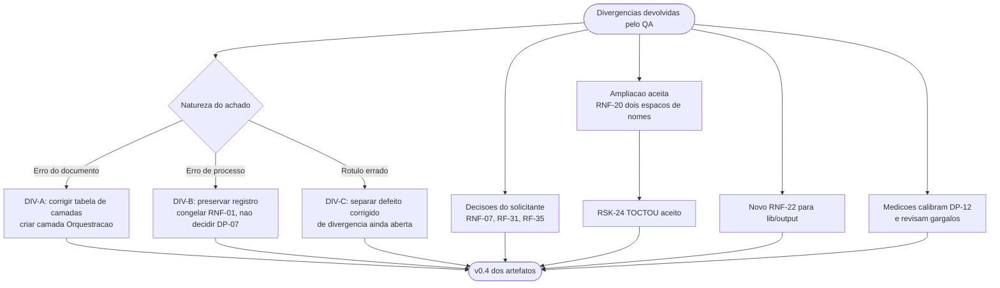

# Log de Prompt — correcoes-documentais-pos-qa-camada-dominio

## Prompt Original

> A camada de dominio foi implementada e passou por tres ciclos de QA — parecer final **aprovado com ressalva**. O processo devolveu divergencias documentais que sao suas. Atualize os artefatos.
>
> **DIV-A ampliada — tres inconsistencias no System Design:** (1) `lib/errors` classificado como dominio mas com dependencia declarada de `lib/json`; a implementacao inverteu corretamente e ha teste que reprova referencia a `jq`, `lib/json` ou adaptadores. (2) `lib/transfer` classificado como dominio mas com dependencia de `lib/http` — mais grave, por ser o nucleo de F-01/F-02 na Etapa 2. (3) `lib/hash` ausente da tabela de camadas mas presente no subgrafo de dominio do diagrama.
>
> **DIV-B premissa refutada:** a implementacao usa `declare -A`, `declare -g` e `${var,,}`, incompativeis com `bash` 3.2, mas a justificativa registrada dizia que "o solicitante fixou Linux com bash 4+" — e ele **nao fixou**. `DP-07` continua aberta. O piso real e **4.4** (`declare -g` exige 4.2; a harness exige 4.4 por `"${casos[@]}"` com array vazio sob `set -u`), o que deixa RHEL 6 (bash 4.1) fora. Registrar: piso real, antecipacao de decisao como divergencia de processo, e `RNF-01` so atualizado quando DP-07 fechar. **Nao decidir DP-07.**
>
> **DIV-C reclassificar:** RNF-10 x RF-28/RF-35 estava como "conflito de formato a decidir"; era, na epoca, **defeito ativo** em `lib/path` (valor errado com status 0), ja corrigido em C2-01/D1. Reclassificar para refletir defeito de implementacao **e** divergencia de requisito, com apenas a segunda em aberto.
>
> **RNF-20 emendar:** hoje fala so da raiz remota; a implementacao entregou tambem confinamento **local** com resolucao fisica de symlinks, aceito pelo solicitante; QA resistiu a oito vetores. Registrar TOCTOU como risco residual aceito (nota do QA: mitigacao por `readlink` compara texto e falha sob `rename`; o correto seria dispositivo+inode; `/proc/self/fd` e exclusivo de Linux e fecharia DP-07 a forca; nao cobre percurso recursivo) e a raiz `/` sob opt-in explicito com falha fechada.
>
> **Decisoes do solicitante a registrar:** (1) `5xx` segue a regra de idempotencia do `http=0` — ajustar `RNF-07`. (2) C2-08 aceito sem ressalva: `stdin` transita por `$TMPDIR` em blocos de 4 MiB, 0600 sob area 0700; **nao acrescentar** nota operacional sobre `$TMPDIR`. (3) codigo 16 `dependencia_ausente` **rejeitado**; faixa permanece 0..15. (4) codigos 5–15 aceitos como contrato publico de RF-35.
>
> **Novo requisito para `lib/output`:** a redacao de cabecalho sensivel consome o restante da linha; logo `lib/output` nao pode concatenar diagnostico na mesma linha de cabecalho sensivel, sob pena de perder o `request_id` de RF-30.
>
> **Dados de dimensionamento:** `content_hash` ~320 MB/s (100 GiB ≈ 5,4 min, era ~2 h), memoria plana ~8.000 KiB; `lib/path` profundidade 5.000 em 0,88 s; redacao de erro ~n^1.5, 4 KiB em 0,02 s e 256 KiB em 4,56 s.
>
> **Restricoes:** sem `git init`, sem commit; nao alterar `lib/`, `tests/` nem `docs/registros/`.

Nenhum segredo, credencial ou dado pessoal identificado. Sem necessidade de sanitizacao.

## Interpretação

### Intenção Principal

Corrigir divergencias documentais devolvidas pelo ciclo de QA da camada de dominio, distinguindo com rigor tres naturezas diferentes de achado: **erro do documento** (DIV-A), **erro de processo a preservar em vez de apagar** (DIV-B) e **reclassificacao de algo registrado sob rotulo errado** (DIV-C). Incorporar decisoes ja tomadas pelo solicitante e dados reais de medicao, sem decidir nada que caiba a ele.

### Entidades Identificadas

| Entidade | Tipo | Relevância |
|---|---|---|
| Tabela de camadas do System Design | Artefato | Origem das tres inconsistencias de DIV-A |
| `lib/errors`, `lib/transfer`, `lib/hash` | Componentes | Classificacao de camada corrigida |
| `RNF-01`, `DP-07` | Requisito e decisao | Congelado e mantido aberto, respectivamente |
| `RNF-07`, `RNF-10`, `RNF-20`, `RF-31`, `RF-35` | Requisitos | Ajustados por decisao do solicitante ou por achado do ciclo |
| `RNF-22` | Requisito novo | Restricao de entrada de `lib/output` |
| TOCTOU | Risco | Aceito e documentado (`RSK-24`) |
| Medicoes de desempenho | Dados | Calibram DP-12 e alteram a lista de gargalos |

### Intenções Secundárias

- Impedir que a violacao de camada de `lib/transfer` nasca junto com F-01 e F-02 na Etapa 2.
- Preservar o registro de que uma decisao do solicitante foi antecipada, como precedente a nao repetir.
- Dar ao solicitante a informacao material que faltava para decidir DP-07 (piso 4.4, RHEL 6 fora).
- Nao ampliar escopo por conta propria: respeitar a dispensa explicita da nota sobre `$TMPDIR`.

### Restrições

- Escrita limitada a `docs/requisitos/` e `docs/arquitetura/`; `lib/`, `tests/` e `docs/registros/` pertencem ao Senior Developer nesta rodada.
- Sem `git init` e sem commit.
- **Proibido decidir DP-07.**
- Proibido acrescentar nota operacional sobre `$TMPDIR`, dispensada pelo solicitante.

### Ambiguidades e Inferências

| Ambiguidade | Inferência Adotada | Confiança |
|---|---|---|
| Como corrigir `lib/transfer` sem inventar arquitetura? | O diagrama de componentes **ja** o posicionava fora do dominio; apenas a tabela divergia. Criei a camada **Orquestracao** para nomear com honestidade o que `lib/transfer`, `lib/walk` e `lib/report` sempre fizeram, em vez de force-los ao rotulo de adaptador | Alta |
| `RNF-01` deve ser reescrito para 4.4? | **Nao.** A instrucao e explicita: so quando DP-07 fechar. Congelei o requisito com a redacao original e marquei o conflito, registrando o piso 4.4 como **dado para a decisao**, nao como decisao | Alta |
| RF-31 dizia "sem materializar em disco" e C2-08 aceita transito por `$TMPDIR` — contradicao? | Sim, e corrigi a redacao. O invariante que de fato importa e o **teto de ocupacao** (um bloco de 4 MiB), nao a ausencia de disco. Ajustei sem acrescentar a nota operacional dispensada | Alta |
| DIV-C pede "reclassificar" — apagar o registro anterior? | Nao. Reescrevi mostrando que eram **duas coisas sob um rotulo so**: defeito ativo ja corrigido, e divergencia de requisito ainda aberta. Apagar perderia o rastro de que houve falha silenciosa | Alta |
| A medicao do `content_hash` muda a arquitetura? | Muda a **lista de gargalos**: rebaixei o `content_hash` de gargalo a custo administravel e acrescentei a redacao de erro como novo ponto de atencao. O gargalo dominante segue externo | Alta |

## Plano de Ação

### Passos Planejados

1. **DIV-A**: criar a camada de Orquestracao; remover a dependencia de `lib/json` em `lib/errors`; mover `lib/transfer` para Orquestracao; incluir `lib/hash` no dominio; alinhar o diagrama e sua leitura.
2. **DIV-B**: abrir `DIV-15` como divergencia de processo; congelar `RNF-01`; registrar o piso 4.4 e a exclusao de RHEL 6 em `DP-07`; criar `RSK-25` para o precedente.
3. **DIV-C**: reescrever como `DIV-16`, separando defeito corrigido de divergencia aberta; emendar `RNF-10`; mover `lib/output` para o bloco de itens bloqueados.
4. **RNF-20**: ampliar para os dois espacos de nomes, com os oito vetores, opt-in de raiz `/` e `RSK-24`.
5. **Decisoes do solicitante**: ajustar `RNF-07` (idempotencia), `RF-31` (`$TMPDIR` em blocos) e `RF-35` (faixa 0..15 e rejeicao do codigo 16).
6. **`RNF-22`**: criar a restricao de entrada de `lib/output`.
7. **Dimensionamento**: incorporar as medicoes e revisar a tabela de gargalos.

## Contexto do Projeto Aplicado

> Protocolo comum itens 2 (prompt-logger), 8 (Markdown com Mermaid), 22 (sinalizacao de divergencias) e 29 (idioma). Persona Business Analyst: ownership do System Design; obrigacao de registrar divergencia com impacto e recomendacao **sem** decidir o que cabe ao solicitante. Skills aplicadas: `clean-architecture` (a criacao da camada de Orquestracao e a inversao de `lib/errors` sao aplicacoes diretas da regra de dependencia), `documentation-sync` (propagacao pelos quatro artefatos), `mermaid-generator`, `prompt-logger`.

## Resultado Esperado

- `docs/arquitetura/system-design.md` v0.4.
- `docs/requisitos/escopo-requisitos-e-criterios-de-aceite.md` v0.4.
- `docs/requisitos/decisoes-pendentes.md` v0.4.
- `docs/requisitos/riscos-restricoes-e-licenciamento.md` com `RSK-24` e `RSK-25`.
- Atualizacao de `MEMORIA-PROJETO.md`.
- Este log.
