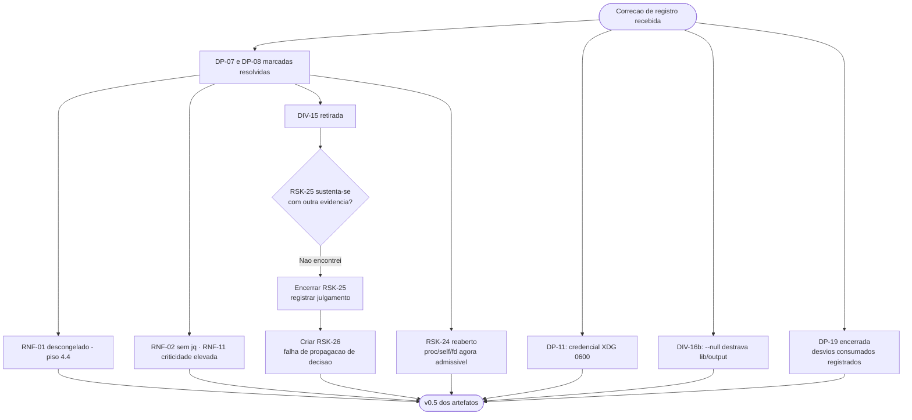

# Log de Prompt — correcao-registro-dp07-dp08-e-novas-decisoes

## Prompt Original

> Correcao de registro e tres decisoes novas do solicitante. Atualize os artefatos.
>
> **CORRECAO — DP-07 e DP-08 estavam decididas, e o erro foi meu.** A informacao de que "o solicitante nao fixou a plataforma" partiu do coordenador e estava errada. O solicitante respondeu a uma pergunta rotulada "Dependencias e plataforma (DP-07 e DP-08)" escolhendo **"So cURL, bash 4+, Linux"** — isso *era* a decisao, e nunca foi levada aos documentos de requisitos. Depois, o estado do documento foi tomado como prova de que nao havia decisao.
>
> Corrigir: (1) **DP-07 resolvida** — Linux, `bash`. (2) **DP-08 resolvida** — sem `jq`, parsing proprio. (3) **RNF-01 descongelado**, piso **4.4**, registrado como *refinamento tecnico* da decisao do solicitante, nao decisao nova; manter RHEL 6 fora. (4) **DIV-15 reavaliada** — a premissa do Senior Developer estava correta; o documento e que estava desatualizado. (5) **RSK-25 reavaliado com cuidado** — o caso citado nao sustenta o risco; julgar se continua valido em tese com outra evidencia ou se deve ser encerrado; nao mante-lo apoiado em exemplo falso; se encerrar, registrar que a falha real foi de **propagacao de decisao**, que talvez mereca registro proprio.
>
> **Decisoes novas:** (6) **DP-11 resolvida** — credencial em arquivo `0600` sob `~/.config` seguindo XDG, permissao verificada no preflight, sem sobrescrita por variavel de ambiente. (7) **DIV-16b resolvida** — saida orientada a linha por padrao, opcao `--null` com terminador `\0`; destrava `lib/output`; notar a interacao com **RNF-22**, que continua valendo no modo `--null`. (8) **Versionamento** — repositorio criado e publicado em `github.com:salesadriano/dropbox_sync`, branch `master`; Gitflow autorizado com `develop` e `feature/*`; **DP-19 pode ser encerrada**; registrar os desvios consumados: commit inicial sem convencao semantica e `LICENSE` publicado com titular em espaco reservado, com `DP-20`/`DIV-E` ainda abertas e o placeholder agora no historico publico.
>
> **Ainda abertas:** DP-05, DP-06, DP-10, DP-12, DP-20. Nao alterar `lib/`, `tests/` nem `docs/registros/`.

Nenhum segredo, credencial ou dado pessoal identificado. Sem necessidade de sanitizacao.

## Interpretação

### Intenção Principal

Desfazer uma cadeia de conclusoes erradas construidas sobre um documento desatualizado, propagar tres decisoes novas do solicitante, e emitir julgamento fundamentado sobre a permanencia de um risco cuja unica evidencia foi retratada.

### Entidades Identificadas

| Entidade | Tipo | Relevância |
|---|---|---|
| `DP-07`, `DP-08` | Decisoes | Ja estavam tomadas; registro corrigido |
| `RNF-01`, `RNF-02`, `RNF-11` | Requisitos | Descongelado, fixado sem `jq`, elevado a criticidade maxima |
| `DIV-15` | Divergencia | **Retirada** — acusacao infundada |
| `RSK-25` | Risco | **Encerrado** — evidencia falsa |
| `RSK-26` | Risco novo | Falha de propagacao de decisao, com evidencia real |
| `RSK-24` | Risco | **Reaberto** — a condicao de reavaliacao ocorreu |
| `DP-11`, `DIV-16b`, `DP-19` | Decisoes novas | Destravam `lib/config`, `lib/output` e encerram governanca do repositorio |
| `DP-20` / `DIV-E` | Decisao aberta | Urgencia elevada: placeholder no historico publico |

### Intenções Secundárias

- Restituir a correcao do trabalho do Senior Developer, que havia sido acusado indevidamente.
- Evitar substituir um registro errado por outro igualmente mal fundamentado.
- Aproveitar o fechamento de `DP-07` para revisitar decisoes que dependiam dele, e nao apenas as que o citavam diretamente.

### Restrições

- Escrita limitada a `docs/requisitos/` e `docs/arquitetura/`.
- Nao manter `RSK-25` apoiado em exemplo falso.
- Portugues do Brasil.

### Ambiguidades e Inferências

| Ambiguidade | Inferência Adotada | Confiança |
|---|---|---|
| `RSK-25` deve ser encerrado ou mantido "em tese"? | **Encerrado.** Procurei outra evidencia no projeto e nao encontrei: todas as demais decisoes de escopo foram tomadas pelo solicitante com rastreabilidade. Manter um risco sem evidencia dilui a atencao e preserva uma acusacao infundada em artefato versionado. Julgamento completo registrado em secao propria do documento de riscos | Alta |
| O fechamento de `DP-07` afeta algo alem de `RNF-01`? | **Sim, e nao estava no pedido.** `RSK-24` recusou a mitigacao de TOCTOU por `/proc/self/fd` alegando que adota-la "fecharia DP-07 a forca" — argumento que **nao se aplicava**, pois a decisao ja existia. Reabri o risco para reavaliacao | Alta |
| `DIV-15` deve ser apagada? | **Nao.** Retirada e registrada como retirada. A acusacao chegou a constar de artefato versionado, e apagar silenciosamente esconderia o proprio erro que `RSK-26` existe para prevenir | Alta |
| O modo `--null` dispensa `RNF-22`? | **Nao, e o pedido ja alertava.** Aprofundei: a redacao opera sobre **quebras de linha**, nao sobre terminadores de registro; em `--null` varios registros compartilham a mesma linha fisica, logo a concatenacao indevida pode destruir **mais** conteudo que no modo padrao. Exige caso de teste por modo | Alta |
| `DP-11` tem consequencia alem de destravar `lib/config`? | Sim: proibir credencial por variavel de ambiente **restringe uso em container efemero e CI**, que passam a exigir montagem de arquivo com permissao correta. Registrado como contrapartida operacional da decisao | Média |

## Plano de Ação

### Passos Planejados

1. **Correcao de registro**: marcar `DP-07` e `DP-08` como resolvidas, com nota explicando que a decisao existia e nao foi propagada.
2. **Desfazer as consequencias**: descongelar `RNF-01` com piso 4.4 apresentado como refinamento tecnico; retirar `DIV-15`; encerrar `RSK-25`.
3. **Julgar `RSK-25`** com criterio explicito e registrar o raciocinio em secao propria.
4. **Criar `RSK-26`** com a falha real, evidencia e custo incorrido.
5. **Reabrir `RSK-24`**, cuja condicao de revisita ja ocorreu.
6. **Propagar as decisoes novas**: `RNF-04` (XDG, `0600`, sem ambiente), `RF-28` e `RNF-22` (dois terminadores), `RES-15` a `RES-17`.
7. **Atualizar o roteiro do Senior Developer**, movendo quatro componentes de bloqueados para destravados e removendo a camada de compatibilidade GNU/BSD do plano.

## Contexto do Projeto Aplicado

> Protocolo comum itens 2 (prompt-logger), 8 (Markdown com Mermaid), 22 (sinalizacao de divergencias com impacto e recomendacao) e 29 (idioma). Persona Business Analyst: ownership do System Design e responsabilidade direta pelo fluxo documental — que e exatamente onde a falha de `RSK-26` ocorreu. Skills aplicadas: `documentation-sync` (propagacao por quatro artefatos e reversao de conclusoes derivadas), `prompt-logger`, `mermaid-generator`.
>
> Nota de responsabilidade: embora a informacao errada tenha chegado do coordenador, a falha de propagacao ocorre no artefato de requisitos, cuja manutencao e do Business Analyst. `RSK-26` foi redigido sem atribuir a falha a terceiros.

## Resultado Esperado

- `docs/requisitos/decisoes-pendentes.md` v0.5, com nota de correcao no topo.
- `docs/requisitos/escopo-requisitos-e-criterios-de-aceite.md` v0.5.
- `docs/requisitos/riscos-restricoes-e-licenciamento.md` com `RSK-25` encerrado, `RSK-26` criado, `RSK-24` reaberto e secao de julgamento.
- `docs/arquitetura/system-design.md` v0.5.
- Atualizacao de `MEMORIA-PROJETO.md`.
- Este log.
