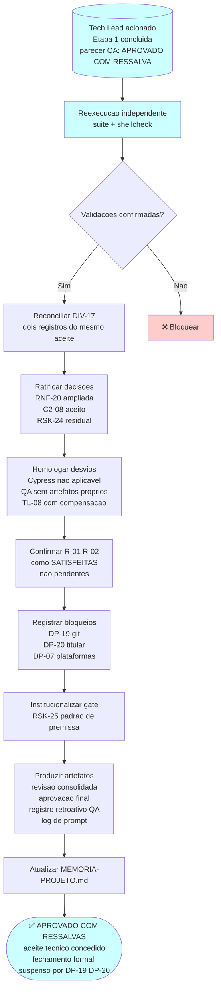

# Log de Prompt — fechamento-etapa-1-camada-dominio

## Prompt Original

> A camada de dominio completou sua validacao: parecer final **APROVADO COM RESSALVA**. Vo­ce, como Tech Lead, e o ultimo gate antes do fechamento da Etapa 1. Acionados: reconciliar a divergencia de registro do aceite da faixa de codigos de saida 5 a 15 entre RF-35 e a memoria de projeto; decidir sobre a ampliacao de escopo do confinamento local; homologar `C2-08` (transito de `stdin` por `$TMPDIR`, aceito sem ressalva pelo solicitante, com dispensa de nota operacional); ratificar o TOCTOU como risco residual (`RSK-24`); homologar os desvios de protocolo do gate de QA (Cypress e template de validacao de frontend inaplicaveis; QA sem artefatos `.md` proprios e sem `prompt-logger` por instrucao do proprio Tech Lead); decidir sobre rastreabilidade retroativa; confirmar `R-01` e `R-02` como condicao satisfeita e nao pendente; registrar os bloqueios que impedem o fechamento formal (titular do copyright em espaco reservado, repositorio git inexistente com sete entregas sem versionamento, licenca sem titular, plataformas em aberto com piso real de bash 4.4, precedente de decisao criada por conveniencia tecnica); produzir os artefatos com os templates de revisao consolidada e aprovacao final em `docs/`; e atualizar `MEMORIA-PROJETO.md`. Restricoes: sem `git init`, sem commit, sem instalar nada, sem alterar `lib/` nem `tests/`, e sem editar `MEMORIA-COMPARTILHADA.md` sem aviso previo. Prazo: 2026-08-18.

## Nota de Sanitizacao

Nenhum segredo, credencial, token ou dado pessoal identificado no prompt. Sem necessidade de sanitizacao.

---

## Interpretacao

### Intenção Principal

Fechar a Etapa 1 com aceite tecnico concedido pelo Tech Lead, ratificando as decisoes já tomadas (ampliacao de RNF-20, C2-08, RSK-24), homologando os desvios de protocolo do QA ocorridos por instrucao do proprio Tech Lead, reconciliando a divergencia de registro (`DIV-17`) sobre o aceite da faixa de codigos 5 a 15, confirmando as condicoes de consumo para a Etapa 2 como **satisfeitas** (nao pendentes), registrando explicitamente os bloqueios que sao exclusivos do solicitante (DP-19, DP-20, DP-07), e documentando as decisoes em template padrão de revisao consolidada e aprovacao final.

### Entidades Identificadas

| Entidade | Tipo | Relevância |
|---|---|---|
| `RF-35` | Requisito | Aceite da faixa 0..15 publicado como contrato congelado da versao principal |
| `PRJ-DEC-10` | Decisao de projeto | Aceite do Tech Lead sobre a faixa 5..15, pendente nesta revisao |
| `DIV-17` | Divergencia identificada nesta revisao | Dois registros descrevendo o mesmo aceite como se fossem gates distintos (um ja cumprido, outro pendente) |
| `RNF-20` | Requisito ampliado | Confinamento remoto e local com oito vetores, raiz `/` opt-in, TOCTOU aceito |
| `C2-08` | Correcao aceita | Transito de stdin por $TMPDIR em blocos de 4 MiB, sem nota operacional |
| `RSK-24` | Risco residual | TOCTOU no confinamento local, aceito e documentado, a revisitar quando DP-07 fechar |
| `R-01`, `R-02` | Condicoes de consumo | Byte de controle e aspa escapada contornando redacao, corrigidas e validadas |
| `DP-19` | Decisao pendente do solicitante | Repositorio git nao inicializado; sete entregas sem versionamento |
| `DP-20` | Decisao pendente do solicitante | Titular do copyright em espaco reservado no LICENSE |
| `DP-07` | Decisao pendente do solicitante | Plataformas e shells suportados; piso real apurado como bash 4.4 |
| `RSK-25` | Risco de processo | Precedente de decisao de escopo criada por conveniencia tecnica; gate TL-09 instituido |
| `TL-08` | Decisao do Tech Lead | Homologacao retroativa de desvio de protocolo com compensacao obrigatoria |
| `MEMORIA-PROJETO.md` | Artefato | A atualizar com as decisoes consolidadas |

### Intenções Secundárias

1. **Submeter a homologacao os desvios que o proprio Tech Lead autorizou durante a execucao,** em vez de deixa-los implicitos em uma nota de rodape. A transparencia sobre quem autorizou o que e fundamental para evitar que processos de QA sejam interpretados como deficiencia de qualidade quando sao, na verdade, decisoes deliberadas de trade-off.

2. **Impedir que bloqueios de decisao do solicitante sejam confundidos com deficiencia de qualidade da entrega.** DP-19, DP-20 e DP-07 nao sao defeitos; sao escolhas que cabem exclusivamente ao solicitante tomar. O documento deixa isso cristalino.

3. **Avaliar se o padrao registrado em `RSK-25`** — uma premissa de plataforma sendo registrada como decisao do solicitante sem ter sido pedida — merece gate de processo vinculante nas proximas etapas. O gate `TL-09` institucionaliza a licao.

### Restricoes

- Sem `git init` e sem commit — o estado de versionamento continua bloqueado ate DP-19 fechar.
- Sem instalar nada — ambiente congelado, nenhuma dependencia nova.
- Sem alterar `lib/` nem `tests/` — codigo da Etapa 1 ja fechado e validado.
- Sem editar `MEMORIA-COMPARTILHADA.md` sem aviso previo ao solicitante — arquivo compartilhado com outros projetos; decisao transversal candidata sinalizada, nao aplicada sem confirmacao.
- Producao dos artefatos de fechamento limitada a `docs/registros/` e `docs/prompts/`.

### Ambiguidades e Inferências

| Ambiguidade | Inferência Adotada | Confianca |
|---|---|---|
| `DIV-17` sendo duas coisas sob um rotulo, como registrar sem duplicacao? | RF-35 registra o aceite como concedido; PRJ-DEC-10 registra o gate que faltava. Nao e contradicao de fato — sao dois momentos distintos do mesmo processo. Reconciliacao em tabela de divergencias, ambos os registros mantidos para rastreabilidade | Alta |
| Homologar C2-08 mas sem acrescentar nota operacional — isso nao deixa a implementacao subdocumentada? | A dispensa foi explicita e refletiu uma decisao do solicitante sobre o nivel de detalhe operacional exigido. Respeitar a dispensa e parte do aceite. Area temporaria migra para `lib/tmp` na Etapa 2 com contrato 0700/0600 herdado | Alta |
| RSK-24 TOCTOU — ao aceitar como residual, nao se torna "consentimento tacito" para deixar aberto indefinidamente? | O aceite e **documentado e temporario**: a revisitacao obrigatoria quando DP-07 fechar garante que nao se torna silencioso. A reavaliacao e vinculante nesse momento | Alta |
| RNF-20 ampliado de forma nao requisitada — e realmente aceitavel uma ampliacao de escopo? | Sim, porque: (a) o solicitante aceitou; (b) o BA emen­dou o requisito; (c) o QA converteu os oito vetores em criterio de aceite coberto por teste. A ampliacao ficou documentada como requisito formal, nao como comportamento nao especificado. Precedente positivo se repetido com rigor igual | Alta |

### Contexto do Projeto Aplicado

> Protocolo comum itens 2 (prompt-logger), 8 (Markdown com Mermaid), 22 (sinalizacao de divergencias), 23 (rastreabilidade de decisoes), 28 (bloqueios exclusivos do solicitante) e 29 (idioma). Persona Tech Lead: consolidacao de decisoes tecnicas, homologacao de desvios de protocolo, ratificacao de riscos residuais, producao de artefatos de fechamento conforme template padrão. Skills aplicadas: `decision-consolidation`, `risk-acceptance`, `documentation-sync`, `prompt-logger`.

---

## Plano de Acao

---

## Resultado Esperado

1. **Revisao consolidada** em `/home/sales/dropbox_api/docs/registros/2026-08-18_revisao-consolidada-etapa-1-camada-dominio.md`, aderente ao template padrao.
2. **Aprovacao final** registrada no mesmo arquivo, com decisao explicitada e bloqueios nomeados.
3. **Registro retroativo de validacao QA** em `/home/sales/dropbox_api/docs/registros/2026-08-18_validacao-qa-camada-dominio-registro-retroativo.md`, consolidando os tres pareceres com proveniencia clara.
4. **Este log de prompt**, registrando a intencao e as decisoes secundarias da consolidacao.
5. **Atualizacao de `MEMORIA-PROJETO.md`** com as decisoes `TL-01` a `TL-09` e o status atual de todas as pendencias.

### Conteudo Chave a Registrar

- `RF-35` com a faixa 0..15 e a rejeicao do codigo 16 — contrato publicado permanente.
- `PRJ-DEC-10` passa a **Ativa** — aceite do Tech Lead concedido apos verificacao de condicao imposta pelo QA.
- `DIV-17` **resolvida** — dois gates distintos reconciliados e ambos cumpridos.
- `RNF-20` ampliada para os dois espacos de nomes — decisao do solicitante ratificada.
- `C2-08` homologado sem ressalva — dispensa de nota operacional respeitada.
- `RSK-24` aceito como residual documentado — revisitacao obrigatoria quando DP-07 fechar.
- `TL-08` homologacao retroativa com compensacao — primeiro registro que submete a escrutinio uma decisao do proprio Tech Lead.
- `TL-09` gate instituido — toda premissa de plataforma deve ser pedida como decisao ao solicitante antes de ser implementada.
- `R-01` e `R-02` condicao de consumo **satisfeita** — `lib/http` liberado.
- `DP-19`, `DP-20`, `DP-07` bloqueios exclusivos — listar sem tentar resolver.
- Sete entregas acumuladas sem versionamento — impacto material para cada entrega adicional.

---

## Notas Finais

1. **Sobre o desvio de protocolo (TL-08):** O Tech Lead autorizou a ausencia de artefatos `.md` proprios do QA e de acionamento do `prompt-logger` para reduzir custo de contexto nos ciclos. A homologacao retroativa e devida porque a instrucao foi do proprio Tech Lead. A compensacao (este registro retroativo + gate obrigatorio a partir da Etapa 2) e devida porque o conteudo do QA — tres ciclos, cinco bloqueantes no primeiro, duas regressoes no segundo, troca de metodo determinada pelo solicitante — merecia sobreviver.

2. **Sobre o gate TL-09 instituido:** A Etapa 1 viu um padrao de premissa de plataforma ser antecipada e registrada como decisao do solicitante (`DIV-15`). O mesmo risco reincidiu em `RSK-24`, onde foi barrado a tempo. O gate vincula as proximas etapas a submeter qualquer premissa de ambiente, dependencia ou escopo a decisao formal **antes** de implementar, em vez de registrar como "decidido pelo solicitante" depois do fato.

3. **Sobre o impacto global:** A Etapa 1 entrega a base critica do MVP com qualidade verificada e quatro invariantes arquiteturais que vigoram em todo o projeto. O risco dominante deixou de ser tecnico e passou a ser de governanca: DP-19 (versionamento) e DP-20 (titular).
