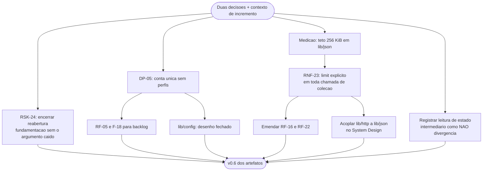

# Log de Prompt — dp05-rsk24-e-teto-de-analise-json

## Prompt Original

> Duas decisoes do solicitante, propagando de imediato — e propositalmente rapido, porque `RSK-26` e exatamente sobre nao fazer isso.
>
> 1. **RSK-24 (TOCTOU) — aceite RECONFIRMADO** pelo solicitante, com a informacao atualizada de que DP-07 esta fechada. Ele considerou que os dois argumentos remanescentes bastam: `readlink` compara texto de caminho e falha sob `rename` (o correto seria dispositivo+inode), e a mitigacao nao cobre percurso recursivo — que e o caso real em lote. Fechar a reabertura registrando que a reavaliacao ocorreu **com** DP-07 resolvida, para que o aceite nao pareca novamente apoiado no argumento que caiu.
> 2. **DP-05 — RESOLVIDA: uma conta so.** Um unico arquivo de credencial, **sem nocao de perfil**. Sem opcao `--profile`, sem arquivo por perfil. Justificativa: acrescentar perfis depois e **aditivo** e nao quebra o contrato publico que RF-35 congela, entao o custo de adiar e baixo e o de antecipar nao se justifica agora. Combinado com DP-11, fecha o desenho de `lib/config`: **um arquivo, um caminho, sem multiplexacao**.
>
> **Contexto do incremento:** o Senior Developer entregou `lib/json` e `lib/output`. (a) Derivou requisito novo da medicao: o teto de entrada de `lib/json` ficou em **256 KiB** (baixado de 4 MiB, porque 4 MiB extrapolava para ~86 s); consequencia: **`lib/http` precisa paginar listagem com `limit` explicito**, senao pasta grande falha por recusa de analise em vez de erro do servico — registrar como requisito ligado a `RF-22`. (b) Ele leu os documentos durante a atualizacao e viu estado intermediario, reportando DP-07 como aberta e citando DIV-15; a v0.5 ja sanou, e nao ha acao — registro so para nao interpretar como divergencia real.
>
> Nao alterar `lib/`, `tests/` nem `docs/registros/`.

Nenhum segredo, credencial ou dado pessoal identificado. Sem necessidade de sanitizacao.

## Interpretação

### Intenção Principal

Propagar duas decisoes do solicitante **na mesma rodada em que foram recebidas**, aplicando na pratica a mitigacao de `RSK-26`, e formalizar um requisito derivado de medicao real que cria acoplamento de projeto entre `lib/json` e `lib/http`.

### Entidades Identificadas

| Entidade | Tipo | Relevância |
|---|---|---|
| `RSK-24` | Risco | Reabertura encerrada com aceite reconfirmado |
| `DP-05` | Decisao | Conta unica sem perfis; fecha `lib/config` |
| `RF-05`, `F-18` | Requisito e funcionalidade | Movidos para backlog como incremento aditivo |
| `RNF-23` | Requisito novo | Teto de 256 KiB e paginacao com `limit` explicito |
| `RF-16`, `RF-22` | Requisitos | Emendados para exigir `limit`/`max_results` |
| `lib/json`, `lib/http`, `lib/config` | Componentes | Teto de entrada, paginacao obrigatoria e desenho fechado |

### Intenções Secundárias

- Impedir que o aceite de `RSK-24` volte a parecer sustentado pelo argumento de portabilidade que caiu.
- Registrar a justificativa de `DP-05` — e nao so a decisao — para que a reversao futura seja avaliada pelo mesmo criterio.
- Tornar `RNF-23` uma restricao **entre componentes**, e nao um detalhe interno do analisador, para que nao se perca ao implementar `lib/http`.

### Restrições

- Escrita limitada a `docs/requisitos/`, `docs/arquitetura/`, `docs/prompts/` e memoria.
- Propagacao imediata, por disciplina de `RSK-26`.

### Ambiguidades e Inferências

| Ambiguidade | Inferência Adotada | Confiança |
|---|---|---|
| O requisito novo deve ficar preso a `RF-22`? | O prompt o liga a `RF-22`, mas a restricao vale para **toda chamada que retorne colecao**. Criei `RNF-23` como requisito transversal e emendei **`RF-16` (listagem) alem de `RF-22` (busca)** — a listagem e o caso mais provavel de estourar o teto | Alta |
| Onde registrar o acoplamento `lib/json` ↔ `lib/http`? | Nos dois componentes do System Design, e explicitamente como **restricao de projeto**, nao como detalhe do analisador. Se ficasse so em `lib/json`, seria lido como limitacao interna e ignorado ao implementar `lib/http` | Alta |
| A leitura de estado intermediario pelo Senior Developer e divergencia? | **Nao.** E artefato transitorio de edicao concorrente, ja sanado pela v0.5. Registrado na memoria como nao divergencia, para que nao seja reaberto se aparecer no registro tecnico dele | Alta |
| `DP-05` altera `RNF-04`? | Nao materialmente — `RNF-04` ja descrevia arquivo unico. O efeito e em `RF-05` (removido) e no fechamento do desenho de `lib/config` | Alta |

## Plano de Ação

### Passos Planejados

1. **`RSK-24`**: encerrar a reabertura deixando explicito que a reavaliacao ocorreu com `DP-07` resolvida e que o argumento de portabilidade foi retirado da fundamentacao.
2. **`DP-05`**: marcar resolvida com a justificativa do carater aditivo; remover `RF-05`; fechar o desenho de `lib/config` nos dois documentos.
3. **`RNF-23`**: criar com criterio de aceite verificavel, incluindo auditoria estatica contra chamada de colecao sem `limit`.
4. **`RF-16` e `RF-22`**: emendar para exigir `limit` e `max_results` explicitos.
5. **System Design**: registrar o teto em `lib/json`, a obrigacao em `lib/http`, e o acoplamento como decisao de projeto.
6. **Memoria**: registrar as decisoes e a nao divergencia da leitura concorrente.

## Contexto do Projeto Aplicado

> Protocolo comum itens 2 (prompt-logger), 8 (Markdown com Mermaid), 22 (divergencias com impacto e recomendacao) e 29 (idioma). Persona Business Analyst: ownership do System Design e da propagacao de decisao ao artefato. **Esta rodada e a primeira aplicacao deliberada da mitigacao de `RSK-26`**: decisao recebida e propagada na mesma rodada, sem acumulo. Skills aplicadas: `documentation-sync`, `prompt-logger`, `mermaid-generator`.

## Resultado Esperado

- `docs/requisitos/escopo-requisitos-e-criterios-de-aceite.md` v0.6.
- `docs/requisitos/decisoes-pendentes.md` v0.6.
- `docs/requisitos/riscos-restricoes-e-licenciamento.md` com `RSK-24` encerrado.
- `docs/arquitetura/system-design.md` v0.6.
- Atualizacao de `MEMORIA-PROJETO.md`.
- Este log.
