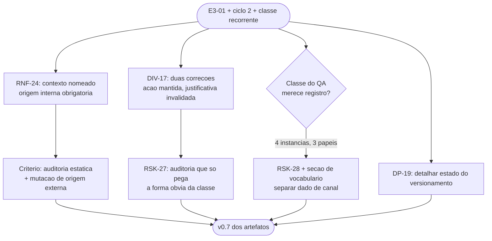

# Log de Prompt — contexto-nomeado-e-classe-instrumento-observacao

## Prompt Original

> Propagando na mesma rodada.
>
> **E3-01 — contexto nomeado (opcao a).** A guarda que fecha o `E2-09` tambem fecha o unico caminho pelo qual `lib/http` poderia analisar um corpo de erro **sem destruir uma listagem em curso** — padrao que vai aparecer na Etapa 3. Descartadas: salvar/restaurar estado (copia proporcional ao documento a cada corpo de erro, e a restauracao depende de o chamador acertar todos os caminhos de saida, inclusive os de falha) e extrator dedicado para corpo de erro (**criaria um segundo caminho de interpretacao de JSON — a fragilidade que o componente existe para eliminar**). Escolhida: contexto nomeado, ~50 linhas, **sem mudanca de assinatura**. Restricao a registrar: **o nome do contexto e escolhido pelo projeto, nunca vem de dado externo**, restrito a minusculas e sublinhado — preserva a injetividade da composicao de chave que fechou `E2-01`. Registrar como **requisito verificavel, nao convencao**.
>
> **Ciclo 2 de QA: aprovado com ressalva.** Tres bloqueantes fecharam por construcao — 6 vetores de colisao, nenhum colide; mutacao que troca a chave injetiva por concatenacao simples reprova 23 casos. `E3-01` a `E3-07` corrigidas. Suite em **223 casos**, `shellcheck -x` exit 0.
>
> Dois fatos que corrigem registros anteriores: (a) **a afirmacao de que o `assert_status` com subshell escondia o `E2-09` nao se sustenta** — o QA mediu por reversao, suite 218/0/2 sob a versao antiga, zero reprovacoes; nenhum caso passava por vacuidade, **a suite tinha sido escrita contornando a limitacao**; a correcao continua certa, a justificativa nao. (b) **A auditoria estatica declarada como garantia contra a classe do `$( )` estava furada** — casava apenas `=[$]\(`, deixando passar `+=" ... $(...)"`, com ocorrencia viva em `lib/errors.sh`; padrao ampliado e ocorrencia corrigida. Vale registrar: garantia que so pega a forma obvia de uma classe da falsa seguranca, e esta e a defesa declarada contra algo que ja ocorreu tres vezes.
>
> O QA nomeou uma classe recorrente que sugiro incorporar ao vocabulario do projeto: **"instrumento de observacao interfere na propriedade observada"** — subshell no assert, conversao de terminador antes de redigir, as sondas do proprio QA, e um caso meu (verificacao por `grep` cega porque o documento tinha byte NUL). E a mesma familia do problema central do projeto: **dado em banda com o canal que o transporta**. Avaliar se merece registro proprio.
>
> **`DP-19` encerrada.** Repositorio criado, commit inicial e push; Gitflow autorizado, `develop` a partir de `master`, trabalho em `feature/camada-dominio-e-adaptadores`, **sete commits semanticos**, arvore limpa, **sem push da feature** aguardando aval. `DP-20` continua aberta, com placeholder no historico publico.

Nenhum segredo, credencial ou dado pessoal identificado. Sem necessidade de sanitizacao.

## Interpretação

### Intenção Principal

Formalizar como requisito verificavel a restricao de origem interna do nome de contexto, corrigir duas justificativas registradas sem alterar as acoes que delas decorreram, e julgar se a classe recorrente nomeada pelo QA merece registro proprio.

### Entidades Identificadas

| Entidade | Tipo | Relevância |
|---|---|---|
| `E3-01` / contexto nomeado | Decisao de desenho | Origem de `RNF-24` |
| `E2-01` | Defeito ja fechado | A injetividade que ele estabeleceu depende do espaco de nomes ser controlado |
| `E2-09` | Defeito ja fechado | Sua guarda motivou a necessidade do contexto nomeado |
| Auditoria estatica do `$( )` | Garantia declarada | Estava furada; origem de `RSK-27` |
| `assert_status` com subshell | Instrumento de teste | Justificativa anterior invalidada |
| Classe "instrumento interfere no observado" | Vocabulario | Julgada digna de registro proprio: `RSK-28` |
| `DP-19`, `DP-20` | Decisoes | Encerrada e aberta, respectivamente |

### Intenções Secundárias

- Impedir que `RNF-24` seja lido como convencao de estilo e relaxado sob pressao.
- Preservar a distincao entre "acao correta" e "justificativa correta" nas duas correcoes.
- Dar poder preditivo ao vocabulario do projeto, e nao apenas catalogar o passado.

### Restrições

- Escrita limitada a `docs/requisitos/`, `docs/arquitetura/`, `docs/prompts/` e memoria.
- Propagacao na mesma rodada, por disciplina de `RSK-26`.

### Ambiguidades e Inferências

| Ambiguidade | Inferência Adotada | Confiança |
|---|---|---|
| A classe do QA merece registro proprio? | **Sim.** Diferentemente de `RSK-25`, que encerrei por falta de evidencia, esta tem **quatro instancias em dois ciclos, de tres papeis diferentes**. Registrada como `RSK-28` com secao propria, e ligada a estrutura recorrente do projeto | Alta |
| Onde tratar a classe: risco ou principio de arquitetura? | **Ambos, com pesos distintos.** O tratamento substantivo foi para o System Design, como secao "separar dado de canal", porque **informa desenho**; o risco existe para que seja rastreada. Registrar so como risco perderia o valor preditivo | Média |
| A correcao (a) enfraquece a confianca na suite? | **Sim, e registrei a distincao.** "O instrumento escondia o defeito" e "a suite foi escrita contornando o terreno onde o instrumento falha" tem implicacoes **opostas** para confianca em cobertura: a segunda sugere que existe terreno historicamente nao exercitado | Alta |
| `RNF-24` deve restringir so o formato do nome? | Nao. O formato `[a-z_]+` e consequencia; **a restricao substantiva e a origem** — nome nunca deriva de dado externo. Criterio inclui auditoria estatica sobre composicao e mutacao que permita origem externa | Alta |

## Plano de Ação

### Passos Planejados

1. **`RNF-24`**: criar com criterio de aceite verificavel — preservacao de analise em curso, formato do nome, auditoria estatica sobre a **composicao** do nome, e mutacao que permita origem externa.
2. **`DIV-17`**: registrar as duas correcoes, deixando explicito que a acao permanece e apenas a justificativa cai.
3. **`RSK-27`**: risco de auditoria estatica que cobre so a forma obvia, com mitigacao permanente — toda auditoria declarada como garantia precisa de par com teste de mutacao da forma nao obvia.
4. **`RSK-28` e secao de vocabulario**: registrar a classe com as quatro instancias, liga-la a estrutura "dado em banda com o canal" e derivar criterio de projeto.
5. **System Design**: contexto nomeado em `lib/json`; secao "separar dado de canal" na visao geral.
6. **Memoria e `DP-19`**: detalhar branch, sete commits semanticos e ausencia de push.

## Contexto do Projeto Aplicado

> Protocolo comum itens 2 (prompt-logger), 8 (Markdown com Mermaid), 22 (divergencias com impacto e recomendacao) e 29 (idioma). Persona Business Analyst: ownership do System Design e conversao de decisao tecnica em requisito verificavel. Skills aplicadas: `clean-architecture` (o contexto nomeado preserva a fronteira do componente sem alterar assinatura publica — a alternativa do extrator dedicado criaria segundo caminho de interpretacao, violando a razao de existir do componente), `documentation-sync`, `prompt-logger`, `mermaid-generator`.
>
> Segunda rodada consecutiva de propagacao imediata, aplicando a mitigacao de `RSK-26`.

## Resultado Esperado

- `docs/requisitos/escopo-requisitos-e-criterios-de-aceite.md` v0.7 com `RNF-24` e `DIV-17`.
- `docs/requisitos/riscos-restricoes-e-licenciamento.md` com `RSK-27`, `RSK-28` e secao 7.
- `docs/arquitetura/system-design.md` v0.7.
- Atualizacao de `MEMORIA-PROJETO.md`.
- Este log.
