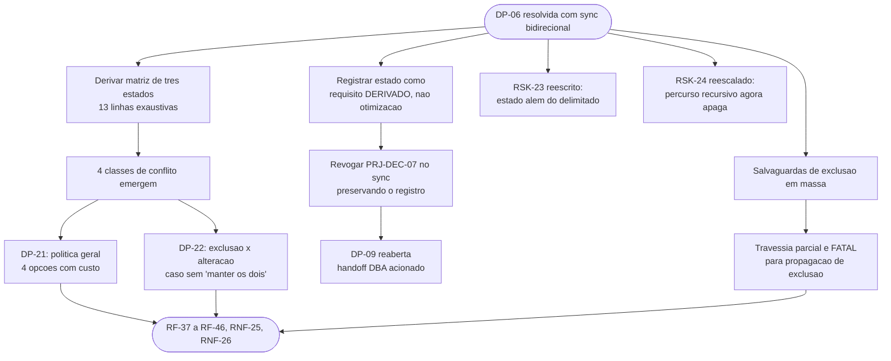

# Log de Prompt — dp06-sync-bidirecional-e-reabertura-de-estado

## Prompt Original

> O solicitante respondeu `DP-06` e as consequencias sao grandes. Propagando de imediato, conforme `RSK-26`.
>
> **`DP-06` RESOLVIDA.** Comandos: **`upload`, `download`, `list`, `delete`, `info` e `sync`**. Os cinco primeiros sao diretos. O `sync` reabre o que estava fechado, e o solicitante escolheu, com as consequencias apresentadas: **bidirecional**; **remocao de orfaos com opcao explicita** (e o `F-06`, do Bloco 2); **cursor persistente**.
>
> **O que isso reabre — registrar com precisao:** `PRJ-DEC-07` cai para o `sync` — registrado em cinco lugares e vigiado por `RSK-23`; **nao apagar, registrar a mudanca de escopo com a decisao que a autoriza**. `DP-09` **REABERTA**. **Handoff do DBA ACIONADO** — o gatilho era exatamente este. `RSK-24` (TOCTOU) — o aceite se apoiava em a mitigacao nao cobrir percurso recursivo, aceitavel porque **nao havia** percurso recursivo no escopo; **agora ha**. `RSK-23` — reescrever: o estado passa a ser **autorizado e delimitado**, e o risco vira "estado alem do delimitado".
>
> **Coerencia a registrar:** as tres escolhas nao sao independentes. **Sync bidirecional com propagacao de exclusao exige estado persistente por construcao** — sem ele e impossivel distinguir "o usuario apagou este arquivo" de "este arquivo nunca foi baixado". O cursor nao e otimizacao, e **condicao de correcao**. Registrar assim, porque muda a natureza da decisao: nao e trade-off de desempenho, e requisito derivado.
>
> **O que preciso:** a **semantica de conflito** e a questao central e ainda nao foi decidida — ultimo a escrever vence, manter os dois com renomeacao, recusar e reportar, preferencia por lado. **E onde implementacoes de sync perdem dados**, e nao quero que o solicitante decida sem ver o custo de cada opcao. Levantar tambem: o **ciclo de vida do cursor** (onde vive, corrompido, obsoleto, arvore local alterada fora do sync; o erro `reset` da Dropbox ja existe na taxonomia com politica `reiniciar`); a **protecao contra exclusao em massa** (defeito no percurso local com espelhamento ligado vira exclusao em massa no remoto — teto, confirmacao, simulacao obrigatoria?); e `RF-31`/`RF-32` e demais requisitos afetados. Produzir os requisitos de `sync` com criterio de aceite verificavel, **incluindo os casos onde ele pode destruir dado**.
>
> Nao alterar `lib/`, `tests/`, `scripts/` nem `docs/registros/`.

Nenhum segredo, credencial ou dado pessoal identificado. Sem necessidade de sanitizacao.

## Interpretação

### Intenção Principal

Especificar o comando `sync` com criterio de aceite verificavel, com enfase deliberada nos caminhos em que ele pode **destruir dado**, e apresentar ao solicitante as decisoes remanescentes com o custo real de cada opcao — em vez de deixa-lo escolher no escuro a semantica em que implementacoes de sincronizacao tipicamente falham.

### Entidades Identificadas

| Entidade | Tipo | Relevância |
|---|---|---|
| `sync` bidirecional | Comando | Origem de toda a mudanca de escopo |
| `PRJ-DEC-07` | Invariante arquitetural | Revogado no escopo do `sync`, preservado nos demais |
| `DP-09` | Decisao | Reaberta |
| Handoff do DBA | Gate de protocolo | Acionado pelo gatilho previamente registrado |
| `RSK-23`, `RSK-24` | Riscos | Reescrito e reescalado |
| `lib/state`, `lib/sync` | Componentes novos | Estado persistente e orquestracao da matriz |
| Linha de base x cursor de enumeracao | Artefatos distintos | Conflacao seria defeito grave (`RSK-32`) |

### Intenções Secundárias

- Preservar a rastreabilidade de uma decisao revogada, para que a razao original nao se perca.
- Transformar "semantica de conflito" de pergunta aberta em decisao instruida, com custo por opcao.
- Antecipar o modo de falha catastrofico — travessia parcial virando exclusao em massa — antes que ele exista em codigo.

### Restrições

- Escrita limitada a `docs/requisitos/`, `docs/arquitetura/`, `docs/prompts/` e memoria.
- Nao decidir o que cabe ao solicitante; apresentar custo e recomendar.

### Ambiguidades e Inferências

| Ambiguidade | Inferência Adotada | Confiança |
|---|---|---|
| Como estruturar a especificacao do `sync`? | Por **matriz de tres estados** (base, local, remoto), com 13 linhas exaustivas. E a unica forma de garantir que nenhum caso fique implicito, e ela **deriva** as quatro classes de conflito em vez de as postular | Alta |
| Quantas classes de conflito existem? | **Quatro**, nao duas: criacao/criacao, alteracao/alteracao, exclusao/alteracao e alteracao/exclusao. As duas ultimas sao qualitativamente distintas — **nao ha "os dois lados" para preservar** —, e por isso ganharam decisao propria (`DP-22`) | Alta |
| "Ultimo a escrever vence" e opcao legitima? | **Recomendei descartar mesmo como opcao.** Depende de comparar `mtime` local com `server_modified` da Dropbox, que **nao sao grandezas comparaveis** — relogios distintos, fuso, preservacao de `mtime` em copia, granularidade. Erra o vencedor com frequencia nao desprezivel, e a perda e silenciosa | Alta |
| Qual salvaguarda de exclusao em massa e a mais valiosa? | **Nao e o teto.** E tornar **qualquer erro de travessia fatal para a propagacao de exclusao**. O teto protege o caso catastrofico; a travessia parcial e mais frequente e passa despercebida **por parecer plausivel** | Alta |
| Onde vive a linha de base? | Recomendei `$XDG_STATE_HOME` com recuo para `~/.local/state`. `DP-11` pos a credencial em `~/.config`, corretamente, porque credencial e **configuracao**; a linha de base e **estado**, descartavel e reconstruivel, e a convencao XDG os separa. Levantado como pergunta com fundamento, nao decidido | Média |
| O `reset` da Dropbox invalida a linha de base? | **Nao, e conflacionar os dois seria defeito grave.** O cursor de enumeracao e da Dropbox e ela o invalida; a linha de base e nossa e registra o que ja foi sincronizado. Aplicar `reset` a segunda apagaria a memoria do sync. Virou `RF-43` com teste de reprovacao e `RSK-32` | Alta |
| `sync` e transferencia por fluxo se combinam? | **Nao.** RF-31/RF-32 operam sobre um objeto de tamanho desconhecido sem caminho comparavel; o `sync` opera sobre arvores com base por caminho. Recusa explicita em `RF-45` | Alta |

## Plano de Ação

### Passos Planejados

1. **Matriz de tres estados** como base da especificacao, derivando as quatro classes de conflito.
2. **`RF-37` a `RF-46`, `RNF-25` e `RNF-26`**, com enfase nos caminhos destrutivos.
3. **Registrar a revogacao de `PRJ-DEC-07`** preservando o bloco original e a razao.
4. **Acionar o handoff do DBA** com a natureza do dado e as questoes que o plano precisa responder.
5. **`RSK-29` a `RSK-32`**; reescrever `RSK-23`; reescalar `RSK-24`.
6. **`DP-21` a `DP-26`** com custo por opcao e recomendacao fundamentada.
7. **Componentes `lib/state` e `lib/sync`** no System Design.

## Contexto do Projeto Aplicado

> Protocolo comum itens 2 (prompt-logger), 8 (Markdown com Mermaid), 22 (divergencias com impacto e recomendacao), 24 (**handoff do DBA — acionado nesta rodada**) e 29 (idioma). Persona Business Analyst: ownership do System Design e obrigacao de nao decidir o que cabe ao solicitante. Skills aplicadas: `user-story-writing` (criterios em Given/When/Then para os caminhos destrutivos), `clean-architecture` (`lib/state` como unico autorizado a persistir; `lib/sync` na camada de Orquestracao criada na v0.4), `documentation-sync`, `mermaid-generator`, `prompt-logger`.
>
> Terceira rodada consecutiva de propagacao imediata, conforme `RSK-26`.

## Resultado Esperado

- `docs/requisitos/escopo-requisitos-e-criterios-de-aceite.md` com a secao 5.8 completa.
- `docs/requisitos/decisoes-pendentes.md` v0.8, com cinco decisoes bloqueantes.
- `docs/requisitos/riscos-restricoes-e-licenciamento.md` com `RSK-29` a `RSK-32`.
- `docs/arquitetura/system-design.md` v0.8, com `lib/state`, `lib/sync` e o handoff do DBA acionado.
- Atualizacao de `MEMORIA-PROJETO.md`.
- Este log.
