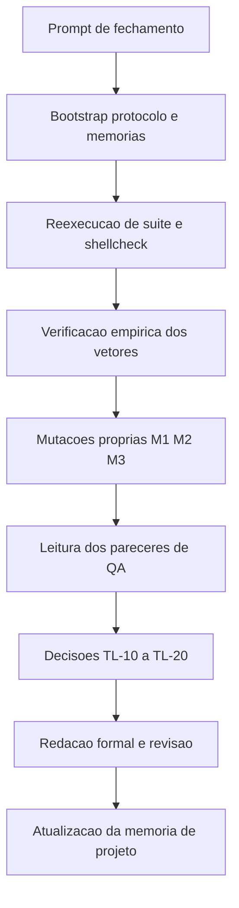

# Log de Prompt — 2026-08-18 — 005

- Papel acionado: Tech Lead
- Workspace: `/home/sales/dropbox_api`
- Origem: solicitante (coordenador da entrega)
- Sanitizacao: nenhum segredo, credencial, token ou dado pessoal presente no prompt. Nao foi necessario mascarar nada.

## Prompt recebido (resumo fiel)

Consolidar e fechar o primeiro incremento da Etapa 2 (`lib/json` e `lib/output`) e resolver um aceite pendente do fechamento da Etapa 1.

O solicitante forneceu: a historia do incremento em tres ciclos de QA; o estado verificado por ele de forma independente (suite 237/0/2, `shellcheck` exit 0, injecao fechada, contexto nomeado funcional, `E4-01` fechado, documentos limpos); sete pontos exigindo decisao do Tech Lead; uma sugestao de ponto de processo; o estado do versionamento; e restricoes de execucao.

## Intencao principal

Obter **decisao formal de aceite** sobre o incremento e sobre os itens pendentes, com rastreabilidade documental completa nos templates do pacote.

## Intencoes secundarias

1. Confirmar que a condicao imposta em `TL-01` (coerencia classe x politica) foi satisfeita, fechando o aceite dos codigos de saida 5 a 15.
2. Julgar `RNF-24` e `RNF-23` como requisitos, incluindo a verificabilidade dos seus criterios de aceite.
3. Aceitar ou recusar os tres riscos novos (`RSK-26`, `RSK-27`, `RSK-28`).
4. Homologar o encerramento de `RSK-25` e a retirada de `DIV-15`, com atencao ao fato de que o risco imputava conduta nao ocorrida ao Senior Developer.
5. Decidir se `DIV-17` merece gate.
6. Avaliar a instituicao de um checkpoint de propagacao de decisao.
7. Registrar `DP-20` como bloqueio.

## Restricoes declaradas pelo solicitante

- Sem commit e sem push.
- Nao alterar `lib/` nem `tests/`.
- Nao instalar nada.
- Nao editar `MEMORIA-COMPARTILHADA.md` sem aviso previo.
- Portugues do Brasil.

## Plano de acao executado

1. Bootstrap: protocolo comum e as duas memorias.
2. Reexecucao independente da suite e da analise estatica.
3. Verificacao empirica dos vetores de injecao, do contexto nomeado, de `E4-01` e da coerencia classe x politica.
4. Medicao propria do teto de `RNF-23`.
5. Tres mutacoes proprias (M1, M2, M3) em copias descartaveis fora do repositorio.
6. Leitura dos tres pareceres de QA e do registro tecnico do Senior Developer.
7. Delegacao da redacao formal ao `documentation-writer` (item 4 do protocolo), com briefing factual, seguida de revisao e correcao pelo Tech Lead.
8. Atualizacao de `MEMORIA-PROJETO.md`, incluindo correcao estrutural de colisao de identificadores.

## Desvios de protocolo nesta execucao

| Item | Desvio | Justificativa |
|---|---|---|
| 5 (`commit-writer`) | nao acionado | sem commit, por restricao explicita do solicitante |
| 32 (`MEMORIA-COMPARTILHADA.md`) | nao editada, apesar de `TL-17` ser transversal | restricao explicita do solicitante; entrada registrada como pendente de autorizacao |
| 25 (PR com label e review request) | nao executado | versionamento coordenado pelo solicitante |

