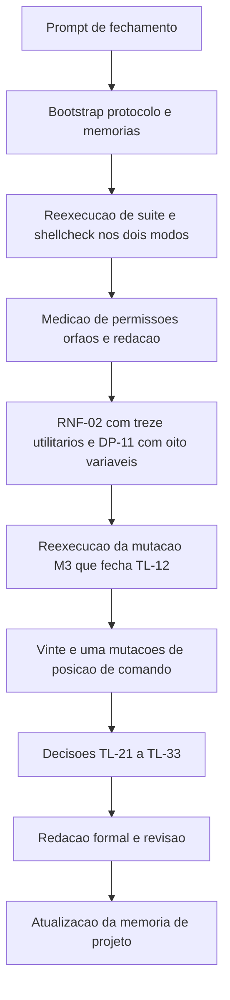

# Log de Prompt — 2026-08-18 — 006

- Papel acionado: Tech Lead
- Workspace: `/home/sales/dropbox_api`
- Origem: solicitante, via coordenador da entrega
- Sanitizacao: nenhum segredo, credencial, token ou dado pessoal no prompt. O unico dado nominal e o titular do copyright, ja publicado no `LICENSE` do repositorio publico. Nada a mascarar.

## Prompt recebido (resumo fiel)

Consolidar e fechar o primeiro incremento da Etapa 3 (`lib/preflight` e `lib/config`).

O solicitante forneceu: a historia dos quatro ciclos de QA; o estado verificado por ele; cinco pontos
exigindo decisao do Tech Lead; um ponto de metodo sugerido para elevacao a gate; os bloqueios que dependem
do solicitante; e o estado do versionamento.

## Intencao principal

Obter **decisao formal de aceite** sobre o incremento, com rastreabilidade documental completa nos templates do pacote.

## Intencoes secundarias

1. Homologar `DP-11` e `DP-05` na pratica, incluindo a interpretacao de que a proibicao de ambiente alcanca o **segredo** e nao a **localizacao**.
2. Confirmar que a redacao da fronteira de confianca **nao promete mais do que entrega**.
3. Homologar `RNF-02` e o formato JSON do arquivo de credencial, com a razao declarada.
4. Julgar a elevacao a gate da tese sobre auditoria de escopo derivado.
5. Formalizar a proposta do QA de registrar `RSK-28` por serie, e nao por episodio.
6. Julgar a maturidade de processo evidenciada por duas autocorrecoes nao provocadas.

## Restricoes declaradas

- Sem commit e sem push.
- Nao alterar `lib/` nem `tests/`.
- Nao editar `MEMORIA-COMPARTILHADA.md` — negativa anterior do solicitante segue valendo.
- Portugues do Brasil.

## Plano de acao executado

1. Bootstrap: protocolo comum e as duas memorias.
2. Reexecucao independente da suite e da analise estatica **nos dois modos** de invocacao.
3. Medicao propria de permissoes, redacao do segredo, orfaos e ida e volta com bytes hostis.
4. Verificacao de `RNF-02` com treze utilitarios removidos um a um, e de `DP-11` com oito variaveis de ambiente.
5. Sonda adversarial propria: `XDG_CONFIG_HOME` contendo quebra de linha.
6. Reexecucao da mutacao **M3**, que definiu o gate `TL-12` no fechamento anterior.
7. **Vinte e uma mutacoes** de posicao de comando e **duas** da auditoria de gemeos, em copias descartaveis fora do repositorio.
8. Leitura dos quatro pareceres de QA e do registro tecnico do Senior Developer.
9. Delegacao da redacao formal ao `documentation-writer` (item 4), com briefing factual, seguida de revisao e correcao pelo Tech Lead.
10. Atualizacao de `MEMORIA-PROJETO.md`, incluindo a segunda correcao de colisao de identificadores.

## Achados proprios do Tech Lead nesta execucao

| Achado | Severidade |
|---|---|
| Quatro formas sintaticas escapam a auditoria de posicao de comando, formando uma classe (`TL-27`) | **Bloqueante para o proximo incremento** |
| Bootstrap por `dirname` executado antes de qualquer verificacao, nos seis `lib/*.sh` (`TL-30`) | BAIXA |
| Reincidencia da colisao de identificadores na memoria de projeto (`TL-31`) | Processo |

## Desvios de protocolo nesta execucao

| Item | Desvio | Justificativa |
|---|---|---|
| 5 (`commit-writer`) | nao acionado | sem commit, por restricao explicita |
| 25 (PR) | nao executado | sem push; o solicitante publica apos o fechamento |
| 32 (`MEMORIA-COMPARTILHADA.md`) | nao editada | negativa do solicitante, registrada como desvio homologado em `PRJ-DEC-41` |

