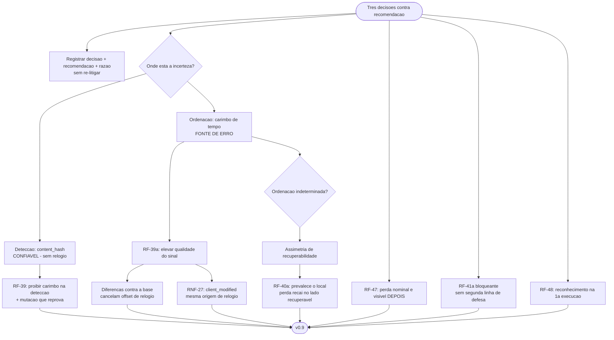

# Log de Prompt — politica-de-conflito-decidida-e-mitigacoes

## Prompt Original

> O solicitante decidiu, e escolheu em `DP-21`, `DP-22` e `DP-24` exatamente as opcoes que voce recomendou evitar. A decisao e dele e esta tomada — **registre sem re-litigar**, e projete a melhor implementacao possivel dentro dela.
>
> **Decisoes:** `DP-21` **ultimo a escrever vence** (B, C e D nao entram como padrao) · `DP-22` **honrar a exclusao** · `DP-24` **sem teto** de exclusoes · `DP-26` **reavaliacao pelo QA** antes de decidir sobre o aceite de `RSK-24`, ja acionada.
>
> **Nao registrar como se a analise anterior estivesse errada.** Ela nao estava: a incomparabilidade entre `mtime` local e `server_modified` e fato, nao preferencia. Registrar a decisao, a recomendacao contraria, e a razao da recomendacao — para que uma revisao futura saiba que o custo foi apresentado e aceito, e nao ignorado.
>
> **Distincao que salva boa parte do problema, a explorar:** a deteccao de que **houve conflito** e confiavel — compara-se cada lado com a linha de base por `content_hash`, sem relogio nenhum. O que e inconfiavel e apenas decidir **qual dos dois e mais recente**. Projetar de modo que: (1) a **deteccao** use exclusivamente `content_hash`; (2) o carimbo de tempo entre **so na ordenacao**, com o requisito declarando que essa etapa e a fonte de erro possivel, com a razao; (3) **avaliar se ha ordenacao melhor disponivel** — o `rev` da Dropbox e monotonico por arquivo, por exemplo; se houver sinal mais confiavel, ele muda a qualidade da decisao sem mudar a decisao.
>
> **A perda deixa de ser evitavel, mas nao precisa ser invisivel.** O solicitante recusou as opcoes cujo custo era visivel *antes* da acao. O relatorio (`F-05`, ja no MVP) pode tornar o custo visivel **depois**: cada sobrescrita por conflito e cada exclusao propagada listadas nominalmente, com o lado que perdeu. Especificar como requisito.
>
> **`RF-41(a)` fica mais importante, nao menos.** Sem teto, a unica protecao passa a ser: qualquer erro de travessia local desabilita integralmente a propagacao de exclusao naquela execucao. Reforcar o criterio e tratar como bloqueante.
>
> **Avaliar tambem se `dry-run` deve ser obrigatorio** na primeira execucao com espelhamento sobre par de raizes ainda sem linha de base. Nao e teto e nao contraria `DP-24`.
>
> **`DP-23`** — adoto sua recomendacao: base sob `$XDG_STATE_HOME`, corrompida **recusa**. **`DP-25`** — levo ao solicitante junto com o resultado desta rodada.

Nenhum segredo, credencial ou dado pessoal identificado. Sem necessidade de sanitizacao.

## Interpretação

### Intenção Principal

Registrar tres decisoes tomadas contra recomendacao — preservando a recomendacao e sua razao, sem re-litigar — e projetar o `sync` de modo a minimizar o custo **dentro** da decisao, explorando a distincao entre deteccao confiavel e ordenacao inconfiavel.

### Entidades Identificadas

| Entidade | Tipo | Relevância |
|---|---|---|
| `DP-21`, `DP-22`, `DP-24` | Decisoes | Tomadas contra recomendacao, com custo aceito |
| `DP-23` | Decisao | Recomendacao acatada |
| `content_hash` x carimbo de tempo | Sinais | Fronteira entre deteccao e ordenacao |
| `client_modified`, `server_modified`, `rev` | Sinais da API | Avaliados como chave de ordenacao |
| `RF-41(a)` | Salvaguarda | Unica protecao restante contra exclusao em massa |
| `F-07` | Backlog | Unico caminho de recuperacao para perdas no lado remoto |

### Intenções Secundárias

- Garantir que uma revisao futura distinga "custo ignorado" de "custo aceito".
- Reduzir a superficie de erro sem tocar na politica escolhida.
- Tornar a perda auditavel depois, ja que nao pode ser evitada antes.

### Restrições

- **Nao re-litigar.** Registrar decisao, recomendacao e razao; nao argumentar contra.
- Escrita limitada a `docs/requisitos/`, `docs/arquitetura/`, `docs/prompts/` e memoria.

### Ambiguidades e Inferências

| Ambiguidade | Inferência Adotada | Confiança |
|---|---|---|
| O `rev` da Dropbox serve como chave de ordenacao? | **Nao, e registrei isso com franqueza.** E monotonico **por arquivo no lado remoto**, e nao ha equivalente local — ordena versoes remotas entre si, nao remoto contra local. **Porem resolve outro problema real:** concorrencia otimista na escrita, fechando a janela entre ler o estado e escrever sobre ele. Virou `RF-49` | Alta |
| Ha sinal melhor que carimbo de tempo? | **Ha melhoria de qualidade, nao substituicao.** Duas: usar **`client_modified`** — definido por esta aplicacao a partir do `mtime` local em todo envio — em vez de `server_modified`, o que faz os dois lados carregarem carimbos da **mesma origem de relogio** para arquivos que enviamos; e comparar **diferencas contra a linha de base**, cada uma medida dentro do proprio relogio, o que **cancela o offset** entre relogios e deixa apenas a deriva no intervalo | Alta |
| O que fazer quando a ordenacao e indeterminada? | Descobri uma **assimetria de recuperabilidade** que resolve isso de forma nao arbitraria: sobrescrever o **remoto** e recuperavel pelo historico de revisoes da Dropbox; sobrescrever o **local** e permanente. Logo, no desempate, **prevalece o local** — a perda recai sobre o lado recuperavel. Virou `RF-40a` | Alta |
| `dry-run` obrigatorio na primeira execucao se justifica? | **Sim, mas por razao diferente da esperada.** Sem linha de base **nenhuma exclusao e possivel** — a matriz so preve exclusao com `B` presente. O perigo real e outro: todo caminho presente nos dois lados cai em **criacao/criacao**, resolvido por ultimo a escrever vence, e uma raiz apontada por engano pode **sobrescrever permanentemente arquivos locais**. Virou `RF-48` com essa justificativa precisa | Alta |
| O `dry-run` obrigatorio contraria `DP-24`? | **Nao.** `DP-24` dispensou **teto de exclusoes**; `RF-48` e passo de reconhecimento antes da primeira acao sobre arvore sem memoria, e nao limita quantidade de nada | Alta |

## Plano de Ação

### Passos Planejados

1. **Registrar as decisoes** em tabela com escolha, recomendacao contraria e razao, com nota de metodo explicitando que o custo foi apresentado e aceito.
2. **`RF-39`**: deteccao exclusivamente por `content_hash`, com mutacao que reprova se carimbo vazar.
3. **`RF-39a`**: ordenacao em tres metodos, com a declaracao explicita de ser a fonte de erro possivel.
4. **`RNF-27`**: `client_modified` sempre definido no envio; `server_modified` proibido como chave.
5. **`RF-40a`**: desempate preferindo o lado recuperavel.
6. **`RF-47`**: registro nominal de toda perda, com marcacao recuperavel ou permanente.
7. **`RF-48`** e **`RF-49`**: reconhecimento na primeira execucao e concorrencia otimista por `rev`.
8. **`RF-41(a)`** reforcada e elevada a bloqueante; `RSK-29`, `RSK-30` e `RSK-33` atualizados.

## Contexto do Projeto Aplicado

> Protocolo comum itens 2 (prompt-logger), 8 (Markdown com Mermaid), 22 (divergencias com impacto e recomendacao) e 29 (idioma). Persona Business Analyst: registrar impacto e recomendacao **sem decidir**, e — quando a decisao contraria a recomendacao — **projetar a melhor execucao possivel dentro dela**, que e o que esta rodada exigiu. Skills aplicadas: `user-story-writing` (criterios em Given/When/Then focados nos caminhos destrutivos), `clean-architecture` (a separacao deteccao/ordenacao e uma fronteira interna de `lib/sync`, verificavel por mutacao), `documentation-sync`, `mermaid-generator`, `prompt-logger`.
>
> Quarta rodada consecutiva de propagacao imediata, conforme `RSK-26`.

## Resultado Esperado

- `docs/requisitos/escopo-requisitos-e-criterios-de-aceite.md` com a secao 5.8.3 de politica de conflito e `RF-39`, `RF-39a`, `RF-40a`, `RF-47` a `RF-49`, `RNF-27`.
- `docs/requisitos/decisoes-pendentes.md` com as cinco decisoes resolvidas e o registro de metodo.
- `docs/requisitos/riscos-restricoes-e-licenciamento.md` com `RSK-30` aceito, `RSK-29` elevado e `RSK-33` criado.
- `docs/arquitetura/system-design.md` v0.9.
- Atualizacao de `MEMORIA-PROJETO.md`.
- Este log.
