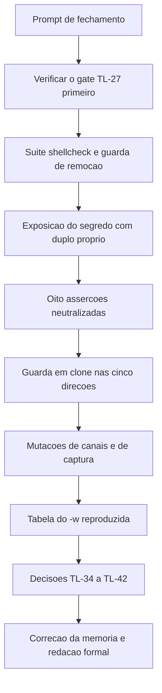

# Log de Prompt — 2026-08-18 — 007

- Papel acionado: Tech Lead
- Workspace: `/home/sales/dropbox_api`
- Origem: solicitante, via coordenador
- Sanitizacao: nenhum segredo, credencial ou token real no prompt. Os valores usados nas minhas sondas sao sinteticos e descartaveis. Nada a mascarar.

## Prompt recebido (resumo fiel)

Consolidar e fechar o segundo incremento da Etapa 3 (`lib/http` e `lib/auth`), sete commits em `feature/http`.

Fornecidos: a historia em cinco passos; o estado verificado pelo coordenador; quatro pontos exigindo
decisao; uma regra de projeto sugerida para elevacao a gate; o achado que a sustenta; duas autocorrecoes
nao provocadas para o registro de calibracao; e os bloqueios pendentes.

## Intencao principal

Decisao formal de aceite do incremento, com rastreabilidade documental completa.

## Intencoes secundarias

1. Homologar os dois fatos de contrato — a nao rotacao do refresh token e a **retratacao** sobre o cursor.
2. Homologar a ferramenta de desenvolvimento fora da suite, com sua limitacao declarada.
3. Julgar a elevacao a gate da regra sobre o conjunto de lugares onde uma disciplina incide.
4. Registrar a serie de `RSK-28` e o material de calibracao.

## Restricoes declaradas

- Sem commit e sem push.
- Nao alterar `lib/` nem `tests/`.
- Nao editar `MEMORIA-COMPARTILHADA.md` — negativa do solicitante segue valendo.
- Portugues do Brasil.
- Instrucao especifica: os dois registros tecnicos foram escritos pelo proprio dev, nao delegados, e devem ser verificados com o mesmo rigor.

## Plano de acao executado

1. **Primeiro passo: verificar se o gate `TL-27`, que institui como bloqueante antes de `lib/http`, foi cumprido.** Estava — e acima da especificacao.
2. Reexecucao da suite, da analise estatica nos dois modos e da guarda de remocao.
3. Medicao propria da exposicao do segredo em `argv` e na entrada padrao, com duplo de `curl` proprio.
4. Sondagem dos canais publicos apos renovar, inclusive no cenario em que o servico ecoa a requisicao.
5. Neutralizacao das oito assercoes do arcabouco, uma a uma.
6. Guarda de remocao exercitada em clone descartavel, nas cinco direcoes mais a limitacao.
7. Mutacoes: quatro de `TL-27` mais `coproc`, tres da auditoria de canais, oito do reconhecedor de captura.
8. Reproducao independente da tabela do `-w` em `curl 8.18.0`.
9. Verificacao dos dois registros escritos pelo dev.
10. Correcao da terceira colisao de identificadores da memoria e atualizacao de `MEMORIA-PROJETO.md`.

## Achados proprios do Tech Lead nesta execucao

| Achado | Natureza |
|---|---|
| `TL-27` respondido por derivacao, cobrindo `coproc`, que ninguem enumerou | Licao de metodo |
| Meu proprio instrumento converteu ausencia de dado em zero reprovacoes | **Falha aberta em verificador — instancia de `RSK-28`, minha** |
| Terceira reincidencia da colisao de identificadores | Gate bloqueante `TL-41` |
| Quarta delegacao consecutiva com fabricacao, desta vez cinco itens | Sustenta `TL-42` |

## Desvios de protocolo nesta execucao

| Item | Desvio | Justificativa |
|---|---|---|
| 4 | registros tecnicos escritos pelo autor | homologado em `TL-42`, com evidencia |
| 5 | `commit-writer` nao acionado | sem commit |
| 25 | PR nao aberto | sem push |
| 32 | `MEMORIA-COMPARTILHADA.md` nao editada | negativa do solicitante (`PRJ-DEC-41`) |

