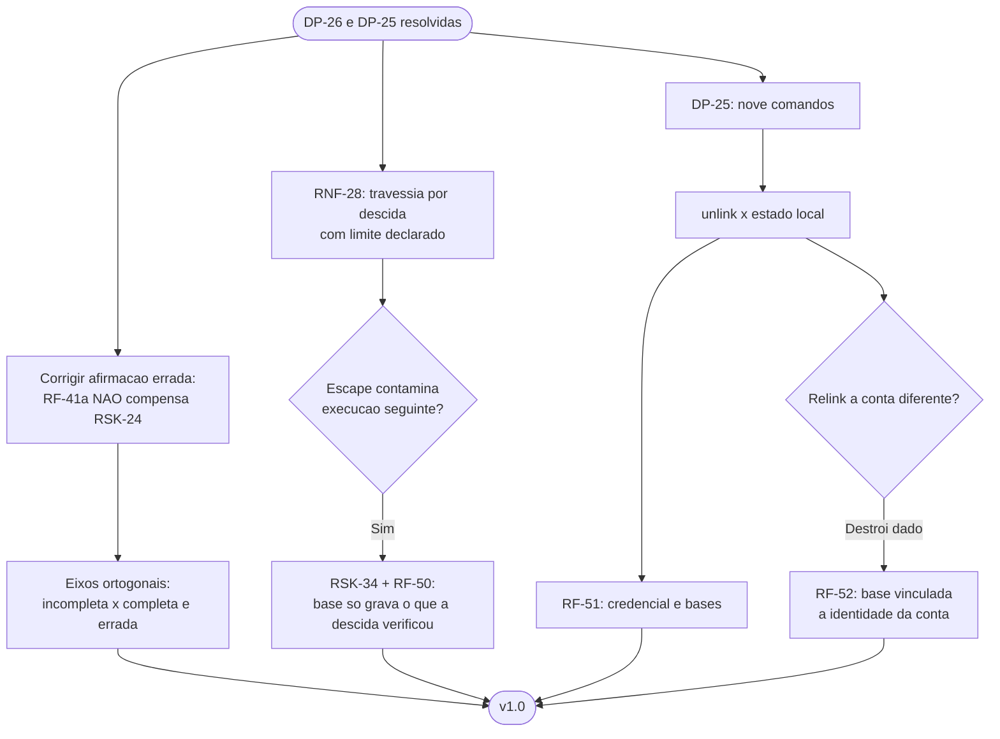

# Log de Prompt — travessia-por-descida-e-nove-comandos

## Prompt Original

> Duas decisoes do solicitante, propagando na mesma rodada.
>
> **`DP-26` RESOLVIDA: travessia por descida adotada.** O solicitante seguiu a recomendacao do QA e **nao manteve o aceite**. O `RSK-24` deixa de ser risco aceito e passa a ter mitigacao estrutural.
>
> - **`RF-41(a)` NAO compensa o `RSK-24`.** Ela dispara em **erro** de travessia; um TOCTOU bem-sucedido **nao gera erro** — a travessia conclui normalmente. Ela protege contra arvore **incompleta**; o `RSK-24` produz arvore **completa e errada**. Eixos ortogonais. **Corrigir o texto** que hoje afirma que a alinea (a) passa a ser mitigacao compensatoria: nao passa, e ela continua valendo integralmente contra `RSK-29`, no eixo de volume.
> - **A mitigacao**: descer um nivel por vez mantendo o diretorio aberto e operar sempre com **nome relativo**. Em bash, `cd` referencia o **inode**, nao o texto. E o equivalente em shell de `openat`/`O_NOFOLLOW` por componente.
> - **Dois experimentos reproduzidos**: com caminho absoluto reconstruido, a troca por symlink em componente intermediario apaga fora da raiz; com descida e nome relativo, na mesma janela de ataque, o alvo sobrevive.
> - **Limite honesto, do proprio QA**: protege os componentes ja percorridos, nao a troca imediatamente antes de descer. E reducao de superficie, nao eliminacao.
> - **`RSK-32` x `RSK-24`** — risco composto ainda nao registrado: uma travessia que escapou grava a **linha de base** com caminhos de fora da raiz; na execucao seguinte eles viram orfaos e sao apagados, **com o atacante ausente**. Regra a fixar: **a base so registra o que a propria descida verificou, nunca por re-resolucao**.
>
> **`DP-25` RESOLVIDA: `config`, `unlink` e `space` entram.** Nove comandos. Note a interacao: `unlink` revoga o refresh token e a Dropbox invalida em cascata os access derivados (`RF-06a`). Verificar se o requisito de `unlink` cobre o estado local — revogar deixa a credencial gravada inutil e a linha de base do `sync` orfa. O que acontece com as duas?
>
> Nao alterar `lib/`, `tests/`, `scripts/` nem `docs/registros/`.

Nenhum segredo, credencial ou dado pessoal identificado. Sem necessidade de sanitizacao.

## Interpretação

### Intenção Principal

Corrigir uma afirmacao conceitualmente errada que eu havia registrado em tres artefatos, incorporar a mitigacao estrutural do TOCTOU, registrar o risco composto que ate agora nao existia no registro, e responder a pergunta sobre o destino dos dois artefatos locais orfaos apos `unlink`.

### Entidades Identificadas

| Entidade | Tipo | Relevância |
|---|---|---|
| `RF-41(a)` x `RSK-24` | Afirmacao errada | Corrigida em riscos, decisoes e memoria |
| Travessia por descida | Mitigacao | `RNF-28` |
| `RSK-34` | Risco composto novo | Escape gravado na base vira exclusao diferida |
| `RF-50` | Requisito novo | Base so grava o que a descida verificou |
| `unlink` x credencial x linha de base | Interacao | `RF-51` |
| Relink a conta diferente | Caminho de destruicao de dado | `RF-52` |

### Intenções Secundárias

- Corrigir sem apagar: registrar que a afirmacao anterior estava errada e por que.
- Preservar o limite declarado da mitigacao, em vez de apresenta-la como solucao completa.
- Verificar, e nao presumir, o destino do estado local no `unlink`.

### Restrições

- Escrita limitada a `docs/requisitos/`, `docs/arquitetura/`, `docs/prompts/` e memoria.

### Ambiguidades e Inferências

| Ambiguidade | Inferência Adotada | Confiança |
|---|---|---|
| Por que `RF-41(a)` nao compensa `RSK-24`? | Registrei o argumento do QA em forma de **eixos ortogonais**: `RF-41(a)` dispara em **erro**; TOCTOU bem-sucedido **nao gera erro**. Uma protege contra arvore **incompleta** (eixo de volume), a outra trata arvore **completa e errada** (eixo de identidade). Nenhuma cobre a outra | Alta |
| `RSK-24` deve ser encerrado com a mitigacao? | **Nao.** O proprio QA declarou o limite: protege componentes ja percorridos, nao a troca imediatamente antes de descer. Mantive o risco **com probabilidade reduzida**, e nao encerrado, e registrei o limite no proprio requisito — apresentar reducao de superficie como eliminacao seria o mesmo erro de `RSK-27` | Alta |
| O que acontece com a credencial no `unlink`? | Optei por **remocao integral por padrao**, incluindo `app key` e `app secret`. Sao segredos, e a semantica de "desvincular esta instalacao" pede falhar fechado. Preservacao para relink so sob sinalizador explicito | Média |
| O que acontece com a linha de base no `unlink`? | **Invalidacao**, com as raizes afetadas informadas. E ao verificar o caso adjacente — relink a **conta diferente** — encontrei um caminho de destruicao de dado nao previsto: base antiga preservada faz caminhos ausentes no novo remoto casarem "apagado no remoto" na matriz e, com espelhamento, **apagarem arquivos locais**. Gerou `RF-52` | Alta |
| `RF-50` e redundante com `RNF-28`? | **Nao.** `RNF-28` protege a execucao corrente; `RF-50` impede que um escape ocorrido contamine a **execucao seguinte**. Sem ela, a mitigacao deixaria o dano para depois, quando o atacante ja nao esta presente e o diagnostico e praticamente impossivel | Alta |

## Plano de Ação

### Passos Planejados

1. **Corrigir** a afirmacao sobre `RF-41(a)` em riscos, decisoes e memoria, com o argumento dos eixos ortogonais.
2. **`RNF-28`**: travessia por descida, com o experimento como criterio e o limite declarado no proprio requisito.
3. **`RSK-34`** e **`RF-50`**: risco composto e regra de gravacao da base.
4. **`RF-51`**: `unlink` tratando credencial e linhas de base.
5. **`RF-52`**: vinculo da base a identidade da conta.
6. **`DP-25` e `DP-26`** marcadas resolvidas; conjunto de nove comandos consolidado.

## Contexto do Projeto Aplicado

> Protocolo comum itens 2 (prompt-logger), 8 (Markdown com Mermaid), 22 (divergencias com impacto e recomendacao) e 29 (idioma). Persona Business Analyst: ownership do System Design e obrigacao de corrigir registro proprio quando demonstrado errado — mesma disciplina aplicada em `DIV-15` e `RSK-25`. Skills aplicadas: `user-story-writing`, `clean-architecture` (a regra de `RF-50` e uma fronteira de confianca: `lib/state` so aceita o que `lib/walk` verificou, nunca texto re-resolvido), `documentation-sync`, `mermaid-generator`, `prompt-logger`.
>
> Quinta rodada consecutiva de propagacao imediata, conforme `RSK-26`.

## Resultado Esperado

- `docs/requisitos/escopo-requisitos-e-criterios-de-aceite.md` com `RNF-28`, `RF-50`, `RF-51`, `RF-52` e o conjunto de nove comandos.
- `docs/requisitos/decisoes-pendentes.md` com `DP-25` e `DP-26` resolvidas e a correcao conceitual.
- `docs/requisitos/riscos-restricoes-e-licenciamento.md` com `RSK-24` mitigado, `RSK-34` criado e a correcao registrada.
- `docs/arquitetura/system-design.md` v1.0.
- Atualizacao de `MEMORIA-PROJETO.md`.
- Este log.
