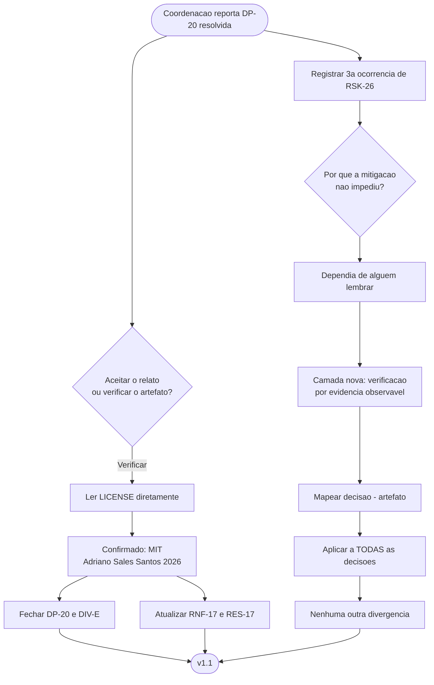

# Log de Prompt — dp20-resolvida-e-mitigacao-reforcada-rsk26

## Prompt Original

> Correcao de registro, e a falha e minha — **`RSK-26`, terceira ocorrencia no projeto e segunda minha**.
>
> **`DP-20` esta RESOLVIDA, e ha varias rodadas.** No repositorio, o `LICENSE` traz `Copyright (c) 2026 Adriano Sales Santos`; em `decisoes-pendentes.md`, `DP-20` consta como "em aberto, agora com placeholder no historico publico". O solicitante informou o titular, o coordenador corrigiu o `LICENSE`, commitou e publicou em `develop` e `master`, e **nunca propagou a resolucao para estes documentos**. O Tech Lead chegou a registrar `DP-20` e `DIV-E` como encerradas no fechamento do incremento 1 da Etapa 3; o documento nunca soube.
>
> Este agente vinha reportando `DP-20` como "a unica pendencia com custo crescente" a cada rodada — corretamente, dado o que o documento dizia. **O documento desatualizado voltou a ser tratado como fonte de verdade**, que e a definicao literal do risco.
>
> Fechar `DP-20`, fechar `DIV-E`, e registrar esta ocorrencia em `RSK-26` com o coordenador como sujeito. O risco existe justamente para nao depender de alguem lembrar, e nao houve lembranca.
>
> Nao alterar `lib/`, `tests/`, `scripts/` nem `docs/registros/`.

Nenhum segredo, credencial ou dado pessoal sensivel identificado. O nome do titular do copyright e informacao publica do repositorio e consta do proprio `LICENSE`; nao ha sanitizacao aplicavel.

## Interpretação

### Intenção Principal

Fechar `DP-20` e `DIV-E`, registrar a terceira ocorrencia de `RSK-26` — e, sobretudo, **converter em mecanismo** uma observacao que este agente ja havia feito em rodada anterior e que nao foi convertida, permitindo a reincidencia.

### Entidades Identificadas

| Entidade | Tipo | Relevância |
|---|---|---|
| `LICENSE` na raiz | Artefato observavel | Continha a resposta o tempo todo |
| `DP-20`, `DIV-E` | Decisao e divergencia | Encerradas |
| `RSK-26` | Risco | Terceira ocorrencia; mitigacao reforcada |
| `RNF-17`, `RES-17` | Requisito e restricao | Satisfeitos quanto a licenca e titular |

### Intenções Secundárias

- Nao tratar a ocorrencia como incidente isolado, e sim como falha da **mitigacao**, que era o que deveria te-la impedido.
- Produzir uma camada de defesa que nao dependa de nenhum papel lembrar de nada.
- Aplicar imediatamente a nova regra a todas as decisoes, para descobrir se ha outras divergencias latentes.

### Restrições

- Escrita limitada a `docs/requisitos/`, `docs/prompts/` e memoria.

### Ambiguidades e Inferências

| Ambiguidade | Inferência Adotada | Confiança |
|---|---|---|
| Aceitar a citacao do `LICENSE` ou verificar? | **Verificar.** Li `/home/sales/dropbox_api/LICENSE` diretamente antes de registrar. Aceitar a citacao seria repetir, na propria correcao, o erro que ela corrige: tratar um relato como fonte de verdade quando o artefato esta acessivel | Alta |
| A ocorrencia e "do coordenador"? | O prompt a atribui a coordenacao, e a propagacao de fato falhou la. **Mas a manutencao do artefato de requisitos e deste agente**, e a informacao estava a uma leitura de distancia, fora de qualquer area restrita. Registrei as tres ocorrencias com sujeito, incluindo a que e minha (ocorrencia 2), sem diluir responsabilidade | Alta |
| Basta registrar a ocorrencia? | **Nao.** A mitigacao original — *propagar na mesma rodada* — **depende de alguem lembrar**, e falhou tres vezes. Registrar a quarta ocorrencia futura sem mudar o mecanismo seria previsivel. Adicionei uma camada **executavel unilateralmente** | Alta |
| A nova camada resolve o risco? | **Nao, e registrei o limite.** Cobre apenas decisoes com artefato observavel; `DP-10` e `DP-12` sao informacao que so existe com o solicitante. **Reducao de superficie, nao eliminacao** — mesma distincao exigida em `RNF-28` e catalogada em `RSK-27` | Alta |

## Plano de Ação

### Passos Planejados

1. **Verificar o `LICENSE`** por leitura direta antes de qualquer registro.
2. **Fechar `DP-20` e `DIV-E`**; atualizar `RNF-17` e `RES-17`; remover a caracterizacao de "unica pendencia com custo crescente".
3. **Registrar as tres ocorrencias** de `RSK-26` com sujeito e custo incorrido, em secao propria.
4. **Reforcar a mitigacao** com uma camada executavel unilateralmente, e declarar seu limite.
5. **Mapear decisao → evidencia observavel** e aplicar a regra a todas as decisoes do projeto.

## Contexto do Projeto Aplicado

> Protocolo comum itens 2 (prompt-logger), 8 (Markdown com Mermaid), 22 (divergencias com impacto e recomendacao) e 29 (idioma). Persona Business Analyst: manutencao dos artefatos de requisitos e correcao de registro proprio quando demonstrado errado — mesma disciplina de `DIV-15`, `RSK-25` e da correcao de `RF-41(a)`.
>
> **Nota de metodo:** a verificacao do `LICENSE` antes do registro nao foi formalidade. Aceitar a citacao teria repetido, dentro da propria correcao, o erro que ela corrige.

## Resultado Esperado

- `docs/requisitos/decisoes-pendentes.md` com `DP-20` resolvida e a secao de verificacao por evidencia observavel.
- `docs/requisitos/riscos-restricoes-e-licenciamento.md` com a secao 8 — tres ocorrencias e mitigacao reforcada.
- `docs/requisitos/escopo-requisitos-e-criterios-de-aceite.md` com `RES-17` resolvido.
- Atualizacao de `MEMORIA-PROJETO.md`.
- Este log.
