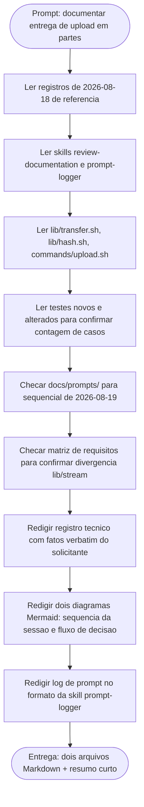

# Log de Prompt — envio-em-partes-e-entrada-padrao

## Prompt Original

> Projeto `/home/sales/dropbox_api` (CLI Dropbox em shell, portugues do Brasil SEM acentos em codigo/comentarios; documentos em portugues do Brasil, acentos permitidos em Markdown seguindo o padrao dos registros existentes). Voce esta produzindo documentacao formal para uma entrega do Senior Developer. NAO altere codigo, NAO altere `.claude/agents-protocol/memoria/MEMORIA-COMPARTILHADA.md`, NAO faca commit.
>
> Leia antes de escrever, para casar tom, estrutura e nivel de detalhe: os registros tecnicos de `2026-08-18` mais recentes, a skill `review-documentation`, a skill `prompt-logger`, e os arquivos entregues (`lib/transfer.sh`, `lib/hash.sh`, `commands/upload.sh`, `tests/unit/transfer_test.sh`, `tests/unit/hash_test.sh`, `tests/unit/harness_test.sh`, `tests/integracao/comandos_test.sh`).
>
> Produza DOIS arquivos novos: (1) um registro tecnico de entrega em `docs/registros/2026-08-19_entrega-envio-em-partes-e-entrada-padrao.md`, cobrindo escopo, branch, arquivos, dez decisoes de desenho fixadas pelo Tech Lead (parte fixa de 4 MiB, sequencia start/append_v2/finish, teto de ocupacao de um bloco, leitura sem cano, `content_hash` com implementacao unica, integridade ponta a ponta, RF-09 com retentativa e reconciliacao de deslocamento, nada parcial publicado, roteamento por tamanho RF-08, gate de simulacao RF-15), procedencia do contrato (`dropbox-api-spec`, `files.stone`, respondendo pendencia da linha 113 do registro de 2026-08-18), quatro portoes com numeros exatos, cobertura de teste nova, quatro defeitos encontrados (D1 a D4, sem suavizar), limites declarados (produtor de cano morto no meio, teto de ocupacao, amostragem de medicao, `content_hash` por parte nao enviado, serializacao de `incorrect_offset` nao verificada, tratadores de sinal nao restaurados), divergencias contra requisitos (lacuna RF-08, matriz apontando `lib/stream` inexistente, pendencia respondida por documentacao), plano de reversao e handoff para QA — com pelo menos dois diagramas Mermaid (sequencia da sessao com reconciliacao de deslocamento; fluxo de decisao do comando). (2) um log de prompt no formato da skill `prompt-logger`, com o sequencial correto para `2026-08-19`.
>
> Escreva os dois arquivos e devolva apenas um resumo curto do que foi criado.

---

## Interpretacao

### Intencao Principal

Produzir o registro tecnico de entrega (documentacao formal, sem tocar codigo nem `MEMORIA-COMPARTILHADA.md`, sem commit) da implementacao da sessao de envio em partes da Dropbox e da habilitacao da entrada padrao (`-`) em `commands/upload.sh`, cobrindo RF-31, RF-08, RF-09 e RF-15, e o log de prompt correspondente, ambos aderentes ao tom e a estrutura dos registros ja existentes no repositorio.

### Entidades Identificadas

| Entidade | Tipo | Relevancia |
|---|---|---|
| `lib/transfer.sh` | arquivo (novo) | orquestra a sessao em partes; objeto central do registro |
| `lib/hash.sh` | arquivo (alterado) | ganhou API incremental de `content_hash`, consumida por `lib/transfer` |
| `commands/upload.sh` | arquivo (alterado) | remove a recusa de `-`, decide o roteamento e mantem o gate de RF-15 |
| `tests/unit/transfer_test.sh` | arquivo (novo) | 20 casos novos, cobertura da sessao |
| `tests/unit/hash_test.sh` | arquivo (alterado) | 5 casos novos, cobertura da API incremental |
| `tests/unit/harness_test.sh` | arquivo (alterado) | 1 caso novo, auditoria de colisao de nomes entre arquivos de teste |
| `tests/integracao/comandos_test.sh` | arquivo (alterado) | 6 casos, incluindo substituicao do caso de recusa de entrada padrao |
| RF-31 | requisito (P0) | teto de ocupacao e nada-parcial-publicado no envio pela entrada padrao |
| RF-08 | requisito (P0) | roteamento por tamanho e lacuna declarada do tamanho de parte configuravel |
| RF-09 | requisito (P0) | retentativa por parte e reconciliacao de deslocamento |
| RF-15 | requisito preservado | gate de simulacao antes da bifurcacao de escrita |
| `docs/registros/2026-08-18_entrega-comandos-diretos-parcial.md` | documento | fonte da pendencia (linha 113) sobre retentativa em `append_v2`, respondida nesta entrega por documentacao |
| `docs/requisitos/escopo-requisitos-e-criterios-de-aceite.md` | documento | matriz de rastreabilidade desatualizada (aponta `lib/stream`, inexistente) |
| `.claude/skills/review-documentation/SKILL.md` | skill | padrao estrutural de registro tecnico |
| `.claude/skills/prompt-logger/SKILL.md` | skill | formato deste proprio log |

### Intencoes Secundarias

- Manter uma unica implementacao do `content_hash`, evitando um segundo laco de resumo em `lib/transfer`.
- Nao tocar `bin/dbx` nem `lib/cli.sh` por haver PR #13 aberto sobre o texto de ajuda.
- Manter os quatro portoes verdes (suite, `shellcheck` com e sem `-x`, guarda de remocao de casos) sem reduzir a contagem de casos executados.
- Declarar limites em vez de arredonda-los — nenhuma garantia deve ser escrita mais forte do que o codigo entrega.

### Restricoes

- Nao alterar codigo-fonte do projeto (apenas documentacao).
- Nao alterar `.claude/agents-protocol/memoria/MEMORIA-COMPARTILHADA.md`.
- Nao criar commit.
- Portugues do Brasil com acentos nos documentos Markdown, seguindo o padrao dos registros existentes (diferente da convencao de codigo/comentarios, que e sem acentos).
- Fatos fornecidos pelo solicitante devem ser usados VERBATIM, sem arredondar nem inventar numeros, testes ou validacoes nao executadas.
- Sem segredos no prompt e, portanto, nenhuma sanitizacao foi necessaria neste log.

### Ambiguidades e Inferencias

| Ambiguidade | Inferencia Adotada | Confianca |
|---|---|---|
| Prompt nao define nome exato do arquivo de registro alem do padrao ja dado explicitamente | Usado o nome literal fornecido: `2026-08-19_entrega-envio-em-partes-e-entrada-padrao.md` | Alta |
| Sequencial do log de prompt para `2026-08-19` nao informado | Verificado `docs/prompts/` com Glob; nao havia arquivo para essa data, logo sequencial `001` | Alta |
| Nivel de detalhe esperado para os "dez decisoes de desenho" | Interpretado como secao por decisao, espelhando a granularidade dos registros de 2026-08-18 (subsecoes com titulo curto e paragrafo justificativo) | Media |
| Se o registro deveria seguir estritamente as secoes da skill `review-documentation` (Contexto/ADR/Riscos) ou o formato livre observado nos dois registros de referencia | Adotado o formato livre dos registros de referencia, por serem o molde explicitamente indicado pelo solicitante, incorporando o conteudo minimo da skill (evidencias, riscos, rollback, diagrama) sob titulos proprios do projeto | Media |

---

## Plano de Acao

### Passos Planejados

1. **Levantamento de contexto**: leitura dos dois registros de 2026-08-18 indicados como molde, das skills `review-documentation` e `prompt-logger`, e dos sete arquivos entregues (2 novos, 5 alterados), para casar tom, estrutura e nivel de detalhe, e para confirmar numeros de casos de teste citados no prompt contra o codigo real.
2. **Verificacao de sequencial**: busca em `docs/prompts/` por arquivos datados de `2026-08-19`; ausencia confirmada, sequencial `001` adotado.
3. **Confirmacao de divergencia de matriz**: busca por `RF-31` e `lib/stream` em `docs/requisitos/escopo-requisitos-e-criterios-de-aceite.md`, confirmando que a matriz aponta um componente inexistente.
4. **Redacao do registro tecnico**: producao de `docs/registros/2026-08-19_entrega-envio-em-partes-e-entrada-padrao.md` com todos os fatos fornecidos verbatim, dois diagramas Mermaid (sequencia com reconciliacao de deslocamento; fluxo de decisao de `commands/upload.sh`), e secoes de defeitos, limites e divergencias sem suavizacao.
5. **Redacao do log de prompt**: producao deste arquivo, seguindo o template da skill `prompt-logger`, com diagrama de raciocinio proprio.

---

## Contexto do Projeto Aplicado

Skill `review-documentation` aciona-se obrigatoriamente por haver desenvolvimento de codigo no escopo geral da entrega (ainda que esta tarefa especifica de documentacao nao altere codigo), e exige conteudo minimo (contexto, escopo, decisoes, evidencias, riscos/rollback, proximos passos, diagrama Mermaid) — incorporado ao registro sob os titulos definidos pelo solicitante e pelo padrao ja em uso no repositorio (`Identificacao`, `Decisoes de desenho`, `Portoes`, `Defeitos`, `Limites declarados`, `Divergencias`, `Plano de reversao`, `Handoff para QA`). Skill `prompt-logger` aciona-se para toda solicitacao recebida, gerando este arquivo antes ou junto da entrega principal. Convencao do projeto: codigo e comentarios sem acentos; documentos Markdown com acentos, seguindo o padrao ja fixado nos registros de `2026-08-17` e `2026-08-18`. Memoria do usuario reforca que decisoes do solicitante devem ir aos requisitos/documentos na mesma rodada em que sao dadas — aplicado aqui ao reproduzir os fatos fornecidos sem arredondamento.

---

## Resultado Esperado

Dois arquivos Markdown criados:

- `docs/registros/2026-08-19_entrega-envio-em-partes-e-entrada-padrao.md` — registro tecnico completo da entrega, com identificacao, arquivos, dez decisoes de desenho, procedencia do contrato, quatro portoes com numeros exatos, cobertura de teste nova, quatro defeitos (D1-D4), seis limites declarados, tres divergencias contra requisitos, plano de reversao, handoff para QA e dois diagramas Mermaid.
- `docs/prompts/2026-08-19_001_envio-em-partes-e-entrada-padrao.md` — este log, com prompt original, interpretacao, plano de acao e diagrama de raciocinio.

Nenhum arquivo de codigo, teste ou `MEMORIA-COMPARTILHADA.md` foi alterado. Nenhum commit foi criado.
