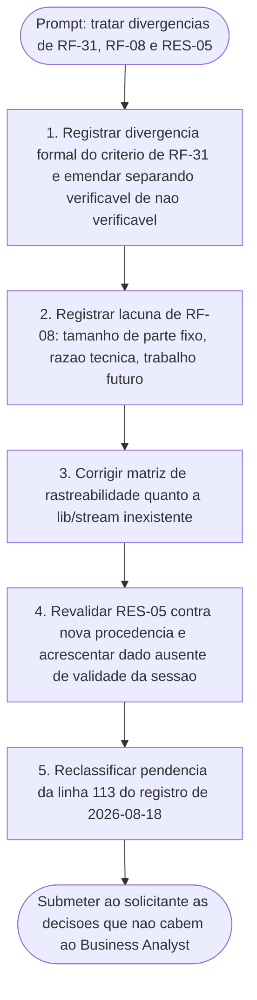

# Log de Prompt — divergencias-rf31-rf08-e-revalidacao-de-contrato

## Prompt Original

> Papel: Business Analyst. Branch `feature/upload-em-partes-e-entrada-padrao`. Sem commit, push ou PR.
>
> Acionamento pelo Tech Lead apos a implementacao de RF-31 / RF-08 / RF-09 (envio em partes e entrada padrao), para tratar nos documentos de requisitos as divergencias encontradas durante a implementacao, incluindo um criterio de aceite de RF-31 que a plataforma nao permite cumprir.
>
> 1. Registrar divergencia formal do criterio de RF-31 (produtor de cano anonimo que morre no meio e indistinguivel de fim de fluxo legitimo) e emendar RF-31 separando o que e verificavel do que nao e, sem apagar historico e sem afrouxar em silencio.
> 2. Registrar a lacuna de RF-08 (tamanho de parte fixado em 4.194.304 bytes, e nao configuravel), com razao tecnica e trabalho futuro, e avaliar se "configuravel" ainda e requisito.
> 3. Corrigir a matriz de rastreabilidade, que aponta o componente `lib/stream`, inexistente.
> 4. Revalidar RES-05 contra nova procedencia e acrescentar o dado ausente da validade da sessao de envio.
> 5. Reclassificar a pendencia da linha 113 de `docs/registros/2026-08-18_entrega-comandos-diretos-parcial.md` de "nao medida" para "respondida por documentacao, ainda nao exercitada contra o servico".
>
> Fonte primaria: repositorio `dropbox/dropbox-api-spec`, arquivo `files.stone`, ramo `main`. Contrato documentado e lido, NAO exercitado contra o servico real.
>
> Restricoes de escopo: escrever apenas em `docs/requisitos/` e, se necessario, na secao correspondente de `docs/arquitetura/system-design.md`; nao editar `lib/`, `commands/`, `bin/`, `tests/`, `docs/registros/` nem `.claude/agents-protocol/memoria/MEMORIA-COMPARTILHADA.md`; ha QA lendo os mesmos documentos em paralelo, entao nao mover secoes de lugar.

---

## Interpretacao

### Intencao Principal

Atualizar os documentos de requisitos e, se necessario, a secao correspondente de `docs/arquitetura/system-design.md` para refletir cinco divergencias e lacunas encontradas durante a implementacao de RF-31, RF-08 e RF-09 (envio em partes e entrada padrao), sem apagar historico, sem afrouxar criterios em silencio e sem mover secoes existentes de lugar, preservando a leitura paralela do QA.

### Entidades Identificadas

| Entidade | Tipo | Relevancia |
|---|---|---|
| RF-31 | requisito | criterio de aceite envolvendo produtor de cano anonimo que morre no meio, indistinguivel de fim de fluxo legitimo; alvo de divergencia formal e emenda |
| RF-08 | requisito | tamanho de parte fixado em 4.194.304 bytes, nao configuravel; alvo de lacuna declarada |
| RF-09 | requisito | citado como parte do escopo implementado que originou o acionamento, sem alteracao especifica descrita no prompt |
| RES-05 | entidade de requisitos | alvo de revalidacao contra nova procedencia; dado ausente de validade da sessao de envio a ser acrescentado |
| `lib/stream` | componente | apontado pela matriz de rastreabilidade como inexistente; correcao pendente |
| docs/requisitos/ | diretorio | escopo permitido de escrita |
| docs/arquitetura/system-design.md | arquivo | escopo permitido de escrita, apenas na secao correspondente, se necessario |
| docs/registros/2026-08-18_entrega-comandos-diretos-parcial.md, linha 113 | registro | pendencia a reclassificar de "nao medida" para "respondida por documentacao, ainda nao exercitada contra o servico" |
| dropbox/dropbox-api-spec, files.stone, ramo main | fonte primaria | contrato documentado e lido, nao exercitado contra o servico real |
| lib/, commands/, bin/, tests/, docs/registros/, .claude/agents-protocol/memoria/MEMORIA-COMPARTILHADA.md | escopo vedado | nao editar |
| QA | agente paralelo | le os mesmos documentos; restricao de nao mover secoes de lugar |

### Intencoes Secundarias

Ordem declarada pelo solicitante:

1. Divergencia formal do criterio de RF-31 e emenda separando o verificavel do nao verificavel, sem apagar historico e sem afrouxar em silencio.
2. Lacuna de RF-08 (tamanho de parte fixo, nao configuravel), com razao tecnica e trabalho futuro, avaliando se "configuravel" ainda e requisito.
3. Correcao da matriz de rastreabilidade quanto ao componente `lib/stream` inexistente.
4. Revalidacao de RES-05 contra nova procedencia, acrescentando o dado ausente de validade da sessao de envio.
5. Reclassificacao da pendencia da linha 113 do registro de 2026-08-18 de "nao medida" para "respondida por documentacao, ainda nao exercitada contra o servico".

### Restricoes

- Escrever apenas em `docs/requisitos/` e, se necessario, na secao correspondente de `docs/arquitetura/system-design.md`.
- Nao editar `lib/`, `commands/`, `bin/`, `tests/`, `docs/registros/`.
- Nao editar `.claude/agents-protocol/memoria/MEMORIA-COMPARTILHADA.md`.
- Nao mover secoes de lugar, por haver QA lendo os mesmos documentos em paralelo.
- Nao apagar historico ao emendar RF-31.
- Nao afrouxar criterio em silencio.
- Sem commit, push ou PR.
- Fonte primaria e contrato documentado (lido), nao exercitado contra o servico real — distincao a preservar na redacao.

### Ambiguidades e Inferencias

| Ambiguidade | Inferencia Adotada | Confianca |
|---|---|---|
| Prompt nao define se havera necessidade de alteracao em `docs/arquitetura/system-design.md` | Tratado como condicional ("se necessario"), a ser decidido durante a execucao, nao neste log | Alta |
| Prompt nao define os nomes finais de identificadores para as divergencias e lacunas a registrar (fora de RES-05, ja existente) | Nenhum identificador novo sera cunhado neste log; decisao de nomenclatura fica para a etapa de execucao | Alta |
| Prompt nao define se "avaliar se configuravel ainda e requisito" e uma decisao que cabe ao Business Analyst ou ao solicitante | Tratado como ponto a submeter ao solicitante, por alterar o teor de um requisito (RF-08) | Media |

---

## Plano de Acao

### Passos Planejados

1. Registrar a divergencia formal do criterio de aceite de RF-31 relativo ao produtor de cano anonimo que morre no meio e e indistinguivel de fim de fluxo legitimo, e emendar RF-31 separando o que e verificavel do que nao e, preservando o texto historico e sem afrouxar o criterio em silencio.
2. Registrar a lacuna de RF-08 quanto ao tamanho de parte fixado em 4.194.304 bytes, nao configuravel, com a razao tecnica e o trabalho futuro correspondente, avaliando se "configuravel" permanece como requisito.
3. Corrigir a matriz de rastreabilidade no que aponta o componente `lib/stream`, hoje inexistente no repositorio.
4. Revalidar RES-05 contra a nova procedencia (`dropbox-api-spec`, `files.stone`, ramo `main`), acrescentando o dado ate entao ausente sobre a validade da sessao de envio.
5. Reclassificar a pendencia da linha 113 de `docs/registros/2026-08-18_entrega-comandos-diretos-parcial.md`, de "nao medida" para "respondida por documentacao, ainda nao exercitada contra o servico".
6. Submeter ao solicitante as decisoes que nao cabem ao Business Analyst.

---

## Contexto do Projeto Aplicado

Escopo de escrita restrito a `docs/requisitos/` e, se necessario, a secao correspondente de `docs/arquitetura/system-design.md`, conforme delimitado pelo solicitante. Nenhuma alteracao em `lib/`, `commands/`, `bin/`, `tests/`, `docs/registros/` ou `.claude/agents-protocol/memoria/MEMORIA-COMPARTILHADA.md`. A convivencia com QA, que le os mesmos documentos em paralelo, impoe a restricao adicional de nao mover secoes de lugar durante as edicoes. Memoria do usuario reforca que decisoes do solicitante devem ser propagadas aos requisitos na mesma rodada em que sao dadas.

---

## Resultado Esperado

Este log registra apenas a intencao e o plano recebidos do solicitante para o tratamento das cinco divergencias e lacunas listadas acima. Nenhuma conclusao, identificador novo ou resultado de analise e registrado aqui: esses elementos pertencem a etapa de execucao, ainda nao realizada no momento deste log. **Correcao do revisor (Business Analyst).** A redacao original deste paragrafo afirmava que *"nenhum arquivo fora de `docs/requisitos/` e, se necessario, `docs/arquitetura/system-design.md` sera alterado"*. **A afirmacao era falsa por omissao:** alem desses, sao alterados este proprio log em `docs/prompts/` e `.claude/agents-protocol/memoria/MEMORIA-PROJETO.md`, ambos exigidos pelo protocolo comum e explicitamente pedidos pelo solicitante. O que esta vedado e `lib/`, `commands/`, `bin/`, `tests/`, `docs/registros/` e `.claude/agents-protocol/memoria/MEMORIA-COMPARTILHADA.md`. Nenhum commit, push ou PR foi criado.
