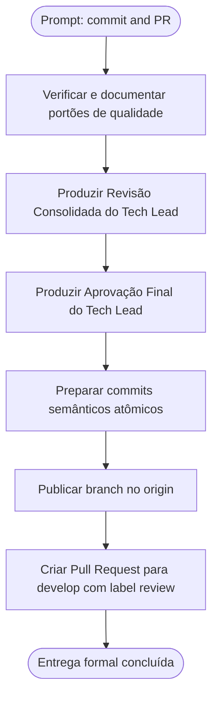

# Log de Prompt — fechamento-commit-e-pr-upload-em-partes

## Prompt Original

> @tech-lead commit and PR

---

## Interpretação

### Intenção Principal

Atuar como Tech Lead para fechar formalmente a entrega do incremento de envio em partes por sessão e suporte a entrada padrão (`-`) na branch `feature/upload-em-partes-e-entrada-padrao`, executando as validações e gates de qualidade, gerando os documentos de encerramento (revisão consolidada e aprovação final), organizando commits semânticos por Conventional Commits e abrindo o Pull Request para `develop` com governança e rastreabilidade completas.

### Entidades Identificadas

| Entidade | Tipo | Relevância |
|---|---|---|
| `@tech-lead` | persona/papel | Maestro de entrega, governança de qualidade, aprovação formal |
| `feature/upload-em-partes-e-entrada-padrao` | branch Gitflow | Ramo de trabalho da feature contendo código, testes e requisitos |
| `develop` | branch Gitflow | Ramo de integração destino do Pull Request |
| `commands/upload.sh` | código alterado | Remoção da recusa de stdin `-`, roteamento por tamanho (150 MiB), gate de simulação |
| `lib/transfer.sh` | código novo | Orquestração da sessão sequencial em partes (start, append_v2, finish), retentativa, integridade |
| `lib/hash.sh` | código alterado | API incremental de content_hash (iniciar, bloco, encerrar) com cálculo unificado |
| `tests/run.sh` | suíte de testes | Portão de validação executado (526 aprovados, 0 reprovados, 2 pulados) |
| `scripts/verificar-remocao-de-casos.sh` | ferramenta de guarda | Portão de integridade de testes (491 -> 502 casos commitados/rastreados) |
| `docs/registros/` | diretório | Artefatos de registro técnico, revisão consolidada e aprovação final |

### Intenções Secundárias

- Validar todos os portões de qualidade (suíte TAP, `shellcheck` com e sem `-x`, guarda de remoção de casos).
- Produzir artefatos formais de governança: Revisão Consolidada do Tech Lead e Aprovação Final do Tech Lead a partir dos templates padronizados.
- Seguir o padrão Conventional Commits com agrupamento lógico das alterações (hash, transfer, upload, testes/instrumentos, requisitos, governança).
- Enviar a branch para o repositório remoto (`origin`) e criar o Pull Request para `develop` com título semântico, descrição estruturada e label `review`.

### Restrições

- Respeitar estritamente o Gitflow (feature branch criada a partir de `develop`, direcionada a `develop`).
- Não expor segredos, tokens ou dados protegidos nos commits ou no PR.
- Manter o idioma português do Brasil nos documentos de governança e histórico.
- Código e comentários técnicos preservando o padrão do projeto (sem acentos).

### Ambiguidades e Inferências

| Ambiguidade | Inferência Adotada | Confiança |
|---|---|---|
| Prompt sucinto ("@tech-lead commit and PR") | Executar o fluxo completo do Tech Lead: verificação de portões, elaboração de revisão consolidada e aprovação final, estruturação de commits atômicos semânticos, push do ramo e abertura do PR via `gh` CLI direcionado a `develop` | Alta |
| Estratégia de commits (único vs. múltiplos) | Múltiplos commits semânticos atômicos, espelhando as entregas anteriores (PR #10 e #11), separando domínio/núcleo (`lib/hash`), orquestração (`lib/transfer`), comando (`commands/upload`), instrumentos de teste, requisitos e governança | Alta |

---

## Plano de Ação

### Passos Planejados

1. **Validação de Portões**: Reexecutar e consolidar evidências de testes (526 aprovados), `shellcheck` (exit 0) e `scripts/verificar-remocao-de-casos.sh` (exit 0).
2. **Revisão Consolidada**: Redigir `docs/registros/2026-08-19_revisao-consolidada-upload-em-partes-e-entrada-padrao.md` aderente ao template do pacote, consolidando atividades dos agentes (SD, BA, QA, TL), requisitos (RF-31, RF-08, RF-09, RF-15), divergências e evidências.
3. **Aprovação Final**: Redigir `docs/registros/2026-08-19_aprovacao-final-upload-em-partes-e-entrada-padrao.md` formalizando aceite técnico, riscos residuais e plano de rollback.
4. **Atualização da Memória de Projeto**: Garantir integridade do estado e das decisões registradas em `MEMORIA-PROJETO.md`.
5. **Commits Semânticos**: Agrupar e comitar logicamente em unidades atômicas (feat hash, feat transfer, feat upload, test instrumentos, docs requisitos, docs governança).
6. **Publicação e PR**: Efetuar `git push -u origin feature/upload-em-partes-e-entrada-padrao` e criar o Pull Request para `develop` com descrição completa e label `review`.

---

## Contexto do Projeto Aplicado

O pacote define a persona `tech-lead` como responsável pela aprovação final, integridade de governança e encaminhamento para Pull Request. Conforme o protocolo comum (.claude/agents-protocol/AGENTS.md) e as instruções da persona (.claude/agents-protocol/AGENTS.md e .claude/agents/tech-lead.md), o fechamento exige artefatos formais com rastreabilidade, cumprimento de portões e Pull Request marcado para review.

---

## Resultado Esperado

- Portões de qualidade formalmente validados e registrados.
- Dois artefatos de governança em `docs/registros/` e o log de prompt em `docs/prompts/`.
- Histórico do Git estruturado com commits semânticos claros.
- Ramo publicado e Pull Request aberto em `salesadriano/dropbox_sync` com label `review`.
