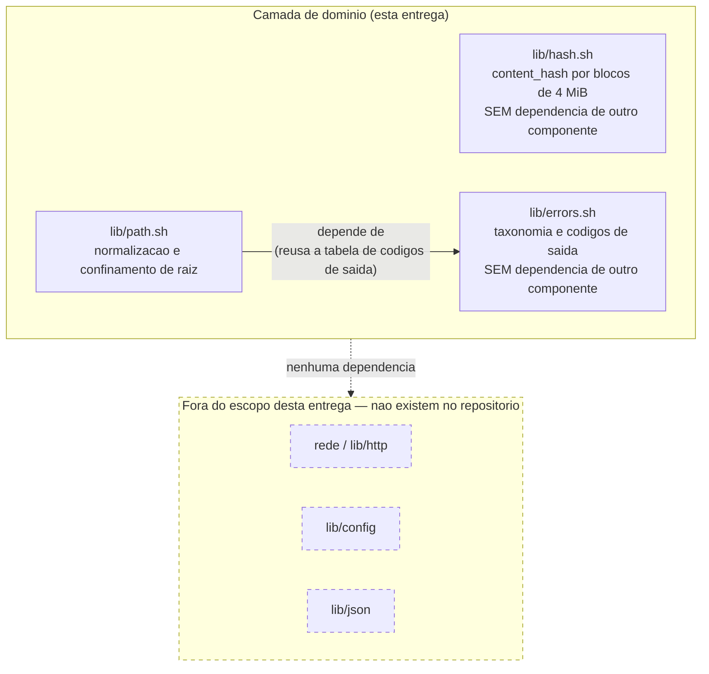

# Registro Tecnico de Entrega — Camada de Dominio

## Identificacao

| Campo | Valor |
|---|---|
| Projeto | `dropbox_api` — aplicacao CLI em shell script para integracao com Dropbox |
| Escopo da entrega | Camada de dominio: `lib/hash.sh`, `lib/errors.sh`, `lib/path.sh`, mais o arcabouco de testes |
| Responsavel Senior Developer | Senior Developer (pacote de agents) |
| Destinatario do handoff | QA Expert |
| Data do registro | 2026-08-17 |
| Documentos relacionados | [System Design](../arquitetura/system-design.md) · [Escopo e requisitos](../requisitos/escopo-requisitos-e-criterios-de-aceite.md) · [Vetores de teste do `content_hash`](vetores-content-hash.md) |
| Status | **Parecer final do QA: APROVADO COM RESSALVA.** A rodada de acabamento posterior ao ciclo 3 foi concluida; o unico ponto remanescente e residual, nao estrutural, e o QA determinou que nao ha escalonamento (ver "Rodada de acabamento — parecer final do QA"). O ciclo 2 havia sido reprovado com 3 defeitos altos, dois deles regressoes de correcoes do proprio ciclo 1; o solicitante determinou troca de metodo nos dois pontos de regressao, aplicada no ciclo 3 (ver "Ciclo 3 de QA — reprovacao, troca de metodo e correcoes"). O TOCTOU residual (D11) foi aceito como risco residual documentado e a proposta da classe `dependencia_ausente` foi rejeitada (ver secoes correspondentes). Os aceites do Tech Lead sobre os codigos de saida 5 a 15 e o titular do copyright continuam pendentes (ver secao "Pendencias e bloqueios") |

---

## Escopo entregue

Apenas a **camada de dominio**, conforme instrucao do solicitante:

- `lib/hash.sh` — calculo do `content_hash` (RF-33, RF-34).
- `lib/errors.sh` — taxonomia de erro, codigos de saida e politica de retentativa (RF-29, RF-35, RNF-08).
- `lib/path.sh` — normalizacao de caminho e confinamento de raiz, remoto e local (RNF-10, RNF-20).
- Arcabouco de testes: `tests/run.sh`, `tests/support/harness.sh`, `tests/support/fixtures.sh`, e os quatro arquivos de teste unitario.

**Fora do escopo desta entrega, por instrucao explicita do solicitante:** rede (`lib/http`), autenticacao (`lib/auth`), configuracao (`lib/config`), comandos de usuario (`commands/*`) e `lib/json`. Nenhum desses componentes existe neste momento do repositorio.

### Diagrama de dependencia da camada de dominio

Leitura do diagrama: `lib/path` e o unico dos tres componentes com dependencia interna, e essa dependencia e **apenas de `lib/errors`** — para reusar a mesma tabela de codigos de saida em vez de duplica-la, o que sustenta a estabilidade de contrato exigida por RF-35. `lib/hash` e independente de tudo. Nenhum dos tres componentes depende de rede, de configuracao ou de `lib/json`, o que e verificavel por inspecao: nenhum dos tres arquivos contem `curl`, leitura de arquivo de configuracao ou referencia a `jq`/`lib/json`.

---

## Arquivos criados

Todos novos; **nenhum arquivo pre-existente foi alterado**.

| Arquivo | Papel |
|---|---|
| `lib/hash.sh` | Calculo do `content_hash` |
| `lib/errors.sh` | Taxonomia de erro e codigos de saida |
| `lib/path.sh` | Normalizacao de caminho e confinamento de raiz |
| `tests/run.sh` | Executor da suite |
| `tests/support/harness.sh` | Arcabouco de teste (assercoes, formato TAP 13, isolamento por subshell) |
| `tests/support/fixtures.sh` | Geradores deterministicos de massa de teste |
| `tests/unit/hash_test.sh` | 35 casos |
| `tests/unit/errors_test.sh` | 69 casos |
| `tests/unit/path_test.sh` | 44 casos |
| `tests/unit/hash_vetor_oficial_test.sh` | 2 casos (dependem de rede ou de arquivo local) |

---

## Decisoes tecnicas

### D1 — Arcabouco de teste proprio, em vez de `bats-core` ou `shunit2`

**Alternativas avaliadas:** (a) `bats-core`; (b) `shunit2`; (c) harness proprio.

`bats` e `shunit2` **nao estao instalados** no ambiente, e instalar pacote exige sinalizacao previa ao solicitante — o que nao foi solicitado nesta entrega. Escolhida a opcao (c), com saida em **formato TAP 13**, justamente para que uma eventual troca por `bats` no futuro nao altere o contrato de relatorio ja consumido pelo QA. Cada caso de teste roda em **subshell proprio** (`( ... )` em `harness_executar`), o que impede vazamento de estado entre casos.

### D2 — Leitura por blocos no `content_hash`: custo de memoria e de tempo, corrigido apos o ciclo 1 de QA

**Alternativas avaliadas:** (a) gravar cada bloco em arquivo temporario; (b) ler blocos sequencialmente, acumulando os resumos, com conversao para bytes brutos; (c) delegar a `python3`/`perl`.

Escolhida (b). A opcao (a) dobra a E/S de disco de toda transferencia e cria residuo a limpar em caso de interrupcao. A opcao (c) cria dependencia fora do conjunto permitido por RNF-02 e contraria RES-01.

Esta decisao precisou ser revista apos o ciclo 1 de QA (defeito D3, ver secao "Ciclo 1 de QA — reprovacao e correcoes"), que separou duas dimensoes de custo tratadas de forma indistinta na redacao original:

**Memoria — confirmado, sem alteracao de projeto.** O uso de memoria e proporcional a **quantidade de blocos**, nunca ao tamanho do conteudo. Medicao com entrada de `/dev/zero`: pico plano de 8.000 KiB de 1 GiB a 8 GiB de entrada (256 a 2.048 blocos) — ver a tabela de medicao de capacidade em [vetores-content-hash.md](vetores-content-hash.md). Esta propriedade tambem e verificada em `teste_arquivo_grande_nao_e_carregado_em_memoria` (ver "Evidencias de execucao").

**Tempo — a afirmacao original estava errada, e foi corrigida.** A redacao original desta decisao citava um teto pratico de 100 GiB sem distinguir memoria de tempo. Essa cifra estava incorreta: a conversao dos resumos de bloco para bytes era **quadratica** na quantidade de blocos, porque a implementacao original fatiava, a cada bloco, uma cadeia acumulada que crescia junto com o numero de blocos ja processados. Medicao do QA antes da correcao: 256 blocos = 727 ms, 512 blocos = 2.648 ms, 1.024 blocos = 10.879 ms — dobrar a entrada quadruplicava o tempo. Sob esse comportamento, o teto pratico real era da ordem de **4 GiB**, e nao os 100 GiB originalmente afirmados.

**Correcao aplicada:** a conversao passou a ocorrer bloco a bloco, dentro do proprio laco de leitura, sobre uma cadeia de tamanho fixo de 64 caracteres (o resumo de um unico bloco) em vez de uma cadeia acumulada crescente. Medicao depois da correcao: 256 blocos = 30 ms, 512 blocos = 56 ms, 1.024 blocos = 120 ms, 2.048 blocos = 275 ms — aproximadamente o dobro do tempo a cada duplicacao de blocos, ou seja, linear. Em 1.024 blocos, a mudanca foi de 10.879 ms para 120 ms, cerca de 90 vezes mais rapido. A extrapolacao para 100 GiB, apos a correcao, e de cerca de 7 minutos, limitada pela taxa do SHA-256 e nao mais pela conversao de resumos (ver tabela de medicao de capacidade em [vetores-content-hash.md](vetores-content-hash.md)).

**Desenho de leitura — tambem revisado no mesmo ciclo.** A leitura por cano (descritor compartilhado com o leitor de bloco na outra ponta) foi substituida por leitura para um arquivo de buffer reaproveitado. Consequencias:

- o status de saida do leitor passa a ser observavel diretamente, sem depender de `pipefail` (ver defeito D4 na secao "Ciclo 1 de QA");
- o tamanho de cada bloco lido fica disponivel, o que permite expor o total de bytes lidos pela funcao de hash (RF-31);
- o fim da entrada passa a ser detectado por tamanho de bloco igual a zero, em vez de comparacao do resumo do bloco com o resumo da cadeia vazia (ver decisao D4 abaixo, tambem revisada).

Custo assumido: uma escrita e uma leitura adicionais por bloco, no arquivo de buffer reaproveitado. Este e um **trade-off aceito conscientemente**: o custo extra de E/S por bloco compra observabilidade de status e de tamanho que o desenho por cano nao oferecia. Registro para a Etapa 2: a area temporaria usada pelo buffer de bloco deve migrar para `lib/tmp` quando esse componente existir no repositorio; ate la, permanece sob a area temporaria da propria execucao.

**Nota (C2-08, ciclo de QA subsequente) — reversao da decisao D2, aceita sem ressalva.** O solicitante aceitou que o conteudo vindo da entrada padrao passe por disco na area temporaria, como consequencia do desenho por arquivo de buffer descrito acima, e dispensou nota operacional sobre `$TMPDIR`.

### D3 — Conversao hexadecimal-para-bytes com `printf '%b'`, nao com `xxd`

`xxd` esta fora do conjunto de dependencias permitido por RNF-02 — vem do pacote do `vim`, nao do `coreutils` base. Verificado experimentalmente que o `printf` interno do `bash` preserva o byte `0x00` na saida, o que e a propriedade critica para nao truncar a concatenacao binaria do algoritmo do `content_hash`.

### D4 — Deteccao de fim de fluxo, revisada apos o ciclo 1 de QA

**Redacao original (superada):** o laco de leitura de blocos em `dbx_hash_conteudo_fluxo` encerrava quando o resumo do bloco lido era igual ao SHA-256 da entrada vazia — o que so ocorria quando a leitura devolvia exatamente zero bytes, isto e, no fim do fluxo. A sentinela era segura porque um bloco **nao vazio** que produzisse esse mesmo resumo exigiria uma pre-imagem de SHA-256, o que e computacionalmente inviavel.

**Redacao atual:** com a mudanca do desenho de leitura registrada na decisao D2 (leitura para arquivo de buffer reaproveitado em vez de cano), o tamanho de cada bloco lido passou a estar disponivel diretamente, sem precisar de sentinela. O fim da entrada agora e detectado por **tamanho de bloco igual a zero**. A deteccao por sentinela criptografica deixou de ser necessaria e foi removida; a comparacao por tamanho e mais direta, mais barata e nao depende de nenhuma propriedade do SHA-256 para ser correta.

### D5 — Correspondencia de `error_summary` por prefixo com fronteira de componente

**Alternativas avaliadas:** (a) igualdade exata — rejeitada, porque a Dropbox sufixa as tags (por exemplo `path/not_found/.`) e orienta explicitamente o uso de prefixo; (b) expressao regular por tag — rejeitada, por ser a origem documentada do defeito DIV-04 do projeto de referencia; (c) **escolhida** — correspondencia por prefixo com fronteira: casa `path/not_found`, `path/not_found/` e `path/not_found.`, mas **nunca** `path/not_founded`. Ha caso de teste dedicado a essa fronteira em `tests/unit/errors_test.sh`.

### D6 — Confinamento de raiz com comparacao por fronteira de componente

A comparacao textual ingenua de prefixo (`[[ $alvo == $raiz* ]]`) aceitaria `/backups2` como se estivesse dentro de `/backups`. `_dbx_path_dentro_de` exige que o alvo seja igual a raiz ou comece por `"$raiz/"`. Ha caso de teste dedicado em `tests/unit/path_test.sh`, e a mutacao que reintroduz esse defeito e detectada pela suite (ver "Evidencias de execucao — validacao por mutacao").

### D7 — Dois espacos de nomes com regras deliberadamente diferentes em `lib/path`

| Aspecto | Espaco **remoto** | Espaco **local** |
|---|---|---|
| Resolucao de `..` | Lexical — a Dropbox nao tem links simbolicos do lado do servidor | Fisica, componente a componente, seguindo links simbolicos **antes** de aplicar `..` |
| Comparacao de confinamento | **Ignora caixa** — o servico resolve caminho sem diferenciar maiusculas | **Sensivel a caixa** — como o sistema de arquivos |

A distincao e deliberada e documentada no cabecalho de `lib/path.sh`: tratar os dois espacos com a mesma regra produziria ou uma resolucao remota incorretamente rigida (rejeitando caminhos que a Dropbox aceitaria por diferenca de caixa) ou uma resolucao local incorretamente permissiva (nao seguindo links simbolicos, deixando uma rota de evasao do confinamento local).

### D8 — Falha fechada no confinamento

Raiz ausente, relativa ou malformada **nunca** e interpretada como "sem restricao": `dbx_path_remoto_confinar` e `dbx_path_local_confinar` devolvem erro de configuracao (codigo `3`) nesses casos. Com acesso amplo a conta (`PRJ-DEC-03`), `lib/path` e o **unico confinamento restante** entre a aplicacao e a conta inteira; o modo de falha aberto seria o pior resultado possivel para RNF-20.

### D9 — Politica conservadora de retentativa em falha de transporte (SUPERADA no ciclo 2 — ver "Ciclo 2 — decisoes do solicitante aplicadas", Item 1)

Redacao original, mantida aqui como registro historico: quando nao havia resposta HTTP (`codigo_http == 0`), nao havia como saber se a escrita foi aplicada do outro lado. Repetir as cegas podia duplicar uma operacao nao idempotente. `dbx_errors_politica_retentativa` devolvia `nenhuma` para esse caso, sem distinguir por operacao, e deixava a decisao para `lib/http`, componente ainda nao implementado.

O solicitante decidiu, no ciclo 2, que essa resposta unica escondia duas situacoes distintas atras do mesmo valor: para operacao idempotente, `nenhuma` desperdicava uma retentativa segura; para operacao nao idempotente, `nenhuma` seria lida por quem implementa `lib/http` como instrucao explicita de nao repetir, quando o significado real e que nao ha como saber se a escrita foi aplicada. A assinatura da funcao passou a receber a idempotencia da operacao como terceiro argumento, e o comportamento foi dividido por caso. Detalhe completo, incluindo a decisao (ja aprovada) sobre `5xx` seguir a mesma regra, na secao "Ciclo 2 — decisoes do solicitante aplicadas", Item 1.

---

## Tabela de codigos de saida entregue (RF-29)

A publicar tambem no `README` quando ele existir (RNF-15).

| Codigo | Classe |
|---|---|
| 0 | sucesso |
| 1 | desconhecido |
| 2 | uso_invalido |
| 3 | configuracao |
| 4 | nao_encontrado |
| 5 | autenticacao |
| 6 | permissao |
| 7 | conflito |
| 8 | limite_taxa |
| 9 | rede |
| 10 | erro_remoto |
| 11 | integridade |
| 12 | espaco |
| 13 | caminho_recusado |
| 14 | nao_concluida |
| 15 | consumidor_encerrou |

Os valores `0`, `2`, `3` e `4` vieram dos criterios de aceite ja aprovados (RF-03, RF-17, RF-21, RF-15). **Os demais (5 a 15) foram PROPOSTOS nesta entrega** e precisam de aceite explicito do Tech Lead, porque RF-35 congela o contrato: dentro de uma mesma versao principal, esses valores nao podem mudar de significado. A faixa `126`, `127` e `128+n` foi deixada livre por ser reservada ao shell (sinais e erros de execucao), e ha caso de teste que reprova se algum codigo da tabela invadir essa faixa.

---

## Evidencias de execucao

Resultado real, obtido por execucao da suite neste ambiente — nao estimado.

| Execucao | Comando | Resultado |
|---|---|---|
| Suite completa, com vetor oficial habilitado | `DBX_TESTES_REDE=1 bash tests/run.sh` | 4 arquivos, **157 casos aprovados**, 0 reprovados, 0 pulados |
| Suite padrao, sem rede | `bash tests/run.sh` | **155 aprovados**, 0 reprovados, **2 pulados** (os dois casos do vetor oficial, por ausencia de `DBX_TESTES_REDE=1` ou `DBX_TESTE_ARQUIVO_OFICIAL`) |

Por arquivo: `errors_test.sh` 76 casos, `path_test.sh` 44 casos, `hash_test.sh` 35 casos, `hash_vetor_oficial_test.sh` 2 casos.

`shellcheck` 0.10.0 com `-x`: exit 0. RNF-13 mantido.

Numeros atualizados apos o ciclo 3 de QA e a troca de metodo determinada pelo solicitante (ver "Ciclo 3 de QA — reprovacao, troca de metodo e correcoes"): o crescimento em `errors_test.sh` reflete o redesenho da redacao de segredo, a reconciliacao entre classificacao e politica de retentativa, e os casos de nao regressao correspondentes; o crescimento em `path_test.sh` reflete a correcao do confinamento de raiz por evasao de quebra de linha. Numeros atualizados uma segunda vez apos a rodada de acabamento do parecer final do QA (ver "Rodada de acabamento — parecer final do QA"): o crescimento adicional em `errors_test.sh` reflete os casos de R-01, R-02, R-03 e R-06.

### Ciclo TDD

Em cada um dos tres componentes, os testes foram escritos e executados **antes** da implementacao. Estados vermelhos registrados:

| Componente | Casos | Reprovando na fase vermelha |
|---|---|---|
| `lib/hash.sh` | 25 | 24 |
| `lib/errors.sh` | 26 | 26 |
| `lib/path.sh` | 31 | 31 |

Durante a fase vermelha foram detectados e corrigidos **7 casos que passavam por vacuidade** — assercao apenas negativa sem uma assercao positiva correspondente, laco sobre lista vazia que nunca executava o corpo do teste, e falha dentro de substituicao de processo (`$(...)`) que nao encerra o caso de teste porque o `exit` ocorre em subshell descartado. Registrar isso e evidencia de que a fase vermelha cumpriu sua funcao: sem a correcao, esses 7 casos teriam relatado sucesso independentemente do comportamento real do componente.

### Validacao por mutacao

Nove mutacoes deliberadas foram injetadas nos tres componentes; **todas foram detectadas pela suite**:

| Mutacao | Casos que reprovam |
|---|---|
| Concatenar resumos de bloco em hexadecimal em vez de bytes brutos | 12 |
| Bloco de 4.000.000 bytes em vez de 4.194.304 | 8 |
| Comparacao de prefixo sem fronteira no confinamento de raiz | 2 |
| Remocao da resolucao de links simbolicos no espaco local | 3 |
| Raiz vazia tratada como permissiva (sem restricao) | 1 |
| Resposta `5xx` passando a obedecer o `error_summary` em vez da classificacao fixa | 2 |
| Desligar a redacao (mascaramento) de segredo em `dbx_errors_redigir` | 1 |

### Medicao de memoria

Medida com GNU `time` (`/usr/bin/time -f '%M'`). Um arquivo de 8 MiB e um de 64 MiB produzem o **mesmo pico de memoria residente**, da ordem de 8.000 KiB, dominado pelo buffer de um unico bloco em transito. O pico nao acompanha o tamanho da entrada — propriedade verificada em `teste_arquivo_grande_nao_e_carregado_em_memoria`, que compara os dois picos e falha se a diferenca ultrapassar 1.024 KiB ou se o pico absoluto ultrapassar 16.384 KiB.

### Analise estatica

**`shellcheck` 0.10.0: exit 0, nenhum alerta nao suprimido. RNF-13 passa de bloqueio a ATENDIDO.**

Ha 7 supressoes no total, todas com justificativa individual registrada no proprio codigo:

- **SC2016** em `hash_test.sh` e em `path_test.sh` — scripts entregues literalmente a `bash -c`, com cifrao usado como dado de teste, nao como expansao a ser interpretada pelo shell que executa o teste;
- **SC2002** duas vezes em `hash_test.sh` — o `cat` e proposital nos dois casos: cria um cano nao seekavel, que e exatamente o objeto do caso de teste;
- **SC2034** uma vez — acumulador global definido em outro arquivo (do harness), nao um alerta de variavel de fato nao usada.

As tres ocorrencias de **SC2154** anteriormente presentes em `run.sh` desapareceram junto com a remocao do `eval` (ver defeito D5 na secao "Ciclo 1 de QA — reprovacao e correcoes"), como o QA havia previsto ao apontar o defeito.

---

## Divergencias identificadas

| ID | Divergencia | Impacto | Recomendacao |
|---|---|---|---|
| DIV-A | O [System Design](../arquitetura/system-design.md) lista `lib/json` como dependencia de `lib/errors` na tabela "Componentes e responsabilidades". Isso contraria a propria regra de dependencia declarada no mesmo documento ("Dominio: sem dependencia externa") e tornaria a taxonomia de erro refem de DP-08, ainda em aberto, alem de conflitar com a decisao do solicitante de nao usar `jq` | A dependencia foi **invertida** na implementacao: `lib/errors` recebe o codigo HTTP e o `error_summary` **ja extraidos como strings** pelo chamador; nao referencia `jq`, `lib/json` nem a camada de adaptadores. Ha teste que reprova se `lib/errors` passar a referenciar qualquer um dos tres | Corrigir a tabela de componentes do System Design para refletir a dependencia invertida |
| DIV-B | RNF-01 exige que a suite execute em `bash` 3.2 e em `bash` 5.x, mas o solicitante fixou a plataforma de execucao como Linux com `bash` 4 ou superior | A implementacao usa recursos de `bash` 4 (arrays associativos em `lib/errors.sh`, expansao de caixa `${var,,}` em `lib/hash.sh` e `lib/path.sh`), **incompativeis com `bash` 3.2** | Atualizar RNF-01 ao fechar DP-07, ou reabrir a decisao de plataforma |
| DIV-C | Conflito estrutural entre RNF-10 (preservar nomes com quebra de linha) e RF-28/RF-35 (saida estruturada parseavel por script, orientada a linha) | Uma saida orientada a linha nao representa fielmente um caminho que contem quebra de linha; alem disso, a substituicao de comando do shell (`$(...)`) remove quebras de linha finais, entao um nome terminado em quebra de linha nao sobrevive a passagem por `$(...)`. Mitigacao entregue: `dbx_path_seguro_para_linha` permite que `lib/output` (nao implementado ainda) detecte o caso antes de imprimir | Decidir o formato de escape da saida estruturada antes de implementar `lib/output` |
| DIV-D | Escopo do confinamento local. RNF-20 falava apenas em raiz **remota** | A implementacao entrega tambem confinamento **local**, com resolucao de links simbolicos, porque o requisito de percurso de arvore e o destino de recebimento abrem a mesma classe de evasao no lado do sistema de arquivos que RNF-20 endereca no lado remoto | **ACEITO pelo solicitante no ciclo 2** (ver "Ciclo 2 — decisoes do solicitante aplicadas", Item 4). Deixou de ser ampliacao pendente de aceite: o Business Analyst emendara RNF-20 para nomear explicitamente os dois espacos, remoto e local. Divergencia mantida na tabela apenas para rastreabilidade, sem acao pendente |
| DIV-E | O titular do copyright no arquivo `LICENSE` continua como o texto de espaco reservado `<TITULAR DO COPYRIGHT — CONFIRMAR ANTES DO PRIMEIRO COMMIT>` | Bloqueia o primeiro commit (`DP-20`) | Nenhum nome foi inventado; aguardar confirmacao do solicitante |

---

## Pendencias e bloqueios

- **Aceite necessario do Tech Lead** sobre a tabela de codigos de saida `5` a `15`.
- **Titular do copyright** no arquivo `LICENSE` ainda como texto de espaco reservado.
- **Nenhum commit foi feito e `git init` nao foi executado**, por instrucao expressa (`DP-19` em aberto).

RNF-13 (`shellcheck`) deixou de ser bloqueio — ver "Analise estatica" em "Evidencias de execucao". A pendencia de confirmar o `content_hash` do arquivo vazio contra a API foi removida: era uma afirmacao falsa, corrigida na secao 5 de [vetores-content-hash.md](vetores-content-hash.md) apos apontamento do QA no ciclo 1 — o valor esta especificado pela propria documentacao da Dropbox, sem pendencia de confirmacao.

---

## Roteiro para o QA Expert

1. Reexecutar `bash tests/run.sh` e `DBX_TESTES_REDE=1 bash tests/run.sh` e conferir os numeros registrados acima (148/0/2 e 150/0/0, respectivamente).
2. Reexecutar `shellcheck` em `lib/*.sh` e `tests/**/*.sh` e conferir o resultado ja registrado para RNF-13 (exit 0, 7 supressoes justificadas).
3. Verificar de forma independente que a suite nao usa credencial e nao acessa rede no modo padrao (sem `DBX_TESTES_REDE=1`).
4. Repetir a validacao por mutacao com mutacoes proprias, com atencao especial a `lib/path` (confinamento remoto e local).
5. Confirmar que nenhuma escrita persistente ocorre fora de diretorios temporarios, verificando `PRJ-DEC-07` e `RSK-23`.
6. Registrar o desvio de Cypress: nao ha interface web ou grafica, conforme ja previsto no System Design (secao "Observacoes de setup").

---

## Adendo — ciclo de refatoracao posterior a primeira redacao deste registro

Apos a validacao por mutacao, uma revisao dirigida do codigo levantou duas hipoteses de defeito nao cobertas pela suite. Ambas foram convertidas em casos de teste **antes** da correcao, os dois reprovaram, e so entao o codigo foi ajustado. As contagens desta pagina ja refletem o estado final.

| Defeito | Como se manifestava | Correcao | Caso de teste |
|---|---|---|---|
| `dbx_errors_redigir` interrompia a leitura na primeira quebra de linha | `read -r -a` le uma unica linha. Um `error_summary` com varias linhas perdia tudo a partir da segunda, e **um segredo em linha posterior escapava da redacao** — falha de seguranca silenciosa contra RNF-03 | Leitura ate o byte nulo (`read -r -d ''`), varrendo o texto inteiro | `detalhe_com_multiplas_linhas_nao_e_truncado`, `segredo_em_linha_posterior_tambem_e_redigido` |
| `dbx_hash_conteudo_arquivo` exigia arquivo comum (`-f`) | Cano nomeado, `/dev/stdin` e substituicao de processo eram recusados como origem invalida, inviabilizando o uso previsto em RF-31 | Passou a recusar apenas diretorio, mantendo a exigencia de leitura | `origem_pode_ser_um_cano_e_nao_apenas_arquivo_comum` |

Refatoracoes sem mudanca de comportamento aplicadas no mesmo ciclo: remocao de clausula morta em `dbx_errors_classe_valida` e aplicacao de `readonly` as quatro tabelas de `lib/errors.sh`, para que o contrato congelado de RF-35 tambem resista a alteracao em tempo de execucao.

> Nota de metodo: o primeiro caso e a justificativa mais forte desta entrega para a fase de refatoracao do ciclo TDD. A suite estava integralmente verde e resistia a nove mutacoes deliberadas, e ainda assim havia uma falha de redacao de segredo. Cobertura de teste alta nao substitui leitura dirigida do codigo.

---

## Ciclo 1 de QA — reprovacao e correcoes

O QA Expert reprovou o ciclo 1 da camada de dominio com **5 defeitos bloqueantes**. Todos foram corrigidos. Esta secao registra, para cada um, o que estava errado, a correcao aplicada e o caso de teste que prova a correcao.

| ID | Severidade | O que estava errado | Correcao aplicada | Caso(s) de teste |
|---|---|---|---|---|
| D1 | ALTA | `lib/path` corrompia caminho com quebra de linha final. As funcoes publicas capturavam o resultado das funcoes internas por substituicao de comando (`$(...)`), que remove quebras de linha finais. Consequencia de seguranca: `arq` e `arq\n` sao arquivos distintos, e o confinamento devolvia `arq` com status `0` para uma solicitacao de `arq\n`, fazendo a aplicacao ler ou sobrescrever o alvo errado ao mesmo tempo em que reportava sucesso. | As funcoes internas passaram a gravar o resultado em `DBX_PATH_RESULTADO` em vez de imprimir; nenhuma captura por substituicao de comando ocorre mais no caminho interno. A impressao continua existindo como conveniencia para quem consome a funcao publica diretamente. | `quebra_de_linha_terminal_sobrevive_na_normalizacao_remota`, `quebra_de_linha_terminal_sobrevive_no_confinamento_remoto`, `multiplas_quebras_terminais_sao_preservadas`, `quebra_terminal_local_nao_entrega_arquivo_errado`, `resultado_e_limpo_quando_o_caminho_e_recusado` |
| D2 | ALTA | A redacao de segredo falhava no formato dominante. A implementacao separava o texto por espacos e so reconhecia token iniciado por `sl.`, precedido de `bearer`, ou no formato `chave=`. Como o corpo da Dropbox e JSON, com o valor entre aspas e colado ao dois-pontos, o token passava integro. Vazavam tambem refresh token em JSON, `client_secret` em querystring e em corpo urlencoded, token entre aspas em prosa, prefixo em caixa alta, `Authorization: Basic`, credencial em `-u` de linha de comando e `Cookie:`. | Varredura por substituicao de padrao estendido do proprio shell, cobrindo: cabecalhos que carregam credencial; esquemas Bearer e Basic; credencial em linha de comando; dez chaves sensiveis em quatro formatos cada (JSON com aspas, atributo com aspas, querystring ou urlencoded, e cabecalho sem aspas); e, por fim, uma rede de seguranca para o prefixo `sl.` em qualquer caixa e posicao. | Onze casos reprovando antes da correcao, reunidos em suite adversarial que verifica nos dois sentidos (o segredo desaparece e a marca de redacao aparece), mais dois casos que garantem que texto sem segredo nao e alterado e que pontuacao, indentacao e quebras de linha sobrevivem |
| D3 | ALTA | Conversao dos resumos de bloco em bytes era quadratica na quantidade de blocos (ver decisao D2 na secao "Decisoes tecnicas" para os numeros completos). | Conversao passou a ocorrer bloco a bloco, sobre uma cadeia de tamanho fixo de 64 caracteres, dentro do laco de leitura. | `conversao_de_escapes_e_linear_na_quantidade_de_blocos`, que compara o tempo de 4.000 e de 8.000 blocos e reprova se dobrar a entrada mais que triplicar o tempo |
| D4 | MEDIA | Falha do leitor mascarada. Sem `pipefail`, apenas o status do ultimo comando do cano era observado, entao um leitor que entregasse dados parciais e saisse com erro produzia um `content_hash` bem formado com status `0`. | Nao ha mais nenhum cano no caminho de calculo; o status do leitor e observado diretamente. Alem disso, o total de bytes lidos passou a ser exposto por `dbx_hash_conteudo_fluxo_com_tamanho` e `dbx_hash_conteudo_arquivo_com_tamanho`, o que permite cumprir o criterio de RF-31 e distinguir fim de fluxo de truncamento. | `falha_do_leitor_nao_produz_hash_com_status_zero`, `expoe_o_total_de_bytes_lidos`, `expoe_o_total_de_bytes_lidos_a_partir_de_fluxo`, `contagem_confere_com_o_tamanho_real_do_arquivo` |
| D5 | MEDIA | O executor aprovava sem executar nada e avaliava a saida dos testes. Um filtro sem correspondencia produzia "arquivos executados: 0" com resultado APROVADA e codigo de saida `0`. Alem disso, o agregado vinha de `eval` sobre uma linha extraida do stdout dos proprios testes, o que permitia execucao de comando arbitrario e forja dos totais. | Filtro sem correspondencia agora reprova com codigo de saida `1`. O agregado passou a trafegar por arquivo proprio indicado por `DBX_HARNESS_RESUMO`, lido com validacao estrita de tres inteiros. Nao ha mais `eval` em lugar nenhum. Arquivo de teste que nao grave o agregado e tratado como falha de integridade. | Verificado: um arquivo de teste que imprime `# resumo ok=999` no stdout resulta em 1 caso contabilizado, e nao 999 |

Nota sobre D1: o caso de teste anterior a correcao punha a quebra de linha no meio do nome do caminho, que e justamente o unico lugar em que a substituicao de comando (`$(...)`) nao destroi o valor. Por isso esse caso passava mesmo sobre codigo defeituoso — a cobertura existia, mas nao no ponto em que o defeito se manifestava.

---

## Defeito encontrado durante a propria correcao

Ao mover o buffer de bloco para area temporaria (parte da correcao de D3/D4, ver decisao D2 revisada na secao "Decisoes tecnicas"), o `trap` de limpeza referenciava uma variavel declarada como `local`. Como a acao do `trap` e avaliada quando o subshell encerra — momento em que o escopo da funcao ja nao existe — a expansao da variavel virava vazia e nenhuma limpeza ocorria. Em uma unica execucao da suite, **29 diretorios temporarios ficaram para tras**.

O caso `nao_deixa_residuo_temporario`, que ja existia na suite e parecia trivial, capturou o defeito.

**Correcao:** a variavel passou a ser global dentro do subshell, em vez de `local`.

**Licao registrada:** o caso de teste de residuo temporario, que parecia o mais trivial da suite, foi o que impediu um vazamento de temporarios em producao.

---

## Itens nao bloqueantes tratados no mesmo ciclo

- **D8** — Os status de `lib/hash` (`1`, `3` e `4`) coincidiam numericamente com classes de RF-29 de significado diferente. Agora `lib/hash` deriva seus status de `lib/errors`, como `lib/path` ja fazia: falha do utilitario de resumo passa a ser a classe `desconhecido` (`1`), uso invalido `uso_invalido` (`2`), dependencia ausente `configuracao` (`3`) e origem invalida `nao_encontrado` (`4`). Ha caso de teste que reprova se algum status deixar de corresponder a essa derivacao. **Ressalva registrada para o Tech Lead:** nao existe classe propria para "dependencia de sistema ausente"; `configuracao` e a aproximacao mais proxima disponivel na tabela atual e pode merecer classe dedicada em versao futura.
- **D9** — `DBX_HASH_BACKEND` vinha do ambiente sem validacao. Agora existe lista fechada de utilitarios aceitos (`sha256sum`, `shasum`, `openssl`), e um valor fora dela, ou ausente do sistema, reprova como dependencia indisponivel. Motivo: aceitar valor arbitrario transformaria uma variavel de ambiente em escolha de programa a executar.
- **D12** — A redacao de segredo era quadratica: 50 mil palavras levavam 15,3 s e destruia a formatacao do texto. A nova implementacao processa 50 mil palavras em menos de 1 s, preserva a formatacao e passou a ter teto de entrada de 4.096 caracteres, com marca de truncamento. Ha caso de teste que reprova se o tempo ultrapassar 3 s.
- **D13** — O harness usava `mktemp` puro, fora da area controlada da suite. Passou a criar seus temporarios sob o diretorio da propria execucao.

---

## Ciclo 2 — decisoes do solicitante aplicadas

O QA Expert revalidou de forma independente as cinco correcoes do ciclo 1 e as confirmou: D1 (ausencia de corrupcao de caminho com quebra de linha, verificada pela variavel de resultado `DBX_PATH_RESULTADO`), D2 (redacao de segredo, revalidada em quatro vetores adversariais), D3 (custo linear da conversao de resumos, com medicao propria do QA de **4.044 ms, 8.328 ms, 17.007 ms e 33.302 ms** ao dobrar sucessivamente a quantidade de blocos), D4 (leitor injetado devolvendo status `1`, corretamente propagado pela funcao de hash em vez de mascarado), e D5 (filtro sem correspondencia saindo com codigo `1`, e agregado forjado no stdout de um arquivo de teste resultando em `1` caso contabilizado de fato, e nao nos `999` que a tentativa de injecao pretendia forjar).

A partir dessa confirmacao, o solicitante decidiu quatro pontos, ja implementados nesta entrega. Nenhum dos quatro decorre de defeito reportado pelo QA — sao decisoes de escopo e de comportamento tomadas pelo dono do produto.

### Item 1 — Assinatura da politica de retentativa

Nova assinatura: `dbx_errors_politica_retentativa <http> <error_summary> [idempotente]`, em que `idempotente` aceita `sim` ou `nao` e assume `nao` quando omitido — o lado seguro, que nao presume que uma retentativa e livre de efeito colateral.

Mudancas de comportamento:

- Falha de transporte (`http=0`) em operacao **idempotente** passa a devolver `recuo_exponencial`. Antes devolvia `nenhuma` para todo `http=0`, independentemente da operacao.
- Falha de transporte em operacao **nao idempotente** passa a devolver `indeterminado`, valor novo no conjunto congelado de politicas. Motivo registrado pelo solicitante: `nenhuma` seria lido por quem implementa `lib/http` como instrucao ("nao tente"), quando o significado real e "nao da para saber se a escrita foi aplicada". Esse estado precisa de nome proprio, e a decisao de repetir ou nao cabe ao chamador, que conhece a semantica da operacao — `lib/http` nao deve decidir por conta propria.
- `408` passa a devolver `recuo_exponencial`. Era uma lacuna do comportamento anterior: `408` caia no ramo generico `nenhuma`, apesar de ser tempo limite de requisicao e, portanto, retentavel por natureza.
- Valor invalido no terceiro argumento (diferente de `sim`, `nao` ou omissao) e recusado com uso invalido.

Motivacao de negocio registrada: `PRJ-DEC-02` exige uso em cron e em CI. No comportamento anterior, um RST de TCP (falha de transporte) encerrava o lote com saida `9` e zero retentativa, inclusive para `download`, `list_folder` e `get_metadata` — operacoes trivialmente seguras de repetir porque nao alteram estado no servidor. Isso tornava o uso em cron/CI mais fragil do que a natureza das proprias operacoes exigia.

Conjunto congelado de politicas passa a ser: `nenhuma`, `recuo_exponencial`, `respeitar_retry_after`, `renovar_token_uma_vez`, `reiniciar`, `indeterminado`.

Casos de teste: `falha_de_transporte_depende_da_idempotencia_da_operacao`, `falha_de_transporte_em_operacao_nao_idempotente_e_indeterminada`, `idempotencia_omitida_assume_o_lado_seguro`, `valor_invalido_de_idempotencia_e_recusado`, `408_e_retentavel`, `idempotencia_nao_altera_as_demais_classes`, `politicas_pertencem_ao_conjunto_congelado`.

**Observacao tecnica — decisao aprovada pelo solicitante.** A mesma ambiguidade de "nao sei se a escrita foi aplicada" existe em `5xx`, porque o servidor respondeu, mas a operacao pode ou nao ter sido aplicada do lado dele. O que era registrado como "ponto a confirmar" foi decidido: o solicitante aprovou que `5xx` siga a **mesma regra do `http=0`** — `5xx` mais operacao idempotente devolve `recuo_exponencial`; `5xx` mais operacao nao idempotente devolve `indeterminado`. O Business Analyst ajustara RNF-07, que foi escrito antes de a dimensao de idempotencia existir na politica de retentativa. Caso de teste: `5xx_segue_a_idempotencia_como_a_falha_de_transporte`.

### Item 2 — Taxonomia da familia 409

Este item corresponde a uma lacuna na decisao D5 da secao "Decisoes tecnicas" ("Correspondencia de `error_summary` por prefixo com fronteira de componente"): a tabela anterior enumerava formas compostas soltas, e a maior parte da familia de erros de rota caia em `desconhecido`, que sai com codigo `1` e esvazia RF-29.

Correcao adotada: a tabela passou a guardar apenas TAGS, e os qualificadores de uniao conhecidos (`path`, `path_lookup`, `path_write`, `from_lookup`, `from_write`, `to`, `lookup_failed`) sao removidos antes do casamento, com teto de quatro remocoes. Isso cobre a combinacao {qualificador} x {tag} sem enumerar o produto cartesiano.

Classificacoes que passaram a funcionar: `path/restricted_content` como permissao, `path/not_file` e `path/not_folder` como uso invalido, `lookup_failed/not_found` como nao encontrado, `lookup_failed/incorrect_offset` e `lookup_failed/closed` como operacao nao concluida, `no_write_permission` solto como permissao, `invalid_argument` como uso invalido, `email_unverified` como permissao, e `other` como desconhecido declarado da uniao — e nao como ausencia de mapeamento.

**Registro com destaque: a fronteira de componente NAO regrediu.** Afrouxar o casamento para "comeca com" era o risco obvio da mudanca. A remocao do qualificador exige a barra: `path/` e qualificador, `pathological` nao e. Ha caso dedicado de nao regressao, `remocao_de_qualificador_nao_afrouxa_a_fronteira_de_componente`, que verifica que `path/not_founded`, `not_found_x`, `reset_me`, `conflicts`, `resetting`, `path/conflicting` e `restricted_contents` continuam sem classificacao especifica.

Outros casos de teste: `qualificadores_de_uniao_sao_removidos_antes_do_casamento`, `tag_other_e_o_desconhecido_declarado_da_uniao`, `qualificador_nao_e_confundido_com_tag`, `qualificadores_encadeados_sao_removidos`.

### Item 3 — Raiz `/` opt-in explicito

Antes, raiz `/` desligava o confinamento por curto-circuito. O comportamento estava correto quanto ao resultado, mas era um padrao silencioso: nada no uso revelava que a protecao de RNF-20 estava inativa.

Agora `dbx_path_remoto_confinar` e `dbx_path_local_confinar` aceitam um terceiro argumento `raiz_total` (`sim` ou `nao`, padrao `nao`); raiz `/` sem essa autorizacao explicita passa a falhar fechado com erro de configuracao. A opcao autoriza exclusivamente a raiz `/`: com raiz restrita, o confinamento continua integral mesmo com a opcao ligada, e a normalizacao nao e afetada — `..` acima da raiz continua recusado.

Casos de teste: `raiz_barra_sem_opcao_explicita_falha_fechado`, `raiz_barra_com_opcao_explicita_opera_sem_confinamento`, `raiz_barra_explicita_ainda_barra_travessia_acima_da_raiz`, `opcao_de_raiz_total_nao_afeta_raiz_restrita`, `valor_invalido_da_opcao_de_raiz_total_e_recusado`, `raiz_local_barra_tambem_exige_opcao_explicita`.

### Item 4 — Confinamento local (DIV-D) aceito pelo solicitante

A divergencia DIV-D, registrada na secao "Divergencias identificadas", deixa de ser ampliacao pendente de aceite e passa a **escopo aceito**. O Business Analyst emendara RNF-20 para nomear explicitamente os dois espacos, remoto e local, encerrando a ambiguidade que motivou a divergencia. A linha de DIV-D na tabela de divergencias foi atualizada para refletir essa decisao.

---

## Ciclo 3 de QA — reprovacao, troca de metodo e correcoes

O QA Expert reprovou o ciclo 2 com **3 defeitos altos**. Dois dos tres eram **regressoes** — nao defeitos novos, mas o mesmo ponto do ciclo 1 falhando de outra forma, com severidade equivalente. O padrao fica registrado explicitamente porque e o ponto central desta rodada:

| Ciclo | `dbx_errors_redigir` | componente de caminho |
|---|---|---|
| Entrega | vazava JSON | `$()` nas funcoes publicas |
| Ciclo 1 | corrigida, virou **quadratica** | corrigido, `$()` mantido na raiz |
| Ciclo 2 | virou **cubica** | virou **evasao de confinamento** |

**Licao registrada.** Duas rodadas seguidas trocaram um defeito por outro de severidade equivalente no mesmo lugar. Corrigir o sintoma sem trocar o desenho reproduz o defeito em outra forma. O solicitante determinou **troca de metodo** em ambos os pontos, e nao mais um ajuste local sobre o desenho ja corrigido duas vezes.

### C2-01 (ALTA, regressao) — evasao de confinamento por raiz terminada em quebra de linha

`dbx_path_local_confinar` resolvia a raiz com `raiz_fis=$(cd -P -- "$raiz" … && pwd -P)`. Era exatamente o `$( )` removido do resto do componente no ciclo 1, mantido na raiz, com um comentario alegando que raiz com quebra de linha seria "configuracao invalida" — algo que o codigo nunca verificava.

Falha ABERTA nas duas direcoes:

- com irmaos `base/raiz` e `base/raiz\n`, pedir `segredo` sob a raiz `base/raiz\n` devolvia status `0` apontando para `base/raiz/segredo`, arquivo FORA da raiz configurada;
- acesso legitimo a `raiz\n/interno` escorregava para `raiz/interno`.

RNF-20 quebrado.

**Correcao:** a raiz passou a ser resolvida pelo MESMO resolvedor fisico do alvo, `_dbx_path_resolver_fisico`, sem substituicao de comando, seguido de verificacao de que o resultado e diretorio.

Casos: `raiz_com_quebra_de_linha_final_nao_alcanca_a_raiz_vizinha`, `raiz_com_quebra_de_linha_nao_captura_caminho_da_raiz_vizinha`. Mutacao que devolve o `$( )` reprova 2 casos.

### C2-02 (ALTA, regressao) — redacao cubica, e a TROCA DE METODO

Medicao que reproduziu o defeito neste ambiente, com corpo de 4.090 caracteres:

| Corpo | Tempo |
|---|---|
| `secret=abc&` repetido | **77.683 ms** |
| `code=1&` repetido | 57.547 ms |
| `access_token=abc&` repetido | 50.625 ms |
| `"access_token":"v",` repetido | 36.665 ms |
| Corpo benigno `k0=v0&` | 3 ms |

**Causa.** O gatilho nao e o tamanho, e o CASAMENTO REPETIDO da chave sensivel, que disparava retrocesso do padrao estendido sobre o restante do texto. Por isso o teto de 4.096 nao continha o custo, e por isso o corpus benigno usado na medicao do ciclo 1 passou limpo. A licao registravel e que medicao de custo precisa usar o corpus adversarial, nao o comodo.

**Troca de metodo — o desenho novo.** Varredura em passada unica, linear por construcao, em tres etapas:

1. cada delimitador e envolvido por um separador, uma passagem em C por delimitador, custo proporcional ao tamanho;
2. uma unica divisao produz um vetor que alterna termos e delimitadores, preservando tudo, de modo que a juncao reproduz a entrada byte a byte;
3. o vetor e varrido uma vez, com indexacao O(1), por uma maquina de estados que reconhece chave, delimitador e valor.

Nao ha fatiamento de cadeia longa, nao ha retrocesso, e nao ha padrao aplicado repetidamente sobre o todo.

**Alternativa medida e descartada:** um varredor indexado por caractere seria QUADRATICO, porque `${cadeia:indice:1}` custa proporcional ao indice mesmo com `LC_ALL=C` — medido 2.000/4.000/8.000/16.000 caracteres em 5/20/91/330 ms. Essa medicao evitou repetir o erro pela terceira vez. A alternativa escolhida mediu 3/6/12/15 ms para 8.780/17.780/37.780/77.780 caracteres.

**Medicao depois da correcao, mesmos corpora:** `secret=abc&` de 77.683 ms para **28 ms**; `code=1&` para 43 ms; `access_token=abc&` para 19 ms; JSON sensivel para 26 ms.

**Escala com chave sensivel, agora processando a entrada inteira e nao os 4 KB truncados:**

| Pares | Tempo |
|---|---|
| 448 | 19 ms |
| 896 | 39 ms |
| 1.792 | 89 ms |
| 3.584 | 231 ms |
| 4.077 | 282 ms |

Cerca de 2x por duplicacao — linear.

### C2-03 (ALTA) — classificacao e politica se contradiziam

`dbx_errors_classificar` recebeu analise profunda de tag no ciclo 2, mas `dbx_errors_politica_retentativa` continuou decidindo por codigo HTTP. Resultado: `409 too_many_write_operations` era classificado como `limite_taxa` (saida 8) e recebia politica `nenhuma`, embora seja a contencao de lock de namespace da Dropbox, que o servico manda repetir. Chegando como 429 acertava; como 409, abortava o lote. O mesmo valia para `path/rate_limit`, `transient_error`, `internal_error` e `lookup_failed/incorrect_offset`.

**Correcao:** a politica passou a CONSULTAR a classificacao e a decidir por classe, com tratamento especifico apenas para as duas condicoes de sessao distinguiveis por tag.

Casos: `politica_concorda_com_a_classificacao_em_limite_de_taxa`, `politica_concorda_com_a_classificacao_em_erro_remoto`, `nenhuma_classe_retentavel_devolve_politica_nenhuma`. Mutacao que faz a politica ignorar a classificacao reprova 10 casos.

### C2-04 (MEDIA-ALTA) — truncagem antes da redacao

A truncagem em 4.096 ocorria antes de redigir e podia cortar a aspa de fechamento que as regras exigiam, e o tamanho do vazamento ficava sob controle de quem escrevia o corpo.

**Correcao:** a redacao ocorre primeiro e a truncagem incide sobre o RESULTADO.

**Achado honesto do proprio processo:** apos a troca de metodo, a ordem deixou de ser load-bearing, porque o varredor termina o valor no fim da entrada e nao depende de aspa de fechamento — a mutacao que inverte a ordem NAO e detectada pela suite, e isso e consequencia do desenho novo ter eliminado a classe de defeito, nao de lacuna de teste. A ordem correta foi mantida como defesa em profundidade.

Casos: `truncagem_nao_deixa_segredo_escapar` (segredo ATRAVESSANDO o corte), `entrada_acima_do_maximo_nao_emite_nada_do_original` (acima do teto de analise nada do original pode ser emitido).

### C2-05 (MEDIA) — sobre-redacao destruia o diagnostico

`code` casava por subcadeia nao ancorada, e `error_code=409`, `exit_code=13`, `status_code: 500` e `geocode=BR` viravam `[REDIGIDO]`. Pior, a regra de cabecalho apagava a LINHA INTEIRA, levando junto o identificador de requisicao que RF-30 existe para preservar.

**Correcao:** o varredor reconhece a chave como TERMO COMPLETO, nunca como subcadeia, o que resolve o problema por construcao; e nos cabecalhos apenas o VALOR e mascarado, preservando o nome do cabecalho e o restante da linha.

Casos: `chaves_que_apenas_terminam_em_code_nao_sao_redigidas`, `chave_code_isolada_continua_sendo_redigida`, `cabecalho_sensivel_preserva_o_nome_e_o_restante_da_linha`. Mutacao que reintroduz casamento por subcadeia reprova 1 caso.

### Itens menores corrigidos no mesmo ciclo

- **C2-06**: `DBX_PATH_RESULTADO` retinha `/` apos recusa de raiz total, porque `|| return $?` saia antes da limpeza. Valor residual `/` e o pior possivel num componente que declara falhar fechado. Corrigido, com caso `resultado_e_limpo_quando_a_raiz_total_nao_e_autorizada`. Defeito de shell que apareceu na propria correcao, tambem registrado: depois de `if ! comando`, `$?` e o status do `!`, e nao o do comando testado — o status precisa ser capturado antes de qualquer negacao.
- **C2-07**: falha da area temporaria era classificada como `nao_encontrado` (4), cuja mensagem manda investigar a Dropbox por problema de disco local. Passou a `configuracao` (3). Caso `falha_da_area_temporaria_e_erro_de_configuracao`; mutacao reprova 1 caso.
- **C2-09**: `bash tests/unit/errors_test.sh nao_existe` produzia `1..0` com codigo de saida 0 — a mesma falha do executor, um nivel abaixo e alcancavel por invocacao direta em integracao continua. O harness passou a reprovar. Caso `arquivo_de_teste_com_filtro_sem_correspondencia_reprova`; mutacao reprova 1 caso. Este caso so existiu depois de a validacao por mutacao mostrar que a correcao estava sem cobertura.
- **C2-10**: `DBX_ERRORS_LIMITE_REDACAO` vinha do ambiente e nao era `readonly`, embora fosse o unico freio de custo. Passou a constante fixa. Caso `teto_de_redacao_nao_e_afrouxavel_pelo_ambiente`.
- **C2-11**: formas residuais agora cobertas naturalmente pelo varredor — valor JSON sem aspas, chave com hifen, valor dentro de arranjo.
- **C2-12**: `incorrect_offset` carrega o deslocamento correto; classificar como "reexecute" reiniciaria envio de varios GB. Ganhou politica propria `retomar`, distinta de `reiniciar`. Caso `deslocamento_incorreto_pede_retomada_e_nao_reinicio`; mutacao reprova 1 caso.

Conjunto congelado de politicas passa a ser: `nenhuma`, `recuo_exponencial`, `respeitar_retry_after`, `renovar_token_uma_vez`, `reiniciar`, `retomar`, `indeterminado`.

---

## Risco residual aceito e documentado — TOCTOU residual (D11)

**Este item deixou de ser pendencia.** O solicitante aceitou o TOCTOU residual como **risco residual aceito e documentado**, conforme a recomendacao do QA Expert que, no ciclo anterior, ainda nao havia sido endossada. Nenhuma mitigacao foi implementada. O risco fica registrado para ser **revisitado quando DP-07 fechar**, ponto em que a plataforma de execucao (versao de `bash` e disponibilidade de `/proc`) estara definitivamente fixada.

**Duas correcoes do QA a analise tecnica anterior, registradas aqui porque corrigem erros tecnicos do proprio registro:**

- (a) validar por `readlink` compara TEXTO DE CAMINHO, que pode mudar por `rename` entre o `open` e a leitura — o correto seria comparar dispositivo e inode, nao o caminho textual devolvido por `readlink`;
- (b) `/proc/self/fd` e exclusivo de Linux, entao adota-lo como mitigacao fecharia DP-07 a forca, o mesmo erro ja registrado em DIV-B (fixar comportamento com base em uma plataforma ainda nao formalmente decidida).

A avaliacao tecnica abaixo e mantida, com essas duas correcoes incorporadas, porque ainda serve de base para a revisao quando DP-07 fechar.

### Natureza do problema

`dbx_path_local_confinar` resolve o caminho e devolve uma cadeia. Entre o momento da resolucao e o momento em que o chamador efetivamente usa esse caminho (abre o arquivo, por exemplo), quem tiver permissao de escrita na arvore pode trocar um componente do caminho por um link simbolico apontando para fora da raiz confinada. A validacao em si continua correta no momento em que roda; o `open` seguinte, porem, segue o link novo, e nao o caminho validado.

### Existe mitigacao viavel dentro das restricoes do projeto (Linux, `bash` 4.4 ou superior, cURL, sem `jq`)?

**Sim, para o caso de arquivo unico, sem nova dependencia.** Os quatro mecanismos abaixo foram verificados experimentalmente neste ambiente:

1. Abrir o descritor e validar o que foi aberto, em vez de validar e depois abrir. `readlink /proc/self/fd/N` devolve o caminho canonico do inode ja aberto, e e essa cadeia que deve passar pela verificacao de confinamento, invertendo a ordem atual. Verificado. **Correcao (a) do QA:** `readlink` compara TEXTO DE CAMINHO, que pode mudar por `rename` entre o `open` e a leitura da comparacao; o mecanismo correto e comparar dispositivo e inode do descritor aberto contra dispositivo e inode da raiz confinada, nao comparar cadeias de caminho.
2. O descritor fixa o inode. Trocando o caminho por um link para fora **depois** do `open`, a leitura pelo descritor continua entregando o conteudo correto, enquanto a leitura pelo caminho passaria a entregar o arquivo do atacante. Verificado com dois arquivos distintos.
3. Para destino de escrita, `set -o noclobber` recusa abrir um caminho pre-existente, inclusive link simbolico, o que cobre o componente folha. Verificado.
4. Descritores alocados pelo `bash` sao herdados por processo filho, e `/proc/self/fd/N` funciona dentro do filho, o que permite entregar o descritor ao cURL sem passar pelo caminho. Verificado em `bash` 5.3; **exige confirmacao em `bash` 4.4**, porque o tratamento de close-on-exec para descritores alocados automaticamente variou entre versoes do `bash`. **Correcao (b) do QA:** `/proc/self/fd` e exclusivo de Linux; adota-lo como mitigacao fecharia DP-07 a forca em favor de Linux, o mesmo erro ja registrado em DIV-B (fixar comportamento com base em plataforma ainda nao formalmente decidida).

### Custo e limite da mitigacao

- Exige mudanca de API: `lib/path` passaria a expor algo como `dbx_path_local_abrir_confinado`, devolvendo um descritor em vez de uma cadeia, e `lib/transfer` e `lib/stream` passariam a operar por descritor em vez de por caminho. E uma mudanca de desenho que atinge a Etapa 3, nao um ajuste local na camada de dominio ja entregue.
- Depende de `/proc` montado, o que e aceitavel dada a plataforma Linux ja fixada para o projeto.
- **Nao cobre percurso recursivo de arvore.** Tornar `lib/walk` livre dessa corrida exigiria semantica de `openat` com `O_NOFOLLOW` por componente do caminho, que o `bash` nao oferece nativamente. Para esse caso, nao ha mitigacao sem nova dependencia ou sem mudanca de desenho maior — essa e a resposta honesta, e nao uma lacuna a esconder.

### Conclusao a registrar

Para arquivo unico, que e o caso dominante (origem de envio e destino de recebimento), a mitigacao e viavel e sem nova dependencia, ao custo de uma mudanca de API na Etapa 3. Para percurso recursivo de arvore, nao ha mitigacao possivel em shell puro dentro das restricoes ja fixadas. O solicitante decide com esses dois fatos; nenhuma implementacao de mitigacao foi feita nesta entrega.

---

## Proposta REJEITADA — classe dedicada `dependencia_ausente`

Proposta de livre criterio do redator tecnico, avaliada e **REJEITADA**, conforme recomendacao do QA Expert.

Contexto que motivou a proposta: a ausencia de um utilitario de sistema (por exemplo `sha256sum`) era aproximada pela classe `configuracao` (codigo de saida `3`), cuja mensagem falava em credencial ausente ou ilegivel. Um operador que visse saida `3` porque falta `sha256sum` no ambiente iria procurar o arquivo de configuracao, que esta intacto — o diagnostico induzia a busca no lugar errado.

**Razao da rejeicao.** O problema e de **precisao de mensagem**, nao de escassez de codigos. A tabela de codigos de saida (RF-29) e contrato publicado e permanente: RF-35 congela o significado de cada valor dentro de uma versao principal, e cada codigo acrescentado carrega **custo perpetuo** de manutencao e de compatibilidade daqui em diante. Resolver um problema de mensagem imprecisa com um codigo de saida novo (`16`) trocava um ajuste barato por um compromisso permanente.

**Sequencia determinada pelo solicitante, ja executada nesta rodada:**

- (a) a mensagem da classe `configuracao` foi reescrita para **nao presumir credencial** — passou a citar arquivo de configuracao, utilitarios exigidos e area temporaria, conforme o detalhe informado para cada causa possivel;
- (b) a falha da area temporaria, que antes caia erroneamente em `nao_encontrado`, foi mapeada para `configuracao` (3) — esta e a correcao **C2-07**, ver secao "Ciclo 3 de QA — reprovacao, troca de metodo e correcoes";
- (c) so depois de (a) e (b) se reavalia, com argumento, se a classe dedicada ainda agrega algo. Com a mensagem corrigida, a resposta e que nao agrega: o diagnostico deixou de induzir a busca no lugar errado sem exigir codigo novo nem alterar o contrato publicado.

Caso de teste: `mensagem_de_configuracao_nao_presume_credencial`.

Este item fica registrado como **proposta rejeitada**, e nao mais como pendencia aguardando decisao (ver secao "Pendencias e bloqueios"). Relaciona-se ao ponto ja levantado no defeito D8 da secao "Itens nao bloqueantes tratados no mesmo ciclo", que registrava a mesma lacuna sem propor um numero de codigo especifico; a lacuna foi enderecada pela correcao de mensagem, nao pela criacao de um codigo novo.

---

## Rodada de acabamento — parecer final do QA

**Parecer do QA Expert: APROVADO COM RESSALVA.** O problema residual identificado nesta rodada e classificado como **residual, nao estrutural**, e o QA determinou explicitamente que **nao ha escalonamento**. Nenhum dos seis itens abaixo toca confinamento, integridade ou corrupcao de dado.

O QA registrou reconhecimento de metodo: medir a alternativa obvia e descarta-la com numero ANTES de escolher era o que faltava nos dois ciclos anteriores (ciclo 2, ver "Ciclo 3 de QA — reprovacao, troca de metodo e correcoes"), e foi o metodo efetivamente seguido nesta rodada em cada um dos itens abaixo que envolveu escolha de desenho.

O QA tambem confirmou, por **medicao independente propria em quatro posicoes de corte**, a auto-correcao registrada em C2-04 sobre a ordem entre redigir e truncar: **zero caracteres sobreviveram nas duas variantes** (ordem antiga e ordem nova), o que confirma que a mutacao de ordem e semanticamente nula — e mutacao nula nao pode ser detectada por nenhuma suite, por construcao.

### R-01 (MEDIA) — o separador interno era consumido do texto do usuario

O byte de controle usado internamente para marcar fronteiras entre termos (na varredura em passada unica introduzida em C2-02) nao estava na lista de delimitadores reconhecidos na divisao. Um `\x01` presente no texto original do usuario era consumido pela divisao e nunca voltava na juncao.

Duas consequencias:

- a fidelidade byte a byte declarada no cabecalho da funcao se perdia: `ctrl\x01aqui` saia como `ctrlaqui`;
- **a redacao podia ser contornada**: um byte de controle dentro do nome de uma chave sensivel a partia em dois termos, nenhum deles reconhecido como sensivel isoladamente — `{"access\x01_token":"<segredo>"}` saia integro, com aparencia de texto normal, nao redigido.

**Registro com destaque:** essa e a pior forma de falha possivel para uma funcao de redacao, porque nada no diagnostico denunciava o contorno — a saida parecia corretamente processada.

**Alcancavel na pratica.** O texto de entrada vem de corpo de erro da API e de saida do cliente HTTP, que ecoam nomes de caminho fornecidos pelo usuario, e a Dropbox aceita caractere de controle em nome de arquivo.

**Correcao:** texto que contenha caractere de controle diferente de tabulacao, quebra de linha e retorno de carro **nao e analisado, e nada dele e emitido** — a mesma estrategia ja usada acima do teto de tamanho (ver `entrada_acima_do_teto_de_analise_e_truncada_com_redacao` em R-04). A recusa e visivel no diagnostico.

Casos de teste: `byte_de_controle_em_chave_sensivel_nao_contorna_a_redacao`, `byte_de_controle_nao_e_apagado_silenciosamente`, `fidelidade_byte_a_byte_para_entrada_aceita`. Mutacao que remove a recusa reprova 2 casos.

### R-02 (MEDIA-BAIXA) — aspa escapada encerrava o mascaramento cedo

`{"refresh_token":"a\\"b<segredo>"}` produzia `{"refresh_token":"[REDIGIDO]"b<segredo>"}` — a aspa escapada era interpretada como aspa de fechamento do valor, e o restante do segredo escapava sem mascaramento.

**Nao alcancavel** com o alfabeto de token da Dropbox, que e base64url e nao contem aspas. Mas a funcao e generica, e a lista de chaves sensiveis inclui `password` e `secret`, cujos valores podem legitimamente conter aspa escapada.

**Correcao:** aspa precedida de barra invertida passa a ser tratada como parte do valor, e nao como fechamento.

**Defeito secundario encontrado na propria correcao, registrado aqui.** Delimitadores consecutivos produzem elementos vazios entre si no vetor da varredura em passada unica; o elemento vazio situado entre a barra invertida e a aspa apagava a memoria do caractere anterior, desfazendo a deteccao do escape. Corrigido fazendo a memoria de "caractere anterior" ser atualizada apenas por elemento nao vazio.

Casos de teste: `aspa_escapada_no_valor_nao_encerra_o_mascaramento`, `aspa_escapada_em_senha_com_pontuacao`. Mutacao reprova 2 casos.

### R-03 (BAIXA) — mutacao sobrevivente: guarda sem teste

A guarda que exige espaco real entre o esquema de autenticacao (`Bearer`, `Basic`) e a credencial tinha comentario dedicado no codigo explicando sua existencia, e nenhum teste dedicado a ela. Trocando a guarda por `verdadeiro` (mutacao), os casos existentes davam **zero reprovacoes**, embora o comportamento piorasse de forma visivel: `{"token_type":"bearer","expires_in":14400}` virava `{"token_type":"bearer[REDIGIDO]`.

Caso de teste escrito: `esquema_de_autenticacao_exige_espaco_antes_da_credencial`. Com o caso em vigor, a mesma mutacao passou a reprovar 1 caso.

**Licao registrada:** comentario que explica uma guarda no codigo e indicio de que falta teste para ela.

### R-04 (BAIXA) — expoente real e teto desproporcional

O cabecalho de `dbx_errors_redigir` afirmava custo **proporcional** ao tamanho da entrada. A medicao do QA ate o teto real entao vigente (256 KiB) mostrou crescimento com **expoente da ordem de 1,5**, nao linear:

| Entrada | Tempo | Pico de memoria |
|---|---|---|
| 4 KiB | 0,02 s | 4,4 MB |
| 64 KiB | 0,58 s | 9,1 MB |
| 128 KiB | 1,53 s | 14,1 MB |
| 256 KiB | 4,56 s | 23,8 MB |

A medicao anterior (ciclo 3) parava em 4 KiB e por isso nao alcancou o comportamento no teto.

**Correcoes:**

- (a) o cabecalho passou a declarar o expoente medido, em vez de afirmar proporcionalidade;
- (b) o teto de entrada baixou de 262.144 para **16.384**, dimensionado em relacao ao teto de saida de 4.096 — nao faz sentido varrer centenas de KiB de entrada para emitir 4 KiB de saida.

Nova medicao ate o teto revisado:

| Entrada | Tempo | Pico de memoria |
|---|---|---|
| 4 KiB | 0,02 s | 4,4 MB |
| 8 KiB | 0,04 s | 4,7 MB |
| 16 KiB | 0,10 s | 5,0 MB |

O pior caso caiu de 4,56 s para 0,10 s.

**Registro sobre a natureza da mudanca de teto.** Baixar o teto e seguro porque o mascaramento nao depende de delimitador de fechamento (ver R-06); por isso a entrada acima do teto passou a ser **TRUNCADA e analisada**, em vez de recusada por inteiro — o que preserva diagnostico em vez de descarta-lo.

Caso de teste atualizado: `entrada_acima_do_teto_de_analise_e_truncada_com_redacao`.

### R-05 (BAIXA, documental) — o comentario afirmava mais do que o codigo faz

O cabecalho de `dbx_errors_redigir` dizia que, em cabecalho sensivel, "o nome do cabecalho e o restante da linha permanecem". O modo de mascaramento por linha consome o restante da linha ate a proxima quebra. Em dump HTTP, onde cada cabecalho ocupa a propria linha, o efeito pratico e preservar os demais campos; em registro de uma linha so, com varios campos separados por outro caractere que nao a quebra de linha, o que vier depois do valor sensivel na mesma linha se perde.

O QA considerou o comportamento **aceitavel**, porque errar para o lado de redigir demais e a escolha correta sob RNF-03.

**Correcao:** o comentario do cabecalho foi alinhado ao que o codigo de fato faz.

**Requisito de entrada para `lib/output` decorrente, registrado aqui com destaque:** nao concatenar campos de diagnostico na mesma linha de um cabecalho sensivel, sob pena de perder o identificador de requisicao que RF-30 existe para preservar. Este requisito deve ser consumido na **Etapa 2**, quando `lib/output` for implementado.

### R-06 — a invariante foi fixada por teste, e nao a ordem

O QA aceitou o raciocinio de C2-04 sobre a mutacao de ordem ser semanticamente nula, com um refinamento: o que sustenta a conclusao e a invariante **"valor sem delimitador de fechamento e mascarado ate o fim da entrada"**, e essa invariante nao estava fixada por nenhum teste proprio.

Sem um teste para a invariante em si, um refatoramento futuro que reintroduzisse dependencia de delimitador de fechamento devolveria o bypass de truncagem original **sem que nada acusasse** — nem a mutacao de ordem, que continuaria semanticamente nula sob o desenho antigo.

Caso de teste escrito: `valor_sem_delimitador_de_fechamento_e_mascarado_ate_o_fim`, cobrindo quatro formas: JSON sem fechamento, urlencoded sem terminador, JSON com espaco apos o dois-pontos, e cabecalho `Authorization`.

**Licao geral registrada:** quando uma mutacao e semanticamente nula, o que precisa de teste e a **invariante que a torna nula**, e nao o comportamento mutado em si.

### Licoes acumuladas nas quatro rodadas

| Licao |
|---|
| Medir a alternativa obvia e descarta-la com numero antes de escolher. |
| Medicao de custo precisa usar corpus adversarial, nao o comodo. |
| Comentario que explica uma guarda e indicio de teste ausente. |
| Quando a mutacao e nula, teste a invariante que a anula. |
| Correcao sem troca de desenho reproduz o defeito em outra forma. |
