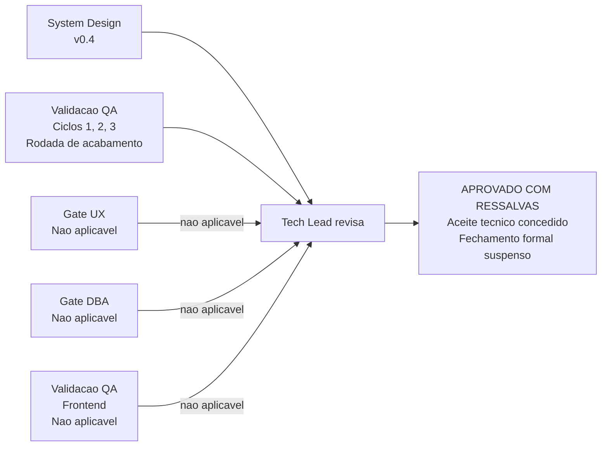

# Aprovacao Final do Tech Lead — Etapa 1, Camada de Dominio

## Identificacao

- Projeto ou produto: Aplicacao CLI em shell script para integracao com a Dropbox API v2 (`/home/sales/dropbox_api`)
- Responsavel Tech Lead: agent `tech-lead` do pacote `.claude/agents-protocol`
- Data da aprovacao: 2026-08-18
- Escopo avaliado: **Etapa 1 — camada de dominio**: `lib/hash.sh`, `lib/errors.sh`, `lib/path.sh`, mais o arcabouco de testes `tests/run.sh`, `tests/support/harness.sh`, `tests/support/fixtures.sh` e os quatro arquivos de teste unitario
- Uso do template padrao neste fechamento?: **Sim**
- Em caso de nao, justificativa explicita para excecao: Nao aplicavel
- Status final: **Aprovado com ressalvas**

## Artefatos obrigatorios revisados

- Revisao consolidada do Tech Lead: **Concluida em 2026-08-18**
- Link ou referencia do arquivo concreto da revisao consolidada do Tech Lead: `docs/registros/2026-08-18_revisao-consolidada-etapa-1-camada-dominio.md`
- System Design revisado: `docs/arquitetura/system-design.md` v0.4
- Template padrao de System Design utilizado?: **Sim**
- Em caso de nao, justificativa explicita: Nao aplicavel
- PRD aplicavel?: **Sim, por equivalencia funcional**
- Referencia do PRD revisado: `docs/requisitos/escopo-requisitos-e-criterios-de-aceite.md` (v0.4)
- ARD aplicavel?: **Sim, por equivalencia funcional**
- Referencia do ARD revisado: `docs/arquitetura/system-design.md` (v0.4)
- Resumo das divergencias resolvidas entre PRD, ARD, implementacao e evidencias de validacao: `DIV-A` corrigida nos tres pontos (dependencias de `lib/errors` x `lib/json`, `lib/transfer` fora do dominio, `lib/hash` ausente da tabela); `DIV-D` resolvida com aceitacao de escopo (confinamento local) emendado a `RNF-20`; `DIV-17` reconciliada com concessao de aceite do Tech Lead a faixa de codigos 0..15.
- Bloqueios remanescentes aceitos ou justificados: `DP-19` (repositorio git nao existente — bloqueante do versionamento), `DP-20` (titular do copyright em espaco reservado — bloqueante do primeiro commit), `DP-07` (plataformas e shells suportados, urgencia elevada para abertura da Etapa 2).
- Validacao QA frontend aplicavel?: **Nao**
- Template QA frontend utilizado?: **Nao**
- Documento de validacao QA frontend referenciado no fechamento final: `docs/registros/2026-08-18_validacao-qa-camada-dominio-registro-retroativo.md` (registro retroativo, produzido neste fechamento, que substitui o artefato de frontend por inaplicabilidade deste ultimo)
- Trecho, link ou evidencia reaproveitada da validacao QA frontend: Nao aplicavel
- Em caso de nao, justificativa explicita: **Sem interface web ou grafica e sem Design System.** O template de validacao QA de frontend pressupoe fluxo frontend com Design System, Figma e Storybook. Nenhum existe nem e previsto para a Etapa 1. A secao obrigatoria de Design System do System Design ja registra a inaplicabilidade com justificativa. Desvio homologado em `TL-07`.
- Documento de Design System referenciado?: **Nao**
- Evidencias adicionais consultadas: `docs/registros/2026-08-17_entrega-camada-dominio.md` (parecer do QA Expert nos tres ciclos), `docs/registros/vetores-content-hash.md` (conferencia contra oraculo Dropbox), `.claude/agents-protocol/memoria/MEMORIA-PROJETO.md` (registro de decisoes arquiteturais).

## Gates aplicados

| Gate | Aplicavel | Resultado | Evidencia | Observacoes |
|---|---|---|---|---|
| Business Analyst / System Design | Sim | **Aprovado** | `docs/arquitetura/system-design.md` v0.4, aderente ao template padrao; `docs/requisitos/escopo-requisitos-e-criterios-de-aceite.md` v0.4 | `DIV-A` corrigida nos tres pontos; medicoes reais incorporadas ao dimensionamento |
| QA Expert / Validacao independente | Sim | **Aprovado com ressalva**, com as cinco ressalvas fechadas na rodada de acabamento | `docs/registros/2026-08-17_entrega-camada-dominio.md`; registro retroativo de validacao QA produzido neste fechamento; reexecucao independente pelo Tech Lead em 2026-08-18 | Tres ciclos. Ciclo 1 reprovado com 5 bloqueantes (`D1` a `D5`); ciclo 2 reprovado com 5 (`C2-01` a `C2-05`), dos quais 3 de severidade ALTA e **dois deles regressoes das correcoes do ciclo 1**; ciclo 3 aprovado com ressalva, com 5 achados residuais fechados na rodada de acabamento. **Nao houve escalonamento por excesso de reprovacoes: 2 reprovacoes contra o limite de 3** |
| QA Expert / Validacao frontend | **Nao** | Nao aplicavel | Secao obrigatoria de Design System do System Design | Sem interface web ou grafica e sem Design System. Desvio homologado em `TL-07` |
| UX Expert / Interface | **Nao** | Nao aplicavel | Secao obrigatoria de Design System do System Design | Recomendacao de padrao de experiencia de linha de comando permanece ativa para a Etapa 2 |
| DBA / Persistencia | **Nao** | Nao aplicavel | `PRJ-DEC-07` | MVP sem estado local persistente; `DP-09` fechada |
| Tech Lead / Consolidacao | Sim | **Aprovado com ressalvas** | Esta revisao consolidada e esta aprovacao final | Aceite tecnico concedido; fechamento formal suspenso por `DP-19` e `DP-20` |

## Criterios de aceite consolidados

| Criterio | Status | Evidencia | Observacoes |
|---|---|---|---|
| Revisao consolidada do Tech Lead registrada | ✅ Atendido | `docs/registros/2026-08-18_revisao-consolidada-etapa-1-camada-dominio.md` | Template padrao utilizado |
| Referencia concreta ao arquivo da revisao consolidada | ✅ Atendido | Caminho absoluto citado nesta aprovacao | — |
| Requisitos claros e rastreaveis | ✅ Atendido | Matriz de rastreabilidade da secao 5 do escopo v0.4 | RF-29, RF-31, RF-33, RF-34, RF-35, RNF-03, RNF-08, RNF-10, RNF-13, RNF-20, RNF-22 |
| PRD revisado quando aplicavel | ✅ Atendido por equivalencia | `docs/requisitos/escopo-requisitos-e-criterios-de-aceite.md` v0.4 | Nao existe artefato nomeado PRD; equivalencia registrada |
| ARD revisado quando aplicavel | ✅ Atendido por equivalencia | `docs/arquitetura/system-design.md` v0.4 | Nao existe artefato nomeado ARD; equivalencia registrada |
| Divergencias entre PRD, ARD, implementacao e evidencias tratadas | ⚠️ Atendido com pendencias declaradas | Tabela de divergencias da revisao consolidada | `DIV-A`, `DIV-D` e `DIV-17` resolvidas; `DIV-15`, `DIV-16b`, `DIV-E` e `DIV-14` residual permanecem abertas **por dependerem do solicitante**, nao por omissao do processo |
| System Design aderente ao template padrao | ✅ Atendido | `docs/arquitetura/system-design.md` v0.4 | — |
| Vinculo entre System Design e Design System | 🚫 Nao aplicavel | Secao obrigatoria do System Design | Sem frontend e sem Design System; desvio homologado em `TL-07` |
| Validacao QA frontend registrada | 🚫 Nao aplicavel | — | Desvio homologado em `TL-07`; substituida por registro retroativo de validacao QA |
| Referencia direta ao documento de validacao QA frontend | 🚫 Nao aplicavel | — | Substituida pela referencia ao registro retroativo de validacao QA em `docs/registros/2026-08-18_validacao-qa-camada-dominio-registro-retroativo.md` |
| Testes TDD iniciais do SD + testes independentes do QA aprovados | ✅ Atendido | 155/0/2 reexecutados pelo Tech Lead; validacao por mutacao propria do QA | `protocolo-tdd` aplicado; harness proprio em TAP 13 |
| Escalonamento por excesso de reprovacoes de QA | 🚫 Nao acionado | 2 reprovacoes contra o limite de 3 | O solicitante interveio por decisao propria no ciclo 2, determinando troca de metodo — intervencao voluntaria, nao escalonamento formal |
| Aprovacao explicita do solicitante sobre os testes do QA | ⚠️ **Nao registrada com o template previsto** | — | Aprovacao substantiva existe nas decisoes tomadas pelo solicitante durante os ciclos; a formal, com `.claude/agents-protocol/templates/aprovacao-e-reaprovacao-solicitante-template.md`, fica como pendencia de formalidade |
| Memoria de projeto atualizada | ✅ Atendido | `.claude/agents-protocol/memoria/MEMORIA-PROJETO.md` | `MEMORIA-COMPARTILHADA.md` **nao alterada**, por ser compartilhada com outros projetos; decisao transversal candidata sinalizada ao solicitante |
| Branch Gitflow, commits semanticos e PR com label de review | 🚫 **Inexecutavel** | `git rev-parse` retorna `fatal: not a git repository` | Bloqueado por `DP-19`. Sete entregas acumuladas sem versionamento |
| Riscos residuais aceitaveis | ✅ Atendido | `RSK-24`, `RSK-25`, `RSK-23`, `RSK-09`, `DIV-14` residual | Todos com owner, impacto e proxima acao definidos |

## Riscos residuais e rollback

- **Riscos residuais aceitos:**
  - `RSK-24` — TOCTOU no confinamento local (medio, probabilidade baixa, a revisitar quando `DP-07` fechar)
  - `RSK-25` — precedente de decisao de escopo criada por conveniencia tecnica (medio, probabilidade media, gate `TL-09` instituido)
  - `RSK-23` — reintroducao de estado local persistente (alto se ocorrer, vigiar na Etapa 2)
  - `RSK-09` — divergencia entre utilitarios GNU e BSD (medio, condicionado a `DP-07`)
  - `DIV-14` residual — escopos OAuth ausentes (baixo, `401` explicito em vez de defeito silencioso)

- **Riscos residuais nao aceitos:** Nenhum. Todos os riscos sao aceitos como documentados ou reconhecidos como decisoes pendentes do solicitante.

- **Plano de rollback:**
  - **Situacao atual:** **nao ha commit para reverter.** Sem `DP-19`, o unico rollback possivel e a restauracao por copia integral do diretorio a partir de backup externo, que **nao existe sob controle do processo**. Este e o agravante mais concreto de `DP-19` e deve ser lido como consequencia operacional, nao como formalidade de governanca.
  - **Atenuante real:** a camada de dominio nao tem efeito colateral persistente (`PRJ-DEC-07`) e nao e consumida por nenhum componente ainda inexistente. Desativar o consumo equivale a rollback funcional completo; nada precisa ser desfeito em disco, em servico remoto ou em estado de usuario.
  - **Antes de qualquer alteracao na Etapa 2:** copia integral do workspace preservada fora dele, ate que `DP-19` feche.
  - **Depois de `DP-19` e `DP-20`:** rollback passa a ser reversao de commit em branch aderente ao Gitflow, com Pull Request marcado para review, conforme o item 25 do protocolo comum.

- **Dependencias criticas para monitoramento:**
  - `DP-07` (plataformas e shells) — urgencia elevada, informacao material do piso 4.4 ja disponivel
  - `DP-08` (dependencia de `jq`) — bloqueio de `lib/json` para Etapa 2
  - `DP-11` (armazenamento da credencial) — bloqueio de `lib/config` para Etapa 2, peso elevado por `PRJ-DEC-03`
  - `DP-19` (repositorio git) — bloqueio do versionamento
  - `DP-20` (titular do copyright) — bloqueio do primeiro commit

## Decisao final

- **Decisao do Tech Lead: APROVADO COM RESSALVAS.**

- **Aceite tecnico da Etapa 1 — camada de dominio: concedido.** A camada esta apta a ser consumida pela Etapa 2. `R-01` e `R-02` constam como condicao **satisfeita**, verificada de forma independente, e **nao** como pendencia. **Determinacao:** `R-01` e `R-02` constam deste fechamento como condicao satisfeita, e nao como pendencia herdada pela Etapa 2. `lib/http` esta liberado para alimentar `dbx_errors_redigir` com corpo real da API. A condicao que permanece para a Etapa 2 e outra e nao se confunde com estas: `RNF-22`, que proibe `lib/output` de concatenar diagnostico na mesma linha de cabecalho sensivel.

- **Fechamento formal da entrega: suspenso.** Nao por qualidade da entrega, e sim por dois bloqueios que nao pertencem a nenhum agent: `DP-20` (titular do copyright) e `DP-19` (repositorio git). Sem eles nao ha commit, nao ha branch, nao ha Pull Request e nao ha `review-documentation` executavel.

- **Condicoes para o fechamento formal:**
  1. Titular do copyright informado e publicado no `LICENSE`
  2. `git init` autorizado, com convencao de branches e origem remota definidas
  3. Commit inicial preparado com o `commit-writer` a partir do diff real, seguindo convencao semantica
  4. Pull Request aberto com label de review e review request nativo

- **Condicoes para abertura da Etapa 2:**
  1. `DP-07` respondida — urgencia elevada, com a informacao material do piso 4.4 e da exclusao de RHEL 6 ja disponivel
  2. `DP-08` e `DP-11` respondidas
  3. Decisao de desenho sobre `DIV-16b` antes de `lib/output`
  4. `RNF-22` respeitado por `lib/output`
  5. Gate `TL-09` em vigor
  6. Artefato proprio de QA e log de prompt obrigatorios em cada ciclo

- **Escalonamentos necessarios:** nenhum por excesso de reprovacao de QA — o limite de 3 nao foi atingido. O escalonamento devido e de **decisao**, dirigido ao solicitante, sobre `DP-19`, `DP-20` e `DP-07`.

- **Sintese final do impacto global da entrega:** a Etapa 1 entrega a base critica do MVP com qualidade verificada de forma independente e com quatro invariantes arquiteturais que valem para todo o projeto. O risco dominante deixou de ser tecnico e passou a ser **de governanca**: sete entregas sem versionamento e um arquivo de licenca sem titular, ambos resolviveis apenas pelo solicitante e ambos ficando mais caros a cada entrega acumulada.

- **Justificativa consolidada para eventual desvio do template padrao:** Nao ha desvio. O template padrao foi utilizado e preenchido em sua integralidade, com adaptacoes para inaplicabilidade de gates (UX, DBA, validacao QA de frontend) que refletem a natureza da entrega e sao documentadas em decisoes do Tech Lead (`TL-06`, `TL-07`).

