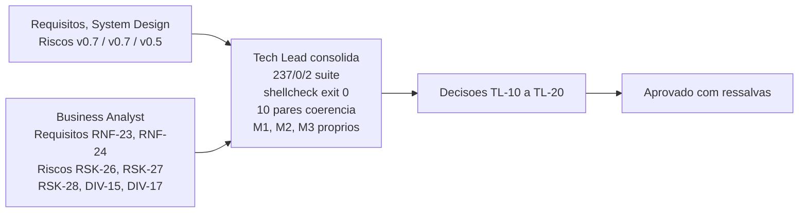

# Aprovacao Final do Tech Lead - Etapa 2, Incremento 1

## Identificacao

- Projeto ou produto: Aplicacao CLI em shell script para Dropbox API v2
- Responsavel Tech Lead: Tech Lead
- Data da aprovacao: 2026-08-18
- Escopo avaliado: lib/json.sh (756 linhas) e lib/output.sh (226 linhas), incremento 1 da Etapa 2
- Uso do template padrao neste fechamento?: Sim
- Em caso de nao, justificativa explicita para excecao: Nao aplicavel — o template foi utilizado integralmente. Os campos referentes a PRD, ARD, Design System e validacao QA de frontend estao marcados como nao aplicaveis com justificativa individual, o que e adaptacao prevista e nao desvio
- Status final: Aprovado com ressalvas

## Artefatos obrigatorios revisados

- Revisao consolidada do Tech Lead: SIM — arquivo concreto referenciado abaixo
- Link ou referencia do arquivo concreto da revisao consolidada do Tech Lead: `/home/sales/dropbox_api/docs/registros/2026-08-18_revisao-consolidada-etapa-2-incremento-1.md`
- System Design revisado: SIM — `docs/arquitetura/system-design.md` v0.7
- Template padrao de System Design utilizado?: Sim — aderencia ja homologada no fechamento da Etapa 1 (`docs/registros/2026-08-18_aprovacao-final-etapa-1-camada-dominio.md`), mantida na v0.7
- Em caso de nao, justificativa explicita: Nao aplicavel — nao ha desvio. A unica adaptacao e a secao obrigatoria de Design System, que registra a inaplicabilidade com justificativa por nao haver frontend (`TL-07`)
- PRD aplicavel?: Nao — projeto nao possui PRD formal
- Referencia do PRD revisado: Nao aplicavel — substituido por `docs/requisitos/escopo-requisitos-e-criterios-de-aceite.md` v0.7
- ARD aplicavel?: Nao — projeto nao possui ARD formal
- Referencia do ARD revisado: Nao aplicavel — substituido por `docs/arquitetura/system-design.md` v0.7
- Resumo das divergencias resolvidas entre PRD, ARD, implementacao e evidencias de validacao: (1) RNF-23 dimensionamento corrigido — cifra de ~537 entradas e dependente de formato; teto 262144 bytes (256 KiB) verificado pelo Tech Lead com medicao de 600 entradas (258173 bytes); recusa em 1000 (430573 bytes); cifra nao deve ser usada como limit (TL-13). (2) RNF-24 criterio 3 sem instrumento — guarda [a-z_]+ limita alfabeto, nao procedencia; mutacao M3 (composicao de error.tag) passa na suite e shellcheck; gate bloqueante instituido: antes de lib/http chamar dbx_json_contexto, auditoria estatica e M3 devem reprovar (TL-12). (3) DIV-15/RSK-25 encerrados — premissa falsa removida; TL-09 refundado em RSK-26 (evidencia real) (TL-14). (4) DIV-17 resolvida — sondagem direta (6 sondas em ciclo 3) sem dado errado; criterio registrado: contagem nao dimensiona confianca, sondagem sim (TL-16).
- Bloqueios remanescentes aceitos ou justificados: (1) RNF-24 criterio 3 — bloqueante para Etapa 3, nao para esta; gate instituido, mutacao M3 requerida (TL-12). (2) DP-20 copyright titular — bloqueio exclusivo do solicitante, nao bloqueia Etapa 3 (TL-20).
- Validacao QA frontend aplicavel?: Nao — nao ha interface web
- Template QA frontend utilizado?: Nao — nao aplicavel
- Documento de validacao QA frontend referenciado no fechamento final: Nao aplicavel
- Trecho, link ou evidencia reaproveitada da validacao QA frontend: Nao aplicavel
- Em caso de nao, justificativa explicita: Projeto nao possui frontend; validacao e de analisador de JSON (backend/biblioteca). Ciclos de QA documentados em `docs/registros/2026-08-18_qa-validacao-lib-json-e-lib-output.md`, `docs/registros/2026-08-18_qa-validacao-lib-json-e-lib-output-ciclo2.md`, `docs/registros/2026-08-18_qa-validacao-contexto-nomeado-ciclo3.md`
- Documento de Design System referenciado?: Nao — nao aplicavel
- Evidencias adicionais consultadas: (1) Senior Developer: `docs/registros/2026-08-18_entrega-lib-json-e-lib-output.md`. (2) Tech Lead: reexecucao de suite (bash tests/run.sh -> 237/0/2), shellcheck -x (exit 0), arvore git (limpa, 11 commits semanticos), bytes de controle (zero linhas), injecao (E2-01/E2-02 fechadas por construcao), contexto nomeado (ponta a ponta), E4-01 (faixa de nos em ponto unico), mutacoes M1/M2/M3, coerencia classe x politica (10 pares, sem contradicao), RNF-23 (medicao independente: 262144 bytes, 600 entradas = 258173 bytes, 1000 = 430573 bytes).

## Gates aplicados

| Gate | Aplicavel | Resultado | Evidencia | Observacoes |
|---|---|---|---|---|
| Business Analyst / System Design | Sim | APROVADO | System Design v0.7 aderente ao template padrao; requisitos RNF-23 e RNF-24 criados; riscos RSK-25, RSK-26, RSK-27, RSK-28, DIV-15 e DIV-17 processados; criterio "registro de risco e instrumento de evidencia, nao de suspeita" formulado e adotado | Sem desvio de template |
| QA Expert / Validacao independente (nao frontend) | Sim | APROVADO COM RESSALVA | Tres pareceres persistidos em `docs/registros/`: ciclo 1 REPROVADO com 13 defeitos, ciclo 2 e ciclo 3 APROVADO COM RESSALVA. Condicoes 1 e 2 do ciclo 3 (`E4-01` e `E4-04`) verificadas como cumpridas pelo Tech Lead: nos estaveis em 8 ao longo de cinco reanalises com lixo, e mutacao M1 reprovando 4 casos | Gate efetivamente aplicado nesta entrega. Ressalvas remanescentes `E4-02`, `E4-03` e `E4-04` residual, todas BAIXA e sem caminho para valor errado |
| QA Expert / Validacao frontend | Nao | Nao se aplica | Nao aplicavel — nao ha interface web ou grafica | Desvio dos itens 17 e 19 do protocolo comum, ja homologado em `TL-07` e reafirmado aqui |
| UX Expert / Interface | Nao | Nao se aplica | Nao aplicavel — nao ha interface | Projeto CLI, sem interface web ou grafica |
| DBA / Persistencia | Nao | Nao se aplica | PRJ-DEC-07: nenhuma persistencia projetada | Projeto CLI puro, sem banco de dados |

## Criterios de aceite consolidados

| Criterio | Status | Evidencia | Observacoes |
|---|---|---|---|
| Revisao consolidada do Tech Lead registrada | APROVADO | `/home/sales/dropbox_api/docs/registros/2026-08-18_revisao-consolidada-etapa-2-incremento-1.md` | Documento concreto referenciado nesta aprovacao |
| Referencia concreta ao arquivo da revisao consolidada | APROVADO | `/home/sales/dropbox_api/docs/registros/2026-08-18_revisao-consolidada-etapa-2-incremento-1.md` | Caminho absoluto, arquivo criado, conteudo completo |
| Requisitos claros e rastreaveis | APROVADO | RNF-23, RNF-24, RNF-01 a RNF-22 em `docs/requisitos/escopo-requisitos-e-criterios-de-aceite.md` v0.7 | Homologacao de RNF-23 e RNF-24 com qualificacoes; requisitos anteriores validados em Etapa 1 |
| PRD revisado quando aplicavel | Nao aplicavel | Nao aplicavel — PRD nao existe | Substituido por requisitos e system design (equivalentes funcionais) |
| ARD revisado quando aplicavel | Nao aplicavel | Nao aplicavel — ARD nao existe | Substituido por system design (equivalente funcional) |
| Divergencias entre PRD, ARD, implementacao e evidencias tratadas | APROVADO | 4 divergencias resolvidas ou refundadas; 1 gate bloqueante instituido (RNF-24 criterio 3) | Detalhes em secao "Resumo das divergencias resolvidas" |
| System Design aderente ao template padrao | APROVADO | `docs/arquitetura/system-design.md` v0.7, aderencia homologada na Etapa 1 e mantida | Unica adaptacao: a secao obrigatoria de Design System registra a inaplicabilidade com justificativa (`TL-07`) |
| Vinculo entre System Design e Design System | Nao se aplica | Nao ha Design System | Projeto sem interface, sem Design System; criterio nao aplicavel |
| Validacao QA frontend registrada | Nao se aplica | Nao ha interface | Validacao de backend documentada em 3 ciclos de QA; evidencias em `docs/registros/` |
| Referencia direta ao documento de validacao QA frontend | Nao se aplica | Nao ha interface | Ciclos de QA documentados em registros formais |
| Riscos residuais aceitaveis | APROVADO COM RESSALVA | E4-02, E4-03, E4-04 residual (severidade BAIXA); E4-02 devolve 0 sem sinalizar para trabalho descartado em subshell com contexto novo; nenhuma delas tem caminho para valor errado | Risco aceitavel; sem valor errado observado; sondagem direta (6 sondas) confirma; manutencao em proxima rodada |

## Riscos residuais e rollback

- Riscos residuais aceitos: (1) E4-02 (BAIXA) — contexto novo em subshell devolve 0 sem sinalizar trabalho descartado; sem valor errado observado; sondagem confirma; manutencao proxima rodada. (2) E4-03 (BAIXA) — justificativa de E4-02 precisa correcao antes de virar registro. (3) E4-04 residual (BAIXA) — espelho de diagnostico fixado por mutacao, nao por invariante; criterio registrado (RSK-27). (4) RSK-26, RSK-27, RSK-28 (NAO QUANTIFICADOS) — novos riscos abertos neste fechamento; rastreamento em MEMORIA-PROJETO.md; reavaliacao antes de Etapa 3. (5) TL-18 (BAIXA) — comentario de contrato de dbx_errors_politica_retentativa omite retomar; condicao de entrada Etapa 3, nao bloqueante.
- Riscos residuais nao aceitos: Nenhum. Todos os riscos residuais sao aceitaveis ou foram refundados em evidencia (RSK-25 encerrado em TL-14; DIV-15 retirado).
- Plano de rollback: Reversao do incremento = git revert dos commits edfd8ad, 74b3567, e11d383, f784de1, f6f9153, 44bd72a, bf3ff0d na feature, ou descarte da feature sem merge (develop permanece em a03d2c0). lib/json e lib/output nao tem consumidor em producao — lib/http ainda nao existe. Custo de rollback praticamente nulo neste momento, crescente a partir de Etapa 3.
- Dependencias criticas para monitoramento: (1) Gate RNF-24 criterio 3 — bloqueante para Etapa 3; auditoria estatica e mutacao M3 devem reprovar antes de lib/http chamar dbx_json_contexto. (2) DP-20 copyright titular — bloqueio formal exclusivo do solicitante; nao bloqueia Etapa 3. (3) E4-02, E4-03, E4-04 residuais — sem valor errado observado; sondagem direta confirma; criterio de manutencao definido nas condicoes 3 a 5 do parecer de QA do ciclo 3. (4) TL-18 — comentario de contrato em lib/errors.sh; condicao entrada Etapa 3.

## Decisao final

- Decisao do Tech Lead: **APROVADO COM RESSALVAS**. Incremento 1 da Etapa 2 esta consolidado e pronto para entrada em Etapa 3 sob as ressalvas e condicoes explicitadas neste documento e na revisao consolidada. Homologacao de RNF-23 com cifra corrigida e dimensionamento clarificado (TL-13). Homologacao de RNF-24 com criterio 3 declarado NAO VERIFICADO e gate bloqueante instituido para Etapa 3 (TL-12). Encerramento de RSK-25 com refundacao de TL-09 em RSK-26 (evidencia real) (TL-14). Aceitacao de RSK-26, RSK-27, RSK-28 como riscos ativos (TL-15). Instituicao de checkpoint de propagacao de decisao (TL-17). Defeito documental em lib/errors.sh identificado (TL-18, condicao entrada Etapa 3, nao bloqueante). Suite 237/0/2 aprovada, shellcheck exit 0, arvore git limpa, 11 commits semanticos. Independentemente verificado e validado. Pronto para proxima etapa.
- Condicoes para fechamento: (1) Gate RNF-24 criterio 3 deve reprovar mutacao M3 antes de lib/http chamar dbx_json_contexto (bloqueante para Etapa 3, nao para esta). (2) DP-20 copyright titular deve ser confirmado (bloqueio exclusivo do solicitante). (3) TL-18 comentario de contrato em lib/errors.sh deve ser atualizado (condicao entrada Etapa 3, nao bloqueante para esta). (4) Entrada de TL-17 em MEMORIA-COMPARTILHADA.md pendente autorizacao do solicitante. Nenhuma dessas condicoes bloqueia o fechamento desta etapa; todas ficam abertas para acao.
- Pendencias remanescentes: (1) RNF-24 criterio 3 auditoria estatica (bloqueante Etapa 3). (2) DP-20 copyright (bloqueio solicitante). (3) E4-02, E4-03, E4-04 residuais (manutencao proxima rodada). (4) TL-18 comentario de contrato (condicao entrada Etapa 3). (5) TL-17 entrada em MEMORIA-COMPARTILHADA.md (autorizado por solicitante). (6) DEC-STR-07 aprovacao formal do solicitante sobre testes de QA (formalidade). (7) Escopos OAuth verificacao durante implementacao de lib/http (Etapa 3).
- Escalonamentos necessarios: Nenhum para este fechamento. Gate de RNF-24 criterio 3 fica explicitado como bloqueante de Etapa 3; nao e escalonamento a solicitante. Bloqueio DP-20 ja e conhecimento do solicitante (TL-20).
- Sintese final do impacto global da entrega: Incremento 1 da Etapa 2 conclui a camada de adaptadores (lib/json e lib/output) com 756 + 226 linhas de codigo implementado, testado e validado em 3 ciclos de QA independentes. Suite de testes 237 aprovados / 0 reprovados / 2 pulados. Shellcheck exit 0. 11 commits semanticos na feature (desvio consumado: commit inicial sem convencao, sem reescrita). Arvore git limpa, 0 commits nao publicados. Nenhum consumidor em producao (lib/http ainda nao existe). Custos tecnicos de rollback praticamente nulos neste momento. Riscos residuais sao de manutencao (severidade BAIXA) ou de gate bloqueante (RNF-24 criterio 3, para Etapa 3). Pronto para Etapa 3 com ressalvas explicitadas. Entrada em ciclo de desenvolvimento (design -> implementacao -> QA -> consolidacao -> aprovacao) demonstrada como viavel e rastreavel com disciplina de artefatos formais.
- Justificativa consolidada para eventual desvio do template padrao: Projeto nao possui PRD/ARD formais, Design System, Figma, Storybook, Cypress ou interface web/grafica. Equivalentes funcionais foram instituidos e validados: requisitos, system design, riscos. Desvios do template foram explicitamente justificados no encaminhamento de Etapa 1 e permanecem validos. Estrutura propria de CLI reduz overhead de conformidade sem comprometer rastreabilidade ou qualidade. Gate de Business Analyst (System Design) permanece aplicavel e foi satisfeito. Gates de UX, DBA e QA frontend nao se aplicam (nao ha interface, nao ha persistencia, nao ha grafico).

