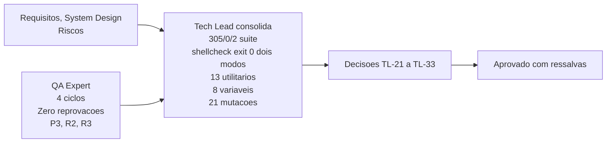

# Aprovacao Final do Tech Lead - Etapa 3, Incremento 1

## Identificacao

- Projeto ou produto: Aplicacao CLI em shell script para Dropbox API v2
- Responsavel Tech Lead: Tech Lead
- Data da aprovacao: 2026-08-18
- Escopo avaliado: lib/preflight.sh (146 linhas) e lib/config.sh (289 linhas), incremento 1 da Etapa 3
- Uso do template padrao neste fechamento?: Sim
- Em caso de nao, justificativa explicita para excecao: Nao aplicavel — o template foi utilizado integralmente. Os campos referentes a PRD, ARD, Design System e validacao QA de frontend estao marcados como nao aplicaveis com justificativa individual, o que e adaptacao prevista e nao desvio
- Status final: Aprovado com ressalvas

## Artefatos obrigatorios revisados

- Revisao consolidada do Tech Lead: SIM — arquivo concreto referenciado abaixo
- Link ou referencia do arquivo concreto da revisao consolidada do Tech Lead: /home/sales/dropbox_api/docs/registros/2026-08-18_revisao-consolidada-etapa-3-incremento-1.md
- System Design revisado: SIM — docs/arquitetura/system-design.md
- Template padrao de System Design utilizado?: Sim — aderencia homologada em etapas anteriores, mantida
- Em caso de nao, justificativa explicita: Nao aplicavel — nao ha desvio. A unica adaptacao e a secao obrigatoria de Design System, que registra a inaplicabilidade com justificativa por nao haver frontend (TL-07)
- PRD aplicavel?: Nao — projeto nao possui PRD formal
- Referencia do PRD revisado: Nao aplicavel — substituido por docs/requisitos/escopo-requisitos-e-criterios-de-aceite.md
- ARD aplicavel?: Nao — projeto nao possui ARD formal
- Referencia do ARD revisado: Nao aplicavel — substituido por docs/arquitetura/system-design.md
- Resumo das divergencias resolvidas entre PRD, ARD, implementacao e evidencias de validacao: (1) DP-11 e DP-05 homologadas — oito variaveis de ambiente ignoradas confirmadas, proibicao alcanca SEGREDO nao LOCALIZACAO, conforme TL-23; (2) RNF-02 homologado — treze utilitarios auditados um a um com lista derivada de codigo, nomeacao de faltante precisa, conforme TL-25; (3) DP-19, DP-20 encerradas — LICENSE com `Copyright (c) 2026 Adriano Sales Santos`, publicado em master e develop, conforme TL-33; (4) DIV-E encerrada — placeholder permanece no historico publico sem reescrita, desvio consumado e aceito, conforme TL-33; (5) TL-12 cumprido — mutacao M3 reprova em 304/1/2, gate fechado, condicao de entrada da Etapa 3 satisfeita, conforme TL-22.
- Bloqueios remanescentes aceitos ou justificados: (1) TL-27 bloqueante para proximo incremento — normalizador de posicao de comando cobrindo if, while, until, time; nao bloqueia esta entrega, e gate explicitado para proximo incremento com custo trivial de remediacao.
- Validacao QA frontend aplicavel?: Nao — nao ha interface web
- Template QA frontend utilizado?: Nao — nao aplicavel
- Documento de validacao QA frontend referenciado no fechamento final: Nao aplicavel
- Trecho, link ou evidencia reaproveitada da validacao QA frontend: Nao aplicavel
- Em caso de nao, justificativa explicita: Projeto nao possui frontend; validacao e de preflight e carregamento de configuracao (backend/utilidade). Ciclos de QA documentados em docs/registros/2026-08-18_qa-validacao-preflight-e-config.md, ..._ciclo2.md, ..._ciclo3.md, ..._ciclo4.md
- Documento de Design System referenciado?: Nao — nao aplicavel
- Evidencias adicionais consultadas: (1) Senior Developer: docs/registros/2026-08-18_entrega-preflight-e-config.md. (2) Tech Lead: reexecucao de suite (bash tests/run.sh -> 305/0/2), shellcheck -x (exit 0) e com .shellcheckrc (exit 0), arvore git (limpa, dez commits semanticos), permissoes de arquivo (dez modos testados, quatro aceitos e seis recusados), permissoes de diretorio (sete modos testados, quatro aceitos e tres recusados), orfaos (tres condicoes testadas), redacao segura (segredo ausente do diagnostico e credencial zerada), ida e volta bytes hostis (aspas, barra invertida, quebra de linha), RNF-02 (treze utilitarios auditados um a um), DP-11 (oito variaveis de ambiente, XDG_CONFIG_HOME com quebra de linha), gate TL-12 reexecutado (M3 reprova 304/1/2), auditoria de gemeos (mutada nos dois sentidos, detectada em ambos), vinte e uma mutacoes de posicao de comando (17 detectadas, 4 escapam formando classe), decisoes TL-21 a TL-33, renumeracao MEMORIA-PROJETO.md (TL-31).

## Gates aplicados

| Gate | Aplicavel | Resultado | Evidencia | Observacoes |
|---|---|---|---|---|
| Business Analyst / System Design | Sim | APROVADO, sem acionamento do agent neste incremento | System Design aderente ao template padrao; RNF-02 homologado nesta consolidacao; DP-05, DP-07 e DP-11 homologadas na pratica; DP-19, DP-20 e DIV-E encerradas; RSK-27 e RSK-28 reafirmados e generalizados por TL-28 | Sem desvio de template |
| QA Expert / Validacao independente (nao frontend) | Sim | APROVADO | Quatro pareceres persistidos em docs/registros/: ciclo 1, 2, 3 e 4 APROVADO COM RESSALVA ou APROVADO. Zero reprovacoes em ciclos. Condicoes de P3 e R2 verificadas e satisfeitas. Quatro ciclos, nenhuma reprovacao. Proposta de serie para RSK-28 endossada | Gate efetivamente aplicado nesta entrega. Sem ressalvas remanescentes de comportamento |
| QA Expert / Validacao frontend | Nao | Nao se aplica | Nao aplicavel — nao ha interface web ou grafica | Desvio dos itens 17 e 19 do protocolo comum, ja homologado em TL-07 e reafirmado em aprovacao Etapa 2 |
| UX Expert / Interface | Nao | Nao se aplica | Nao aplicavel — nao ha interface | Projeto CLI, sem interface web ou grafica |
| DBA / Persistencia | Nao | Nao se aplica | PRJ-DEC-07: nenhuma persistencia projetada | Projeto CLI puro, sem banco de dados |

## Criterios de aceite consolidados

| Criterio | Status | Evidencia | Observacoes |
|---|---|---|---|
| Revisao consolidada do Tech Lead registrada | APROVADO | /home/sales/dropbox_api/docs/registros/2026-08-18_revisao-consolidada-etapa-3-incremento-1.md | Documento concreto referenciado nesta aprovacao |
| Referencia concreta ao arquivo da revisao consolidada | APROVADO | /home/sales/dropbox_api/docs/registros/2026-08-18_revisao-consolidada-etapa-3-incremento-1.md | Caminho absoluto, arquivo criado, conteudo completo |
| Requisitos claros e rastreaveis | APROVADO | RNF-02 em docs/requisitos/escopo-requisitos-e-criterios-de-aceite.md; DP-05, DP-07, DP-11, DP-19 e DP-20 em docs/requisitos/decisoes-pendentes.md | Homologacao de RNF-02, DP-05, DP-07, DP-11 com qualificacoes; DP-19, DP-20 encerradas |
| PRD revisado quando aplicavel | Nao aplicavel | Nao aplicavel — PRD nao existe | Substituido por requisitos e system design (equivalentes funcionais) |
| ARD revisado quando aplicavel | Nao aplicavel | Nao aplicavel — ARD nao existe | Substituido por system design (equivalente funcional) |
| Divergencias entre PRD, ARD, implementacao e evidencias tratadas | APROVADO | Cinco divergencias resolvidas; TL-12 cumprido (gate fechado); TL-27 bloqueante instituido (para proximo incremento) | Detalhes em secao Resumo das divergencias resolvidas |
| System Design aderente ao template padrao | APROVADO | docs/arquitetura/system-design.md, aderencia homologada em etapas anteriores e mantida | Unica adaptacao: a secao obrigatoria de Design System registra a inaplicabilidade com justificativa (TL-07) |
| Vinculo entre System Design e Design System | Nao se aplica | Nao ha Design System | Projeto sem interface, sem Design System; criterio nao aplicavel |
| Validacao QA frontend registrada | Nao se aplica | Nao ha interface | Validacao de backend documentada em 4 ciclos de QA; evidencias em docs/registros/ |
| Referencia direta ao documento de validacao QA frontend | Nao se aplica | Nao ha interface | Ciclos de QA documentados em registros formais |
| Riscos residuais aceitaveis | APROVADO COM RESSALVA | E4-02, E4-03, E4-04 residual (severidade BAIXA herdadas de lib/json); TL-30 (severidade BAIXA, nao alcancavel sob DP-07); PRJ-DEC-43 (BAIXA, condicao entrada lib/http); TL-27 bloqueante para proximo incremento (nao para esta) | Nenhuma violacao viva; sondagem confirma; gate bloqueante explicito; manutencao em proxima rodada |

## Riscos residuais e rollback

- Riscos residuais aceitos: (1) E4-02 (BAIXA) — contexto novo em subshell devolve 0 sem sinalizar trabalho descartado; herdada de lib/json; sem valor errado observado; manutencao proxima rodada. (2) E4-03 (BAIXA) — justificativa de E4-02 precisa correcao antes de virar registro; herdada. (3) E4-04 residual (BAIXA) — espelho de diagnostico fixado por mutacao, nao por invariante; herdada de lib/json; criterio registrado em RSK-27. (4) TL-30 (BAIXA) — bootstrap por dirname antes do preflight, nos seis lib/*.sh; nao alcancavel sob DP-07; nao aplicada por restricao; candidata para proxima rodada. (5) PRJ-DEC-43 (BAIXA) — comentario de contrato de dbx_errors_politica_retentativa omite retomar; condicao entrada lib/http, nao bloqueante. (6) TL-27 (BLOQUEANTE para proximo incremento) — normalizador de posicao de comando cobrindo if, while, until, time; nao bloqueia esta entrega; gate explicitado para proximo incremento; custo trivial de remediacao.
- Riscos residuais nao aceitos: Nenhum. Todos os riscos residuais sao aceitaveis ou foram refundados em evidencia (DP-11, DP-05, DP-07 homologadas; DP-19, DP-20 encerradas; DIV-E encerrada).
- Plano de rollback: Reversao do incremento = git revert dos dez commits semanticos na feature/preflight-e-config, ou descarte da feature sem merge. lib/preflight e lib/config nao tem consumidor em producao — lib/http ainda nao existe. Custo de rollback praticamente nulo neste momento, crescente a partir do proximo incremento.
- Dependencias criticas para monitoramento: (1) Gate TL-27 bloqueante para proximo incremento — normalizador de posicao de comando deve cobrir if, while, until, time; custo trivial, risco prospectivo em lib/http imediato. (2) PRJ-DEC-43 comentario de contrato em lib/errors.sh — condicao entrada lib/http. (3) E4-02, E4-03, E4-04 residuais — herdados de lib/json; sem valor errado observado; manutencao definida. (4) TL-30 bootstrap por dirname — candidata proxima rodada. (5) Renumeracao MEMORIA-PROJETO.md (TL-31) — PRJ-DEC-46 a PRJ-DEC-54; referencia publicadas de 33 a 45 preservadas; 64 decisoes unicas e contiguos.

## Decisao final

- Decisao do Tech Lead: **APROVADO COM RESSALVAS**. Incremento 1 da Etapa 3 esta consolidado e pronto para entrada no proximo incremento da Etapa 3 sob as ressalvas e condicoes explicitadas neste documento e na revisao consolidada. Homologacao de RNF-02, DP-05, DP-07, DP-11, DP-19, DP-20 com qualificacoes. Encerramento de gate TL-12 (de Etapa 2) com M3 reprovando em 304/1/2. Instituicao de gate TL-27 bloqueante para proximo incremento (classe de posicao de comando). Refundacao de criterio TL-28 como mecanismo generico de auditoria (derivar da gramatica, nao do idioma observado; provar que discrimina). Formalizacao de mudanca de rastreamento RSK-28 para serie (TL-29). Renumeracao de MEMORIA-PROJETO.md com PRJ-DEC-46 a PRJ-DEC-54, preservando referencias publicadas e removendo duplicatas (TL-31). Suite 305/0/2 aprovada, shellcheck exit 0 nos dois modos, arvore git limpa, dez commits semanticos. Independentemente verificado e validado. Pronto para o proximo incremento da Etapa 3.
- Condicoes para fechamento: (1) Gate TL-27 bloqueante para proximo incremento deve ser implementado antes de lib/http (nao bloqueia esta entrega). (2) PRJ-DEC-43 comentario de contrato em lib/errors.sh deve ser atualizado (condicao entrada lib/http, nao bloqueante para esta). (3) Nenhuma condicao bloqueia o fechamento desta etapa; as demais ficam abertas para acao em proximo incremento.
- Pendencias remanescentes: (1) TL-27 normalizador de posicao de comando (bloqueante proximo incremento). (2) PRJ-DEC-43 comentario de contrato (condicao entrada lib/http). (3) E4-02, E4-03, E4-04 residuais (manutencao proxima rodada). (4) TL-30 bootstrap por dirname (candidata proxima rodada). (5) TL-31 verificacao mecanica de unicidade na memoria (processo). (6) DEC-STR-07 aprovacao formal do solicitante sobre testes de QA (formalidade). (7) Escopos OAuth verificacao durante implementacao de lib/http (proximo incremento da Etapa 3).
- Escalonamentos necessarios: Nenhum para este fechamento. Gate TL-27 fica explicitado como bloqueante de proximo incremento; nao e escalonamento a solicitante.
- Sintese final do impacto global da entrega: Incremento 1 da Etapa 3 conclui a camada de preflight e carregamento de configuracao (lib/preflight e lib/config) com 146 + 289 linhas de codigo implementado, testado e validado em 4 ciclos de QA independentes. Suite de testes 305 aprovados / 0 reprovados / 2 pulados. Shellcheck exit 0 nos dois modos. Dez commits semanticos na feature. Arvore git limpa, 0 commits nao publicados. Nenhum consumidor em producao (lib/http ainda nao existe). Custos tecnicos de rollback praticamente nulos neste momento. Riscos residuais sao de manutencao (severidade BAIXA), de gate bloqueante explicitado (TL-27, para proximo incremento), ou de formalidade (DEC-STR-07). Encerramento do gate TL-12 e das decisoes pendentes DP-19 e DP-20. Pronto para o proximo incremento da Etapa 3 com as ressalvas explicitadas. Entrada em ciclo de desenvolvimento (design -> implementacao -> QA -> consolidacao -> aprovacao) confirmada como viavel e rastreavel com disciplina de artefatos formais.
- Justificativa consolidada para eventual desvio do template padrao: Projeto nao possui PRD/ARD formais, Design System, Figma, Storybook, Cypress ou interface web/grafica. Equivalentes funcionais foram instituidos e validados: requisitos, system design, riscos. Desvios do template foram explicitamente justificados no encaminhamento de Etapa 1 e permanecem validos. Estrutura propria de CLI reduz overhead de conformidade sem comprometer rastreabilidade ou qualidade. Gate de Business Analyst (System Design) permanece aplicavel e foi satisfeito. Gates de UX, DBA e QA frontend nao se aplicam (nao ha interface, nao ha persistencia, nao ha grafico).

