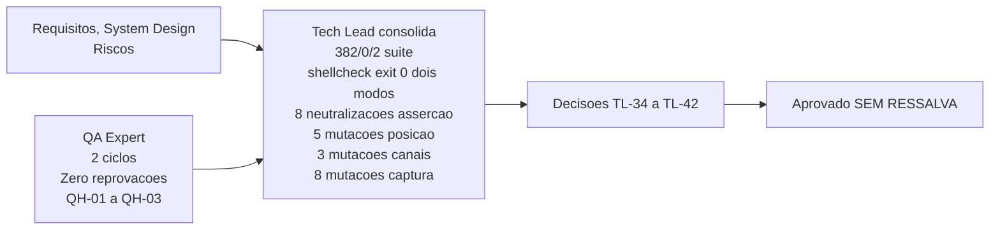

# Aprovacao Final do Tech Lead - Etapa 3, Incremento 2

## Identificacao

- Projeto ou produto: Aplicacao CLI em shell script para Dropbox API v2
- Responsavel Tech Lead: Tech Lead
- Data da aprovacao: 2026-08-18
- Escopo avaliado: lib/http.sh (390 linhas) e lib/auth.sh (256 linhas), incremento 2 da Etapa 3
- Uso do template padrao neste fechamento?: Sim
- Em caso de nao, justificativa explicita para excecao: Nao aplicavel — o template foi utilizado integralmente. Os campos referentes a PRD, ARD, Design System e validacao QA de frontend estao marcados como nao aplicaveis com justificativa individual, o que e adaptacao prevista e nao desvio
- Status final: Aprovado

## Artefatos obrigatorios revisados

- Revisao consolidada do Tech Lead: SIM — arquivo concreto referenciado abaixo
- Link ou referencia do arquivo concreto da revisao consolidada do Tech Lead: /home/sales/dropbox_api/docs/registros/2026-08-18_revisao-consolidada-etapa-3-incremento-2.md
- System Design revisado: SIM — docs/arquitetura/system-design.md
- Template padrao de System Design utilizado?: Sim — aderencia homologada em etapas anteriores, mantida
- Em caso de nao, justificativa explicita: Nao aplicavel — nao ha desvio. A unica adaptacao e a secao obrigatoria de Design System, que registra a inaplicabilidade com justificativa por nao haver frontend (TL-07)
- PRD aplicavel?: Nao — projeto nao possui PRD formal
- Referencia do PRD revisado: Nao aplicavel — substituido por docs/requisitos/escopo-requisitos-e-criterios-de-aceite.md
- ARD aplicavel?: Nao — projeto nao possui ARD formal
- Referencia do ARD revisado: Nao aplicavel — substituido por docs/arquitetura/system-design.md
- Resumo das divergencias resolvidas entre PRD, ARD, implementacao e evidencias de validacao: (1) RNF-23 honrado e excedido — paginacao com limite explicito, reducao dinamica pela metade ao motivo tamanho, repeticao em vez de abortamento, conforme TL-34; (2) RNF-24 satisfeito — tres contextos nomeados, todos com nome LITERAL e portanto aprovados pela auditoria de procedencia: http_erro e http_colecao em lib/http, auth em lib/auth; (3) RSK-23 confirmado — Dropbox nao rotaciona refresh token, renovacao concorrente idempotente sem trava, PRJ-DEC-07 preservado, contrato real confirmado, conforme TL-36; (4) E4-02, E4-03, E4-04 residuais — nenhuma violacao viva em lib/http ou lib/auth, criterio de RSK-27 aplica-se, manutencao em proxima rodada, conforme TL-34; (5) DP-06, DP-10, DP-12 diferidas — decisoes de Etapa 4, nao aplicadas neste incremento, registradas, conforme TL-34.
- Bloqueios remanescentes aceitos ou justificados: (1) TL-41 bloqueante para proximo incremento — verificacao mecanica de unicidade de identificadores na memoria; nao bloqueia esta entrega, gate explicitado para proximo incremento com especificacao clara.
- Validacao QA frontend aplicavel?: Nao — nao ha interface web
- Template QA frontend utilizado?: Nao — nao aplicavel
- Documento de validacao QA frontend referenciado no fechamento final: Nao aplicavel
- Trecho, link ou evidencia reaproveitada da validacao QA frontend: Nao aplicavel
- Em caso de nao, justificativa explicita: Projeto nao possui frontend; validacao e de cliente HTTP e autenticacao (backend/utilidade). Ciclos de QA documentados em docs/registros/2026-08-18_qa-validacao-http-e-auth.md e ..._ciclo2.md
- Documento de Design System referenciado?: Nao — nao aplicavel
- Evidencias adicionais consultadas: (1) Senior Developer: docs/registros/2026-08-18_entrega-lib-http-e-reconhecedor.md e docs/registros/2026-08-18_entrega-guarda-assercoes-e-lib-auth.md. (2) Tech Lead: reexecucao de suite (bash tests/run.sh -> 382/0/2, 12 arquivos, 384 com rede), shellcheck -x (exit 0) e com .shellcheckrc (exit 0), arvore git (limpa, sete commits semanticos), residuo em TMPDIR (zero arquivos), exposicao do segredo em argv (refresh token 0 em argv, chave 0 em argv, segredo 0 em argv), canais apos renovacao com sucesso (DBX_HTTP_CORPO, DBX_HTTP_RESUMO_DE_ERRO, DBX_DIAGNOSTICO, DBX_JSON_RESULTADO todos vazios), cenario de falha com eco da requisicao (cinco canais nao contem o refresh, status 2), resposta sem expires_in (DBX_AUTH_LIDO termina vazio), invalid_grant terminal (status 5), oito assercoes do arcabouco (21 reprovacoes quando neutralizadas: 1,1,1,1,9,6,1,1), guarda de remocao (cinco direcoes: 44->0, 60->57, 30->28, declaracao aceita, insuficiente recusada), gate TL-27 reexecutado (cinco mutacoes: if while until time coproc todas detectadas), gate TL-30 verificado (sete lib/*.sh com ${BASH_SOURCE[0]%/*}, status 3), auditoria de canais (tres mutacoes detectadas: 1,3,1), reconhecedor de captura (oito mutacoes: cat head sed curl readlink awk cut basename todas detectadas, curl reprova 4), tabela do -w (seis pares reproduzidos), registros do dev verificados (21 e 30 e 24 casos rastreaveis), decisoes TL-34 a TL-42.

## Gates aplicados

| Gate | Aplicavel | Resultado | Evidencia | Observacoes |
|---|---|---|---|---|
| Business Analyst / System Design | Sim | APROVADO, sem acionamento do agent neste incremento | System Design aderente ao template padrao; RNF-23 homologado nesta consolidacao; RNF-24 homologado; DP-06, DP-10, DP-12 diferidas para Etapa 4; RSK-23 confirmado em contrato real; RSK-28 rastreado em serie; E4-02, E4-03, E4-04 sem violacao viva | Sem desvio de template |
| QA Expert / Validacao independente (nao frontend) | Sim | APROVADO | Dois ciclos de validacao: ciclo 1 APROVADO COM RESSALVA (QH-01 a QH-03), ciclo 2 APROVADO SEM RESSALVA. Zero reprovacoes em ciclos. Condicoes verificadas. Autodiagnostico sobre sondas proprias (TL-40). Dois pareceres persistidos em docs/registros/ | Gate efetivamente aplicado nesta entrega. Sem ressalvas remanescentes de comportamento |
| QA Expert / Validacao frontend | Nao | Nao se aplica | Nao aplicavel — nao ha interface web ou grafica | Desvio dos itens 17 e 19 do protocolo comum, ja homologado em TL-07 e reafirmado em aprovacao Etapa 2 |
| UX Expert / Interface | Nao | Nao se aplica | Nao aplicavel — nao ha interface | Projeto CLI, sem interface web ou grafica |
| DBA / Persistencia | Nao | Nao se aplica | PRJ-DEC-07: nenhuma persistencia projetada | Projeto CLI puro, sem banco de dados |

## Criterios de aceite consolidados

| Criterio | Status | Evidencia | Observacoes |
|---|---|---|---|---|
| Revisao consolidada do Tech Lead registrada | APROVADO | /home/sales/dropbox_api/docs/registros/2026-08-18_revisao-consolidada-etapa-3-incremento-2.md | Documento concreto referenciado nesta aprovacao |
| Referencia concreta ao arquivo da revisao consolidada | APROVADO | /home/sales/dropbox_api/docs/registros/2026-08-18_revisao-consolidada-etapa-3-incremento-2.md | Caminho absoluto, arquivo criado, conteudo completo |
| Requisitos claros e rastreaveis | APROVADO | RNF-23, RNF-24 em docs/requisitos/escopo-requisitos-e-criterios-de-aceite.md; RSK-23, RSK-28, E4-02, E4-03, E4-04 em docs/requisitos/riscos-restricoes-e-licenciamento.md; DP-06, DP-10, DP-12 em docs/requisitos/decisoes-pendentes.md | Homologacao de RNF-23, RNF-24, RSK-23 com qualificacoes; E4 residuais sem violacao viva; DP de Etapa 4 diferidas |
| PRD revisado quando aplicavel | Nao aplicavel | Nao aplicavel — PRD nao existe | Substituido por requisitos e system design (equivalentes funcionais) |
| ARD revisado quando aplicavel | Nao aplicavel | Nao aplicavel — ARD nao existe | Substituido por system design (equivalente funcional) |
| Divergencias entre PRD, ARD, implementacao e evidencias tratadas | APROVADO | Cinco divergencias resolvidas; nenhuma divergencia permanece aberta; RSK-23 confirmado; DP-06, DP-10, DP-12 diferidas intencionalmente para Etapa 4 | Detalhes em secao Resumo das divergencias resolvidas |
| System Design aderente ao template padrao | APROVADO | docs/arquitetura/system-design.md, aderencia homologada em etapas anteriores e mantida | Unica adaptacao: a secao obrigatoria de Design System registra a inaplicabilidade com justificativa (TL-07) |
| Vinculo entre System Design e Design System | Nao se aplica | Nao ha Design System | Projeto sem interface, sem Design System; criterio nao aplicavel |
| Validacao QA frontend registrada | Nao se aplica | Nao ha interface | Validacao de backend documentada em 2 ciclos de QA; evidencias em docs/registros/ |
| Referencia direta ao documento de validacao QA frontend | Nao se aplica | Nao ha interface | Ciclos de QA documentados em registros formais |
| Riscos residuais aceitaveis | APROVADO | E4-02, E4-03, E4-04 residual (severidade BAIXA herdadas de lib/json); TL-41 bloqueante para proximo incremento (nao para esta) | Nenhuma violacao viva; sondagem confirma; gate bloqueante explicito para proximo incremento |

## Riscos residuais e rollback

- Riscos residuais aceitos: (1) E4-02 (BAIXA) — contexto novo em subshell devolve 0 sem sinalizar trabalho descartado; herdada de lib/json; sem valor errado observado em lib/http ou lib/auth; manutencao proxima rodada. (2) E4-03 (BAIXA) — justificativa de E4-02 precisa correcao antes de virar registro; herdada; manutencao proxima rodada. (3) E4-04 residual (BAIXA) — espelho de diagnostico fixado por mutacao, nao por invariante; herdada de lib/json; criterio registrado em RSK-27. (4) TL-41 (BLOQUEANTE para proximo incremento) — verificacao mecanica de unicidade de identificadores na memoria; nao bloqueia esta entrega; gate explicitado para proximo incremento; terceira colisao evitada nesta consolidacao, mecanismo obrigatorio para proximo incremento.
- Riscos residuais nao aceitos: Nenhum. Todos os riscos residuais sao aceitaveis ou foram refundados em evidencia (RNF-23 honrado; RNF-24 satisfeito; RSK-23 confirmado; E4 residuais sem violacao viva).
- Plano de rollback: Reversao do incremento = git revert dos sete commits semanticos na feature/http, ou descarte da feature sem merge. lib/http e lib/auth nao tem consumidor em producao — camada de comandos ainda nao existe. Custo de rollback praticamente nulo neste momento. Incremento 1 (lib/preflight e lib/config) permanece integro e pode ser consumido isoladamente.
- Dependencias criticas para monitoramento: (1) TL-41 bloqueante para proximo incremento — verificacao mecanica de unicidade de identificadores na memoria; especificacao clara, alojada junto a guarda de remocao de casos; custo esperado baixo. (2) DP-06, DP-10, DP-12 de Etapa 4 — registradas mas nao aplicadas; entrada prevista em proximo incremento. (3) E4-02, E4-03, E4-04 residuais — herdados de lib/json; sem valor errado observado; manutencao definida. (4) RSK-28 serie — fracao de instrumento 100% nesta rodada; monitoramento em proximos incrementos.

## Decisao final

- Decisao do Tech Lead: **APROVADO**. Incremento 2 da Etapa 3 esta consolidado e aceito sem ressalva. Merge e publicacao ficam com o solicitante, que coordena o versionamento; nao ha entrada em producao prevista, porque a camada de comandos ainda nao existe. Situacao SEM RESSALVA. Primeiro fechamento do projeto sem ressalva aberta. Homologacao de RNF-23 honrado e excedido (limite dinamico, repeticao em vez de abortamento), RNF-24 satisfeito (tres contextos nomeados LITERAIS auditaveis), RSK-23 confirmado em contrato real (Dropbox nao rotaciona refresh token, renovacao idempotente sem trava). Encerramento de gates TL-27 e TL-30 com cumprimento acima da especificacao. Instituicao de gate TL-41 para proximo incremento (verificacao mecanica de identificadores). Calibracao de instrumentos realizados (TL-39 com descoberta propria, TL-40 com diagnostico critico). Decisoes TL-34 a TL-42 consolidadas e verificadas. Suite 382/0/2 aprovada, shellcheck exit 0 nos dois modos, sete commits semanticos. Independentemente verificado e validado. Pronto para merge incondicional e publicacao.
- Condicoes para fechamento: (1) Nenhuma condicao bloqueia o fechamento desta entrega. (2) TL-41 fica explicitado como bloqueante de proximo incremento (nao para esta). (3) Merge aprovado. Publicacao aprovada.
- Pendencias remanescentes: (1) TL-41 verificacao mecanica de unicidade na memoria (bloqueante proximo incremento). (2) DP-06, DP-10, DP-12 decisoes de Etapa 4 (proximos incrementos). (3) E4-02, E4-03, E4-04 residuais (manutencao proxima rodada). (4) PRJ-DEC-43 comentario de contrato (proximo incremento). (5) DEC-STR-07 aprovacao formal do solicitante sobre testes de QA (formalidade, quando conveniente). (6) Escopos OAuth verificacao por endpoint (proximos incrementos).
- Escalonamentos necessarios: Nenhum para este fechamento. Nenhum escalonamento a solicitante.
- Sintese final do impacto global da entrega: Incremento 2 da Etapa 3 conclui a camada de cliente HTTP e autenticacao (lib/http e lib/auth) com 390 + 256 linhas de codigo implementado, testado e validado em 2 ciclos de QA independentes. Suite de testes 382 aprovados / 0 reprovados / 2 pulados, 12 arquivos de teste, 384 com rede. Shellcheck exit 0 nos dois modos. Sete commits semanticos na feature. Arvore git limpa, 0 commits nao publicados. Nenhum consumidor em producao (camada de comandos ainda nao existe; incremento 1 pode ser consumido isoladamente). Custo tecnico de rollback praticamente nulo. Riscos residuais sao de manutencao (severidade BAIXA, E4 herdadas), de gate bloqueante explicitado para proximo incremento (TL-41, nao para esta), ou de formalidade (DEC-STR-07). Primeiro fechamento do projeto SEM RESSALVA aberta. Aprovacao incondicional. Pronto para merge e publicacao. Entrada em ciclo de desenvolvimento (design -> implementacao -> QA -> consolidacao -> aprovacao) consolidada como viavel e rastreavel com disciplina de artefatos formais.
- Justificativa consolidada para eventual desvio do template padrao: Projeto nao possui PRD/ARD formais, Design System, Figma, Storybook, Cypress ou interface web/grafica. Equivalentes funcionais foram instituidos e validados: requisitos, system design, riscos. Desvios do template foram explicitamente justificados no encaminhamento de Etapa 1 e permanecem validos. Estrutura propria de CLI reduz overhead de conformidade sem comprometer rastreabilidade ou qualidade. Gate de Business Analyst (System Design) permanece aplicavel e foi satisfeito. Gates de UX, DBA e QA frontend nao se aplicam (nao ha interface, nao ha persistencia, nao ha grafico).

