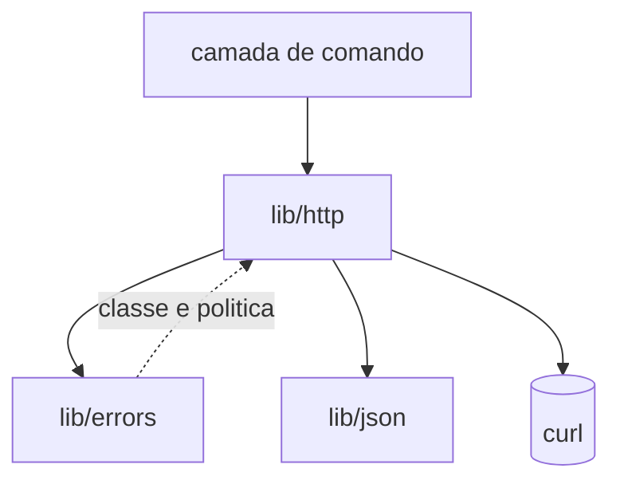

# Registro Tecnico de Entrega — Cliente HTTP e Redesenho do Reconhecedor

## Identificacao

| Campo | Valor |
|---|---|
| Incremento | `lib/http` (ponto unico de saida de rede) e redesenho do reconhecedor de origem de dado |
| Branch | `feature/http`, a partir de `develop` |
| Papel | Senior Developer |
| Data | 2026-08-18 |
| Estado | Entregue ao QA; validado; ressalvas tratadas em registro proprio |

## Escopo entregue

- `lib/http.sh` — cliente HTTP com paginacao por pagina, retentativa consultando a taxonomia, contexto JSON isolado e canal de corpo byte a byte.
- Redesenho da auditoria de captura de saida de comando em `tests/unit/json_test.sh`, invertendo o criterio de reconhecimento.
- Auditoria de acao de `trap` entre arquivos.

### Fronteiras

`lib/http` nao conhece credencial, conta nem perfil: recebe o token pronto por argumento de funcao.

## Decisoes tecnicas

### CONTRATO DO CLIENTE DECLARADO NO CABECALHO

O componente depende de comportamento especifico do `curl`: leitura de opcoes por `-K -`, corpo por `--data-binary @arquivo`, codigo por `-w '%{http_code}'`, status nao zero quando nao houve resposta HTTP. O contrato ficou declarado no cabecalho porque a suite o substitui por um duplo, e um contrato nao escrito e um contrato que o duplo pode violar em silencio.

### SEGREDO PELA ENTRADA PADRAO, NUNCA POR `argv`

`RNF-03`: o token vai nas opcoes lidas de `-K -`. Qualquer processo do sistema le `/proc/<pid>/cmdline`; nenhuma permissao protege `argv`.

### CORPO LIDO BYTE A BYTE, E NAO POR SUBSTITUICAO DE COMANDO

`$( )` remove quebras de linha finais. A leitura usa `IFS= read -r -d ''`.

**Limite declarado:** este canal serve a corpo TEXTUAL. Conteudo binario nao transita por variavel de shell, que nao carrega o byte nulo. Quando `download` existir, precisara de canal por arquivo ou descritor.

### DECISAO DO DUPLO — Substituto de `curl` no caminho de busca

Alternativas comparadas:

| Abordagem | Vantagem | Motivo da recusa |
|---|---|---|
| Substituto no `PATH` | exercita todo o codigo real a jusante da rede | escolhida |
| Servidor local | exercitaria tambem a pilha de rede | exige utilitario de escuta inexistente no projeto, que teria de passar pelo preflight; acrescenta porta, espera e classe nova de intermitencia |
| Ponto de injecao interno | simples | a suite exercitaria o ponto de injecao e nao o caminho real de invocacao — a armadilha do `QF-01`, em que o teste media a si mesmo |

### REDESENHO DO RECONHECEDOR — Origem do dado, e nao forma observada

A auditoria anterior reconhecia capturas de saida de comando por uma lista de idiomas observados. O criterio foi invertido: o universo passa a ser TODA captura presente no texto, e o conjunto mantido a mao passa a ser so o das EXCECOES — capturas cujo alfabeto de saida e fechado e nao pode carregar byte externo.

O redesenho encontrou uma ocorrencia real e viva: `$(dirname ...)` em `lib/config`, dentro de um componente aprovado por quatro ciclos de QA. Era a classe do `C2-01` sobrevivendo por a auditoria enxergar idioma em vez de origem.

### AUDITORIA DE `trap` ENTRE ARQUIVOS

Motivada por defeito proprio: `trap 'rm -rf "$area"'` com `area` declarada `local` expande vazio no momento em que o `trap` corre. Corrigido em `lib/hash`, e **reintroduzido identico** por mim em `lib/http`, com 16 reprovacoes e vazamento de diretorios temporarios. A disciplina existia no componente onde doeu e nao no gemeo. A auditoria passou a valer entre arquivos.

## Defeitos proprios registrados

| Defeito | Como apareceu | Tratamento |
|---|---|---|
| `trap` com variavel `local` | 16 reprovacoes, residuo em disco | variavel global e auditoria entre arquivos |
| Remocao acidental de 22 casos | suite seguiu verde; detectada por contagem manual | restauracao por `git show`; motivou a guarda de remocao |

**Ponto cego declarado na epoca:** suite verde nao detecta remocao de teste. Tratado em registro proprio.

## Evidencias

| Verificacao | Resultado |
|---|---|
| `shellcheck -x` e sem `-x` | exit 0 nos dois modos |
| Bateria integral | aprovada, sem reprovacoes |
| `lib/http` | 21 casos |
| Residuo em disco apos a bateria | zero |

## Pendencias transferidas

- Ambiguidade em `RNF-23`: corpo de colecao grande por quantidade de itens versus por um unico item grande. Encaminhada ao Business Analyst pelo coordenador.
- Divergencia declarada: com o reconhecedor derivado, `%s` passa a ser detectado, contrariando expectativa registrada pelo QA de que corretamente nao seria.
