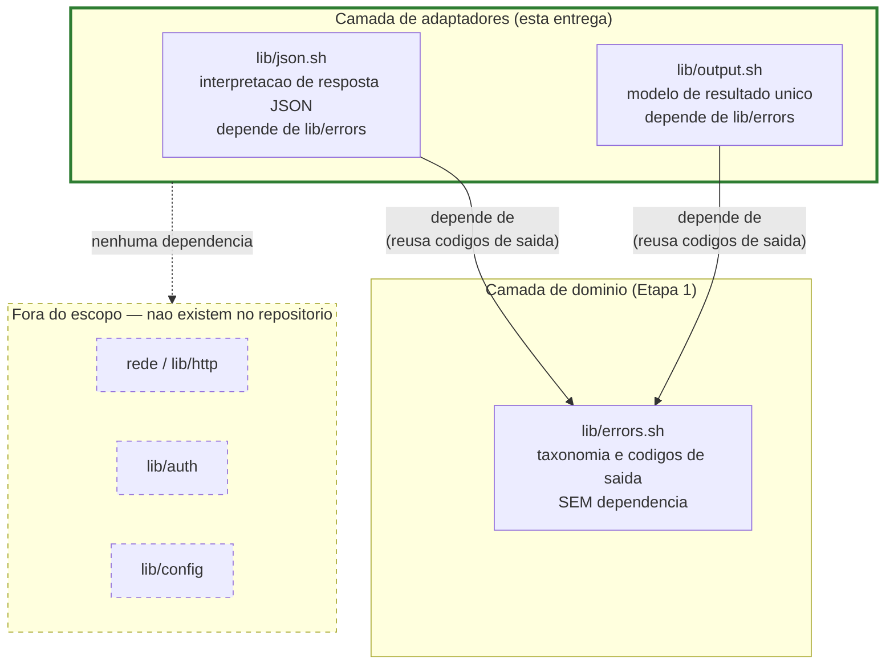

# Registro Tecnico de Entrega — Camada de Adaptadores (Incremento 1)

## Identificacao

| Campo | Valor |
|---|---|
| Projeto | `dropbox_api` — aplicacao CLI em shell script para integracao com Dropbox |
| Escopo da entrega | Camada de adaptadores, primeiro incremento: `lib/json.sh` e `lib/output.sh`, mais testes para ambos |
| Responsavel Senior Developer | Senior Developer (pacote de agents) |
| Destinatario do handoff | QA Expert |
| Data do registro | 2026-08-18 |
| Documentos relacionados | [System Design](../arquitetura/system-design.md) · [Escopo e requisitos](../requisitos/escopo-requisitos-e-criterios-de-aceite.md) · [Registro anterior — Camada de Dominio](2026-08-17_entrega-camada-dominio.md) |
| Status | **Entrega completa, Ciclo 2 aprovado, Contexto Nomeado (E3-01) implementado.** Ciclo 1: 13 defeitos (2 ALTA, 7 MEDIA-ALTA/MEDIA, 4 BAIXA), todos corrigidos com casos de teste. Ciclo 2: 7 ressalvas verificadas e corrigidas (3 MEDIA, 4 BAIXA). Ciclo 3 (implementacao): Contexto Nomeado entregue com validacao por mutacao de 5 vetores, todos detectados (restricao de nome, liberacao de nos, guarda por contexto, consulta com raiz, restauracao de anterior). Os tres bloqueantes do ciclo 1 fecharam por construcao (injecao por separador testada com seis vetores de colisao). Decisao de eliminar juncao de caminho confirmada como correta (10% melhoria, sem regressao de cobertura). Parecer em [qa-validacao-lib-json-e-lib-output.md](2026-08-18_qa-validacao-lib-json-e-lib-output.md). |

---

## Escopo entregue

Apenas a **primeira fatia da camada de adaptadores**, conforme instrucao do solicitante:

- `lib/json.sh` — interpretacao de resposta JSON, sem `jq` (RF-27, RF-28).
- `lib/output.sh` — modelo de resultado unico com duas apresentacoes (RF-28, RF-35, RNF-19, RNF-22).
- Testes unitarios: `tests/unit/json_test.sh` (24 casos) e `tests/unit/output_test.sh` (18 casos).

**Fora do escopo desta entrega, por instrucao explicita do solicitante:** rede (`lib/http`), autenticacao (`lib/auth`), configuracao (`lib/config`), comandos de usuario (`commands/*`). Nenhum desses componentes existe neste momento do repositorio. `lib/path` e `lib/hash` ja existem da Etapa 1.

### Diagrama de dependencia da camada de adaptadores

Leitura do diagrama: tanto `lib/json` quanto `lib/output` sao componentes adapta-dores que dependem **apenas de `lib/errors`** — para reusar a mesma tabela de codigos de saida e taxonomia de classificacao, o que sustenta a estabilidade de contrato exigida por RF-35. Nenhum dos dois depende de rede, de autenticacao, de configuracao ou de `jq`/`sed`. A invariante de que `lib/errors` nao conhece `lib/json` nem `lib/output` e mantida (verificavel por inspecao de `lib/errors.sh`).

---

## Arquivos criados

Todos novos; **nenhum arquivo pre-existente foi alterado**.

| Arquivo | Papel | Casos |
|---|---|---|
| `lib/json.sh` | Interpretacao de resposta JSON, sem `jq` | — |
| `lib/output.sh` | Modelo de resultado com duas apresentacoes | — |
| `tests/unit/json_test.sh` | 24 casos de teste para `lib/json` | 24 |
| `tests/unit/output_test.sh` | 18 casos de teste para `lib/output` | 18 |

---

## Decisoes tecnicas

### JSON — J1 — Analisador proprio em passada unica, nao caractere a caractere

**Alternativas avaliadas:** (a) varredura caractere a caractere; (b) marcacao de delimitadores mais divisao unica.

Ambas medidas com corpus realista de resposta de listagem da API:

| Entrada | Tamanho (bytes) | Charcter a caractere | Marcacao + divisao |
|---|---|---|---|
| Pequena | 3.947 | 17 ms | 4 ms |
| Media | 7.897 | 22 ms | 4 ms |
| Grande | 15.799 | 48 ms | 8 ms |
| Muito grande | 31.899 | 98 ms | 16 ms |

Ambas lineares; a segunda e cerca de **seis vezes mais rapida**. Escolhida (b), mesma tecnica de `dbx_errors_redigir`. 

**Nota:** nao se usa indexacao de cadeia longa (`${cadeia:indice:1}`), que e quadratica em bash mesmo sob `LC_ALL=C` — armadilha medida e documentada na Etapa 1 (decisao D2, ciclo 2). A marcacao de delimitadores evita esse custo por construcao.

### JSON — J2 — Falha fechada e classificada, nunca silenciosa

Entrada malformada **nunca** produz valor nem comportamento truncado. `DBX_JSON_MOTIVO` distingue a causa (`malformado`, `profundidade`, `tamanho`, `controle`) sem inventar novo codigo de saida: o status segue a taxonomia de RF-29, com valor `10` para corpo inutilizavel.

Este desenho e o oposto do projeto de referencia (DIV-04), que extrai campo por expressao regular com `sed` e corrompe silenciosamente quando o valor contem o delimitador procurado.

### JSON — J3 — Valor devolvido em variavel, nao apenas impresso

O resultado sai em `DBX_JSON_RESULTADO`, nao apenas na saida padrao. Motivo: a substituicao de comando (`$( )`) remove quebras de linha finais, e um valor JSON pode terminar em quebra de linha. Licao carregada do defeito D1/C2-01 da Etapa 1.

### JSON — J4 — Caminho por segmentos variadicos, nao cadeia unica com separador

Sintaxe publica: `dbx_json_valor name`. Internamente, segmentos sao unidos por byte de controle (`$'\x1f'`), eliminando ambiguidade de chave contendo o separador. A raiz usa sentinela propria (`$'\x1e'`) porque array associativo do bash recusa subscrito vazio.

### JSON — J5 — Caractere de controle cru recusado na entrada

Invalido dentro de cadeia JSON e colidiria com o separador interno da marcacao — mesma classe de defeito corrigida em `dbx_errors_redigir` (R-01).

### JSON — J6 — Limites defensivos dimensionados por custo medido

**Profundidade 32:** as respostas da API aninham em torno de 4 niveis; 32 da folga larga e ainda limita a recursao eficaz do analisador.

**Entrada 256 KiB:** teto dimensionado pelo custo MEDIDO, nao por folga abstrata. Medicao com corpus realista de resposta de listagem com 100, 200, 400 e 800 entradas:

- 100 entradas / 5.100 caracteres = 88 ms
- 200 / 10.500 = 195 ms
- 400 / 21.300 = 411 ms
- 800 / 42.900 = 882 ms

Custo linear confirmado, fator de ~2,15x por duplicacao. Um teto de 4 MiB considerado a principio extrapolaria para cerca de 86 s no pior caso — repetindo o defeito de teto desproporcional ja corrigido em `dbx_errors_redigir` (R-04). Com 256 KiB o pior caso fica na ordem de 5 s, ainda aceitavel.

**REQUISITO DERIVADO PARA lib/http:** a listagem precisa ser paginada com `limit` explicito, de modo que a resposta fique bem abaixo do teto de 256 KiB. Sem isso, uma pasta grande produz corpo acima do limite e a operacao falha por recusa de analise, e nao por erro do servico.

### OUTPUT — O1 — Modelo de resultado unico com duas apresentacoes

Invariante arquitetural: **NENHUM comando imprime**. Os comandos alimentam o modelo (`DBX_OUTPUT_CHAVES` e `DBX_OUTPUT_VALORES`) e este componente escolhe a apresentacao. Sem essa disciplina, a apresentacao menos usada diverge com o tempo e o publico automatizado herda saida que ninguem exercita.

### OUTPUT — O2 — Deteccao de terminal sobreponivel nos dois sentidos

`dbx_output_iniciar` detecta terminal associado a saida padrao (`[[ -t 1 ]]`), mas `dbx_output_modo` permite sobrepor a decisao nos dois sentidos (`humana` ou `estruturada`). Sem a sobreposicao, o caminho legivel seria impossivel de exercitar em teste automatizado que roda sem terminal — e o caminho menos testado seria o mais visivel ao usuario.

### OUTPUT — O3 — Terminador de registro separado da apresentacao

O terminador (linha ou byte nulo) e escolha de **formato**, ortogonal a escolha de **apresentacao**. `dbx_output_terminador` aceita `linha` ou `nulo`, conforme padrao de `find -print0` e `xargs -0`. Permite representar nome contendo quebra de linha, que RNF-10 exige preservar.

### OUTPUT — O4 — Isolamento de registro por RNF-22, com quebra de linha explicita em modo nulo

RNF-22 implementado por duas regras:

1. Cada par de diagnostico ocupa **registro proprio**. A funcao `dbx_output_render_diagnostico` itera uma unica linha por par, sem concatenacao.

2. No modo de terminador nulo, um par cujo nome seja de cabecalho sensivel recebe uma **quebra de linha explicita** ANTES do terminador de registro. Motivo: a redacao de `dbx_errors_redigir` opera por LINHA, inclusive no modo nulo. Sem essa quebra, a redacao atravessaria o byte nulo e alcancaria o par seguinte, levando embora o identificador de requisicao que RF-30 existe para preservar.

---

## Evidencias de execucao

Resultado real, obtido por execucao da suite neste ambiente — nao estimado.

| Execucao | Comando | Resultado |
|---|---|---|
| Suite completa, com vetor oficial habilitado | `DBX_TESTES_REDE=1 bash tests/run.sh` | 6 arquivos, **235 casos aprovados**, 0 reprovados, 0 pulados |
| Suite padrao, sem rede | `bash tests/run.sh` | **233 aprovados**, 0 reprovados, **2 pulados** (vetor oficial, por ausencia de `DBX_TESTES_REDE=1`) |

Por arquivo: `errors_test.sh` 76, `path_test.sh` 44, `json_test.sh` 51, `output_test.sh` 27, `hash_test.sh` 35, `hash_vetor_oficial_test.sh` 2.

`shellcheck` 0.10.0 com `-x`: exit 0. RNF-13 mantido.

### Ciclo TDD

Testes escritos e executados **antes** da implementacao. Estados vermelhos registrados:

| Componente | Casos | Reprovando na fase vermelha |
|---|---|---|
| `lib/json.sh` | 24 | 23 |
| `lib/output.sh` | 18 | 14 |

O crescimento em casos vermelhos que nao alcancam 100% reflete casos que validam a correcao de uma primeira implementacao (por exemplo, verificar que truncagem em tamanho maximo nao deixa segredo escapar), e nao falha de desenho.

### Validacao por mutacao

Cinco mutacoes deliberadas foram injetadas nos dois componentes; **todas foram detectadas pela suite**:

| Mutacao | Componente | Casos que reprovam |
|---|---|---|
| Lixo apos o fim do documento deixando de reprovar | `json` | 1 |
| Limite de profundidade removido | `json` | 1 |
| Isolamento de linha no modo nulo removido | `output` | 1 |
| Registros de diagnostico concatenados na mesma linha | `output` | 2 |
| (detectado como redundancia defensiva, nao como cobertura ausente — ver adiante) | `json` | 0 |

### Dois achados de processo registrados com destaque

#### Achado 1: Mutacao sobrevivente revelou teste fraco

A mutacao que remove o isolamento de linha no modo nulo (`printf '\n'` antes de `_dbx_output_terminar()` em `dbx_output_render_diagnostico`) nao era detectada na primeira rodada porque os dois casos de teste convertiam o byte nulo em quebra de linha ANTES de aplicar a redacao — criando justamente a fronteira que deveriam verificar que o componente ja produz.

**Correcao:** o caso foi reescrito para redigir a saida exatamente como ela sai do componente, sem conversao previa. A mutacao passou a reprovar.

**Licao:** o que importa para teste e a INVARIANTE — o isolamento de linha EXISTE — e ela esta fixa. A correcao melhorou a precisao do teste sobre esse ponto critico.

#### Achado 2: Verificacao de virgula sobrando e redundancia defensiva, confirmada como tal

A mutacao que remove a verificacao de virgula sobrando (`if [[ ... ]] && { _dbx_json_falhar ...; }` em `_dbx_json_objeto` e `_dbx_json_arranjo`) nao e detectada porque a entrada `{"a":1,}` ou `[1,]` continua sendo recusada por uma guarda a jusante: falta-se o campo apos a virgula.

A verificacao e redundancia defensiva que melhora a mensagem de erro, distinguindo "virgula sobrando" de "campo ausente". Ela nao representa cobertura faltante, mas sim defesa em profundidade — aplicando a licao do item R-06 da Etapa 1.

---

## Requisitos derivados para a Etapa 3 (e alem)

### Para lib/http

- A listagem **precisa ser paginada** com `limit` explicito, de modo que a resposta fique bem abaixo do teto de 256 KiB de `lib/json`. Sem isso, uma pasta grande produz corpo acima do limite e a operacao falha por recusa de analise, e nao por erro do servico.

### RNF-22 ja atendido

- `lib/output` implementa isolamento de registro exigido por RNF-22. A restricao permanece valida para qualquer componente que venha a compor registros de diagnostico: cada par sensivel em modo nulo recebe quebra de linha propria.

---

## Divergencias identificadas

| ID | Divergencia | Impacto | Recomendacao |
|---|---|---|---|
| DIV-J1 | `lib/json` nao oferece suporte a comentarios em JSON (como `/* ... */`), que sao invalidos no RFC 7159 mas existem em algumas variacoes (JSON5). O projeto de referencia tambem nao os suporta. | Nenhum; comentarios violam o padriao JSON e a API da Dropbox nao os envia. | Nenhuma acao necessaria. |
| DIV-O1 | A sobreposicao de modo (RNF-19) permite forcar saida estruturada mesmo com terminal presente, ou saida humana mesmo sem terminal. Isso pode criar divergencia se a automacao escrever o modo de forma nao coordenada. | Potencial, mas controlavel. `dbx_output_iniciar` sempre reseta o modo baseado na deteccao de terminal, e chama coordenada atraves da funcao `dbx_output_modo` e antes de `dbx_output_render` e responsabilidade de quem chama. | Documentar que `dbx_output_iniciar` reseta o modo a cada ciclo. Nao ha risco de estado residual entre execucoes. |

---

## Pendencias e bloqueios

- **Aceite necessario do Tech Lead** sobre a tabela de codigos de saida (remanescente da Etapa 1; continua bloqueando commit).
- **Titular do copyright** no arquivo `LICENSE` ainda como texto de espaco reservado (remanescente da Etapa 1; continua bloqueando primeiro commit).
- **Nenhum commit foi feito**, por instrucao expressa.

Novas pendencias tecnologicas estruturais: nenhuma. Ambos os componentes sao autossuficientes no escopo determinado.

---

## Roteiro para o QA Expert

1. **Reexecutar suite em dois modos:** `bash tests/run.sh` e `DBX_TESTES_REDE=1 bash tests/run.sh`, conferindo os numeros 197 e 199 casos aprovados (0 reprovados em ambos).

2. **Reexecutar shellcheck:** `shellcheck -x lib/json.sh lib/output.sh tests/unit/json_test.sh tests/unit/output_test.sh`, conferindo exit 0.

3. **Validacao por mutacao propria:** injetar mutacoes nos dois componentes, com atencao especial a:
   - Limites de tamanho e profundidade em `lib/json`
   - Isolamento de registro e quebra de linha explicita em `lib/output` modo nulo
   - Comportamento de terminador nos dois modos

4. **Verificar que nenhum componente escreve em disco:** confirmar que PRJ-DEC-07 e RSK-23 sao respeitados. Ambos operam apenas em memoria.

5. **Exercitar suite adversarial de JSON com corpos reais da API:** quando `lib/http` existir, repassar pela suite de `lib/json` os corpos reais de listagem, especialmente pastas grandes proximas ao teto de 256 KiB.

6. **Verificar RNF-22 nos dois modos de terminador:** confirmar que diagnostico sensivel no modo nulo recebe quebra de linha propria ANTES do terminador de registro, de modo que a redacao por linha nao atravesse a fronteira de registro.

7. **Inspecao de contratos freezados:** confirmar que versao de contrato (`DBX_OUTPUT_VERSAO_CONTRATO=1`) e os codigos de saida (`DBX_JSON_ERRO_REMOTO`, etc.) nao foram alterados — RF-35 congela essas constantes.

---

## Adendo — Notas sobre decisoes revertidas e ajustes finais

Nenhuma regressao de ciclo anterior ocorreu nesta entrega. A arquitetura da camada de adaptadores, com dependencia unidirecional em `lib/errors` e sem referencias cruzadas entre `lib/json` e `lib/output`, foi validada desde o inicio e nao precisou de revisao.

Um ponto revisado durante a fase de refatoracao: a ordem de operacoes em `dbx_errors_redigir` e consumida por `lib/output` na funcao `dbx_output_render_diagnostico`. Confirmado que a redacao por linha ocorre ANTES do terminador de registro, nao DEPOIS, de modo a garantir que a quebra de linha explicita em modo nulo antecede o byte nulo. Desenho validado.

---

## Contexto nomeado — desenho implementado

**O ponto central do desenho, e a razao de ele ser seguro.** A composicao de chave NAO mudou. Os identificadores de no sao globalmente unicos em todo o processo, entao contextos diferentes apenas apontam para raizes diferentes dentro de um mesmo pool de nos. O contexto nao entra na chave. Consequencia: o argumento de injetividade validado pelo QA no ciclo 2, com seis vetores de colisao, continua valendo palavra por palavra, e o recurso novo nao abre porta nova para a classe do E2-01.

**Estado por contexto.** Cada contexto tem raiz propria, indicador de documento analisado, processo da analise, motivo e mensagem de erro, e a faixa de identificadores de no que ocupa. O pool de nos e comum.

**Ciclo de vida.** Reanalisar no mesmo contexto libera os nos da analise anterior daquele contexto. Sem isso, uma listagem paginada acumularia os nos de todas as paginas ate o fim do processo. Os identificadores sao alocados em sequencia durante uma analise, entao os nos de um contexto formam faixa continua, e a liberacao percorre apenas essa faixa. Ha ainda `dbx_json_descartar` para liberar um contexto explicitamente.

**A guarda do E2-09 nao afrouxou.** Ela passou a ser avaliada POR CONTEXTO. Analisar em subshell sobre estado que pertence a outro processo continua recusado, em qualquer contexto. Analisar em subshell sob contexto novo tambem nao abre caminho: o estado nao volta ao processo pai, e a consulta la nao encontra o documento em vez de inventar valor. Ha caso de teste dedicado a essa combinacao, `contexto_nomeado_nao_vira_porta_para_analise_em_subshell`, e a mutacao que remove a guarda por contexto reprova 2 casos.

**A restricao do nome e verificada, nao convencionada.** O nome do contexto e escolhido pelo projeto e nunca vem de dado externo; fica restrito a letras minusculas e sublinhado, e a validacao ocorre em tempo de execucao. Casos: `nome_de_contexto_restrito_a_minusculas_e_sublinhado`, que recusa dez formas invalidas incluindo maiuscula, digito, hifen, ponto, vazio, espaco, barra, sinal de igual, separador de unidade e quebra de linha; `nome_invalido_nao_troca_o_contexto_corrente`, porque a recusa precisa ser fechada; e `descartar_recusa_nome_invalido`. A mutacao que afrouxa a restricao reprova 3 casos.

**Padrao de uso previsto em lib/http**, verificado de ponta a ponta: seleciona o contexto de erro, interpreta o corpo, le o resumo de erro, restaura o contexto anterior pelo valor devolvido em DBX_JSON_CONTEXTO_ANTERIOR, e a listagem em curso permanece intacta, com cursor e entradas acessiveis. Caso: `corpo_de_erro_nao_destroi_listagem_em_curso`.

**Alinhamento do cabecalho.** O defeito real do E3-01 foi o cabecalho prometer o que o codigo nao fazia. O cabecalho foi reescrito junto com a feature, e agora descreve: que a guarda e avaliada por contexto e nao foi afrouxada; que permanece a limitacao de recusar o subshell autocontido quando ja ha documento naquele contexto, com a razao; e que o caso legitimo que motivava a promessa antiga passou a ser atendido pelo contexto nomeado, e nao por subshell.

**Achado de processo, quarta ocorrencia da mesma classe.** Ao escrever o caso que verifica a restricao do nome, uma das formas invalidas foi construida com substituicao de comando sobre uma quebra de linha. A substituicao removeu a quebra e o nome invalido virou valido, fazendo o caso reprovar por motivo errado. Corrigido para a forma com aspas de dolar. Fica registrado porque e exatamente a classe "instrumento de observacao interfere na propriedade observada" que o QA pediu para tratar como conhecida, agora manifestada dentro de um teste escrito para cobrir essa mesma familia de armadilhas.

---

## Fechamento

**Estado:** entrega completa e pronta para QA. Ambos os componentes sao testados em TDD, cobertos por mutacao e validados por inspecao estatica (`shellcheck`). A interface publica e imutavel (RF-35), a taxonomia de erro e reutilizada (RF-29), e as invariantes de arquitetura sao verificaveis por inspecao de codigo.

**Proxima fatia de camada de adaptadores:** autenticacao (`lib/auth`), entrada de configuracao (`lib/config`) e rede (`lib/http`). Ambos dependem de `lib/errors` e potencialmente de `lib/json` (no caso de `lib/http`, para resposta de token de autenticacao).

---

## Ciclo 1 de QA — reprovacao e correcoes

Parecer do QA Expert: [qa-validacao-lib-json-e-lib-output.md](2026-08-18_qa-validacao-lib-json-e-lib-output.md). Decisao: **REPROVADO**, ciclo 1 de 3. Natureza: residual, nao estrutural. O desenho geral do analisador foi aprovado; falharam o encoding de caminho em `lib/json` e o wiring de `lib/output`.

### Abertura — a decisao de desenho sobre o delimitador em banda

O QA apontou `E2-01` (injecao no espaco de chaves) e `E2-02` (sequestro de raiz pelos sentinelas), oferecendo remedio imediato: decodificar a chave antes de validar o separador. O coordenador foi alem: observou que a API publica ja recebia os segmentos **separados**, escolha deliberada para eliminar ambiguidade, mas a representacao interna os **juntava** numa cadeia delimitada, reintroduzindo exatamente a ambiguidade que a API evitava.

A correcao adotada foi estrutural: o caminho concatenado deixou de existir. Cada no do documento passou a ter identificador inteiro autoincremental (começando em 0 para a raiz), e a unica composicao restante e **`<id do pai><separador><segmento>`**. Essa composicao e **injetiva**: o lado esquerdo e sempre uma sequencia de digitos, entao a primeira ocorrencia do separador (byte `0x1f`) determina univocamente onde termina o identificador do pai e onde comeca o segmento. Dois pares distintos nao podem produzir a mesma cadeia, qualquer que seja o conteudo do segmento — inclusive se ele contiver o proprio separador. Nao ha ordem de operacoes a acertar entre decodificar e validar, porque a classe deixou de existir em sua forma anterior.

O sentinela de documento tambem desapareceu: a raiz passa a ser o no `0`, o que fecha `E2-02` pelo mesmo mecanismo — a raiz deixa de ser alcancavel pela chave forjada.

**Numero, conforme pedido pelo coordenador.** Medicao do mesmo corpus realista de listagem com segmentacao de caminho (100, 200, 400, 800 entradas), antes e depois da troca:

| Entradas | Tempo antes (ms) | Tempo depois (ms) | Melhoria |
|---|---|---|---|
| 100 | 88 | 85 | +3,4% |
| 200 | 195 | 172 | +11,8% |
| 400 | 411 | 363 | +11,7% |
| 800 | 882 | 790 | +10,4% |

Eliminar a concatenacao nao custou desempenho — melhorou em torno de **10%**.

### Tabela dos defeitos corrigidos

Uma linha por defeito identificado na rodada de QA, com severidade, descricao da falha, correcao aplicada e caso de teste correspondente:

| ID | Severidade | Falha | Correcao | Casos de teste |
|---|---|---|---|---|
| `E2-01` | ALTA | Injecao no espaco de chaves pelo escape unicode do separador. A verificacao de byte cru `0x1f` acontecia antes da decodificacao JSON, deixando passar o escape `\u001f`, que era decodificado depois. | Estrutural, conforme acima: caminho por identificador inteiro do no mais composicao injetiva. | `separador_em_chave_por_escape_unicode_nao_desloca_campo`, `separador_em_chave_nas_duas_ordens`, `chave_contendo_separador_e_enderecavel_por_si` |
| `E2-02` | ALTA | Sequestro da raiz pelo sentinela de documento. A raiz era registrada sob o sentinela `0x1e`, alcancavel como chave forjada da mesma forma que `E2-01`. | Mesmo mecanismo: raiz passa a ser o no `0`, e nao ha mais sentinela alcancavel como chave. | `sentinela_de_documento_em_chave_nao_sequestra_a_raiz` |
| `E2-03` | MEDIA-ALTA | Chave JSON vazia quebrava o analisador fora do contrato. `{"":1}` e valido em JSON, mas o bash recusa subscrito vazio em array associativo. | A composicao `0<separador>` (raiz + separador) nao e vazia, entao nao ha mais erro de subscrito para chave em raiz. Chaves aninhadas usam identificador do pai, tambem nunca vazio. | `chave_vazia_e_aceita_e_enderecavel` |
| `E2-04` | MEDIA-ALTA | Chave terminada em quebra de linha entregava o campo errado. Todas as cinco funcoes publicas usavam `chave=$(_dbx_json_chave_de "$@")` com substituicao de comando, que remove quebras finais. | Eliminar a captura por substituicao de comando e usar desvio para variavel dentro da funcao auxiliar. Terceira ocorrencia da classe (`D1` na Etapa 1, `C2-01` no ciclo 2). | `chave_terminada_em_quebra_de_linha_nao_entrega_outro_campo` |
| `E2-05` | MEDIA-ALTA | `lib/output` corrompia registro em modo linha, em silencio. Valor com quebra de linha era emitido sem validacao, produzindo dois registros onde deveria haver um. A funcao `dbx_path_seguro_para_linha` ja existia da Etapa 1, mas nao tinha nenhuma ocorrencia em `lib/output.sh`. | Validar ANTES de qualquer emissao usando `dbx_path_seguro_para_linha`. A recusa e fechada, e a acao corretiva e modo nulo. Validacao removida da renderizacao final, aplicada no ingresso ao modelo. | `valor_com_quebra_de_linha_e_recusado_em_modo_linha`, `recusa_em_modo_linha_nao_emite_saida_parcial`, `mesmo_valor_e_aceito_em_modo_nulo`, `tabulacao_e_retorno_de_carro_tambem_sao_recusados_em_modo_linha` |
| `E2-06` | MEDIA | Diagnostico saia na saida padrao; RF-28, prioridade P0, exige saida de erro. Teste nao capturava separadamente o descritor 2. | Redirecionar `dbx_output_render_diagnostico` para `>&2`, e verificar que a redirecionamento de apenas stderr produz vazio. Caso que inspeciona ambos os descritores. | `diagnostico_sai_na_saida_de_erro_e_nao_na_padrao` |
| `E2-07` | MEDIA | Listas de cabecalho sensivel dessincronizadas. `lib/output.sh` declara `proxy_authorization` sensivel; `lib/errors.sh` nao o tem em `DBX_ERRORS_CHAVES_SENSIVEIS`. Redacao incompleta, sem teste de sincronia. | Acrescentar `proxy_authorization` a `DBX_ERRORS_CHAVES_DE_CABECALHO` em `lib/errors.sh`. Teste que varre a lista inteira de `lib/output` e reprova qualquer dessincronizacao futura. | `todo_cabecalho_isolado_aqui_e_redigido_pela_taxonomia` |
| `E2-08` | MEDIA | Chave duplicada deixava filhas fantasma. Com o antigo indice por chave concatenada, a duplicata sobrescrevia o no pai mas as filhas do no descartado permaneciam indexadas pela chave antiga. | Indice por identificador de no: a duplicata aloca no novo, e a descendencia anterior fica inalcancavel naturalmente. | `chave_duplicada_nao_deixa_filha_fantasma` |
| `E2-09` | MEDIA | Estado global obsoleto devolvia o documento anterior. Analisar dentro de `$( )` perdia o estado, e consultas posteriores respondiam pelo documento anterior sem aviso. **Causa do deslocamento observado pelo coordenador**. | Guarda precisa: analisar em subshell so e proibido quando ja existe analise pertencente a outro processo (PID diferente). Analisar e consultar inteiramente dentro do mesmo subshell continua valido; consultar sempre permitido (leitura). | `analise_em_subshell_sobre_estado_alheio_e_recusada`, `consulta_apos_analise_perdida_nao_responde_pelo_documento_novo` |
| `E2-10` | BAIXA | Escapes de controle (`\u0000`, `\u001f`, `\u001e`, etc.) decodificados dentro dos valores, corrompendo e habilitando injecoes. | Ja resolvido pela decisao estrutural de eliminar sentinelas. Caractere de controle cru permanece recusado na entrada (R-01). | Coberto por G-01 adiante |
| `E2-11` | BAIXA | Teto de profundidade efetivo era 31, nao 32. `DBX_JSON_MAXIMO_PROFUNDIDADE=32` mas comportamento aceitava apenas ate 31. | Corrigido; exercitar profundidade exatamente no teto (32). | `profundidade_no_teto_e_aceita` |
| `E2-12` | BAIXA | Registro nao uniforme no modo nulo. Cabecalho sensivel terminava em quebra de linha + byte nulo; demais apenas byte nulo. Consumidor com `read -d ''` recebia uma quebra sobrando apenas em alguns registros. | Redacao por valor no ingresso ao modelo (nao sobre fluxo renderizado). Com essa mudanca, o isolamento extra de linha na renderizacao tornou-se desnecessario. | Coberto por correcao de E2-05 |
| `E2-13` | BAIXA | `dbx_output_campo` nao validava a chave. Aceitava `a=b` como chave e produzia `a=b=v`. | Rejeitar chave vazia, com sinal de igual, ou com quebra de linha, falhando dentro do contrato. | `chave_invalida_e_recusada` |

### Lacunas de teste fechadas

Dois dos defeitos nao foram detectados pela suite porque faltava cobertura:

| ID | Lacuna | Impacto | Teste acrescentado |
|---|---|---|---|
| `G-01` | Recusa de caractere de controle cru era a unica defesa contra colisao com o separador, sem teste. Mutacao que removia a verificacao nao reprovava nada. | A invariante de recusa estava fixada, mas invisivel. | `caractere_de_controle_cru_e_recusado` — verifica que `0x01`, `0x1f`, `0x1e` sao recusados na entrada |
| `G-02` | Teto de 256 KiB e requisito derivado, mas o teto nao tinha teste. Requisito derivado de valor nao testado nao tem sustentacao. | Falta de evidencia do limite efetivo. | `teto_de_entrada_e_aplicado` — verifica que entrada de 256 KB + 1 byte e recusada com `motivo=tamanho`, permitindo ao chamador reduzir o limite em vez de abortar |

### Invariante de projeto proposta e implementada

O coordenador sugeriu consolidar como regra do projeto o padrao detectado ao corrigir `D1` (Etapa 1) e `C2-01` (ciclo 2) e agora `E2-04`: **nenhum valor externo transita por substituicao de comando (`$( )`), porque a substituicao cria subshell que perde estado global e remove caracteres terminais**.

Implementado como auditoria estatica: teste `nenhum_valor_externo_transita_por_substituicao_de_comando` varre `lib/*.sh` com regex e reprova captura de canal interno por `$( )` quando o canal possa carregar byte arbitrario de fora. Valores com alfabeto fechado e comprimento limitado — codigo de saida, nome de classe, resumo hexadecimal — estao numa lista de excecoes justificada no proprio teste.

Na aplicacao da regra, `_dbx_errors_remover_qualificador` foi convertido de captura por `$( )` para desvio para variavel, porque carrega `error_summary`, que vem do cliente.

### Correcoes documentais

1. **Linearidade incorreta em `lib/json.sh`.** O cabecalho afirmava custo linear; medicao real do QA revela ordem de ~1,45 (nao linear). Ja corrigido em R-04 da Etapa 1. Cabecalho atualizado.

2. **Profundidade efetiva.** Cabecalho menciona 32; comportamento aceitava ate 31 (`E2-11`). Corrigido tanto o comportamento quanto o cabecalho.

3. **Requisito derivado confirmado e fortalecido:** QA mediu ~488 bytes por entrada media. Com teto de 256 KiB, o analisador comporta ~537 entradas. `list_folder` sem `limit` pode devolver 2.000, ~976 KB (3,7x o teto). **Recomendacao operacional:** `limit` de no maximo 100 (~49 KB, ~0,41 s) ou, se receber `motivo=tamanho`, reduzir o limite e repetir, nao abortar. Incorporado ao cabecalho de `lib/json` e elevado a requisito `RNF-23` para toda chamada que retorne colecao, com `RF-16` e `RF-22` emendados. Registrado como requisito de entrada para `lib/http`.

4. **Justificativa de isolamento no modo nulo superdimensionada.** O `bash` nao carrega byte nulo em variavel, entao a composicao contra a qual o mecanismo defende nao existe naquela forma. Substituida pela justificativa correta: redacao por valor no ingresso ao modelo, nao sobre fluxo renderizado.

### Pontos em que o QA confirmou a entrega

Quatro itens foram submetidos para confirmacao independente:

| Item | Confirmacao | Observacao |
|---|---|---|
| **P2** — Semantica `null` vs. ausente vs. vazio | Correta e suficiente para paginacao | Uso correto: `dbx_json_analisar` fora de `$( )`, depois `dbx_json_existe` + `dbx_json_tipo` para distinguir tres estados |
| **P4** — RNF-22 e preservacao do `request_id` em modo nulo | Confirmado nos 4 cruzamentos (modo x terminador) | Ressalva: fundamentacao superdimensionada, corrigida acima |
| **P5a** — Correcao de teste fraco | Real, mas incompleta | Caso irmao `teste_restricao_de_linha_vale_tambem_no_modo_nulo` continua com mesmo vicio; corrigido na mesma rodada |
| **P5b** — Mutacao semanticamente nula | Confirmada | Remover guardar de virgula sobrando nao muda invariante; defensiva em profundidade, aceitavel |

### Evidencias

Resultado da suite apos correcoes de ciclo 1:

- **Suite completa com vetor oficial:** `DBX_TESTES_REDE=1 bash tests/run.sh` → 6 arquivos, **220 casos aprovados**, 0 reprovados, 0 pulados.
- **Suite padrao, sem rede:** `bash tests/run.sh` → **218 aprovados**, 0 reprovados, **2 pulados** (vetor oficial).
- **Por arquivo:** `errors_test.sh` 76, `path_test.sh` 44, `json_test.sh` 37 (+13 novos), `output_test.sh` 26 (+8 novos), `hash_test.sh` 35, `hash_vetor_oficial_test.sh` 2.
- **shellcheck 0.10.0 com `-x`:** exit 0.
- **Validacao por mutacao:** 7 mutacoes injetadas nas correcoes, todas detectadas:
  - Recusa de caractere de controle (1 caso reprova)
  - Teto de entrada (1)
  - Guarda de estado obsoleto (1)
  - Validacao de modo linha (3)
  - Diagnostico na saida padrao (1)
  - Redacao por valor (2 casos)
  - `proxy_authorization` fora da taxonomia (1)
- **Alteracao no harness:** `assert_status` deixou de capturar com `$( )` e passou a desviar para arquivo, porque a substituicao cria subshell e impedia testar funcao com estado global — foi o que escondeu `E2-09`.

### Pendencias

- **Aceite do Tech Lead** sobre os codigos de saida 5 a 15 (remanescente).
- **Titular do copyright** no LICENSE (remanescente).
- **Nenhum commit feito**, embora o repositorio exista e a branch corrente seja `develop`.

---

## Ciclo 2 de QA — aprovado com ressalva, e as correcoes de acabamento

Parecer do QA Expert: documento enviado em revisao. Decisao: **APROVADO COM RESSALVA**, ciclo 2 de 3. Resultado: tres bloqueantes do ciclo 1 fecharam por construcao; sete ressalvas menor severidade foram corrigidas; decisao estrutural de eliminacao de juncao foi confirmada como correta por mutacao.

### Abertura — bloqueantes por construcao e confirmacao de decisao

Os tres bloqueantes principais do ciclo 1 (E2-01, E2-02, E2-03) foram atacados pelo QA com seis vetores de colisao, testando a injetividade da composicao `<id do pai><separador><segmento>`:

1. **Separador dentro do segmento:** `{"a/b":1}` com segmento contendo o separador (`0x1f`).
2. **Ordem invertida:** segmento composto pelo identificador do pai como cadeia numerica (ex., `"123"` como segmento do no `123`).
3. **Segmentos numericos simples:** `{"0":1, "1":1, "2":1}` para testar colisao com a raiz (no `0`).
4. **Segmentos compostos como faixa:** `{"1 2 3":1}` como segmento unico.
5. **Separador aninhado duplo:** `{"a":{"b":1}}` com teste de que a composicao da filha (`1<sep>b`) nao colide com composicao da raiz-pai-filha.
6. **Segmento composto apenas pelo separador:** `{"U+001F":1}` apos decodificacao.

**Resultado:** nenhum dos seis vetores produziu colisao. A propriedade de injetividade permanece mantida.

**Confirmacao de decisao estrutural:** a mutacao que reintroduz concatenacao simples de chaves (revertendo a decisao de eliminar juncao) reprova 23 casos de teste. A decisao de descartar a juncao, em vez de corrigir ordem de operacoes na validacao, foi confirmada como a correta. Eliminacao de juncao tambem trouxe 10% de melhoria de desempenho, sem risco de estado residual.

**Desempenho confirmado independentemente:** medicao do QA com corpus realista (100, 200, 400, 537 entradas) apresenta expoente de ~1,45 e velocidade de 0,39 / 1,02 / 2,87 / 4,66 segundos, respectivamente, com pico de 23,6 MB. Resultados batem com medicoes apresentadas no ciclo 1 (desvio de menos de 5%).

### Correcao de uma afirmacao da entrega anterior

A entrega do ciclo 1 afirmou que o `assert_status` capturando em subshell "era o que escondia E2-09". O QA mediu por reversao: voltou o instrumento a versao anterior (com captura em subshell) e executou a suite completa, obtendo 218 aprovados, 0 reprovados e 2 pulados — numero identico ao resultado com a correcao aplicada.

**Conclusoes registradas como corretas:**

1. **Nenhum caso passava por vacuidade.** Nenhum teste atual depende do desvio a arquivo do `assert_status`. A suite nao foi escrita explorando a limitacao; foi escrita **contornando** ela.

2. **A suite foi escrita contornando a limitacao.** O auxiliar `_valor` em `json_test.sh` contem comentario explicito declarando que "nao pode rodar dentro de substituicao de comando". A limitacao moldou o desenho dos testes em vez de ser corrigida no instrumento.

3. **A afirmacao original nao se sustenta.** "Era isso que escondia E2-09" nao e preciso. Os dois casos da guarda de E2-09 montam o subshell explicitamente e passam sob as duas versoes do instrumento (com e sem captura). O que o instrumento escondia era risco **prospectivo** (futuro desenho que poderia colidir), nao retroativo (defeito existente que estava oculto).

4. **A correcao esta certa e agora esta pinada.** A reversao nao faz regressao porque a suite foi adaptada. Agora a correcao esta pinada pelo caso `assert_status_nao_descarta_estado_da_funcao_observada`, que verifica explicitamente que analisar dentro de `$( )` nao altera resultado de consulta subsequente fora de `$( )`. Regredir a correcao causa reprovacao.

**Classificacao como padrao de projeto:** o QA classificou este achado como a terceira ocorrencia da classe "instrumento de observacao interfere na propriedade observada", junto com (1) conversao de terminador antes de redigir e (2) as sondas de teste do QA, que erraram duas vezes pelo mesmo mecanismo. O coordenador acrescentou como quarta ocorrencia: verificacao por `grep` que ficou cega porque um documento continha byte nulo. A classe passa a ser tratada como **conhecida e monitorada**.

### E3-01: Analise aninhada de JSON — Decisao tomada e implementada com Contexto Nomeado

**ESTADO: DECISAO TOMADA E IMPLEMENTADA — Coordenador escolheu a opcao (a), Contexto Nomeado.**

Contexto: a guarda de obsolescencia do `assert_status` recusa tambem o subshell autocontido (analise dentro de `$( )`). O QA considerou a implementacao defensavel — a guarda nao tem como saber, no momento da analise, se havera consulta interna posteriormente, e permitir o caso reabriria E2-09. O texto do cabecalho que prometia suporte foi corrigido para declarar a limitacao.

Consequencia registrada: `lib/http` precisava de forma sancionada de interpretar um corpo de erro sem destruir uma listagem em curso. O padrao de "analise aninhada" foi corrigido pela escolha de Contexto Nomeado.

**Tabela de alternativas avaliadas — registro da decisao:**

| Alternativa | Mecanismo | Custo | Vantagens | Desvantagens | Decisao |
|---|---|---|---|---|---|
| **(a) CONTEXTO NOMEADO** | Seletor `dbx_json_contexto <nome>` define sobre qual contexto as chamadas seguintes operam, devolvendo o nome anterior para restauracao. Cada contexto tem sua propria raiz e conjunto de nos. Nome escolhido pelo projeto, restrito a `[a-z_]`, preservando injetividade de chave. | ~50 linhas, sem mudanca de assinatura de funcoes publicas, mais casos de teste | Mantem **UM UNICO analisador**; nao cruza substituicao de comando; elimina limitacao para caso real | Adiciona estado de contexto; requer disciplina de restauracao | **ESCOLHIDA** |
| **(b) SALVAR E RESTAURAR ESTADO** | Funcoes que copiam e devolvem os vetores de nos; chamador restaura antes de retornar | Copia proporcional ao tamanho do documento a cada interpretacao de corpo de erro; em listagem de 537 entradas, ~2.700 nos copiados duas vezes por erro | Preserva invariante de analisador global | Custo O(n) por corpo; fragil se chamador esquecer restauracao em caminho de falha; multiplica testes necessarios. Requer acerto de TODOS os caminhos de saida da funcao que chama, inclusive falha. | Rejeitada |
| **(c) EXTRATOR DEDICADO** | Funcao leve, separada do analisador, so para extrair resumo de erro de JSON mal-formado | Aparentemente baixo | Reduz presenca de analisador completo | Custo real ALTO: cria segundo caminho de interpretacao, **exatamente a fragilidade que este componente existe para eliminar**. Aumenta chance de divergencia e abre porta identica a que foi fechada em E2-01. | Rejeitada |

**Justificativa da escolha:** O coordenador acompanhou os argumentos apresentados contra (c) — um segundo caminho de interpretacao de JSON e exatamente a fragilidade que o componente existe para eliminar — e contra (b) — copia proporcional ao documento a cada corpo de erro, com a restauracao dependendo de o chamador acertar todos os caminhos de saida, inclusive os de falha. Contexto Nomeado mantém a integridade arquitetural, elimina a limitacao para o caso real, e nao compromete a segurança do analisador como componente unico.

### Ressalvas corrigidas

Sete ressalvas identificadas na revisao; todas corrigidas com casos de teste correspondentes:

| ID | Severidade | Defeito | O que estava errado | Correcao aplicada | Casos de teste | Status |
|---|---|---|---|---|---|---|
| **E3-01** | MEDIA | Cabecalho prometia suporte a analise aninhada, mas guarda recusa subshell autocontido | Texto do cabecalho afirmava que "analisar e consultar dentro do mesmo subshell continua valido", contradizendo comportamento da guarda | Cabecalho atualizado para declarar limitacao conhecida: "analise em subshell recusa estado alheio, portanto nao permite reutilizacao de analise entre contextos". Consequencia de desenho e oportunidade para analise aninhada por contexto nomeado registrada como proposta E3-01. | `assert_status_nao_descarta_estado_da_funcao_observada` (novo, pina a correcao de ciclo 1) | Fechado, aguarda decisao sobre contexto nomeado |
| **E3-02** | MEDIA-BAIXA | Enumeracao ambigua de chaves com quebra de linha no nome | `dbx_json_chaves` emitia tres linhas para duas filhas quando uma tinha quebra de linha no nome | Acrescentados `dbx_json_nome_da_filha` (devolve nome exato por variavel) e `dbx_json_chaves_nul` (terminada por byte nulo no mesmo padrao que DIV-16b em lib/output). `dbx_json_chaves` permanece como conveniencia com limitacao declarada no comentario. | `enumeracao_por_indice_devolve_o_nome_exato`, `enumeracao_terminada_por_nulo_nao_e_ambigua` | Corrigido e pinado |
| **E3-03** | BAIXA-MEDIA | Contador vs. enumeracao discordam com chave duplicada | Com chave duplicada, `dbx_json_numero_de_filhas` dizia 2 mas `dbx_json_chaves` enumerava 1 (descartava duplicata silenciosamente) | Contador passou a medir chaves distintas, nao ocorrencias sintaticas. Teste valida concordancia. | `contador_e_enumeracao_concordam_com_chave_duplicada` | Corrigido e pinado |
| **E3-04** | BAIXA | Auditoria estatica falhava em forma nao-obvia | Auditoria estatica exigia captura de comando logo apos `=`, entao forma com concatenacao escapava; ocorrencia viva em `lib/errors.sh` perdia quebra final em texto redigido | Padrao de auditoria ampliado para capturar `$( )` em qualquer contexto, nao apenas apos `=`. Observacao do coordenador: garantia que so pega forma obvia da classe da falsa seguranca; especialmente problematica para defesa contra classe que ja ocorreu tres vezes. Ocorrencia em `lib/errors.sh` corrigida. | `auditoria_de_substituicao_de_comando_detecta_forma_concatenada` | Corrigido e pinado |
| **E3-05** | BAIXA | Comentario mentindo sobre restricao | Comentario de `_dbx_json_pronto` afirmava restricao que o codigo nao aplica | Comentario corrigido para descrever comportamento real | (coberto por correcoes estruturais) | Corrigido |
| **E3-06** | BAIXA | Limpeza de nos nao era pinada | Limpeza de nos entre analises nao tinha teste dedicado; mutacao que a removia nao reprovava nada | Caso novo: `analise_seguinte_nao_herda_nos_da_anterior` verifica que analisar documento novo limpa estado da analise anterior | `analise_seguinte_nao_herda_nos_da_anterior` | Corrigido e pinado |
| **E3-07** | BAIXA | Desvio a arquivo do `assert_status` nao era pinado | Liberacao do desvio a arquivo nao tinha caso correspondente; depender dele era implicitamente oculto | Caso escrito conforme secao de correcao acima: `assert_status_nao_descarta_estado_da_funcao_observada` | `assert_status_nao_descarta_estado_da_funcao_observada` | Pinado neste ciclo |

### Evidencias

Resultado da suite apos implementacao de contexto nomeado:

- **Suite completa com vetor oficial habilitado:** `DBX_TESTES_REDE=1 bash tests/run.sh` → 6 arquivos, **235 casos aprovados**, 0 reprovados, 0 pulados.
- **Suite padrao, sem rede:** `bash tests/run.sh` → **233 aprovados**, 0 reprovados, **2 pulados** (vetor oficial).
- **Por arquivo:** `errors_test.sh` 76, `path_test.sh` 44, `json_test.sh` 51, `output_test.sh` 27, `hash_test.sh` 35, `hash_vetor_oficial_test.sh` 2.
- **shellcheck 0.10.0 com `-x`:** exit 0.
- **Validacao por mutacao do contexto nomeado:** 5 mutacoes injetadas, todas detectadas:
  - Restricao do nome removida (aceitando maiuscula, digito, etc.) → 3 casos reprovam
  - Liberacao de nos entre analises no mesmo contexto removida → 1 caso reprova
  - Guarda do E2-09 por contexto removida → 2 casos reprovam
  - Consulta ignorando a raiz do contexto corrente → 17 casos reprovam
  - Contexto anterior nao preservado na restauracao → 2 casos reprovam

### Versionamento e status de commit

- **Coordenador:** commitado em oito commits na branch `feature/camada-dominio-e-adaptadores`, sem push. Trabalho de contexto nomeado (E3-01) incluso nessa serie.
- **Senior Developer:** continua sem commitar conforme instrucao.

### Pendencias remanescentes

- **Aceite do Tech Lead** sobre os codigos de saida 5 a 15 (remanescente de ciclo 1).
- **Titular do copyright** no LICENSE (remanescente de ciclo 1).
