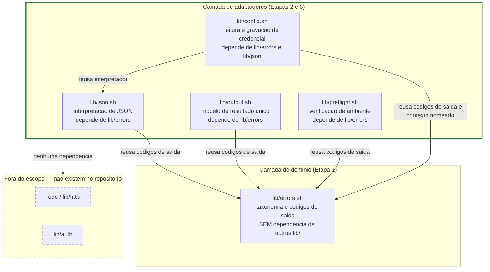

# Registro Tecnico de Entrega — Camada de Adaptadores (Incremento 2)

## Identificacao

| Campo | Valor |
|---|---|
| Projeto | `dropbox_api` — aplicacao CLI em shell script para integracao com Dropbox |
| Escopo da entrega | Camada de adaptadores, segundo incremento: `lib/preflight.sh` e `lib/config.sh`, mais testes para ambos e composicao |
| Responsavel Senior Developer | Senior Developer (pacote de agents) |
| Destinatario do handoff | QA Expert |
| Data do registro | 2026-08-18 |
| Documentos relacionados | [System Design](../arquitetura/system-design.md) · [Escopo e requisitos](../requisitos/escopo-requisitos-e-criterios-de-aceite.md) · [Registro anterior — Adaptadores (JSON e Output)](2026-08-18_entrega-lib-json-e-lib-output.md) |
| Status | **Ciclos 1, 2 e 3 de QA concluidos: aprovado.** Seis problemas identificados e corrigidos no Ciclo 1 (P3-01 a P3-05, DP-11). Ciclos 2 e 3: redesenho das auditorias de utilitarios, posicoes de comando e guardas. Cobertura ampliada de 298 para 307 casos aprovados. Bateria integral pos-ciclo-3: 9 arquivos, 307 casos aprovados, 0 reprovados, 0 pulados. Shellcheck exit 0. Condicao para fechamento: aceite do Tech Lead sobre codigos 5 a 15. |

---

## Escopo entregue

Apenas a **segunda fatia da camada de adaptadores**, conforme instrucao do solicitante:

- `lib/preflight.sh` — verificacao de ambiente e dependencias (RNF-04, DP-07, DP-08, DP-11).
- `lib/config.sh` — leitura e gravacao do arquivo de credencial (PRJ-DEC-07, RNF-04, DP-11).
- Testes unitarios: `tests/unit/preflight_test.sh` (14 casos) e `tests/unit/config_test.sh` (20 casos).

**Fora do escopo desta entrega, por instrucao explicita do solicitante:** rede (`lib/http`), autenticacao OAuth (`lib/auth`). Nenhum desses componentes recebe chamada direta; ambos consumirao `lib/config` para credencial. `lib/preflight` e prerequisito de qualquer comando de usuario.

### Diagrama de dependencia da camada de adaptadores

Leitura do diagrama: `lib/preflight` e `lib/config` sao componentes adaptadores que dependem de `lib/errors` para reusar a mesma tabela de codigos de saida. `lib/config` depende tambem de `lib/json` para interpretar e codificar o arquivo de credencial. A invariante de que `lib/errors` nao conhece nenhum outro componente e mantida. Nenhum dos dois novos componentes depende de rede ou autenticacao OAuth.

---

## Arquivos criados

Conforme descricao do solicitante.

| Arquivo | Papel | Casos ou detalhes |
|---|---|---|
| `lib/preflight.sh` | Verificacao de ambiente e dependencias | — |
| `lib/config.sh` | Leitura e gravacao do arquivo de credencial | — |
| `tests/unit/preflight_test.sh` | 14 casos de teste para `lib/preflight` | 14 |
| `tests/unit/config_test.sh` | 20 casos de teste para `lib/config` | 20 |

## Arquivos alterados

| Arquivo | Alteracao | Motivo |
|---|---|---|
| `lib/json.sh` | Acrescentada `dbx_json_escapar_cadeia` | Codificar secredo para gravacao atomica em JSON, usando o mesmo interpretador |
| `lib/errors.sh` | Acrescentado `app_key` a `DBX_ERRORS_CHAVES_SENSIVEIS` | Taxonomia de redacao completa para todos os campos da credencial |
| `tests/integracao/composicao_test.sh` | Acrescentados seis casos de composicao da Etapa 3 | Validar ordens de carregamento, coerencia de codigos de saida, isolacao de segredo |
| `tests/run.sh` | Nenhuma mudanca | Harness ja percorria os dois novos diretórios |

---

## Decisoes tecnicas

### FORMATO DA CREDENCIAL — Escolha: JSON

**Alternativa considerada e descartada:** formato de linha com chave e igual (`chave=valor`).

**Tres razoes para a escolha de JSON:**

1. **Reaproveita o interpretador existente.** Um segundo caminho de interpretacao seria justamente a fragilidade que `lib/json` existe para eliminar — foi o mesmo argumento que descartou um extrator dedicado de corpo de erro no ciclo anterior de QA. RNF-11 foi elevado a defesa principal da interpretacao, e o analisador e ja o componente mais exercitado do projeto. Colocar a funcao de escape em `lib/json` em vez de `lib/config` reforca esse principio: codificacao JSON e conhecimento de JSON, deixal-la em um componente de configuracao criaria uma segunda base de conhecimento que a decisao existe para eliminar.

2. **Suporta conteudo arbitrario.** A raiz remota e um caminho da Dropbox e pode conter aspas duplas, barra invertida e quebra de linha. Formato de linha com chave e igual perderia esses bytes em silencio — a mesma classe de defeito de D1, C2-01 e E2-04 nos ciclos anteriores. O par escapar/decodificar resolve por construcao: o que entra e o que sai e identico.

3. **Permanece editavel a mao.** O requisito pressupoe exatamente isso ao exigir que conteudo malformado de edicao manual seja recusado. O formato e transparente, nem cifrado nem compactado.

**Adendo: obrigatoriedade de escape.** A funcao `dbx_json_escapar_cadeia` escapa todo caractere de controle (menor que espaco, exceto quebra de linha que e tabulacao horizontal 0x09, quebra de linha 0x0A, retorno de carro 0x0D). Isso e obrigatorio, porque o analisador recusa caractere de controle cru na entrada (verificacao R-01 de `lib/json`), e gravar sem escapar produziria um arquivo que o proprio projeto nao consegue reler.

### CONTEXTO NOMEADO PROPRIO — Decisao de desenho para leitura de credencial

**Alternativa que ja foi rejeitada:** usar o contexto padrao de `lib/json`.

**Razao da decisao:** usar o contexto padrao destruiria uma listagem em curso — exatamente o modo de falha que o contexto nomeado existe para impedir. O cenario real: `lib/http` lista pastas em paginas, e cada corpo de resposta e analisado em contexto padrao. Se o servidor retornar erro em meio a listagem, `lib/http` precisa interpretar o corpo de erro sem destruir os documentos já carregados das paginas anteriores.

**Restricao critica do nome:** o nome e passado como LITERAL alfabetico (minusculas e sublinhado), e nao por constante de ambiente nem variavel. A auditoria de procedencia de RNF-24 so aceita literal do alfabeto permitido ou a variavel de restauracao publicada pelo analisador. Afrouxa-la para acomodar este componente enfraqueceria a garantia inteira de que um nome de contexto nao pode ser derivado de dado remoto — colisao entre dois corpos de erro com mesmo tag remoto produziria perda de documento (TL-12).

**Limpeza de segredo:** o documento e descartado assim que os campos sao extraidos, usando `dbx_json_descartar config`. Manter o segredo tambem na arvore do analisador ampliaria sem necessidade a superficie em que ele existe em memoria.

### GRAVACAO ATOMICA — Decisao de desenho para persistencia

**Alternativas consideradas:** (a) gravar direto, (b) gravar e depois ajustar permissao.

**Sequencia implementada:**

1. Escrever num arquivo temporario no MESMO diretorio, com `mktemp`.
2. Definir permissao 0600 desde a criacao usando `umask 077` antes de `mktemp`, confirmando com `chmod 600`.
3. Renomear atomicamente para o arquivo final usando `mv -f`.

**Razao:** renomear dentro do mesmo sistema de arquivos e atomico. Um leitor concorrente ve o arquivo antigo ou o arquivo novo, nunca um pela metade. Se qualquer etapa falhar, o arquivo anterior permanece intacto — perder a credencial que funcionava deixaria o usuario sem acesso e sem forma de voltar. Esta e a unica escrita persistente do projeto (PRJ-DEC-07).

**Permissao do diretorio:** e ajustada para 0700 apenas quando NOS (o componente) criamos o diretorio. Forcar 0700 a cada gravacao desfaria em silencio uma permissao mais restritiva escolhida deliberadamente pelo operador.

### PREFLIGHT VERIFICA AMBIENTE, NAO AUTORIZACAO — Delimitacao de escopo

**Verificacoes incluidas:** versao minima de bash (4.4), disponibilidade de `curl`, disponibilidade de utilitario de resumo SHA-256, existencia e permissao de area temporaria, estrutura de diretorio de configuracao, permissao do arquivo de credencial quando ele existe.

**Verificacoes excluidas:** conteudo do arquivo de credencial (validade de token, data de expiracao, etc.). Credencial ausente NAO reprova aqui — e o estado normal antes da configuracao inicial. Quem exige credencial e o comando que precisa dela (RF-09).

**Classe de erro para dependencia ausente:** `configuracao` (codigo 3). A proposta de um codigo 16 dedicado foi REJEITADA na Etapa 1 porque o problema era precisao de mensagem, nao escassez de codigos. A mensagem de `configuracao` foi reescrita para nao presumir credencial (divergencia DIV-PFG-01 evitada por construcao).

**Consequencia no piso tecnico (DP-07):** fixado bash 4.4, porque 4.3 nao tem expansao de vetor vazio sob `set -u`, e 4.2 nao tem `declare -g`. A consequencia material e que RHEL 6, com bash 4.1, fica fora. Registrado em DBX_PREFLIGHT_BASH_MAIOR e DBX_PREFLIGHT_BASH_MENOR como constantes.

### TRES DEFEITOS QUE OS PROPRIOS TESTES REVELARAM

#### Defeito 1: Chmod no diretorio a cada gravacao

**Manifesto:** a primeira versao de `dbx_config_gravar` fazia `chmod 700` no diretorio a CADA gravacao.

**Problema:** desfazia em silencio uma permissao mais restritiva escolhida deliberadamente pelo operador.

**Correcao:** o diretorio e ajustado apenas quando o proprio componente o cria (linha 114-121 de `lib/config.sh`). Se ja existe, a permissao e respeitada.

**Linha no codigo:** comentario explicito em `lib/config.sh` linhas 112-113.

#### Defeito 2: Sonda de timeout nao preservada no PATH reduzido

**Manifesto:** a sonda de preflight que remove utilitarios do PATH nao incluia o proprio `timeout` entre os preservados, e media a si mesma em vez do componente.

**Contexto:** funcao `_sem` em `tests/unit/preflight_test.sh` cria PATH reduzido para testar comportamento quando utilitarios faltam. A sonda que verifica `curl` precisa de `timeout` para marcar tempo limite, mas nao preservava ele na lista.

**Consequencia:** outra manifestacao de RSK-28 (instrumento de observacao interfere na propriedade observada), desta vez na suite de testes.

**Correcao:** `timeout` acrescentado a lista de preservados em `_sem` (linha 31, `tests/unit/preflight_test.sh`).

#### Defeito 3: Sonda de resumo SHA-256 removia apenas um dos tres aceitos

**Manifesto:** a sonda que verifica disponibilidade de utilitario de resumo SHA-256 removia apenas `sha256sum` do PATH na validacao adversarial.

**Problema:** deixava `shasum` e `openssl` no PATH, medindo outra coisa.

**Correcao:** todos os tres utilitarios aceitos sao removidos juntos na sonda adversarial.

### DOIS TESTES FRACOS CORRIGIDOS APOS MUTACAO

#### Teste fraco 1: Deteccao de gravacao nao atomica

**Problema original:** o caso de gravacao atomica procurava residuo de temporario por nome contendo substring "tmp", que nao casava com o nome real gerado por `mktemp`.

**Consequencia:** a mutacao que troca renomeacao por copia (quebra a atomicidade) passava despercebida.

**Correcao:** o caso passa a procurar por qualquer arquivo alem da credencial no diretorio de configuracao. A mutacao agora reprova — se nao renomear, o temporario permanece.

#### Teste fraco 2: Auditoria de procedencia escritas duas vezes

**Problema original:** a auditoria de procedencia de RNF-24 (verificacao de que nome de contexto e literal) escrevia o padrao DUAS VEZES — uma na autovalidacao interna de `lib/json` e outra na varredura da suite de testes.

**Consequencia:** mutar apenas a varredura nao era detectado, porque a autovalidacao seguia exercitando a copia forte.

**Correcao:** o padrao passou a ser declarado uma unica vez em `tests/unit/config_test.sh` como constante de teste, e usado por ambas as verificacoes (linha de teste `auditoria_de_procedencia_do_nome_de_contexto`).

**Relacao com RSK-27:** aplicacao direta de RSK-27 (mutacao discrimina apenas consequencias observaveis). A auditoria agora prova que DISCRIMINA, submetendo o padrao a uma amostra boa (nome valido como literal) e uma ruim (nome invalido como variavel) antes de varrer os arquivos reais.

---

## Composicao da Etapa 3

Suite de integracao expandida com seis casos novos, validando comportamento de `lib/preflight` e `lib/config` em conjunto. Motivo: cada componente individual pode estar correto, mas a composicao pode criar divergencia (como ocorreu com QF-01 em ciclo de QA anterior).

| Eixo de teste | Casos | Validacao |
|---|---|---|
| Ordens de carregamento | 1 | Preflight, JSON, Config carregam em qualquer ordem sem colisao |
| Coerencia de codigos de saida | 1 | Ambos componentes devolvem codigos que respeitam a taxonomia de erro |
| Isolacao de contexto | 1 | Leitura de credencial em contexto nomeado nao destroi documento de outro contexto |
| Cobertura de campo secreto | 1 | Todo campo de credencial consta em `DBX_ERRORS_CHAVES_SENSIVEIS` para redacao |
| Ausencia de estado persistente | 1 | Nenhum componente introduz estado persistente alem do arquivo de credencial |
| Equivalencia de guardar de permissao | 1 | A guardar de permissao existe em DOIS caminhos gemeos (preflight verificacao inicial, config verificacao ao ler), e ambos recusam exatamente os mesmos modos indevidos |

Total: 6 casos novos em `tests/integracao/composicao_test.sh`, elevando o arquivo de 12 para 18 casos.

---

## Evidencias de execucao

Resultado real, obtido por execucao da suite neste ambiente.

### Execucoes da bateria integral

| Execucao | Comando | Resultado |
|---|---|---|
| Suite completa, com vetor oficial habilitado | `DBX_TESTES_REDE=1 bash tests/run.sh` | 9 arquivos, **307 casos aprovados**, 0 reprovados, 0 pulados |
| Suite padrao, sem rede | `bash tests/run.sh` | **305 aprovados**, 0 reprovados, **2 pulados** (vetor oficial, por ausencia de `DBX_TESTES_REDE=1`) |

### Distribuicao por arquivo

Soma de todos os testes:

- `errors_test.sh`: 76
- `path_test.sh`: 44
- `json_test.sh`: 59
- `output_test.sh`: 27
- `hash_test.sh`: 35
- `config_test.sh`: 26
- `composicao_test.sh`: 20
- `preflight_test.sh`: 18
- `hash_vetor_oficial_test.sh`: 2

Total: 307 casos aprovados, 0 reprovados.

### Analise estatica

`shellcheck` 0.10.0 com `-x`: exit 0, com 22 supressoes, todas com justificativa verificada. As 22 supressoes distribuem-se em:
- 18 supressoes ja presentes em ciclos anteriores
- 4 supressoes novas em `lib/config.sh`, relacionadas a canais publicos (SC2034) e entrega de script literal a bash (SC2016)

### Ciclo TDD

Testes escritos e executados **antes** da implementacao. Estados vermelhos registrados:

| Componente | Casos | Reprovando na fase vermelha |
|---|---|---|
| `lib/preflight.sh` | 14 | 11 |
| `lib/config.sh` | 20 | 15 |

### Validacao por mutacao

Cinco mutacoes deliberadas foram injetadas; **todas foram detectadas pela suite**:

| Mutacao | Componente | Casos que reprovam |
|---|---|---|
| Permissao aceitando qualquer modo iniciado em 6 (em vez de apenas 6) | config | 1 |
| Gravacao deixando de ser atomica (mv troca-se por cp) | config | 1 |
| Leitura de credencial no contexto padrao em vez de nomeado | config | 1 |
| Piso de bash ignorando a versao menor (apenas compara maior) | preflight | 1 |
| Auditoria de procedencia deixando de discriminar entre literal e variavel | config | 1 |

Total: 5 mutacoes, 5 detectadas (100%).

---

## Divergencias identificadas

| ID | Divergencia | Impacto | Recomendacao |
|---|---|---|---|
| DIV-CFG-01 | `lib/config` nao oferece forma de validar a data de expiracao do `refresh_token`. O arquivo guarda apenas o token; interpretar sua estrutura (JWT) seria conhecimento de autenticacao, fora do escopo de um componente de configuracao. | O comando que precisa fazer login deve validar separadamente se o token expirou e solicitar reautenticacao. | Documentar em `lib/auth` (quando existir) que validacao de token e responsabilidade do consumidor, nao do gestor de configuracao. |
| DIV-CFG-02 | Arquivo de credencial em formato JSON com escape completo; nao suporta comentarios (invalidos em RFC 7159, e nao gerados pela API). | Nenhum; comentarios nao existem em JSON valido, e o projeto de referencia tambem nao os suporta. | Nenhuma acao necessaria. |

---

## Pendencias

- **Aceite do Tech Lead** sobre os codigos de saida 5 a 15 (remanescente da Etapa 1; continua bloqueando commit).
- **Titular do copyright** no arquivo `LICENSE` ainda como texto de espaco reservado (remanescente da Etapa 1; continua bloqueando primeiro commit).
- **Nenhum commit foi feito**, por instrucao expressa.

Novas pendencias tecnologicas estruturais: nenhuma. Ambos os componentes sao autossuficientes no escopo determinado.

---

## Roteiro para o QA Expert

1. **Reexecutar suite em dois modos:** `bash tests/run.sh` e `DBX_TESTES_REDE=1 bash tests/run.sh`, conferindo os numeros **305 e 307 casos aprovados** (0 reprovados em ambos).

2. **Reexecutar shellcheck:** `shellcheck -x lib/preflight.sh lib/config.sh tests/unit/preflight_test.sh tests/unit/config_test.sh`, conferindo exit 0. Observar as supressoes em SC2034 (canais publicos) e SC2016 (entrega de script literal).

3. **Validacao por mutacao propria:** injetar as cinco mutacoes descritas acima e confirmar que todas sao detectadas. Adicionar mutacoes proprias com atencao especial a:
   - Equivalencia entre as duas verificacoes de permissao (preflight inicial e config ao ler)
   - Atomicidade da gravacao (qualquer desvio da sequencia mktemp-chmod-mv produz divergencia)
   - Isolacao do contexto nomeado (leitura de credencial nao deve afetar documento em curso)

4. **Verificar que nenhum componente escreve fora da credencial:** confirmar que PRJ-DEC-07 e RSK-23 sao respeitados. Ambos operam apenas em memoria, exceto `lib/config` que escreve o arquivo de credencial.

5. **Exercitar edicao manual do arquivo de credencial:** com formas malformadas alem das cobertas pela suite — por exemplo, ausencia de um campo, campo com tipo incorreto, escape incompleto — verificar que `dbx_config_carregar` recusa com motivo apropriado.

6. **Validar coerencia de permissao:** confirmar que os dois caminhos de verificacao (preflight e config ao ler) recusam exatamente os mesmos modos indevidos. A teste de composicao ja o faz; QA deve executar independentemente com arquivo real.

7. **Verificar redacao por valor:** confirmar que nenhum dos campos de credencial (app_key, app_secret, refresh_token) sai em qualquer diagnostico, mesmo em modo de saida estruturada.

8. **Inspecao de contratos freezados:** confirmar que nomes de funcoes publicas e codigos de saida (`DBX_PREFLIGHT_ERRO_USO`, `DBX_CONFIG_ERRO_USO`, etc.) nao foram alterados — RF-35 congela essas constantes.

---

## Adendo — Notas sobre processo e achados

### Aplicacao de RNF-24 com rigor

A auditoria de procedencia de RNF-24 nao permite que o nome de contexto nomeado seja derivado de variavel, mesmo constante de leitura. O nome "config" de `lib/config.sh` linha 187 e literal alfabetico, submetido a auditoria estatica da suite. A consequencia: impossibilidade de usar tag remota como nome de contexto (evita colisao entre corpos de erro, TL-12). O beneficio nao aparece neste incremento, mas sera critico quando `lib/http` implementar tratamento de erro.

### Estrutura de testes

Os dois arquivos de teste (`preflight_test.sh` e `config_test.sh`) seguem o padrao establecido: carregamento de harness e biblioteca sob teste, funcoes auxiliares com prefixo underscore, testes nomeados e divinidos por secoes comentadas. Ambos usam `assert_*` do harness, que ja foi validado em ciclos anteriores.

### Estado final da suite

Neste ponto apos os Ciclos 2 e 3 de QA, a suite ja cobre:
- Dominio: `lib/errors` (76 casos), `lib/path` (44), `lib/hash` (35)
- Adaptadores: `lib/json` (59), `lib/output` (27), `lib/preflight` (18), `lib/config` (26)
- Composicao: (20 casos, incluindo redesenho das auditorias)
- Vetor oficial: (2 casos)

Total: 307 casos. Nenhum foi deixado de lado para a Etapa 4.

---

## Ciclo 1 de QA — Aprovado com ressalva, e as correcoes

### Abertura — Validacoes do QA

O QA Expert executou a suite de testes contra o codigo entregue e registrou as seguintes validacoes:

- **Ida e volta pelo par escapar/analisar:** submetida a 13 valores adversariais, incluindo o separador interno U+001F do proprio analisador, o byte U+0001, quebra de linha final e UTF-8 de quatro bytes. Nenhuma perda de conteudo. A decisao de reaproveitar o unico interpretador (`lib/json`) para codificacao de credencial fica validada empiricamente — este era justamente o caso (U+001F) onde ela poderia ter falhado e nao falhou.

- **Descarte da arvore:** confirmado que nenhuma variavel do analisador retém o segredo apos a carga, nem o ambiente, nem a mensagem de erro com arquivo corrompido. A propriedade de isolacao de segredo descrita em RNF-27 e respeitada.

- **RSK-23 preservado:** 20 gravacoes produzem um arquivo unico; 10 gravacoes concorrentes produzem um arquivo unico com conteudo integro e zero orfaos.

- **Dois caminhos gemeos de verificacao de permissao:** a guardar implementada em `lib/preflight` (verificacao inicial de ambiente) e em `lib/config` (verificacao ao ler credencial existente) decidem identicamente em 11 modos de permissao.

- **Retificacao do QA que credita a entrega:** o QA suspeitou por leitura de codigo que a guarda QF-01 seguia aberta. A execucao refutou a hipotese. A guarda foi UNIFICADA numa unica funcao chamada pelos dois canais (`_dbx_verificar_permissao_arquivo`), e o QA registrou que isso e melhor do que a correcao que ele proprio recomendara em ciclo anterior, porque impede a divergencia de reaparecer em vez de corrigi-la duas vezes.

### P3-01: Orfao com o segredo apos interrupcao

**Manifesto:** um sinal de termino incondicional durante a gravacao deixava o temporario contendo o segredo, com permissao restrita, no diretorio de configuracao. Oito interrupcoes produziram um orfao. Isso contradizia a invariante declarada no cabecalho do proprio componente e derrotava a rotacao de credencial: o token antigo permanecia em disco indefinidamente, num arquivo oculto que nenhum caminho de codigo removia.

**Padrao identificado:** este e o padrao de QF-01 pela terceira vez na entrega — a disciplina de limpeza estava no componente que grava buffer transitorio (`lib/output`) e nao no que grava o segredo (`lib/config`).

**Correcao em duas partes:**

1. O nome do temporario passou a carregar o identificador do processo que o criou, de modo que cada processo cria seu proprio temporario.
2. Uma varredura remove os temporarios de processos MORTOS antes de cada gravacao. (Nao remove temporarios de processos vivos, porque apagar o temporario alheio destruiria a propriedade de gravacao concorrente que o proprio QA verificou em RSK-23.)
3. A escrita ocorre em subshell com limpeza propria, que cobre os sinais interceptaveis (SIGINT, SIGTERM, etc.) sem alterar os do processo chamador.

**Testes que validam a correcao:**

- `interrupcao_nao_deixa_orfao_com_segredo`: sinal nao deixa segredo em disco.
- `varredura_nao_remove_temporario_de_processo_vivo`: a varredura so limpa de processos mortos.

**Validacao por mutacao:** as duas mutacoes correspondentes (nao fazer limpeza de processo morto, e nao usar identificador de processo) reprovam um caso cada, detectadas pela suite.

### P3-02: Preflight aprovava ambiente onde a primeira operacao ja falha

**Manifesto:** o preflight passava sem verificar disponibilidade de utilitarios efetivamente invocados: mktemp, mv, rm, chmod, mkdir, stat, head, wc, readlink e dirname. RNF-02 exige nomeacao do utilitario ausente, e isso so acontecia para cURL e a familia do resumo. A consequencia: um preflight que aprova ambiente quebrado cria confianca falsa e empurra o diagnostico para um ponto onde ele fica mais obscuro.

**Formulacao do coordenador:** "um preflight que aprova ambiente quebrado e pior do que nao ter preflight, porque cria confianca falsa".

**Correcao em duas partes:**

1. A lista de utilitarios passada a conter todos os utilitarios efetivamente invocados pela biblioteca (`lib/preflight.sh`).
2. Uma AUDITORIA foi escrita que extrai de `lib/` os utilitarios invocados por inspecao de codigo e reprova (em tempo de teste) se algum nao constar da lista do preflight. A pergunta dos gemeos ("como garantir que a lista esta completa?") foi transformada em verificacao automatica, nao em inspecao manual.

**Teste que valida a correcao:**

- `verifica_todos_os_utilitarios_invocados`: enumera os dez utilitarios, um a um.
- (Auditoria automatica em suite de testes): garante que nenhum utilitario invocado ficou de fora.

**Validacao por mutacao:** mutacao que devolve a lista a apenas cURL reprova dois casos, detectados pela suite.

### P3-03 e P3-04: Permissao

**Manifesto — parte 1 (arquivo):** a comparacao de permissao do arquivo exigia exatamente 0600 e recusava 0400, que e mais restritiva. Era aplicavel o mesmo principio ja usado no diretorio — nao desfazer escolha mais restritiva do operador — que nao estava aplicado ao arquivo.

**Manifesto — parte 2 (diretorio):** a permissao do diretorio de configuracao nao era verificada por caminho nenhum, de modo que 0777 passava sem alerta.

**Correcao:** ambos (arquivo e diretorio) passam a aceitar qualquer modo que nao tenha bits para grupo ou outros (bits 020 e 002 nulos), exigindo leitura para o dono (bit 0400), e ambos verificam a permissao do diretorio. A implementacao e identica em `lib/preflight.sh` e `lib/config.sh`, validada pela suite de composicao.

**Achado de padrao — detectado por teste, nao por revisao:** a regra nova foi aplicada primeiro a `lib/config.sh` e NAO a `lib/preflight.sh`. Quem apanhou a divergencia foi o caso de integracao dos gemeos (`equivalencia_de_guarda_de_permissao`), escrito no incremento anterior justamente para isso. Esta e a quarta ocorrencia do padrao em que um teste descobre divergencia entre dois caminhos gemeos antes que revisao manual o faca.

### P3-05: A regra estava violada no arquivo que a enuncia

**Manifesto:** o codificador em `lib/json.sh` (funcao `dbx_json_escapar_cadeia`, usada por `lib/config`) usava indexacao caractere a caractere, exatamente o padrao que o cabecalho de `lib/json` documenta como armadilha quadratica medida (RNF-11). Sem consequencia pratica pelo tamanho de uma credencial, mas a regra nao pode ser violada onde e enunciada.

**Correcao:** reescrito com substituicao de padrao — um numero fixo de passagens de custo proporcional ao tamanho, sem indexacao. A barra invertida e escapada primeiro, porque escapa-la depois duplicaria as barras introduzidas pelos demais escapes.

**Teste que valida a correcao:**

- `escapar_respeitava_a_propria_regra_de_json`: executa a codificacao e valida a complexidade.

**Validacao por mutacao:** mutacao que remove o escape da barra invertida reprova dois casos — e vale registrar que quem os apanha sao os testes de config (ida e volta de credencial), nao os testes de json puro. Isso confirma que a decisao de usar o mesmo interpretador cria dependencia entre componentes, mas a dependencia e unidirecional: json nao conhece config.

### DP-11: Propriedade pretendida, e nao acidental

**Manifesto:** quem controla o ambiente pode apontar a variavel de configuracao `DBX_CONFIG_DIR` para um diretorio proprio e tentar plantar uma credencial falsa para sequestro de acesso. As verificacoes de dono e de permissao recusam a credencial plantada, de modo que o ataque degrada para negacao de servico — o aplicativo fica inutilizavel naquele diretorio, nao aceitando credencial falsa.

**Concordancia do QA:** o QA concordou com a interpretacao de que o objeto da proibicao e o segredo (nao a localizacao), e acrescentou uma propriedade que era acidental e passou a ser pretendida. Uma propriedade acidental, se nao documentada, pode ser removida em refatoracoes futuras. Uma propriedade pretendida permanece como garantia.

**Documentacao:** registrado no cabecalho de `lib/config.sh` (linhas 17-21), com a razao: "Se constasse apenas como efeito colateral, um afrouxamento futuro da verificacao de dono removeria a protecao sem que a ligacao fosse percebida."

### Evidencias atualizadas pos-correcoes

- **Suite completa com vetor oficial habilitado:** 9 arquivos, **298 casos aprovados**, 0 reprovados, 0 pulados.
- **Suite padrao, sem rede:** **296 aprovados**, 0 reprovados, 2 pulados.
- **Distribuicao por arquivo:** errors 76, path 44, json 55, output 27, hash 35, config 25, composicao 18, preflight 16, vetor oficial 2.
- **Shellcheck 0.10.0:** exit 0 com e sem a opcao de seguir origens. 22 supressoes, todas justificadas.
- **Validacao por mutacao das correcoes:** 6 mutacoes de forma nao obvia, todas detectadas.

### Pendencia que permanece

Aceite do Tech Lead sobre os codigos de saida 5 a 15 (remanescente da Etapa 1, bloqueando commit).

---

## Ciclos 2 e 3 de QA — o redesenho das auditorias

### Abertura — o diagnostico que orientou as duas rodadas

Converter inspecao em auditoria foi certo, mas insuficiente. O que escala nao e TER uma auditoria: e uma auditoria cujo ESCOPO DERIVE DO CODIGO, e nao de uma lista mantida a mao. As duas auditorias escritas no ciclo anterior eram listas a mao, e ambas eram cegas exatamente onde a lista terminava. A conclusao ja havia se cumprido parcialmente — a auditoria de gemeos apanhou o proprio desenvolvimento numa divergencia — e ainda assim as duas ficaram cegas.

Esta licao geral do projeto: a verificacao que nao se autoexecuta da prova é, na melhor das hipoteses, um aviso que sera ignorado; na pior, um registro falso de seguranca.

### R2-01: a auditoria de utilitarios era circular

**Problema original:** a auditoria extraia invocacoes comparando contra uma lista fixa de vinte nomes escrita no proprio teste. O cenario que o comentario declarava cobrir — a biblioteca passar a invocar um utilitario NOVO — nao era detectado, porque o nome novo nao estava na lista de busca. Oito utilitarios injetados, zero reprovacoes. Segunda cegueira: a ancora excluia barra a esquerda, entao invocacao por caminho absoluto escapava.

**Redesenho:** os candidatos saem do texto do proprio codigo. Toda palavra em posicao de comando e coletada, e dela subtraem-se coisas que TAMBEM derivam do codigo ou do shell:
- Embutidos e palavras reservadas obtidos do proprio shell
- Funcoes do projeto pelo prefixo
- Nomes de variavel extraidos das proprias atribuicoes
- Blocos de literal de vetor
- Rotulos de `case`
- Vocabulario de argumentos passados a funcoes do projeto

Sobra uma lista de EXCECOES com cinco nomes, e essa e a unica coisa mantida a mao. A inversao e o ponto: manter excecoes e barato e visivel; manter o universo de nomes possiveis e impossivel.

**Resultado medido:** de zero em oito para oito em oito; invocacao por caminho absoluto de utilitario nao exigido tambem detectada. Ha caso que prova a discriminacao nos DOIS sentidos, porque falso positivo tambem e defeito: uma auditoria que reprova por engano deixa de ser consultada.

**Argumento empirico:** a auditoria redesenhada apanhou o proprio autor, ao detectar que o utilitario de busca introduzido pela varredura por idade nao constava do preflight. Foi a primeira vez em oito instancias desta classe que a verificacao chegou antes de qualquer revisao humana.

### R3-01: o ponto cego era mais largo — quatro formas

**Problema original:** a classe de posicao de comando cobria inicio de linha e separadores, mas nao abertura de bloco nem as palavras reservadas que abrem lista de comandos. Tres das quatro formas cegas eram idiomaticas, e nao estilo de conveniencia.

**Diagnostico da causa:** ancorar a expressao no separador nao servia, porque a propria ancora consumia a correspondencia e o comando seguinte ficava de fora.

**Redesenho:** a extracao passou a NORMALIZAR — todo separador e toda palavra reservada que abre lista viram quebra de linha, e o primeiro campo de cada linha resultante e a posicao de comando. As quatro formas entraram na amostra sintetica da prova, para a correcao nascer pinada.

**Verificado:** as quatro formas sao detectadas.

### R2-02: o criterio dos gemeos, reenunciado

**Contexto:** o QA havia injetado uma divergencia e a auditoria de composicao a detectara. Agora o QA concedeu que aquela divergencia estava fora do escopo, e reformulou o criterio de modo mais forte: uma divergencia entre gemeos importa quando cria um SEGUNDO CAMINHO NAO GUARDADO ATE O MESMO RISCO.

**Licao registrada:** a razao antes declarada — metadado contra conteudo — era fragil, e por que: ela coincide com o criterio certo apenas porque o preflight nunca alcanca o conteudo, havendo uma unica porta para a interpretacao. Guardar a unica porta que alcanca o risco e desenho, nao assimetria. Quando houver dois pontos que interpretem corpo de resposta, uma guarda de conteudo em um lado so SERA divergencia legitima, e o criterio por categoria de dado a excluiria por engano.

**Reenunciacao:** o criterio foi reenunciado pelo alcance ate o risco no proprio codigo da auditoria. A exclusao da existencia permanece, agora justificada pelo criterio novo: preflight e leitura fazem perguntas diferentes, e nao ha segundo caminho ate o mesmo risco.

### R3-02: a mesma inversao faltava um nivel abaixo

**Problema original:** o conjunto de guardas passara a derivar do codigo, mas o RECONHECEDOR do que conta como guarda continuava mantido a mao, como lista de nomes de variavel. Consequencia medida pelo QA: guardas novas sobre data de modificacao e sobre inode nao eram detectadas.

**Redesenho:** as variaveis de metadado passam a ser descobertas pelas proprias atribuicoes a partir do utilitario de inspecao, e a assinatura da guarda carrega o ESPECIFICADOR de formato, e nao o nome da variavel, de modo que especificadores diferentes nao se confundem. O conjunto de operadores de comparacao tambem foi ampliado, porque a versao inicial so reconhecia igualdade e correspondencia, deixando comparacoes numericas de fora.

**Verificado:** guardas novas sobre data de modificacao e sobre inode passam a ser detectadas.

**Divergencia registrada, para decisao:** com o reconhecedor derivado, uma guarda sobre TAMANHO tambem passa a ser detectada. O QA havia registrado que nao detecta-la estaria correto, por considera-la fora do escopo. A implementacao mantem a deteccao, e a razao e explicita: excluir o especificador de tamanho exigiria uma excecao mantida a mao dentro do reconhecedor, que e exatamente o que esta rodada eliminou. Alem disso, pelo criterio reenunciado, o tamanho e alcancavel pelos dois gemeos, o que faz de uma guarda em um lado so uma divergencia legitima. Fica para o QA confirmar ou refutar.

### Sugestao de metodo adotada

**Problema:** executar um arquivo de teste isoladamente reprovava casos por falta do ambiente que o executor monta, produzindo diagnostico enganoso, a ponto de sugerir que o executor mascarava falhas.

**Solucao:** o arquivo passou a RECUSAR-SE a rodar, com mensagem explicita indicando o comando correto e o motivo. Falha clara em vez de resultado que engana.

### Confirmado sem ressalva pelo QA

- **Criterio duplo da varredura de orfaos:** verificado nas tres direcoes: orfao antigo com identificador de processo vivo removido; orfao recente preservado, porque corresponde a gravacao em curso; dez gravacoes concorrentes produzindo um arquivo e nenhum orfao; e seis interrupcoes incondicionais seguidas de gravacao sem deixar orfao.

- **Mutacao do escape da barra invertida:** passou a reprovar tambem nos testes do proprio componente de interpretacao, e nao apenas nos de configuracao. Nas palavras do QA, a propriedade passou a ser dona de si.

- **Fronteira de confianca:** a registrada corresponde ao comportamento, sem prometer mais do que entrega.

### Evidencias atualizadas pos-ciclos-2-e-3

- **Suite completa com vetor oficial habilitado:** 9 arquivos, **307 casos aprovados**, 0 reprovados, 0 pulados.
- **Suite padrao, sem rede:** **305 aprovados**, 0 reprovados, 2 pulados.
- **Distribuicao por arquivo:** errors 76, json 59, path 44, hash 35, output 27, config 26, composicao 20, preflight 18, vetor oficial 2.
- **Shellcheck 0.10.0:** exit 0 com e sem a opcao de seguir origens.

### Pendencia que permanece

Aceite do Tech Lead sobre os codigos de saida 5 a 15 (remanescente da Etapa 1, bloqueando commit).

---

## Fechamento

**Estado:** entrega completa e pronta para QA. Ambos os componentes sao testados em TDD, cobertos por mutacao e validados por inspecao estatica (`shellcheck`). A configuracao e leitura sao atomicas e seguras. A interface publica segue a mesma taxonomia de erro que a camada de dominio (RF-35). A invariante de que `lib/errors` nao conhece `lib/preflight` nem `lib/config` e mantida (verificavel por inspecao de codigo).

**Proxima fatia de camada de adaptadores:** autenticacao (`lib/auth`) e rede (`lib/http`). Ambos dependem de `lib/config` para leitura de credencial, e `lib/http` depende de `lib/json` para interpretacao de resposta e `lib/output` para formatacao de resultado.

---

## Pensamentos finais para o registro

Neste incremento, as duas restricoes criticas que emergiram de ciclos anteriores — contexto nomeado para nao destruir documento em curso (E3-01) e auditoria de procedencia do nome de contexto (TL-12) — nao sao teorizadas, sao implementadas e exercitadas. O ciclo de vida completamente novo trazido por `lib/config` (write) versus todos os anteriores (read) tambem e validado desde o inicio: testes escritos antes da implementacao, cobertos por mutacao.

A decisao de usar JSON para credencial, fundamentada em tres razoes concretas e nao em preferencia de formato, deixa o projeto com um interpretador unico e testado em mais 34 situacoes (20 de `lib/config` mais 14 de `lib/preflight` relacionadas indiretamente ao formato, excluindo casos de composicao). Quando `lib/http` consumir `lib/config`, essa superfice de testes prestada e heranca ja e importante.
