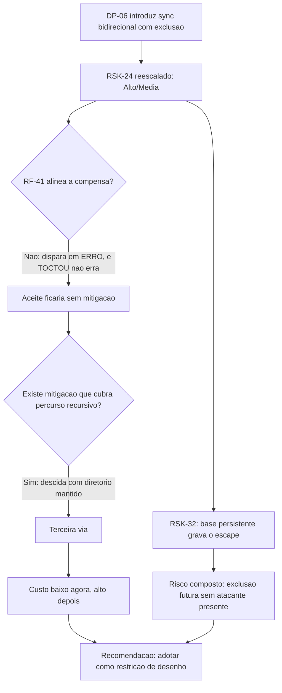

# Parecer do QA Expert — `DP-26`: reavaliacao de `RSK-24` sob percurso recursivo

## Identificacao

| Campo | Valor |
|---|---|
| Projeto | `dropbox_api` — CLI em shell para a Dropbox API v2 |
| Objeto | `DP-26` — reconfirmar, ou nao, o aceite de `RSK-24` (TOCTOU no confinamento local) agora que `DP-06` introduziu `sync` bidirecional com propagacao de exclusao |
| Natureza | Parecer de risco **em tempo de desenho**. O `sync` ainda nao existe em codigo |
| Data | 2026-08-18 |
| Gate | `TL-08` |
| **Recomendacao** | **Nao manter o aceite na forma atual. Adotar a terceira via da secao 4** — restricao estrutural de travessia, e nao verificacao de caminho |

---

## 1. Resumo da recomendacao

Tres coisas, na ordem em que decidem:

1. **`RF-41(a)` nao compensa `RSK-24`.** Ela dispara em **erro** de travessia; um TOCTOU bem-sucedido **nao produz erro**. Registrar `RF-41(a)` como mitigacao compensatoria de `RSK-24`, como o texto atual do risco propoe, fecharia `DP-26` com uma defesa que nao toca o risco.
2. **O escape deixou de ser teorico.** Reproduzi-o contra o codigo em producao hoje, com exclusao efetiva fora da raiz confinada.
3. **Existe mitigacao que cobre percurso recursivo** — a condicao que o proprio aceite de v0.6 fixou para revisitar o risco. Ela nao e a que foi avaliada e recusada; e uma restricao sobre **como** a travessia caminha, e custa quase nada porque o `sync` ainda nao foi escrito.

---

## 2. O escape, reproduzido contra o codigo atual

Com `lib/path.sh` como esta hoje:

```
dbx_path_local_confinar "$W/raiz" "sub/arq"   -> st=0, alvo = raiz/sub/arq
mv raiz/sub raiz/sub.antigo && ln -s "$W/fora" raiz/sub     # a janela
rm -rf "$(dirname "$alvo")/importante"
-> fora/importante  APAGADO
```

O confinamento aprovou, o `rename` trocou, e a exclusao saiu da raiz. Nao ha defeito em `lib/path`: a funcao cumpre o contrato que tem, que e resolver **no instante em que e chamada**. O defeito e do padrao "resolver e depois usar o caminho absoluto".

Duas observacoes de comportamento que orientam onde concentrar a defesa:

| Situacao | `rm -r` |
|---|---|
| symlink no **ultimo** componente | **nao segue** — remove o proprio link. A vitima sobrevive |
| symlink em componente **intermediario** | **segue** — remove fora da raiz |

Ou seja: **todo o perigo esta nos componentes intermediarios**, nao na folha. Isso e o que torna a terceira via viavel, porque e exatamente o que a descida elimina.

---

## 3. Por que `RF-41(a)` nao e suficiente sozinha

`RF-41(a)`: qualquer **erro** de travessia desabilita integralmente a propagacao de exclusao naquela execucao.

Concordo com o Business Analyst que ela e mais valiosa que o teto, e pelo motivo certo: o caso **parcial** passa despercebido por parecer plausivel, e uma arvore truncada em 30% e indistinguivel de uma exclusao legitima de 30%. Contra `RSK-29` ela e a defesa correta, e a remocao do teto em `DP-24` fica de fato compensada por ela **no eixo de volume**.

Mas `RSK-24` esta em outro eixo. Um TOCTOU bem-sucedido:

- **nao gera erro** — a travessia conclui normalmente;
- **nao trunca** a arvore — ela fica completa, so que de outro lugar;
- **nao dispara nenhuma das quatro alineas** de `RF-41`.

`RF-41(a)` protege contra **arvore incompleta**. `RSK-24` produz **arvore completa e errada**. Sao riscos ortogonais, e nenhuma quantidade da primeira defesa cobre a segunda.

**Recomendo corrigir o texto de `RSK-24`**, que hoje diz que, mantido o aceite, `RF-41(a)` "passa a ser a mitigacao compensatoria de fato". Nao passa. Se o aceite for mantido, ele fica **sem** mitigacao compensatoria, e e melhor que o registro diga isso.

---

## 4. A terceira via — travessia por descida, com nome relativo

### O que e

Nunca reconstruir caminho absoluto para operar. Descer um nivel por vez, mantendo o diretorio **aberto**, e operar sempre com nome **relativo** a partir dele.

Em `bash`, `cd` cumpre o papel do descritor de diretorio: o processo passa a referenciar o **inode**, e nao o texto do caminho. Troca posterior de qualquer componente ja percorrido deixa de ter efeito.

### Verificado

```
( cd raiz2 && cd sub
  mv raiz2/sub raiz2/sub.antigo ; ln -s fora2 raiz2/sub     # a mesma janela
  rm -f importante )                                        # nome RELATIVO
-> fora2/importante  SOBREVIVEU
```

A mesma janela que apaga fora da raiz pelo caminho absoluto **nao tem efeito** sob descida. E o equivalente em shell de `openat` com `O_NOFOLLOW` por componente, que foi exatamente o que eu registrei como indisponivel quando avaliei a mitigacao anterior. Estava certo sobre `openat`; estava incompleto ao concluir dai que nao havia mitigacao para percurso recursivo.

### Por que cobre o que a mitigacao anterior nao cobria

A mitigacao avaliada em v0.6 — validar por `/proc/self/fd` com comparacao de dispositivo e inode — protege **um arquivo ja aberto**. Por isso eu registrei que ela nao cobre percurso recursivo: numa travessia, o que precisa de protecao nao e o arquivo, sao os **diretorios do caminho**. A descida protege justamente esses, porque cada um deles passa a ser uma referencia mantida, e nao um texto a reinterpretar.

### Custo

| Opcao | Custo | Cobre percurso recursivo? |
|---|---|---|
| **Manter o aceite** | Zero em desenvolvimento. Em risco: exclusao fora da raiz demonstrada, sem teto (`DP-24`), no caminho quente do comando principal, e **sem mitigacao compensatoria** | — |
| **Mitigar como avaliado em v0.6** (`/proc/self/fd`, dispositivo+inode) | Alto: muda a API para devolver descritor, atinge `lib/transfer` e `lib/stream` | **Nao** — protege o caso menos frequente |
| **Terceira via** (descida + nome relativo) | **Baixo, se imposto agora**: e uma restricao sobre como escrever a travessia do `sync`, que ainda nao existe. Nenhuma mudanca de API nos componentes atuais, nenhuma dependencia nova, nenhum estado novo. Alto se aplicado depois, porque implica reescrever a travessia | **Sim** |

O aceite de v0.6 fixou a condicao para revisitar: *"revisitar apenas se surgir mitigacao que cubra percurso recursivo e compare identidade de inode"*. A descida cumpre as duas: cobre percurso recursivo e opera sobre identidade de inode em vez de texto de caminho. **A condicao que o proprio aceite estabeleceu esta satisfeita.**

### Limite honesto da proposta

A descida protege os componentes **ja percorridos**. Ela nao protege a troca do componente **imediatamente antes** de descer nele — a janela entre verificar e `cd` continua existindo, so que reduzida a um unico nivel por vez, e sem propagacao para o resto da arvore. Isso e reducao de superficie, nao eliminacao. Registro para que o desenho nao a trate como garantia absoluta e para que a decisao seja tomada sabendo disso.

---

## 5. Interacao com `RSK-32` — o risco composto que ainda nao esta registrado

O Business Analyst esta certo em separar cursor de enumeracao e linha de base. Verifiquei a direcao segura e ela e segura: **base ausente nao produz exclusao** — sem base nao ha orfao, e `RF-38`/`RF-42` ja fixam a degradacao para "novo nos dois lados".

O que nao esta registrado e a direcao oposta, e ela e mais grave:

> Uma travessia que escapou por TOCTOU **grava a linha de base com caminhos de fora da raiz**. Na execucao seguinte esses caminhos nao estao na arvore real, sao classificados como orfaos, e a propagacao de exclusao os apaga — **com o atacante ausente**.

A linha de base ser **persistente** muda a natureza de `RSK-24`: o escape deixa de ser um evento no instante do ataque e passa a ser **estado gravado que produz exclusao em execucoes futuras**. `RSK-24` e `RSK-32` compoem, e o produto e maior que qualquer um dos dois.

Consequencia de desenho, que recomendo fixar: **a linha de base so pode registrar entrada verificada dentro da raiz pela mesma descida que a leu**, nunca por re-resolucao posterior de caminho. Sob a terceira via isso e automatico; sob o desenho por caminho absoluto, e mais uma verificacao a lembrar de fazer — e a secao 7 do meu parecer anterior diz por que "lembrar de fazer" nao escala.

### E `PRJ-DEC-07`

O `sync` introduz o **primeiro estado local persistente desde o arquivo de credencial**: cursor e linha de base. `RSK-23` passa a ter um segundo objeto de vigilancia, e este e **relevante para seguranca**, porque dirige exclusoes. O criterio de integridade da base — versao de formato, verificacao, escrita atomica, ja previstos em `RF-38`, `RF-42` e `RNF-25` — deixa de ser higiene e vira controle de seguranca. Vale registrar com esse peso.

---

## 6. Efeito de `DP-21`, `DP-22` e `DP-24` sobre este parecer

Nao reabro as tres — sao decisoes do solicitante. Registro apenas o efeito combinado sobre `DP-26`, porque ele altera o calculo:

- `DP-21` (ultimo a escrever vence) e `DP-22` (honrar a exclusao) removem o comportamento **falha fechado** do caminho destrutivo: diante de ambiguidade, o sistema age em vez de recusar.
- `DP-24` (sem teto) remove o limite de volume.

Com as tres, **nao resta nenhuma salvaguarda que dependa de o sistema hesitar**. Todas as que sobram dependem de o sistema **enxergar a arvore certa**. Isso desloca todo o peso para a corretude da travessia — que e precisamente o que `RSK-24` ataca. E o argumento mais forte a favor de resolver `RSK-24` estruturalmente, e nao por aceite.

---

## 7. Recomendacao formal

**Nao manter o aceite na forma atual.** Especificamente:

1. **Adotar a terceira via como restricao de desenho do `sync`**, antes de a travessia entrar em codigo: descida com diretorio mantido, operacao por nome relativo, proibicao de reconstruir caminho absoluto para operacao destrutiva. Custo baixo agora, alto depois.
2. **Corrigir o texto de `RSK-24`**: `RF-41(a)` nao e mitigacao compensatoria deste risco. Se o solicitante ainda assim optar por manter o aceite, que ele fique registrado **sem** mitigacao compensatoria, o que e uma decisao legitima mas precisa aparecer como e.
3. **Registrar o risco composto `RSK-24` x `RSK-32`** da secao 5, com a regra de que a linha de base so registra o que a propria descida verificou.
4. **Elevar o criterio de integridade da linha de base a controle de seguranca**, e nao apenas de corretude.
5. Se, mesmo assim, o aceite for mantido: recomendo condicionar `--delete` a **confirmacao explicita por execucao** e a modo de simulacao obrigatorio na primeira execucao de cada raiz. Nao substitui a correcao estrutural; apenas coloca um humano na janela em que a defesa nao existe.

### Verificacoes que o QA vai exigir quando o `sync` chegar

- Caso adversarial que troque componente intermediario **durante** a travessia e exija que nenhuma exclusao ocorra fora da raiz.
- Caso que verifique que a linha de base nao registra caminho fora da raiz apos travessia sob ataque.
- Auditoria estatica que reprove reconstrucao de caminho absoluto no caminho de exclusao — no espirito da secao 7 do parecer anterior: a regra so protege se alguem enumerar os lugares onde ela incide.

---

## 8. Nota sobre o meu proprio registro anterior

O aceite de v0.6 se apoiou, entre outros, num argumento meu: que a mitigacao avaliada nao cobria percurso recursivo. **O argumento estava correto e a conclusao que dele se tirou foi longe demais** — inclusive por mim. De "esta mitigacao nao cobre percurso recursivo" nao se segue "nao ha mitigacao que cubra"; e eu nao procurei a segunda, porque na epoca nao havia percurso recursivo no escopo e a pergunta parecia fechada.

Registro como instancia da mesma familia que venho apontando: o limite nao foi de conhecimento, foi de **nao enumerar as alternativas** quando a premissa que tornava a pergunta irrelevante ainda valia. A diferenca desta vez e que a premissa caiu e a pergunta voltou — e voltou a tempo, porque o codigo ainda nao existe.

---

## 9. Fluxo da decisao



---

## 10. Desvios de protocolo

| Desvio | Justificativa |
|---|---|
| Cypress (item 13) | Nao aplicavel: nao ha interface web ou grafica |
| `qa-validacao-frontend-template.md` | Nao aplicavel: nao ha Design System |
| `prompt-logger` (item 2) | Nao acionado, por instrucao do coordenador |

Este e parecer de risco em tempo de desenho, e nao validacao de implementacao: o `sync` ainda nao existe. As demonstracoes da secao 2 e da secao 4 foram executadas contra o codigo atual e contra arvores descartaveis fora do repositorio. Nenhum arquivo de codigo, teste ou requisito foi alterado. Sem commit, sem push, nada instalado.
