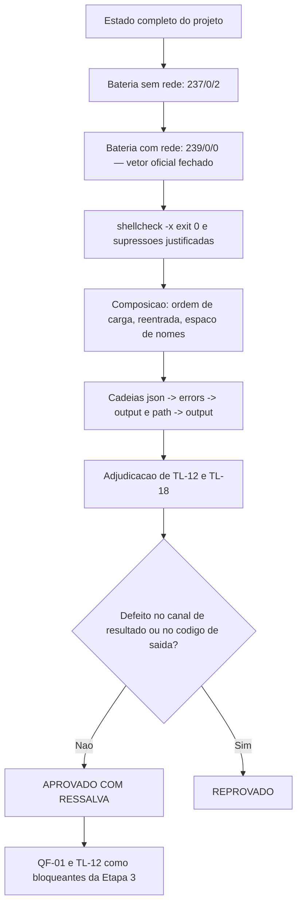

# Parecer Final de Validacao Independente — QA Expert — Estado Completo

## Identificacao

| Campo | Valor |
|---|---|
| Projeto | `dropbox_api` — CLI em shell para a Dropbox API v2 |
| Escopo | **Estado completo**: `lib/hash`, `lib/errors`, `lib/path`, `lib/json`, `lib/output`, harness e suite |
| Natureza | Validacao de **conjunto**, nao de incremento. Os seis ciclos anteriores validaram partes |
| Data | 2026-08-18 |
| Gate | `TL-08` |
| Branch | `feature/camada-dominio-e-adaptadores`, arvore limpa, PR #1 aberto para `develop` |
| **Decisao** | **APROVADO COM RESSALVA** |
| Bloqueantes para a Etapa 3 | `QF-01` (novo, achado nesta validacao) e `TL-12` |

> **Nota de independencia.** Registro que o pedido chegou acompanhado da expectativa de aprovacao e que o coordenador explicitamente nao a instruiu. Este parecer nao aprova por solicitacao: aprova porque a bateria completa passou e porque os defeitos encontrados, descritos abaixo, nao comprometem o contrato primario da entrega. A secao 8 declara o que teria produzido reprovacao.

---

## 1. Bateria executada

| Execucao | Comando | Resultado |
|---|---|---|
| Suite sem rede | `bash tests/run.sh` | **237 aprovados / 0 reprovados / 2 pulados** |
| Suite com rede | `DBX_TESTES_REDE=1 bash tests/run.sh` | **239 aprovados / 0 reprovados / 0 pulados** |
| Analise estatica | `~/.local/bin/shellcheck -x` sobre `lib/*.sh`, `tests/run.sh`, `tests/support/*.sh`, `tests/unit/*.sh` | **exit 0** |
| Sintaxe | `bash -n` em todos os arquivos | limpo |

Os dois casos que ficavam pulados fecharam com rede: o **vetor oficial de `content_hash`** foi confirmado contra o arquivo real publicado pela Dropbox, por arquivo e por fluxo. `RF-34` esta verificado ponta a ponta, e nao por vetor derivado.

Supressoes de `shellcheck`: 24 no total (12 em `lib/json.sh`, as demais na suite). Verifiquei que **todas** trazem justificativa no comentario, como `RNF-13` exige. O numero difere do informado (7), sem consequencia.

`DP-20` confirmada: `LICENSE` traz `Copyright (c) 2026 Adriano Sales Santos`, zero espacos reservados remanescentes. Registro a observacao ja levantada de que `origin/master` ainda carrega o texto antigo — correto, porque o PR aponta para `develop`, mas isso precisa entrar no fechamento para nao virar divergencia esquecida.

---

## 2. Composicao: o que so aparece com tudo junto

Esta e a parte que os seis ciclos anteriores nao podiam cobrir.

### Integridade estrutural do conjunto — sem defeito

| Verificacao | Resultado |
|---|---|
| Carregamento nas 6 ordens possiveis das 5 bibliotecas | todas OK, sem colisao de `readonly` |
| Carregamento duplo e triplo | OK, guardas de reentrada funcionam |
| Variaveis globais introduzidas | errors 16 · hash 11 · path 7 · json 31 · output 11, **sem colisao entre componentes** |
| Globais sem prefixo `DBX_` | **nenhuma** |
| Funcoes publicas | 36, **todas** com prefixo `dbx_`, sem colisao |
| Coerencia do contrato de saida (`RF-29`) | `path` 13/3/2 · `json` 10/10/2 · `hash` 4/2 · `output` 2 · `errors` 2 — todos aderentes a taxonomia |

### QF-01 · MEDIA-ALTA — o canal de diagnostico permite **forjar registro** com dado do servico remoto

**Defeito de composicao.** Cada componente esta individualmente correto; o defeito so existe quando os tres operam em cadeia.

`dbx_output_render` recebeu, no ciclo 1, a guarda de seguranca de linha que eu havia exigido em `E2-05`: valor com quebra em modo linha e recusado com status 2, sem saida parcial. **`dbx_output_render_diagnostico` nao recebeu a mesma guarda.**

Cadeia verificada ponta a ponta:

```
lib/json    decodifica corretamente "\n" dentro de error_summary
lib/errors  preserva a formatacao na redacao (melhoria correta do ciclo 2)
lib/output  emite o valor cru no canal de diagnostico, sem validar
```

Reproducao com corpo de erro controlado pelo servico:

```
corpo: {"error_summary":"path/not_found/.\nhttp_status=200\nresultado=sucesso"}

alimentado:  http_status=409
             detalhe=<error_summary>

emitido:     http_status=409
             detalhe=path/not_found/.
             http_status=200          <- registro FORJADO
             resultado=sucesso        <- registro FORJADO
```

Dois registros `http_status` onde um foi alimentado, e o forjado afirma `200`. Um consumidor que leia o ultimo valor conclui sucesso onde houve `409`.

Comparacao entre os dois canais, medida:

| Funcao | Valor com quebra em modo linha |
|---|---|
| `dbx_output_render` | **status 2**, nada emitido |
| `dbx_output_render_diagnostico` | **status 0**, 4 registros onde 3 foram alimentados |

Confirmei tambem que a cadeia dispara com mensagem real: `error_summary` com quebra passa por `dbx_errors_mensagem` e produz 3 linhas onde 2 foram alimentadas.

**Atenuantes, que sustentam a ressalva em vez da reprovacao:** o canal de resultado (`stdout`), que e o contrato de automacao de `RF-28`, esta correto e guardado; o codigo de saida nao e afetado (segue `6`/`permissao`); a redacao por valor funciona e nenhum segredo vaza — verifiquei `authorization=Bearer [REDIGIDO]`; e `lib/http`, unico consumidor previsto, ainda nao existe.

**Agravantes:** `RF-30` existe para que o identificador de requisicao seja legivel por maquina no diagnostico; `RF-28` e P0 e exige registros parseaveis; e registro forjado e qualitativamente pior que registro corrompido. Alem disso, e a mesma classe de `E2-05`, corrigida em **um** dos dois canais — uma correcao parcial com aparencia de completa.

Correcao: aplicar a guarda existente ao segundo canal. Custo proximo de zero.

### QF-02 · BAIXA — negacao de diagnostico controlada pela origem

Cadeia confirmada: `lib/json` decodifica `\u0001` ou `\u001f` de um `error_summary` para byte de controle cru; `dbx_errors_redigir` entao recusa o texto inteiro e devolve `[REDIGIDO: corpo com caractere de controle, nao analisavel]`.

A classificacao continua correta (`nao_encontrado`) e o codigo de saida tambem, entao **nao ha falha de seguranca nem de contrato** — o comportamento e fechado. Mas o operador perde a mensagem, por escolha do lado remoto. Vale documentar como limitacao conhecida.

### QF-03 · BAIXA — o status de `dbx_json_analisar` medido por `$( )` depende de estado alheio

Consequencia da guarda de subshell (`E4-02`, ciclo 3): medir o status por substituicao de comando devolve `2` quando **outro** contexto tem analise viva, e o status real quando nao tem. Medi as duas situacoes no mesmo processo.

Como `$( )` e a forma natural de qualquer chamador ou teste sondar um status, isto torna o contrato de `lib/json` **nao observavel de forma confiavel pelo caminho mais obvio**. Reforca a recomendacao do ciclo 3: recusar analise em subshell de forma uniforme, para que a regra caiba em uma frase e o status pare de depender do contexto vizinho.

---

## 3. Adjudicacao de `TL-12`

**Concordo integralmente com o diagnostico, com a severidade e com a classificacao como bloqueante da Etapa 3. E acrescento uma consequencia que ainda nao estava registrada.**

Confirmei que as oito tags reais do contrato de erro passam pela guarda:

```
path · conflict · too_many_write_operations · incorrect_offset
restricted_content · reset · other · not_found      -> todas status 0
```

A guarda limita **alfabeto** (`^[a-z_]+$`), nao **procedencia**. As duas auditorias estaticas existentes buscam `[$]\((_dbx_|dbx_)` e `[$]\(printf`; nenhuma alcanca `dbx_json_contexto "$tag"`. Casos sobre procedencia na suite: **zero**. O criterio 3 de `RNF-24` esta, de fato, sem instrumento.

**Consequencia que acrescento, medida:** derivar nome de contexto de tag nao e apenas uma brecha de procedencia — produz **colisao de contexto com perda de documento**. Dois corpos de erro distintos cujas tags coincidem gravam no mesmo contexto, e o segundo destroi o primeiro:

```
dbx_json_contexto path; dbx_json_analisar '{"k":"PRIMEIRO"}'
dbx_json_contexto path; dbx_json_analisar '{"k":"SEGUNDO"}'
dbx_json_valor k   ->  SEGUNDO
```

Isto e exatamente o modo de falha que o contexto nomeado foi criado para impedir. Eleva o item de "risco de procedencia" para "perda de dado silenciosa se um chamador derivar o nome do corpo".

### Sobre o meu proprio parecer do ciclo 3

**O Tech Lead esta certo, e assumo o erro.** Escrevi "`RNF-24` satisfeito, com recusa fechada em nove formas invalidas" e citei como pinagem a mutacao que permite origem externa no **validador**. Isso e verdadeiro para os criterios de alfabeto e de recusa fechada, e **falso para o criterio 3**, que trata de procedencia em sitio de chamada — propriedade diferente, que eu nao testei.

Foi `RSK-27` reincidindo, e da forma que `RSK-27` descreve: **aceitei uma mutacao vizinha como equivalente a mutacao que o criterio enuncia**. A mutacao que rodei ataca o validador; o criterio 3 pede uma auditoria sobre quem chama. O Tech Lead so encontrou porque escreveu a mutacao que o criterio descreve, em vez de a que estava a mao — que e precisamente a disciplina que `RSK-27` prescreve e que eu nao apliquei a mim mesmo.

Recomendo que o registro de `RSK-27` incorpore este caso, porque ele demonstra a regra com o QA como sujeito: **um criterio de aceite com N partes exige N instrumentos, e cobertura de N-1 partes nao autoriza declarar o criterio satisfeito.**

---

## 4. Adjudicacao de `TL-18`

**Confirmado, severidade baixa, correcao documental.**

```
comentario (linhas 330-331): nenhuma, recuo_exponencial, respeitar_retry_after,
                             renovar_token_uma_vez, reiniciar, indeterminado   (6)
emitidos pelo codigo:        os 6 acima + retomar                              (7)
```

Codigo e suite concordam; apenas a enumeracao legivel esta incompleta. A observacao de que `lib/http` lera a enumeracao antes do codigo procede, e `retomar` e justamente o valor que governa retomada de sessao em partes — omiti-lo do contrato legivel e o pior dos sete a esquecer.

---

## 5. Dimensionamento da confianca (`DIV-17`)

`DIV-17` continua valendo, e este ciclo ilustra o ponto: a suite passou de 233 para 237 casos e **nenhum deles cobre a composicao**, que e onde encontrei `QF-01`. Contagem nao mede confianca em terreno nao exercitado.

O terreno exercitado por esta validacao, e que a suite nao cobre:

| Terreno | Casos na suite | Sondado por mim |
|---|---|---|
| Ordem de carregamento entre os 5 componentes | 0 | 6 ordens |
| Carregamento repetido | 0 | duplo e triplo |
| Colisao de espaco de nomes entre componentes | 0 | todas as globais e funcoes |
| Cadeia json -> errors -> output | 0 | 4 cadeias, 1 defeito |
| Coerencia de codigo de saida entre componentes | parcial, por componente | 10 situacoes |

Recomendo, para a Etapa 3, uma suite de composicao com estes cinco eixos — hoje nao existe arquivo de teste de integracao entre componentes.

---

## 6. Estado consolidado das validacoes anteriores

| Ciclo | Escopo | Decisao | Estado hoje |
|---|---|---|---|
| 1-3 | Camada de dominio (`hash`, `errors`, `path`) | REPROVADO, REPROVADO, APROVADO COM RESSALVA | ressalvas fechadas |
| 4-6 | `json` e `output`, contexto nomeado | REPROVADO, APROVADO COM RESSALVA, APROVADO COM RESSALVA | `E4-01` a `E4-04` — ver secao 7 |
| 7 (este) | Estado completo | **APROVADO COM RESSALVA** | `QF-01` a `QF-03`, `TL-12`, `TL-18` |

Reverifiquei nesta rodada, por amostragem dirigida: injetividade da chave de no, guarda de linha no canal de resultado, redacao por valor no canal de diagnostico, coerencia classe x politica, taxonomia de erro e confinamento de caminho. Nenhuma regressao.

---

## 7. Condicoes para o fechamento

**Bloqueantes da Etapa 3** (nao impedem o fechamento da Etapa 2; impedem `lib/http`):

1. **`QF-01`** — aplicar a `dbx_output_render_diagnostico` a mesma guarda de seguranca de linha ja presente em `dbx_output_render`, com caso que verifique **registro forjado**, e nao apenas registro corrompido.
2. **`TL-12`** — instrumento para o criterio 3 de `RNF-24`, com a mutacao que o criterio enuncia. Incluir o caso de **colisao de contexto com perda de documento** demonstrado na secao 3.

**Corrigir antes do proximo incremento:**

3. `TL-18` — completar a enumeracao com `retomar`.
4. `QF-03` — uniformizar a recusa de analise em subshell.
5. `E4-01` e `E4-04` do ciclo 3 — registrar `FIM` no ramo de lixo apos o documento e pinar o ciclo de vida no caminho de excecao.
6. `QF-02` — documentar a negacao de diagnostico por caractere de controle como limitacao conhecida.

**Registrar como aceito:**

7. Bateria completa aprovada, **incluindo rede**: `RF-34` verificado contra o vetor oficial real.
8. `RNF-13` atendido: `shellcheck -x` exit 0, todas as supressoes justificadas.
9. Composicao dos cinco componentes integra: ordem de carga, reentrada, espaco de nomes e coerencia de codigos de saida.
10. `DP-20` resolvida; sinalizar a divergencia remanescente em `origin/master`.
11. `TL-12` e `TL-18` confirmados; `TL-12` com consequencia agravada (secao 3).
12. Correcao do meu proprio parecer do ciclo 3 sobre `RNF-24` (secao 3), para incorporacao a `RSK-27`.

---

## 8. O que teria produzido reprovacao

Declaro o criterio, para que a aprovacao seja auditavel:

- Qualquer colisao no espaco de chaves de `lib/json` — testada de novo, **nao ocorre**.
- Qualquer valor errado devolvido com status de sucesso em `path`, `hash` ou `json` — **nao ocorre**.
- Vazamento de segredo por `dbx_errors_redigir` ou pelo canal de diagnostico — **nao ocorre**.
- Falha do vetor oficial de `content_hash` com rede — **nao ocorre**.
- Defeito de composicao que afetasse o **canal de resultado** ou o **codigo de saida** — `QF-01` afeta apenas o canal de diagnostico, e por isso e ressalva bloqueante da Etapa 3, e nao reprovacao.

Se o Tech Lead preferir fechar a Etapa 2 sem bloqueante aberto, `QF-01` e correcao curta: a guarda ja existe e basta aplica-la ao segundo canal.

---

## 9. Fluxo de validacao



---

## 10. Desvios de protocolo

| Desvio | Justificativa |
|---|---|
| Cypress (item 13) | Nao aplicavel: nao ha interface web ou grafica |
| `qa-validacao-frontend-template.md` (itens 17 e 19) | Nao aplicavel: nao ha Design System nem handoff do UX Expert |
| `prompt-logger` (item 2) | Nao acionado, por instrucao do coordenador |

Nenhum arquivo de codigo, teste ou requisito foi alterado por esta validacao; sondas e mutacoes ocorreram em copias descartaveis fora do repositorio. Arvore limpa, sem commit, sem push, nada instalado.
