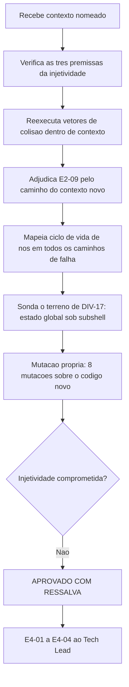

# Parecer de Validacao Independente — QA Expert — Ciclo 3

## Identificacao

| Campo | Valor |
|---|---|
| Projeto | `dropbox_api` — CLI em shell para a Dropbox API v2 |
| Escopo validado | Etapa 2: contexto nomeado em `lib/json.sh`, fechamento de `E3-01` a `E3-07`, e o ciclo de vida de nos |
| Ciclos anteriores | [ciclo 1](2026-08-18_qa-validacao-lib-json-e-lib-output.md) (REPROVADO) · [ciclo 2](2026-08-18_qa-validacao-lib-json-e-lib-output-ciclo2.md) (APROVADO COM RESSALVA) |
| Data | 2026-08-18 |
| Gate | `TL-08` |
| Branch validada | `feature/camada-dominio-e-adaptadores`, dez commits, arvore limpa |
| **Decisao** | **APROVADO COM RESSALVA** |

---

## 1. Decisao

**APROVADO COM RESSALVA.**

As sete ressalvas do ciclo 2 estao fechadas e verificadas de forma independente. O contexto nomeado resolve corretamente o problema que `E3-01` apontava — `lib/http` interpretando corpo de erro sem destruir a listagem em curso — e o faz **sem tocar na composicao de chave**, que era a preocupacao central.

Ressalvas remanescentes: uma de severidade media-baixa (vazamento de nos em um caminho de falha especifico) e tres de severidade baixa, das quais duas sao de registro e nao de codigo.

---

## 2. A pergunta central: a injetividade continua valendo?

**CONFIRMADA. O argumento do ciclo 2 vale palavra por palavra.**

Verifiquei as tres premissas de que ele depende, e nao apenas o resultado:

| Premissa | Verificacao | Resultado |
|---|---|---|
| O contexto nao entra na chave | Leitura de `_dbx_json_criar_filho`: a chave continua sendo `<id do pai><separador><segmento>` | confirmada |
| Os identificadores sao globalmente unicos no processo | `DBX_JSON_PROXIMO_ID` so e incrementado; `_dbx_json_liberar_contexto` **nao** o decrementa. Medido em tres analises consecutivas do mesmo contexto: 25, 29, 33 — monotonico, **sem reuso** | confirmada |
| O lado esquerdo da composicao e sempre digito | Identificadores sao inteiros alocados por `$((++DBX_JSON_PROXIMO_ID))` | confirmada |

Reexecutei os vetores de colisao do ciclo 2 **dentro de contexto nomeado**, mais um vetor novo especifico do recurso:

| Vetor | Resultado |
|---|---|
| Separador escapado no segmento, forjado depois do legitimo | `ANINHADO` — sem colisao |
| Separador escapado, forjado antes do legitimo | `ANINHADO` — sem colisao |
| Segmentos numericos (`0` sob `0`) | `REAL` — sem colisao |
| Separador aninhado duplo (`1`, `2`, `3`) | `REAL` — sem colisao |
| **Novo: mesmo segmento em dois contextos distintos** | `ca/k` = `DE-CA`, `cb/k` = `DE-CB` — isolados |

E a pinagem e forte: a mutacao que **insere o contexto na chave** reprova **29 casos**. O caminho pelo qual `E2-01` poderia voltar esta explicitamente fechado por teste.

Consequencia pratica: como os identificadores nunca sao reusados, uma chave pertence a exatamente um pai, que pertence a exatamente um contexto. Liberar um contexto nao pode remover chave de outro. Verifiquei o isolamento na pratica no caso de uso real (secao 4).

---

## 3. Adjudicacao do E2-09 pelo caminho do contexto novo

**Veredicto: RESSALVA, nao defeito. Mas a justificativa oferecida esta errada e nao deve ser registrada como esta.**

### Caracterizacao completa

| Cenario | `analisar` | Consulta depois | Valor errado devolvido? |
|---|---|---|---|
| Mesmo contexto, subshell | **status 2** (recusa) | documento antigo, status 0 | nao |
| **Contexto novo, subshell** | **status 0** | **status 1** (falha fechada) | **nao** |
| Subshell autocontido, contexto novo | status 0 | valor correto **dentro** do subshell | nao |
| Nos alocados no subshell | nao alteram o pai (4 nos vivos antes e depois) | — | nao |
| Contexto anterior | intacto (`cursor` = `ABC`) | — | nao |

### Por que e ressalva, e nao defeito

O defeito que descrevi no `E2-09` tinha **duas metades conjugadas**:

- (a) o componente reporta sucesso para trabalho que sera descartado;
- (b) a consulta seguinte responde silenciosamente pelo documento anterior, **com status 0**.

O perigo vinha da conjuncao: o chamador age sobre (a) e e confirmado por (b). Pelo caminho do contexto novo, **(b) esta fechada** — a consulta devolve status 1. Verifiquei explicitamente que **nao existe janela em que um valor errado seja devolvido**.

Resta (a) isolada: um status que mente para o processo pai. Isso e real, mas nao tem caminho para dado errado; o pior desfecho e um chamador que trate `0` como "consultavel" e descubra o contrario na chamada imediatamente seguinte. Severidade baixa.

### Por que a justificativa do dev nao se sustenta

A afirmacao de que *"o caso legitimo e o caso perigoso sao distinguiveis, entao nao precisei consultar"* **e falsa**, e e a mesma indistinguibilidade que registrei em `E3-01` no ciclo anterior: **no momento do `analisar`, a guarda nao tem como saber** se o chamador vai consultar dentro do subshell (legitimo) ou no pai (enganoso). Nada no estado disponivel naquele ponto separa os dois.

O que de fato aconteceu e diferente, e melhor: **o caso indistinguivel foi tornado inofensivo**, porque a consequencia migrou de "valor errado" para "falha fechada". Esse argumento sustenta a decisao; o oferecido nao.

A distincao importa por uma razao concreta: registrar o raciocinio errado poderia justificar, no futuro, **relaxar tambem a guarda do mesmo contexto** — onde (b) NAO esta fechada e o resultado seria a volta integral do `E2-09`.

### Recomendacao

Com o contexto nomeado implementado, o subshell perdeu a ultima finalidade legitima: `lib/http` agora tem o mecanismo proprio. Sugiro recusar `analisar` em qualquer subshell cujo `BASHPID` difira do processo dono do pool, independentemente de o contexto ser novo. Custo proximo de zero, e a regra passa a caber em uma frase e o status para de mentir.

---

## 4. Defeitos e ressalvas

### E4-01 · MEDIA-BAIXA — vazamento de nos no caminho "lixo apos o documento"

O ciclo de vida foi adicionado exatamente para impedir acumulo entre paginas. Ele funciona em todos os caminhos, **exceto um**.

`_dbx_json_liberar_contexto` so libera quando `INICIO` **e** `FIM` estao definidos. O ramo de lixo apos o fim do documento chama `_dbx_json_falhar` e retorna **sem registrar `FIM`** — ao contrario do ramo de falha de `_dbx_json_ler_valor`, que o registra. Sem `FIM`, toda liberacao futura daquele contexto retorna cedo, e `INICIO` e sobrescrito a cada nova analise, orfanando as faixas anteriores em definitivo.

Reproducao:

```
contexto novo, uma analise valida        -> 21 nos vivos
5 analises de '{"a":1,"b":2,"c":3,"d":4}extra'  -> 41 nos vivos
INICIO=89   FIM=<ausente>
```

Comparacao com os demais caminhos de falha, todos corretos:

| Entrada | Vazou? |
|---|---|
| `{"a":1}extra` | **sim** |
| `{"a":1,}` · `{"a":` · `[1,2` · `{"a" 1}` · `nao-json` · vazia | nao |

Reanalise valida repetida nao acumula (16 nos antes e depois de cinco repeticoes) — a liberacao normal esta correta.

Alcance: `{"a":1}extra` e uma das sete entradas malformadas que a propria suite exercita, entao e alcancavel por resposta de servico ou de intermediario. O crescimento e limitado por ocorrencia, mas ilimitado ao longo de um processo de vida longa, que e precisamente o cenario de listagem paginada que motivou o recurso.

**A mutacao correspondente nao e detectada** — ver `E4-04`.

### E4-02 · BAIXA — `analisar` devolve 0 para trabalho descartado, pelo caminho do contexto novo

Adjudicado na secao 3. Sem caminho para valor errado; o status e que engana o processo pai.

### E4-03 · BAIXA (registro) — a justificativa de `E4-02` precisa ser corrigida antes de virar registro

Ver secao 3. O raciocinio correto e "o caso indistinguivel foi tornado inofensivo", nao "os casos sao distinguiveis".

### E4-04 · BAIXA — tres mutacoes sobreviventes, uma delas material

Varredura propria de oito mutacoes sobre o codigo novo:

| Mutacao | Reprovacoes |
|---|---|
| Contexto entra na chave (reabriria `E2-01`) | **29** |
| Nome de contexto aceita origem externa (`RNF-24`) | 3 |
| Guarda deixa de ser por contexto | 3 |
| Identificadores passam a ser reusados | 2 |
| Remove a liberacao de nos entre analises | 1 |
| Contexto nao espelha `DBX_JSON_ANALISADO` ao trocar | 0 — quase nula |
| `descartar` nao zera `ANALISADO` do contexto | 0 — quase nula |
| **`FIM` deixa de ser registrado no caminho de falha** | **0 — MATERIAL** |

As duas primeiras sobreviventes sao **quase nulas** no sentido de `RSK-27`: verifiquei que a consulta ja falha fechada por outro caminho (`_dbx_json_pronto` le o mapa por contexto, e a busca falha sobre nos liberados), entao a mutacao afeta apenas o espelho de diagnostico. Devem ser tratadas fixando a invariante — "trocar de contexto reflete o estado do contexto selecionado" — e nao a mutacao.

A terceira **nao e nula**: e o mesmo caminho de codigo de `E4-01`, e removê-lo estende o vazamento a todos os caminhos de falha sem que nada reprove. O ciclo de vida de nos, que e o mecanismo novo desta entrega, esta hoje sem protecao no seu caminho de excecao.

---

## 5. Fechamento das ressalvas do ciclo 2

| Ressalva | Estado | Verificacao independente |
|---|---|---|
| `E3-01` guarda x documentacao | **fechada** | O texto contraditorio nao existe mais; o caso de uso migrou para contexto nomeado, verificado ponta a ponta |
| `E3-02` enumeracao ambigua | **fechada** | `dbx_json_chaves_nul` devolve **2 registros para 2 filhas** com chave contendo quebra; `dbx_json_nome_da_filha 0` devolve o nome exato, com a quebra preservada. `dbx_json_chaves` continua emitindo 3 linhas, o que agora e escolha do chamador e nao unica opcao |
| `E3-03` contagem x enumeracao | **fechada** | `{"a":{"x":1},"a":{}}` passa a dar `tamanho=1` e `chaves=1` |
| `E3-04` buraco na auditoria | **fechada** | Padrao ampliado para `[$]\(` em qualquer posicao; ocorrencia viva em `lib/errors.sh` corrigida |
| `E3-05` comentario contraditorio | **fechada** | Texto removido |
| `E3-06` limpeza do indice | **fechada** | Mutacao que remove a liberacao reprova 1 caso |
| `E3-07` desvio a arquivo do `assert_status` | **fechada** | `teste_assert_status_nao_descarta_estado_da_funcao_observada` existe |

### Caso de uso real, verificado por mim

```
contexto listagem -> analisa pagina com entries, cursor ABC, has_more
contexto erro     -> analisa corpo de erro, error_summary = path/not_found/.
volta ao anterior -> cursor = ABC ; entries/1/name = b
descartar erro    -> listagem intacta ; consulta no contexto erro devolve status 1
```

### Restricao do nome do contexto (`RNF-24`)

Onze formas testadas: `erro`, `meu_ctx`, `_` e `padrao` aceitos; `Erro`, `ctx1`, `ct-x`, `ct.x`, vazio, com espaco e com barra recusados com status 2, **sem trocar o contexto corrente** — recusa fechada. A mutacao que permite origem externa reprova 3 casos, satisfazendo o criterio de aceite de `RNF-24`.

---

## 6. Sobre `DIV-17` — dimensionamento da confianca neste ciclo

`DIV-17` esta certa ao distinguir "o instrumento escondia o defeito" de "a suite foi escrita contornando o terreno onde o instrumento falha", e ao concluir que a segunda sugere terreno historicamente nao exercitado. Levei isso a serio e **sondei diretamente esse terreno**, em vez de confiar no numero de casos:

| Sonda | Resultado |
|---|---|
| `analisar` dentro de cano (subshell implicito) | status 2 — recusa |
| `analisar` dentro de substituicao de comando aninhada em dois niveis | status 2 — recusa |
| Consulta dentro de cano | falha fechada |
| `dbx_json_contexto` trocado dentro de subshell | nao vaza para o pai |
| `dbx_json_descartar` dentro de subshell | nao afeta o pai |
| Nos alocados dentro de subshell | nao aparecem no pai |

Nenhuma sonda encontrou dado errado. Somando isso a varredura de mutacao propria (cinco de oito detectadas, duas sobreviventes quase nulas, uma material), a minha leitura e que os 233 casos **cobrem bem a superficie nova**, com a excecao localizada do ciclo de vida em caminho de excecao (`E4-01` e `E4-04`). A duvida que `DIV-17` levanta e legitima e foi endereçada por sondagem direta, nao por contagem.

---

## 7. Quinta instancia de `RSK-28`

O achado do dev — construir uma forma invalida de nome com substituicao de comando, que removeu a quebra e transformou o caso invalido em valido — e a manifestacao mais didatica da classe ate agora, por ocorrer **dentro do teste escrito para cobrir essa mesma familia**.

Registro que **eu proprio incorri nela duas vezes neste ciclo e no anterior**: minhas sondas de `E2-03` e `E2-04` no ciclo 1 usaram `$(printf 'nome\n')` e `$(dbx_json_analisar ...)`, produzindo resultados que interpretei como defeito e que eram artefato da sonda. Corrigi ambos antes de reportar, mas a taxa e alta o bastante para sustentar a decisao do BA de elevar `RSK-28` a risco proprio. Sugiro acrescentar ao registro que a classe atinge **quem valida tanto quanto quem implementa**, e que a contramedida pratica e construir massa adversarial com `$'...'` ou `printf -v`, nunca com substituicao de comando.

---

## 8. Fluxo de validacao



---

## 9. Condicoes para o fechamento do Tech Lead

**Antes de `lib/http` consumir o componente:**

1. `E4-01` — registrar `FIM` tambem no ramo de lixo apos o fim do documento, e tornar `_dbx_json_liberar_contexto` robusto a `FIM` ausente (liberar de `INICIO` ate `DBX_JSON_PROXIMO_ID` quando `FIM` faltar).
2. `E4-04` — pinar o ciclo de vida no caminho de excecao: a mutacao que remove o registro de `FIM` na falha precisa passar a reprovar.

**Corrigir na proxima rodada de manutencao:**

3. `E4-02` — recusar `analisar` em subshell tambem sob contexto novo, conforme a secao 3, ou documentar que o status de `analisar` e fato por processo.
4. `E4-03` — corrigir a justificativa antes de registra-la, para nao sustentar relaxamento futuro da guarda do mesmo contexto.
5. Fixar por invariante, e nao por mutacao, o espelho de diagnostico ao trocar e ao descartar contexto (`RSK-27`).

**Registrar como aceito:**

6. **Injetividade confirmada palavra por palavra**, com as tres premissas verificadas e a pinagem em 29 casos. O argumento do ciclo 2 permanece valido sem emenda.
7. `E3-01` a `E3-07` fechadas e verificadas de forma independente.
8. Contexto nomeado resolve o caso de uso de `lib/http` de forma correta e isolada, incluindo `descartar`.
9. `RNF-24` satisfeito, com recusa fechada em nove formas invalidas.
10. `RSK-27` e `DIV-17` sao registros acertados; `DIV-17` foi endereçada neste ciclo por sondagem direta do terreno, com resultado favoravel.
11. `RSK-28` — quinta instancia confirmada; sugiro a extensao proposta na secao 7.
12. Metodo de medir antes de decidir, mantido pelo quarto ciclo consecutivo.

---

## 10. Desvios de protocolo

| Desvio | Justificativa |
|---|---|
| Cypress (item 13) | Nao aplicavel: nao ha interface web ou grafica |
| `qa-validacao-frontend-template.md` (itens 17 e 19) | Nao aplicavel: nao ha Design System nem handoff do UX Expert |
| `prompt-logger` (item 2) | Nao acionado, por instrucao do coordenador |

Linha de base verificada: `shellcheck -x` exit **0**; suite **233 aprovados / 0 reprovados / 2 pulados**; `bash -n` limpo. Nenhum arquivo de codigo, teste ou requisito foi alterado por esta validacao; mutacoes e reversoes ocorreram em copias descartaveis fora do repositorio. Sem `git init`, sem commit, sem push, nada instalado.
