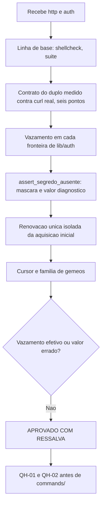

# Parecer de Validacao Independente — QA Expert — `lib/http` e `lib/auth`

## Identificacao

| Campo | Valor |
|---|---|
| Projeto | `dropbox_api` — CLI em shell para a Dropbox API v2 |
| Escopo | `lib/http.sh`, `lib/auth.sh`, redesenho do arcabouco de testes (assercoes, diario, guarda de remocao) |
| Ciclo | 1 (de 3 antes de escalonamento) |
| Data | 2026-08-18 |
| Gate | `TL-08` |
| Branch | `feature/http`, cinco commits |
| **Decisao** | **APROVADO COM RESSALVA** |
| Bloqueantes antes de `commands/` | `QH-01` e `QH-02` |

---

## 1. Decisao

**APROVADO COM RESSALVA.**

O comportamento esta correto em todas as garantias que ataquei: o segredo circula fora de `argv`, `DBX_AUTH_MOTIVO` resiste a corpo de erro que ecoa a credencial, a renovacao acontece uma vez por requisicao sem travar, e a nao-promessa de continuidade de cursor e honrada por ausencia.

As tres ressalvas sao de **superficie e de garantia declarada**, nao de comportamento observavel hoje. Duas delas importam antes de existir consumidor.

---

## 2. Defeitos

### QH-01 · MEDIA — `DBX_HTTP_CORPO` retem o segredo depois da troca de token

`lib/auth` e meticuloso com os proprios canais e descarta a arvore do analisador (`dbx_json_descartar auth`) exatamente para o segredo nao permanecer em memoria. **Nao faz o equivalente para o canal de corpo do transporte.**

Medido, com segredos fabricados:

| Situacao | `DBX_HTTP_CORPO` contem |
|---|---|
| Apos renovar com sucesso | **access token**, em claro |
| Apos falhar, com corpo de erro que ecoa a requisicao | **refresh token** e **app_secret**, em claro |

`DBX_HTTP_CORPO` e canal publico declarado de `lib/http` — o proprio codigo o anota como *"canais publicos, lidos pelo chamador e pela suite"*. O valor persiste ate a proxima chamada HTTP sobrescrever.

O cabecalho de `lib/auth` afirma que o refresh token *"nunca entra em `DBX_AUTH_MOTIVO`... por consequencia, nunca chega ao diario de reprovacoes da suite"*. A afirmacao e **verdadeira para o canal considerado e falsa para o adjacente**: nada impede um chamador de registrar `DBX_HTTP_CORPO` como diagnostico, que e o reflexo natural ao depurar uma renovacao que falhou. A redacao por valor cobriria a forma `client_secret=...`, mas nao a forma `refresh_token <valor>` separada por espaco, que foi a que o corpo de erro produziu no meu teste.

**E a sexta ocorrencia da familia de gemeos, e a terceira entre arquivos**: a mesma disciplina — apagar o segredo do sumidouro assim que ele nao e mais necessario — aplicada a um dos dois sumidouros. Correcao: `lib/auth` limpa `DBX_HTTP_CORPO` e `DBX_HTTP_RESUMO_DE_ERRO` ao encerrar a troca, no mesmo ponto em que ja descarta o contexto do analisador.

### QH-02 · MEDIA — a mitigacao declarada do duplo de rede nao existe

O cabecalho de `tests/unit/http_test.sh` declara o risco e a defesa:

> *"RISCO ACEITO E MITIGADO: o substituto precisa honrar o contrato real do `curl`. Se divergir, a suite valida uma ficcao. Mitigacao: ... ha caso de contrato, habilitado por variavel de ambiente, que confere o mesmo comportamento contra o `curl` real."*

**Esse caso nao existe.** `DBX_TESTES_REDE` tem zero ocorrencias em `http_test.sh` e em `auth_test.sh`, e nenhum dos 21 casos exercita o cliente real. O risco esta aceito, **nao** mitigado, e o cabecalho afirma o contrario — `RSK-27` na forma mais direta.

Fui verificar a divergencia por conta propria, medindo `curl` real contra o duplo nos seis pontos do contrato declarado em `lib/http.sh`:

| Ponto do contrato | `curl` real | duplo |
|---|---|---|
| `-K -` / `-o` / `-D` / `-w` no caminho feliz | exit 0, codigo 200, corpo e cabecalhos gravados | equivalente |
| Sem resposta HTTP | exit 6, `-w` imprime `000` | exit configuravel; `lib/http` normaliza para `0` — **robusto** |
| **`--data-binary @arquivo-ilegivel`** | **exit 26**, nada impresso | **exit 0, imprime 200** |
| **Arquivo de opcoes malformado** | **exit 2**, nada impresso | **exit 0, imprime 200** |

As duas ultimas sao divergencias reais, e na direcao perigosa: **o duplo e mais permissivo que o cliente real**. Ele nunca interpreta o arquivo de opcoes — apenas o consome com `cat`. Um defeito na geracao das opcoes, ou um caminho de corpo invalido, passaria pela suite inteira sem sinal.

Nao considero o duplo a escolha errada: as alternativas que o cabecalho descarta sao piores, e a superficie esta de fato concentrada. O defeito e a mitigacao ser afirmada sem existir.

### QH-03 · MEDIA-BAIXA — falha do proprio cliente e diagnosticada como problema de rede

`lib/http` invoca o cliente com `2>/dev/null` e mapeia qualquer `estado != 0` para `codigo=0`, que a taxonomia classifica como `rede`, cuja mensagem e *"Nao houve resposta do servico. Verifique conectividade, resolucao de nome, proxy e cadeia de certificados TLS"*.

Como `curl` sai com `2` para opcao invalida e `26` para arquivo de corpo ilegivel — ambos **defeitos nossos**, nao da rede —, o operador seria mandado depurar conectividade por um erro de geracao de opcoes. Agrava que `show-error` e pedido nas proprias opcoes e o `stderr` que ele produziria e descartado na linha seguinte.

Nao ha como distinguir todos os codigos sem acoplar a versao do cliente, mas ha um discriminador barato e estavel: **`curl` so imprime o `-w` quando houve resposta**. Codigo vazio com `estado != 0` e transporte; `stderr` nao vazio com `estado` na faixa de erro de uso e defeito local. Alternativamente, capturar `stderr` para a area temporaria e publica-lo redigido no diagnostico.

---

## 3. O que resistiu ao ataque

### `lib/auth` — fronteiras de vazamento

| Fronteira | Resultado |
|---|---|
| `argv` | **0 ocorrencias** do refresh token |
| Entrada padrao | 1 ocorrencia — o segredo viaja por onde deve |
| `DBX_AUTH_MOTIVO` apos falha com corpo ecoando refresh **e** `client_secret` | `renovacao recusada: invalid_grant (refresh token invalido ou revogado; autorize de novo)` — **sem segredo** |
| `DBX_AUTH_LIDO` ao final | `14400`, isto e, `expires_in` — nao o token |
| Residuo em disco e em `$DBX_TESTES_TMP` | **zero** arquivos com refresh ou app_secret |
| `dbx-http.*` em `/tmp` | **zero** |

A construcao do motivo a partir do campo `error`, e nao do corpo, e o que segura essa linha — e ela segurou contra um corpo que eu montei especificamente para atravessa-la.

### `assert_segredo_ausente` — mascara completa **e** ainda diagnostica

```
ocorrencias do segredo na mensagem: 0
posicao: 6 · comprimento: 20 · ocorrencias: 2
texto mascarado: [antes [SEGREDO] meio [SEGREDO] fim]
```

Sobre-redacao verificada em separado: num texto com `401`, `list_folder` e `tentativas`, **as tres pistas sobrevivem**. Agulha vazia e recusada em vez de produzir assercao vacua. A escolha de mascarar a agulha literal, em vez de aplicar a redacao por formas, esta certa e justificada — um segredo fabricado em teste nao tem forma reconhecivel.

### Renovacao uma vez por requisicao

Com token valido pre-carregado, para isolar a renovacao da aquisicao inicial:

```
chamadas ao endpoint de token: 1
chamadas a API: 2   (original + uma nova tentativa)
timeout de 25 s atingido: nao
```

A garantia e real e o laco **reprova em vez de travar**. Registro que a primeira medicao devolveu 2 chamadas ao token e a leitura ingenua seria "garantia quebrada": a primeira era a **aquisicao inicial**, nao renovacao. Isolar o cenario foi o que separou os dois.

### Continuidade de cursor — a nao-promessa e honrada

Nenhum componente de `lib/` guarda, propaga ou pressupoe cursor; a busca por `cursor` fora de comentario nao retorna nada. `reset` continua mapeado para a politica `reiniciar`. A promessa retirada e honrada **por ausencia**, que e a forma mais forte: nao ha caminho que dependa dela porque nao ha caminho que a use.

Registro o metodo: ir a fonte, encontrar silencio e **recusar a inferencia que favorecia o proprio desenho** e o comportamento certo diante de contrato nao documentado. Vale o mesmo para a retificacao sobre rotacao de refresh token, que remove a necessidade de trava e preserva `PRJ-DEC-07` sem esforco.

### Linha de base

| Item | Resultado |
|---|---|
| `shellcheck -x` | exit **0** |
| Suite | **369 / 0 / 2** |
| `bash -n` | limpo em todos os arquivos |

---

## 4. Sobre a familia de gemeos (ponto 5)

A reintroducao do `C2-01` em `lib/auth` — `return "$(...)"` descartando o motivo — e a quinta ocorrencia, e `QH-01` e a sexta. A pergunta era se a familia esta coberta.

**Nao esta, e a dimensao que falta e visivel nas duas ocorrencias novas.** As auditorias existentes cobrem:

- captura por substituicao de comando, derivada da origem do dado;
- `trap` com variavel `local`;
- comandos externos exigidos pelo preflight;
- guardas de metadado entre gemeos.

Todas comparam **forma sintatica** ou **presenca de construcao**. `QH-01` nao tem forma: e a ausencia de uma limpeza que um componente faz e o outro nao, sobre um recurso — o canal publico que carrega segredo — que nenhuma auditoria enumera.

Sugestao de dimensao nova, no mesmo espirito de derivar do codigo: **para cada variavel anotada como canal publico que em algum caminho recebe valor derivado de credencial, exigir que exista atribuicao de limpeza no mesmo componente que a preencheu.** O conjunto de canais publicos ja e derivavel — sao as variaveis com o comentario de canal publico —, e a origem do valor ja e o que o reconhecedor de captura sabe rastrear.

---

## 5. Pendencia de processo

**Quatro registros tecnicos pendentes**: `lib/http`, redesenho do reconhecedor, guarda mais assercoes, e `lib/auth`. Registro conforme pedido e **nao trato como bloqueio de validacao** — o codigo esta completo e foi verificavel sem eles. Preferir declarar a pendencia a entregar registro apressado sobre trabalho recem-alterado e a escolha certa; o custo e que a rastreabilidade documental fica devendo quatro pecas no fechamento.

---

## 6. Fluxo



---

## 7. Condicoes

**Bloqueantes antes de `commands/`** — e onde nascera o primeiro consumidor que registra diagnostico:

1. `QH-01` — limpar `DBX_HTTP_CORPO` e `DBX_HTTP_RESUMO_DE_ERRO` ao encerrar a troca de token, com caso que ataque os dois caminhos (sucesso e falha com corpo que ecoa a credencial).
2. `QH-02` — implementar o caso de contrato contra o cliente real, ou **retirar a afirmacao do cabecalho**. Se implementado, cobrir os dois pontos divergentes que medi: arquivo de corpo ilegivel e arquivo de opcoes malformado.

**Corrigir na mesma rodada:**

3. `QH-03` — distinguir falha de transporte de defeito local pelo `-w` vazio e pelo `stderr` do cliente, hoje descartado.
4. Avaliar a dimensao nova de auditoria proposta na secao 4.

**Registrar como aceito:**

5. Segredo fora de `argv` e fora de arquivo de corpo, verificado nos dois canais.
6. `DBX_AUTH_MOTIVO` resistente a corpo de erro que ecoa a credencial.
7. `assert_segredo_ausente` completa e sem sobre-redacao.
8. Renovacao uma vez por requisicao, com laco que reprova em vez de travar.
9. Nao-promessa de continuidade de cursor honrada por ausencia.
10. Retificacao sobre rotacao de refresh token: sem trava, sem estado novo, `PRJ-DEC-07` preservado.
11. Recusa de inferencia favoravel diante de fonte silenciosa — comportamento a preservar.

---

## 8. Desvios de protocolo

| Desvio | Justificativa |
|---|---|
| Cypress (item 13) | Nao aplicavel: nao ha interface web ou grafica |
| `qa-validacao-frontend-template.md` (itens 17 e 19) | Nao aplicavel: nao ha Design System nem handoff do UX Expert |
| `prompt-logger` (item 2) | Nao acionado, por instrucao do coordenador |

Nenhum arquivo de codigo, teste ou requisito foi alterado; sondas ocorreram em copias descartaveis fora do repositorio. Sem commit, sem push, nada instalado.
