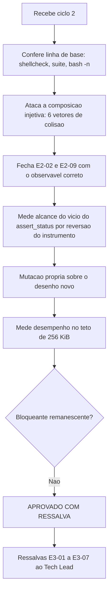

# Parecer de Validacao Independente — QA Expert — Ciclo 2

## Identificacao

| Campo | Valor |
|---|---|
| Projeto | `dropbox_api` — CLI em shell para a Dropbox API v2 |
| Escopo validado | Etapa 2, primeiro incremento, ciclo 2: `lib/json.sh`, `lib/output.sh`, `lib/errors.sh` e `tests/support/harness.sh` |
| Ciclo anterior | [`2026-08-18_qa-validacao-lib-json-e-lib-output.md`](2026-08-18_qa-validacao-lib-json-e-lib-output.md) — REPROVADO |
| Ciclo | 2 (de 3 antes de escalonamento ao solicitante) |
| Data | 2026-08-18 |
| Gate | `TL-08` |
| **Decisao** | **APROVADO COM RESSALVA** |

---

## 1. Decisao

**APROVADO COM RESSALVA.**

Os tres bloqueantes de severidade alta e media-alta do ciclo 1 (`E2-01`, `E2-02`, `E2-03`) estao fechados **por construcao**, e nao por remendo — a troca da chave concatenada pela representacao por identificador de no elimina a classe inteira em vez de tratar o sintoma. Ataquei a composicao nova com seis tentativas de colisao, incluindo separador aninhado e segmentos numericos, e ela resistiu a todas. `E2-04`, `E2-05`, `E2-06`, `E2-07`, `E2-08`, `E2-11`, `E2-13`, `G-01` e `G-02` tambem estao fechados e verificados de forma independente.

Registro que a decisao de **eliminar a concatenacao em vez de acertar a ordem de operacoes** foi a certa, e que medir a alternativa antes de decidir — constatando que o desenho mais seguro era tambem cerca de 10% mais rapido — e o metodo correto. Confirmei a melhora com medicao propria.

As ressalvas remanescentes sao uma de severidade media (contradicao entre a guarda de subshell e a propria documentacao, com consequencia para `lib/http`), uma media-baixa e quatro baixas. Nenhuma envolve injecao, valor errado silencioso ou fronteira de seguranca.

---

## 2. Fechamento de E2-02 e E2-09

### E2-02 — sentinela de raiz: **FECHADO**

O sentinela deixou de existir; a raiz e o no `0`, e nenhum filho pode receber esse identificador porque a numeracao comeca em `1`. Ataquei pelos dois vetores:

| Entrada | Resultado |
|---|---|
| Chave de topo com o escape unicode do antigo sentinela | tipo da raiz `objeto`, 2 chaves listadas, valor da raiz vazio |
| Chave de topo literal `"0"` | tipo da raiz `objeto`, 2 chaves listadas, valor da raiz vazio |

Antes, o primeiro caso fazia a raiz devolver tipo `cadeia`, valor forjado e enumeracao incompleta (1 de 2 chaves). **Fechado por construcao.**

### E2-09 — estado obsoleto: **FECHADO**, e sua objecao estava parcialmente certa

Voce tem razao no ponto central: **o parente conservar o documento antigo e semantica correta de shell**, e a sua reproducao nao poderia distinguir antes de depois, porque ela observava o resultado da *consulta* — que e identico nos dois casos, e corretamente.

O observavel que distingue e **o status do `analisar` executado dentro do subshell**:

| Cenario | Antes | Depois |
|---|---|---|
| `( dbx_json_analisar B )` com estado do pai presente | **status 0** | **status 2**, motivo `subshell` |
| `$( dbx_json_analisar C )` com estado do pai presente | **status 0** | **status 2** |
| Primeira analise do processo dentro de subshell, sem estado previo | status 0 | status 0 (permitido) |
| Consulta no pai apos qualquer um dos casos acima | documento antigo, status 0 | documento antigo, status 0 |

O defeito nunca foi "o valor do pai muda". Era: **o componente reportava sucesso para uma analise cujo resultado seria descartado**, e nao havia sinal em lugar nenhum — nem no status, nem em `DBX_JSON_MOTIVO`, nem na consulta seguinte. E o mesmo modo de falha que o projeto ja endereçou em `lib/path`, onde `DBX_PATH_RESULTADO` e limpo em toda falha justamente para que o chamador nao leia estado obsoleto.

Reconheco que a minha redacao do ciclo 1 confundiu as duas coisas ao classificar o item como defeito de severidade media sem separar "semantica do shell" de "sucesso silencioso do componente". A objecao foi legitima e a correcao do dev endereça o problema real. Mutacao removendo a guarda: **1 reprovacao** — esta pinada.

**Fechado**, com a ressalva `E3-01` abaixo.

---

## 3. Alcance do vicio do `assert_status`

Medicao direta: revertí `assert_status` para a versao com substituicao de comando e executei a suite completa.

```
Resultado: 218 aprovados / 0 reprovados / 2 pulados
```

Conclusoes, na ordem em que importam:

1. **Nenhum caso existente passava por vacuidade por causa disso.** Nenhum teste atual depende do desvio a arquivo.
2. **A razao e que a suite foi escrita contornando a limitacao.** `json_test.sh` tem o auxiliar `_valor`, com comentario explicito de que nao pode ser chamado dentro de `$( )` — ou seja, a limitacao do instrumento moldou o desenho dos testes em vez de ser corrigida. Isso e mais barato de detectar por leitura do que por execucao, e explica por que nenhuma reprovacao aparece.
3. **A afirmacao "era isso que escondia o E2-09" nao se sustenta na suite.** Os dois casos que cobrem a guarda (`teste_analise_em_subshell_sobre_estado_alheio_e_recusada` e `teste_consulta_apos_analise_perdida_nao_responde_pelo_documento_novo`) montam o subshell explicitamente e passam sob as duas versoes do `assert_status`. O que o instrumento escondia era **prospectivo**: qualquer caso futuro que verificasse status e em seguida lesse variavel global ficaria cego.
4. **A correcao esta certa e nao esta pinada.** Reverter o instrumento nao reprova nada. Isso o coloca na mesma categoria de `G-02` do ciclo anterior: uma defesa sem teste que a proteja.

Sobre a familia do vicio: e a mesma de `output_test.sh:185` do ciclo 1 — **o instrumento de observacao fabricando ou destruindo a propriedade sob observacao**. Ja ocorreu tres vezes neste projeto (subshell no `assert_status`, conversao de terminador antes de redigir, e as minhas proprias sondas deste ciclo, que erraram duas vezes pelo mesmo motivo). Recomendo trata-la como classe conhecida e nao como incidente isolado.

---

## 4. Ressalvas

### E3-01 · MEDIA — a guarda de subshell contradiz a propria documentacao e fecha um padrao legitimo

O cabecalho de `lib/json.sh` afirma: *"Analisar e consultar inteiramente dentro do mesmo subshell continua valido"*. Medido, com estado presente no processo pai:

```
( dbx_json_analisar '{"erro":"detalhe"}'; dbx_json_valor erro )
  -> analisar status = 2 ; consulta -> vazio
```

O subshell autocontido **e recusado**. A regra documentada e a implementada divergem.

Isto nao e trivial de resolver, e a analise precisa ser honesta: no momento do `analisar`, a guarda **nao tem como saber** se o chamador vai consultar dentro do subshell ou voltar ao pai. Permitir o caso autocontido significa permitir todos, o que reabre `E2-09`. Ou seja, a escolha da implementacao e defensavel; **o texto e que esta errado**.

A consequencia concreta e para `lib/http`: o padrao natural de isolar uma analise secundaria em subshell — analisar o corpo de erro sem destruir a resposta de listagem em curso — esta fechado, e nao ha alternativa sancionada. Recomendo (a) corrigir o texto e (b) prover mecanismo explicito de salvar e restaurar estado, ou um segundo espaco de nomes, antes de `lib/http` precisar dele.

### E3-02 · MEDIA-BAIXA — `dbx_json_chaves` continua ambigua para segmento com quebra de linha

```
{"nome\n":"VALOR-A","nome":"VALOR-B"}
  dbx_json_valor  nome+quebra -> VALOR-A   (correto, E2-04 fechado na consulta)
  dbx_json_valor  nome        -> VALOR-B   (correto)
  dbx_json_chaves             -> 3 linhas para 2 filhas   (enumeracao ambigua)
```

A consulta esta correta; a **enumeracao** nao. Um chamador que descubra chaves por `dbx_json_chaves` e as realimente como segmento nao consegue reconstruir o conjunto. `lib/output` ganhou terminador nulo exatamente para esta classe de problema; `lib/json` nao tem equivalente. Recomendo uma variante com terminador nulo, ou que a contagem e a enumeracao sejam consumidas por indice de filho, que ja existe internamente.

### E3-03 · BAIXA-MEDIA — contagem e enumeracao discordam em chave duplicada

```
{"a":{"x":1},"a":{}}
  dbx_json_tamanho_arranjo      -> 2      (conta ocorrencias)
  dbx_json_chaves               -> 1      (conta filhas distintas)
  dbx_json_existe a x           -> nao    (E2-08 fechado, sem fantasmas)
```

As filhas fantasma sumiram, que era o defeito reportado. Resta o contador contar ocorrencias sintaticas em vez de filhas. Um chamador que itere por indice ate `tamanho - 1` sai da faixa.

### E3-04 · BAIXA — a auditoria estatica tem um buraco, e ha uma violacao viva

A invariante `nenhum_valor_externo_transita_por_substituicao_de_comando` casa apenas o padrao `=$(`. Demonstrado:

| Violacao injetada em `lib/path.sh` | Auditoria |
|---|---|
| `_v=$(dbx_errors_redigir "$caminho")` | **reprova** (1 caso) |
| `_v+="x$(dbx_errors_redigir "$caminho")"` | **passa** |

E ha uma ocorrencia real da segunda forma no codigo: `lib/errors.sh:649`

```bash
texto+=" Detalhe: $(dbx_errors_redigir "$detalhe")"
```

`$detalhe` vem de fora e a captura remove quebras finais. O impacto e pequeno — mensagem de diagnostico —, mas o instrumento e hoje a garantia declarada do projeto para uma classe que ja ocorreu tres vezes, e esta dando garantia falsa. Recomendo estender o padrao para qualquer `$(` que chame `dbx_`/`_dbx_` fora de comentario, com a mesma lista de excecoes justificadas.

### E3-05 · BAIXA — comentario de `_dbx_json_pronto` contradiz o codigo e a regra do cabecalho

O comentario diz: *"O documento so pode ser consultado no processo que o analisou"*. O codigo verifica apenas `DBX_JSON_ANALISADO`, e o cabecalho do arquivo diz o oposto: *"consultar e sempre permitido, por ser leitura"*. O codigo e o cabecalho estao certos; o comentario local esta errado. Risco concreto: um leitor futuro "corrige" a funcao para casar com o comentario e quebra consulta legitima em subshell.

### E3-06 · BAIXA — a limpeza do indice entre analises nao esta pinada

Mutacao removendo `DBX_JSON_FILHO=()` da reinicializacao: **0 reprovacoes**. O comportamento atual esta correto — verifiquei que reanalisar no mesmo processo elimina os nos anteriores (`a` e `a.x` deixam de existir, `tamanho` volta a 1) —, mas nada protege isso.

### E3-07 · BAIXA — o desvio a arquivo do `assert_status` nao esta pinado

Ver secao 3, item 4.

---

## 5. Verificacoes que resistiram ao ataque

| Item | Verificacao independente |
|---|---|
| `E2-01` injetividade | 6 tentativas de colisao: separador em segmento, ordem invertida, segmentos numericos (`0`, `1 2 3`), separador aninhado duplo, segmento composto so pelo separador. **Nenhuma colide.** |
| `E2-01` pinagem | Mutacao trocando a chave injetiva por concatenacao simples: **23 reprovacoes** |
| `E2-02` | Fechado por construcao (secao 2) |
| `E2-03` | Chave vazia na raiz, aninhada e em cadeia (`{"":{"":3}}`): status 0, valores corretos, sem erro do `bash` |
| `E2-04` consulta | `nome` e `nome`+quebra distinguidos corretamente |
| `E2-05` | Modo linha devolve status 2 **sem saida parcial**; o mesmo modelo em modo nulo devolve 0 |
| `E2-06` | Diagnostico em `stderr`, ausente de `stdout` |
| `E2-07` | Quatro cabecalhos sincronizados, verificado com token generico (nao apenas `Basic`/`Bearer`/prefixo Dropbox) |
| `E2-08` | Tres formas de duplicata: nenhuma filha fantasma. Mutacao: **2 reprovacoes** |
| Arranjo em arranjo | `[[10,11],[20,21]]` resolve nos quatro caminhos; tamanhos corretos |
| Chave numerica x identificador | Objeto com chaves `0`/`1` e lista aninhada resolvem corretamente |
| Reanalise no mesmo processo | Estado anterior integralmente descartado; reanalise que falha bloqueia consulta (status 1) |
| `shellcheck -x` | exit **0** |
| Suite | **218 aprovados / 0 reprovados / 2 pulados** |

### Desempenho, medido de forma independente

| Entradas | Bytes | Tempo | Pico RSS |
|---|---|---|---|
| 100 | 48.848 | 0,39 s | 8,1 MB |
| 200 | 97.648 | 1,02 s | 11,6 MB |
| 400 | 195.248 | 2,87 s | 18,8 MB |
| **537 (no teto)** | **262.104** | **4,66 s** | **23,6 MB** |

Confirma os tres pontos: a melhora de cerca de 10% sobre o ciclo anterior (0,41 / 1,10 / 3,16 nas mesmas cargas), o expoente proximo de 1,45 ja corrigido no cabecalho, e o pior caso na ordem de 5 s no teto. As medidas de dimensionamento (488 bytes por entrada, `limit` de no maximo 100, reduzir o limite ao receber `motivo=tamanho`) foram incorporadas corretamente e agora constam como `RNF-23`.

---

## 6. Fluxo de validacao



---

## 7. Condicoes para o fechamento do Tech Lead

**Antes de `lib/http` consumir estes componentes:**

1. `E3-01` — corrigir o texto do cabecalho e decidir o mecanismo de analise secundaria (salvar e restaurar estado, ou segundo espaco de nomes). `lib/http` vai precisar analisar corpo de erro sem destruir a resposta em curso.
2. `E3-02` — variante de enumeracao nao ambigua em `dbx_json_chaves`.

**Corrigir na proxima rodada de manutencao:**

3. `E3-03` — alinhar `dbx_json_tamanho_arranjo` a contagem de filhas distintas.
4. `E3-04` — estender a auditoria estatica para `+=` e demais formas, e tratar a ocorrencia em `lib/errors.sh:649`.
5. `E3-05` — corrigir o comentario de `_dbx_json_pronto`.
6. `E3-06` e `E3-07` — pinar a limpeza do indice entre analises e o desvio a arquivo do `assert_status`.

**Registrar como aceito:**

7. `E2-01` a `E2-08`, `E2-11`, `E2-13`, `G-01` e `G-02` fechados e verificados de forma independente.
8. `E2-02` e `E2-09` fechados; a objecao do coordenador sobre `E2-09` era parcialmente procedente e esta registrada na secao 2.
9. `E2-12` deixou de existir com a redacao por valor ao alimentar o modelo — solucao melhor do que a que eu havia recomendado.
10. Alcance do vicio do `assert_status`: **zero casos passavam por vacuidade**; a correcao e prospectiva e correta (secao 3).
11. Achado do dev em `_dbx_errors_remover_qualificador`, nao reportado por mim no ciclo 1: procede, e a correcao para `DBX_ERRORS_RESTANTE` esta certa.
12. Metodo de medir a alternativa antes de decidir, mantido.

**Vigilancia permanente:**

13. Classe "instrumento de observacao interfere na propriedade observada" — tres ocorrencias no projeto. Tratar como classe conhecida em toda revisao de teste.

---

## 8. Desvios de protocolo

| Desvio | Justificativa |
|---|---|
| Cypress (item 13) | Nao aplicavel: nao ha interface web ou grafica |
| `qa-validacao-frontend-template.md` (itens 17 e 19) | Nao aplicavel: nao ha Design System nem handoff do UX Expert |
| `prompt-logger` (item 2) | Nao acionado, por instrucao do coordenador. Registrado para decisao do Tech Lead |

Nenhum arquivo de codigo, teste ou requisito foi alterado por esta validacao; as mutacoes e reversoes foram feitas em copias descartaveis fora do repositorio. Sem `git init`, sem commit, nada instalado.
