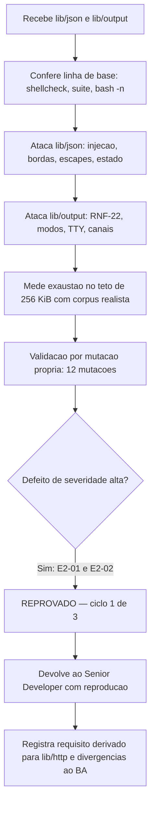

# Parecer de Validacao Independente — QA Expert

## Identificacao

| Campo | Valor |
|---|---|
| Projeto | `dropbox_api` — CLI em shell para a Dropbox API v2 |
| Escopo validado | Etapa 2, primeiro incremento: `lib/json.sh`, `lib/output.sh` e as suites `tests/unit/json_test.sh` e `tests/unit/output_test.sh` |
| Entrega de origem | [`2026-08-18_entrega-lib-json-e-lib-output.md`](2026-08-18_entrega-lib-json-e-lib-output.md) |
| Ciclo | 1 (de 3 antes de escalonamento ao solicitante) |
| Data | 2026-08-18 |
| Gate | `TL-08` — artefato proprio de fechamento de ciclo de QA |
| **Decisao** | **REPROVADO** |
| Natureza do problema | **Residual**, nao estrutural |

---

## 1. Decisao e sintese

**REPROVADO**, ciclo 1 de 3.

Motivo: duas falhas de **severidade alta** de injecao no espaco de chaves de `lib/json`, componente que o Business Analyst elevou a `RNF-11` justamente por ser o de maior risco do projeto. As duas sao da **mesma classe de defeito que o componente existe para eliminar** (`DIV-04` no projeto de referencia: valor contendo o delimitador procurado corrompe a extracao em silencio). O delimitador mudou de `sed` para a codificacao de caminho interna, mas continua em banda com o dado.

O desenho geral esta correto e e um avanco claro: analisador real em vez de expressao regular, varredura em passada unica com custo medido antes da escolha, falha fechada e classificada, canal de resultado por variavel. O que falha e o **encoding do caminho** em `lib/json` e o **wiring** de `lib/output`. Ambos sao corrigiveis em rodada curta.

### Natureza do problema

**Residual.** Nao ha necessidade de repensar a camada:

- `E2-01` e `E2-02` se resolvem trocando o caminho em banda por composicao segura (prefixar cada segmento com seu comprimento, ou recusar nome de chave que contenha os sentinelas apos a decodificacao). Nao muda o desenho do analisador.
- `E2-03` e uma guarda de subscrito vazio.
- `E2-04` e a mesma correcao ja aplicada duas vezes no projeto: remover a substituicao de comando do canal de chave.
- `E2-05` e `E2-06` sao ligacao de peca existente (`dbx_path_seguro_para_linha`) e um redirecionamento para a saida de erro.

---

## 2. Defeitos

### E2-01 · ALTA — injecao no espaco de chaves pelo separador de caminho

`lib/json.sh` codifica o caminho de um campo como `segmento` + byte `0x1f` + `segmento`. Esse byte e recusado quando aparece **cru** na entrada, mas nao quando chega como **escape unicode**, porque a decodificacao ocorre depois da verificacao.

Reproducao (o campo forjado usa o escape unicode do separador no nome da chave):

```bash
. lib/json.sh
# {"a":{"b":"LEGITIMO"},"a<ESCAPE-U001F>b":"INJETADO"}
dbx_json_valor a b   # -> INJETADO
```

`_dbx_json_registrar` trata a chave forjada como a mesma entrada de `a` -> `b` e, sendo a ultima ocorrencia, sobrescreve o valor legitimo. Com a ordem invertida o valor legitimo prevalece — ou seja, **quem controla a ordem dos campos controla o resultado**.

Impacto: um campo forjado pode substituir `content_hash`, `size`, `rev` ou `cursor` de uma entrada legitima. Contraria diretamente o proposito declarado do componente.

### E2-02 · ALTA — sequestro da raiz pelo sentinela de documento

A raiz e registrada sob o sentinela `0x1e`, alcancavel pelo mesmo caminho. Com um documento cujo unico nome de chave de topo e o escape unicode desse sentinela:

```
dbx_json_tipo            -> cadeia          (esperado: objeto)
dbx_json_valor           -> RAIZ-FORJADA
dbx_json_chaves | wc -l  -> 1               (esperado: 2)
```

O modelo do documento e corrompido estruturalmente: o tipo da raiz passa a mentir e a enumeracao de chaves de topo fica incompleta. Um percorredor de resposta que confie em `dbx_json_chaves` deixa de ver campos presentes.

### E2-03 · MEDIA-ALTA — chave JSON vazia quebra o analisador fora do contrato

`{"":1}` e JSON valido. Resultado:

```
status = 1                       (contrato documentado: 0, 2 ou 10)
DBX_JSON_MOTIVO = ''             (deveria classificar a causa)
stderr: lib/json.sh: line 121: DBX_JSON_INDICE: bad array subscript
        lib/json.sh: line 133: DBX_JSON_INDICE[$chave]: bad array subscript
```

Aninhada, o comportamento muda: `{"a":{"":1}}` devolve **status 0 e `DBX_JSON_ANALISADO=1`**, com o campo nao registrado e sem erro. A promessa de "entrada malformada falha FECHADA e CLASSIFICADA" nao se cumpre — e aqui a entrada nem sequer e malformada. O cabecalho do arquivo antecipa o problema para a raiz ("array associativo do `bash` recusa subscrito vazio") e nao o trata para chave de documento.

### E2-04 · MEDIA-ALTA — chave terminada em quebra de linha entrega o campo errado

As cinco funcoes publicas (`dbx_json_valor`, `dbx_json_tipo`, `dbx_json_existe`, `dbx_json_tamanho_arranjo`, `dbx_json_chaves`) montam a chave com `chave=$(_dbx_json_chave_de "$@")`. A substituicao de comando remove quebras finais.

```bash
dbx_json_analisar '{"nome\n":"VALOR-A","nome":"VALOR-B"}'
dbx_json_valor "$(printf 'nome\n')"   # st=0, DBX_JSON_RESULTADO = VALOR-B
```

Consulta-se um campo e recebe-se **outro**, com status de sucesso. E a terceira ocorrencia da mesma classe no projeto (`D1` na Etapa 1, `C2-01` no ciclo 2): o canal de **valor** foi protegido, o canal de **chave** nao. `dbx_json_chaves` tambem emite uma chave com quebra como duas linhas, tornando a enumeracao ambigua.

### E2-05 · MEDIA-ALTA — `lib/output` corrompe registro em modo linha, sem aviso

```bash
dbx_output_terminador linha
dbx_output_campo caminho "$(printf 'relatorio\nfinal.pdf')"
dbx_output_render
```

Consumidor lendo por linha recebe quatro registros: `contrato=1`, `caminho=relatorio`, `final.pdf`, `tamanho=1024`. Status 0, nenhum diagnostico.

`dbx_path_seguro_para_linha` foi construida na Etapa 1 exatamente para isto, com o comentario *"quem emite (lib/output) precisa saber disso antes de imprimir (RF-28, RF-35)"*. **Nao ha nenhuma ocorrencia dela em `lib/output.sh`.** O `--null` resolve o caso quando o operador se lembra de pedir; o padrao produz fluxo corrompido em silencio, contrariando RF-28 ("a saida padrao contem apenas registros parseaveis por script").

### E2-06 · MEDIA — diagnostico sai na saida padrao, nao na de erro

```bash
dbx_output_diagnostico endpoint /2/files/list_folder
dbx_output_render_diagnostico 2>/dev/null     # -> endpoint=/2/files/list_folder
dbx_output_render_diagnostico 2>&1 >/dev/null # -> (vazio)
```

RF-28 e P0 e exige que "todo diagnostico e escrito na saida de erro". `dbx_output_diagnostico` esta documentada como "canal separado, saida de erro", mas a separacao e apenas por funcao: quem redireciona e o chamador, e nada o obriga. O caso `teste_diagnostico_nao_vai_para_a_saida_padrao` nao cobre isso porque inspeciona `dbx_output_render`, e nao `dbx_output_render_diagnostico`.

### E2-07 · MEDIA — listas de cabecalho sensivel dessincronizadas

`lib/output.sh` declara `proxy_authorization` sensivel; `lib/errors.sh` nao o tem em `DBX_ERRORS_CHAVES_SENSIVEIS` nem em `DBX_ERRORS_CHAVES_DE_CABECALHO`.

```
Proxy-Authorization: ABCsegredo123   ->   Proxy-Authorization: ABCsegredo123   (nao redigido)
```

Redige apenas quando o valor traz `Basic`, `Bearer` ou o prefixo de token da Dropbox, por regras independentes. Credencial de proxy corporativo em esquema NTLM/Negotiate ou token simples vaza. `DP-17` (rede corporativa) esta em escopo. O comentario "mantido em sincronia conceitual" nao corresponde ao estado atual, e nao ha teste que verifique a sincronia.

### E2-08 · MEDIA — chave duplicada deixa filhas fantasma

```bash
dbx_json_analisar '{"a":{"x":1},"a":{}}'
dbx_json_tamanho_arranjo a   # -> 0
dbx_json_existe a x          # -> sim
```

O objeto vencedor e vazio, mas as filhas do objeto descartado permanecem no indice. `dbx_json_chaves a` lista `x y` no caso de dois objetos. O modelo fica internamente inconsistente: tamanho e enumeracao discordam.

### E2-09 · MEDIA — estado global obsoleto devolve o documento anterior

```bash
dbx_json_analisar '{"campo":"DOCUMENTO-A"}'
_=$(dbx_json_analisar '{"campo":"DOCUMENTO-B"}')
dbx_json_valor campo   # -> DOCUMENTO-A, status 0, sem erro
```

Analisar dentro de substituicao de comando perde o estado; as consultas seguintes continuam respondendo pelo documento anterior. **E a causa do resultado "deslocado entre iteracoes" observado pelo coordenador** — a API estava sendo usada corretamente, o componente e que nao sinaliza. Recomendo contador de geracao, ou token de analise devolvido por `dbx_json_analisar` e exigido nas consultas.

### E2-10 · BAIXA — escapes de controle decodificados para dentro dos valores

| Escape unicode | Resultado |
|---|---|
| `U+0000` | **silenciosamente descartado** — `"A" + escape + "B"` vira `AB` |
| `U+0001` | byte `0x01` cru no valor |
| `U+001F` e `U+001E` | bytes dos sentinelas internos no valor — habilita `E2-01` e `E2-02` |
| `U+007F` e `U+0085` | aceitos |

Alem de corromper valor, um valor com `0x01` entregue a `dbx_errors_redigir` faz a funcao devolver `[REDIGIDO: corpo com caractere de controle, nao analisavel]` — negacao de diagnostico controlavel pela origem. A cadeia falha fechada (nao ha vazamento), mas o operador perde a mensagem.

### E2-11 · BAIXA — teto de profundidade efetivo e 31, nao 32

`DBX_JSON_MAXIMO_PROFUNDIDADE=32`; medido: profundidade 31 aceita, 32 recusada. Discrepancia entre constante e comportamento.

### E2-12 · BAIXA — registro nao uniforme no modo nulo

Registro de cabecalho sensivel termina em quebra de linha seguida do byte nulo; os demais terminam apenas no byte nulo. Um consumidor com `read -d ''` recebe uma quebra sobrando apenas em alguns registros, dentro de um contrato congelado por RF-35.

### E2-13 · BAIXA — `dbx_output_campo` nao valida a chave

`dbx_output_campo 'a=b' 'v'` produz `a=b=v`. A chave e de origem interna, mas o contrato de RF-35 nao tem guarda.

---

## 3. Respostas aos pontos submetidos

### P2 — `null` versus ausente versus cadeia vazia: funciona e e distinguivel

Forma correta de uso: `dbx_json_analisar` **fora** de substituicao de comando, depois `dbx_json_existe` combinado com `dbx_json_tipo`.

| Campo | `existe` | `tipo` | `valor` (status) | `DBX_JSON_RESULTADO` |
|---|---|---|---|---|
| `"cursor":null` | sim | `nulo` | 0 | vazio |
| `"vazio":""` | sim | `cadeia` | 0 | vazio |
| ausente | **nao** | status 1 | 1 | vazio |
| `"zero":0` | sim | `numero` | 0 | `0` |
| `"falso":false` | sim | `booleano` | 0 | `false` |

Aplicado ao caso de paginacao:

| Corpo | `existe` | `tipo` | valor |
|---|---|---|---|
| `{"cursor":"AAE","has_more":true}` | sim | `cadeia` | `AAE` |
| `{"cursor":null,"has_more":false}` | sim | `nulo` | vazio |
| `{"has_more":false}` | nao | — | — |

Os tres estados sao separaveis. A deteccao de fim de listagem nao fica ambigua.
**A inconsistencia observada era `E2-09`**, nao erro de invocacao.

### P3 — teto de 256 KiB e requisito derivado

Medicao propria com corpus realista de `files/list_folder` (`name`, `path_lower`, `path_display`, `id`, `client_modified`, `server_modified`, `rev`, `size`, `is_downloadable`, `content_hash`):

| Entradas | Bytes | Tempo | Pico RSS |
|---|---|---|---|
| 100 | 48.848 | 0,41 s | 8,0 MB |
| 200 | 97.648 | 1,10 s | 11,7 MB |
| 400 | 195.248 | 3,16 s | 18,5 MB |
| 800 | 390.448 | recusado (`motivo=tamanho`) | — |

- **Custo por entrada: cerca de 488 bytes.** O teto de 256 KiB comporta **aproximadamente 537 entradas**.
- **O custo nao e linear**: cerca de 2,7x por duplicacao (ordem de n^1,45), e nao os 2,15x registrados. A estimativa de pior caso do dev (cerca de 5 s) esta correta apesar disso; a afirmacao de linearidade no comentario do arquivo, nao.

**O teto e adequado** para corpo de erro e resposta de objeto unico, e **o requisito derivado esta correto — e e mais forte do que o enunciado**: `files/list_folder` sem `limit` explicito pode devolver ate 2.000 entradas, o que da cerca de 976 KB, aproximadamente **3,7x o teto**. Sem paginacao a operacao falha por recusa de analise.

Recomendacoes para `lib/http`, a registrar como requisito de entrada:

1. `limit` explicito **menor ou igual a 100** — cerca de 49 KB e 0,41 s por pagina, com folga para caminhos longos. `limit=200` fica em cerca de 98 KB no caso tipico, mas ultrapassa o teto com caminhos unicode longos.
2. Tratar `DBX_JSON_MOTIVO=tamanho` **reduzindo o `limit` e repetindo**, e nao abortando: o teto e do analisador, nao do servico.
3. O `limit` viaja no cursor, entao `list_folder/continue` herda a paginacao e nao precisa repeti-lo.

### P4 — RNF-22 e o `request_id`: confirmado nos quatro cruzamentos

| Modo | Terminador | `request_id` | Segredo |
|---|---|---|---|
| estruturada | linha | preservado | redigido |
| estruturada | nulo | preservado | redigido |
| humana | linha | preservado | redigido |
| humana | nulo | preservado | redigido |

Vale tambem com o `request_id` **antes** do cabecalho sensivel. O mecanismo da quebra explicita antes do terminador nulo esta pinado por teste (ver P5).

Duas observacoes que devem ser registradas:

- **A justificativa esta superdimensionada.** O `bash` nao carrega byte nulo em variavel: `$(dbx_output_render_diagnostico)` descarta os bytes nulos com aviso. A composicao contra a qual o mecanismo defende — redigir o fluxo inteiro ja renderizado, em modo nulo — **nao existe nessa forma**. Num consumo correto, registro a registro com `read -d ''`, cada registro e redigido isolado e o vizinho nunca e alcancado. O mecanismo e barato e nao faz mal; a fundamentacao e que precisa ser corrigida.
- **Nenhum componente aplica redacao hoje.** `lib/output` renderiza valor cru. A protecao e estrutural e depende de alguem a jusante lembrar de redigir. Recomendo fixar como requisito que a redacao seja aplicada **por valor, no momento de alimentar o modelo**, e nao sobre o fluxo renderizado — o que torna `E2-12` desnecessario e resolve o ponto anterior.

### P5 — os dois achados de processo

**(a) Correcao do teste fraco: real, mas incompleta.**
Mutacao propria removendo a quebra explicita antes do terminador nulo: **1 reprovacao** — `teste_identificador_sobrevive_a_redacao_tambem_no_modo_nulo`. A correcao esta certa e pina o mecanismo.

**Ha um teste irmao com o mesmo vicio, nao corrigido:** `teste_restricao_de_linha_vale_tambem_no_modo_nulo` (`tests/unit/output_test.sh:185`) continua convertendo o byte nulo em quebra de linha **antes** de verificar que os registros nao se concatenam. A conversao fabrica exatamente a fronteira sob teste: com o isolamento removido, esse caso **continua passando**. E vacuo.

**(b) Mutacao semanticamente nula: confirmada.**
Removi as **duas** guardas de virgula sobrando (objeto e arranjo) e a invariante se mantem:

```
{"a":1,}   -> status 10, motivo=malformado
[1,]       -> status 10, motivo=malformado
{"a":1,,}  -> status 10, motivo=malformado
[,]        -> status 10, motivo=malformado
```

A licao do `R-06` foi aplicada corretamente: a invariante — recusa de entrada malformada — esta fixada a jusante, e a mutacao e de fato indetectavel por ser nula. Confirmo o raciocinio.

### P6 — nome com quebra de linha, modos e TTY

| Modo | Terminador | Registros percebidos | Resultado |
|---|---|---|---|
| estruturada | linha | 4 (esperado 3) | **corrompido** |
| estruturada | nulo | 3 | integro |
| humana | linha | 3 (esperado 2) | **corrompido** |
| humana | nulo | 2 | integro |

Consumidor real em modo linha recebe `caminho=relatorio` e `final.pdf` como registros distintos. O `--null` resolve (`DIV-16b` correta), mas o padrao falha em silencio — ver `E2-05`.

**Deteccao de TTY correta**: sem terminal produz `estruturada`; com terminal (verificado via `script`) produz `humana`; sobreponivel nos dois sentidos; valor invalido recusado com status 2 em `dbx_output_modo` e em `dbx_output_terminador`. `RNF-19` atendido.

---

## 4. Validacao por mutacao independente

Doze mutacoes proprias, linha de base 0 reprovacoes em ambos os arquivos.

| Mutacao | Reprovacoes |
|---|---|
| Remove quebra explicita antes do terminador nulo | 1 |
| Todo cabecalho passa a nao ser sensivel | 1 |
| Remove recusa de lixo apos o documento | 1 |
| Remove teto de profundidade | 1 |
| Aceita zero a esquerda em numero | 1 |
| Ultima ocorrencia deixa de vencer em chave duplicada | 1 |
| Remove recusa de virgula sobrando (objeto e arranjo) | 0 — **nula, invariante confirmada** |
| **Remove recusa de caractere de controle cru** | **0 — LACUNA** |
| **Remove teto de entrada de 256 KiB** | **0 — LACUNA** |

Duas lacunas materiais:

- **G-01** — a recusa de caractere de controle cru e a unica defesa contra a colisao com o separador interno (licao `R-01`). Removida, **nada reprova**. E a mesma guarda que `E2-01` e `E2-02` contornam por outro caminho.
- **G-02** — o teto de 256 KiB, do qual foi derivado um requisito para `lib/http`, **nao esta fixado por nenhum teste**. Um requisito derivado de um valor nao testado nao tem sustentacao.

---

## 5. Estado verificado do incremento

| Item | Resultado |
|---|---|
| `bash -n` nos 10 arquivos | limpo |
| `shellcheck -x` | exit **0** |
| Suite completa | **197 aprovados / 0 reprovados / 2 pulados**, 6 arquivos |
| Estado local persistente (`PRJ-DEC-07`) | preservado — nenhum dos dois componentes escreve em disco |
| Repositorio | branch `develop`; **nenhum `git init`, nenhum commit, nada instalado** |

---

## 6. Fluxo de validacao



---

## 7. Condicoes para o ciclo 2

**Bloqueantes:**

1. `E2-01` e `E2-02` — eliminar o delimitador em banda no caminho de chave. Recusar chave que contenha os sentinelas apos a decodificacao, ou trocar por composicao nao ambigua. Teste com os dois sentinelas em nome de chave, nas duas ordens.
2. `E2-03` — guarda de chave vazia, falhando dentro do contrato (status 10 com `DBX_JSON_MOTIVO` preenchido), sem diagnostico do `bash` no stderr, com comportamento igual na raiz e aninhada.
3. `E2-04` — remover a substituicao de comando do canal de chave nas cinco funcoes publicas.
4. `E2-05` — em modo linha, valor inseguro deve recusar ou avisar, usando `dbx_path_seguro_para_linha`. Silencio nao e opcao.
5. `E2-06` — `dbx_output_render_diagnostico` na saida de erro, com teste que capture os dois descritores separadamente.

**Corrigir na mesma rodada:**

6. `E2-07` — fonte unica das chaves de cabecalho sensivel, com teste de sincronia entre `lib/errors` e `lib/output`.
7. `E2-08`, `E2-09`, `E2-10`, `E2-11`, `E2-12` e `E2-13`.
8. `G-01` e `G-02` — pinar a recusa de caractere de controle e o teto de entrada.
9. Corrigir `teste_restricao_de_linha_vale_tambem_no_modo_nulo`, que mantem o vicio ja corrigido no teste irmao.
10. Corrigir no cabecalho de `lib/json.sh` a afirmacao de linearidade (medido na ordem de n^1,45) e a profundidade efetiva (`E2-11`).

**Registrar como aceito, independentemente do ciclo 2:**

11. Semantica `null` / ausente / vazio correta e suficiente para paginacao (P2).
12. `RNF-22` e a preservacao do `request_id` verificadas nos quatro cruzamentos (P4), com a ressalva sobre a fundamentacao.
13. `RNF-19` (deteccao de terminal, sobreponivel nos dois sentidos) atendido.
14. Invariante de recusa de entrada malformada confirmada como fixada a jusante (P5b).
15. Metodo de medir a alternativa antes de escolher, mantido desde o ciclo 3 da Etapa 1.

**Devolver ao Business Analyst:**

16. Requisito de entrada para `lib/http`: paginacao com `limit` menor ou igual a 100 e tratamento de `motivo=tamanho` por reducao do limite (P3).
17. Requisito de que a redacao seja aplicada por valor ao alimentar o modelo, e nao sobre o fluxo renderizado (P4).
18. `RF-28` exige diagnostico na saida de erro; hoje isso depende do chamador (`E2-06`).

---

## 8. Desvios de protocolo

| Desvio | Justificativa |
|---|---|
| Cypress (item 13 do protocolo comum) | Nao aplicavel: nao ha interface web ou grafica. Previsto em `docs/arquitetura/system-design.md`, secao "Observacoes de setup" |
| `qa-validacao-frontend-template.md` (itens 17 e 19) | Nao aplicavel: nao ha Design System nem handoff do UX Expert, conforme a secao obrigatoria do System Design |
| `prompt-logger` (item 2) | Nao acionado nesta execucao, por instrucao do coordenador. Registrado para decisao do Tech Lead |

Nenhum arquivo de codigo ou de requisito foi alterado por esta validacao. Este documento e o unico artefato produzido.
