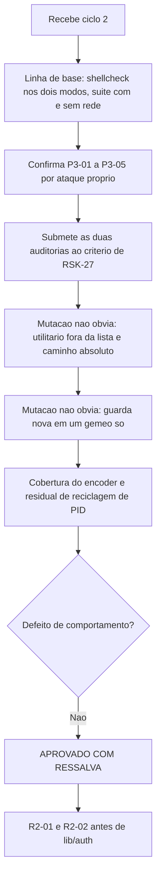

# Parecer de Validacao Independente — QA Expert — `lib/preflight` e `lib/config` — Ciclo 2

## Identificacao

| Campo | Valor |
|---|---|
| Projeto | `dropbox_api` — CLI em shell para a Dropbox API v2 |
| Escopo | Correcoes de `P3-01` a `P3-05` e as **duas auditorias permanentes** introduzidas nesta rodada |
| Ciclo anterior | [ciclo 1](2026-08-18_qa-validacao-preflight-e-config.md) — APROVADO COM RESSALVA |
| Ciclo | 2 (de 3 antes de escalonamento ao solicitante) |
| Data | 2026-08-18 |
| Gate | `TL-08` |
| Branch | `feature/preflight-e-config`, seis commits, arvore limpa |
| **Decisao** | **APROVADO COM RESSALVA** |
| Bloqueantes antes de `lib/auth` | `R2-01` e `R2-02` |

---

## 1. Decisao

**APROVADO COM RESSALVA.**

As cinco ressalvas do ciclo 1 estao corrigidas e verificadas de forma independente. Nenhum defeito novo de comportamento.

As ressalvas desta rodada sao de natureza diferente e recaem sobre **a forca das duas garantias declaradas**. Submeti as duas ao criterio de `RSK-27` — mutacao da forma **nao obvia** — e **as duas passaram na direcao obvia e falharam na nao obvia**. Isso nao invalida o incremento; invalida trata-las como garantias.

---

## 2. As duas auditorias, submetidas ao criterio de `RSK-27`

### R2-01 · MEDIA — a auditoria de utilitarios so enxerga o que ja consta da propria lista

`teste_lista_do_preflight_cobre_o_que_a_biblioteca_invoca` extrai invocacoes de `lib/*.sh` **contra uma lista fixa de vinte nomes** escrita no proprio teste, e confere se cada achado consta de `DBX_PREFLIGHT_UTILITARIOS`.

O comentario do caso declara o proposito: *"se a biblioteca passar a invocar um utilitario novo, o preflight precisa passar a exigi-lo"*. **E exatamente esse cenario que a auditoria nao detecta.**

Injetei em `lib/path.sh` uma invocacao de utilitario fora da lista da auditoria, um por vez:

| Invocado por `lib/` | Reprovacoes |
|---|---|
| `cut` · `date` · `sort` · `uniq` · `paste` · `expr` · `touch` · `du` | **0 em 8** |

Oito de oito passam despercebidos. A garantia real e "nenhum utilitario **desta lista** e invocado sem ser exigido" — circular, porque a lista e mantida a mao e so cresce quando alguem se lembra.

Segunda cegueira, esta por construcao: o padrao ancora com `(^|[^-_a-zA-Z/.])`, que **exclui deliberadamente uma barra a esquerda**. Trocando `mktemp` por `/usr/bin/mktemp` em `lib/config.sh`, a auditoria devolve **0 reprovacoes** — invocacao por caminho absoluto e invisivel.

Na direcao obvia ela funciona: reduzir `DBX_PREFLIGHT_UTILITARIOS` de volta a `'curl'` produz **2 reprovacoes**.

Sobre as outras duas formas que voce levantou: invocacao por variavel continua visivel enquanto o literal aparecer em algum ponto do arquivo — e o caso de `DBX_HASH_BACKEND`, cujos tres valores aparecem literalmente no `case`. Invocacao dentro de `$( )` aninhado e detectada, porque `(` satisfaz a classe de fronteira.

### R2-02 · MEDIA — a auditoria de gemeos nao detecta divergencia nova

O caso de composicao percorre **dez modos de permissao fixos** e exige que preflight e leitura decidam igual. Isso fixa a divergencia encontrada. Nao fixa paridade.

Acrescentei a `dbx_config_carregar` uma guarda **ausente** do gemeo `dbx_preflight_verificar` — limite de tamanho do arquivo, logo apos a verificacao de dono:

```
suite completa: 296 casos, 0 reprovacoes
```

A divergencia nova passa inteira. E "guarda nova em um gemeo so" e **precisamente** o modo de falha que gerou `QF-01`, `P3-01` e a quarta ocorrencia que o proprio autor apanhou nesta rodada.

Na dimensao que ela cobre, esta correta: as duas guardas usam hoje `^[4567]00$` para o arquivo e `^[0-7]00$` para o diretorio, identicas nos dois lados, e modos de quatro digitos (`4600` com setuid, por exemplo) caem fora do padrao e sao recusados — falha fechada.

### Sobre a conclusao do autor

*"Das quatro ocorrencias do padrao, as duas detectadas por auditoria ou teste foram baratas, e as duas detectadas por leitura chegaram ao QA. Inspecao nao escala para essa classe."*

**Concordo com a direcao, e proponho afiar a conclusao**, porque como esta enunciada ela ja se cumpriu e mesmo assim as duas auditorias ficaram cegas:

> O que escala nao e *ter uma auditoria*, e sim uma auditoria cujo **escopo derive do codigo**, e nao de uma lista mantida a mao. As duas auditorias desta rodada sao listas mantidas a mao, e ambas sao cegas exatamente onde a lista termina.

Formas de derivar do codigo, em ordem de custo:

- **Utilitarios:** extrair candidatos a comando externo do proprio texto — primeira palavra de comando que nao seja funcao definida, nem palavra reservada, nem builtin — e exigir que cada um esteja na lista ou numa excecao nomeada. O conjunto passa a vir do codigo; a lista a manter vira a de *excecoes*, que e pequena e cujo crescimento e visivel.
- **Gemeos:** extrair de cada funcao gemea o conjunto de guardas (as chamadas a `_dbx_*_falhar` e seus motivos) e exigir que os conjuntos coincidam. Guarda nova em um lado passa a reprovar por construcao, sem enumerar modos.

Enquanto isso nao existir, sugiro que as duas nao sejam citadas como **garantia** em fechamento — sao **indicio**, no vocabulario que `RSK-27` ja fixou.

---

## 3. Demais achados

### R2-03 · BAIXA — a varredura de orfaos e probabilistica, nao absoluta

A restricao a processos mortos esta correta e a justificativa procede: verifiquei que dez gravacoes concorrentes continuam produzindo **1 arquivo e 0 orfaos**, propriedade que uma varredura indiscriminada destruiria.

O residual e a **reciclagem de identificador de processo**. Deixei um temporario nomeado com o identificador de um processo vivo e executei uma gravacao completa:

```
orfao com PID de processo VIVO apos a gravacao: 1
contem o segredo: .../dbx/.credencial.1708471.XXXX
```

Se o processo que gravava morre e seu identificador e reaproveitado por qualquer processo vivo, `kill -0` responde que esta vivo e o orfao **nunca mais e varrido**. A invariante realizavel e "orfaos sao normalmente removidos", nao "sempre".

Correcao barata que preserva a concorrencia: varrer tambem por **idade**, removendo `.credencial.*` acima de alguns minutos independentemente do identificador. Uma gravacao legitima nunca dura tanto.

### R2-04 · BAIXA-MEDIA — o encoder e funcao publica de `lib/json` sem cobertura em `lib/json`

Confirmo a observacao, e ela importa. Mutando o escape da barra invertida:

| Suite | Reprovacoes |
|---|---|
| `json` | **0** |
| `composicao` | **0** |
| `config` | **2** |

`dbx_json_escapar_cadeia` tem prefixo publico e nenhuma protecao dentro do componente que a hospeda. Hoje isso e coberto por uma ida e volta em `lib/config`, que e evidencia forte — mas de **um** padrao de uso.

Importa por um motivo concreto: o proximo consumidor e `lib/http`, que vai codificar **corpo de requisicao**. Ali nao ha ida e volta local — um escape quebrado produz requisicao malformada contra a API, detectavel so em rede, e nao uma falha de releitura detectavel na maquina. A propriedade precisa ser dona de si.

Recomendo **acrescentar**, e nao substituir: casos diretos em `json_test.sh` afirmando a saida escapada de cada classe (aspas, barra invertida, os cinco escapes curtos, um caractere de controle, e a **ordem** — barra invertida primeiro). A ida e volta em `config` continua valendo como evidencia de composicao.

---

## 4. Correcoes do ciclo 1 — todas confirmadas

| Ressalva | Verificacao independente |
|---|---|
| `P3-01` | Oito `SIGKILL` em instantes aleatorios: **0 orfaos**. Dez gravacoes concorrentes: 1 arquivo, 0 orfaos, conteudo integro. Correcao em duas partes confirmada: `trap` em subshell proprio para sinal intercepvel, varredura por identificador para o que escapa. Residual em `R2-03` |
| `P3-02` | `DBX_PREFLIGHT_UTILITARIOS` passou de `curl` para onze nomes; ausencia de cada um reprova **nomeando** o utilitario, conforme `RNF-02` |
| `P3-03` | `0400` aceita, `0600` aceita; `640`, `644`, `604`, `660`, `606`, `666` recusadas. Guarda `^[4567]00$` nos dois gemeos |
| `P3-04` | Diretorio `0777` recusado com motivo proprio `permissao_diretorio`, nos dois caminhos |
| `P3-05` | Encoder reescrito com substituicao de padrao, sem indexacao. Cobertura dos caracteres de controle completa: os cinco escapes curtos explicitos e a faixa restante em `\uXXXX`, incluindo `127` |

### `DP-11` — registro corresponde ao comportamento

Verificado contra credencial plantada por `XDG_CONFIG_HOME`:

```
mesmo dono, 0600   -> carregada          (st=0)
0666               -> recusada           (motivo `permissao`)
diretorio 0777     -> recusada           (motivo `permissao_diretorio`)
```

O registro no cabecalho e **exato**: um atacante que aponte a variavel para diretorio proprio tem a credencial recusada pela verificacao de dono, e o ataque degrada para negacao de servico. Sugiro apenas explicitar que a fronteira de confianca e o **usuario do sistema** — contra o mesmo usuario a substituicao e possivel e sempre sera, porque ele pode escrever o arquivo real sem recorrer a variavel. Dito assim, a propriedade fica verificavel e nao promete mais do que entrega.

---

## 5. Linha de base

| Item | Resultado |
|---|---|
| `shellcheck -x` | exit **0** |
| `shellcheck` sem `-x` | exit **0** |
| Suite sem rede | **296 / 0 / 2** |
| Suite com rede | **298 / 0 / 0** — vetor oficial de `content_hash` fechado |
| Arvore | limpa; nenhum arquivo alterado por esta validacao |

---

## 6. Fluxo de validacao



---

## 7. Condicoes

**Bloqueantes antes de `lib/auth`** — as duas auditorias governam justamente o que muda quando `lib/http` chegar, e a lista de utilitarios vai crescer:

1. `R2-01` — derivar do codigo o conjunto de utilitarios invocados, mantendo a mao apenas a lista de **excecoes**; cobrir invocacao por caminho absoluto. Caso de mutacao: acrescentar a `lib/` a invocacao de um utilitario qualquer nao exigido, e exigir reprovacao.
2. `R2-02` — derivar do codigo o conjunto de guardas de cada gemeo e exigir coincidencia. Caso de mutacao: acrescentar guarda a **um** dos gemeos, e exigir reprovacao.

**Corrigir na mesma rodada:**

3. `R2-03` — varrer tambem por idade, alem de identificador.
4. `R2-04` — casos diretos do encoder em `json_test.sh`, incluindo a ordem da barra invertida.
5. Precisar no cabecalho de `lib/config` que a fronteira de confianca de `DP-11` e o usuario do sistema.

**Registrar como aceito:**

6. `P3-01` a `P3-05` corrigidas e verificadas de forma independente.
7. Correcao de `P3-01` em duas partes: preserva a gravacao concorrente, propriedade que uma varredura indiscriminada teria destruido.
8. `DP-11` registrado como propriedade pretendida, com correspondencia ao comportamento confirmada.
9. Suite de integracao (`tests/integracao/`) criada, atendendo a recomendacao do parecer do estado completo.
10. Converter a pergunta do QA em auditoria permanente e a decisao certa; o que falta e o escopo, nao o mecanismo.
11. Quarta ocorrencia do padrao de gemeos detectada por teste antes de chegar ao QA — evidencia direta a favor da tese do autor.

**Vigilancia permanente:**

12. `RSK-27` — duas garantias declaradas nesta rodada nao sobreviveram a mutacao nao obvia. Sugiro que o registro passe a exigir, para toda auditoria nova, **a demonstracao da mutacao nao obvia junto com a auditoria**, e nao apenas a da obvia.

---

## 8. Desvios de protocolo

| Desvio | Justificativa |
|---|---|
| Cypress (item 13) | Nao aplicavel: nao ha interface web ou grafica |
| `qa-validacao-frontend-template.md` (itens 17 e 19) | Nao aplicavel: nao ha Design System nem handoff do UX Expert |
| `prompt-logger` (item 2) | Nao acionado, por instrucao do coordenador |

Nenhum arquivo de codigo, teste ou requisito foi alterado; mutacoes e sondas ocorreram em copias descartaveis fora do repositorio. Sem commit, sem push, nada instalado.
