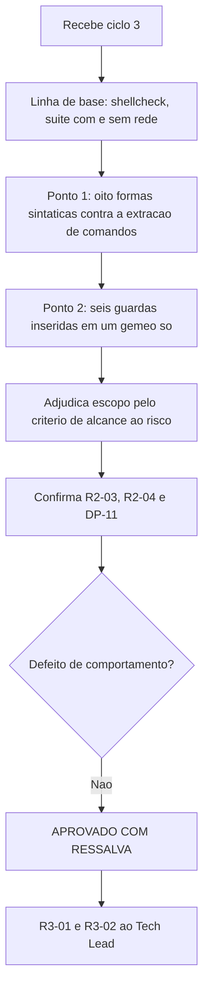

# Parecer de Validacao Independente — QA Expert — `lib/preflight` e `lib/config` — Ciclo 3

## Identificacao

| Campo | Valor |
|---|---|
| Projeto | `dropbox_api` — CLI em shell para a Dropbox API v2 |
| Escopo | Redesenho das duas auditorias com escopo derivado do codigo; `R2-01` a `R2-04`; adjudicacao de dois pontos submetidos |
| Ciclo anterior | [ciclo 2](2026-08-18_qa-validacao-preflight-e-config-ciclo2.md) — APROVADO COM RESSALVA |
| Ciclo | 3 (ultimo antes de escalonamento) |
| Data | 2026-08-18 |
| Gate | `TL-08` |
| Branch | `feature/preflight-e-config`, oito commits, arvore limpa |
| **Decisao** | **APROVADO COM RESSALVA** |

---

## 1. Decisao

**APROVADO COM RESSALVA.**

O redesenho e substantivo e a inversao que eu havia pedido — universo derivado do codigo, lista mantida a mao reduzida a **excecoes** — esta implementada nas duas auditorias, com prova de discriminacao nos dois sentidos. A evidencia mais forte nao veio de teste: **a auditoria nova apanhou o `find` que o proprio autor introduzira minutos antes**, e a anterior nao teria apanhado. Uma auditoria que se valida sozinha na mesma rodada em que nasce e o resultado que o redesenho tinha de produzir.

As ressalvas remanescentes sao duas, ambas da mesma familia: **o escopo passou a derivar do codigo, mas o reconhecedor ainda nao**. Nenhuma e defeito de comportamento.

---

## 2. Adjudicacao do Ponto 1 — ponto cego sintatico de `R2-01`

**Confirmado, e mais largo do que voce mediu: sao quatro formas, nao uma.**

Injetei `cut` em `lib/path.sh` em oito formas sintaticas:

| Forma | Auditoria |
|---|---|
| comando em linha propria | detecta |
| apos `;` | detecta |
| apos `\|` | detecta |
| apos `&&` | detecta |
| **apos `{`** (funcao de uma linha) | **cega** |
| **apos `then`** | **cega** |
| **apos `do`** | **cega** |
| **apos `else`** | **cega** |

Causa: a classe de posicao de comando e `(^|[;&|(]|&&|\|\|)`. Ela nao inclui `{` nem as palavras reservadas que abrem lista de comandos.

**Severidade: MEDIA, e vale fechar.** As tres formas que voce nao mediu pesam mais que a que mediu: `if [[ ... ]]; then head -c ...; fi` e `for x in ...; do stat ...; done` sao construcoes idiomaticas, nao estilo de conveniencia. Enquanto isso valer, a garantia real e "todo comando externo invocado **fora de corpo de condicional ou laco escrito em uma linha**", que nao e o que o nome do caso declara.

Correcao: acrescentar `\{` a classe de separadores e tratar `then`, `do`, `else`, `elif` e `in` como abertura de posicao de comando. Sugiro que a prova de discriminacao ja existente ganhe as quatro formas na amostra sintetica — assim a correcao nasce pinada.

---

## 3. Adjudicacao do Ponto 2 — escopo de `R2-02`

Voce pediu decisao e a propriedade e minha definicao original. Separo em duas perguntas, porque estavam somadas.

### 3.1 A minha sonda estava fora do escopo? **Sim. Concedo.**

O criterio correto nao e o tamanho da guarda nem a categoria do dado. E este:

> Uma divergencia entre gemeos importa quando cria um **segundo caminho nao guardado ate o mesmo risco**.

Aplicando aos quatro casos historicos, ele reproduz todos:

| Caso | Os dois alcancam o risco? | Divergencia real? |
|---|---|---|
| `QF-01` — guarda de linha em um canal so | sim, ambos emitem registro para consumidor | sim |
| `P3-01` — `trap` em `lib/hash` e nao em `lib/config` | sim, ambos criam temporario | sim |
| `P3-03`/`P3-04` — permissao | sim, ambos decidem sobre o mesmo metadado | sim |
| **guarda de tamanho so em `carregar`** | **nao — so `carregar` interpreta** | **nao** |

`dbx_preflight_verificar` nunca le conteudo. Uma guarda de tamanho limita custo de interpretacao, e existe **uma unica porta** para a interpretacao. Guardar a unica porta que alcanca o risco e desenho correto, nao assimetria. A delimitacao do autor esta certa no merito, e o `R2-02` esta **fechado**.

### 3.2 A razao declarada sustenta a delimitacao? **Nao inteiramente — e essa parte fica como ressalva.**

O autor enunciou a delimitacao como "metadado versus conteudo". Para este par as duas formulacoes coincidem, porque o preflight so alcanca metadado. Mas a formulacao por **categoria do dado** quebra quando os gemeos futuros compartilharem a leitura de conteudo — por exemplo dois pontos de validacao em `lib/http`, ambos interpretando corpo de resposta. Ali uma guarda de conteudo em um lado so **seria** divergencia legitima, e o criterio declarado a excluiria.

Recomendo reenunciar pelo alcance. Produz a mesma resposta hoje e continua correta depois.

### 3.3 E o escopo declarado corresponde ao implementado? **Nao — achado novo**

Aqui a sua desconfianca sobre a segunda sonda (`%Y`) estava certa, e o dado confirma. Acrescentei seis guardas apenas a `dbx_config_carregar`:

| Guarda inserida so no `config` | Auditoria |
|---|---|
| nova sobre `modo` | detecta (2 reprovacoes) |
| nova sobre `dono` | detecta (2 reprovacoes) |
| `-w` sobre o arquivo | detecta (2 reprovacoes) |
| **`stat -c %Y` (mtime) em variavel nova** | **nao detecta** |
| **`stat -c %i` (inode) em variavel nova** | **nao detecta** |
| `stat -c %s` (tamanho) | nao detecta — **correto**, fora do escopo por 3.1 |

`mtime` e `inode` sao **metadado sem ambiguidade**, e ambos alcancaveis pelos dois gemeos: se um dia houver guarda de "credencial mais antiga que N dias", o preflight e exatamente onde ela avisaria cedo. O extrator, porem, reconhece guarda por um vocabulario fixo — `modo|modo_diretorio|dono` mais operadores de teste de arquivo. Ou seja: **o conjunto de guardas passou a ser derivado do codigo, mas o reconhecedor de "o que e guarda" continua mantido a mao**, um nivel abaixo.

E a mesma inversao que faltava na versao anterior, deslocada. Severidade **BAIXA-MEDIA**: nenhuma guarda atual usa essas dimensoes, entao e latente.

### 3.4 A exclusao da existencia (`-e` versus `-f`) — **concordo**

Passa nos dois criterios. Pelo declarado: e diferenca de desenho, nao de rigor. Pelo alcance: o risco "operar sem credencial" so e alcancavel pelo comando que a exige, nunca pelo preflight, cuja definicao explicita e que credencial ausente e estado normal antes da configuracao inicial. Documentar em vez de afrouxar foi a decisao certa — uma auditoria que reprova por engano deixa de ser consultada, e esse custo e maior que o da excecao.

---

## 4. Verificacao das demais correcoes

### `R2-03` — criterio duplo, verificado nas tres direcoes

```
orfao ANTIGO (PID vivo, 10 min)  -> removido        (idade cobre a reciclagem de PID)
orfao RECENTE (PID vivo)         -> preservado      (gravacao em curso, correto)
10 gravacoes concorrentes        -> 1 arquivo, 0 orfaos, conteudo integro
6 SIGKILL + gravacao seguinte    -> 0 orfaos
```

A concorrencia segue intacta, que era a propriedade em risco. O criterio duplo resolve o residual sem custo.

### `R2-04` — a propriedade passou a ser dona de si

Mutando o escape da barra invertida:

| Suite | Antes | Agora |
|---|---|---|
| `json` | 0 | **2** |
| `config` | 2 | 2 |

A ida e volta em `config` foi mantida como evidencia de composicao, e os casos diretos vivem onde o codigo vive. Era exatamente o pedido.

### `DP-11` — fronteira registrada com precisao

> *"FRONTEIRA DE CONFIANCA: o usuario do sistema. Contra o proprio usuario a substituicao sempre sera possivel, porque ele pode escrever o arquivo real sem recorrer a variavel alguma. O que estas verificacoes impedem e a substituicao por OUTRO usuario e o desvio por ambiente."*

Corresponde ao comportamento medido no ciclo 2 e nao promete mais do que entrega.

### Linha de base

| Item | Resultado |
|---|---|
| `shellcheck -x` | exit **0** |
| Suite sem rede | **305 / 0 / 2** |
| Suite com rede | **307 / 0 / 0** |
| Arvore | limpa; nenhum arquivo alterado por esta validacao |

---

## 5. Nota de metodo — oitava instancia de `RSK-28`

Registro a sua instancia porque ela tem uma licao propria: rodar `tests/unit/preflight_test.sh` isoladamente produz reprovacoes porque o arquivo depende do ambiente que o executor monta. O instrumento era o proprio comando de invocacao.

Nao considero defeito — depender do executor e normal. Mas o custo de diagnostico foi real e e barato de eliminar: o arquivo pode recusar-se a rodar com mensagem explicita quando `DBX_TESTES_TMP` nao estiver definido, em vez de reprovar casos. Sugiro como melhoria de instrumento, nao como condicao.

Vale tambem o contraste que esta rodada oferece. Das oito instancias, esta e a primeira em que **a auditoria apanhou o autor antes de qualquer humano** — o `find` da varredura por idade. E o argumento empirico mais forte a favor da tese que ele enunciou no ciclo anterior, e agora com um caso em que o instrumento derivado funcionou onde o mantido a mao teria falhado.

---

## 6. Fluxo de validacao



---

## 7. Condicoes

**Corrigir antes de `lib/auth`** — as duas auditorias governam o que muda quando `lib/http` chegar:

1. `R3-01` — incluir `{`, `then`, `do`, `else`, `elif` e `in` na classe de posicao de comando, e acrescentar as quatro formas a amostra sintetica da prova de discriminacao.
2. `R3-02` — derivar tambem o reconhecedor de guarda, em vez de fixar `modo|modo_diretorio|dono`. Alternativa de custo baixo: extrair toda condicao cujo operando venha de `stat` ou de teste de arquivo sobre `$arquivo`/`$diretorio`, seja qual for o nome da variavel.

**Registrar como aceito:**

3. Inversao universo/excecoes implementada nas duas auditorias, com prova de discriminacao nos dois sentidos — inclusive contra falso positivo, que era metade do problema.
4. `teste_gemeos_decidem_igual_em_todo_o_espaco_de_permissao` percorre os **512 modos**, e nao uma amostra: escopo derivado do dominio, exatamente o padrao recomendado.
5. `R2-02` **fechado**; a sonda do QA estava fora do escopo, e a delimitacao do autor esta correta no merito.
6. Exclusao da existencia (`-e` versus `-f`): **concordo**, por desenho e por alcance.
7. `R2-03` e `R2-04` fechadas e verificadas de forma independente.
8. `DP-11` com fronteira de confianca registrada com precisao.
9. O redesenho apanhou o proprio autor na mesma rodada — validacao empirica do metodo.

**Ajustar na redacao do escopo, sem custo de codigo:**

10. Reenunciar a delimitacao dos gemeos pelo **alcance ao risco**, e nao por categoria do dado (secao 3.2). Preserva a decisao atual e sobrevive a gemeos futuros que compartilhem leitura de conteudo.

**Pendencia de processo:**

11. O registro tecnico desta rodada ainda nao foi redigido. Este parecer nao o substitui.

---

## 8. Desvios de protocolo

| Desvio | Justificativa |
|---|---|
| Cypress (item 13) | Nao aplicavel: nao ha interface web ou grafica |
| `qa-validacao-frontend-template.md` (itens 17 e 19) | Nao aplicavel: nao ha Design System nem handoff do UX Expert |
| `prompt-logger` (item 2) | Nao acionado, por instrucao do coordenador |

Nenhum arquivo de codigo, teste ou requisito foi alterado; mutacoes e sondas ocorreram em copias descartaveis fora do repositorio. Sem commit, sem push, nada instalado.
