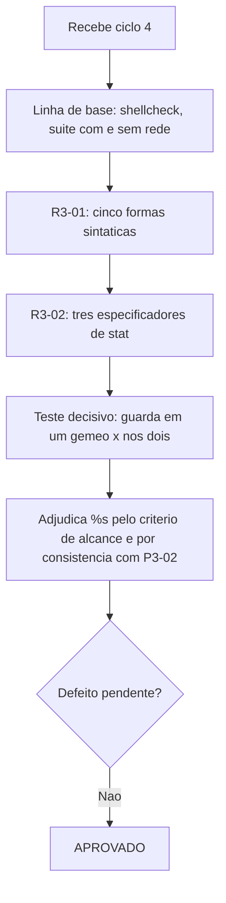

# Parecer de Validacao Independente — QA Expert — `lib/preflight` e `lib/config` — Ciclo 4

## Identificacao

| Campo | Valor |
|---|---|
| Projeto | `dropbox_api` — CLI em shell para a Dropbox API v2 |
| Escopo | Fechamento de `R3-01` e `R3-02`; adjudicacao da questao de `%s`; execucao isolada de arquivo de teste |
| Ciclo anterior | [ciclo 3](2026-08-18_qa-validacao-preflight-e-config-ciclo3.md) — APROVADO COM RESSALVA |
| Data | 2026-08-18 |
| Gate | `TL-08` |
| Branch | `feature/preflight-e-config`, nove commits, arvore limpa |
| **Decisao** | **APROVADO** — sem ressalva, pronto para o fechamento do Tech Lead |

---

## 1. Decisao

**APROVADO.**

Nao ha defeito pendente. A unica questao em aberto era minha e esta adjudicada abaixo, em favor do codigo como esta. Sondei novamente as duas auditorias com casos proprios e todas as formas se comportaram corretamente.

---

## 2. Adjudicacao de `%s` — **a deteccao esta certa, e a minha observacao anterior foi superada**

**Decido pela primeira opcao.** O criterio que reenunciei inclui tamanho, a deteccao esta correta, e o autor agiu certo ao declarar a divergencia em vez de acomoda-la.

### Onde eu errei no ciclo 3

Ao aplicar o criterio de alcance, identifiquei o risco protegido por uma guarda de tamanho como **custo de interpretacao** — e custo de interpretacao so e alcancavel por `dbx_config_carregar`, que e o unico que interpreta. Dai concluí que a guarda pertencia a um gemeo so.

O enquadramento estava estreito, e **contradizia um achado meu anterior**. No ciclo 1, reprovei `P3-02` com esta frase:

> *"um falso positivo deixa passar ambiente quebrado para falhar mais adiante, com diagnostico pior"*

Um arquivo de credencial em tamanho implausivel **e** ambiente quebrado, e detecta-lo cedo e a funcao declarada do preflight. O risco real que uma guarda de tamanho protege nao e o custo de interpretar: e **a credencial estar em estado implausivel**. Esse risco e alcancavel pelos dois gemeos. Logo o criterio o inclui, e a exclusao que propus era inconsistente com o meu proprio `P3-02`.

### O que torna a decisao inequivoca

Medi a propriedade que resolve a questao na pratica:

```
guarda de tamanho em UM gemeo so  -> 1 reprovacao
guarda de tamanho em AMBOS        -> 0 reprovacoes
nenhum dos dois com a guarda      -> 0 reprovacoes  (estado atual)
```

**A auditoria exige paridade, nao a guarda.** Ela nao obriga ninguem a escrever guarda de tamanho — hoje nenhum dos dois tem, e a suite esta verde. Ela so obriga a simetria **quando** alguem escrever uma. Isso elimina o custo pratico de manter `%s` no escopo: nao custa nada hoje e impede uma assimetria real amanha.

E a razao 1 do autor e independentemente decisiva: excluir o especificador exigiria uma **excecao mantida a mao dentro do reconhecedor**, que e exatamente a inversao que esta rodada eliminou. Trocar reconhecedor derivado por exclusao manual, para acomodar um julgamento meu que estava errado, seria o pior dos desfechos.

### Registro

Fica registrado que a observacao do ciclo 3 sobre `%s` foi **superada pelo criterio que eu mesmo formulei em seguida**, e que a decisao de nao resolver a questao por conta propria foi correta: se ela tivesse sido acomodada em silencio, o reconhecedor teria regredido e ninguem veria a ligacao.

---

## 3. Verificacao das correcoes

### `R3-01` — fechado

Cinco formas sintaticas, incluindo `else`, que eu nao havia medido no ciclo 3:

| Forma | Reprovacoes |
|---|---|
| linha propria · apos `{` · apos `then` · apos `do` · apos `else` | **1 em cada** |

De 1 de 4 para 5 de 5. A troca de ancoragem por **normalizacao** e a correcao estrutural certa: ancorar no separador falha porque a ancora consome a correspondencia, e nenhuma ampliacao da classe de separadores resolveria isso — trataria sintoma. As quatro formas entraram na amostra sintetica, entao a correcao nasceu pinada.

### `R3-02` — fechado

| Especificador | Reprovacoes |
|---|---|
| `%Y` mtime · `%i` inodo · `%s` tamanho | **1 em cada** |

O reconhecedor passou a descobrir as variaveis de metadado pelas **proprias atribuicoes a partir do `stat`**, e a assinatura carrega o especificador, nao o nome da variavel. A ampliacao dos operadores para comparacao numerica fecha a rota pela qual as guardas injetadas escapavam — era esse o mecanismo, e nao o vocabulario de nomes.

### `R2-02` — criterio reenunciado no proprio codigo

O criterio de alcance ate o risco passou a viver na auditoria, e a exclusao da existencia (`-e` versus `-f`) permanece, agora justificada por ele: o risco "operar sem credencial" so e alcancavel pelo comando que a exige, nunca pelo preflight, cuja definicao explicita e que credencial ausente e estado normal. **Concordo com a delimitacao sob o criterio novo.**

### Execucao isolada — orienta e falha fechada

```
Este arquivo de teste precisa do ambiente montado pelo executor.
Use: bash tests/run.sh [filtro]
Motivo: DBX_TESTES_TMP nao esta definida.
```

A mensagem nomeia a causa e o comando correto. Verifiquei tambem o codigo de saida, que a mensagem sozinha nao revela: **exit 2** (`uso_invalido`), coerente com a taxonomia e falhando fechada — um executor de integracao continua lendo reprovacao, e nao aprovacao vazia. Vale para os quatro arquivos testados.

### Linha de base

| Item | Resultado |
|---|---|
| `shellcheck -x` | exit **0** |
| Suite sem rede | **305 / 0 / 2** |
| Suite com rede | **307 / 0 / 0** |
| Arvore | limpa; nenhum arquivo alterado por esta validacao |

---

## 4. Sobre a ressalva do autor ao meu dado — **procede, e corrijo**

Ele esta certo e eu superdimensionei. Escrevi que a auditoria apanhar o proprio autor — o `find` — era "o argumento empirico mais forte a favor da tese". Uma instancia nao sustenta tese alguma. O que o caso demonstra, e apenas isso, e que **a auditoria derivada conseguiu o que a de lista nao conseguia**, num caso concreto.

Reclassifico: **hipotese sob observacao**, a confirmar ou refutar nos proximos incrementos, com o criterio de acompanhamento sendo a proporcao entre ocorrencias apanhadas por instrumento e ocorrencias apanhadas por leitura. Sugiro que `RSK-28` passe a registrar essa proporcao a cada incremento, para que a tese seja decidida por serie e nao por episodio.

Acrescento a nona instancia, minha: ao verificar a execucao isolada, li `exit=0` porque medi o status de um `head` no fim de um cano, e nao o do arquivo de teste. Refiz e o valor real e 2. O padrao continua atingindo quem valida.

---

## 5. Fluxo



---

## 6. Fechamento

**Pronto para o fechamento do Tech Lead.** Nada bloqueia.

Itens a registrar no fechamento:

1. `P3-01` a `P3-05`, `R2-01` a `R2-04`, `R3-01` e `R3-02` — todos fechados e verificados de forma independente ao longo de quatro ciclos.
2. Questao de `%s` adjudicada em favor do codigo; observacao do QA no ciclo 3 **superada** pelo criterio de alcance, por inconsistencia com `P3-02`.
3. As duas auditorias tem escopo **e** reconhecedor derivados do codigo, com prova de discriminacao nos dois sentidos e demonstracao de que exigem **paridade**, nao a guarda.
4. `DP-11` com fronteira de confianca registrada como o usuario do sistema.
5. Tese sobre auditoria versus inspecao rebaixada a **hipotese sob observacao**, com criterio de acompanhamento proposto.
6. Registro tecnico da rodada redigido; a pendencia de processo do ciclo 3 esta encerrada.

---

## 7. Desvios de protocolo

| Desvio | Justificativa |
|---|---|
| Cypress (item 13) | Nao aplicavel: nao ha interface web ou grafica |
| `qa-validacao-frontend-template.md` (itens 17 e 19) | Nao aplicavel: nao ha Design System nem handoff do UX Expert |
| `prompt-logger` (item 2) | Nao acionado, por instrucao do coordenador |

Nenhum arquivo de codigo, teste ou requisito foi alterado; sondas ocorreram em copias descartaveis fora do repositorio. Sem commit, sem push, nada instalado.
