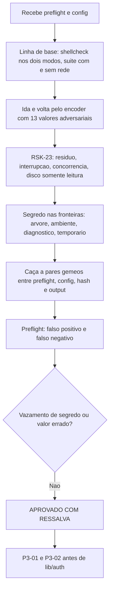

# Parecer de Validacao Independente — QA Expert — `lib/preflight` e `lib/config`

## Identificacao

| Campo | Valor |
|---|---|
| Projeto | `dropbox_api` — CLI em shell para a Dropbox API v2 |
| Escopo | Etapa 3, primeiro incremento: `lib/preflight.sh`, `lib/config.sh`, encoder `dbx_json_escapar_cadeia`, `app_key` na taxonomia |
| Ciclo | 1 (de 3 antes de escalonamento ao solicitante) |
| Data | 2026-08-18 |
| Gate | `TL-08` |
| Branch | `feature/preflight-e-config`, tres commits, arvore limpa |
| **Decisao** | **APROVADO COM RESSALVA** |
| Bloqueantes antes de `lib/auth` | `P3-01` e `P3-02` |

---

## 1. Decisao

**APROVADO COM RESSALVA.**

A decisao de formato esta certa e verifiquei que ela se sustenta na pratica, e nao apenas no argumento: o par escapar/analisar sobreviveu a **treze valores adversariais**, incluindo o proprio separador interno do analisador. O segredo nao vaza em nenhuma das fronteiras que ataquei, e a afirmacao de que a arvore do analisador e descartada apos a extracao **e verdadeira**, medida variavel a variavel.

Duas ressalvas de severidade media impedem o consumo por `lib/auth`: um residuo com o segredo em disco apos terminacao anormal, e falso positivo do preflight para cinco utilitarios que o proprio projeto exige.

---

## 2. Defeitos

### P3-01 · MEDIA — terminacao anormal durante a gravacao deixa copia do segredo em disco

`dbx_config_gravar` cria o temporario com `mktemp` e nao instala `trap`. Entre `mktemp` e `mv` existe uma janela em que uma terminacao nao tratavel deixa o arquivo para tras.

Medido, oito `SIGKILL` em instantes aleatorios da gravacao:

```
temporarios orfaos: 1
-rw------- .../cfg/dbx/.credencial.dVdy9wKN
CONTEM O SEGREDO: .../cfg/dbx/.credencial.dVdy9wKN
```

Tres consequencias, em ordem de peso:

1. **Contradiz a invariante declarada no proprio cabecalho** — "esta e a unica escrita persistente de todo o projeto". Passa a haver um segundo artefato persistente, com nome imprevisivel, que nenhum caminho de codigo remove.
2. **Derrota a rotacao de credencial.** Apos o operador trocar o `refresh_token`, o token antigo permanece em disco, em arquivo oculto, indefinidamente.
3. E `RSK-23` no ponto exato que `RSK-23` existe para vigiar.

Nao ha vazamento para outro usuario: o arquivo nasce `0600` sob `umask 077`. O problema e persistencia, nao exposicao.

**E um par gemeo da classe `QF-01`, e a assimetria e verificavel:**

```
trap de limpeza:  lib/hash = 1     lib/config = 0
```

`lib/hash` recebeu o `trap` quando `RNF-05` foi endereçado, para um buffer transitorio. `lib/config`, que grava o **segredo**, nao recebeu. A licao foi aplicada ao componente de menor consequencia.

Correcao: `trap 'rm -f -- "$temporario"' EXIT INT TERM HUP` dentro da funcao, no mesmo padrao ja usado em `_dbx_hash_calcular`, mais varredura de `.credencial.*` remanescente no inicio da gravacao.

### P3-02 · MEDIA — o preflight aprova ambiente em que a primeira operacao ja falha

`DBX_PREFLIGHT_UTILITARIOS='curl'`. Medido, removendo do `PATH` um utilitario por vez:

| Ausente | Preflight | `dbx_config_gravar` |
|---|---|---|
| `curl` | 3 · `dependencia` | 0 |
| `sha256sum`/`shasum`/`openssl` | 3 · `dependencia` | 0 |
| **`mktemp`** | **0 · OK** | **3** |
| **`mv`** | **0 · OK** | **3** |
| **`chmod`** | **0 · OK** | **3** |
| **`mkdir`** | **0 · OK** | **3** |
| **`dirname`** | **0 · OK** | **2** |

O operador executa o preflight, recebe "ambiente adequado", e a **primeira** coisa que faz — registrar a credencial — falha com erro generico de `configuracao`. `RNF-02` exige que a aplicacao "falhe com mensagem nomeando o utilitario"; isso so acontece para `curl` e para a familia do resumo.

Fora do caminho de `gravar`, tambem passam sem serem nomeados `stat` (usado pelo proprio preflight e por `dbx_config_carregar`), `head` e `wc` (`lib/hash`), `tr` (`lib/errors`, `lib/json`) e `readlink` (`lib/path`).

Nota: com **nenhum** utilitario disponivel o preflight recusa corretamente com `dependencia`. O defeito e de cobertura da lista, nao de mecanismo.

### P3-03 · MEDIA-BAIXA — permissao mais restritiva que `0600` e recusada

`[[ $modo == '600' ]]`, nos dois caminhos. Medido em onze modos:

```
600 -> preflight 0 · carregar 0
400 -> preflight 3 · carregar 3      <<< falso negativo
640 644 660 606 666 700 777 604 602 -> recusados nos dois (correto)
```

`0400` e **mais** restritiva que `0600`: o arquivo so precisa ser legivel, porque a gravacao ocorre por `mktemp` e renomeacao, que exigem escrita no **diretorio**, nao no arquivo. Um operador que endureça a credencial para somente leitura fica impedido de usar a ferramenta.

E o mesmo principio que o proprio incremento aplicou ao diretorio — *"forcar 700 a cada gravacao desfaria em silencio uma permissao que o operador tenha escolhido deliberadamente, inclusive uma mais restritiva"* — nao aplicado ao arquivo. Aqui os dois gemeos **concordam**, entao e ponto cego compartilhado, e nao divergencia.

Sugestao: aceitar quando os bits de grupo e outros forem zero, isto e, `0600` e `0400`, recusando qualquer bit fora do dono.

### P3-04 · BAIXA-MEDIA — a permissao do diretorio nunca e verificada, por nenhum dos dois

```
diretorio 700 -> preflight 0 · carregar 0
diretorio 750 -> preflight 0 · carregar 0
diretorio 755 -> preflight 0 · carregar 0
diretorio 777 -> preflight 0 · carregar 0      <<< aceito por AMBOS
```

O `chmod 700` ocorre apenas na criacao — decisao correta por `P3-03` — e depois disso nada valida. Com o diretorio gravavel por todos, outro usuario local pode **remover ou renomear** a credencial. Nao pode le-la (`0600`) nem substitui-la por uma sua (a verificacao de dono recusaria), entao o efeito e negacao de servico, nao roubo. Ainda assim, `RNF-04` (menor privilegio) nao esta verificado ponta a ponta.

### P3-05 · BAIXA — o encoder usa a indexacao que `lib/json` documenta como armadilha

`lib/json.sh:23` declara: *"nao se usa indexacao de cadeia longa (`${cadeia:indice:1}`), que e quadratica em `bash` mesmo sob `LC_ALL=C` — armadilha medida e registrada na Etapa 1"*.
`lib/json.sh:764`, no encoder novo: `caractere=${texto:indice:1}`.

Medido: 500 chars 0,016 s · 1.000 0,013 s · 2.000 0,036 s · 4.000 0,117 s — cerca de 3,2x por duplicacao acima de mil.

Sem consequencia operacional para credencial (valores abaixo de 1 KB, dezenas de milissegundos). Registro porque a regra e violada no mesmo arquivo que a enuncia, e porque `raiz_remota` e o unico campo sem teto declarado.

---

## 3. O que resistiu ao ataque

### Ida e volta pelo par escapar/analisar — treze valores, nenhuma perda

| Valor | Resultado |
|---|---|
| aspas · barra invertida · cifrao e crase | ok |
| quebra de linha · quebra **final** · tabulacao · retorno de carro | ok |
| **separador interno do analisador (`0x1f`)** | ok |
| **byte de controle `0x01`** | ok |
| UTF-8 de 3 e 4 bytes | ok |
| vazio | ok |

O caso do `0x1f` e o mais significativo: e o separador que o proprio `lib/json` usa internamente, e o escape produzido pelo encoder atravessa o analisador sem colidir. A escolha de reaproveitar o unico interpretador, em vez de abrir um segundo caminho de codificacao, **esta validada empiricamente** e nao apenas por argumento.

### Segredo nas fronteiras — nenhum vazamento

| Fronteira | Resultado |
|---|---|
| Variaveis `DBX_JSON_*` apos `carregar` | **nenhuma** contem o segredo — o descarte da arvore e real |
| Variaveis `DBX_CONFIG_*` | apenas `DBX_CONFIG_REFRESH_TOKEN`, como projetado |
| Mensagem de erro com arquivo corrompido | motivo `malformado`, segredo ausente |
| Ambiente exportado para filhos | zero ocorrencias |
| Residuo em `TMPDIR` e `HOME` | zero |

A unica superficie de segredo em disco alem do arquivo e a de `P3-01`.

### Estado persistente (`RSK-23`)

```
arvore completa apos gravar:
  drwx------  cfg/dbx
  -rw-------  cfg/dbx/credencial.json
20 gravacoes seguidas  -> 1 arquivo
10 gravacoes concorrentes -> 1 arquivo, 0 orfaos, conteudo integro
diretorio somente leitura -> status 3, motivo `gravacao`, credencial anterior intacta
```

Sem cache, indice, cursor ou trava. A renomeacao atomica se comporta corretamente sob concorrencia.

### Caminhos gemeos

Confirmei que sao **os mesmos** em permissao, dono e verificacao de arquivo comum:

```
stat -c '%a'   preflight=1 config=1
stat -c '%u'   preflight=1 config=1
[[ -f ]]       preflight=1 config=1
EUID           preflight=1 config=1
```

Onze modos de permissao produzem decisao identica nos dois. Os gemeos estao alinhados; as divergencias que encontrei sao `P3-01` (entre `lib/hash` e `lib/config`) e o ponto cego compartilhado de `P3-03`/`P3-04`.

### `QF-01` — fechado, e da forma estruturalmente correta

Retifico uma inferencia minha: uma busca textual dentro do corpo de `dbx_output_render_diagnostico` nao encontrou `dbx_path_seguro_para_linha` e me levou a suspeitar que o bloqueante continuava aberto. **A verificacao empirica refutou a suspeita.** A guarda foi extraida para `_dbx_output_validar_para_linha` e e chamada pelos **dois** canais (linhas 184 e 225). Reproduzi o ataque de forja de registro do parecer anterior: o canal de diagnostico agora recusa e nao emite nada.

Registro o metodo: a inferencia por `grep` estava errada e a execucao corrigiu. Vale como mais um caso de `RSK-28` do lado de quem valida.

A correcao e melhor do que a que eu havia recomendado — eu pedi que a guarda fosse aplicada ao segundo canal; ela foi **unificada em um so ponto**, o que impede a divergencia de reaparecer.

### Correcoes autodeclaradas — confirmadas

| Item | Verificacao |
|---|---|
| `chmod 700` apenas na criacao do diretorio | confirmado no codigo; `750` e `755` preservados |
| Sonda de preflight preserva o proprio `timeout` no `PATH` reduzido | confirmado, `PATH="$caminho" timeout 30 bash -c` |
| Sonda do resumo remove os **tres** aceitos | confirmado: a lista cobre `sha256sum shasum openssl` |
| Teste de gravacao atomica procura **qualquer** arquivo alem da credencial | confirmado — a versao anterior filtrava por nome com "tmp", que nao casava com `.credencial.XXXXXXXX` |
| Teste de preservacao em falha de gravacao | presente e correto |

---

## 4. Sobre a interpretacao de `DP-11` — **concordo**

A proibicao nomeia "sobrescrita **da credencial** por variavel de ambiente". O objeto e o **segredo**, e o proposito declarado e remover o vetor de leitura do ambiente do processo. `XDG_CONFIG_HOME` transporta **localizacao**, nao segredo. Alem disso, a decisao adota XDG explicitamente, e XDG **e definido** por essa variavel: a leitura contraria tornaria a decisao autocontraditoria. Verifiquei que `DBX_REFRESH_TOKEN` no ambiente nao injeta e que o valor do arquivo vence.

Acrescento uma propriedade defensiva que vale registrar explicitamente, porque hoje ela e acidental: quem controla o ambiente pode apontar `XDG_CONFIG_HOME` para um diretorio proprio, mas as verificacoes de **dono** e de **`0600`** recusam a credencial plantada. O ataque degrada para negacao de servico, e nao para substituicao de credencial. Sugiro que isso conste do registro de `DP-11` como consequencia pretendida, e nao como efeito colateral — do contrario um afrouxamento futuro da verificacao de dono removeria a protecao sem que ninguem percebesse a ligacao.

---

## 5. Linha de base

| Item | Resultado |
|---|---|
| `shellcheck -x` | exit **0** |
| `shellcheck` sem `-x` | exit **0** |
| `bash -n` em todos os arquivos | limpo |
| Suite sem rede | **289 / 0 / 2** |
| Suite com rede | **291 / 0 / 0** — vetor oficial de `content_hash` fechado |
| Arvore | limpa; nenhum arquivo alterado por esta validacao |

---

## 6. Fluxo de validacao



---

## 7. Condicoes

**Bloqueantes antes de `lib/auth` e `lib/http`:**

1. `P3-01` — `trap` de limpeza em `dbx_config_gravar`, no padrao ja usado em `_dbx_hash_calcular`, mais varredura de `.credencial.*` remanescente. Caso de teste que mate o processo na janela e verifique ausencia de residuo.
2. `P3-02` — completar `DBX_PREFLIGHT_UTILITARIOS` com `stat`, `mktemp`, `mv`, `chmod`, `mkdir`, `dirname`, `head`, `wc`, `tr` e `readlink`, com caso que remova cada um e exija que o preflight **nomeie** o ausente.

**Corrigir na mesma rodada:**

3. `P3-03` — aceitar `0400` alem de `0600`, recusando qualquer bit fora do dono.
4. `P3-04` — verificar a permissao do diretorio nos dois caminhos, recusando bits de grupo ou de outros.
5. `P3-05` — trocar a indexacao do encoder pelo padrao de marcacao ja usado no restante de `lib/json`, ou registrar a excecao com o teto de tamanho que a justifica.

**Registrar como aceito:**

6. Formato JSON reaproveitando o unico interpretador: decisao correta, validada por treze valores adversariais, inclusive o separador interno do analisador.
7. Encoder em `lib/json`, e nao em `lib/config`: alocacao correta do conhecimento.
8. Descarte da arvore do analisador apos a extracao: verificado variavel a variavel, sem residuo do segredo.
9. Contexto nomeado literal na leitura, aderente a `RNF-24`.
10. Gravacao atomica correta sob concorrencia de dez processos e sob diretorio somente leitura.
11. Caminhos gemeos alinhados em permissao, dono e tipo de arquivo, nos onze modos testados.
12. Interpretacao de `DP-11`: **concordo**, com a sugestao da secao 4.
13. `QF-01` fechado por guarda unificada — melhor que a correcao que eu havia recomendado.
14. As tres correcoes autodeclaradas e os dois testes fracos: confirmados.

---

## 8. Desvios de protocolo

| Desvio | Justificativa |
|---|---|
| Cypress (item 13) | Nao aplicavel: nao ha interface web ou grafica |
| `qa-validacao-frontend-template.md` (itens 17 e 19) | Nao aplicavel: nao ha Design System nem handoff do UX Expert |
| `prompt-logger` (item 2) | Nao acionado, por instrucao do coordenador |

Nenhum arquivo de codigo, teste ou requisito foi alterado; sondas ocorreram em copias descartaveis fora do repositorio. Sem commit, sem push, nada instalado.
