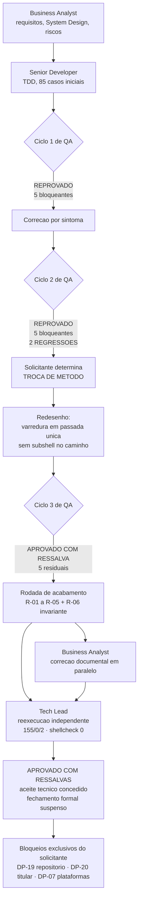
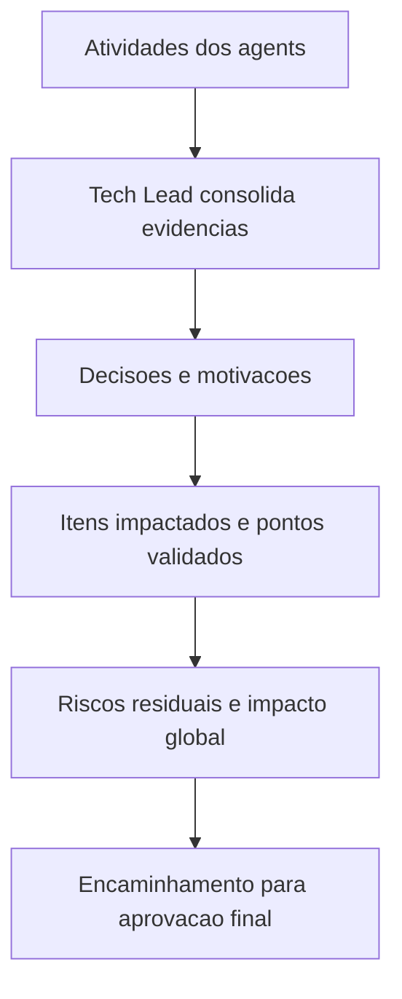

# Revisao Consolidada do Tech Lead — Etapa 1, Camada de Dominio

## Identificacao

- Projeto ou produto: Aplicacao CLI em shell script para integracao com a Dropbox API v2 (`/home/sales/dropbox_api`)
- Responsavel Tech Lead: agent `tech-lead` do pacote `.claude/agents-protocol`
- Data da revisao: 2026-08-18
- Escopo revisado: **Etapa 1 — camada de dominio**: `lib/hash.sh`, `lib/errors.sh`, `lib/path.sh`, mais o arcabouco de testes `tests/run.sh`, `tests/support/harness.sh`, `tests/support/fixtures.sh` e os quatro arquivos de teste unitario
- Agents envolvidos: Business Analyst, Senior Developer, QA Expert, Tech Lead. UX Expert e DBA nao acionados, com justificativa formal
- Status da revisao: Concluida com ressalvas

## Resumo executivo

- Objetivo da entrega: Entregar camada de dominio com tres modulos independentes (`lib/hash.sh`, `lib/errors.sh`, `lib/path.sh`) verificados por suite de testes TDD, validados por QA independente em tres ciclos, com comportamentos criticos cobertos por teste e contrato publico de codigos de saida fixado.
- Contexto consolidado: a Etapa 1 e a **camada de dominio do MVP** aprovado em `PRJ-DEC-04`, e nao o MVP inteiro: calculo de `content_hash`, taxonomia de erro e confinamento de caminho remoto e local. A implementacao percorreu quatro rodadas: tres ciclos de QA — reprovado, reprovado, aprovado com ressalva — mais uma rodada de acabamento que fechou os **cinco achados residuais** (`R-01` a `R-05`; `R-06` nao e um sexto defeito, e sim a fixacao por teste da invariante que torna nula a mutacao de ordem discutida em `C2-04`). A suite cresceu de 85 casos iniciais para 155 no fechamento (+82%). O Tech Lead reexecutou de forma independente a suite completa e a analise estatica em 2026-08-18.
- Resultado executivo da revisao: **Aprovado com ressalvas**. Aceite tecnico concedido: a camada esta apta a ser consumida pela Etapa 2. Quatro invariantes arquiteturais nasceram dos ciclos de QA. Fechamento formal suspenso por dois bloqueios exclusivos do solicitante (`DP-19` — repositorio git nao existente, `DP-20` — titular do copyright em espaco reservado).
- Recomendacao do Tech Lead: Autorizar commit inicial cobrindo os artefatos da Etapa 1 tao logo `DP-19` e `DP-20` sejam respondidas pelo solicitante, mantendo a copia do workspace intacta como backup ate essa autorizacao. Abertura da Etapa 2 condicionada a respostas de `DP-07` (plataformas), `DP-08` (jq) e `DP-11` (credencial).

## Verificacao independente do Tech Lead

Reexecucao em 2026-08-18:

| Verificacao | Comando executado pelo Tech Lead | Resultado observado |
|---|---|---|
| Suite completa, modo padrao | `bash tests/run.sh` | 4 arquivos executados, **155 aprovados, 0 reprovados, 2 pulados**, resultado `APROVADA` |
| Suite com rede | `DBX_TESTES_REDE=1 bash tests/run.sh` | **157 aprovados, 0 reprovados, 0 pulados** — reproduzido pelo solicitante; o Tech Lead executou apenas o modo padrao nesta rodada, por nao acionar rede sem necessidade |
| Analise estatica (RNF-13) | `~/.local/bin/shellcheck -x lib/*.sh tests/*.sh tests/support/*.sh tests/unit/*.sh` | **exit 0**, 7 supressoes com justificativa individual |
| Estado de versionamento | `git rev-parse --is-inside-work-tree` | `fatal: not a git repository` — confirma `DP-19` em aberto |
| Licenca | leitura de `LICENSE` | MIT presente, **titular em espaco reservado**: `<TITULAR DO COPYRIGHT — CONFIRMAR ANTES DO PRIMEIRO COMMIT>` — confirma `DP-20` e `DIV-E` em aberto |

Evolucao da suite ao longo dos ciclos: **85 casos no inicio, 155 no fechamento** (+82%).

Itens reproduzidos e conferidos pelo solicitante antes do acionamento do Tech Lead, aceitos como evidencia por corroboracao independente e nao reexecutados nesta rodada:

- `content_hash` conferido contra oraculo Python independente em todas as fronteiras de bloco de 4 MiB e contra o vetor oficial publicado pela Dropbox (`docs/registros/vetores-content-hash.md`)
- Redacao de segredo sem vazamento nos formatos JSON, querystring, cabecalho `Basic`, cabecalho `Cookie`, aspa escapada e byte de controle; pior caso de custo reduzido de ~98 s para 128 ms ao longo dos ciclos
- Confinamento remoto e local resistente aos oito vetores de ataque do QA
- Ausencia de estado local persistente (`PRJ-DEC-07`), ausencia de residuo temporario e ausencia de codigo derivado do `Dropbox-Uploader` (`PRJ-DEC-01`)

## PRD e ARD

- PRD aplicavel?: **Sim, por equivalencia funcional.** Nao existe artefato nomeado "PRD". A funcao de PRD e cumprida por `docs/requisitos/escopo-requisitos-e-criterios-de-aceite.md` (v0.4), apoiado por `docs/requisitos/funcionalidades-candidatas.md` e `docs/requisitos/decisoes-pendentes.md`. Revisar como PRD equivalente. Registrar explicitamente essa equivalencia.
- Referencia do PRD: `docs/requisitos/escopo-requisitos-e-criterios-de-aceite.md` (v0.4)
- ARD aplicavel?: **Sim, por equivalencia funcional.** Nao existe artefato nomeado "ARD". A funcao e cumprida por `docs/arquitetura/system-design.md` (v0.4), aderente ao template padrao `.claude/agents-protocol/templates/system-design-template.md`, somado ao registro de decisoes arquiteturais em `MEMORIA-PROJETO.md` (`PRJ-DEC-07`, `PRJ-DEC-11` a `PRJ-DEC-21`).
- Referencia do ARD: `docs/arquitetura/system-design.md` (v0.4)

| Artefato | Item revisado | Consistencia com entrega | Lacunas encontradas | Observacoes |
|---|---|---|---|---|
| PRD (equivalente) | RF-29, RF-31, RF-33, RF-34, RF-35, RNF-03, RNF-08, RNF-10, RNF-13, RNF-20, RNF-22 | Consistente na v0.4 | `RNF-01` congelado ate `DP-07` fechar; formato de linha de RF-28/RF-35 x nome com quebra de linha em aberto (`DIV-16b`) | RF-35 atualizado na v0.4 com a faixa 0..15 e a rejeicao do codigo 16 |
| PRD (equivalente) | RNF-20 ampliado para os dois espacos de nomes | Consistente; os oito vetores viraram criterio de aceite e estao cobertos por teste | Nenhuma | Ampliacao aceita pelo solicitante (`PRJ-DEC-18`), emendada pelo BA na v0.4 |
| ARD (equivalente) | Tabela de camadas e diagrama de componentes | Consistente apos correcao de `DIV-A` na v0.4 | Nenhuma remanescente | Eram tres inconsistencias, nao uma: `lib/errors` x `lib/json`, `lib/transfer` fora do dominio, `lib/hash` ausente da tabela |
| ARD (equivalente) | Secao de dimensionamento com medicoes reais da camada de dominio | Consistente | Falta o volume de negocio para dimensionar (`DP-12`) | `content_hash` ~320 MB/s com memoria plana em ~8 MiB deixa de ser gargalo; redacao de erro (~n^1.5) entra como ponto de atencao |
| ARD (equivalente) | Secao obrigatoria de Design System | Consistente | Nenhuma | Nao aplicavel por inexistencia de interface grafica; recomendacao de padrao de experiencia de linha de comando registrada e mantida ativa |

## Divergencias entre PRD, ARD, implementacao e evidencias de validacao

| Divergencia | Origem | Impacto | Resolucao adotada | Status |
|---|---|---|---|---|
| `DIV-A` — System Design classificava `lib/errors` com dependencia de `lib/json`, `lib/transfer` como dominio dependendo de `lib/http`, e omitia `lib/hash` da tabela de camadas | Senior Developer, durante a implementacao | Alto se nao corrigido: a violacao de camada de `lib/transfer` nasceria junto com F-01 e F-02 na Etapa 2 | System Design corrigido na v0.4 nos tres pontos; nenhuma mudanca de codigo foi necessaria, o diagrama ja refletia o desenho correto | **Resolvida** |
| `DIV-B`, reclassificada como `DIV-15` — implementacao usa `declare -A`, `declare -g` e `${var,,}`, pressupondo piso de `bash` que o solicitante nunca fixou | QA Expert e Business Analyst | Alto de processo: premissa de escopo criada por conveniencia tecnica e registrada como se fosse decisao do solicitante | Piso real apurado e publicado em `DP-07`: **bash 4.4**, o que deixa RHEL 6 (4.1) fora. `RNF-01` **congelado** com a redacao original. `RSK-25` aberto sobre o padrao. O BA **nao fecha** `DP-07` | **Aberta — decisao do solicitante** |
| `DIV-C`, reclassificada como `DIV-16` — RNF-10 x formato de linha de RF-28/RF-35 | QA Expert | Duas coisas sob um rotulo | (a) defeito ativo em `lib/path`, valor errado com status 0, corrigido em `C2-01`/`D1`; (b) divergencia de requisito: o formato de linha nao representa nome com quebra de linha | **(a) resolvida; (b) aberta**, decisao de desenho necessaria antes de `lib/output` |
| `DIV-D` — confinamento local entregue alem do que `RNF-20` previa | Senior Developer | Ampliacao de escopo nao requisitada | Aceita pelo solicitante (`PRJ-DEC-18`); `RNF-20` emendado na v0.4 para nomear os dois espacos de nomes, com resolucao fisica de symlinks, os oito vetores como criterio de aceite, raiz `/` sob opt-in com falha fechada (`PRJ-DEC-17`) e TOCTOU como `RSK-24` | **Resolvida** |
| `DIV-E` — titular do copyright em espaco reservado no `LICENSE` | Business Analyst | Bloqueante do primeiro commit: definir depois obriga a concordancia de todos os autores que ja tiverem contribuido | Nenhuma possivel sem o solicitante. **O Tech Lead recusa-se explicitamente a preencher o titular por inferencia** | **Aberta — exclusiva do solicitante (`DP-20`)** |
| `DIV-14` residual — escopos OAuth por endpoint de `files/search_v2`, `sharing/create_shared_link_with_settings`, `users/get_current_account`, `users/get_space_usage` | Business Analyst | Baixo: a ausencia produz `401` explicito, nao defeito silencioso | Verificar durante a implementacao da Etapa 2 | **Aberta — baixo risco** |
| **`DIV-17` (nova, identificada nesta revisao)** — registro divergente do aceite da faixa de codigos de saida 5..15 | Tech Lead, nesta revisao | Medio de rastreabilidade: RF-35 na v0.4 registra a faixa como "aceita como contrato publico", enquanto `PRJ-DEC-10` na memoria de projeto marca o status como "Proposta — aguarda aceite" do Tech Lead. Ler so um dos dois leva a conclusao oposta sobre o estado do contrato | **Reconciliada nesta revisao.** Os dois registros descreviam gates distintos e ambos eram verdadeiros no momento em que foram escritos: o solicitante aceitou a faixa como contrato publico, e o aceite do Tech Lead, exigido porque RF-35 congela o contrato dentro da mesma versao principal, era o gate que faltava. **O Tech Lead concede o aceite nesta data**, apos verificar a condicao imposta pelo QA (coerencia entre classe de erro e politica de retentativa, corrigida em `PRJ-DEC-20`) e a existencia de teste que reprova qualquer mudanca de valor. `PRJ-DEC-10` passa a **Ativa** | **Resolvida** |

**Conclusao sobre divergencias PRD x ARD:** nenhuma divergencia entre requisitos e arquitetura permanece sem tratamento. As tres inconsistencias de `DIV-A` eram do ARD equivalente e foram corrigidas na v0.4.

**Conclusao sobre divergencias entre artefatos, implementacao e evidencias de validacao:** as divergencias remanescentes (`DIV-15`, `DIV-16b`, `DIV-E`, `DIV-14` residual) **nao sao contradicoes entre o que foi documentado e o que foi implementado**. Sao decisoes de escopo pendentes do solicitante, deliberadamente mantidas abertas em vez de fechadas por inferencia. Essa distincao e o ponto central do aceite: a entrega e coerente consigo mesma; o que falta e externo a ela.

## Registro consolidado das atividades por agent

| Agent | Atividade executada | Artefatos gerados | Decisoes associadas | Status |
|---|---|---|---|---|
| Business Analyst | Levantamento de requisitos, especificacao de caso de uso, System Design, catalogo de 22 funcionalidades candidatas, matriz de riscos e licenciamento, registro de decisoes pendentes. Depois do QA: correcao de `DIV-A` (tres inconsistencias), reclassificacao de `DIV-B` para `DIV-15` e de `DIV-C` para `DIV-16`, emenda de `RNF-20` para os dois espacos de nomes, ajuste de `RNF-07` para a dimensao de idempotencia, emenda de `RNF-10`, criacao de `RNF-22`, correcao de `RF-31`, atualizacao de `RF-35` com a faixa 0..15 e a rejeicao do codigo 16, abertura de `RSK-24` e `RSK-25`, incorporacao das medicoes reais ao dimensionamento | `docs/requisitos/escopo-requisitos-e-criterios-de-aceite.md` v0.4, `docs/requisitos/funcionalidades-candidatas.md`, `docs/requisitos/riscos-restricoes-e-licenciamento.md`, `docs/requisitos/decisoes-pendentes.md`, `docs/arquitetura/system-design.md` v0.4 | `PRJ-DEC-07`, `PRJ-DEC-08`, `DIV-15`, `DIV-16`, `RSK-24`, `RSK-25`, `RNF-22` | **Concluido e aceito.** Merito registrado: recusou-se a fechar `DP-07` por conveniencia e preservou o erro de processo como precedente, em vez de corrigi-lo silenciosamente |
| Senior Developer | Implementacao da camada de dominio com `protocolo-tdd`; harness proprio com saida TAP 13 por ausencia de `bats` no ambiente; confirmacao experimental do vetor oficial de `content_hash` contra o arquivo real da Dropbox; quatro rodadas de correcao (ciclos 1, 2, 3 e rodada de acabamento), incluindo duas trocas de metodo determinadas pelo solicitante | `lib/hash.sh`, `lib/errors.sh`, `lib/path.sh`, `tests/run.sh`, `tests/support/harness.sh`, `tests/support/fixtures.sh`, `tests/unit/*.sh`, `docs/registros/2026-08-17_entrega-camada-dominio.md`, `docs/registros/vetores-content-hash.md` | `PRJ-DEC-09`, `PRJ-DEC-10` a `PRJ-DEC-21` | **Concluido e aceito.** Merito registrado: na rodada de acabamento passou a medir a alternativa obvia e descarta-la com numero **antes** de escolher — exatamente o metodo que faltava nos dois ciclos anteriores |
| QA Expert | Tres ciclos de validacao independente mais parecer da rodada de acabamento. Ciclo 1: reprovado, 5 bloqueantes (`D1` a `D5`). Ciclo 2: reprovado, 5 bloqueantes (`C2-01` a `C2-05`), dos quais **3 de severidade ALTA** e **dois deles regressoes das proprias correcoes do ciclo 1** (`C2-01` e `C2-02`) — a linha de status do registro de entrega contabiliza apenas os 3 altos, o que explica a diferenca de contagem entre os dois registros, sem divergencia de fato. Ciclo 3: aprovado com ressalva, 5 achados residuais, detalhados na rodada de acabamento como `R-01` a `R-05`, mais `R-06` como fixacao de invariante por teste. Validacao por mutacao propria, medicao independente de custo em corpus adversarial, oito vetores de ataque ao confinamento, verificacao de ausencia de rede e de credencial no modo padrao | Nenhum artefato `.md` proprio persistido — **desvio de protocolo homologado com compensacao nesta revisao**; conteudo preservado dentro de `docs/registros/2026-08-17_entrega-camada-dominio.md` | `PRJ-DEC-12` a `PRJ-DEC-21`, `RSK-24`, rejeicao da classe `dependencia_ausente` | **Concluido, parecer final APROVADO COM RESSALVA**, com as cinco ressalvas fechadas na rodada de acabamento. Merito registrado: detectar duas regressoes no ciclo 2 foi o que motivou a troca de metodo determinada pelo solicitante |
| UX Expert | **Nao acionado** | Nenhum | — | **Nao aplicavel.** Nao ha interface web ou grafica e nao existe Design System no projeto. Permanece ativa a recomendacao do BA, com peso elevado apos `DP-03`, de acionar o UX Expert para um padrao de experiencia de linha de comando cobrindo as duas apresentacoes de saida exigidas por RF-28 |
| DBA | **Nao acionado** | Nenhum | `PRJ-DEC-07` | **Nao aplicavel.** O MVP nao possui estado local persistente; `DP-09` permanece fechada e o handoff do DBA nao e acionado. Reintroduzir persistencia constitui mudanca de escopo e exige nova decisao do solicitante |
| Tech Lead | Reexecucao independente da suite e da analise estatica, verificacao do estado de versionamento e da licenca, reconciliacao de `DIV-17`, homologacao dos desvios de protocolo, aceite de `PRJ-DEC-10`, ratificacao de `PRJ-DEC-18`, `C2-08` e `RSK-24`, instituicao de gate de processo derivado de `RSK-25`, consolidacao documental e atualizacao da memoria de projeto | Esta revisao consolidada, a aprovacao final, o registro retroativo de validacao QA e a atualizacao de `MEMORIA-PROJETO.md` | `TL-01` a `TL-09` abaixo | **Concluido** |

## Decisoes e motivacoes

| Decisao | Motivacao | Alternativas consideradas | Dono | Impacto |
|---|---|---|---|---|
| `TL-01` — **Aceite concedido a faixa de codigos de saida 0..15 como contrato publico de RF-35** (`PRJ-DEC-10` passa a Ativa) | O solicitante ja havia aceitado a faixa; faltava o gate do Tech Lead, exigido porque RF-35 congela o contrato dentro da mesma versao principal. A condicao imposta pelo QA — coerencia entre classe de erro e politica de retentativa — foi corrigida em `PRJ-DEC-20` e verificada, e existe teste que reprova qualquer mudanca de valor | (a) adiar o aceite ate a Etapa 2, quando `lib/http` exercitaria a tabela na pratica — descartada porque a tabela ja e consumida por `lib/path` e por toda a suite, e adiar mantem `DIV-17` viva; (b) ampliar a faixa para acomodar classes futuras — ja rejeitada pelo solicitante no caso do codigo 16, com o argumento correto de que o problema era precisao de mensagem, nao escassez de codigo | Tech Lead | A tabela vira contrato publico permanente. Qualquer mudanca de significado passa a exigir nova versao principal |
| `TL-02` — **`DIV-17` reconciliada**: os dois registros passam a dizer a mesma coisa | RF-35 na v0.4 registrava a faixa como aceita, e a memoria de projeto marcava o aceite do Tech Lead como pendente. Nao era contradicao de fato, e sim dois gates distintos registrados como se fossem um | Manter os dois textos e explicar a diferenca em nota — descartada: o custo de leitura recai sobre quem consultar so um dos dois | Tech Lead | `MEMORIA-PROJETO.md` atualizada; RF-35 nao precisa de alteracao textual, apenas de referencia a este fechamento |
| `TL-03` — **Ampliacao de escopo do confinamento local ratificada** (`PRJ-DEC-18`, `RNF-20` v0.4) | O confinamento local nao estava em `RNF-20` e foi entregue mesmo assim. Ampliacao de escopo por iniciativa da implementacao e, em regra, um problema; aqui o solicitante aceitou, o BA emendou o requisito e o QA converteu os oito vetores em criterio de aceite coberto por teste. A ampliacao ficou documentada como requisito, nao como comportamento nao especificado | Reverter o confinamento local ao escopo original de `RNF-20` — descartada: removeria protecao ja validada e ampliaria o raio de exposicao criado por `PRJ-DEC-03` (conta pessoal com acesso a Dropbox inteira) | Solicitante (aceite), Tech Lead (ratificacao) | `RNF-20` passa a cobrir os dois espacos de nomes. A Etapa 2 herda o confinamento local como requisito, nao como cortesia |
| `TL-04` — **`C2-08` homologado sem ressalva**: o conteudo de `stdin` transita por `$TMPDIR` em blocos de 4 MiB, com arquivos 0600 sob area 0700 | Consequencia direta e aceita de `PRJ-DEC-13`, que eliminou todo cano do caminho de calculo para tornar observavel o status do leitor. Reverte a decisao de desenho D2 original. O solicitante aceitou sem ressalva e **dispensou nota operacional sobre `$TMPDIR`** — dispensa respeitada, nada foi acrescentado a documentacao de usuario | Manter D2 (fluxo sem disco) — descartada no ciclo 1 de QA porque mascarava falha do leitor, produzindo `content_hash` bem formado de conteudo truncado com status 0. O defeito era pior que o custo | Solicitante | A area temporaria migra para `lib/tmp` na Etapa 2 herdando o contrato 0700/0600 ja em vigor. Nenhuma acao documental adicional |
| `TL-05` — **TOCTOU aceito como risco residual documentado** (`RSK-24`), sem mitigacao implementada, a revisitar quando `DP-07` fechar | A mitigacao avaliada compararia `readlink`, que devolve **texto de caminho** e continua vulneravel a `rename`; o correto seria comparar dispositivo e inode. `/proc/self/fd` e exclusivo de Linux e adota-lo **fecharia `DP-07` a forca**, repetindo o erro de processo de `DIV-15`. A mitigacao tambem nao cobre percurso recursivo | Mitigar agora com `/proc/self/fd` — descartada pelo motivo acima; mitigar por comparacao de dispositivo e inode — adiada ate `DP-07`, porque a disponibilidade das primitivas depende da plataforma alvo | Solicitante (aceite), Senior Developer (reavaliacao apos `DP-07`) | Risco medio, probabilidade baixa, sob vigilancia. Reavaliacao obrigatoria no fechamento de `DP-07` |
| `TL-06` — **Desvio de Cypress homologado** (item 13 do protocolo comum, `DEC-STR-08`) | Nao ha interface web ou grafica. A validacao ponta a ponta equivalente e a execucao dos comandos contra o duplo de teste HTTP e, quando autorizado, contra conta de teste real. O System Design ja previa o desvio; nesta Etapa nao havia sequer camada de rede a exercitar | Instalar Cypress para cumprimento formal — descartada: produziria artefato sem objeto de teste | Tech Lead | Vinculante ate que `DP-13` aprove eventual shell interativo. A obrigacao de E2E real recai sobre a Etapa 2, contra o duplo de teste HTTP |
| `TL-07` — **Desvio do template de validacao QA de frontend homologado** (itens 17 e 19 do protocolo comum, `DEC-STR-09`) | O template pressupoe fluxo frontend com Design System, Figma e Storybook. Nenhum existe nem e previsto. A secao obrigatoria de Design System do System Design ja registra a inaplicabilidade com justificativa | Preencher o template com "nao aplicavel" em todos os campos — descartada: ruido documental sem valor de auditoria | Tech Lead | O gate de UX permanece **nao aplicavel** nesta Etapa. A recomendacao de padrao de experiencia de linha de comando continua ativa e passa a ser condicao de entrada da Etapa 2, quando `lib/output` materializar as duas apresentacoes de RF-28 |
| `TL-08` — **Ausencia de artefatos `.md` do QA e de acionamento do `prompt-logger` pelo QA homologada retroativamente, com compensacao obrigatoria** (itens 2 e 4 do protocolo comum) | O desvio ocorreu por instrucao explicita do Tech Lead durante a execucao, para reduzir custo de contexto nos ciclos. A homologacao e devida porque a instrucao foi minha. **A compensacao e devida porque o conteudo do QA e justamente o que mais precisa sobreviver**: tres ciclos, cinco bloqueantes no primeiro, cinco no segundo com duas regressoes, e uma troca de metodo determinada pelo solicitante. Sem artefato proprio, esse historico existe apenas dentro do registro de entrega, que pertence ao Senior Developer — a parte revisada guardada no arquivo de quem foi revisado | (a) homologar sem compensacao — descartada: perde a independencia do parecer, que e a razao de existir do gate de QA; (b) reexecutar os tres ciclos para gerar artefatos originais — descartada: custo desproporcional e nao reconstitui o julgamento da epoca | Tech Lead | Produzido nesta rodada um **registro retroativo de validacao QA**, consolidado pelo Tech Lead a partir dos tres pareceres, **explicitamente rotulado como reconstrucao retroativa** e nao como parecer original do QA Expert. **Gate de processo instituido: a partir da Etapa 2, nenhum ciclo de QA fecha sem artefato proprio e sem log de prompt** |
| `TL-09` — **Gate de processo instituido a partir de `RSK-25`** | Em `DIV-15`, uma premissa de plataforma foi registrada como decisao do solicitante sem que ele a tivesse tomado. O risco nao e o piso escolhido: e a repeticao do padrao. O mesmo criterio ja foi aplicado corretamente ao recusar `/proc/self/fd` em `RSK-24`, o que mostra que a licao pegou — o gate serve para que ela nao dependa de memoria individual | Tratar `DIV-15` como incidente isolado e encerrar — descartada: o padrao ja tinha reincidido em `RSK-24`, onde foi barrado a tempo | Tech Lead | **Regra vinculante para as proximas etapas:** toda premissa de plataforma, ambiente, dependencia externa ou escopo que restrinja a implementacao deve ser levantada como pedido de decisao ao solicitante **antes** de ser implementada, e **nao pode** ser registrada como decisao do solicitante. Observacao de ambiente (`stack detectada`) nao e decisao de escopo. Candidata a decisao transversal do pacote — sinalizada ao solicitante, **sem edicao de `MEMORIA-COMPARTILHADA.md`** |

## Itens impactados

| Item impactado | Tipo | Mudanca observada | Risco associado | Mitigacao |
|---|---|---|---|---|
| `lib/hash.sh` | Codigo | `content_hash` por blocos de 4 MiB lidos para arquivo de buffer reaproveitado, sem cano no caminho de calculo | Transito do conteudo por `$TMPDIR` (`C2-08`); custo de uma escrita e uma leitura por bloco | Area 0700 com arquivos 0600; migracao para `lib/tmp` na Etapa 2; desempenho medido em ~320 MB/s com memoria plana em ~8 MiB |
| `lib/errors.sh` | Codigo | Taxonomia, faixa de codigos 0..15, politica de retentativa consultando a classificacao, redacao de segredo em varredura de passada unica | Redacao com custo ~n^1.5; teto de entrada de 16 KiB | Teto dimensionado contra o teto de saida de 4 KiB; entrada acima do teto e truncada e analisada, preservando diagnostico; pior caso medido em 0,10 s |
| `lib/path.sh` | Codigo | Normalizacao e confinamento remoto e local, com resolucao fisica de symlinks, raiz `/` sob opt-in e resultado devolvido por variavel | TOCTOU (`RSK-24`) | Aceito como risco residual documentado, a revisitar quando `DP-07` fechar |
| `tests/` | Testes | 85 casos no inicio, 155 no fechamento; harness proprio com saida TAP 13 e agregado por canal proprio | Harness proprio em vez de `bats`; exige `bash` 4.4 | Contrato de relatorio compativel com `bats`, trocavel sem alterar a saida; piso 4.4 publicado em `DP-07` |
| `RNF-01` | Requisito | **Congelado** com a redacao original ate `DP-07` fechar | Requisito publicado nao reflete o piso real de 4.4 | Congelamento explicito e informacao material acrescentada a `DP-07`; `RSK-25` aberto |
| `RNF-07`, `RNF-10`, `RNF-20`, `RF-31`, `RF-35` | Requisitos | Ajustados na v0.4 a partir dos achados dos ciclos | Nenhum residual | Rastreabilidade em `docs/requisitos/escopo-requisitos-e-criterios-de-aceite.md`, registro de versao v0.4 |
| `RNF-22` | Requisito novo | Restricao de entrada de `lib/output`: nao concatenar diagnostico na mesma linha de cabecalho sensivel | Perda do identificador de correlacao que RF-30 existe para preservar | Requisito criado antes da implementacao do componente; teste exigido na Etapa 2 |
| `docs/arquitetura/system-design.md` | Documentacao | v0.4 com `DIV-A` corrigida nos tres pontos e medicoes reais incorporadas | `lib/transfer` reclassificado para a camada de Orquestracao — se a correcao nao tivesse ocorrido, a violacao de camada nasceria com F-01 e F-02 | Correcao aplicada antes do inicio da Etapa 2 |
| `LICENSE` | Conformidade legal | MIT publicado, titular em espaco reservado | **Bloqueante do primeiro commit.** Definir a licenca depois obriga a concordancia de todos os autores que ja tiverem contribuido | Nenhuma possivel sem o solicitante (`DP-20`, `DIV-E`) |
| Versionamento | Governanca | O diretorio nao e repositorio git | **Sete entregas acumuladas sem versionamento.** Sem ponto de restauracao, sem historico de autoria, sem rastreabilidade de quem mudou o que e quando | Nenhuma possivel sem o solicitante (`DP-19`) |

## Pontos validados

| Ponto validado | Origem da evidencia | Resultado | Observacoes |
|---|---|---|---|
| Suite de testes integra e verde | Reexecucao pelo Tech Lead de `bash tests/run.sh` em 2026-08-18 | **155 aprovados, 0 reprovados, 2 pulados**, resultado `APROVADA` | Os 2 pulados sao os casos que exigem rede; com `DBX_TESTES_REDE=1` a suite fecha em 157/0/0 |
| RNF-13 — analise estatica sem alertas nao suprimidos | Reexecucao pelo Tech Lead de `shellcheck -x` em 2026-08-18 | **exit 0** | 7 supressoes com justificativa individual |
| RF-33 e RF-34 — corretude do `content_hash` | Oraculo Python independente em todas as fronteiras de bloco e vetor oficial da Dropbox | Conferido | `docs/registros/vetores-content-hash.md`. O caso do arquivo vazio esta especificado pela propria documentacao da Dropbox — a pendencia anterior era afirmacao falsa e foi removida |
| RNF-03 — redacao de segredo | Corpus adversarial do QA: JSON, querystring, cabecalho `Basic`, cabecalho `Cookie`, aspa escapada, byte de controle | **Nenhum vazamento** | Pior caso de custo reduzido de ~98 s para 128 ms ao longo dos ciclos |
| RNF-20 — confinamento remoto e local | Oito vetores de ataque do QA: symlink absoluto, symlink relativo, symlink para arquivo de sistema, ciclo de symlinks, travessia `..`, caminho absoluto externo, raiz que e ela propria symlink, prefixo semelhante porem distinto | **Todos recusados** | Raiz `/` exige opt-in explicito; sem ele, falha fechado (`PRJ-DEC-17`) |
| `PRJ-DEC-07` e `RSK-23` — ausencia de estado local persistente | Verificacao de ausencia de escrita fora de `mktemp` e caso de teste de ausencia de residuo temporario | **Preservado** | Invariante arquitetural mantida na Etapa 1 |
| `PRJ-DEC-01` — ausencia de codigo derivado do `Dropbox-Uploader` | Inspecao independente | **Confirmado** | Reimplementacao independente; nenhuma obrigacao copyleft herdada |
| RF-35 — coerencia entre classe de erro e politica de retentativa | Correcao de `PRJ-DEC-20` e teste que reprova mudanca de valor | **Conferido** | Condicao que o QA impos ao aceite da faixa 0..15 — satisfeita |
| `R-01` e `R-02` — condicoes de consumo para `lib/http` | Rodada de acabamento, com casos de teste dedicados e validacao por mutacao | **SATISFEITAS** | Ver secao dedicada abaixo |
| Ausencia de versionamento | `git rev-parse --is-inside-work-tree` | `fatal: not a git repository` | Confirma `DP-19` em aberto |
| Titular do copyright | Leitura de `LICENSE` | Espaco reservado nao preenchido | Confirma `DP-20` e `DIV-E` em aberto |

## Condicoes de consumo do QA — R-01 e R-02

**SATISFEITAS**

O QA foi explicito ao aprovar: a camada de dominio pode fechar, mas **antes de `lib/http` alimentar `dbx_errors_redigir` com corpo real da API**, `R-01` e `R-02` precisavam estar corrigidos. Isso e condicao **de consumo**, nao de fechamento — a distincao importa porque nenhuma delas impedia o aceite da Etapa 1, e ambas impediriam o inicio seguro da Etapa 2.

- **`R-01` — o separador interno era consumido do texto do usuario.** Um byte de controle dentro do nome de uma chave sensivel a partia em dois termos, nenhum reconhecido como sensivel isoladamente: `{"access\x01_token":"<segredo>"}` saia integro, com aparencia de texto normal. **A pior forma de falha possivel para uma funcao de redacao, porque nada no diagnostico denunciava o contorno.** Alcancavel na pratica: o texto de entrada vem de corpo de erro da API e de saida do cliente HTTP, que ecoam nomes de caminho fornecidos pelo usuario, e a Dropbox aceita caractere de controle em nome de arquivo. **Corrigido:** texto com caractere de controle diferente de tabulacao, quebra de linha e retorno de carro nao e analisado e nada dele e emitido; a recusa e visivel no diagnostico. Casos de teste: `byte_de_controle_em_chave_sensivel_nao_contorna_a_redacao`, `byte_de_controle_nao_e_apagado_silenciosamente`, `fidelidade_byte_a_byte_para_entrada_aceita`. Mutacao que remove a recusa reprova 2 casos.

- **`R-02` — aspa escapada encerrava o mascaramento cedo.** `{"refresh_token":"a\\"b<segredo>"}` produzia `{"refresh_token":"[REDIGIDO]"b<segredo>"}`. Nao alcancavel com o alfabeto base64url dos tokens da Dropbox, mas a funcao e generica e a lista de chaves sensiveis inclui `password` e `secret`. **Corrigido:** aspa precedida de barra invertida passa a ser parte do valor. Um defeito secundario encontrado na propria correcao — elemento vazio entre delimitadores consecutivos apagando a memoria do caractere anterior — foi corrigido e registrado. Casos de teste: `aspa_escapada_no_valor_nao_encerra_o_mascaramento`, `aspa_escapada_em_senha_com_pontuacao`. Mutacao reprova 2 casos.

**Determinacao do Tech Lead:** `R-01` e `R-02` constam deste fechamento como **condicao satisfeita**, verificada de forma independente, e **nao** como pendencia herdada pela Etapa 2. `lib/http` esta liberado para alimentar `dbx_errors_redigir` com corpo real da API. A condicao que **permanece** para a Etapa 2 e outra e nao se confunde com estas: `RNF-22`, que proibe `lib/output` de concatenar diagnostico na mesma linha de cabecalho sensivel.

## Pendencias, bloqueios e riscos residuais

| Tipo | Descricao | Impacto | Owner | Proxima acao |
|---|---|---|---|---|
| **Bloqueio** | `DP-20` / `DIV-E` — titular do copyright em espaco reservado no `LICENSE` | **Impede o primeiro commit.** Definir depois obriga a concordancia de todos os autores que ja tiverem contribuido. O Tech Lead perguntou repetidamente e **recusa-se a preencher por inferencia** | **Solicitante** | Informar o titular (pessoa fisica ou juridica) a constar no `LICENSE` |
| **Bloqueio** | `DP-19` — o diretorio nao e repositorio git | **Sete entregas acumuladas sem versionamento.** Consequencias verificadas: a skill `review-documentation` exige commit que nao pode existir; o Gitflow do protocolo (item 25, `DEC-STR-26`) esta **suspenso**; nao ha ponto de restauracao nem historico de autoria; o encaminhamento por Pull Request com label de review e review request nativo, exigido pelo item 25, e **inexecutavel** | **Solicitante** | Autorizar `git init`, definir convencao de branches e origem remota. `DP-20` precede o primeiro commit |
| **Bloqueio** | `DP-07` — plataformas e shells suportados, **urgencia elevada** | Bloqueia `RNF-01` (congelado), `lib/preflight`, a camada de compatibilidade entre utilitarios GNU e BSD e a reavaliacao de `RSK-24`. Informacao material ja apurada: o piso real e **bash 4.4**, nao "bash 4", o que **deixa RHEL 6 (4.1) fora** | **Solicitante** | Responder quais sistemas e shells, e se RHEL 6 precisa ser suportado |
| **Bloqueio** | `DP-08` (dependencia de `jq`), `DP-11` (armazenamento da credencial), `DP-05` (perfis) | Bloqueiam `lib/json`, `lib/config` e o inicio pleno da Etapa 2. `DP-11` tem peso elevado por `PRJ-DEC-03` (conta pessoal com acesso a Dropbox inteira) | **Solicitante** | Responder antes do inicio da Etapa 2 |
| **Pendencia** | `DIV-16b` — o formato de linha de RF-28/RF-35 nao representa nome com quebra de linha | Decisao de desenho necessaria **antes de `lib/output`**. Envolve mudanca potencial de contrato de saida | Business Analyst propoe, **solicitante decide** | Levar proposta ao solicitante na abertura da Etapa 2 |
| **Pendencia de formalidade** | O item 12 do protocolo comum (`DEC-STR-07`) exige aprovacao explicita do solicitante sobre os testes do QA, registrada com `.claude/agents-protocol/templates/aprovacao-e-reaprovacao-solicitante-template.md`. **Nao ha registro com esse template** | Baixo em substancia, relevante em forma. O solicitante interveio repetidamente nos ciclos — determinou a troca de metodo, aceitou `C2-08`, rejeitou o codigo 16, aceitou `RSK-24` e a ampliacao de `RNF-20` —, o que constitui aprovacao **substantiva** dos resultados do QA, mas nao a aprovacao **formal** prevista no protocolo | Tech Lead solicita, solicitante concede | Registrar com o template na abertura da Etapa 2, cobrindo retroativamente a suite da Etapa 1 |
| **Pendencia** | `DIV-14` residual — escopos OAuth de `files/search_v2`, `sharing/create_shared_link_with_settings`, `users/get_current_account`, `users/get_space_usage` | Baixo: a ausencia produz `401` explicito, nao defeito silencioso | Senior Developer | Verificar durante a implementacao da Etapa 2 |
| **Risco residual aceito** | `RSK-24` — TOCTOU no confinamento local | Medio, probabilidade baixa. Sem mitigacao implementada | Solicitante (aceite), Senior Developer (reavaliacao) | Revisitar no fechamento de `DP-07` |
| **Risco residual aceito** | `RSK-25` — precedente de decisao de escopo criada por conveniencia tecnica | Medio, probabilidade media. **Ja reincidiu uma vez** e foi barrado a tempo em `RSK-24` | **Tech Lead** | Gate `TL-09` instituido para as proximas etapas |
| **Risco sob vigilancia** | `RSK-23` — reintroducao de estado local persistente | Alto se ocorrer: quebra `PRJ-DEC-07`, aciona o handoff do DBA e constitui mudanca de escopo | Tech Lead | Preservado na Etapa 1; vigiar na Etapa 2, especialmente em `lib/config` e `lib/tmp` |
| **Risco** | `RSK-09` — divergencia entre utilitarios GNU e BSD | Medio, condicionado a `DP-07` | Senior Developer | Depende de `DP-07` |
| **Desvio homologado** | Cypress inaplicavel (item 13, `DEC-STR-08`) | Nenhum nesta Etapa | Tech Lead | Reavaliar se `DP-13` aprovar shell interativo |
| **Desvio homologado** | Template de validacao QA de frontend inaplicavel (itens 17 e 19, `DEC-STR-09`) | Nenhum nesta Etapa | Tech Lead | Reavaliar se surgir interface grafica |
| **Desvio homologado com compensacao** | QA nao persistiu artefatos `.md` nem acionou `prompt-logger` (itens 2 e 4) | Rastreabilidade do gate independente ficava dentro do registro do Senior Developer | Tech Lead | Registro retroativo produzido nesta rodada; gate obrigatorio a partir da Etapa 2 |
| **Desvio forcado** | `review-documentation` exige commit inexistente; Gitflow suspenso; PR com label de review inexecutavel (item 25, `DEC-STR-14`, `DEC-STR-26`) | Alto e crescente enquanto `DP-19` nao fechar | **Solicitante** | Reativar assim que `DP-19` e `DP-20` fecharem |

## Impacto global da entrega

- **Impacto no negocio:** o componente de maior risco tecnico do projeto — o `content_hash`, do qual depende toda a funcionalidade F-02 de transferencia incremental — esta implementado, conferido contra oraculo independente e contra o vetor oficial da Dropbox, e deixou de ser gargalo de desempenho (~320 MB/s: 100 GiB em ~5,4 min, contra as ~2 h estimadas antes da medicao). O MVP aprovado em `PRJ-DEC-04` fica com sua base critica destravada. **Contrapartida direta:** nada disso esta versionado, e o valor entregue vive em um unico diretorio sem ponto de restauracao.

- **Impacto tecnico:** tres modulos de dominio sem dependencia externa, com regra de dependencia respeitada e verificada por teste; 155 casos de teste; analise estatica limpa; contrato publico de codigos de saida fixado. Quatro invariantes arquiteturais nasceram dos ciclos de QA e valem para todas as etapas seguintes: resultado por variavel e nao por substituicao de comando (`PRJ-DEC-12`), ausencia de cano no caminho de calculo (`PRJ-DEC-13`), agregado da suite por canal proprio sem `eval` (`PRJ-DEC-14`) e ausencia de `$( )` no componente de caminho (`PRJ-DEC-19`).

- **Impacto operacional:** o contrato de automacao exigido por `PRJ-DEC-02` ganha sua base — codigos de saida deterministicos e politica de retentativa que consulta a classificacao em vez de decidir por codigo HTTP. `409 too_many_write_operations`, que antes abortava o lote, passa a ser tratado como contencao que o servico manda repetir. **Contrapartida:** a operacao real ainda depende de `DP-07`, `DP-08` e `DP-11`, todas em aberto.

- **Impacto em UX:** nenhum nesta Etapa, por inexistencia de interface. A recomendacao de padrao de experiencia de linha de comando permanece ativa e ganha urgencia com `DIV-16b`, que e uma decisao de experiencia disfarcada de decisao de formato.

- **Impacto em dados:** nenhum. `PRJ-DEC-07` preservado: nao ha estado local persistente, o handoff do DBA nao foi acionado e `DP-09` permanece fechada.

## Encaminhamento para fechamento

- Pronto para aprovacao final?: **Sim, com ressalvas.** Aceite tecnico concedido; fechamento formal suspenso por `DP-19` (repositorio git) e `DP-20` (titular do copyright).
- Dependencias para `.claude/agents-protocol/templates/aprovacao-final-tech-lead-template.md`: Nenhuma tecnica — todas as evidencias estao consolidadas neste documento. As dependencias sao externas e pertencem ao solicitante: `DP-19` e `DP-20`.
- Arquivo concreto desta revisao consolidada para referencia no fechamento final: `docs/registros/2026-08-18_revisao-consolidada-etapa-1-camada-dominio.md`
- Resumo das divergencias resolvidas que devem constar no fechamento final: `DIV-A` (tres inconsistencias do System Design corrigidas), `DIV-D` (confinamento local aceito e emendado a requisitos), `DIV-17` (aceite do Tech Lead concedido a faixa de codigos 0..15).
- Bloqueios remanescentes que precisam constar no fechamento final: `DP-19` (repositorio git), `DP-20` (titular do copyright), `DP-07` (plataformas, urgencia elevada).
- Observacoes finais do Tech Lead: A camada de dominio esta apta a consumo. A qualidade foi verificada de forma independente e as quatro invariantes arquiteturais valem para todas as etapas. O risco dominante deixou de ser tecnico e passou a ser **de governanca**: sete entregas sem versionamento. Cada entrega que se acumula sem commit torna mais custoso o merge final. A operacao da Etapa 2 exige respostas de `DP-07` para o piso de plataforma e de `DP-11` para o armazenamento da credencial.

## Diagrama de fluxo de consolidacao

