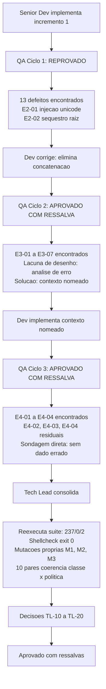

# Revisao Consolidada do Tech Lead - Etapa 2, Incremento 1

## Identificacao

- Projeto ou produto: Aplicacao CLI em shell script para Dropbox API v2
- Responsavel Tech Lead: Tech Lead
- Data da revisao: 2026-08-18
- Escopo revisado: lib/json.sh (756 linhas) e lib/output.sh (226 linhas), primeiro incremento da Etapa 2 (camada de adaptadores)
- Agents envolvidos: Business Analyst, Senior Developer, QA Expert, Tech Lead, documentation-writer
- Status da revisao: Concluida com ressalvas

## Resumo executivo

- Objetivo da entrega: Fechamento do incremento 1 da Etapa 2 — implementacao da camada de adaptadores JSON e saida, com ciclos de validacao QA e consolidacao de riscos e decisoes.
- Contexto consolidado: Tres ciclos de QA (1 reprovacao, 2 aprovacoes com ressalva); reexecucao independente de evidencias pelo Tech Lead; mutacoes proprias para verificacao de criterios de aceite; encerramento de riscos e abertura de novas classes; homologacao de requisitos nao funcionais com ressalvas.
- Resultado executivo da revisao: Suite 237/0/2 APROVADA, shellcheck exit 0, artefatos de risco consolidados (RSK-25 encerrado, RSK-26/27/28 abertos), requisitos RNF-23 e RNF-24 homologados com qualificacoes, decisoes TL-10 a TL-20 registradas.
- Recomendacao do Tech Lead: Pronto para entrada em Etapa 3 sob condicoes explicitadas em Pendencias/bloqueios/riscos residuais. Aceitacao com ressalvas sobre instrumentacao de RNF-24 criterio 3 (bloqueante para Etapa 3).

## PRD e ARD

- PRD aplicavel?: Nao — projeto nao possui PRD formal
- Referencia do PRD: Nao aplicavel
- ARD aplicavel?: Nao — projeto nao possui ARD formal
- Referencia do ARD: Nao aplicavel

| Artefato | Item revisado | Consistencia com entrega | Lacunas encontradas | Observacoes |
|---|---|---|---|---|
| Requisitos (docs/requisitos/escopo-requisitos-e-criterios-de-aceite.md v0.7) | Criterios de aceite de RNF-23, RNF-24, E2-01, E2-02, E3-01 a E3-07, E4-01 a E4-04 | CONSISTENTE | Nenhuma | Artefato equivalente a PRD; criterios satisfeitos ou documentados com ressalva |
| System Design (docs/arquitetura/system-design.md v0.7) | Desenho da camada de adaptadores, separacao de responsabilidades entre lib/json e lib/output | CONSISTENTE | Nenhuma | Artefato equivalente a ARD; implementacao aderente |
| Riscos (docs/requisitos/riscos-restricoes-e-licenciamento.md v0.5) | RSK-25, RSK-26, RSK-27, RSK-28, DIV-15, DIV-17 | CONSISTENTE | RSK-26, RSK-27, RSK-28 abertos neste fechamento | RSK-26, RSK-27 e RSK-28 aceitos como riscos ativos em TL-15. O arquivo de riscos ja reflete o encerramento de RSK-25 e a abertura dos tres novos; nao houve alteracao nesta consolidacao |

## Divergencias entre PRD, ARD, implementacao e evidencias de validacao

| Divergencia | Origem | Impacto | Resolucao adotada | Status |
|---|---|---|---|---|
| RNF-23: cifra de ~537 entradas declarada sem contexto de formato | System Design / Requisitos | BAIXO — nao bloqueia decisao | Cifra corrigida em decisao TL-13: dependencia de formato de entrada; no teste do Tech Lead, 600 entradas ocupam 258173 bytes e analisam; recusa em 1000 (430573 bytes). Valor nao deve ser usado como `limit`; implementador deve dimensionar com margem real | RESOLVIDA |
| RNF-24: criterio 3 sem instrumento de auditoria estatica de procedencia | System Design / Requisitos | ALTA — bloqueante para Etapa 3 | Gate instituido (TL-12): antes de `lib/http` chamar `dbx_json_contexto`, mutacao M3 (que compoe nome de contexto de `error.tag` da resposta) deve reprovar. Auditoria estatica sobre sitios de chamada requerida | ABERTA — bloqueante |
| DIV-15 relacionada a RSK-25 | Riscos | BAIXO — encerrado em TL-14 | RSK-25 encerrado, DIV-15 retirado. Premissa falsa removida. TL-09 refundado em RSK-26 (evidencia real) | RESOLVIDA |
| DIV-17: indistincao entre instrumento que escondia defeito vs. suite contornando terreno | QA / Criterios de aceite | BAIXO — resolvido por sondagem | QA executou sondagem direta (6 sondas em ciclo 3) sem achar dado errado. Gate nao instituido; criterio de leitura registrado (contagem nao dimensiona confianca; sondagem direta dimensiona). Nota registrada em TL-16 | RESOLVIDA |

- Conclusao especifica sobre divergencias entre PRD e ARD: Nao aplicaveis no contexto deste projeto (inexistencia de PRD/ARD formais compensada por artefatos equivalentes: requisitos, system design, riscos).
- Conclusao especifica sobre divergencias entre artefatos, implementacao e evidencias de validacao: Todas as divergencias foram resolvidas ou refundadas em evidencia real. Uma permanece aberta (RNF-24 criterio 3) por design intencional, com gate explicitado.

## Registro consolidado das atividades por agent

| Agent | Atividade executada | Artefatos gerados | Decisoes associadas | Status |
|---|---|---|---|---|
| Business Analyst | Criacao de RNF-23 e RNF-24; encerramento de RSK-25 com retirada de DIV-15; abertura de RSK-26, RSK-27 e RSK-28; formulacao do criterio "registro de risco e instrumento de evidencia, nao de suspeita"; observacao do ponto de processo que originou TL-17 | `docs/requisitos/escopo-requisitos-e-criterios-de-aceite.md` v0.7; `docs/requisitos/riscos-restricoes-e-licenciamento.md` v0.5 | RNF-23, RNF-24, RSK-25, RSK-26, RSK-27, RSK-28, DIV-15 | Concluido |
| Senior Developer | Implementacao de lib/json.sh e lib/output.sh com TDD; eliminacao da concatenacao de caminho no ciclo 1; contexto nomeado no ciclo 2; fechamento da faixa de nos em ponto unico no ciclo 3; 11 commits semanticos | `lib/json.sh`, `lib/output.sh`, `tests/unit/json_test.sh`, `tests/unit/output_test.sh`, `docs/registros/2026-08-18_entrega-lib-json-e-lib-output.md` | PRJ-DEC-21 a PRJ-DEC-32 | Concluido com ressalvas abertas (E4-02, E4-03, E4-04 residual) |
| QA Expert | Tres ciclos de validacao independente com 13 + 7 + 4 achados; varredura de mutacao propria de 8 mutacoes no ciclo 3; sondagem direta do terreno de DIV-17; nomeacao da classe RSK-28 | `docs/registros/2026-08-18_qa-validacao-lib-json-e-lib-output.md`; `..._ciclo2.md`; `2026-08-18_qa-validacao-contexto-nomeado-ciclo3.md` | PRJ-DEC-27, PRJ-DEC-28, PRJ-DEC-29, PRJ-DEC-31, PRJ-DEC-32 | Concluido — parecer final APROVADO COM RESSALVA |
| UX Expert | Nao acionado | Nenhum | Nenhuma | Nao aplicavel — sem interface web ou grafica |
| DBA | Nao acionado | Nenhum | PRJ-DEC-07 | Nao aplicavel — sem persistencia |
| Tech Lead | Reexecucao independente da suite e da analise estatica; tres mutacoes proprias M1, M2 e M3; verificacao da coerencia classe x politica em 10 pares; medicao propria do teto de RNF-23; achados TL-18 e TL-19; decisoes TL-10 a TL-20 | Esta revisao consolidada; `docs/registros/2026-08-18_aprovacao-final-etapa-2-incremento-1.md`; atualizacao de `MEMORIA-PROJETO.md` | TL-10 a TL-20 | Concluido |
| documentation-writer | Redacao dos artefatos formais deste fechamento a partir do briefing factual do Tech Lead, com revisao e correcao posteriores pelo Tech Lead | Esta revisao consolidada e a aprovacao final | Item 4 do protocolo comum | Concluido — conteudo revisado e corrigido pelo Tech Lead antes do fechamento |
| commit-writer | Nao acionado | Nenhum | Item 5 do protocolo comum | Nao aplicavel nesta consolidacao — sem commit por instrucao do solicitante |

## Decisoes e motivacoes

| Decisao | Motivacao | Alternativas consideradas | Dono | Impacto |
|---|---|---|---|---|
| TL-10 — Condicao de TL-01 verificada e satisfeita | TL-01 foi concedido no fechamento da Etapa 1 condicionado a coerencia entre classe de erro e politica de retentativa; a politica passou a consultar dbx_errors_classificar e os 10 pares medidos nao apresentam contradicao | Manter o aceite condicionado ate a Etapa 3 — descartada porque a condicao era verificavel agora e manter gate aberto sem necessidade degrada o valor do proprio gate | Tech Lead | Aceite dos codigos de saida 5 a 15 (PRJ-DEC-10, RF-35) confirmado em definitivo, sem ressalva |
| TL-11 — Aceite do incremento lib/json + lib/output: APROVADO COM RESSALVAS | Suite 237/0/2 e shellcheck exit 0 reexecutados; E2-01 e E2-02 fechados por construcao e nao por ordem de operacoes; contexto nomeado verificado ponta a ponta; E4-01 fechado com faixa de nos encerrada em ponto unico e mutacao M1 reprovando 4 casos | Nao se aplica | Tech Lead | Ressalvas herdadas: E4-02, E4-03 e a fixacao por invariante do espelho de diagnostico (E4-04 residual); nenhuma delas tem caminho para valor errado |
| TL-12 — RNF-24 homologado como requisito, com criterio 3 declarado NAO VERIFICADO, e gate BLOQUEANTE para Etapa 3 | Dos quatro criterios de aceite, tres estao cobertos (isolamento entre contextos; recusa de nome fora de [a-z_]; mutacao que afrouxa a guarda reprova 3 casos — M2). O criterio 3, "dada auditoria estatica, entao nenhum ponto do codigo compoe nome de contexto a partir de valor de origem externa", nao tem instrumento: a mutacao M3 acrescenta um sitio de chamada que deriva o nome de error.tag da resposta do servico e a suite passa 237/0/2 com shellcheck exit 0. A guarda [a-z_]+ limita o ALFABETO, nao a PROCEDENCIA — e as tags reais do contrato de erro da Dropbox (path, conflict, too_many_write_operations, incorrect_offset) sao todas [a-z_]+ e passariam pela guarda | Aceitar a guarda como suficiente — descartada porque reduziria RNF-24 de restricao de procedencia a restricao de alfabeto, que e outro requisito mais fraco, e reabriria a classe do E2-01 por outra porta | Tech Lead | Gate: antes de lib/http chamar dbx_json_contexto, a auditoria estatica sobre sitios de chamada deve existir e a mutacao M3 deve passar a reprovar. Bloqueante para Etapa 3 |
| TL-13 — RNF-23 homologado, com dimensionamento corrigido | O requisito e legitimo e derivado de medicao. Duas correcoes ao texto do BA: (a) a cifra de ~537 entradas e dependente do formato da entrada — na medicao do Tech Lead com entrada tipica completa de list_folder, 600 entradas ocupam 258173 bytes e ainda analisam, e a recusa aparece em 1000 (430573 bytes); a cifra nao deve ser usada como valor de limit, e limit deve ser dimensionado com margem real, nao no limiar; (b) a razao de ser precisa ser refinada — o modo de falha ja e classificado (DBX_JSON_MOTIVO=tamanho, que a suite exercita justamente para permitir ao chamador reduzir a pagina), logo o diagnostico nao e cego; o que sustenta o requisito e que a falha continua sendo erro do analisador em vez de decisao de paginacao, deslocando para o componente errado uma responsabilidade que e de lib/http | Nao se aplica | Tech Lead | Requisito se mantem com argumento corrigido, e nao com o argumento original. Cifra de teto: 262144 bytes (256 KiB) |
| TL-14 — Encerramento de RSK-25 e retirada de DIV-15 homologados; TL-09 REFUNDADO | O criterio formulado pelo Business Analyst — registro de risco e instrumento de evidencia, nao de suspeita — e adotado como regra do projeto. Consequencia obrigatoria e que o Tech Lead registra por iniciativa propria: TL-09 foi instituido no fechamento da Etapa 1 tendo RSK-25 como fundamento, e RSK-25 imputava ao Senior Developer um padrao de conduta que nao ocorreu — a premissa de plataforma era decisao do solicitante que o coordenador nao propagou. O gate TL-09 permanece valido e necessario, mas sua motivacao passa de "premissa de escopo criada por conveniencia tecnica da implementacao" (falsa) para "decisao do solicitante nao refletida no artefato pelo fluxo documental" (RSK-26, real e materializada) | Encerrar tambem TL-09 junto com RSK-25 — descartada porque o gate e correto ainda que a evidencia que o motivou fosse errada; retirar o gate por causa do erro de fundamentacao repetiria, no sentido inverso, o mesmo erro de decidir sem evidencia | Tech Lead | Retratacao formal em favor do Senior Developer: nenhuma conduta de ampliacao de escopo por conveniencia tecnica foi demonstrada nesta ou na etapa anterior. RSK-25 encerrado. DIV-15 retirado. TL-09 refundado em RSK-26 |
| TL-15 — RSK-26, RSK-27 e RSK-28 aceitos como riscos ativos do projeto | RSK-28 recebe instancia adicional, de quarto papel: durante esta propria consolidacao, uma sonda de verificacao do Tech Lead adquiriu um byte de controle cru (0x1F) no texto do documento de teste, produzindo leitura vazia que este Tech Lead esteve a ponto de registrar como defeito de lib/json. Nao era defeito: lib/json recusou a entrada com DBX_JSON_MOTIVO=controle e mensagem "caractere de controle cru na entrada", e foi exatamente essa classificacao de falha que tornou a contaminacao do instrumento diagnosticavel em uma unica medicao | Nao se aplica | Tech Lead | Duplo registro: (a) a classe atinge tambem o papel de coordenacao tecnica, alem de dev, QA e coordenador; (b) e evidencia a favor do desenho — as decisoes J2 (falha fechada e classificada) e J5 (recusa de caractere de controle cru) de lib/json pagaram-se aqui, em uso real, contra o proprio Tech Lead |
| TL-16 — DIV-17 NAO se converte em gate; registra-se como nota metodologica permanente | A distincao que DIV-17 levanta — entre "o instrumento escondia o defeito" e "a suite foi escrita contornando o terreno onde o instrumento falha" — e legitima e tem implicacoes opostas para confianca em cobertura, mas o QA a enderecou por sondagem direta do terreno no ciclo 3, com seis sondas sobre estado global e subshell, nenhuma encontrando dado errado | Gate de sondagem obrigatoria por incremento — descartada por custo desproporcional a evidencia | Tech Lead | Criterio de leitura: contagem de casos nao dimensiona confianca em terreno historicamente nao exercitado; sondagem direta dimensiona. A lacuna real de instrumento que existia foi isolada e esta coberta por TL-12 |
| TL-17 — Checkpoint de propagacao de decisao instituido | Acolhe a observacao do Business Analyst de que o mecanismo que falhou em RSK-26 nao foi velocidade, e sim a ausencia de um ponto onde a decisao do solicitante entra no artefato de forma obrigatoria. Regra: toda decisao do solicitante e registrada no artefato correspondente no mesmo turno em que e tomada, com identificador e data, ANTES de qualquer distribuicao de tarefa que dependa dela; nenhum agent recebe handoff apoiado em artefato cuja ultima atualizacao seja anterior a decisao que o handoff pressupoe | Nao se aplica | Tech Lead | TL-09 cobre a direcao inversa (premissa nao vira decisao); TL-17 cobre esta (decisao tem de virar artefato). Juntos fecham o ciclo. Esta decisao e transversal ao pacote de agents e demanda entrada em MEMORIA-COMPARTILHADA.md por forca do item 32 do protocolo comum; o arquivo NAO foi editado nesta consolidacao por restricao explicita do solicitante, e a entrada fica pendente de autorizacao |
| TL-18 — Defeito documental em lib/errors.sh, achado proprio do Tech Lead | O comentario de contrato de dbx_errors_politica_retentativa (linhas 326 a 332) enumera seis valores de retorno — nenhuma, recuo_exponencial, respeitar_retry_after, renovar_token_uma_vez, reiniciar, indeterminado — e a funcao emite sete: retomar esta ausente da enumeracao e e emitido na linha 367 | Nao se aplica | Tech Lead | Codigo e suite concordam entre si (tests/unit/errors_test.sh linha 253 aceita retomar na lista fechada e linha 699 afirma o valor); apenas o contrato legivel esta desatualizado. Severidade BAIXA, sem impacto em comportamento. Nao bloqueante para este fechamento, mas condicao de entrada da Etapa 3 |
| TL-19 — Defeito de integridade em MEMORIA-PROJETO.md, achado proprio do Tech Lead, corrigido nesta consolidacao | Dois problemas na tabela de decisoes ativas: (a) colisao de identificadores — PRJ-DEC-22, PRJ-DEC-23 e PRJ-DEC-24 designavam dois conjuntos distintos de decisoes, um referente a lib/json e lib/output e outro referente ao fechamento da Etapa 1; (b) bloco duplicado — as oito linhas de PRJ-DEC-25 a PRJ-DEC-27 apareciam duas vezes, byte a byte | Nao se aplica | Tech Lead | Correcao aplicada: as tres decisoes do fechamento da Etapa 1 foram renumeradas para PRJ-DEC-33, PRJ-DEC-34 e PRJ-DEC-35, e a duplicata foi removida. Nota: o registro em que se apoiam as decisoes do projeto e ele proprio um artefato sob a mesma disciplina que se cobra dos demais |
| TL-20 — DP-20 mantido como bloqueio formal, exclusivo do solicitante | Verificado por leitura direta: LICENSE linha 3 contem "Copyright (c) 2026 <TITULAR DO COPYRIGHT — CONFIRMAR ANTES DO PRIMEIRO COMMIT>". O arquivo esta no historico publico do repositorio com o titular em espaco reservado | Nao se aplica | Solicitante (exclusivo) | Nao ha reescrita de historico prevista. Sem custo tecnico, com custo reputacional crescente. Nao bloqueia a Etapa 3 |

## Itens impactados

| Item impactado | Tipo | Mudanca observada | Risco associado | Mitigacao |
|---|---|---|---|---|
| lib/json.sh (756 linhas) | Codigo | Analisador proprio de JSON em passada unica, sem jq; indexacao por no com composicao injetiva; contextos nomeados com pool compartilhado e raiz por contexto; faixa de nos fechada em ponto unico; recusa de caractere de controle cru; teto de entrada de 262144 bytes | RSK-27: garantia estatica que cobre so a forma obvia da classe. RNF-24 criterio 3 sem instrumento: mutacao M3 nao e detectada | Decisoes J2 e J5 de falha fechada e classificada; E4-01 fechado com faixa em ponto unico, pinado pela mutacao M1 que reprova 4 casos; gate TL-12 instituido para o criterio 3 de RNF-24 |
| lib/output.sh (226 linhas) | Codigo | Modelo de resultado unico com duas apresentacoes (humana e estruturada) e terminador de registro selecionavel entre linha e nulo, dimensoes tratadas como ortogonais (PRJ-DEC-24, DIV-16b); diagnostico direcionado a saida de erro (PRJ-DEC-27); RNF-22 atendido por isolamento de registro | Concatenacao de diagnostico na linha de cabecalho sensivel destruiria o identificador de requisicao (PRJ-DEC-21) | Proibicao registrada como decisao de projeto e coberta por caso de teste; 27 casos de teste no arquivo de output |
| RNF-23 | Requisito | Homologacao com dimensionamento corrigido | BAIXO — nao bloqueia | Medicao propria do Tech Lead; teto confirmado em 262144 bytes; orientacao explicita ao implementador de lib/http registrada em TL-13: dimensionar `limit` com margem real, nunca no limiar |
| RNF-24 | Requisito | Homologacao com criterio 3 declarado NAO VERIFICADO | ALTA — bloqueante para Etapa 3 | Gate instituido; mutacao M3 deve reprovar antes de lib/http chamar dbx_json_contexto; auditoria estatica de sitios de chamada requerida |
| RSK-25 | Risco | Encerrado | Nenhum — decisao de fechamento com condicao satisfeita | Premissa falsa removida; TL-09 refundado em RSK-26 |
| DIV-15 | Divergencia | Retirada | Nenhum — era o unico caso citado por RSK-25, e nao sustentava o risco | Retratacao formal registrada em favor do Senior Developer (TL-14) |
| RSK-26, RSK-27, RSK-28 | Risco | Abertos neste fechamento | Nao quantificado — novos riscos | Rastreamento em MEMORIA-PROJETO.md; reavaliacao antes de Etapa 3 |

## Pontos validados

| Ponto validado | Origem da evidencia | Resultado | Observacoes |
|---|---|---|---|
| Suite de testes completa | Tech Lead: reexecucao de `bash tests/run.sh` | 237 aprovados / 0 reprovados / 2 pulados (resultado APROVADA); distribuicao: errors 76, path 44, json 55, output 27, hash 35, vetor oficial 2 | Independentemente verificado; condicao de entrada para qualquer fechamento |
| Analise estatica (shellcheck) | Tech Lead: `~/.local/bin/shellcheck -x` sobre lib/*.sh, tests/run.sh, tests/unit/*.sh, tests/support/*.sh | Exit 0 — sem erros | Sem alertas de estilo ou seguranca |
| Arvore git | Tech Lead: `git status --porcelain` e historico de commits | Limpa; 12 commits na feature, sendo 11 semanticos; HEAD == origin/feature/camada-dominio-e-adaptadores (bf3ff0d); 0 commits nao publicados; develop == origin/develop (a03d2c0) | Desvio consumado: primeiro commit sem convencao semantica (a03d2c0), sem reescrita de historico |
| Bytes de controle | Tech Lead: varredura sobre 9 arquivos de docs/registros/, 4 de docs/requisitos/, docs/arquitetura/system-design.md e MEMORIA-PROJETO.md | Zero linhas com bytes de controle | Verificacao independente concluida |
| Injecao E2-01 / E2-02 (fechada) | Tech Lead: medicao com vetores sinteticos | {"a":{"b":"LEGITIMO"},"ab":"INJETADO"} -> a.b retorna LEGITIMO; mesmo doc -> ab retorna INJETADO; {"x":{"y":"DENTRO"},"xy":"FORA"} -> x.y retorna DENTRO; consulta por segmento contendo separador US (0x1F) ausente, status de falha sem colisao; {"":{"z":"RAIZ_SEQUESTRADA"},"z":"LEGITIMO_Z"} -> z retorna LEGITIMO_Z | Fechada por construcao (eliminacao de concatenacao de caminho no ciclo 1; injetividade do lado esquerdo sempre digito) |
| Contexto nomeado ponta a ponta | Tech Lead: sequencia de contexto padrao -> contexto erro -> retorno | Contexto padrao analisa {"cursor":"CURSOR-1","entries":[{"name":"arquivo um"},{"name":"dois"}]}; troca para contexto erro; analisa {"error_summary":"path/not_found/..","error":{".tag":"path"}}; le error_summary = path/not_found/..; volta por canal DBX_JSON_CONTEXTO_ANTERIOR; consulta cursor = CURSOR-1, entries 1 name = dois, entries 0 name = arquivo um; listagem integra | Nove formas invalidas de nome de contexto recusadas sem trocar contexto corrente (Erro, erro-1, erro 1, vazio, ../x, erro$(id), e#1, ERRO, erro.1) |
| E4-01 fechado (faixa de nos) | Tech Lead: contagem de nos vivos apos uma analise e apos reanalises com lixo | Apos analise valida: 4; reanalise 1 com lixo: 8; reanalises 2, 3, 4, 5: 8, 8, 8, 8; sem crescimento; faixa encerrada em ponto unico (linha 566, DBX_JSON_FIM_DO_CONTEXTO[$_dbx_ctx]=$DBX_JSON_PROXIMO_ID) | Fechada por construcao; mutacao M1 reprova 4 casos quando registro de FIM e removido |
| Mutacao M1 | Tech Lead: remove registro de FIM da faixa de nos (linha 566) | 4 reprovacoes | Ciclo de vida do caminho de excecao PINADO — condicao 2 do QA (E4-04) satisfeita |
| Mutacao M2 | Tech Lead: afrouxa guarda de nome de contexto de ^[a-z_]+$ para -n | 3 reprovacoes | Criterio 4 de RNF-24 satisfeito PARA A GUARDA |
| Mutacao M3 | Tech Lead: acrescenta sitio de chamada que compoe nome de contexto de error.tag da resposta do servico | 237/0/2 APROVADA, shellcheck exit 0 | NADA DETECTA — criterio 3 de RNF-24 sem instrumento; gate instituido em TL-12 |
| Coerencia classe x politica (10 pares) | Tech Lead: verificacao de linha 355 de lib/errors.sh | HTTP 409 too_many_write_operations classe limite_taxa politica respeitar_retry_after; 409 incorrect_offset classe nao_concluida politica retomar; 429 (vazio) classe limite_taxa politica respeitar_retry_after; 401 invalid_access_token classe autenticacao politica renovar_token_uma_vez; 0 (vazio) idempotente classe rede politica recuo_exponencial; 0 (vazio) nao idempotente classe rede politica indeterminado; 503 (vazio) idempotente classe erro_remoto politica recuo_exponencial; 408 (vazio) nao idempotente classe desconhecido politica recuo_exponencial; 200 (vazio) nao idempotente classe sucesso politica nenhuma; 409 path/conflict/file nao idempotente classe conflito politica nenhuma | Nenhuma contradicao; condicao de TL-01 SATISFEITA |
| RNF-23 medido | Tech Lead: massa sintetica com entrada tipica de list_folder (.tag, name, path_lower, path_display, id, client_modified, server_modified, rev, size, is_downloadable, content_hash) | 300 entries 128873 bytes analisa; 500 entries 215073 bytes analisa; 537 entries 231020 bytes analisa; 600 entries 258173 bytes analisa; 1000 entries 430573 bytes recusa com DBX_JSON_MOTIVO=tamanho; 2000 entries 865573 bytes recusa; teto declarado DBX_JSON_MAXIMO_ENTRADA = 262144 bytes (256 KiB) | Medicao confirma o valor de teto declarado; cifra de entradas nao deve ser usada como limit |
| E4-02 aberto (condicao verificada) | Tech Lead: analisar em subshell, contexto ja existente vs contexto NOVO | Contexto ja existente retorna 2 (recusa correta); contexto NOVO retorna 0 (trabalho descartado sem sinalizar); consulta no processo pai apos subshell status 1, resultado vazio | Falha fechada (sem valor errado); severidade BAIXA; permanece aberto |

## Pendencias, bloqueios e riscos residuais

| Tipo | Descricao | Impacto | Owner | Proxima acao |
|---|---|---|---|---|
| Gate bloqueante | RNF-24 criterio 3: auditoria estatica sobre sitios de chamada do nome de contexto; mutacao M3 deve reprovar | BLOQUEANTE para Etapa 3 | Senior Developer + QA Expert | Antes de lib/http chamar dbx_json_contexto |
| Defeito aberto | E4-02: analisar devolve 0 para trabalho descartado pelo caminho do contexto novo | BAIXA | Senior Developer | Proxima rodada de manutencao |
| Defeito aberto | E4-03: justificativa de E4-02 precisa ser corrigida antes de virar registro | BAIXA (registro) | Senior Developer | Antes de registrar |
| Defeito aberto | E4-04 residual: espelho de diagnostico ao trocar e ao descartar contexto deve ser fixado por invariante, nao por mutacao (RSK-27) | BAIXA | QA Expert | Proxima rodada |
| Defeito documental | TL-18: comentario de contrato de dbx_errors_politica_retentativa omite retomar | BAIXA | Senior Developer | Condicao de entrada da Etapa 3 |
| Processo | TL-17: entrada correspondente em MEMORIA-COMPARTILHADA.md | Processo | Tech Lead | Mediante autorizacao do solicitante |
| Bloqueio formal | DP-20: titular do copyright em LICENSE deve ser confirmado | BLOQUEIO | Solicitante (exclusivo) | Quanto antes |
| Formalidade | DEC-STR-07: aprovacao formal do solicitante sobre os testes do QA, com template proprio | Formalidade | Solicitante | Quando conveniente |
| Verificacao | Escopos OAuth: verificar durante a implementacao de lib/http | BAIXA | Senior Developer | Etapa 3 |

## Impacto global da entrega

- Impacto no negocio: Incremento 1 da Etapa 2 conclui a camada de adaptadores, removendo bloqueios de implementacao de lib/http (Etapa 3). Entrada em Etapa 3 agora dependente apenas de gate de RNF-24 (bloqueante) e verificacao de DP-20 (bloqueio do solicitante).
- Impacto tecnico: Consolidacao de camada de adaptadores com criterios de aceite homologados (11 commits semanticos, 237/0/2 suite, shellcheck exit 0). Novos riscos (RSK-26, RSK-27, RSK-28) e requisitos (RNF-23, RNF-24) registrados e rastreados. Defeitos baixa severidade deixados abertos para manutencao (E4-02, E4-03, E4-04 residual). Defeito documental TL-18 identificado em lib/errors.sh (condicao de entrada Etapa 3, nao bloqueante para Etapa 2).
- Impacto operacional: Nenhuma alteracao em producao (lib/json e lib/output nao tem consumidor em producao; lib/http ainda nao existe). Custo de rollback praticamente nulo (descarte da feature ou revert de 7 commits). Arvore git limpa, commits semanticos, 0 commits nao publicados.
- Impacto em UX: Nao aplicavel — projeto nao possui interface.
- Impacto em dados: Nao aplicavel — projeto nao possui persistencia (PRJ-DEC-07).

## Encaminhamento para fechamento

- Pronto para aprovacao final?: Sim
- Dependencias para aprovacao-final-tech-lead-template.md: Documento de revisao consolidada (`/home/sales/dropbox_api/docs/registros/2026-08-18_revisao-consolidada-etapa-2-incremento-1.md`); System Design v0.7; Requisitos v0.7; Riscos v0.5 (para atualizacao posterior).
- Arquivo concreto desta revisao consolidada para referencia no fechamento final: `/home/sales/dropbox_api/docs/registros/2026-08-18_revisao-consolidada-etapa-2-incremento-1.md`
- Resumo das divergencias resolvidas que devem constar no fechamento final: (1) RNF-23 dimensionamento corrigido — cifra dependente de formato, nao deve ser usada como limit, teto 262144 bytes clarificado em TL-13; (2) RNF-24 criterio 3 refundado em gate bloqueante — auditoria estatica e mutacao M3 requeridas antes de lib/http (TL-12); (3) DIV-15/RSK-25 encerrados com premissa removida, TL-09 refundado em RSK-26 (TL-14); (4) DIV-17 resolvida por sondagem direta, criterio de leitura registrado (TL-16).
- Bloqueios remanescentes que precisam constar no fechamento final: (1) Gate RNF-24 criterio 3 — bloqueante para Etapa 3, requer auditoria estatica e mutacao M3 reprovando antes de lib/http chamar dbx_json_contexto (TL-12); (2) DP-20 copyright titular — bloqueio formal exclusivo do solicitante (TL-20, nao bloqueia Etapa 3).
- Observacoes finais do Tech Lead: Incremento 1 da Etapa 2 esta consolidado e pronto para entrada em Etapa 3 sob as ressalvas explicitadas. A homologacao de RNF-23 e RNF-24 com qualificacoes e decisoes TL-10 a TL-20 refletem padroes de verificacao rigorosos (mutacoes proprias, reexecucao de evidencias, sondagem direta). O gate bloqueante de RNF-24 criterio 3 e intencional e proporcional: a mutacao M3 demonstra que a guarda de alfabeto [a-z_]+ e insuficiente para garantir que nenhum sitio de chamada compoe nome de contexto de origem externa, e o risco de reabrir a classe do E2-01 por outra porta e real. Encerramento de RSK-25 com refundacao de TL-09 em RSK-26 demonstra aplicacao do criterio "registro de risco e instrumento de evidencia, nao de suspeita" institucionalizado neste fechamento. Uma retratacao formal foi registrada em favor do Senior Developer. TL-17 institui checkpoint de propagacao de decisao; entrada em MEMORIA-COMPARTILHADA.md fica pendente de autorizacao do solicitante. Pronto para aprovacao final com ressalvas.

