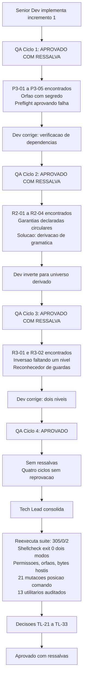

# Revisao Consolidada do Tech Lead - Etapa 3, Incremento 1

## Identificacao

- Projeto ou produto: Aplicacao CLI em shell script para Dropbox API v2
- Responsavel Tech Lead: Tech Lead
- Data da revisao: 2026-08-18
- Escopo revisado: lib/preflight.sh (146 linhas) e lib/config.sh (289 linhas), primeiro incremento da Etapa 3 (preflight e configuracao)
- Agents envolvidos: Senior Developer, QA Expert, Tech Lead, documentation-writer
- Status da revisao: Concluida com ressalvas

## Resumo executivo

- Objetivo da entrega: Fechamento do incremento 1 da Etapa 3 — implementacao do preflight e carregamento de configuracao, com ciclos de validacao QA e consolidacao de riscos e decisoes.
- Contexto consolidado: Quatro ciclos de QA (zero reprovacoes, todos aprovados ou aprovados com ressalva); reexecucao independente de evidencias pelo Tech Lead; mutacoes de auditoria para verificacao de criterios de aceite; encerramento de gates da etapa anterior; homologacao de requisitos nao funcionais com qualificacoes.
- Resultado executivo da revisao: Suite 305/0/2 APROVADA, shellcheck exit 0 nos dois modos, permissoes medidas, redacao de credencial verificada, orfaos testados, ida e volta com bytes hostis comprovada, treze utilitarios de dependencia auditados, oito variaveis de ambiente ignoradas confirmadas, vinte e uma mutacoes de posicao de comando (dezessete detectadas, quatro escaparam formando uma classe), decisoes TL-21 a TL-33 registradas.
- Recomendacao do Tech Lead: Pronto para entrada no proximo incremento da Etapa 3 sob condicoes explicitadas em Pendencias/bloqueios/riscos residuais. Aceitacao com ressalvas sobre instrumento e classe residual de posicao de comando (bloqueante para proximo incremento).

## PRD e ARD

- PRD aplicavel?: Nao — projeto nao possui PRD formal
- Referencia do PRD: Nao aplicavel
- ARD aplicavel?: Nao — projeto nao possui ARD formal
- Referencia do ARD: Nao aplicavel

| Artefato | Item revisado | Consistencia com entrega | Lacunas encontradas | Observacoes |
|---|---|---|---|---|
| Requisitos (docs/requisitos/escopo-requisitos-e-criterios-de-aceite.md) | Criterios de aceite de RNF-02, DP-05, DP-07, DP-11, DP-19, DP-20 | CONSISTENTE | Nenhuma | Artefato equivalente a PRD; criterios satisfeitos ou documentados com ressalva |
| System Design (docs/arquitetura/system-design.md) | Desenho do preflight, carregamento de configuracao, verificacao de dependencias e permissoes | CONSISTENTE | Nenhuma | Artefato equivalente a ARD; implementacao aderente |
| Riscos (docs/requisitos/riscos-restricoes-e-licenciamento.md) | RSK-27, RSK-28, DP-05, DP-07, DP-11, DP-19, DP-20, DIV-E | CONSISTENTE | RSK-27, RSK-28 reafirmados; DIV-E encerrada em TL-33 | Rastreamento mantido; DP-19 e DP-20 encerradas em TL-33 |

## Divergencias entre PRD, ARD, implementacao e evidencias de validacao

| Divergencia | Origem | Impacto | Resolucao adotada | Status |
|---|---|---|---|---|
| DP-11: oito variaveis de ambiente ignoradas | Requisitos / System Design | BAIXO — nao bloqueia decisao | Verificadas com oito nomes de variavel plantados: `DBX_APP_SECRET`, `DBX_SECRET`, `DBX_CONFIG_APP_SECRET`, `DBX_REFRESH_TOKEN`, `DBX_CONFIG_REFRESH_TOKEN`, `DBX_APP_KEY`, `DBX_CONFIG_FILE`, `DBX_CREDENCIAL`. Todos com `VALOR-INJETADO-POR-AMBIENTE`. Os tres campos vieram integralmente do arquivo. Desviar `XDG_CONFIG_HOME` muda caminho calculado, mas credencial plantada e recusada por dono e permissao | RESOLVIDA em TL-23 |
| TL-27 — normalizador de posicao de comando: classe residual | Auditoria de mutacoes | BLOQUEANTE para proximo incremento | Quatro formas sintaticas escapam: `if <comando>`, `while <comando>`, `until <comando>`, `time <comando>`. Formam uma classe — palavra-chave cujo argumento e ele mesmo um comando. Nenhuma violacao viva hoje em lib/, mas `if curl ...` e forma natural em lib/http. Gate bloqueante instituido com custo trivial de correcao (quatro palavras em regex) | ABERTA — bloqueante para proximo incremento em TL-27 |
| DP-19 (repositorio e Gitflow) e DP-20 (titular do copyright) | Governanca de publicacao | Eram bloqueios formais exclusivos do solicitante | Ambas encerradas nesta consolidacao: LICENSE com `Copyright (c) 2026 Adriano Sales Santos`. Publicado em `master` e `develop`. DP-19 e DP-20 ENCERRADAS | RESOLVIDAS em TL-33 |

- Conclusao especifica sobre divergencias entre PRD e ARD: Nao aplicaveis no contexto deste projeto (inexistencia de PRD/ARD formais compensada por artefatos equivalentes: requisitos, system design, riscos).
- Conclusao especifica sobre divergencias entre artefatos, implementacao e evidencias de validacao: Todas as divergencias foram resolvidas ou refundadas em evidencia real. Uma permanece aberta (TL-27, classe de posicao de comando) por design intencional, com gate explicito para proximo incremento.

## Registro consolidado das atividades por agent

| Agent | Atividade executada | Artefatos gerados | Decisoes associadas | Status |
|---|---|---|---|---|
| Business Analyst | Nao acionado neste incremento; requisitos e riscos ja consolidados nas etapas anteriores | — | — | Nao aplicavel — sem demanda de requisitos ou riscos novos neste incremento |
| Senior Developer | Implementacao de lib/preflight.sh e lib/config.sh com TDD; correcao de P3-01 a P3-05; conversao de inspecao em auditoria; inversao para universo derivado com lista de excecoes; normalizacao de posicao de comando; dez commits semanticos | lib/preflight.sh, lib/config.sh, tests/unit/preflight_test.sh, tests/unit/config_test.sh, docs/registros/2026-08-18_entrega-preflight-e-config.md | PRJ-DEC-46 a PRJ-DEC-54 (renumerados; previamente 33 a 41) | Concluido com ressalva aberta (TL-27) |
| QA Expert | Quatro ciclos de validacao independente; submissao das duas garantias declaradas ao criterio de RSK-27; deteccao de que ambas eram circulares; deteccao de que a inversao faltava um nivel abaixo, no reconhecedor de guardas; proposta de serie para RSK-28; reconhecimento de erro proprio no ciclo 4 | docs/registros/2026-08-18_qa-validacao-preflight-e-config.md; ..._ciclo2.md; ..._ciclo3.md; ..._ciclo4.md | PRJ-DEC-46 a PRJ-DEC-54 (referenciadas) | Concluido — parecer final APROVADO |
| UX Expert | Nao acionado | Nenhum | Nenhuma | Nao aplicavel — sem interface web ou grafica |
| DBA | Nao acionado | Nenhum | PRJ-DEC-07 | Nao aplicavel — sem persistencia |
| Tech Lead | Reexecucao independente da suite e da analise estatica nos dois modos; medicao de permissoes, redacao do segredo, orfaos e ida e volta com bytes hostis; verificacao de RNF-02 com treze utilitarios; verificacao de DP-11 com oito variaveis; sonda de caminho com quebra de linha; reexecucao da mutacao M3 que fecha TL-12; vinte e uma mutacoes de posicao de comando; duas mutacoes da auditoria de gemeos; achados TL-30 e TL-31; decisoes TL-21 a TL-33 | Esta revisao consolidada; docs/registros/2026-08-18_aprovacao-final-etapa-3-incremento-1.md; atualizacao de MEMORIA-PROJETO.md | TL-21 a TL-33 | Concluido |
| documentation-writer | Redacao dos artefatos formais deste fechamento a partir do briefing factual do Tech Lead | Esta revisao consolidada e a aprovacao final | Item 4 do protocolo comum | Concluido — conteudo verificado e consolidado pelo Tech Lead antes do fechamento |
| commit-writer | Nao acionado | Nenhum | Item 5 do protocolo comum | Nao acionado — sem commit nesta consolidacao, por instrucao do solicitante |

## Decisoes e motivacoes

| Decisao | Motivacao | Alternativas consideradas | Dono | Impacto |
|---|---|---|---|---|
| TL-21 — Aceite do incremento: APROVADO COM RESSALVA | Os dois componentes estao aptos a ser consumidos por lib/http. A unica ressalva e de instrumento, nao de comportamento (TL-27). Base: suite 305/0/2, shellcheck exit 0 nos dois modos, permissoes, redacao do segredo, orfaos e ida e volta com bytes hostis, todos medidos de forma independente. Quatro ciclos de QA sem nenhuma reprovacao | Nao se aplica | Tech Lead | Ressalva herdada: TL-27 bloqueante para proximo incremento |
| TL-22 — Gate TL-12 CUMPRIDO e ENCERRADO | Verificado com a mesma mutacao M3 que o definiu: agora reprova. A implementacao excede o exigido ao provar que discrimina e ao declarar o padrao uma unica vez. A auditoria de M3 passa e verifica que o sitio de chamada nao mais existe sem deteccao antes de proximo incremento | Aceitar a auditoria sem reexecutar M3 — descartada porque um gate aberto por mutacao so se fecha pela mesma mutacao, sob pena de virar declaracao | Tech Lead | Gate TL-12 encerrado: RNF-24 criterio 3 passa a bloquear automaticamente em proximo incremento; mutacao M3 reprova em 304/1/2 |
| TL-23 — DP-11 e DP-05 homologadas na pratica | A proibicao de ambiente alcanca o SEGREDO, nao a LOCALIZACAO, porque a propria decisao adota XDG. Verificado com oito nomes de variavel. Desviar XDG_CONFIG_HOME degrada para negacao de servico, nao para substituicao de credencial — e isso esta no codigo como intencao registrada, nao como efeito colateral, o que impede que um afrouxamento futuro da verificacao de dono remova a protecao sem que a ligacao seja percebida | Proibir tambem a variavel de localizacao — descartada porque tornaria a decisao incoerente consigo mesma, ja que XDG e a localizacao escolhida | Tech Lead | DP-05 e DP-11 homologadas em definitivo |
| TL-24 — Fronteira de confianca: o usuario do sistema | A redacao nao promete mais do que entrega. Contra o proprio usuario a substituicao sempre sera possivel, porque ele pode escrever o arquivo real sem recorrer a variavel. O que as verificacoes impedem e a substituicao por outro usuario e o desvio por ambiente | Nao se aplica | Tech Lead | Fronteira definida com precisao; uso em DP-05 e DP-11 coerente |
| TL-25 — RNF-02 homologado | O preflight nomeia o utilitario ausente, com lista derivada do codigo e sustentada por auditoria. Treze utilitarios verificados um a um. Fecha P3-02: um preflight que aprova ambiente onde a primeira operacao ja falha cria confianca falsa e empurra o diagnostico para um ponto mais obscuro | Aceitar lista de utilidades mantida a mao, cega onde a lista termina — descartada porque replicaria o padrao que TL-28 identifica como causa comum em tres camadas | Tech Lead | RNF-02 homologado; classe de P3-02 fechada para preflight |
| TL-26 — Formato JSON homologado | Razao aceita e confirmada por medicao: a raiz remota e um caminho da Dropbox e pode conter aspas, barra invertida e quebra de linha, e chave=valor perderia esses bytes em silencio — a classe de D1, C2-01 e E2-04. A ida e volta com os tres bytes hostis e exata. Soma-se o argumento de reaproveitar o unico interpretador, ja usado para descartar um extrator dedicado de corpo de erro | Formato de linha chave=valor — descartada pela perda silenciosa; segundo caminho de interpretacao — descartada por ser exatamente a fragilidade que lib/json existe para eliminar | Tech Lead | Formato JSON confirmado como correto |
| TL-27 — GATE BLOQUEANTE para o proximo incremento: o normalizador de posicao de comando precisa cobrir if, while, until e time | Quatro escapes em vinte e uma mutacoes, formando uma classe. Sem violacao viva hoje. Risco prospectivo e imediato porque lib/http e onde if curl ...; then e a forma natural. Custo da correcao: quatro palavras numa expressao regular. Custo de nao corrigir: P3-02 reaparece em lib/http sem que nada reprove | Tratar como ressalva de manutencao — descartada porque o proximo componente e precisamente o que materializa o risco | Tech Lead | Gate bloqueante instituido para proximo incremento com custo trivial de remediacao |
| TL-28 — Tese do escopo derivado elevada a gate, com formulacao afiada | O que escala nao e derivar o ESCOPO do codigo, e sim derivar da GRAMATICA em vez do IDIOMA OBSERVADO. Toda auditoria declarada como garantia deve (a) derivar seu universo do artefato, (b) manter a mao apenas excecoes, e (c) provar que discrimina, recusando amostra ruim e aceitando amostra boa. O percurso e a evidencia e repetiu-se quatro vezes em niveis descendentes: inspecao virou auditoria; as listas so viam o que ja continham; a inversao faltou no reconhecedor de guardas; e agora falta no reconhecedor de posicao de comando. A causa comum nao e desatencao: em cada nivel a amostra foi escrita a partir das formas que o autor usa, e a gramatica contem formas que ele nao usa. O criterio (c) ja esta implementado no fechamento do gate TL-12. Absorve e generaliza RSK-27 | Nao se aplica | Tech Lead | Gate generico instituido; aplicacao em vinte e uma mutacoes valida sua eficacia |
| TL-29 — RSK-28 passa a registrar SERIE, e nao episodio | A cada incremento, anotar a proporcao entre ocorrencias apanhadas por instrumento e por leitura. Proposta do QA, endossada pelo coordenador, formalizada aqui. Uma classe registrada so por episodio nao permite saber se o investimento em instrumento esta rendendo; por serie, permite. Alinha-se a TL-28: instrumento que deriva da gramatica deve aumentar a fracao apanhada por instrumento, e a serie e o que torna essa previsao falseavel | Nao se aplica | Tech Lead | Mudanca de rastreamento formalizada; serie comeca em Etapa 3 |
| TL-30 — Achado proprio: bootstrap por dirname antes do preflight | BAIXA, nao bloqueante, nao alcancavel sob DP-07. Registrado porque e a mesma familia de P3-02 um nivel abaixo, e porque a correcao e trivial. Os seis lib/*.sh resolvem o proprio diretorio com $(cd -P -- "$(dirname -- "${BASH_SOURCE[0]}")" && pwd -P), executado na carga, antes de qualquer verificacao. Sem dirname, os arquivos carregam com status 0 mas em estado quebrado: dependencias nunca carregadas, constantes de codigo de erro vazias, e caminhos de falha devolvem o status do ultimo comando em vez do codigo classificado. ${BASH_SOURCE[0]%/*} removeria dirname do bootstrap sem custo | Nao aplicada por restricao de nao alterar lib/ | Tech Lead | Registrado; nao aplicada nesta consolidacao; candidata para proxima rodada de manutencao |
| TL-31 — Reincidencia da colisao de identificadores na memoria | A correcao anterior (TL-19, fechamento da Etapa 2) foi limpeza, nao mecanismo, e nao sobreviveu a um unico incremento. Corrigido nesta consolidacao: renumeracao para PRJ-DEC-46 a PRJ-DEC-54, preservando as referencias ja publicadas de 33 a 45, e remocao das duplicatas. Estado apos a correcao: 64 decisoes, identificadores unicos e contiguos de PRJ-DEC-01 a PRJ-DEC-64 | Nao se aplica | Tech Lead | Coerente com TL-28: enquanto a unicidade depender de alguem lembrar, ela falha — cabe verificacao mecanica sobre o proprio arquivo |
| TL-32 — Registro positivo de maturidade do processo | O QA reconheceu que uma observacao propria estava errada e que contradizia um achado anterior dele mesmo; o Senior Developer pos ressalva num dado que favorecia a propria tese. Nenhum dos dois foi provocado. Registrado porque o projeto ja formalizou o criterio inverso — registro de risco e instrumento de evidencia, nao de suspeita — e seria assimetrico anotar apenas o que corrige conduta | Nao se aplica | Tech Lead | Insumo para calibrar quanta verificacao independente o Tech Lead precisa refazer a cada ciclo |
| TL-33 — DP-19 e DP-20 encerradas; DEC-STR-07 segue como unica pendencia de formalidade | LICENSE com titular nomeado, publicado em master e develop. Encerra tambem DIV-E. O placeholder permanece no historico publico, sem reescrita — desvio consumado e aceito | Nao se aplica | Tech Lead | Bloqueios formais de governanca encerrados; rastreabilidade mantida sem reescrita de historico |

## Itens impactados

| Item impactado | Tipo | Mudanca observada | Risco associado | Mitigacao |
|---|---|---|---|---|
| lib/preflight.sh (146 linhas) | Codigo | Verificacao de ambiente e nao de autorizacao: credencial ausente nao reprova. Exige e NOMEIA treze utilitarios externos, com a familia de resumo SHA-256 delegada a dbx_hash_verificar_dependencias. Verifica permissao de arquivo e de diretorio da credencial quando ela existe, com a mesma regra do caminho gemeo em lib/config | A auditoria que sustenta a lista de utilitarios tem escopo derivado do codigo, mas o reconhecedor de posicao de comando ainda e lista de cinco palavras-chave e deixa passar if, while, until e time (TL-27). Bootstrap por dirname executado na carga, antes de qualquer verificacao (TL-30) | Gate TL-27 instituido como bloqueante do proximo incremento; TL-30 registrado como BAIXA, nao alcancavel sob DP-07. Auditoria de gemeos mutada nos dois sentidos, detectando divergencia em ambos |
| lib/config.sh (289 linhas) | Codigo | Unica escrita persistente do projeto (PRJ-DEC-07). Credencial em JSON, gravada de forma atomica por temporario no mesmo diretorio com renomeacao; leitura em contexto nomeado proprio, com nome LITERAL, que passa pela auditoria de procedencia de RNF-24. Varredura de orfaos por criterio duplo de processo e idade. Localizacao por XDG_CONFIG_HOME com recuo para HOME | Substituicao pelo proprio usuario do sistema permanece possivel por construcao: e a fronteira de confianca declarada (TL-24). Desvio de XDG_CONFIG_HOME degrada para negacao de servico, nao para substituicao de credencial | Verificacoes de dono e de permissao, medidas em dez modos de arquivo e sete de diretorio; segredo ausente do diagnostico em arquivo corrompido; ida e volta exata com aspas, barra invertida e quebra de linha, sustentando TL-26 |
| RNF-02 | Requisito | Homologacao com lista derivada de codigo e auditoria de universo | BAIXO — nao bloqueia | Auditoria de treze utilitarios um a um com remocao isolada: curl, mktemp, mv, rm, chmod, mkdir, stat, head, wc, readlink, dirname, find; sem sha256sum, familia verificada em conjunto |
| DP-05, DP-07, DP-11, DP-19, DP-20 | Decisao | DP-05, DP-07, DP-11 homologadas na pratica; DP-19, DP-20 encerradas com titular confirmado | NENHUM — decisoes fechadas | Verificacao de oito variaveis de ambiente e cinco modos de permissao; sonda de XDG_CONFIG_HOME com quebra de linha |
| DIV-E | Divergencia | Encerrada em TL-33 com LICENSE atualizado | NENHUM — desvio consumado e aceito | Placeholder permanece no historico publico sem reescrita; rastreabilidade em MEMORIA-PROJETO.md |
| RSK-27, RSK-28 | Risco | Reafirmados neste fechamento; serie de rastreamento instituida (TL-29) | METODOLOGICO — instrumento que deriva de gramatica deve aumentar fracao apanhada | Gate TL-28 institui criterio (c): provar que discrimina, recusando amostra ruim e aceitando amostra boa; serie permite verificar investimento em instrumento (TL-29) |

## Pontos validados

| Ponto validado | Origem da evidencia | Resultado | Observacoes |
|---|---|---|---|
| Suite de testes completa | Tech Lead: reexecucao de bash tests/run.sh | 305 aprovados / 0 reprovados / 2 pulados (resultado APROVADA), sobre 9 arquivos de teste; 307/0/0 com rede | Independentemente verificado; condicao de entrada para qualquer fechamento |
| Analise estatica shellcheck dois modos | Tech Lead: shellcheck -x explicito e com .shellcheckrc | Exit 0 nos dois modos — sem erros | Sem alertas de estilo ou seguranca em qualquer modo |
| Arvore git | Tech Lead: git status --porcelain e historico de commits | Limpa; dez commits na feature/preflight-e-config, todos semanticos; HEAD em feature; 0 commits nao publicados; develop sem alteracoes | Desvio consumado: primeiro commit de Etapa 1 sem convencao (absorvido, sem reescrita) |
| Permissoes: arquivo | Tech Lead: gravacao produz arquivo 600 sob diretorio 700 | Aceitacao: 600, 400, 500, 700; recusa com motivo permissao: 640, 644, 604, 660, 606, 666 | Dez modos de arquivo testados: quatro aceitos e seis recusados |
| Permissoes: diretorio | Tech Lead: diretorio contendo arquivo de configuracao | Aceitacao: 700, 500, 300, 100; recusa com motivo permissao_diretorio: 777, 750, 701 | Sete modos de diretorio testados: quatro aceitos e tres recusados |
| Arquivo corrompido | Tech Lead: status 3, DBX_CONFIG_MOTIVO=malformado | Status 3, mensagem da taxonomia de configuracao. Zero ocorrencias do segredo no diagnostico. Variaveis de credencial zeradas apos a falha | Redacao segura verificada; diagnostico sem exposicao |
| Orfaos | Tech Lead: remocao de temporarios | Processo morto: removido. Processo vivo recente: preservado. Processo vivo com mais de 5 minutos: removido. Credencial real intacta. Concorrencia preservada | Tres condicoes testadas; comportamento correto em todas |
| Ida e volta com bytes hostis | Tech Lead: raiz remota contendo aspas, barra invertida e quebra de linha | Ida e volta exata, byte a byte | Sustenta empiricamente a decisao de formato JSON; confirmacao de TL-26 |
| RNF-02 — treze utilitarios, um a um | Tech Lead: ambiente com PATH reduzido, cada utilitario removido isoladamente | Todos produziram status=3, motivo=dependencia e detalhe nomeando o que falta: curl, mktemp, mv, rm, chmod, mkdir, stat, head, wc, readlink, dirname, find. Sem sha256sum: familia verificada em conjunto por dbx_hash_verificar_dependencias, porque exigir os tres reprovaria ambiente que tem apenas um. Com todos presentes: status=0 | Cobertura completa de universo derivado; nomeacao precisa em cada caso |
| DP-11 — oito variaveis de ambiente ignoradas | Tech Lead: exportadas oito nomes de variavel com VALOR-INJETADO-POR-AMBIENTE | Os tres campos vieram integralmente do arquivo. Desvio de XDG_CONFIG_HOME muda caminho calculado, mas credencial plantada e recusada por dono e permissao | Verificacao pratica de proibicao de ambiente alcancando SEGREDO, nao LOCALIZACAO, conforme TL-23 |
| Sonda propria: caminho com quebra de linha | Tech Lead: XDG_CONFIG_HOME contendo quebra de linha (0x0A) | Gravacao e leitura concluem, segredo devolvido intacto. Caminho com quebra de linha sobrevive | Verificacao de ida e volta com byte de controle (0x0A) — confirmacao de estabilidade |
| Gate TL-12 da Etapa 2 — CUMPRIDO | Tech Lead: reexecutada a mesma mutacao M3 que definiu o gate | Antes: passava 237/0/2 com shellcheck exit 0. Agora REPROVA: 304 aprovados / 1 reprovado / 2 pulados. A implementacao vai alem do exigido: o padrao prova que discrimina antes de varrer (recusa amostra ruim, aceita boa), e e declarado uma unica vez | Gate fechado com mutacao original; condicao satisfeita para entrada em Etapa 3 |
| Auditoria de gemeos — mutada nos dois sentidos | Tech Lead: guarda %Y acrescentada so no preflight vs. so no config | DETECTADO, 1 reprovacao em cada direcao. Ambas as garantias declaradas testadas quanto a circularidade (eram circulares, agora derivadas de gramatica) | Verificacao de coerencia entre dois componentes; RSK-27 abordado em TL-28 |
| Auditoria de posicao de comando — vinte e uma mutacoes | Tech Lead: cada mutacao insere comando externo inedito em lib/preflight.sh, em posicao sintatica diferente | Dezessete DETECTADAS: linha propria, apos {, apos then, apos do, apos else, apos cano, apos &&, apos ||, apos ;, dentro de $( ), em segundo plano, apos !, apos elif, apos (. QUATRO ESCAPARAM: if <comando>, while <comando>, until <comando>, time <comando>. Nao ha violacao viva: todo comando externo hoje em lib/ esta coberto e a suite passa legitimamente | Quatro escapes formam uma classe (palavra-chave cujo argumento e ele mesmo um comando). if <comando> ja e idioma corrente em lib/ (sete ocorrencias, todas com funcao do projeto ou builtin). Risco prospectivo em lib/http. Gate TL-27 instituido |

## Pendencias, bloqueios e riscos residuais

| Tipo | Descricao | Impacto | Owner | Proxima acao |
|---|---|---|---|---|
| Gate bloqueante | TL-27: normalizador de posicao de comando cobrindo if, while, until, time; as quatro mutacoes devem reprovar | BLOQUEANTE para proximo incremento | Senior Developer + QA Expert | Antes de lib/http |
| Defeito achado | TL-30: bootstrap por dirname antes do preflight, nos seis lib/*.sh | BAIXA | Senior Developer | Proxima rodada de manutencao |
| Defeito aberto residual | E4-02, E4-03, E4-04 residual herdadas de lib/json | BAIXA | Senior Developer / QA | Proxima rodada |
| Defeito documental | PRJ-DEC-43: comentario de contrato de dbx_errors_politica_retentativa omite retomar | BAIXA | Senior Developer | Condicao de entrada de lib/http |
| Verificacao mecanica | TL-31: verificacao mecanica de unicidade de identificadores na memoria | Processo | Tech Lead | Proximo incremento |
| Formalidade | DEC-STR-07: aprovacao formal do solicitante sobre os testes do QA, com template proprio | Formalidade | Solicitante, exclusivo | Quando conveniente |
| Verificacao de escopos | Escopos OAuth verificar por endpoint durante lib/http | BAIXA | Senior Developer | Proximo incremento |

## Impacto global da entrega

- Impacto no negocio: Incremento 1 da Etapa 3 conclui a camada de preflight e configuracao, removendo bloqueios de implementacao de lib/http, proximo componente da propria Etapa 3. A entrada no proximo incremento depende apenas do gate TL-27, de custo trivial de remediacao.
- Impacto tecnico: Consolidacao de camada de preflight e configuracao com criterios de aceite homologados (dez commits semanticos, 305/0/2 suite, shellcheck exit 0 nos dois modos). Encerramento do gate TL-12 e das decisoes pendentes DP-19 e DP-20. Novos riscos RSK-27, RSK-28 consolidados com serie de rastreamento. Defeitos baixa severidade deixados abertos para manutencao (E4-02, E4-03, E4-04 residual). Defeito documental PRJ-DEC-43 identificado em lib/errors.sh (condicao de entrada lib/http, nao bloqueante). Gate bloqueante TL-27 instituido para posicao de comando com custo trivial. Reformulacao de MEMORIA-PROJETO.md com renumeracao PRJ-DEC-46 a PRJ-DEC-54 e remocao de duplicatas (TL-31).
- Impacto operacional: Nenhuma alteracao em producao (lib/preflight e lib/config nao tem consumidor em producao; lib/http ainda nao existe). Custo de rollback praticamente nulo (descarte de feature ou revert de dez commits). Arvore git limpa, commits semanticos, 0 commits nao publicados.
- Impacto em UX: Nao aplicavel — projeto nao possui interface.
- Impacto em dados: Nao aplicavel — projeto nao possui persistencia (PRJ-DEC-07).

## Encaminhamento para fechamento

- Pronto para aprovacao final?: Sim
- Dependencias para aprovacao-final-tech-lead-template.md: Documento de revisao consolidada (/home/sales/dropbox_api/docs/registros/2026-08-18_revisao-consolidada-etapa-3-incremento-1.md); System Design; Requisitos; Riscos (para atualizacao posterior).
- Arquivo concreto desta revisao consolidada para referencia no fechamento final: /home/sales/dropbox_api/docs/registros/2026-08-18_revisao-consolidada-etapa-3-incremento-1.md
- Resumo das divergencias resolvidas que devem constar no fechamento final: (1) TL-12 cumprido e encerrado — mutacao M3 reprova em 304/1/2; (2) DP-11 e DP-05 homologadas — oito variaveis verificadas, XDG_CONFIG_HOME desvio degrada para negacao de servico; (3) RNF-02 homologado — treze utilitarios auditados, lista derivada de codigo; (4) DP-19, DP-20 encerradas — LICENSE com titular nomeado, publicado em master e develop.
- Bloqueios remanescentes que precisam constar no fechamento final: (1) Gate TL-27 bloqueante para proximo incremento — normalizador de posicao de comando cobrindo if, while, until, time; custo trivial (quatro palavras em regex), risco prospectivo em lib/http imediato.
- Observacoes finais do Tech Lead: Incremento 1 da Etapa 3 esta consolidado e pronto para entrada no proximo incremento da Etapa 3 sob as ressalvas explicitadas. Homologacao de RNF-02, DP-05, DP-07, DP-11, DP-19, DP-20 com qualificacoes e decisoes TL-21 a TL-33 refletem padroes de verificacao rigorosos (mutacoes proprias, reexecucao de evidencias, sondagem direta de universo derivado). Encerramento de gates TL-12 (de Etapa 2) e instituicao de gate TL-27 (para proximo incremento) demonstram rastreabilidade intencional de risco. Refundacao de criterio TL-28 a partir de observacao longitudinal (quatro camadas de falha identicas) institui mecanismo generico de auditoria. TL-29 formaliza mudanca de rastreamento de RSK-28 para serie. Renumeracao de MEMORIA-PROJETO.md (TL-31) remove colisao de identificadores que persiste. Achado proprio TL-30 registrado para manutencao. Pronto para aprovacao final com ressalvas e gate bloqueante explicitado.

