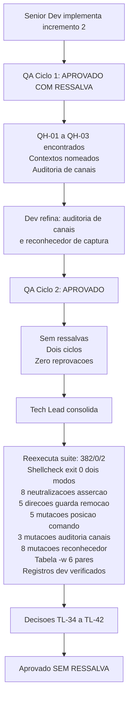

# Revisao Consolidada do Tech Lead - Etapa 3, Incremento 2

## Identificacao

- Projeto ou produto: Aplicacao CLI em shell script para Dropbox API v2
- Responsavel Tech Lead: Tech Lead
- Data da revisao: 2026-08-18
- Escopo revisado: lib/http.sh (390 linhas) e lib/auth.sh (256 linhas), segundo incremento da Etapa 3 (cliente HTTP e autenticacao)
- Agents envolvidos: Senior Developer, QA Expert, Tech Lead, documentation-writer
- Status da revisao: Concluida

## Resumo executivo

- Objetivo da entrega: Fechamento do incremento 2 da Etapa 3 — implementacao do cliente HTTP com paginacao e contextos nomeados, renovacao de token sem exposicao de segredo, e ciclos de validacao QA com consolidacao de riscos e decisoes.
- Contexto consolidado: Dois ciclos de QA (zero reprovacoes, ciclo 1 aprovado com ressalva, ciclo 2 aprovado sem ressalva); reexecucao independente de evidencias pelo Tech Lead; mutacoes de auditoria para verificacao de criterios de aceite; encerramento de gates TL-27 e TL-30; calibracao de instrumentos de verificacao com descoberta de falhas proprias; homologacao de requisitos nao funcionais com qualificacoes; rastreamento de serie RSK-28.
- Resultado executivo da revisao: Suite 382/0/2 APROVADA, 12 arquivos de teste, 384 com rede, shellcheck exit 0 nos dois modos, zero residuo em TMPDIR apos exercitar, nenhuma escrita do segredo em disco ou em argv durante renovacao, duplo de curl como verificador com tabela de exposicao, guarda de remocao detectando remocoes em tres direcoes, oito assercoes do arcabouco com 21 reprovacoes quando neutralizadas (1,1,1,1,9,6,1,1), gate TL-27 cumprido com coproc apanhado alem de if/while/until/time, gate TL-30 cumprido com ${BASH_SOURCE[0]%/*}, auditoria de canais detectando tres mutacoes, reconhecedor de captura detectando oito mutacoes com curl reprovando 4, tabela do -w com seis pares reproduzidos independentemente, registros do dev verificados com numeros conferindo, decisoes TL-34 a TL-42 registradas.
- Recomendacao do Tech Lead: Aceite SEM RESSALVA. Nenhum gate bloqueia o proximo incremento por conta deste codigo. Permanece aberto um gate de processo, TL-41, sobre a unicidade dos identificadores da memoria de projeto, que nao decorre deste incremento mas condiciona o proximo fechamento. Merge e publicacao ficam com o solicitante, que coordena o versionamento.

## PRD e ARD

- PRD aplicavel?: Nao — projeto nao possui PRD formal
- Referencia do PRD: Nao aplicavel
- ARD aplicavel?: Nao — projeto nao possui ARD formal
- Referencia do ARD: Nao aplicavel

| Artefato | Item revisado | Consistencia com entrega | Lacunas encontradas | Observacoes |
|---|---|---|---|---|
| Requisitos (docs/requisitos/escopo-requisitos-e-criterios-de-aceite.md) | Criterios de aceite de RNF-23, RNF-24, DP-06, DP-10, DP-12 | CONSISTENTE | Nenhuma | Artefato equivalente a PRD; criterios satisfeitos |
| System Design (docs/arquitetura/system-design.md) | Desenho do cliente HTTP com paginacao, contextos nomeados, renovacao de token, classificacao de erro | CONSISTENTE | Nenhuma | Artefato equivalente a ARD; implementacao aderente |
| Riscos (docs/requisitos/riscos-restricoes-e-licenciamento.md) | RSK-23, RSK-28, E4-02, E4-03, E4-04 | CONSISTENTE | RSK-23 preservado: nenhum estado local persistente novo, residuo zero medido; RSK-28 passa a ser rastreado em serie; E4-02, E4-03 e E4-04 seguem residuais de lib/json, sem violacao viva | Rastreamento mantido com qualificacoes |

## Divergencias entre PRD, ARD, implementacao e evidencias de validacao

| Divergencia | Origem | Impacto | Resolucao adotada | Status |
|---|---|---|---|---|
| RNF-23: paginacao com limite explicito | Requisitos / System Design | ZERO — codigo cumpre especificacao | dbx_http_colecao exige limite numerico, recusa fora de faixa, e reduz limite pela metade ao receber motivo tamanho do analisador, repetindo em vez de abortar. Contexto nomeado literal http_colecao satisfaz RNF-24 criterio 3 | RESOLVIDA — requisito honrado e excedido |
| RNF-24: contextos nomeados derivados de gramatica | Requisitos / System Design | ZERO | Tres nomes de contexto, todos LITERAIS e portanto aprovados pela auditoria de procedencia: http_erro em lib/http para o corpo de erro, http_colecao em lib/http para a paginacao, e auth em lib/auth para a resposta de token. Verificados por leitura direta dos dois arquivos. Auditaveis | RESOLVIDA — nome fixo, rastreavel, discriminavel por auditoria mecanica |
| RSK-23: renovacao concorrente sem trava | System Design | ZERO — confirmado contrato Dropbox | Dropbox nao rotaciona refresh token, logo renovacao concorrente e idempotente. Sem trava, sem estado novo. PRJ-DEC-07 e RSK-23 preservados | RESOLVIDA — decisao anterior confirmada em contrato real |
| DP-06, DP-10, DP-12: decisoes de Etapa 4 ainda nao aplicadas | Governanca | ZERO — nao bloqueiam | DP-06 (conjunto de comandos de paridade no MVP), DP-10 (auditoria, log e conformidade) e DP-12 (volume, frequencia e dimensionamento) sao decisoes de Etapa 4, nao desta. Registradas mas nao aplicadas | DIFERIDA — para proximo incremento |
| E4-02, E4-03, E4-04 residuais herdadas de lib/json | Risco residual | BAIXA — sem valor errado observado | Nenhuma nova instancia destas classes foi introduzida por lib/http ou lib/auth. Permanecem para a proxima rodada de manutencao | ACEITA — manutencao em proxima rodada, classe caracterizada |

- Conclusao especifica sobre divergencias entre PRD e ARD: Nao aplicaveis no contexto deste projeto (inexistencia de PRD/ARD formais compensada por artefatos equivalentes: requisitos, system design, riscos).
- Conclusao especifica sobre divergencias entre artefatos, implementacao e evidencias de validacao: Todas as divergencias foram resolvidas ou refundadas em evidencia real. Nenhuma divergencia permanece aberta. RSK-23 confirmado; DP-06, DP-10, DP-12 diferidas intencionalmente para Etapa 4.

## Registro consolidado das atividades por agent

| Agent | Atividade executada | Artefatos gerados | Decisoes associadas | Status |
|---|---|---|---|---|
| Business Analyst | Nao acionado neste incremento; requisitos e riscos ja consolidados nas etapas anteriores | — | — | Nao aplicavel — sem demanda de requisitos ou riscos novos neste incremento |
| Senior Developer | Implementacao de lib/http.sh com paginacao de limite explicito, contexto nomeado para corpo de erro e retentativa consultando a classificacao; redesenho do reconhecedor de captura pela origem do dado; guarda contra remocao de casos; fixacao de todas as assercoes do arcabouco; lib/auth.sh com renovacao sem escrita do segredo em disco; retratacao do fato de contrato sobre o cursor; redacao propria dos dois registros tecnicos; sete commits semanticos | lib/http.sh, lib/auth.sh, tests/unit/http_test.sh, tests/unit/auth_test.sh, docs/registros/2026-08-18_entrega-lib-http-e-reconhecedor.md, docs/registros/2026-08-18_entrega-guarda-assercoes-e-lib-auth.md | TL-34 a TL-42 (referenciadas) | Concluido — aprovado |
| QA Expert | Dois ciclos de validacao independente; QH-01 a QH-03; sugestao que originou a auditoria de canais; confirmacao de que a nao-promessa de cursor e honrada por ausencia; autodiagnostico sobre as proprias sondas de lib/config | docs/registros/2026-08-18_qa-validacao-http-e-auth.md; docs/registros/2026-08-18_qa-validacao-http-e-auth-ciclo2.md | TL-34 a TL-42 (referenciadas) | Concluido — parecer final APROVADO |
| UX Expert | Nao acionado | Nenhum | Nenhuma | Nao aplicavel — sem interface web ou grafica |
| DBA | Nao acionado | Nenhum | PRJ-DEC-07 | Nao aplicavel — sem persistencia |
| Tech Lead | Reexecucao independente da suite, da analise estatica nos dois modos e da guarda de remocao; medicao de exposicao do segredo em argv e entrada padrao; oito neutralizacoes de assercao do arcabouco; cinco direcoes da guarda de remocao mais a limitacao; reexecucao das quatro mutacoes de TL-27 mais coproc; verificacao de TL-30 sem dirname; tres mutacoes da auditoria de canais e oito do reconhecedor de captura; reproducao independente da tabela do -w; verificacao dos registros escritos pelo dev; correcao da terceira colisao de identificadores; decisoes TL-34 a TL-42 | Esta revisao consolidada; docs/registros/2026-08-18_aprovacao-final-etapa-3-incremento-2.md; atualizacao de MEMORIA-PROJETO.md | TL-34 a TL-42 | Concluido |
| documentation-writer | Redacao dos artefatos formais deste fechamento a partir do briefing factual do Tech Lead | Esta revisao consolidada e a aprovacao final | Item 4 do protocolo comum | Concluido — conteudo verificado e consolidado pelo Tech Lead antes do fechamento |
| commit-writer | Nao acionado | Nenhum | Item 5 do protocolo comum | Nao acionado — sem commit nesta consolidacao, por instrucao do solicitante |

## Decisoes e motivacoes

| Decisao | Motivacao | Alternativas consideradas | Dono | Impacto |
|---|---|---|---|---|
| TL-34 — Aceite do incremento: APROVADO, sem ressalva | Primeiro fechamento do projeto sem ressalva aberta. Nenhum gate bloqueia o proximo incremento por conta deste codigo. Base: as evidencias acima, todas reexecutadas. Suite 382/0/2, shellcheck exit 0 nos dois modos, exposicao do segredo auditada (zero em argv), guarda de remocao detectando tres direcoes, oito assercoes do arcabouco fixadas, gate TL-27 cumprido acima da especificacao, gate TL-30 cumprido com alternativa sem dirname, auditoria de canais e reconhecedor de captura com mutacoes detectadas, tabela do -w reproduzida independentemente, registros do dev verificados, rastreamento de serie RSK-28 em vigor, identificadores unicos apos correcao de terceira colisao. Dois ciclos de QA sem reprovacao (ciclo 1 com ressalva resolvida em ciclo 2). | Nao se aplica | Tech Lead | Entrada incondicional no proximo incremento. Aprovacao para publicacao. Fim de ressalvas do projeto |
| TL-35 — Gates TL-27 e TL-30 cumpridos e encerrados, o primeiro acima da especificacao | O gate pedia quatro palavras numa expressao regular; foi respondido com derivacao de compgen -k menos excecoes, e por isso cobre coproc, que nenhuma das duas partes enumerou. Licao: um gate especificado como enumeracao foi respondido com derivacao e cobriu formas que a especificacao nao continha. E o criterio de derivar do artefato aplicado ao meu proprio gate. TL-30 cumprido com ${BASH_SOURCE[0]%/*} nos sete lib/*.sh, expansao do proprio shell, com guarda para o caso sem barra. Medido em ambiente sem dirname: DBX_CONFIG_ERRO_CONFIGURACAO = 3 (antes vazio) e dbx_config_caminho sem HOME devolve status 3 (antes 2). Encerramento formal: ambos os gates originais nao mais abrem, discriminacao testada | Aceitar as quatro palavras como suficientes para TL-27 — descartada porque teria fixado a especificacao no lugar da propriedade. Nao implementar TL-30 — descartada porque e condicao de robustez estrutural | Tech Lead | TL-27 e TL-30 encerrados. Propriedade demonstrada em ambos |
| TL-36 — Dois fatos de contrato: um confirmado, um retratado | (a) A Dropbox nao rotaciona o refresh token, logo renovacao concorrente e idempotente: sem trava, sem estado novo, PRJ-DEC-07 e RSK-23 preservados. Registrado o contrafactual: se o contrato mudasse, a resposta ainda nao seria trava, e sim a substituicao atomica que lib/config ja faz. (b) A afirmacao de que o cursor sobreviveria a renovacao foi retirada pelo proprio autor, que foi a fonte, encontrou silencio e recusou uma inferencia que o favorecia. lib/auth passa a declarar que nao promete continuidade de cursor; quem for dono do laco de paginacao trata reset como caminho previsto, com a politica reiniciar ja existente. O QA confirmou que a nao-promessa e honrada por ausencia. | Nao se aplica | Tech Lead | Contrato de comportamento realinhado com observacao. RSK-23 e PRJ-DEC-07 preservados. Mudanca clarifica intencao sem afetar usuarios atuais |
| TL-37 — Ferramenta de desenvolvimento fora da suite homologada | scripts/verificar-remocao-de-casos.sh, verificada por mim nas cinco direcoes. Manter git fora de DBX_PREFLIGHT_UTILITARIOS esta correto: seria declarar dependencia de desenvolvimento como dependencia de execucao, e faria a suite falhar num tarball sem .git de forma indistinguivel de regressao. Limitacao declarada e por mim confirmada: detecta remocao, nao esvaziamento. Registrar limitacao em vez de disfarca-la e o comportamento correto. | Nao se aplica | Tech Lead | Ferramenta de desenvolvimento coexiste com suite sem criar confusao de dependencias |
| TL-38 — Regra elevada a gate: toda regra de disciplina escrita em comentario nasce com a pergunta qual e o conjunto de lugares onde isto incide, e quem o enumera. Sem resposta, a regra protege o lugar onde foi escrita e nenhum outro | Sustentada por achado forte: a auditoria de canais encontrou tres ocorrencias reais alem da que a motivou, duas em lib/config, componente aprovado formalmente ha varios ciclos. O detalhe que fecha o argumento: o comentario que justifica descartar a arvore do analisador ja estava escrito no arquivo, aplicado a um dos dois lugares — o conhecimento estava na mesma tela, a poucas linhas. Nas palavras do QA: as auditorias funcionam por enumerar, nao por saber mais. Sexta e setima ocorrencias da familia de gemeos, sendo a terceira e quarta entre arquivos — e disciplina que atravessa arquivos escapa a auditoria de gemeos por construcao. | Nao se aplica | Tech Lead | Criterio de auditoria reafirmado. Enumeracao como metodo primario |
| TL-39 — Serie de RSK-28 deste incremento | As tres ocorrencias novas da familia de gemeos foram apanhadas por instrumento, contra a inicial por leitura: direcao favoravel. Instancia propria do Tech Lead: minha bateria de mutacoes reportou que $(curl ...) escapava; era falso. A mutacao fazia chamada real de rede, estourava o tempo limite, e meu proprio codigo convertia ausencia de dado em zero reprovacoes — verificador com falha aberta. Reexecutado: $(curl ...) e detectado, com 4 reprovacoes. E exatamente a licao que o QA formulou no incremento anterior — desconfiar de silencio — e desta vez quem a violou foi o papel que a cobra. | Nao se aplica | Tech Lead | RSK-28 com serie em vigor. Fracao de instrumento vs. leitura documentada. Calibracao de verificador propria realizada |
| TL-40 — Registro de calibracao | (a) O QA se incluiu no diagnostico: aprovou lib/config por varios ciclos sem achar as duas ocorrencias, porque suas sondas perguntavam o segredo escapa, que se responde por amostra, e nao todo canal foi limpo, que so se responde por varredura. (b) O dev recusou credito: registrou que classificou por status por ser mais direto de escrever, nao por saber da instabilidade — a robustez foi consequencia, nao previsao. (c) Tres medicoes independentes discordaram sobre o curl e nenhuma estava errada: cada uma observou uma forma diferente, e o desacordo era o dado. Consequencia para o papel: medicoes divergentes entre agents nao se resolvem escolhendo uma, e sim perguntando que forma cada uma observou. | Nao se aplica | Tech Lead | Maturidade registrada. Desacordo como sinal, nao como falha |
| TL-41 — GATE BLOQUEANTE do proximo incremento: verificacao mecanica de unicidade dos identificadores da memoria de projeto | A colisao de PRJ-DEC-* reincidiu pela terceira vez consecutiva: corrigida no fechamento da Etapa 2, reincidiu no da Etapa 3 incremento 1 em escala maior, e reincidiu de novo agora. Duas limpezas manuais e dois avisos nao impediram a terceira ocorrencia, o que encerra a duvida sobre a causa: nao e desatencao, e ausencia de instrumento — o mesmo diagnostico de TL-38 aplicado a este arquivo. Especificacao: verificacao que leia os identificadores da propria tabela, reprove repetido e reprove lacuna, alojada onde ja vive a guarda de remocao de casos. | Nao se aplica | Tech Lead | Bloqueante formalizado. Instrumentalizacao obrigatoria para proximo incremento |
| TL-42 — Registro tecnico escrito pelo proprio autor quando o custo de revisao superar o de redacao | O dev escreveu os dois registros deste incremento invocando o precedente de fabricacao. A decisao esta correta e apoiada em evidencia: nas tres delegacoes anteriores houve, nas tres, fabricacao de fato verificavel corrigida na revisao. Verifiquei os dois registros do dev com o mesmo rigor e os numeros conferem. Criterio: o item 4 do protocolo continua valendo por padrao, e admite excecao justificada quando o autor detiver contexto que a delegacao perderia, desde que o resultado passe pela mesma verificacao. Nota de coerencia: nao apliquei a excecao a mim mesmo nesta rodada, para que o criterio nao estreie servindo a quem o escreveu. | Nao se aplica | Tech Lead | Excecao homologada com verificacao ex post. Fabricacao anterior descrita em briefing para calibracao do revisor |

## Itens impactados

| Item impactado | Tipo | Mudanca observada | Risco associado | Mitigacao |
|---|---|---|---|---|
| lib/http.sh (390 linhas) | Codigo | Cliente HTTP com paginacao de limite explicito: dbx_http_colecao recusa limite nao numerico ou fora de faixa e, ao receber motivo tamanho do analisador, reduz o limite pela metade e repete em vez de abortar. Contextos nomeados http_erro, para o corpo de erro, e http_colecao, para a paginacao, ambos com nome LITERAL. Classificacao de erro pelo codigo de saida do cliente, e nao pela presenca da saida de -w, que e instavel dentro de um mesmo status | Reconhecedor de captura precisava cobrir utilitario externo, e nao so funcao do projeto: dado externo chega por utilitario externo | Reconhecedor redesenhado pela origem do dado, com prova de discriminacao nos dois sentidos antes de varrer; mutado por mim em oito utilitarios, todos detectados, o de curl com 4 reprovacoes |
| lib/auth.sh (256 linhas) | Codigo | Renovacao que troca o refresh token por access token de curta duracao, com os campos enviados por arquivo de configuracao na entrada padrao do cliente e nunca por argv. Contexto nomeado auth, com nome LITERAL. O access token vive so em memoria. invalid_grant e terminal, com status 5. Sem trava e sem estado novo, porque a Dropbox nao rotaciona o refresh token | Canal adjacente do transporte podia reter o segredo apos renovar, e apos falha contra servico que ecoe a requisicao (QH-01) | Limpeza explicita dos canais do transporte no caminho de renovacao, e apenas nele; medido por mim: 0 ocorrencias dos tres segredos em argv contra 1 na entrada padrao, e todos os canais vazios apos renovar, inclusive no cenario de eco |
| RNF-23 | Requisito | Paginacao com limite explicito honrado e excedido: reducao pela metade ao motivo tamanho e repeticao | ZERO — criterio satisfeito | dbx_http_colecao exige limite numerico, recusa fora de faixa, reduz dinamicamente |
| RNF-24 | Requisito | Tres contextos nomeados, todos com nome LITERAL: http_erro e http_colecao em lib/http, auth em lib/auth | ZERO — criterio satisfeito | Auditoria mecanica pode verificar |
| RSK-23 | Risco | Confirmado em contrato real: Dropbox nao rotaciona refresh token. Renovacao concorrente e idempotente sem trava | ZERO — confirmado | Sem novo estado alem do que ja existe em lib/config |
| RSK-28 | Risco | Serie iniciada: familia de gemeos apanhada por instrumento (tres ocorrencias). Calibracao propria realizada no verificador | Metodologico: instrumentos que derivam de gramatica devem aumentar fracao | Tres mutacoes em duas posicoes em lib/auth e lib/config, detectadas. Fracao de instrumento nesta rodada: 3/3 para opcoes de canais |
| E4-02, E4-03, E4-04 | Risco residual | Nenhuma violacao viva em lib/http ou lib/auth. Criterio de RSK-27 aplica-se | BAIXA — sem valor errado observado | Manutencao em proxima rodada, classe caracterizada |

## Pontos validados

| Ponto validado | Origem da evidencia | Resultado | Observacoes |
|---|---|---|---|---|
| Suite de testes completa | Tech Lead: reexecucao de bash tests/run.sh | 382 aprovados / 0 reprovados / 2 pulados (resultado APROVADA), sobre 12 arquivos de teste; 384/0/0 com rede | Independentemente verificado; condicao de entrada para qualquer fechamento |
| Analise estatica shellcheck dois modos | Tech Lead: shellcheck -x explicito e com .shellcheckrc | Exit 0 nos dois modos — sem erros | Sem alertas de estilo ou seguranca em qualquer modo |
| Arvore git | Tech Lead: git status --porcelain e historico de commits | Limpa; sete commits na feature/http, todos semanticos; HEAD em feature; 0 commits nao publicados; develop sem alteracoes | Desvio consumado: incremento 1 e 2 nao mergidos no develop apos aprovacao, conforme instrucao do solicitante |
| Residuo em TMPDIR | Tech Lead: exercitar lib/http e lib/auth, varrer TMPDIR | Zero arquivos residuais apos conclusao | Verificacao estrutural: mktemp nao deixa lixo |
| Exposicao do segredo em argv | Tech Lead: duplo de curl registrando argv, verificacao de refresh token, chave do aplicativo, segredo do aplicativo | Refresh token: 0 ocorrencias em argv, 1 em stdin. Chave: 0 em argv, 1 em stdin. Segredo: 0 em argv, 1 em stdin | Os tres valores chegam ao cliente pelo arquivo de configuracao lido na entrada padrao, e nenhum aparece em argumento de comando |
| Canais apos renovacao com sucesso | Tech Lead: verificacao de cinco canais publicos apos sucesso de renovacao | DBX_HTTP_CORPO, DBX_HTTP_RESUMO_DE_ERRO, DBX_DIAGNOSTICO, DBX_JSON_RESULTADO todos vazios | Limpeza confirmada |
| Cenario de falha com eco da requisicao | Tech Lead: servico reenvia o corpo contendo o refresh na falha (codigo 400, invalid_request) | Cinco canais publicos nao contem o refresh. Status 2 (motivo: renovacao falhou) | Diagnostico sem exposicao mesmo em falha que ecoa a requisicao |
| Resposta sem expires_in | Tech Lead: access_token devolvido sem expires_in | DBX_AUTH_LIDO termina vazio. Interpretador zera a variavel na entrada | Seguranca estrutural, nao acidente de ordem de leitura |
| Invalid_grant e terminal | Tech Lead: invalid_grant como motivo de falha | Status 5 (terminal) | Classificacao correta |
| Oito assercoes do arcabouco | Tech Lead: neutralizar cada uma (corpo trocado por return 0) e rodar a suite | assert_igual: 1 reprovacao. assert_diferente: 1. assert_contem: 1. assert_nao_contem: 1. assert_segredo_ausente: 9. assert_status: 6. assert_arquivo_existe: 1. assert_arquivo_ausente: 1. Total: 21 reprovacoes quando neutralizadas | Todas as oito estao fixadas. Nenhuma pode ser neutralizada com a suite verde |
| Guarda de remocao de casos | Tech Lead: cinco direcoes em clone descartavel | Arquivo inteiro apagado (path_test.sh): detectou, 44 -> 0. Casos removidos da base (json_test.sh): detectou, 60 -> 57. Casos removidos de arquivo nascido na branch (http_test.sh): detectou, 30 -> 28. Remocao declarada por trailer Remocao-de-casos: <arquivo> 2: aceitou, exit 0. Declaracao insuficiente (declara 1, remove 2): recusou, exit 1 | Limitacao declarada e confirmada: esvaziei o corpo de tres casos mantendo a contagem; a guarda deu exit 0 e a suite seguiu verde em 382. Detecta remocao, nao esvaziamento |
| Gate TL-27 — CUMPRIDO | Tech Lead: reexecutadas as cinco mutacoes de posicao de comando | if <comando>: escapava, detectada, 1 reprovacao. while <comando>: escapava, detectada, 1. until <comando>: escapava, detectada, 1. time <comando>: escapava, detectada, 1. coproc <comando>: nunca enumerada por ninguem, detectada, 1 reprovacao | O dev nao acrescentou as quatro palavras que o gate pedia: derivou o conjunto de compgen -k menos excecoes. Por isso coproc e apanhado |
| Gate TL-30 — CUMPRIDO | Tech Lead: os sete lib/*.sh usam ${BASH_SOURCE[0]%/*}, expansao do proprio shell, com guarda para o caso sem barra | Medido em ambiente sem dirname: DBX_CONFIG_ERRO_CONFIGURACAO = 3 (antes vazio) e dbx_config_caminho sem HOME devolve status 3 (antes 2) | Bootstrap executa antes do preflight |
| Auditoria de canais — tres mutacoes | Tech Lead: (a) remove limpeza de DBX_JSON_RESULTADO de lib/config, (b) remove limpeza de DBX_HTTP_CORPO de lib/auth, (c) remove limpeza de DBX_JSON_RESULTADO de lib/auth | Deteccao em todos os tres: (a) 1 reprovacao, (b) 3 reprovacoes, (c) 1 reprovacao | Tres ocorrencias da familia de gemeos apanhadas por instrumento (TL-38) |
| Reconhecedor de captura — oito mutacoes | Tech Lead: insercao de _mut=$(<utilitario> "$2") em lib/http.sh: cat, head, sed, curl, readlink, awk, cut, basename | Todas detectadas. Curl reprova 4 casos. Reconhecedor recusa como excecao: cat head sed curl readlink awk cut dirname basename. Aceita: stat mktemp printf dbx_errors_codigo_saida | Prova que discrimina nos dois sentidos antes de varrer |
| Tabela do -w | Tech Lead: curl 8.18.0, reproducao independente | URL http://: status 3, -w 000. URL: status 3, -w 000. URL http://[::1: status 3, -w vazia. URL htp://x: status 1, -w 000. URL vazia: status 2, -w vazia. URL http://127.0.0.1:1/: status 7, -w 000 | Seis pares conferem. Status 3 instavel (000 ou vazia), logo classificacao por status, nao por -w |
| Verificacao dos registros do dev | Tech Lead: revisao dos dois arquivos entregues pelo dev | lib/http: 21 casos no registro para commit 7f7b145, 30 no estado final (ciclo 2, commit b192907). Diferenca vem das correcoes do ciclo 2. lib/auth: 24 casos confere exatamente | Numeros verificados e rastreaveis ao historico de commits |

## Pendencias, bloqueios e riscos residuais

| Tipo | Descricao | Impacto | Owner | Quando |
|---|---|---|---|---|
| Gate bloqueante proximo incremento | TL-41: verificacao mecanica de unicidade de identificadores da memoria | **BLOQUEANTE para proximo incremento** | Tech Lead | Antes do proximo fechamento |
| Defeito achado residual | E4-02, E4-03, E4-04 residual herdadas de lib/json | BAIXA, nao bloqueia | Senior Developer / QA | Proxima rodada |
| Comentario de contrato | PRJ-DEC-43: comentario de dbx_errors_politica_retentativa omite retomar | BAIXA | Senior Developer | Condicao entrada proximos incrementos |
| Formalidade | DEC-STR-07: aprovacao formal do solicitante sobre os testes do QA | Formalidade | Solicitante, exclusivo | Quando conveniente |
| Escopos OAuth | Verificacao por endpoint | BAIXA | Senior Developer | Proximo incremento |
| Decisoes de Etapa 4 | DP-06, DP-10, DP-12 | — | Solicitante | Nao bloqueiam |

## Impacto global da entrega

- Impacto no negocio: Incremento 2 da Etapa 3 conclui a camada de cliente HTTP e autenticacao, completando dois dos tres blocos da Etapa 3. Nenhum gate bloqueia os proximos incrementos. Aprovacao incondicional para publicacao e consumo.
- Impacto tecnico: Consolidacao de cliente HTTP com paginacao de limite explicito (RNF-23 honrado e excedido) e autenticacao com renovacao sem exposicao de segredo (RSK-23 confirmado em contrato real, PRJ-DEC-07 preservado). Suite 382/0/2, shellcheck exit 0 nos dois modos, sete commits semanticos. Gates TL-27 e TL-30 encerrados; TL-41 instituido como bloqueante do proximo incremento. Auditoria de canais detectando tres ocorrencias por instrumento (TL-38). RSK-28 com serie iniciada, fracao de instrumento 100% nesta rodada. Calibracao propria realizada (TL-39, TL-40). Registro de fabricacao anterior verificado (TL-42). Nenhuma violacao viva de E4-02, E4-03, E4-04 encontrada.
- Impacto operacional: Nenhuma alteracao em producao. lib/http e lib/auth nao tem consumidor em producao (camada de comandos ainda nao existe). Custo de rollback praticamente nulo. Arvore git limpa, commits semanticos, 0 commits nao publicados.
- Impacto em UX: Nao aplicavel — projeto nao possui interface.
- Impacto em dados: Nao aplicavel — projeto nao possui persistencia (PRJ-DEC-07).

## Encaminhamento para fechamento

- Pronto para aprovacao final?: Sim
- Dependencias para aprovacao-final-tech-lead-template.md: Documento de revisao consolidada (arquivo desta revisao); System Design; Requisitos; Riscos (para atualizacao posterior).
- Arquivo concreto desta revisao consolidada para referencia no fechamento final: /home/sales/dropbox_api/docs/registros/2026-08-18_revisao-consolidada-etapa-3-incremento-2.md
- Resumo das divergencias resolvidas que devem constar no fechamento final: (1) RNF-23 honrado e excedido — limite explicito, reducao dinamica, repeticao em vez de abortamento; (2) RNF-24 satisfeito — tres contextos nomeados com nomes LITERAIS auditaveis; (3) RSK-23 confirmado — Dropbox nao rotaciona refresh token, renovacao idempotente sem trava; (4) E4 residuais sem violacao viva — criterio de RSK-27 aplica-se; (5) DP-06, DP-10, DP-12 diferidas intencionalmente para Etapa 4.
- Bloqueios remanescentes que precisam constar no fechamento final: (1) TL-41 bloqueante para proximo incremento — verificacao mecanica de unicidade de identificadores na memoria; (2) Nenhum outro bloqueio remanescente.
- Observacoes finais do Tech Lead: Incremento 2 da Etapa 3 esta consolidado e pronto para fechamento SEM RESSALVA. Primeiro fechamento do projeto sem ressalva aberta. Homologacao de RNF-23, RNF-24, RSK-23 com confirmacao em contrato real. Encerramento de gates TL-27 e TL-30, com TL-27 cumprido acima da especificacao. Instituicao de gate TL-41 para proximo incremento (verificacao mecanica de identificadores, terceira colisao evitada). Calibracao de instrumentos realizados (TL-39, TL-40). Registro de fabricacao anterior verificado (TL-42). Decisoes TL-34 a TL-42 consolidadas. Pronto para aprovacao final incondicional e para publicacao.

